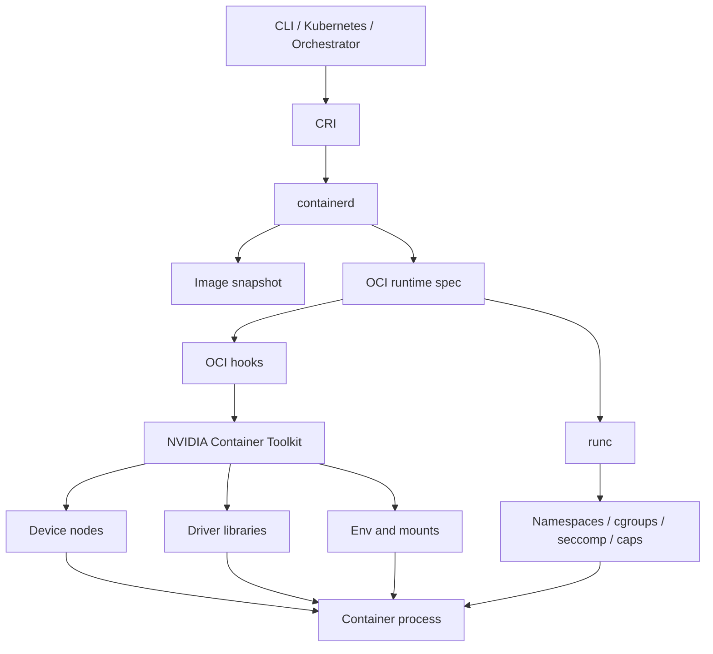
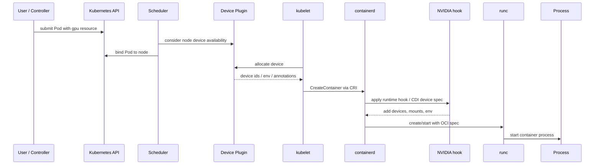

# 第18b章：容器运行时与设备注入

> 容器运行时的核心矛盾是：进程要被隔离，但 AI 进程又必须受控地访问 GPU、MIG、RDMA、NVMe、共享内存和宿主机驱动能力。运行时层决定了“硬件能力如何进入容器”，也决定了生产环境能不能做到最小权限。

> **关联章节**：镜像和 CUDA 兼容矩阵见 [第18a章](./18a-ai-images-and-cuda-compatibility.md)；镜像供应链治理见 [第18c章](./18c-artifact-supply-chain-and-image-governance.md)；设备和运行时故障排查见 [第18d章](./18d-runtime-troubleshooting.md)；Kubernetes Device Plugin 和调度链路见 [第19章](./19-kubernetes-for-ai.md)。

## 18b.1 第一性原理拆解 + 学习大纲

### 拆：运行时到底在解决什么问题

容器运行时要解决的不可化简问题是：

**把一个进程放进受限的文件系统、进程空间、网络空间、挂载空间和资源配额里，同时只暴露它运行 AI 工作负载所需的硬件设备、驱动接口和内核能力。**

普通服务容器主要依赖 CPU、内存、网络和文件系统。AI 容器还可能需要：

- `/dev/nvidia*` GPU 设备节点。
- MIG compute instance 或 GPU instance。
- NVIDIA Driver userspace library。
- `/dev/infiniband/*` RDMA/InfiniBand/RoCE 设备。
- NVMe 本地盘或特定挂载路径。
- 大 `/dev/shm`。
- memlock、HugePages、IPC 能力。
- 拓扑信息、NUMA 亲和、NIC/GPU 近邻关系。

隔离太强，容器看不到设备；权限太大，容器接近宿主机；注入不完整，应用报出的却可能只是 `CUDA unknown error`、`NCCL timeout` 或 `operation not permitted`。所以运行时不是 Docker 命令的细节，而是 AI 平台硬件访问边界的执行面。

### 推：为什么会有 OCI、hook 和设备注入

从“隔离进程”出发，会得到 namespace、cgroup、mount、seccomp、capability。它们定义进程能看到什么、能用多少资源、能调用哪些系统能力。

从“镜像要跨运行时可用”出发，会得到 OCI Image 和 OCI Runtime Spec。镜像格式和容器创建规范标准化后，containerd、CRI-O、Docker、runc、Kata 等组件才能协作。

从“容器要访问 GPU，但 Driver 不在镜像里”出发，会得到 NVIDIA Container Toolkit。它在容器启动时根据分配结果，把 GPU 设备节点、驱动库、环境变量和部分配置注入容器。

从“硬件不只是整卡 GPU”出发，会得到 MIG、RDMA、NVMe、HugePages、shared memory 的专门注入路径。不同设备的控制面、权限模型和验证方法不同，不能用一个 `privileged: true` 统统解决。

从“生产要最小权限”出发，会得到受控 RuntimeClass、Device Plugin、cgroup device allowlist、capability 白名单、hostPath 准入和 debug 权限审批。

### 绘：运行时执行链路



### 导：本章学习大纲

读完本章，你应该能回答：

1. containerd、runc、OCI spec、NVIDIA Container Toolkit 分别处于哪一层？
2. 容器看到 GPU 至少需要哪些设备节点、动态库、环境变量和 cgroup 权限？
3. Runtime hook 是什么，为什么 GPU 注入通常发生在容器创建路径上？
4. Device Plugin 和 NVIDIA Container Toolkit 的边界是什么？
5. MIG 的注入和整卡 GPU 有什么不同？
6. RDMA、NVMe、HugePages、`/dev/shm` 分别通过什么方式进入容器？
7. cgroup device allowlist 如何影响设备访问？
8. rootless、privileged、capability、hostPath、hostPID、hostNetwork 的安全边界是什么？
9. 如何设计 AI 容器的最小权限基线？
10. 遇到 GPU/RDMA/NVMe 不可用时，如何按运行时链路排障？

## 18b.2 概念先说清楚

### 容器运行时是什么

容器运行时不是单一进程，而是一组职责：

- 管理镜像拉取和解包。
- 准备 root filesystem。
- 生成或消费 OCI Runtime Spec。
- 配置 namespace、cgroup、mount、capability、seccomp。
- 执行 runtime hook。
- 启动容器进程。
- 管理容器生命周期和退出状态。

在 Kubernetes 中，常见路径是：

```text
kubelet
  -> CRI
  -> containerd
  -> OCI runtime spec
  -> runc
  -> container process
```

AI 设备注入通常插在 “生成 OCI spec 到 runc 创建进程” 这条路径里。

### 容器运行时不是什么

| 误解 | 正确边界 |
|---|---|
| containerd 负责 GPU 调度 | 调度由 Kubernetes scheduler、Device Plugin 和资源声明完成 |
| runc 理解 `nvidia.com/gpu` | runc 只按 OCI spec 创建进程，不理解 Kubernetes 资源语义 |
| NVIDIA runtime 能修复 CUDA 镜像不兼容 | 它负责注入设备和驱动能力，不负责 PyTorch/CUDA wheel 选择 |
| `nvidia-smi` 成功就代表业务一定能跑 | 还要验证框架、NCCL、engine、权限和拓扑 |
| `privileged: true` 是 GPU 容器标准配置 | 这是绕开隔离的高权限配置，生产默认不应使用 |

### 相邻概念边界

| 概念 | 是什么 | 不负责什么 |
|---|---|---|
| OCI Image | 镜像层、config、manifest 的标准格式 | GPU 分配和设备注入 |
| OCI Runtime Spec | 容器进程、mount、env、devices、hooks 等规范 | 业务发布策略 |
| containerd | 镜像、快照、容器生命周期和 runtime 调用 | GPU Driver 实现 |
| runc | 按 OCI spec 创建 Linux 容器进程 | Kubernetes 资源调度 |
| NVIDIA Container Toolkit | 计算并注入 NVIDIA 设备、库和配置 | 镜像 CUDA 兼容治理 |
| Device Plugin | 向 Kubernetes 报告和分配设备资源 | 容器内 Python 包和动态库 |
| RuntimeClass | 为 Pod 选择特定 runtime handler | 自动创建 GPU 资源或修复 Driver |
| CDI | 用声明式方式描述设备注入 | 不替代硬件健康和调度策略 |
| cgroup | 限制和统计资源，控制设备访问 | 不安装设备驱动 |

### Device Plugin 与 Runtime Hook 的区别

最常见的混淆是把 Device Plugin 和 NVIDIA Container Toolkit 当成一件事。

```text
Device Plugin：
  告诉 Kubernetes 节点上有哪些设备，并在 Pod 请求资源时分配设备。

Runtime Hook / NVIDIA Toolkit：
  在容器创建时把分配到的设备节点、驱动库和环境变量放进 OCI spec。
```

前者是编排层控制面，后者是容器启动执行面。GPU Pod 能否运行，需要两者都正确。

## 18b.3 架构：关键组件、控制路径与数据路径

### 关键组件

| 组件 | 责任 | AI 相关关注点 |
|---|---|---|
| kubelet | 调用 CRI 创建 Pod sandbox 和容器 | Pod spec、resources、securityContext |
| CRI | Kubernetes 与容器运行时接口 | runtime handler、sandbox 参数 |
| containerd | 管理镜像、snapshot、task、runtime | runtime 配置、NVIDIA handler、日志 |
| runc | 根据 OCI spec 创建容器进程 | devices、mounts、cgroup、caps |
| NVIDIA Container Toolkit | 注入 GPU 设备和 Driver 能力 | hook、`nvidia-container-cli`、capabilities |
| NVIDIA Device Plugin | 发现 GPU/MIG 并暴露资源 | 资源名、MIG strategy、health |
| RDMA Device Plugin | 发现 HCA/RDMA 设备并暴露资源 | `/dev/infiniband`、资源分配 |
| CSI/hostPath/local PV | 暴露 NVMe 或本地存储路径 | 权限、隔离、拓扑 |
| Admission Policy | 限制 privileged、hostPath、capability | 最小权限治理 |

### 控制路径：从 Pod spec 到容器进程



### 数据路径：容器如何调用 GPU

```text
application process
  -> framework or inference engine
  -> CUDA/NCCL/cuDNN userspace in image
  -> injected libcuda / driver userspace
  -> /dev/nvidia* device node
  -> host NVIDIA kernel driver
  -> GPU hardware
```

任何一环缺失，应用都可能失败。运行时层主要保证 `libcuda`、设备节点、mount、env、cgroup device allowlist 和权限边界正确。

### 责任边界

| 失败点 | 首要排查层 |
|---|---|
| Pod 没有被调度到 GPU 节点 | scheduler、Device Plugin、资源声明 |
| 容器内没有 `/dev/nvidia*` | Device Plugin 分配、runtime hook、OCI spec |
| `/dev/nvidia*` 存在但访问 denied | cgroup device allowlist、文件权限、securityContext |
| `nvidia-smi` 失败 | Driver 注入、宿主机 Driver、utility capability |
| `nvidia-smi` 成功但 torch 失败 | 镜像 CUDA/框架兼容，见 18a |
| RDMA 设备存在但 NCCL timeout | memlock、NIC 选择、GID/MTU、fabric、rank 状态 |
| NVMe 挂载路径错误 | volume/CSI/hostPath、权限、节点拓扑 |

## 18b.4 原理：OCI、namespace、cgroup 与 device 权限

### OCI Runtime Spec 的核心字段

OCI spec 可以简化理解为“runc 创建容器进程的说明书”。AI 容器最关心这些字段：

| 字段 | 作用 |
|---|---|
| `process.args` | 容器入口命令 |
| `process.env` | CUDA/NVIDIA/NCCL 等环境变量 |
| `process.capabilities` | Linux capability |
| `root.path` | 容器 root filesystem |
| `mounts` | `/dev/shm`、驱动库、设备相关 mount |
| `linux.devices` | 注入的 device node |
| `linux.resources.devices` | cgroup device allow/deny 规则 |
| `linux.namespaces` | PID、mount、network、IPC、UTS、user namespace |
| `hooks` | prestart/createRuntime 等 hook |

GPU 注入的最终结果不是“容器多了一个参数”，而是 OCI spec 里多了 devices、mounts、env 和 cgroup 权限。

### namespace 负责“看见什么”

| namespace | 作用 | AI 相关点 |
|---|---|---|
| mount | 隔离挂载视图 | 驱动库、设备文件、NVMe 路径、`/dev/shm` |
| PID | 隔离进程号 | `hostPID` 只应调试使用 |
| network | 隔离网络栈 | RDMA/NCCL 有时要求特殊网络模式或 CNI |
| IPC | 隔离 System V IPC 和 POSIX shm | dataloader、NCCL、推理服务共享内存 |
| UTS | 隔离 hostname/domain | rank 命名和日志 |
| user | UID/GID 映射 | rootless 和 device 权限更复杂 |

### cgroup devices 负责“能访问什么”

Linux 设备节点是文件，但只看到文件不等于能访问。cgroup devices 控制容器进程能否对某类 device 做 read/write/mknod。

一个 GPU 容器通常需要：

- 设备节点存在于容器 mount namespace。
- 设备节点 major/minor 对应正确。
- cgroup allowlist 允许访问这些 major/minor。
- 文件权限或用户组允许当前用户访问。
- seccomp/capability 不阻断必要系统调用。

所以排障时不能只执行 `ls -l /dev/nvidia0`。设备存在但 cgroup 拒绝访问，也会失败。

### capability 与 privileged

Linux capability 是把 root 权限拆成多个较小能力。`privileged: true` 则基本绕过许多容器隔离限制，暴露全部或大量设备，并放宽 seccomp/cgroup/capability 限制。

AI 生产容器默认不应该 privileged。需要什么能力就授予什么能力，例如 RDMA 内存注册常见会涉及 memlock 配置和 `IPC_LOCK`，但这不代表需要 `SYS_ADMIN` 或 privileged。

## 18b.5 NVIDIA Container Toolkit：设备与库如何注入

### 它解决的问题

NVIDIA Container Toolkit 的目标是：

**让容器在不把宿主机 Driver 打进镜像的情况下，访问被分配的 NVIDIA GPU 和 Driver userspace 能力。**

它通常会处理：

- 根据可见设备配置选择 GPU 或 MIG 设备。
- 挂载 `/dev/nvidiactl`、`/dev/nvidia-uvm`、`/dev/nvidia-uvm-tools` 和具体 GPU device node。
- 注入或挂载 Driver userspace libraries，例如 `libcuda.so`、NVML 相关库。
- 设置或尊重 `NVIDIA_VISIBLE_DEVICES`。
- 根据 `NVIDIA_DRIVER_CAPABILITIES` 控制 compute、utility、video 等能力。
- 修改 OCI spec 中 devices、mounts、env、cgroup device 规则。

### 关键变量

| 变量 | 作用 | 常见问题 |
|---|---|---|
| `NVIDIA_VISIBLE_DEVICES` | 控制容器可见 GPU/MIG 设备 | 空值、UUID 错误、与调度结果不一致 |
| `NVIDIA_DRIVER_CAPABILITIES` | 控制暴露的驱动能力，如 `compute,utility` | 缺 `utility` 导致 `nvidia-smi` 不可用 |
| `CUDA_VISIBLE_DEVICES` | 框架层可见设备重映射 | 应用覆盖后设备数量不对 |
| `LD_LIBRARY_PATH` | 动态库搜索路径 | 手工覆盖导致加载错误库 |
| `NCCL_*` | NCCL 网络、调试和算法选择 | 掩盖 RDMA 注入或 fabric 问题 |

### 最小 GPU 注入验证

容器内验证建议分三层：

```bash
ls -l /dev/nvidia* || true
nvidia-smi
python3 - <<'PY'
import torch
print(torch.__version__)
print(torch.version.cuda)
print(torch.cuda.is_available())
print(torch.cuda.device_count())
PY
```

判断规则：

- `/dev/nvidia*` 不存在：优先查资源分配、runtime hook、OCI spec。
- `/dev/nvidia*` 存在但 `nvidia-smi` 失败：优先查 Driver 注入、utility capability、宿主机 Driver。
- `nvidia-smi` 成功但 PyTorch 失败：优先查 18a 的 CUDA/框架兼容。

### runtime hook 与 CDI

传统路径常通过 runtime hook 修改 OCI spec。更现代的设备注入也可以使用 CDI 这类声明式设备描述，让设备以标准化名称进入容器 spec。

不论实现是 hook 还是 CDI，生产关注点相同：

- 分配到哪些设备。
- 注入哪些 device node。
- 挂载哪些 host library。
- 设置哪些 env。
- cgroup 允许哪些 major/minor。
- 谁能修改这些注入规则。

## 18b.6 MIG 注入：不是“半张 GPU”这么简单

MIG 将支持的 NVIDIA GPU 切分成多个隔离的 GPU instance 和 compute instance。对平台来说，MIG 改变了资源粒度、设备枚举和调度语义。

### MIG 与整卡的差异

| 维度 | 整卡 GPU | MIG |
|---|---|---|
| 调度资源 | `nvidia.com/gpu: 1` | 如 `nvidia.com/mig-1g.10gb: 1` |
| 设备标识 | GPU UUID、minor number | MIG UUID、GI/CI 实例 |
| 显存 | 整卡显存 | 切片显存 |
| 隔离 | 进程共享整卡资源 | 硬件级分区，能力受 profile 限制 |
| 拓扑 | 物理 GPU 拓扑 | 还要映射到父 GPU |
| 运维 | 设备相对稳定 | 重建 MIG 会改变实例映射 |

### MIG 注入关注点

| 关注点 | 说明 |
|---|---|
| MIG strategy | 节点上 Device Plugin 如何暴露 MIG 资源 |
| 资源命名 | 业务请求具体 profile，而不是模糊请求 |
| UUID 记录 | 日志和指标记录 MIG UUID，便于排障 |
| 父 GPU 映射 | 性能和故障需要回到物理 GPU |
| 重配置窗口 | 改 MIG profile 通常影响节点上现有 workload |
| 监控维度 | 既看 MIG 实例，也看父 GPU 健康 |

### MIG 反直觉点

`cuda:0` 只是容器内可见设备序号，不代表物理机上的 GPU 0，也不代表固定 MIG 实例。生产日志应该记录 UUID，而不是只记录 index。

## 18b.7 RDMA、NVMe、HugePages 与 `/dev/shm` 注入

### RDMA / InfiniBand / RoCE

RDMA 容器通常需要：

- `/dev/infiniband/*` 设备节点。
- rdma-core userspace 库和工具。
- 足够 memlock。
- 正确网络接口、GID、MTU、RoCE/IB fabric 配置。
- NCCL 能选择正确 NIC。
- GPU/NIC 拓扑满足性能要求。

| 注入对象 | 说明 | 验证 |
|---|---|---|
| `/dev/infiniband/uverbs*` | verbs userspace 设备 | `ls -l /dev/infiniband` |
| rdma-core | verbs 库和工具 | `ibv_devinfo` |
| memlock | 内存注册限制 | `ulimit -l` |
| 网络接口 | NCCL socket/RDMA 选择 | `NCCL_DEBUG=INFO` |
| GPU/NIC 拓扑 | 跨 NUMA 会影响性能 | `nvidia-smi topo -m` |

RDMA 不通时，不要只调 NCCL 参数。先证明 verbs 在容器内可用，再看 NCCL 是否选对网络，再看 fabric。

### NVMe 本地盘

NVMe 可以通过多种方式暴露给容器：

| 方式 | 适用场景 | 风险 |
|---|---|---|
| hostPath 挂载目录 | 节点本地缓存、模型缓存 | 路径过宽、权限混乱 |
| local PersistentVolume | Kubernetes 管理本地盘 | 调度和生命周期要设计 |
| CSI driver | 云盘或本地盘插件 | 插件稳定性和权限 |
| block device | 高性能或特殊文件系统 | 设备权限和误格式化风险 |

AI 工作负载常用 NVMe 存模型缓存、dataset cache、checkpoint staging 或推理 engine cache。生产上应优先暴露受控目录，而不是把整块盘或整个 `/` 挂进容器。

### HugePages 与 pinned memory

部分训练、推理或通信路径会受益于 HugePages、pinned memory 或 memlock 配置。但它们不是越大越好：

- HugePages 需要节点预留。
- pinned memory 会占用宿主机内存，过量会影响系统稳定。
- memlock 放太宽可能扩大风险。
- 资源请求和限制应进入调度和容量模型。

### `/dev/shm`

Docker 默认 `/dev/shm` 往往较小。AI 场景可能因为 dataloader、多进程推理、NCCL、Ray、Python multiprocessing 或 tokenizer worker 需要更大共享内存。

Kubernetes 中常见做法：

```yaml
volumes:
  - name: dshm
    emptyDir:
      medium: Memory
      sizeLimit: 16Gi
containers:
  - name: worker
    volumeMounts:
      - name: dshm
        mountPath: /dev/shm
```

这会占用节点内存，应结合容器 memory limit 设计，不要无上限。

## 18b.8 Rootless、非 root、privileged 与最小权限边界

### 非 root 不等于 rootless

| 模式 | 含义 | AI 设备影响 |
|---|---|---|
| 非 root 容器 | 容器内进程 UID 不是 0 | 推荐生产默认，但要处理设备文件权限 |
| rootless runtime | 容器运行时本身不以 root 管理容器 | 设备注入、cgroup、GPU 支持更复杂 |
| privileged 容器 | 放宽大量隔离和设备限制 | 生产默认禁止，仅限受控调试 |

生产推理和训练容器通常至少应该做到“容器进程非 root”。rootless runtime 是否可用，要结合 GPU、cgroup v2、NVIDIA Toolkit 和发行版能力验证。

### 常见权限项

| 配置 | 什么时候可能需要 | 风险 | 推荐策略 |
|---|---|---|---|
| `privileged: true` | 底层节点排障、驱动调试 | 接近宿主机权限 | 生产工作负载禁止 |
| hostPath `/dev` | 粗暴暴露所有设备 | 设备越权 | 精确设备注入 |
| hostPath 模型缓存 | 节点本地缓存 | 路径逃逸、权限误配 | 固定目录、只读优先、准入校验 |
| `hostPID` | 节点进程排障 | 泄露宿主机进程 | debug Pod 限时使用 |
| `hostNetwork` | 特殊 RDMA/NCCL 或性能排障 | 网络隔离变弱、端口冲突 | 先证明 CNI 不满足 |
| `SYS_ADMIN` | 某些 mount/ns 调试 | 过宽能力 | 默认禁止 |
| `IPC_LOCK` | RDMA memlock、内存注册 | 能力扩大 | 只给 RDMA workload |
| `NET_ADMIN` | 网络调试或配置 | 可改网络栈 | 生产默认禁止 |
| `allowPrivilegeEscalation` | 子进程提权 | 提权风险 | 设为 false |
| `readOnlyRootFilesystem` | 防止写镜像层 | 应用需写临时文件 | 推荐开启并挂载明确 tmp/cache |

### 最小权限原则

最小权限设计不是“先开 privileged，再慢慢关”。正确顺序是：

1. 列出 workload 需要的设备。
2. 列出需要的库 mount 和环境变量。
3. 列出需要写入的路径。
4. 列出需要的 Linux capability。
5. 列出需要的 namespace 放宽项。
6. 对每一项写明证据和验证命令。
7. 默认拒绝未列出的 hostPath、capability 和 privileged。

## 18b.9 工程化落地：配置、发布、观测、治理

### containerd runtime 配置基线

平台应维护节点级 runtime 基线，至少包括：

| 配置项 | 要求 |
|---|---|
| containerd 版本 | 纳入节点基线和升级计划 |
| runc 版本 | 纳入安全更新 |
| NVIDIA Container Toolkit 版本 | 与 Driver、GPU Operator 或节点镜像配套验证 |
| runtime handler | 明确默认 runtime 和 NVIDIA runtime handler |
| cgroup mode | cgroup v1/v2 明确，和 kubelet 一致 |
| CDI/hook 策略 | 选择并标准化设备注入方式 |
| seccomp profile | 默认开启，例外审批 |
|日志 | containerd、kubelet、nvidia-container-cli 可收集 |

### Pod 配置基线

一个生产 GPU 推理 Pod 的基线可以是：

```yaml
apiVersion: v1
kind: Pod
metadata:
  name: llm-server
spec:
  runtimeClassName: nvidia
  containers:
    - name: server
      image: registry.internal/llm/server@sha256:...
      resources:
        limits:
          nvidia.com/gpu: 1
          memory: 64Gi
      securityContext:
        runAsNonRoot: true
        runAsUser: 10001
        allowPrivilegeEscalation: false
        readOnlyRootFilesystem: true
        capabilities:
          drop: ["ALL"]
      volumeMounts:
        - name: tmp
          mountPath: /tmp
        - name: dshm
          mountPath: /dev/shm
        - name: model-cache
          mountPath: /models
          readOnly: true
  volumes:
    - name: tmp
      emptyDir: {}
    - name: dshm
      emptyDir:
        medium: Memory
        sizeLimit: 16Gi
    - name: model-cache
      hostPath:
        path: /var/lib/ai-model-cache/llm-server
        type: Directory
```

这不是通用模板，而是展示基线思想：GPU 用资源声明进入注入路径；文件写入通过明确 volume；root filesystem 只读；默认 drop capabilities；hostPath 限定到具体缓存目录。

### 发布与变更治理

运行时变更的风险不低于镜像变更。以下变更应走灰度：

- NVIDIA Driver 升级。
- NVIDIA Container Toolkit 升级。
- containerd/runc 升级。
- cgroup v1/v2 切换。
- Device Plugin MIG strategy 变更。
- RDMA Device Plugin 或 CNI 配置变更。
- 默认 seccomp/capability 策略变更。

灰度时要用固定镜像 digest 和固定 smoke test，避免把镜像问题和运行时问题混在一起。

### 观测指标

| 指标/日志 | 用途 |
|---|---|
| GPU allocation success/failure | 判断 Device Plugin 和调度问题 |
| container create duration | 判断 runtime hook、mount、cgroup 问题 |
| NVIDIA hook error count | 判断设备注入失败 |
| `/dev/nvidia*` visibility smoke | 节点健康巡检 |
| GPU UUID/MIG UUID in app logs | 关联调度、设备和业务 |
| RDMA verbs smoke result | 通信链路巡检 |
| cgroup device deny event | 定位权限问题 |
| privileged Pod count | 治理安全例外 |
| hostPath usage inventory | 治理越权挂载 |
| `/dev/shm` usage | 定位共享内存不足 |

### 治理策略

| 策略 | 推荐默认 |
|---|---|
| privileged | 生产 namespace 禁止 |
| hostPath | 白名单路径，必须声明只读/读写理由 |
| capabilities | 默认 drop all，按 workload 加最小集合 |
| runtimeClass | GPU workload 使用受控 RuntimeClass |
| GPU 资源 | 必须显式声明，不允许靠手动挂设备 |
| debug 权限 | 单独 namespace、限时、审计 |
| RDMA 权限 | 只给声明 RDMA 资源的 workload |
| root filesystem | 推理服务默认只读 |

## 18b.10 方案设计：最小权限 AI 容器运行时基线

### 设计目标

设计一个同时支持三类工作负载的运行时策略：

1. 单卡在线推理。
2. 多机 GPU 训练，使用 RDMA。
3. 使用 MIG 的多租户小模型推理。

目标是生产默认最小权限，调试能力受控，运行时变更可灰度。

### 决策表

| 维度 | 单卡推理 | RDMA 训练 | MIG 推理 |
|---|---|---|---|
| GPU 资源 | `nvidia.com/gpu: 1` | `nvidia.com/gpu: N` | `nvidia.com/mig-...: 1` |
| RuntimeClass | `nvidia` | `nvidia` + RDMA 节点池 | `nvidia` |
| RDMA 设备 | 不注入 | 通过 RDMA Device Plugin 注入 | 不注入 |
| capability | drop all | add `IPC_LOCK`，其余 drop | drop all |
| `/dev/shm` | 8-16Gi | 按 dataloader/NCCL 设置 | 4-8Gi |
| hostNetwork | 默认否 | 仅 fabric 证明需要时允许 | 否 |
| hostPath | 模型缓存只读 | 数据/cache 按白名单 | 模型缓存只读 |
| privileged | 禁止 | 禁止，调试例外 | 禁止 |
| 观测 | GPU UUID、启动时间 | GPU/NIC 拓扑、NCCL、RDMA | MIG UUID、父 GPU |

### 可执行方案

```text
1. 节点池分层：
   - gpu-standard：整卡推理和常规训练。
   - gpu-rdma：多机训练，安装 RDMA stack 和 Device Plugin。
   - gpu-mig：启用 MIG strategy，资源名稳定。

2. RuntimeClass：
   - nvidia：启用 NVIDIA 设备注入。
   - nvidia-rdma：在 nvidia 基础上配套 RDMA 节点准入和策略。

3. Admission：
   - 禁止 privileged。
   - 禁止挂载整个 /dev。
   - hostPath 只能使用白名单目录。
   - capability 默认 drop all。
   - 只有声明 RDMA 资源的 Pod 可加 IPC_LOCK。

4. Smoke test：
   - GPU：nvidia-smi + torch CUDA。
   - MIG：nvidia-smi -L + UUID 记录。
   - RDMA：ibv_devinfo + nccl-tests。
   - NVMe：挂载路径、权限、fio 快测。

5. 发布：
   - runtime/toolkit/driver 变更先灰度节点池。
   - 固定镜像 digest 跑同一组测试。
   - 通过后扩大节点池。
```

## 18b.11 Worked Example：给多机训练 Pod 注入 GPU、RDMA 和共享内存

### 目标

一个分布式训练 worker 需要：

- 8 张 GPU。
- 1 个 RDMA HCA。
- 64Gi `/dev/shm`。
- RDMA 内存注册能力。
- 非 root 运行。
- 不使用 privileged。

### 示意配置

```yaml
apiVersion: v1
kind: Pod
metadata:
  name: trainer-rank-0
spec:
  runtimeClassName: nvidia
  nodeSelector:
    ai.nodepool/type: gpu-rdma
  containers:
    - name: trainer
      image: registry.internal/train/worker@sha256:...
      resources:
        limits:
          nvidia.com/gpu: 8
          rdma/hca: 1
          memory: 512Gi
      env:
        - name: NCCL_DEBUG
          value: INFO
        - name: NCCL_DEBUG_SUBSYS
          value: INIT,NET
      securityContext:
        runAsNonRoot: true
        runAsUser: 10001
        allowPrivilegeEscalation: false
        capabilities:
          drop: ["ALL"]
          add: ["IPC_LOCK"]
      volumeMounts:
        - name: dshm
          mountPath: /dev/shm
        - name: checkpoint-staging
          mountPath: /checkpoints
  volumes:
    - name: dshm
      emptyDir:
        medium: Memory
        sizeLimit: 64Gi
    - name: checkpoint-staging
      hostPath:
        path: /local_nvme/checkpoints/job-123
        type: DirectoryOrCreate
```

### 为什么这样设计

| 配置 | 目的 |
|---|---|
| `nvidia.com/gpu: 8` | 通过 GPU Device Plugin 分配整卡 |
| `rdma/hca: 1` | 通过 RDMA 资源声明注入 HCA |
| `runtimeClassName: nvidia` | 进入 NVIDIA 设备注入路径 |
| `IPC_LOCK` | 支持 RDMA 内存注册相关需求 |
| `/dev/shm` 64Gi | 满足 dataloader/NCCL/多进程共享内存 |
| 非 root | 降低运行权限 |
| 不 privileged | 保持设备和能力最小化 |
| hostPath 限定目录 | 使用本地 NVMe，但不暴露整盘或整个宿主机 |

### 启动后验证

```bash
nvidia-smi -L
ls -l /dev/nvidia* || true
ls -l /dev/infiniband || true
ibv_devinfo
ulimit -l
df -h /dev/shm
python3 - <<'PY'
import torch
print(torch.cuda.is_available())
print(torch.cuda.device_count())
PY
```

通信验证：

```bash
NCCL_DEBUG=INFO NCCL_DEBUG_SUBSYS=INIT,NET ./all_reduce_perf -b 8M -e 1G -f 2 -g 8
```

如果 verbs 不通，先修 RDMA 注入和节点配置；如果 verbs 通但 NCCL 选错 NIC，再调 NCCL 网络选择；如果单机通多机不通，再查 fabric、GID、MTU、防火墙和 rank 状态。

## 18b.12 故障排除：症状、证据、根因、处理动作

| 症状 | 必收证据 | 常见根因 | 处理动作 |
|---|---|---|---|
| Pod 一直 Pending | Pod events、节点资源、Device Plugin 日志 | GPU/MIG/RDMA 资源不足或资源名错误 | 修资源声明、节点标签或扩容 |
| 容器内没有 `/dev/nvidia*` | Pod resource、allocated device、OCI spec、runtime 日志 | 没申请 GPU、Device Plugin 未分配、NVIDIA hook 未执行 | 修资源声明、runtimeClass、toolkit 配置 |
| `/dev/nvidia0` 存在但访问失败 | cgroup device rule、文件权限、用户 UID/GID | cgroup 不允许或非 root 无权限 | 修 device allowlist、设备权限、运行用户组 |
| `nvidia-smi` 失败 | 宿主机/容器内 `nvidia-smi`、Driver、`NVIDIA_DRIVER_CAPABILITIES` | Driver 注入缺失、utility capability 缺失、宿主机 Driver 异常 | 修 NVIDIA runtime 或节点 Driver |
| torch 看不到 GPU | `nvidia-smi`、torch CUDA、镜像 digest | 镜像 CUDA/框架不兼容或 env 覆盖 | 回到 18a 矩阵，检查 `CUDA_VISIBLE_DEVICES` |
| MIG 数量或显存不对 | `nvidia-smi -L`、MIG strategy、resource name、UUID | 请求 profile 错、MIG 重配置、实例映射变化 | 固定资源名，记录 MIG UUID，重建节点状态 |
| RDMA 设备缺失 | `/dev/infiniband`、RDMA plugin 日志、Pod resource | 未声明 RDMA、插件异常、节点无 HCA | 修资源声明和 RDMA Device Plugin |
| `ibv_devinfo` 失败 | rdma-core、设备节点、权限 | 缺 userspace 库或设备权限 | 安装运行库，修设备注入 |
| NCCL timeout | NCCL debug、rank 日志、GID/MTU、memlock、接口 | NIC 选错、fabric 问题、rank 先失败、memlock 不足 | 固定接口，修 fabric，调整 memlock |
| NVMe 路径不可写 | mount、UID/GID、hostPath type、SELinux/AppArmor | 路径不存在或权限不匹配 | 预创建目录，修 ownership，改只读/读写策略 |
| `/dev/shm` 不足 | `df -h /dev/shm`、应用日志 | 默认 shm 太小 | 使用 memory emptyDir 并设置 sizeLimit |
| 只有 privileged 才能跑 | 对比 capability、device、mount、seccomp | 缺某个具体设备或能力，被 privileged 掩盖 | 找出最小缺项，不保留 privileged |

### 分层排障顺序

1. 看 Pod 是否拿到资源：events、limits、Device Plugin allocation。
2. 看容器是否拿到设备：`/dev/nvidia*`、`/dev/infiniband`、mount。
3. 看 cgroup 和权限是否允许访问：device allowlist、capability、UID/GID。
4. 看宿主机 Driver 和设备是否健康。
5. 看框架和镜像兼容。
6. 看通信、拓扑、NVMe 和共享内存。
7. 把临时放权改回最小权限配置。

## 18b.13 反模式与 Checklist

### 反模式

- 为了让 GPU 可见，给所有 AI Pod `privileged: true`。
- 手动挂载整个 `/dev` 到容器。
- 只检查 `nvidia-smi`，不验证 PyTorch、NCCL、RDMA 和业务 engine。
- 把 MIG 当成稳定的 `cuda:0` 编号，而不记录 MIG UUID。
- RDMA 容器只挂 `/dev/infiniband`，不检查 rdma-core、memlock、GID、MTU 和 NCCL 选网。
- 生产 Pod 默认 root、默认可写 root filesystem、默认保留全部 capability。
- 用 hostPath 暴露整块 NVMe 或宿主机根目录。
- runtime/toolkit/Driver 升级不灰度，直接全量替换节点。
- 用应用环境变量强行覆盖平台注入的 `CUDA_VISIBLE_DEVICES`。
- 把 debug 权限留在长期运行的生产 workload 里。

### Checklist

| 检查项 | 通过标准 |
|---|---|
| container runtime | containerd/runc 版本纳入节点基线 |
| NVIDIA Toolkit | 版本、runtime handler、hook/CDI 配置已验证 |
| Device Plugin | GPU/MIG/RDMA 资源名和健康状态明确 |
| GPU 注入 | 容器内可见预期 GPU UUID 和 `/dev/nvidia*` |
| MIG | profile、UUID、父 GPU、调度策略一致 |
| RDMA | 设备、rdma-core、memlock、接口、NCCL test 通过 |
| NVMe | 只暴露所需目录或设备，权限清晰 |
| cgroup devices | device allowlist 与注入设备一致 |
| capability | 默认 drop all，仅添加证明需要的能力 |
| privileged | 生产禁止，debug 例外限时审计 |
| rootless/非 root | 生产进程非 root，rootless runtime 单独验证 |
| `/dev/shm` | 按 workload 设置并纳入内存容量 |
| 观测 | runtime hook、container create、设备 UUID、RDMA smoke 可见 |

## 18b.14 本章小结

容器运行时是 AI 平台硬件访问边界的执行者。containerd 管理镜像、快照和生命周期；runc 根据 OCI spec 创建隔离进程；NVIDIA Container Toolkit 把被分配的 GPU 设备、Driver 库和环境变量注入容器；Device Plugin 在编排层负责设备发现和分配。

生产系统的目标不是“给够权限能跑”，而是“只给必需设备和必需能力也能稳定跑”。MIG、RDMA、NVMe、HugePages 和 `/dev/shm` 都有各自的注入路径和排障证据。最小权限不是安全口号，而是运行时架构设计：明确资源声明、明确设备注入、明确 cgroup 权限、明确 capability、明确 hostPath 边界，并把所有例外纳入治理。

## 18b.15 练习题

1. 画出从 Kubernetes Pod 请求 `nvidia.com/gpu: 1` 到容器内出现 `/dev/nvidia0` 的控制路径，并标出 Device Plugin、containerd、NVIDIA hook 和 runc 的位置。
2. 某 GPU Pod 内 `ls /dev/nvidia*` 为空。请列出至少 5 个可能原因，并说明每个原因的证据。
3. 为什么 `nvidia-smi` 成功不能证明 PyTorch 或 vLLM 一定能正常运行？
4. 一个 RDMA 训练任务 NCCL timeout。请按 verbs、memlock、NCCL 选网、fabric、rank 状态写出排障顺序。
5. 设计一个 MIG 推理 Pod 的最小权限配置。要求说明资源名、UUID 记录、非 root、capability 和 `/dev/shm`。
6. 说明 `privileged: true` 解决问题时可能掩盖了哪些具体缺项。如何把它收敛成最小权限？
7. 比较“hostPath 挂载 NVMe 目录”和“暴露 block device”两种方式的风险和适用场景。
