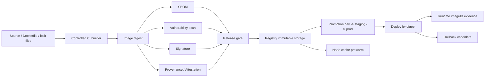

# 第18c章：制品供应链与镜像治理

> 生产镜像不是一个可以随手改写的 tag，而是一份可证明来源、可解释内容、可扫描风险、可按 digest 部署、可 promotion、可回滚、可预热分发的供应链制品。

> **关联章节**：本章承接 [第18a章](./18a-ai-images-and-cuda-compatibility.md) 的镜像构建与 CUDA 兼容矩阵；运行时设备边界见 [第18b章](./18b-container-runtime-and-device-injection.md)；运行时证据链见 [第18d章](./18d-runtime-troubleshooting.md)；模型、checkpoint 与其他大制品治理可对照 [第12章](../part4-data-and-storage/12-artifacts-and-checkpoints.md)。

## 18c.1 第一性原理拆解 + 学习大纲

### 拆：不可化简的问题

制品供应链要解决的不是“镜像能不能 push 到 registry”，而是：**平台必须能证明线上运行的内容从哪里来、里面有什么、是否被篡改、风险是否已知且被接受、如何从测试环境 promotion 到生产、事故时能否按同一份内容回滚、扩容时能否快速分发到节点**。

这个问题不可再简化。因为 AI 镜像经常同时包含：

- 大体积 CUDA / cuDNN / NCCL / TensorRT / Python wheel。
- 自定义 CUDA extension、推理 engine、tokenizer、模型服务入口和运维工具。
- 多层基础镜像继承链，例如 OS base、CUDA base、framework base、service image。
- 与 GPU Driver、节点池、RuntimeClass、MIG/RDMA 能力绑定的兼容假设。
- 发布系统、准入控制、镜像缓存、回滚策略和漏洞治理之间的跨团队责任。

如果只记录 `registry/app:prod`，平台无法回答这些问题：

- 这个 tag 昨天和今天是否指向同一个内容？
- 它是不是由受控 CI 构建，而不是某个工程师本地 push？
- 哪些服务受到某个 OpenSSL、glibc、torch 或 nccl CVE 影响？
- 生产回滚的旧 digest 是否还在 registry 中？
- 扩容 100 个 GPU Pod 时，image pull 是否会压垮 registry 或拖慢冷启动？
- 这份镜像是否符合当前节点池的 Driver/CUDA 支持矩阵？

所以本章讨论的“镜像治理”不是安全团队的附加流程，而是 AI 平台发布系统的一部分。

### 推：从问题推出机制

从“要知道镜像里有什么”推出 **SBOM**。SBOM 把镜像中的 OS 包、语言包、CUDA 组件、基础镜像、许可证和构建信息变成可查询对象。

从“要证明内容没被替换”推出 **digest 和签名**。tag 是可变指针，digest 是内容地址；签名把 digest 与可信构建身份绑定。

从“要证明它怎么构建出来”推出 **provenance / attestation / SLSA**。签名证明“谁背书了这个 digest”，attestation 进一步记录“用什么源码、什么 builder、什么参数、什么依赖构建出来”。

从“要提前暴露已知风险”推出 **漏洞扫描和门禁**。扫描报告要进入发布决策，而不是审计前临时生成。

从“要跨环境发布”推出 **promotion**。生产不应该重新 build 一次“看起来一样”的镜像，而应该把同一个 digest 从 dev/staging promotion 到 prod。

从“要可回滚”推出 **保留策略和发布状态机**。回滚候选必须已经通过门禁、仍可拉取、仍兼容当前节点基线。

从“要快速扩容”推出 **registry 拓扑和缓存预热**。大镜像的冷启动问题通常要通过分层复用、mirror、节点预拉取和区域复制解决。

### 绘：制品供应链主路径



### 导：学习大纲

读完本章，你应该能回答：

1. tag、digest、version、alias 和 release record 分别负责什么。
2. SBOM、签名、attestation、漏洞扫描各自回答什么问题，不能回答什么问题。
3. SLSA 的核心思想如何落到 AI 镜像构建流水线。
4. registry 的 immutable tag、retention、replication 和 garbage collection 如何影响回滚。
5. 为什么生产发布应该 promotion 同一个 digest，而不是每个环境重新 build。
6. 冷启动优化中，registry mirror、节点缓存、预拉取和 layer 复用分别解决哪一段。
7. 如何设计一个可执行的镜像发布门禁和风险接受流程。

## 18c.2 概念先说清楚

### 是什么

**制品供应链** 是从源码、依赖、构建环境、镜像层、元数据、扫描结果、签名、发布记录到运行时 evidence 的完整链路。它关心的不只是“制品在哪里”，而是“制品是否可信、可追溯、可治理、可复现、可分发”。

**镜像治理** 是制品供应链在容器镜像上的具体实现。它通常覆盖镜像命名、tag 策略、digest 部署、SBOM、签名、attestation、漏洞扫描、registry 保留、promotion、回滚和缓存预热。

### 不是什么

镜像治理不是：

- 只写一个 Dockerfile 最佳实践。
- 只把镜像推到私有 registry。
- 只给镜像打一个 `prod` 或 `latest` tag。
- 只跑一次漏洞扫描生成报告。
- 只靠 Kubernetes admission controller 拦截不合规镜像。
- 只靠安全团队人工审计。

这些动作可能是治理的一部分，但单独存在时不能构成供应链。

### 和相邻概念的边界

| 概念 | 主要职责 | 不负责什么 |
|---|---|---|
| OCI image | 定义镜像层、config、manifest | 不证明构建来源可信 |
| Registry | 存储、索引、分发镜像和 artifact | 不自动判断镜像是否应该上线 |
| SBOM | 描述镜像内容和依赖 | 不证明内容未被篡改 |
| Signature | 对 digest 做身份背书 | 不证明没有漏洞 |
| Attestation | 记录构建过程、测试、扫描等声明 | 不替代运行时监控 |
| Vulnerability scanning | 匹配 CVE 和策略门禁 | 不证明漏洞一定可利用 |
| Admission policy | 在部署入口执行准入规则 | 不负责构建镜像 |
| Runtime evidence | 证明实际运行的 imageID/digest | 不自动修复供应链缺口 |

### tag、digest、version 和 alias

| 对象 | 是否可变 | 面向谁 | 推荐用法 |
|---|---:|---|---|
| tag | 可变，除非 registry 强制 immutable | 人类和流水线 | 表示候选名、版本名或环境 alias |
| digest | 不可变内容地址 | 发布系统、审计、运行时 | 部署、回滚、签名、扫描的主键 |
| semantic version / release version | 业务版本 | 产品、运维、用户 | 关联一组镜像 digest、配置和模型版本 |
| alias | 通常可变 | 人类和环境入口 | `prod`、`stable` 等指向当前推荐版本 |

结论很直接：**生产可以保留 tag 方便阅读，但部署和审计必须以 digest 为准**。如果一个系统只能告诉你“运行的是 `app:prod`”，它没有真正的发布可追溯性。

## 18c.3 架构：组件、路径与责任边界

### 关键组件

| 组件 | 典型实现 | 责任 |
|---|---|---|
| Source repo | Git、monorepo、Dockerfile、lock file | 提供可审计输入 |
| Controlled builder | CI runner、BuildKit、Kaniko、Bazel、GitHub Actions runner | 在受控环境构建镜像 |
| Artifact metadata store | 发布数据库、OCI artifact、对象存储 | 保存 digest、SBOM、扫描、签名、attestation |
| Scanner | Trivy、Grype、商业扫描器 | 输出漏洞、许可证和风险报告 |
| Signing system | Cosign、KMS、OIDC keyless signing | 对 digest 进行签名 |
| Policy engine | OPA/Gatekeeper、Kyverno、自研发布门禁 | 执行准入策略 |
| Registry | Harbor、ECR、GCR/Artifact Registry、ACR、自建 distribution | 镜像存储、复制、保留、分发 |
| Promotion controller | 发布平台、GitOps controller、CD pipeline | 将同一 digest 从低环境提升到高环境 |
| Admission controller | Kubernetes 准入 Webhook、Kyverno、Gatekeeper | 部署时阻断不合规镜像 |
| Node cache layer | registry mirror、containerd cache、DaemonSet pre-puller | 降低 image pull 延迟 |
| Runtime evidence collector | kubelet、container runtime、审计采集器 | 记录实际运行 digest/imageID |

### 数据路径

数据路径回答“镜像字节和元数据怎样流动”：

```text
source + lock files
  -> controlled build
  -> image manifest digest
  -> push image layers and manifest
  -> attach SBOM / scan report / attestation / signature
  -> replicate registry
  -> prewarm node cache
  -> kubelet pulls by digest
  -> runtime reports imageID
```

镜像本体和元数据都要有主键。这个主键应该是 digest，而不是 tag。SBOM、扫描报告、签名和 attestation 都应该能追溯到同一个 digest。

### 控制路径

控制路径回答“谁决定能不能进入下一阶段”：

```text
CI policy
  -> build allowed?
  -> scan policy passed?
  -> signature valid?
  -> attestation complete?
  -> base image in compatibility matrix?
  -> promotion allowed?
  -> admission allowed?
  -> runtime evidence matches release record?
```

控制路径中的关键点是：生产部署前的检查不能只发生在 CI。因为 tag 可能漂移、registry 可能被污染、手工 kubectl 可能绕过发布系统，所以 admission 和运行时 evidence 也要参与。

### 责任边界

| 团队/角色 | 应负责 | 不应单独承担 |
|---|---|---|
| 应用团队 | Dockerfile、依赖锁定、业务版本、修复自身依赖漏洞 | registry 保留、全局签名根信任 |
| 平台团队 | builder、registry、promotion、缓存、节点兼容矩阵 | 判断所有业务漏洞是否可利用 |
| 安全团队 | 策略、豁免流程、审计、风险分级 | 手工维护每个服务的镜像发布 |
| SRE/运维 | 发布状态、回滚、观测、事故 evidence | 为缺失元数据做猜测式排障 |
| 审计/合规 | 保留周期、证据要求、报告抽样 | 决定具体 CUDA 版本 |

生产事故里最常见的责任混乱是：应用说“我只改了 tag”，平台说“registry 里有镜像”，安全说“扫描报告有 CVE”，SRE 说“线上行为变了”。digest 和 release record 的作用就是让这些讨论回到同一份事实。

## 18c.4 原理：为什么这些机制存在，底层如何工作

### OCI 镜像为什么适合 digest 治理

OCI 镜像由 layer blob、config 和 manifest 组成。manifest 描述这份镜像引用了哪些 layer 和 config。digest 是对内容做哈希得到的地址。只要内容变化，digest 就变化。

这带来三个重要性质：

1. **不可漂移**：`app@sha256:abc...` 指向的内容不会因为 tag 被覆盖而改变。
2. **可验证**：拉取时 registry、runtime 和客户端可以校验内容哈希。
3. **可关联**：SBOM、签名、扫描报告、attestation 都可以绑定到同一个 digest。

tag 的存在仍然有价值。人类需要 `v1.8.3`、`cuda12.4-py3.11`、`20260504-rc1` 这样的名字。但 tag 应该是索引和别名，不应该是生产事实的唯一来源。

### SBOM 为什么是影响面分析的基础

漏洞治理的第一步不是扫描，而是知道系统里有什么。SBOM 通常采用 SPDX 或 CycloneDX 等格式，记录：

- OS 包及版本，例如 glibc、openssl、libstdc++。
- 语言包及版本，例如 torch、transformers、vllm、numpy。
- CUDA 相关组件，例如 cuda-runtime、cuDNN、NCCL、TensorRT。
- 基础镜像 digest 和构建层级。
- 文件、许可证、供应商、构建时间和来源。

当 CVE 数据库更新时，平台可以反查“哪些 digest 包含受影响组件”。没有 SBOM，只能重新扫描所有镜像，甚至靠镜像名猜测影响面。

### 签名、attestation 与 SLSA

签名回答：**这个 digest 是否由可信身份背书**。常见方式是 CI 构建完成后用 KMS key 或 OIDC keyless 方式对 digest 签名，部署前验证签名身份、签名时间和策略。

Attestation 回答：**关于这个 digest，构建系统声明了哪些事实**。常见声明包括：

- 使用的源码仓库和 git commit。
- builder identity 和构建流水线。
- 构建参数、基础镜像 digest、依赖 lock file。
- 测试结果、扫描结果、SBOM 位置。
- 是否满足某个 SLSA 等级的要求。

SLSA 的核心不是某个工具，而是降低供应链被篡改的可能性。落到镜像治理中，可以理解为：

| 能力 | 工程含义 |
|---|---|
| 受控构建 | 生产镜像只能由受信 CI 产出 |
| Provenance | 每个 digest 都能追到源码和 builder |
| 不可变引用 | 生产按 digest 部署 |
| 防篡改 | 签名和准入校验阻止未知来源镜像 |
| 可审计 | 元数据长期保存并能被查询 |

签名不能替代扫描，扫描不能替代签名，attestation 也不能证明业务逻辑正确。它们分别降低不同类型的风险。

### 漏洞扫描为什么要持续运行

漏洞扫描不是“构建当天没问题就永远没问题”。原因是 CVE 数据库和利用信息会变化。一个三个月前通过扫描的 digest，今天可能因为新披露漏洞变成高风险。

因此扫描有两种触发：

- **构建时扫描**：阻止已知高风险镜像进入候选集。
- **持续重扫**：当 CVE 数据库更新、基础镜像更新或策略变化时，重新评估已发布和可回滚 digest。

漏洞扫描也不能机械化到“有 High 就永远阻断”。AI 镜像里常见一些不会被运行路径触发的包。合理治理应该允许风险接受，但必须有证据、负责人和到期时间。

### Promotion 为什么比重新构建更可靠

很多团队习惯 dev、staging、prod 各 build 一次镜像。看起来流程清晰，实际制造了不确定性。即使 Dockerfile 一样，基础镜像 tag、包仓库、pip 解析、builder 版本都可能变化。

更稳妥的做法是：

```text
build once -> test digest -> attest digest -> promote same digest -> deploy same digest
```

环境差异应该通过配置、secret、模型版本或 feature flag 表达，而不是通过“重新构建一份看起来相同的镜像”表达。

## 18c.5 工程化：生产落地

### 最小发布元数据

生产发布记录至少应包含：

```yaml
release:
  service: reranker-serving
  release_version: 2026.05.04-rc1
  environment: staging
  image:
    repository: registry.example.com/ai/reranker
    tag: 2026.05.04-rc1
    digest: sha256:111122223333...
    base_image_digest: sha256:aaaabbbbcccc...
  source:
    repo: git@example.com:ai/reranker.git
    revision: 8f3a7d2
    dockerfile: deploy/Dockerfile
  build:
    builder: buildkit-gpu-image-v4
    ci_run_id: ci-20260504-1842
    created_at: "2026-05-04T10:42:00Z"
  compatibility:
    cuda: "12.4"
    python: "3.11"
    torch: "2.6"
    nccl: "2.21"
    supported_driver_branch: ">=550"
  evidence:
    sbom: oci://registry.example.com/ai/reranker@sha256:.../sbom
    scan_report: oci://registry.example.com/ai/reranker@sha256:.../scan
    signature: cosign-bundle
    provenance: slsa-provenance-v1
  gates:
    signature_verified: true
    critical_vulns: 0
    high_vulns_waived: 2
    waiver_expire_at: "2026-06-04"
  rollout:
    status: staging
    rollback_candidate: sha256:9999aaaa...
```

这里的核心不是字段名称，而是所有字段能用 digest 关联起来。

### 版本矩阵

AI 镜像应该进入平台版本矩阵。一个简单矩阵如下：

| 维度 | 示例 | 治理动作 |
|---|---|---|
| OS base | Ubuntu 22.04 | 生命周期和安全补丁 |
| CUDA userspace | 12.4 | 与节点 Driver 上限匹配 |
| Driver branch | 550+ | 节点池准入检查 |
| Python | 3.11 | wheel ABI 和依赖解析 |
| PyTorch | 2.6 + cu124 | 与 CUDA/NCCL/cuDNN 匹配 |
| NCCL | 2.21 | 与 RDMA、GPU 拓扑和训练框架匹配 |
| TensorRT/vLLM | 固定 minor | engine cache 和 runtime 行为 |
| GPU arch | sm_80 / sm_89 / sm_90 | 自定义 kernel 是否覆盖 |

版本矩阵不是文档摆设。它应该被构建门禁、部署门禁和节点准入共同使用。

### Registry 策略

| 策略项 | 推荐做法 | 原因 |
|---|---|---|
| 生产 tag | 尽量 immutable；如需 alias，必须记录 digest | 防止 tag 漂移 |
| dev tag | 可短期覆盖 | 保持迭代效率 |
| rc tag | 不覆盖 | 支持测试复现 |
| prod digest | 按合规周期或服务生命周期保留 | 支持审计和回滚 |
| 回滚候选 | 显式保护 | 防止 GC 清掉事故所需镜像 |
| 基础镜像 | 保留多代 | 支持旧服务紧急修复 |
| 跨区域复制 | 复制 digest 和元数据 | 保证多地域一致性 |
| 删除策略 | 先检查运行、灰度、回滚、审计引用 | 避免不可回滚 |

Registry garbage collection 必须理解“引用”。只看 tag 是否存在是不够的。生产中可能有 digest 被 Helm release、GitOps commit、回滚记录或审计策略引用。

### 发布状态机

一个可执行的发布状态机可以是：

```text
built
  -> scanned
  -> signed
  -> attested
  -> eligible_for_staging
  -> staging_running
  -> eligible_for_prod
  -> prod_canary
  -> prod_stable
  -> rollback_candidate
  -> deprecated
  -> retained_for_audit
```

每个状态都应有进入条件。例如：

| 状态 | 进入条件 |
|---|---|
| scanned | SBOM 已生成，漏洞扫描完成 |
| signed | digest 签名可验证 |
| attested | provenance 包含源码、builder、参数 |
| eligible_for_staging | Critical 为 0，高危有处理结论 |
| eligible_for_prod | staging smoke test 通过，兼容矩阵通过 |
| prod_stable | 灰度指标达标，运行 evidence 匹配 release record |
| rollback_candidate | 仍可拉取，仍在节点矩阵内，保留策略保护 |

### 观测与治理指标

| 指标 | 说明 |
|---|---|
| unsigned image deploy attempts | 未签名镜像部署尝试次数 |
| tag-only deploy attempts | 只按 tag 部署的尝试次数 |
| SBOM coverage | 有 SBOM 的生产 digest 比例 |
| scan freshness | 扫描报告距当前 CVE 数据库的时间 |
| critical vuln exposure | 生产运行 digest 中 Critical 数量 |
| waiver age | 风险豁免剩余时间和逾期数量 |
| registry pull latency | 按区域、节点池统计镜像拉取延迟 |
| cache hit ratio | mirror / 节点缓存命中率 |
| rollback readiness | 回滚候选可拉取、可验证、兼容矩阵通过比例 |
| runtime drift | 运行中 imageID 与发布记录不一致次数 |

这些指标让治理从“有没有流程”变成“流程是否真的覆盖生产”。

## 18c.6 方案设计：生产镜像门禁与 Promotion

### 设计目标

设计一个适合 AI 平台的最小可执行方案：

- 生产镜像只能由受控 CI 构建。
- 每个候选镜像必须生成 SBOM、扫描报告、签名和 provenance。
- staging 和 prod 使用同一个 digest。
- Kubernetes 部署必须按 digest。
- 回滚候选不能被 registry 清理。
- 大镜像上线前对目标节点池做缓存预热。

### 决策表

| 决策点 | 选项 A | 选项 B | 推荐 |
|---|---|---|---|
| 生产引用 | tag | digest | digest，tag 只做可读别名 |
| 环境推进 | 每环境重建 | 同 digest promotion | 同 digest promotion |
| 签名密钥 | 人工本地 key | CI OIDC/KMS | CI OIDC/KMS |
| SBOM 存储 | 构建日志附件 | OCI artifact / 元数据仓库 | OCI artifact + 索引 |
| 漏洞策略 | 扫描但不阻断 | 策略化阻断 + 豁免 | 策略化阻断 + 豁免 |
| 回滚策略 | 改 tag | 切回已验证 digest | 切回已验证 digest |
| 缓存策略 | 运行时临时拉 | 发布前预热 | 按节点池预热 |

### 可执行流程

```text
1. CI 只接受 protected branch 或 release tag。
2. Builder 使用固定 builder image 和固定基础镜像 digest。
3. 构建完成后输出 image digest。
4. 生成 SBOM，并把 SBOM 作为 OCI artifact 绑定 digest。
5. 执行漏洞扫描，生成 scan report。
6. 生成 provenance attestation，记录源码、builder、参数和基础镜像。
7. CI 用受信身份签名 digest。
8. Release gate 检查：
   - digest 存在；
   - SBOM 存在；
   - 签名可验证；
   - provenance 完整；
   - Critical 漏洞为 0；
   - High 漏洞已修复或有到期豁免；
   - 基础镜像 digest 在支持矩阵内。
9. 通过后标记 eligible_for_staging。
10. staging 部署使用 image@sha256。
11. staging smoke test 通过后 promotion 到 prod。
12. prod 灰度部署前执行目标节点池预热。
13. prod 稳定后把上一生产 digest 标记为 rollback_candidate。
14. 运行时采集 imageID，与 release record 对账。
```

### 策略示例

```yaml
policy:
  require_digest: true
  require_signature:
    issuer: https://token.actions.example.com
    subject_pattern: repo:ai/.+:ref:refs/tags/release-.+
  require_attestation:
    builder_id: buildkit-prod-v4
    source_repo_prefix: git@example.com:ai/
  vulnerability_gate:
    critical: block
    high: block_unless_waived
    waiver_max_days: 30
  compatibility:
    allowed_cuda:
      - "12.4"
    allowed_driver_branch:
      - "550"
      - "555"
  registry_retention:
    prod_digest_days: 365
    rollback_candidates: protect
    dev_tags_days: 14
  prewarm:
    required_for_images_larger_than_gb: 5
    target_node_pools:
      - gpu-a100
      - gpu-h100
```

这份策略不要求所有组织使用同一工具，但要求所有组织把“允许上线”的判断变成机器可执行规则。

## 18c.7 供应链风险治理

### 风险分类

| 风险 | 典型场景 | 控制手段 |
|---|---|---|
| 来源不可信 | 本地 push 生产镜像 | 受控 CI、签名、准入 |
| tag 漂移 | `prod` 被覆盖 | digest 部署、immutable tag |
| 依赖污染 | pip/apt 拉到异常包 | lock file、私有 mirror、provenance |
| 基础镜像过旧 | glibc/openssl CVE 堆积 | golden image 生命周期 |
| 构建不可复现 | 重新 build 得到不同内容 | 固定 digest、锁版本、记录 builder |
| 扫描噪音 | 大量不可利用 CVE | 风险接受、到期复查 |
| registry 删除 | 回滚 digest 被 GC | retention 保护和引用追踪 |
| 缓存未命中 | 扩容时拉镜像过慢 | mirror、预热、layer 复用 |
| 跨区域不一致 | 某区域 registry 没复制完成 | digest 复制状态检查 |

### 风险接受

风险接受不是“先放过”。它应该至少包含：

- 漏洞编号、组件、版本和受影响 digest。
- 是否存在修复版本。
- 为什么当前运行路径不可利用或风险可控。
- 缓解措施，例如网络隔离、禁用功能、只读文件系统。
- 负责人。
- 到期时间。
- 复查触发条件。

没有到期时间的豁免会变成永久债务。平台应该把即将到期和已经过期的豁免作为发布阻断或告警。

## 18c.8 缓存预热与分发性能

### 冷启动中的镜像阶段

AI 服务冷启动通常由多段组成：

```text
scheduling -> image pull -> container create -> model download -> engine build -> GPU warmup -> health ready
```

镜像治理只直接影响 image pull 和部分 container create。它不能替代模型缓存、engine cache 和应用 warmup。排障时要拆时间线。

### 镜像预热策略

| 策略 | 适合场景 | 注意事项 |
|---|---|---|
| 分层基础镜像 | 多服务共享 CUDA/framework 层 | 基础层 digest 要稳定 |
| Registry mirror | 多节点高频拉取 | 监控命中率和同步延迟 |
| 区域复制 | 多地域部署 | promotion 前确认 digest 已复制 |
| DaemonSet pre-puller | Kubernetes 节点池预热 | 控制并发，避免打满网络 |
| 节点镜像缓存 | 固定 GPU 节点池 | 节点替换会丢缓存 |
| Lazy pulling / remote snapshotter | 超大镜像且只访问部分文件 | 需要验证运行时和性能影响 |

预热要以 digest 为单位。如果预热 `app:prod`，发布期间 tag 变化可能导致预热和实际部署不是同一份内容。

### 预热验收

| 检查项 | 通过标准 |
|---|---|
| registry 可达 | 所有目标节点池能访问 registry/mirror |
| digest 存在 | 目标 digest 已复制到区域 registry |
| 预拉取完成 | 节点 containerd cache 中存在目标 digest |
| 并发受控 | 预热不影响业务网络和 registry SLO |
| runtime 一致 | 预热 digest 与发布 digest 一致 |
| 回滚预热 | 关键服务的回滚候选也可预热 |

## 18c.9 故障排除：症状、证据、根因、动作

| 症状 | 必收证据 | 常见根因 | 处理动作 |
|---|---|---|---|
| 回滚后行为不一致 | release record、Pod imageID、registry tag history | 回滚改了 tag，tag 已漂移 | 回滚到指定 digest，禁用生产 tag 覆盖 |
| Admission 拒绝部署 | admission event、签名验证日志、image digest | 签名缺失、签名身份不匹配、未按 digest 部署 | 重新由受控 CI 构建签名，修部署引用 |
| 扫描突然出现大量 CVE | scan timestamp、DB version、SBOM、基础镜像 digest | CVE 数据库更新或基础镜像过旧 | 重扫影响面，更新 golden image，建立豁免 |
| 生产镜像无法拉取 | kubelet event、registry audit、digest 是否存在 | registry GC 清理了 digest，跨区域未复制 | 恢复 digest，保护回滚引用，修复制门禁 |
| 冷启动 image pull 慢 | Pod event 时间线、registry latency、cache hit ratio | 镜像过大、缓存未命中、registry 限流 | 预热、mirror、layer 复用、降低镜像体积 |
| 线上运行内容无法审计 | Pod imageID、发布数据库、CI run | 只保存 tag，缺少 release record | 建立 digest 主键和运行时 evidence 对账 |
| 某个 CVE 不知道影响哪些服务 | SBOM 索引、包名、版本、digest 列表 | SBOM 未入库或不可查询 | 建立 SBOM 索引，重扫历史 digest |
| promotion 到 prod 失败 | staging digest、prod registry 状态、策略日志 | 元数据缺失、区域复制未完成、策略更严 | 补齐 attestation/扫描，等待复制，统一策略 |

排障时应先固定三个事实：**期望 digest、registry 中实际 digest、运行时 imageID**。三者不一致时，不要继续讨论应用行为。

## 18c.10 Worked Example：发布一个 LLM Router 镜像

场景：团队要把 `llm-router` 发布到生产。镜像包含 Python 3.11、CUDA 12.4 相关 wheel、vLLM、内部路由插件和少量运维工具。目标节点池为 H100，Driver branch 为 550。

### 输入

```text
source repo: git@example.com:ai/llm-router.git
commit: 3b7f91a
dockerfile: deploy/Dockerfile
base image: registry.example.com/base/cuda-runtime@sha256:aaaa...
candidate tag: llm-router:2026.05.04-rc1
target env: staging -> prod
```

### 执行

1. CI 检查 Dockerfile 中基础镜像必须使用 digest。
2. BuildKit 在受控 builder 中构建镜像。
3. 推送候选镜像，得到 `sha256:bbbb...`。
4. 生成 SBOM，确认包含 OS 包、Python 包、CUDA/NCCL 组件。
5. 漏洞扫描发现 1 个 High，组件是调试工具包中的命令行工具，运行路径不暴露。
6. 安全负责人批准 14 天豁免，要求下一次基础镜像更新移除该工具。
7. CI 生成 provenance，记录 commit、builder、base digest 和构建参数。
8. CI 对 `sha256:bbbb...` 签名。
9. Release gate 验证 H100 节点池支持 CUDA 12.4 和 Driver 550。
10. staging 按 `llm-router@sha256:bbbb...` 部署并通过 smoke test。
11. promotion 到 prod 前，registry 完成目标区域复制。
12. pre-puller DaemonSet 在 H100 节点池预热 `sha256:bbbb...`。
13. prod canary 按 digest 部署 5% 流量。
14. 稳定后把上一生产 digest 标记为 rollback candidate 并保护 90 天。

### 验收表

| 检查项 | 结果 | 是否放行 |
|---|---|---|
| image digest 已记录 | `sha256:bbbb...` | 是 |
| SBOM 已绑定 digest | SPDX/CycloneDX 均可查询 | 是 |
| Critical 漏洞 | 0 | 是 |
| High 漏洞 | 1 个，14 天豁免 | 是 |
| 签名 | CI OIDC 身份可验证 | 是 |
| Provenance | 包含 commit、builder、base digest | 是 |
| 兼容矩阵 | CUDA 12.4 + Driver 550 通过 | 是 |
| 区域复制 | prod 区域 registry 已有 digest | 是 |
| 预热 | 目标节点池 95% 节点缓存命中 | 是 |
| 回滚候选 | 上一 digest 受保护 | 是 |

### 复盘问题

这次发布中，tag `2026.05.04-rc1` 的作用是让人类识别候选版本；真正被签名、扫描、promotion、预热和部署的是 `sha256:bbbb...`。如果事故发生，回滚动作也应该切回上一份已验证 digest，而不是把 `prod` tag 改回去。

## 18c.11 反模式 + Checklist

### 反模式

- 生产使用 `latest`、`prod` 这类可变 tag 作为唯一引用。
- 发布记录只保存 tag，不保存 digest、SBOM、签名和扫描结果。
- 允许工程师从本地机器 push 生产镜像。
- Dockerfile 基础镜像使用可漂移 tag，例如 `nvidia/cuda:12.4-runtime`。
- 每个环境重新 build 一次镜像，而不是 promotion 同一个 digest。
- 漏洞扫描只在审计前临时运行。
- SBOM 生成后只放在构建日志里，不能按包名反查影响面。
- registry 清理策略不知道哪些 digest 被生产、灰度、回滚或审计引用。
- 回滚时只改 tag，未验证旧 digest 是否存在、签名是否有效、节点矩阵是否兼容。
- 只预热当前版本，不预热关键服务的回滚候选。
- 把扫描报告当作绝对真理，不区分可利用性和风险接受。

### Checklist

| 检查项 | 通过标准 |
|---|---|
| 构建来源 | 生产镜像只能由受控 CI / builder 产出 |
| 基础镜像 | 使用 digest，并在平台支持矩阵内 |
| 镜像身份 | release record 同时保存 tag 和 digest |
| SBOM | 覆盖 OS 包、语言包、CUDA/NCCL 等关键组件 |
| 签名 | 部署前能验证签名身份和 digest |
| Attestation | 能追溯源码、builder、构建参数和基础镜像 |
| 漏洞扫描 | 构建时扫描 + 持续重扫 |
| 豁免 | 有负责人、证据、缓解措施和到期时间 |
| Promotion | staging/prod 使用同一个 digest |
| Admission | 阻断未签名、无 digest、策略不合规镜像 |
| Registry | 生产 digest、回滚候选和审计 digest 受保护 |
| 缓存预热 | 按目标节点池和 digest 预热 |
| 运行时对账 | Pod imageID 与 release record 可对齐 |

## 18c.12 本章小结

镜像供应链治理的核心是把“我发布了一个镜像”变成“我能证明生产运行的是哪一份内容、它从哪里来、里面有什么、有哪些风险、为什么允许上线、如何回滚、如何快速分发”。tag 负责可读，digest 负责可证；SBOM 负责内容，签名负责身份，attestation 负责过程，扫描负责已知风险，registry 和缓存负责可靠分发。

对于 AI 平台，这套机制尤其重要。因为 CUDA、框架、Driver、NCCL、模型服务和节点池之间存在复杂兼容关系。没有供应链元数据，发布问题、漏洞问题和运行时问题都会变成猜测。

## 18c.13 练习题

1. 设计一个镜像命名和 tag 策略，要求同时支持 dev 快速迭代、staging 复现、prod 审计和紧急回滚。
2. 给一个包含 CUDA 12.4、PyTorch、vLLM 和自定义 extension 的镜像列出 SBOM 必须覆盖的组件类别。
3. 解释为什么“签名通过”不能说明镜像没有漏洞，“扫描通过”也不能说明镜像来源可信。
4. 你负责的服务出现一个 High CVE，但没有修复版本。写出一份风险接受记录应包含的字段。
5. 设计一个 registry retention 策略，保证开发镜像不会无限增长，同时生产和回滚 digest 不会被误删。
6. 一个服务扩容很慢，Pod event 显示 image pull 占 8 分钟。列出你会采集的指标，并给出三种优化方案。
7. staging 通过后 prod 失败，发现 prod registry 没有目标 digest。说明 promotion 流程中缺了哪个门禁。
