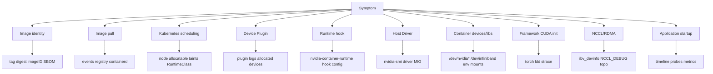

# 第18d章：容器运行时故障排除

> AI 容器排障的关键不是背更多报错字符串，而是沿着“镜像 -> 拉取 -> 容器运行时 -> runtime hook -> device plugin -> 设备节点 -> Driver -> CUDA userspace -> 动态库 -> 框架 -> NCCL/RDMA -> 应用启动”的证据链逐层收敛。

> **关联章节**：镜像和 CUDA 兼容矩阵见 [第18a章](./18a-ai-images-and-cuda-compatibility.md)；容器运行时与设备注入见 [第18b章](./18b-container-runtime-and-device-injection.md)；镜像供应链治理见 [第18c章](./18c-artifact-supply-chain-and-image-governance.md)；Kubernetes 资源调度见 [第19章](./19-kubernetes-for-ai.md)。

## 18d.1 第一性原理拆解 + 学习大纲

### 拆：不可化简的问题

AI 容器运行时故障要解决的不可化简问题是：**一个症状可能由多层系统共同造成，排障必须先确认事实链，再解释根因**。

“GPU 看不见”可能来自：

- Pod 没有申请 `nvidia.com/gpu`。
- Scheduler 没把 Pod 放到 GPU 节点。
- NVIDIA Device Plugin 没上报或没分配设备。
- RuntimeClass 没选到 NVIDIA runtime。
- NVIDIA runtime hook 没执行。
- 容器里没有 `/dev/nvidia*` 或缺少 driver library mount。
- 宿主机 Driver 异常。
- MIG 资源名或 UUID 映射不符合预期。
- `CUDA_VISIBLE_DEVICES` 被错误设置。
- 框架 wheel 与 CUDA/Driver/GPU arch 不兼容。

“NCCL timeout”可能来自：

- RDMA 设备没注入容器。
- `ibv_devinfo` 不可用。
- memlock 太小，内存注册失败。
- NCCL 选错 NIC。
- RoCE GID、MTU、PFC/ECN 配置不一致。
- GPU 和 NIC 拓扑跨 NUMA 或 PCIe 路径差。
- 某个 rank 早已 OOM、卡在数据加载或退出。
- 节点 Driver、NCCL、OFED、container runtime 版本不一致。

如果只看应用最后一行日志，很容易把平台问题误判为代码问题，或者把应用 bug 误判为 GPU 集群问题。所以本章的第一原则是：**先定位层，再定位组件；先收证据，再做解释；先比较成功和失败样本，再改配置**。

### 推：从问题推出排障方法

从“镜像可能不同”推出：记录 image tag、digest、imageID、基础镜像、CUDA、框架、NCCL/cuDNN、custom extension 构建信息。

从“拉取可能失败或很慢”推出：检查 ImagePullBackOff、registry 鉴权、DNS、网络、镜像大小、cache hit、containerd 日志。

从“运行时注入可能失败”推出：检查 RuntimeClass、containerd runtime 配置、NVIDIA runtime hook、`/dev/nvidia*`、driver library mount 和环境变量。

从“Device Plugin 可能未分配设备”推出：检查节点 allocatable、Pod resource request、device plugin Pod 日志、kubelet device manager checkpoint、Pod env 和 device list。

从“Driver/CUDA 可能不匹配”推出：分别记录宿主机 Driver、容器 CUDA userspace、框架编译 CUDA 版本和 GPU compute capability。

从“动态库可能加载错”推出：使用 `ldd`、`ldconfig`、`readelf`、`strings` 和 `strace` 观察动态链接器实际查找了什么。

从“通信可能卡住”推出：先做 RDMA verbs 证据，再做 NCCL 最小测试，最后看完整训练或推理任务。

从“冷启动慢可能分段”推出：拆成 scheduling、image pull、container create、model download、engine build、GPU warmup、health probe。

### 绘：分层证据链



### 导：学习大纲

读完本章，你应该能回答：

1. GPU 看不见时，如何区分调度、Device Plugin、runtime hook、Driver 和框架问题。
2. `libcuda.so.1`、`libcudart.so`、`libnccl.so`、`undefined symbol`、`GLIBCXX not found` 分别意味着什么。
3. Driver/CUDA 不匹配为什么有时在 import 阶段不报错，而在第一次 CUDA 调用时报错。
4. NCCL/RDMA 容器故障要先证明哪些底层事实。
5. ImagePullBackOff、ErrImagePull 和冷启动慢应该收集哪些 evidence。
6. 节点差异问题如何做并排对比，而不是在失败节点上盲改。
7. `nvidia-smi`、`ldd`、`strace`、`kubectl describe`、kubelet/containerd 日志分别适合回答什么问题。

## 18d.2 概念先说清楚

### 是什么

**运行时故障排除** 是对容器从被调度、拉镜像、创建 sandbox、执行 runtime hook、挂载设备和库、启动进程、初始化框架、建立通信到通过健康检查的全过程做分层验证。

它的目标不是找到一个“看起来能跑”的临时参数，而是确认哪一层违反了平台契约，并把修复回写到镜像矩阵、节点基线、RuntimeClass、Device Plugin、发布门禁或应用启动逻辑。

### 不是什么

运行时排障不是：

- 看到 CUDA 报错就直接升级 PyTorch。
- 看到 NCCL timeout 就随机设置十几个 `NCCL_*` 环境变量。
- 容器内 `nvidia-smi` 成功就宣布 GPU 链路完全正常。
- 为了调试把 Pod 改成 `privileged: true` 后长期保留。
- 只在失败节点上试错，不和成功节点对比。
- 把 image pull、模型下载、engine 构建和 GPU warmup 都笼统叫“启动慢”。

### 和相邻概念的边界

| 概念 | 负责什么 | 不负责什么 |
|---|---|---|
| Scheduler | 把 Pod 放到满足资源和约束的节点 | 不注入 GPU 设备 |
| Device Plugin | 发现、上报、分配 GPU/MIG 等设备 | 不挂载 CUDA 动态库 |
| NVIDIA Container Toolkit | 在容器创建时注入设备节点、driver library、env | 不决定 Pod 是否请求 GPU |
| Container runtime | 拉镜像、创建容器、调用 OCI runtime/hook | 不保证应用 CUDA ABI 正确 |
| Driver | 控制宿主机 GPU 并提供 driver API | 不包含应用所需全部 CUDA userspace |
| CUDA userspace | 容器内运行时库、cuDNN/NCCL 等 | 不替代宿主机 Driver |
| Framework | PyTorch、TensorFlow、vLLM 等初始化 CUDA | 不修复节点运行时配置 |
| NCCL/RDMA | 跨 GPU/跨节点通信 | 不保证 rank 应用逻辑正常 |

一个重要边界：**Device Plugin 解决“分配什么设备”，NVIDIA runtime hook 解决“容器启动时如何把设备和库放进去”**。二者任何一个出错，应用都可能只看到“CUDA 不可用”。

## 18d.3 架构：关键组件、路径与责任边界

### 容器启动控制路径

```text
kubectl / controller creates Pod
  -> scheduler selects node
  -> kubelet sees Pod
  -> image service pulls image
  -> device manager asks Device Plugin for allocated devices
  -> kubelet generates CRI request
  -> containerd prepares snapshot and OCI spec
  -> NVIDIA runtime hook mutates spec / injects devices and libs
  -> runc creates namespaces, cgroups, mounts
  -> process starts
  -> framework initializes CUDA/NCCL
```

这条链路的每一段都有自己的 evidence：

| 阶段 | 关键证据 |
|---|---|
| API / 调度 | Pod spec、events、nodeName、资源请求、RuntimeClass |
| 镜像拉取 | `kubectl describe pod` events、containerd 日志、registry audit |
| 设备分配 | node allocatable、device plugin 日志、allocated resources |
| runtime hook | containerd runtime 配置、NVIDIA toolkit 日志、容器内 device nodes |
| 宿主机 Driver | 节点 `nvidia-smi`、driver version、MIG 状态 |
| 容器内运行 | `/dev/nvidia*`、`/dev/infiniband`、env、mount、`ldconfig` |
| 框架初始化 | `torch.cuda.is_available()`、`ldd`、`strace`、应用日志 |
| 通信 | `ibv_devinfo`、NCCL debug、rank 日志、拓扑 |

### 数据路径

数据路径回答“字节和设备能力在哪里流动”：

- 镜像字节：registry -> node container runtime cache -> snapshot -> container filesystem。
- GPU 控制路径：container process -> CUDA runtime/driver API -> mounted driver library -> `/dev/nvidia*` -> kernel driver -> GPU。
- RDMA 路径：process -> NCCL / verbs library -> `/dev/infiniband/*` -> NIC driver -> fabric。
- 模型路径：object store / model registry -> node/local cache -> container mount / application memory。

排障时要避免把这些路径混在一起。镜像能拉下来，不代表 GPU 可用；GPU 可用，不代表 RDMA 可用；RDMA 可用，也不代表应用所有 rank 都正常。

### 责任边界

| 责任方 | 应负责的排障事实 |
|---|---|
| 应用团队 | 启动参数、框架版本、custom extension、模型下载、应用日志和 smoke test |
| 平台团队 | RuntimeClass、containerd、NVIDIA toolkit、Device Plugin、节点基线 |
| 集群网络团队 | RDMA/IB/RoCE、CNI、MTU/GID、跨节点连通性 |
| 镜像/发布团队 | image digest、SBOM、基础镜像、tag/digest 对齐、缓存预热 |
| SRE | 事件时间线、影响面、回滚、证据归档、修复回写 |

## 18d.4 原理：底层如何工作

### 为什么容器里通常不打宿主机 Driver

GPU Driver 分为宿主机内核驱动和用户态 driver library。容器镜像通常包含 CUDA runtime、cuDNN、NCCL、框架 wheel 等 userspace 组件，但不应该把宿主机内核驱动打进镜像。

NVIDIA runtime hook 的作用是：在容器启动时根据分配结果，把宿主机上的 GPU device node 和必要 driver library 暴露给容器。这样镜像可以在不同节点上复用，但前提是容器 userspace 与宿主机 Driver 兼容。

### 为什么 `nvidia-smi` 成功不等于框架成功

`nvidia-smi` 主要验证容器内能访问 NVIDIA Management Library 和设备。PyTorch 或 TensorFlow 还需要：

- CUDA runtime / driver API 版本兼容。
- cuDNN、NCCL、cublas 等库能加载。
- wheel 编译时的 CUDA ABI 与运行环境匹配。
- GPU compute capability 被 binary 覆盖。
- 自定义 extension 的 symbol 和 C++ ABI 正确。

所以 `nvidia-smi` 是必要证据，不是充分证据。

### 动态链接为什么会导致“同镜像不同节点”问题

Linux 动态链接器会根据 binary 的 `RPATH/RUNPATH`、`LD_LIBRARY_PATH`、`ld.so.cache` 和系统默认路径查找 `.so`。容器里某些库来自镜像，某些 driver library 来自宿主机挂载。如果路径顺序或版本不一致，可能出现：

- 载入了旧的 `libstdc++.so.6`。
- 载入了不匹配的 `libnccl.so`。
- 找不到 runtime hook 挂载的 `libcuda.so.1`。
- 自定义 extension 找到错误版本的 torch 或 CUDA symbol。

这就是为什么 `ldd` 和 `strace -e file` 在运行时排障中特别有用。

### 为什么 NCCL timeout 不是根因

NCCL timeout 表示某个通信操作没有在预期时间内完成。它可能由网络、RDMA、拓扑、rank 生命周期、数据加载、GPU OOM 或进程崩溃引起。排障要先证明：

- 所有 rank 都启动了。
- 每个 rank 都看到预期 GPU。
- RDMA verbs 在容器内可用。
- NCCL 选择了预期网卡。
- 多节点网络路径一致。
- 没有 rank 在更早阶段报错退出。

先跑最小通信测试，再跑完整任务。完整任务中 timeout 的噪声太大。

## 18d.5 工程化：生产排障基线

### 标准 evidence bundle

生产事故中，建议每个失败 Pod 至少收集：

```text
Pod:
  namespace/name
  nodeName
  pod uid
  image tag and digest
  container imageID
  resource requests/limits
  RuntimeClass
  events

Node:
  OS/kernel
  containerd/runc version
  NVIDIA driver version
  NVIDIA toolkit version
  device plugin version
  GPU model and MIG state
  RDMA/NVMe devices if relevant

Container:
  /dev/nvidia*
  /dev/infiniband/*
  env | grep -E 'CUDA|NVIDIA|NCCL|UCX|LD_LIBRARY'
  ldconfig -p relevant output
  python framework smoke test

Timeline:
  scheduled time
  image pull start/end
  container created
  process started
  model download start/end
  engine build start/end
  first CUDA call
  readiness passed/failed
```

### 常用命令与它回答的问题

| 命令 | 回答的问题 |
|---|---|
| `kubectl describe pod` | 调度、拉镜像、创建容器、探针失败的事件 |
| `kubectl get pod -o yaml` | 资源请求、RuntimeClass、镜像引用、环境变量 |
| `kubectl logs --previous` | 崩溃重启前一次容器日志 |
| `nvidia-smi` | 宿主机或容器是否能访问 GPU 管理接口 |
| `nvidia-smi -L` | GPU/MIG 枚举和 UUID |
| `ls -l /dev/nvidia*` | GPU device node 是否注入 |
| `ldd path/to/binary.so` | 动态库解析结果 |
| `ldconfig -p` | 动态链接缓存中有哪些库 |
| `strace -f -e file ...` | 进程实际查找了哪些文件和库 |
| `ibv_devinfo` | RDMA verbs 设备是否可用 |
| `NCCL_DEBUG=INFO` | NCCL 初始化、网络选择和通信错误 |
| `nvidia-smi topo -m` | GPU/NIC/CPU 拓扑 |
| `crictl ps/inspect/logs` | CRI 层容器状态和 runtime 信息 |
| `journalctl -u kubelet` | kubelet 拉取、挂载、设备分配问题 |
| `journalctl -u containerd` | containerd、runtime hook、snapshot 问题 |

### 生产调试原则

| 原则 | 说明 |
|---|---|
| 固定 digest | 避免 tag 漂移导致排障对象变化 |
| 先 smoke test | 用最小 CUDA/RDMA 测试缩小范围 |
| 对比成功节点 | 节点差异比单点试错更快 |
| 一次只改一项 | 避免多个变量同时变化 |
| 临时权限有到期 | privileged、hostPID、hostNetwork 调试后必须恢复 |
| 修复回写基线 | 把发现写回节点准入、镜像矩阵或发布门禁 |

## 18d.6 方案设计：运行时排障决策表

### 总决策表

| 入口症状 | 第一层检查 | 若失败 | 若通过 |
|---|---|---|---|
| ImagePullBackOff | `kubectl describe pod` event | 查 registry、secret、digest、网络 | 进入容器创建阶段 |
| Pod Pending | scheduler event、node allocatable | 查资源、taint、nodeSelector、Device Plugin | 查 kubelet/containerd |
| GPU 不可见 | Pod request + `/dev/nvidia*` | 查 Device Plugin / runtime hook | 查 Driver/CUDA/框架 |
| `nvidia-smi` 失败 | 宿主机和容器分别执行 | 宿主机失败修节点，容器失败修注入 | 查框架 |
| CUDA 初始化失败 | `torch` smoke test、版本矩阵 | 修 CUDA/Driver/framework | 查应用逻辑 |
| 动态库报错 | `ldd` + `strace` | 补库、修路径、重建 extension | 查更上层调用 |
| NCCL timeout | RDMA + rank + NCCL debug | 修设备、fabric、接口、rank | 查训练/推理逻辑 |
| 冷启动慢 | 时间线拆分 | 优化对应阶段 | 建立指标和 SLO |

### 最小 Runbook

```text
1. 固定对象：记录 namespace/pod/node/imageID/digest。
2. 读事件：kubectl describe pod，看 Pending、Pull、Create、Start、Probe。
3. 判断是否进入容器：
   - 没进入：查调度、镜像拉取、runtime create。
   - 已进入：查设备、库、框架、应用。
4. 宿主机和容器分别跑 nvidia-smi。
5. 容器内检查 /dev/nvidia*、env、ldconfig、torch smoke test。
6. 涉及通信时检查 /dev/infiniband、ibv_devinfo、NCCL_DEBUG。
7. 有成功样本时，对成功/失败节点执行同一组命令。
8. 找到差异后只改一个变量并复测。
9. 修复后把结论写回基线、门禁或监控。
```

## 18d.7 GPU 看不见

### 症状

- 容器内没有 `/dev/nvidia0`、`/dev/nvidiactl` 或 `/dev/nvidia-uvm`。
- 容器内 `nvidia-smi` 报错。
- `torch.cuda.is_available()` 返回 `False`。
- `torch.cuda.device_count()` 为 0。
- `CUDA_VISIBLE_DEVICES` 为空、为 `void`，或只看到错误 MIG UUID。

### 证据链

| 检查点 | 命令/证据 | 解释 |
|---|---|---|
| Pod 是否请求 GPU | `kubectl get pod -o yaml` | 没有 request 就不会分配设备 |
| 节点是否有可分配 GPU | `kubectl describe node` | allocatable 是否包含 `nvidia.com/gpu` 或 MIG 资源 |
| Device Plugin 是否健康 | device plugin Pod logs | 插件是否发现设备并向 kubelet 注册 |
| Pod 是否调到 GPU 节点 | Pod `nodeName`、node labels | 调度层是否正确 |
| RuntimeClass 是否正确 | Pod spec | 是否走 NVIDIA runtime |
| 宿主机 Driver 是否正常 | 节点 `nvidia-smi` | 宿主机失败时先修节点 |
| 容器内设备是否存在 | `ls -l /dev/nvidia*` | 设备节点是否注入 |
| 环境变量是否合理 | `env | grep -E 'CUDA|NVIDIA'` | 可见设备和 capabilities |
| 框架是否可用 | torch smoke test | 区分设备注入和框架兼容 |

### 最小命令

```bash
kubectl describe pod -n <ns> <pod>
kubectl get pod -n <ns> <pod> -o yaml

# 在节点上
nvidia-smi
nvidia-smi -L

# 在容器内
ls -l /dev/nvidia* || true
env | grep -E 'CUDA|NVIDIA' || true
nvidia-smi
python - <<'PY'
import torch
print("torch", torch.__version__)
print("torch cuda", torch.version.cuda)
print("available", torch.cuda.is_available())
print("count", torch.cuda.device_count())
PY
```

### 根因与处理

| 根因 | 证据 | 处理动作 |
|---|---|---|
| Pod 未请求 GPU | resource requests 缺失 | 修 Pod spec / Helm chart |
| Device Plugin 未注册 | node allocatable 无 GPU | 修插件、驱动、节点标签 |
| RuntimeClass 错误 | 容器无 `/dev/nvidia*`，Pod 配置未走 NVIDIA runtime | 设置正确 RuntimeClass 或默认 runtime |
| runtime hook 失败 | kubelet/containerd 日志有 hook 错误 | 修 NVIDIA Container Toolkit 配置 |
| 宿主机 Driver 异常 | 节点 `nvidia-smi` 失败 | 下线节点，修 Driver/GPU |
| MIG 映射错误 | 看到的 UUID/资源名不符合预期 | 修 MIG 策略和资源请求 |
| `CUDA_VISIBLE_DEVICES` 被覆盖 | env 异常 | 修启动脚本或平台注入逻辑 |
| 框架不兼容 | `nvidia-smi` 成功但 torch 失败 | 回到 18a 兼容矩阵重建镜像 |

## 18d.8 库加载失败

### 常见报错

```text
libcuda.so.1: cannot open shared object file
libcudart.so.12: cannot open shared object file
libnccl.so.2: cannot open shared object file
undefined symbol: ...
GLIBCXX_3.4.xx not found
version `GLIBC_2.xx' not found
cannot open shared object file: No such file or directory
```

### 动态库证据链

| 问题 | 命令 | 说明 |
|---|---|---|
| 目标 binary 依赖什么 | `ldd /path/to/module.so` | 看哪些库 missing 或解析到异常路径 |
| 系统缓存有什么 | `ldconfig -p | grep cuda` | 看动态链接缓存 |
| 实际查找路径 | `strace -f -e file python -c 'import ...'` | 看进程尝试打开哪些路径 |
| C++ ABI 支持 | `strings libstdc++.so.6 | grep GLIBCXX` | 判断 `GLIBCXX` symbol 是否存在 |
| ELF 元信息 | `readelf -d module.so` | 看 RPATH/RUNPATH/NEEDED |
| Python 包来源 | `python -m pip show torch` | 判断 wheel 版本和安装路径 |

### 报错解释与处理

| 报错 | 更可能的层 | 典型根因 | 处理动作 |
|---|---|---|---|
| `libcuda.so.1` 缺失 | runtime hook / Driver library mount | NVIDIA driver library 没注入 | 修 runtime hook，不要把宿主机 Driver 硬塞进镜像 |
| `libcudart.so` 缺失 | 镜像 CUDA userspace | runtime 基础镜像缺 CUDA runtime | 换正确 CUDA runtime 镜像或补 runtime 包 |
| `libnccl.so` 缺失 | 镜像依赖 / 路径 | NCCL 未安装或路径未进 linker | 固定 NCCL 包，修 `LD_LIBRARY_PATH` 或 ldconfig |
| `undefined symbol` | ABI 不匹配 | extension 与 torch/CUDA/NCCL 版本不一致 | 在目标矩阵内重建 extension |
| `GLIBCXX not found` | C++ runtime | 运行时 libstdc++ 比构建时旧 | 升级基础镜像或降低构建基线 |
| `GLIBC not found` | OS ABI | wheel 需要更高 glibc | 换兼容 wheel 或升级 OS base |

不要把所有问题都用追加 `LD_LIBRARY_PATH` 处理。临时路径可能让进程加载到另一套不匹配库，制造更隐蔽的 ABI 问题。

## 18d.9 Driver / CUDA 不匹配

### 为什么会发生

容器镜像中的 CUDA userspace 需要宿主机 NVIDIA Driver 提供足够新的 driver API。通常新 CUDA 需要较新的 Driver；旧 Driver 运行新 CUDA userspace 可能失败。与此同时，框架 wheel、custom extension 和 GPU arch 也有自己的兼容要求。

### 典型表现

- `CUDA driver version is insufficient for CUDA runtime version`
- `CUDA error: unknown error`
- `no kernel image is available for execution on the device`
- `invalid device function`
- import 框架成功，第一次 `.cuda()` 或 kernel launch 失败。
- 同一镜像在新节点成功、旧节点失败。

### 版本矩阵证据

| 维度 | 命令/来源 | 用途 |
|---|---|---|
| Driver | 宿主机 `nvidia-smi` | 判断可支持的 CUDA userspace 上限 |
| GPU 型号 | `nvidia-smi -L` | 判断 arch 和 MIG 状态 |
| CUDA runtime | 镜像标签、`nvcc --version`、包版本 | 判断容器 userspace |
| Framework CUDA | `torch.version.cuda` | 判断 wheel 编译 CUDA |
| Framework version | `torch.__version__` | 判断 ABI 和依赖 |
| Extension build | wheel 名称、build log、`ldd` | 判断自定义算子 ABI |
| NCCL/cuDNN | `ldconfig -p`、包管理器 | 判断通信和算子库 |

### 处理动作

| 结论 | 动作 |
|---|---|
| Driver 太旧 | 升级节点 Driver 或把 Pod 调度到新节点池 |
| 镜像 CUDA 太新 | 降级 CUDA userspace 或选择旧矩阵镜像 |
| extension ABI 错 | 在目标 CUDA/torch/GPU arch 矩阵内重建 |
| GPU arch 未覆盖 | 构建时加入对应 `sm_`/`gencode` |
| 节点池混杂 | 设置节点标签、taint、准入检查和调度约束 |

生产中不要在容器启动脚本里临时覆盖半套 CUDA 库。Driver、CUDA、framework、extension 应作为版本矩阵管理。

## 18d.10 NCCL / RDMA 容器故障

### 症状

- `NCCL WARN` 后 timeout。
- all-reduce 卡住。
- 单机多卡正常，多机失败。
- 某些节点组合失败，另一些成功。
- 容器内 `ibv_devinfo` 不可用。
- 日志中出现 socket fallback，未使用预期 RDMA 接口。

### 证据链

| 层 | 证据 | 目的 |
|---|---|---|
| RDMA 设备注入 | `ls -l /dev/infiniband` | 证明容器是否拿到 verbs 设备 |
| RDMA userspace | `ibv_devinfo` | 证明 verbs library 和设备可用 |
| memlock | `ulimit -l` | 判断内存注册是否受限 |
| NCCL 版本 | `ldconfig -p | grep nccl` | 对齐镜像和框架 |
| NIC 选择 | `NCCL_DEBUG=INFO` | 看 NCCL 选了哪个接口 |
| 拓扑 | `nvidia-smi topo -m` | 看 GPU/NIC 距离 |
| GID/MTU | 节点网络配置 | 判断 RoCE/IB fabric 一致性 |
| rank 状态 | 每个 rank 独立日志 | 判断是否某个 rank 早退出 |

### 最小测试顺序

```bash
# 容器内
ls -l /dev/infiniband || true
ulimit -l
ibv_devinfo

# 单机 GPU 拓扑
nvidia-smi topo -m

# NCCL 最小测试
NCCL_DEBUG=INFO NCCL_DEBUG_SUBSYS=INIT,NET \
  ./all_reduce_perf -b 8M -e 1G -f 2 -g 1
```

### 根因与处理

| 根因 | 证据 | 处理动作 |
|---|---|---|
| RDMA 设备未注入 | 容器无 `/dev/infiniband` | 修 Pod device request、runtime、RDMA device plugin |
| verbs library 缺失 | `ibv_devinfo` 找不到命令或库 | 安装 rdma-core，固定基础镜像 |
| memlock 过小 | `ulimit -l` 太小，日志有注册失败 | 设置 `IPC_LOCK`、ulimit 或容器安全上下文 |
| NCCL 选错网卡 | NCCL debug 显示 socket/错误 NIC | 设置 `NCCL_SOCKET_IFNAME` / UCX 相关配置 |
| RoCE 参数不一致 | 某些节点组合失败 | 修 GID、MTU、PFC/ECN、交换机配置 |
| 拓扑差异 | topo 显示跨 NUMA/PHB | 调整调度、节点池或进程绑核 |
| 某 rank 早失败 | rank 日志先 OOM 或数据错误 | 先修 rank 应用错误，再看通信 |

不要在 verbs 不可用时调 NCCL 参数。先证明底层设备和库存在，再优化 NCCL。

## 18d.11 ImagePull 与冷启动慢

### ImagePullBackOff / ErrImagePull

| 症状 | 证据 | 根因 | 处理 |
|---|---|---|---|
| `ErrImagePull` | Pod event | 镜像名、tag、digest 不存在 | 修引用，确认 registry 有 digest |
| `ImagePullBackOff` | Pod event 重试 | 鉴权失败、网络失败、registry 限流 | 修 imagePullSecret、DNS、网络、限流 |
| `manifest unknown` | event / registry audit | digest 被 GC 或区域未复制 | 恢复/复制 digest，修 retention |
| `unauthorized` | event | secret 缺失或过期 | 更新 secret / workload identity |
| 拉取很慢 | event 时间线、containerd 日志 | 镜像大、缓存未命中、registry 慢 | 预热、mirror、分层复用、瘦身 |

最小命令：

```bash
kubectl describe pod -n <ns> <pod>
kubectl get secret -n <ns>
kubectl get pod -n <ns> <pod> -o jsonpath='{.spec.containers[*].image}'

# 节点侧按环境使用 crictl/ctr 排查
crictl pull <image@sha256:...>
journalctl -u containerd --since "30 min ago"
journalctl -u kubelet --since "30 min ago"
```

### 冷启动拆分

| 阶段 | 常见原因 | 观测方式 | 优化 |
|---|---|---|---|
| Scheduling | GPU 不足、taint/affinity 过窄 | scheduler event、pending time | 容量、队列、调度策略 |
| Image pull | 大镜像、registry 慢、缓存未命中 | Pod event、containerd 日志 | 镜像瘦身、预热、mirror |
| Container create | runtime hook 慢、mount 多、权限问题 | kubelet/containerd 日志 | 修 runtime 配置和挂载 |
| Model download | 对象存储慢、权重太大 | 应用日志、下载指标 | 本地缓存、分片、预取 |
| Engine build | TensorRT/vLLM 编译、graph capture | engine 日志 | 预构建 engine、缓存 |
| GPU warmup | 首次显存分配、kernel JIT | 应用指标 | 显式 warmup |
| Health probe | startupProbe 太紧 | restart event | 调整 startupProbe 和 readiness |

冷启动优化必须先量化阶段。只减小镜像不一定能改善模型下载和 engine build。

## 18d.12 Runtime Hook 与 Device Plugin 故障

### Device Plugin 故障

| 症状 | 证据 | 处理 |
|---|---|---|
| 节点 allocatable 没有 GPU | `kubectl describe node` | 查插件 Pod、Driver、节点标签 |
| Pod 一直 Pending | event 显示 GPU insufficient | 检查资源名、MIG 策略、节点池容量 |
| 请求 MIG 后设备不符 | `nvidia-smi -L`、Pod env | 统一 MIG 配置和资源命名 |
| 插件重启 | DaemonSet logs | 修 Driver、插件版本、节点权限 |

Device Plugin 是 Kubernetes 和硬件之间的资源接口。它正常不代表容器内一定有库；它异常时，Pod 往往在调度或分配阶段就出问题。

### Runtime Hook 故障

| 症状 | 证据 | 处理 |
|---|---|---|
| 宿主机 GPU 正常，容器无 `/dev/nvidia*` | 容器内检查 + containerd 配置 | 修 NVIDIA runtime 配置 |
| `libcuda.so.1` 缺失 | `ldconfig -p`、`ldd` | 修 driver library mount |
| Pod 创建失败 | kubelet/containerd 日志有 hook error | 查看 toolkit 版本和配置 |
| 某节点失败某节点正常 | 对比 toolkit/containerd/runc 版本 | 节点基线一致化 |

Runtime hook 是容器创建阶段的注入机制。它的错误经常被应用层包装成 CUDA 初始化失败，所以要看 kubelet 和 containerd 日志。

## 18d.13 节点差异排障 SOP

当“同一镜像、同一配置，在 A 节点成功、B 节点失败”时，最快路径通常是并排对比。

### 对比表

| 项目 | 成功节点 | 失败节点 |
|---|---|---|
| image digest / imageID | 记录 | 记录 |
| OS / kernel | 记录 | 记录 |
| containerd / runc | 记录 | 记录 |
| NVIDIA Driver | 记录 | 记录 |
| NVIDIA Container Toolkit | 记录 | 记录 |
| Device Plugin 版本 | 记录 | 记录 |
| GPU 型号 / MIG 状态 | 记录 | 记录 |
| RDMA / NVMe 设备 | 记录 | 记录 |
| RuntimeClass | 记录 | 记录 |
| node labels / taints | 记录 | 记录 |
| `/dev/nvidia*` | 记录 | 记录 |
| `torch` smoke test | 记录 | 记录 |
| NCCL/RDMA smoke test | 按需记录 | 按需记录 |

### SOP

1. 固定同一个 image digest 和启动参数。
2. 用 nodeSelector 或调度约束把同一个 debug Pod 分别放到成功和失败节点。
3. 在两边执行同一组命令。
4. 先比较宿主机层：Driver、GPU、MIG、runtime、toolkit。
5. 再比较容器层：device node、env、mount、库路径。
6. 最后比较框架层：torch/CUDA/NCCL smoke test。
7. 找到差异后只改一项。
8. 修复后把节点准入检查更新为自动化测试。

节点差异问题最怕“边查边改”。每改一项都可能破坏证据。

## 18d.14 Worked Example：GPU 看不见事故

### 事故背景

新推理服务 `reranker-serving` 发布后，Pod 状态为 Running，但应用日志显示：

```text
torch.cuda.is_available() == False
device_count == 0
```

服务使用的镜像 digest 是 `sha256:bbbb...`，目标节点池是 `gpu-a100`。

### 排查过程

1. 查看 Pod spec，确认容器请求了 `nvidia.com/gpu: 1`。
2. 查看 Pod event，确认调度到 `gpu-a100-node-17`，没有 Pending 或 ImagePull 错误。
3. 进入容器执行 `ls -l /dev/nvidia*`，发现没有任何 NVIDIA device node。
4. 容器内 `env | grep NVIDIA` 显示 `NVIDIA_VISIBLE_DEVICES=GPU-...`，说明 kubelet/插件分配过设备信息。
5. 在宿主机执行 `nvidia-smi` 正常，Driver 和 GPU 健康。
6. 在同节点查看 containerd 日志，发现 NVIDIA runtime hook 未执行。
7. 对比成功节点 `gpu-a100-node-03`，发现失败节点 containerd 默认 runtime 配置缺少 NVIDIA runtime。
8. 修复节点配置，重启 containerd/kubelet，重新运行平台 GPU smoke Pod。
9. 容器内出现 `/dev/nvidia0`、`nvidia-smi` 成功、torch smoke test 通过。
10. 将“GPU 节点加入资源池前必须通过 runtime hook smoke test”写入节点准入。

### 结论

根因不是镜像，也不是 PyTorch，而是节点 runtime hook 配置漂移。这个案例说明：

- Pod Running 不代表设备注入正确。
- 宿主机 `nvidia-smi` 正常不代表容器内 runtime hook 正常。
- 成功/失败节点对比可以快速定位节点基线漂移。

## 18d.15 故障排除总表

| 症状 | 证据 | 根因方向 | 处理动作 |
|---|---|---|---|
| Pod Pending | scheduler event、node allocatable | GPU 资源不足、资源名错误、taint/affinity | 修资源请求、节点池、调度约束 |
| ImagePullBackOff | Pod event、registry audit | 镜像不存在、鉴权、网络、GC | 修引用/secret/registry/retention |
| 容器创建失败 | kubelet/containerd 日志 | runtime hook、mount、权限、snapshot | 修 runtime 和安全上下文 |
| GPU 看不见 | `/dev/nvidia*`、Device Plugin logs、RuntimeClass | 未请求、未分配、hook 失败、Driver 异常 | 按层修复 |
| `nvidia-smi` 正常但 torch 失败 | torch smoke、版本矩阵、`ldd` | CUDA/Driver/framework/ABI 不匹配 | 调整矩阵并重建 |
| `libcuda.so.1` 缺失 | `ldd`、`ldconfig` | driver library 未注入 | 修 NVIDIA runtime |
| `GLIBCXX not found` | `strings libstdc++.so.6` | C++ runtime 过旧 | 升级 base 或重建 wheel |
| NCCL timeout | `ibv_devinfo`、NCCL debug、rank logs | RDMA、NIC、rank、拓扑 | 先底层 smoke，再调 NCCL |
| 冷启动慢 | 完整时间线 | pull、下载、engine、warmup、probe | 针对阶段优化 |
| 只在某节点失败 | 成功/失败节点对比 | 节点基线漂移 | 修节点池并加准入 |

## 18d.16 反模式 + Checklist

### 反模式

- 只贴最后一行 Python 异常，不提供 Pod event、imageID、nodeName。
- 看到 `nvidia-smi` 成功就跳过 CUDA/框架 smoke test。
- GPU 看不见时直接重建镜像，不查 Device Plugin 和 runtime hook。
- NCCL timeout 时随机设置环境变量，不看 RDMA verbs 和 rank 日志。
- 把 `privileged: true` 当作 GPU 容器默认配置。
- 不区分 `ErrImagePull`、容器创建失败、应用启动失败和 readiness 失败。
- 节点差异问题不做成功/失败对比。
- 临时修好节点后不回写节点准入和版本矩阵。
- 在生产容器里临时覆盖半套 CUDA/NCCL 动态库。
- 把模型下载慢和 image pull 慢混为一谈。

### Checklist

| 检查项 | 通过标准 |
|---|---|
| 镜像身份 | tag、digest、imageID、基础镜像已记录 |
| Pod 事件 | Pending/Pull/Create/Start/Probe 阶段已区分 |
| 调度 | nodeName、资源请求、RuntimeClass、taint/affinity 已确认 |
| Device Plugin | 节点 allocatable 和插件日志已检查 |
| Runtime hook | 容器内 devices、env、driver library mount 已确认 |
| 宿主机 | Driver、GPU、MIG、RDMA/NVMe 状态已记录 |
| 动态库 | `ldd` / `ldconfig` / `strace` 按需执行 |
| 框架 | CUDA smoke test 已执行 |
| 通信 | RDMA verbs 和 NCCL 最小测试按需执行 |
| 冷启动 | 时间线拆成 pull、download、build、warmup、probe |
| 节点差异 | 成功/失败节点同命令对比 |
| 修复回写 | 节点基线、镜像矩阵、发布门禁或监控已更新 |

## 18d.17 本章小结

AI 容器运行时故障的本质是多层系统契约被破坏。镜像、registry、scheduler、Device Plugin、runtime hook、Driver、CUDA userspace、动态链接器、框架、NCCL/RDMA 和应用启动路径都可能制造相似症状。高质量排障不是记住某个报错对应某个修复，而是用证据链把可能性逐层排除。

最实用的工作方式是：固定 digest，读 Pod event，区分是否进入容器；宿主机和容器分别验证 GPU；用 `ldd` 和 `strace` 查库加载；用 `ibv_devinfo` 和 NCCL debug 查通信；用时间线拆冷启动；用成功/失败节点对比定位基线漂移。最终修复不应停留在单个 Pod，而应回写到平台基线。

## 18d.18 练习题

1. 一个 Pod 请求了 GPU，但容器内没有 `/dev/nvidia0`。列出你会按顺序检查的五个证据。
2. 容器内 `nvidia-smi` 成功，但 `torch.cuda.is_available()` 为 `False`。给出三类可能根因和对应验证命令。
3. 解释 `libcuda.so.1` 缺失和 `libcudart.so` 缺失分别更可能属于哪一层问题。
4. 一个 custom CUDA extension 报 `undefined symbol`。你会如何用 `ldd`、版本矩阵和构建日志定位？
5. 多机训练 NCCL timeout，但单机正常。设计一个从 RDMA 到 NCCL 的最小测试流程。
6. Pod 冷启动 12 分钟。如何把这 12 分钟拆成可观测阶段？每个阶段至少给一个优化方向。
7. 同一镜像在 A 节点成功、B 节点失败。写出一张你会填写的节点差异对比表。
