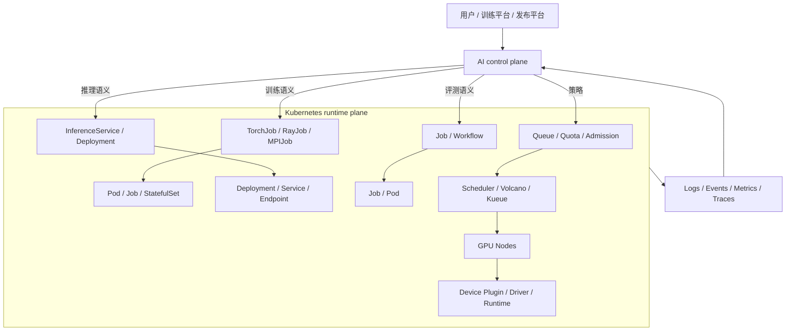

# 第19章：Kubernetes for AI 导览

> **关联章节**：如果你还不熟悉镜像、运行时和 GPU 设备是怎样接进容器的，建议先看 [第18章](./18-containers-and-runtime.md)。本章把原来的 Kubernetes 总览拆成导览章，后续 19a-19d 分别深挖工作负载对象、GPU 调度、AI Operator 和排障 SOP。

---

## 19.1 为什么要拆分

Kubernetes for AI 很容易被讲成一串对象名：Pod、Job、Deployment、Service、CRD、Operator、Device Plugin、GPU Operator、KServe、Volcano、Kueue。这样学完以后，读者通常知道“有哪些东西”，但仍然回答不了真正的工程问题：

- 一个训练任务应该建模成 Job、StatefulSet、TorchJob 还是 RayJob？
- 一个推理服务的 readiness probe 应该检查进程存活、模型加载，还是 CUDA graph warmup？
- `nvidia.com/gpu: 8` 为什么只能说明数量，不能说明 NVLink、NUMA、RDMA locality？
- 一个 Pod Pending 到底是资源不足、污点不匹配、quota 不够、gang 条件不满足，还是节点标签错了？
- Operator 为什么不是“自动生成 YAML 的脚本”，而是一个持续 reconciliation 的控制器？

所以本章改成导览：先建立边界和阅读路径，再把细节拆到独立子章。这样第19章回答“怎么理解 Kubernetes 在 AI 平台里的位置”，19a-19d 回答“每类机制在工程中怎么落地、怎么失效、怎么排查”。

---

## 19.2 第一性原理拆解 + 学习大纲

### 拆 — 不可化简的问题

剥离 Kubernetes、Kubeflow、KServe、GPU Operator、Volcano、Kueue 这些工具名之后，AI 平台运行层要解决的不可化简问题是：

**把训练、推理、评测和批处理这些具有 AI 语义的工作负载，翻译成一批可声明、可调度、可恢复、可观测的容器化运行对象，并在异构 GPU 集群、多租户竞争和故障常态下持续逼近期望状态。**

这里有三层硬约束。

第一，AI 任务不是普通 Web 进程。训练通常是“运行到完成”，需要 checkpoint、rank、rendezvous、数据分片和失败恢复；在线推理是长期服务，需要 readiness、滚动发布、权重预热、流量入口和扩缩容；评测和批处理需要可复现输入、制品输出和审计证据。它们都能落到 Pod 上，但不能只用 Pod 解释清楚。

第二，GPU 资源不是一串同质数字。卡型、显存、MIG profile、NVLink、PCIe root complex、NUMA、RDMA 网卡、本地 NVMe、驱动和 CUDA 版本都会改变任务能否运行以及运行效率。`nvidia.com/gpu: 8` 表达的是“我要 8 个被 device plugin 暴露的 GPU 设备”，不是“我要一台 HGX 上互联良好的 8 张 H100”。

第三，Kubernetes 是 runtime plane，不是完整 AI platform。它擅长把声明对象推进到运行状态，但不理解数据集血缘、模型评测、发布门禁、实验追踪、成本归因和业务优先级。平台控制面必须把这些 AI 语义翻译成 K8s 对象组合和准入策略，而不是把用户推到复杂 YAML 面前。

### 推 — 从问题推导机制

从“声明期望状态”推出 Pod：Pod 是容器、资源、卷、网络 namespace 和生命周期探针的最小调度单元。

从“运行到完成”推出 Job：训练、评测、离线 embedding、批量转码都需要完成语义、重试策略和失败边界。

从“长期服务”推出 Deployment：在线推理需要副本维持、滚动升级、readiness 门禁、Service 后端选择和回滚。

从“稳定身份和有序生命周期”推出 StatefulSet：参数服务器、带本地缓存的 shard、某些需要稳定 hostname 的 serving 组件，不能完全用无状态副本表达。

从“AI 语义高于原生对象”推出 CRD / Operator：TorchJob、RayJob、MPIJob、InferenceService 把训练和推理的高层语义放进自定义资源，再由控制器持续 reconcile 成 Pod、Service、ConfigMap、Secret、PVC 等底层对象。

从“GPU 资源有形状”推出 Device Plugin、GPU Operator、Node Feature Discovery、节点标签、taint/toleration、亲和、拓扑感知调度和 gang scheduling。调度层必须知道“多少资源、什么类型、在哪些节点、能否一起到位、是否靠近正确设备”。

从“运行不等于运行正确”推出排障 SOP。AI 平台的很多故障不是单点错误，而是一条证据链：事件、调度条件、镜像、容器日志、节点状态、GPU 驱动、NCCL、Service endpoint、Ingress、应用指标必须串起来看。

### 绘 — 总体边界

---

## 19.3 阅读路径

| 子章 | 解决的问题 | 读完应能做什么 |
|------|------------|----------------|
| [19a：AI 工作负载对象建模](./19a-kubernetes-ai-workloads.md) | Pod、Job、Deployment、StatefulSet、probe、ConfigMap、Secret、Volume 在 AI 中如何使用 | 给训练、推理、评测选择合适对象，并写出最小 YAML 草图 |
| [19b：GPU 与拓扑感知调度](./19b-gpu-scheduling-and-topology.md) | Device Plugin、GPU Operator、MIG、NFD、节点标签、污点、拓扑 locality | 判断一个 GPU Pod 为什么能调度但性能差，或为什么长期 Pending |
| [19c：CRD 与 Operator](./19c-ai-crd-and-operators.md) | TorchJob、RayJob、MPIJob、KServe、reconciliation、状态机、失败恢复 | 解释 AI Operator 如何把高层语义翻译成底层 K8s 对象 |
| [19d：K8s for AI 排障 SOP](./19d-kubernetes-ai-troubleshooting.md) | Pending、ImagePull、GPU 不可见、NCCL timeout、OOMKilled、readiness flapping、Service/Ingress | 按证据链定位常见 AI on K8s 故障 |

建议顺序：

1. 先读本章，明确 runtime plane 和 AI control plane 的边界。
2. 如果你负责提交训练/推理 YAML，读 19a。
3. 如果你负责 GPU 集群、调度或性能，读 19b。
4. 如果你要建设平台控制面或接入 Kubeflow/KServe/Ray，读 19c。
5. 如果你在值班、救火或写排障手册，读 19d。

---

## 19.4 Runtime Plane 与 AI Control Plane 的边界

Kubernetes runtime plane 负责“怎么运行”：

- 容器以什么镜像和命令启动
- 申请多少 CPU、内存、GPU 和临时存储
- Pod 放到哪个节点
- 哪些卷和 Secret 挂进去
- 容器是否健康，是否重启
- Service 如何发现后端 Pod
- Deployment 如何滚动升级
- Job 是否完成或失败
- 事件、日志、状态如何暴露

AI control plane 负责“为什么运行、是否该运行、运行是否合格”：

- 用户提交的是训练、评测、推理还是批处理
- 使用哪个数据集版本和模型版本
- 资源画像、队列、配额和优先级是什么
- checkpoint 和恢复策略是什么
- 模型是否通过评测和发布门禁
- 成本归因、审计、权限和数据治理怎么做
- SLO、容量、降级和回滚策略是什么

| 问题 | 更接近 K8s runtime plane | 更接近 AI control plane |
|------|--------------------------|--------------------------|
| Pod 为什么 Pending | 调度器、资源、标签、污点、quota、PVC | 提交前资源画像是否合理 |
| 训练从哪个 checkpoint 恢复 | PVC/对象存储挂载是否可用 | checkpoint 版本、manifest、恢复策略 |
| 推理副本是否接流量 | readiness probe、Service endpoint | 模型是否通过评测、灰度策略 |
| GPU 被哪个容器看到 | device plugin、runtime、驱动 | 是否允许该租户使用该卡型 |
| 多 worker 是否一起启动 | gang scheduling、PodGroup、JobSet | 训练作业语义和容量准入 |
| 是否应该发布新模型 | K8s 不负责判断 | 评测、审批、风险控制 |

边界混淆会带来两种坏结果：平台把 AI 语义泄漏成复杂 YAML，用户被迫理解太多底层细节；或者平台把 K8s 当黑盒，出现 Pending、NCCL timeout、readiness flapping 时没有证据链。

---

## 19.5 快速自测

1. 一个离线评测任务跑完即可退出，应该优先考虑 Pod、Job、Deployment 还是 StatefulSet？为什么？
2. 一个在线推理服务的容器进程已经启动，但模型权重还没加载完成，readiness probe 应该返回成功还是失败？
3. `limits.nvidia.com/gpu: 8` 能保证 8 张 GPU 在同一个 NVLink domain 内吗？如果不能，还需要哪些信号？
4. 为什么分布式训练只创建多个 Pod 会造成 GPU 空转？gang scheduling 在解决什么？
5. Secret 和 ConfigMap 的边界是什么？为什么访问 token 不应该放进 ConfigMap？
6. TorchJob 和普通 Job 的根本区别是什么？Operator 的 reconciliation loop 在其中做了什么？
7. 当用户说“Service 访问不到推理服务”，你会先看 Deployment 日志，还是先看 Service endpoint？为什么？
8. Kubernetes 能判断一个模型是否通过评测并允许上线吗？如果不能，谁应该负责？

---

## 本章小结

Kubernetes 是 AI 平台最重要的运行底座，但它不是完整 AI 平台。它把容器、资源、节点、网络、卷和生命周期变成可声明对象；AI 控制面把训练、推理、评测、发布、成本和治理翻译成这些对象。19a-19d 的目标，就是分别把“对象建模、GPU 调度、Operator 语义、排障证据链”讲透，避免把 Kubernetes 学成对象名清单。
