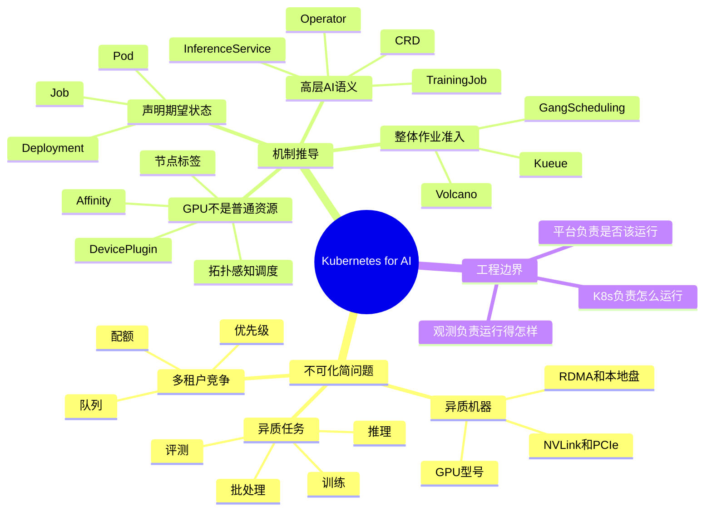
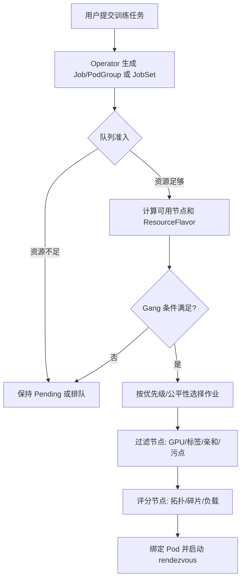

# 第19章：Kubernetes for AI

> **关联章节**：如果你还不熟悉镜像、运行时和 GPU 设备是怎样接进容器的，建议先看 [第18章](./18-containers-and-runtime.md)。第18章解释的是执行路径，本章解释的是这些路径如何被 Kubernetes 组织起来。

## 1. 第一性原理拆解 + 学习大纲

### 拆 — 不可化简的问题

Kubernetes 是 AI 平台最常见的运行底座，但它解决的是“通用编排问题”，不是全部 AI 语义问题。把所有工具名拿掉，本章不可化简的问题是：一批异质机器上有 CPU、内存、GPU、磁盘、网卡、驱动、容器运行时和故障边界；一批任务有训练、推理、评测、批处理、服务化、发布、数据访问和多租户约束；平台必须把“某个工作负载应以什么身份、用哪些资源、在哪些机器、按什么生命周期运行”表达清楚，并在失败、抢占、版本变化时持续逼近这个声明。

这个问题不能只靠 SSH 脚本解决。脚本描述“现在执行什么命令”，很难表达“期望系统最终是什么状态”。它也不能只靠单机进程管理解决，因为 AI 作业经常跨节点：8 卡训练可能要求同一节点内 NVLink，64 卡训练要求多个节点同时可用，在线推理还要经过 Service、readiness、HPA 和灰度发布。它更不能只靠 Kubernetes 原生对象全部解决，因为原生调度器主要理解 Pod 级资源请求，不天然理解模型版本、数据集血缘、checkpoint 一致性、KV Cache 压力、队列公平性和训练 worker 必须同时启动的语义。

因此，本章不是背 Pod、Job、Deployment、CRD 的定义，而是建立边界：Kubernetes 负责把容器化工作负载变成可声明、可调度、可恢复、可观察的运行对象；AI 平台控制面负责把训练、推理、评测、发布和成本治理翻译成 Kubernetes 能执行的对象组合。边界混淆后，要么用户被迫手写复杂 YAML，要么平台把 K8s 当黑盒，直到 GPU 空转、Pod Pending、RDMA 拓扑错配、checkpoint 丢失时才发现缺少可解释的控制面。

### 推 — 从这个问题如何推导出每个机制

从“声明期望状态”出发，先推导出 Pod：它把容器、卷、网络 namespace 和资源请求绑定成最小调度单元。训练、评测和批处理要“运行到完成”，所以需要 Job；在线推理要长期存在、滚动升级和副本维持，所以需要 Deployment；多 worker 训练和模型服务无法只靠通用对象表达，所以需要 CRD / Operator，把 TorchJob、InferenceService 等高层语义翻译成 Pod、Service、ConfigMap 和 Secret。

从“资源不是同质数字”继续推导，会出现 GPU device plugin、节点标签、taint/toleration、affinity/anti-affinity 和拓扑感知调度。CPU / 内存可按数量粗略切分，但 GPU 型号、显存、MIG、NVLink、PCIe、NUMA、RDMA、本地 NVMe 都会改变性能。一个 8 卡训练 Pod 放在 8 张无 NVLink 的卡上可能能启动但吞吐下降；一个跨 8 节点的 AllReduce 作业如果跨机架，通信时间可能从总时长的 20% 变成 50% 以上。于是调度不再只是“找够卡”，而是“找对形状、邻接关系和队列时机”。

从“多租户资源竞争”再推导，会出现队列、配额、优先级和 gang scheduling。原生调度器逐个绑定 Pod，却不保证 32 个训练 worker 同时拿到资源；部分 worker 启动会占住 GPU，剩余 worker Pending，整个训练不前进。Volcano、Kueue 因此把“作业整体是否可运行”放在 Pod 绑定之前，先做准入、队列公平、资源预留或 PodGroup 检查。最后，从“运行不等于正确运行”推导出 K8s 边界：它负责怎么运行，不能证明数据集正确、模型已通过评测、发布符合策略、成本归因合理。

### 绘 — 因果链路



### 导 — 读完本章你应该能回答

1. 为什么 Kubernetes 更适合作为 AI runtime plane，而不是完整 AI platform？
2. Pod、Job、Deployment、CRD / Operator 分别解决了哪类不可化简的运行问题？
3. GPU 为什么不能只按 `nvidia.com/gpu: 8` 这种数量资源来理解？
4. 分布式训练为什么需要 gang scheduling 或队列准入，而不是简单创建多个 Pod？
5. 拓扑感知调度、节点亲和、Pod 反亲和分别在防止哪类性能或可靠性问题？
6. Volcano / Kueue 能补上哪些原生 K8s 调度缺口，又不能替平台控制面解决什么？
7. 当一个 AI 作业运行失败或性能异常时，哪些问题应归因于 Kubernetes，哪些应归因于上层 AI 语义？

## 学习目标

完成本章学习后，你将能够：

1. 理解 Kubernetes 在 AI 平台中的合适定位
2. 区分 Pod、Job、Deployment、CRD / Operator 在 AI 场景中的用途
3. 理解 GPU 调度、存储挂载、网络与设备插件如何进入 K8s 运行模型
4. 识别 Kubernetes 能解决什么，不能解决什么
5. 为训练和推理任务写出最小 K8s 表达草图

---

## 正文内容

### 19.1 Kubernetes 是底座，不是完整 AI 平台

Kubernetes 擅长：

- 运行容器
- 声明资源
- 服务发现
- 滚动发布
- 健康检查
- 基础伸缩

但它不直接解决：

- 数据集版本
- 实验追踪
- 模型评测
- 发布门禁
- KV Cache 调度

所以一个成熟 AI 平台通常是：

```text
AI control plane
  on top of
Kubernetes runtime plane
```

### 19.2 AI 场景常见对象

### Pod

最小运行单元，适合：

- 单个训练 worker
- 单个推理实例

### Job

适合：

- 训练任务
- 评测任务
- 批处理任务

### Deployment

适合：

- 在线推理服务
- 网关和辅助服务

### CRD / Operator

适合：

- 更高层的训练或 serving 语义
- 多 worker 协调
- 生命周期管理

### 19.3 一个训练 Job 草图

```yaml
apiVersion: batch/v1
kind: Job
metadata:
  name: train-reranker
spec:
  template:
    spec:
      restartPolicy: Never
      containers:
        - name: trainer
          image: ai-train:cuda12.4
          resources:
            limits:
              nvidia.com/gpu: 4
          command: ["python", "train.py"]
          args: ["--config", "configs/reranker.yaml"]
```

真实平台通常还会补：

- PVC / 对象存储挂载
- 环境变量
- 调度约束
- 节点选择
- 日志采集
- 失败重试策略

### 19.4 一个在线推理 Deployment 草图

```yaml
apiVersion: apps/v1
kind: Deployment
metadata:
  name: llm-serving
spec:
  replicas: 4
  template:
    spec:
      containers:
        - name: server
          image: llm-serving:latest
          resources:
            limits:
              nvidia.com/gpu: 1
```

上线场景里，Deployment 更看重：

- 副本数
- readiness / liveness
- 灰度策略
- 扩缩容联动

### 19.5 GPU 在 K8s 里不是“普通资源”

Kubernetes 原生很擅长 CPU / 内存，但 GPU 有额外复杂性：

- 型号不同
- 显存差异大
- 多卡任务需要 gang scheduling
- 某些节点有本地 NVMe、RDMA、NVLink 等附加特征

因此实际平台常常需要：

- device plugin
- 节点标签
- 拓扑感知调度
- 更高层队列系统

这正是 [第18章](./18-containers-and-runtime.md) 里“镜像 -> runtime -> GPU”链路被平台化之后的样子：K8s 本身不替你消化复杂性，只是把复杂性暴露成可编排对象。

#### 19.5.1 AI 场景下的关键 K8s 扩展

为什么 AI 集群几乎都会装额外扩展？因为原生 K8s 主要理解“多少资源”，但 AI 任务更常需要“什么形状的资源、在哪些节点、一起何时启动”。

| 扩展 / 机制 | 主要作用 | 什么时候最有价值 | 工程边界 |
|------|----------|------------------|----------|
| GPU Device Plugin | 把 GPU 注册给 K8s，让 Pod 声明 `nvidia.com/gpu` | 所有 GPU 集群的基础前提 | 只暴露资源，不理解训练拓扑 |
| NVIDIA GPU Operator | 管理驱动、container toolkit、device plugin、DCGM | GPU 节点需要统一基线 | 不替代容量规划和故障治理 |
| Node Feature Discovery | 自动打节点硬件标签 | GPU 型号、NUMA、网卡、本地盘差异明显 | 标签质量决定调度质量 |
| Topology-aware scheduling | 结合标签、NUMA、PCIe、NVLink、机架做放置 | 多卡训练和 RDMA 集群 | 只能降低错配概率，不能修复坏网络 |
| Volcano | 队列、PodGroup、gang scheduling、优先级 | 批训练和多租户抢占明显 | 偏调度执行层，不是实验平台 |
| Kueue | LocalQueue / ClusterQueue / ResourceFlavor 准入 | 多团队共享资源池，强调队列和配额 | 负责准入，不负责模型语义 |

这里的边界要说清楚：这些扩展能让 K8s 更像 AI 运行底座，但它们仍然不替代模型评测、发布门禁和成本治理控制面。

#### 19.5.2 Volcano / Kueue 的内部调度算法

分布式训练不能只靠“开多个 Pod”。例如一个 16 worker 作业每个 Pod 要 4 张 H100，总需求是 64 GPU；如果原生调度器先绑定了 12 个 Pod，剩余 4 个 Pod Pending，已绑定的 48 张 GPU 会空等 rendezvous。批调度层要先回答“整个作业是否值得进入运行态”，再让 Pod 逐个落点。



Volcano 的核心抽象是 Queue、PodGroup 和调度 plugin。流程通常是：按队列权重、优先级或公平策略选候选作业，用 `minAvailable` 判断 PodGroup 是否满足 gang 条件；满足后进入 allocate / backfill / preempt。过滤阶段检查资源、taint/toleration、node affinity；评分阶段考虑 binpack、NUMA、GPU 拓扑或自定义 plugin。它适合整体性很强的训练、HPC 和批处理：要么一组 Pod 足量启动，要么不要占住稀缺 GPU。

Kueue 更偏“准入控制”。用户把 Job、JobSet、MPIJob、RayJob 放入 LocalQueue，LocalQueue 指向 ClusterQueue；ClusterQueue 绑定 ResourceFlavor，例如 `h100-nvlink`、`a100-pcie`、`l40s-infer`，每个 flavor 有 quota。Kueue 判断 workload 是否可 admit：如果额度、flavor、优先级和 borrowing / preemption 规则满足，就标记准入，再由底层 Job controller 和默认调度器创建 Pod。它把“谁有资格开始消耗资源”前置，减少 Pod 已创建但长期 Pending 的噪声。

| 维度 | Volcano | Kueue |
|------|---------|-------|
| 核心问题 | 运行时批调度和 gang scheduling | 队列准入、配额和 ResourceFlavor |
| 关键对象 | Queue、PodGroup、Job、Scheduler Plugin | LocalQueue、ClusterQueue、Workload、ResourceFlavor |
| 典型算法点 | `minAvailable`、优先级、preempt、backfill、binpack | quota、borrowing、preemption、flavor assignment |
| 更适合 | 强 gang 训练、HPC、批任务混部 | 多团队资源池、JobSet / Ray / Training Operator 准入 |
| 工程边界 | 能决定“怎么调度这组 Pod” | 能决定“是否允许这组 Pod 开始” |

工程边界：Volcano / Kueue 不知道 checkpoint 是否可恢复，也不知道 64 GPU 作业的通信拓扑是否满足你的 MFU 目标。平台仍要在提交前做资源画像、镜像校验、数据路径校验和容量预估；调度层只保证在 K8s 可见资源与策略内尽量做出一致决定。

#### 19.5.3 拓扑感知调度、亲和与反亲和

拓扑感知调度的目标是避免把可运行误判为可高效运行。K8s 可见信号通常来自节点标签和设备插件：`gpu.nvidia.com/model=H100`、`topology.kubernetes.io/zone=az-a`、`node.kubernetes.io/instance-type=p5.48xlarge`。平台还会补自定义标签，例如 `ai.local/nvlink-domain=hgx-01`、`ai.local/rdma-rail=rail-a`、`ai.local/local-nvme=true`。调度器通过 `nodeSelector`、required / preferred `nodeAffinity`、`podAffinity`、`podAntiAffinity`、topology spread constraints 和 plugin 使用这些信号。

```yaml
affinity:
  nodeAffinity:
    requiredDuringSchedulingIgnoredDuringExecution:
      nodeSelectorTerms:
        - matchExpressions:
            - key: gpu.nvidia.com/model
              operator: In
              values: ["H100"]
            - key: ai.local/nvlink-domain
              operator: Exists
  podAntiAffinity:
    preferredDuringSchedulingIgnoredDuringExecution:
      - weight: 80
        podAffinityTerm:
          labelSelector:
            matchLabels:
              app: llm-serving
          topologyKey: kubernetes.io/hostname
```

训练常用强 node affinity：必须是 H100、必须有 RDMA、必须在同一可用区，必要时要求同一 NVLink domain。推理更常用 pod anti-affinity 和 topology spread：同一模型副本不要全压在一台机器或机架上，避免单点故障；但也不能过度打散，否则权重冷启动和本地缓存复用会变差。亲和表达“我要靠近谁或落在哪类节点”，反亲和表达“我不要和谁挤在同一故障域或资源域”。

| 机制 | 典型 AI 用法 | 代价 |
|------|--------------|------|
| `nodeSelector` | 固定到 `gpu=H100` 的节点池 | 只能精确匹配，表达力弱 |
| required `nodeAffinity` | 训练必须有 H100 + RDMA + 本地 NVMe | 条件过严会让 Pod 长期 Pending |
| preferred `nodeAffinity` | 优先 H200，不够时退到 H100 | 性能可能不稳定，需要应用可接受降级 |
| `podAffinity` | 参数服务器或缓存 sidecar 靠近 worker | 容易造成热点和资源碎片 |
| `podAntiAffinity` | 推理副本跨 hostname / zone 分散 | 可能降低缓存命中和部署速度 |
| topology spread | 控制副本在 zone / rack / node 上均衡 | 需要准确 topology label |

工程边界：K8s 拓扑感知依赖“标签真实、设备可枚举、调度插件理解约束”。如果 NVLink、PCIe root complex、NIC rail、NUMA 关系没有写成标签或扩展资源，K8s 不会凭空知道。8 卡以内单机训练可先用节点池 + GPU 型号标签；64 GPU 以上训练应把机架、rail、RDMA、NVSwitch domain 纳入准入和评分；在线推理优先保证跨故障域分散，再用预热和本地权重缓存抵消启动成本。

#### 19.5.4 分布式训练在 K8s 上的编排

平台工程上更稳的做法不是让用户自己拼 Pod，而是让用户提交“训练任务”，再由 Operator 或控制面翻译成底层对象。

| 关键需求 | 为什么需要 | K8s 常见实现 |
|------|------------|---------------|
| Gang Scheduling | 所有 worker 一起拿到资源，避免部分启动、部分等待 | Volcano PodGroup；或 Kueue 配合 JobSet / 队列准入 |
| 训练 Operator | 把 `master/worker`、失败重试、环境注入做成高层语义 | Kubeflow Training Operator、TorchJob、MPIJob |
| 稳定 rank | 每个 Pod 有稳定索引，便于 rendezvous 和日志归因 | `completionMode: Indexed`、StatefulSet、JobSet |
| 拓扑约束 | 减少跨机架、跨 rail、跨 NUMA 的通信损耗 | node affinity、topology spread、scheduler plugin |

### 19.6 存储和网络在 K8s 中如何体现

### 存储

训练通常需要：

- 数据集读取
- checkpoint 输出
- 模型仓库访问

这会体现为：

- PVC
- 对象存储 sidecar / SDK
- 本地盘缓存

### 网络

训练和推理都依赖网络，但关注点不同：

- 训练更关注带宽和节点间通信稳定性
- 推理更关注服务链路延迟和入口流量治理

### 19.7 Kubernetes 的边界

K8s 不知道：

- 你的模型是否已通过评测
- 你的数据集版本是否正确
- 你的 KV Cache 是否会爆显存
- 你的多租户配额是否合理

因此，K8s 解决的是“怎么运行”，而不是“为什么运行、是否该运行、运行得好不好”。

在多租户场景里，K8s 还能提供两类基础隔离，但它们也只是底线能力：

| 机制 | 解决什么 | 解决不了什么 |
|------|----------|--------------|
| RBAC | 控制谁能看、改、删 namespace 内对象 | 不理解模型版本、数据权限、发布门禁 |
| ResourceQuota | 给 namespace 设 CPU / 内存 / GPU 上限 | 不能表达跨队列公平性和业务优先级 |

所以 namespace 级别的 RBAC 和配额更像“治理底板”，真正的多租户策略仍要继续上收到平台控制面（也可对照 [第20章](./20-queues-quotas-and-autoscaling.md) 的配额与队列机制）。

### 19.8 工程建议

- 用 Kubernetes 承接通用运行语义
- 把训练 / 推理 / 发布 / 评测的 AI 语义放在更高层控制面
- 对 GPU 任务强制加入节点标签、资源画像与调度约束
- 不要把所有 AI 问题都强行塞回原生 K8s 资源对象

### 本章涉及的常见工具

| 概念 | 常见工具 / 命令 | 备注 |
|------|-----------------|------|
| GPU 节点基线 | NVIDIA GPU Operator | 统一管理驱动、device plugin 与监控组件 |
| 批任务调度 | Volcano、Kueue | 常用于 gang scheduling 和队列治理 |
| 分布式训练编排 | Kubeflow Training Operator、TorchJob | 把训练 job 抽象成高层语义 |
| 模型服务编排 | KServe | 在 K8s 上封装模型服务部署和扩缩容 |

---

## 本章小结

| 对象 | AI 场景典型用途 |
|------|----------------|
| Pod | 单个 worker / serving 实例 |
| Job | 训练、评测、批处理 |
| Deployment | 在线推理与长期运行服务 |
| CRD / Operator | 训练和 serving 的高层语义封装 |

---

## 练习题

1. 为什么说 Kubernetes 是 AI 平台底座，而不是 AI 平台本身？
2. 训练任务和推理服务分别更适合哪些 K8s 对象？
3. GPU 为什么在 K8s 里不能被简单当成“另一个 CPU”？
4. 请写出一个需要额外调度语义的 AI 场景，说明为什么原生资源对象不够。
