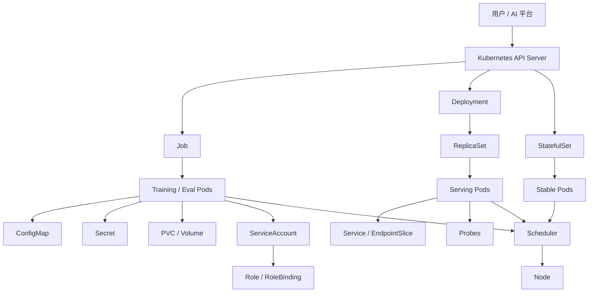

# 第19a章：Kubernetes AI 工作负载对象建模

> 本章回答一个基础但很容易被低估的问题：训练、推理、评测为什么不能只说“跑一个容器”，而要把业务生命周期翻译成 Pod、Job、Deployment、StatefulSet、probe、ConfigMap、Secret、Volume、ServiceAccount 和 RBAC 的组合。

---

## 19a.1 第一性原理拆解 + 学习大纲

### 拆：不可化简的问题

AI 工作负载建模的不可化简问题是：

**把训练、推理、评测的真实成功条件，翻译成 Kubernetes 能调度、恢复、观测和治理的对象生命周期。**

训练的成功条件不是“容器启动了”，而是数据版本正确、rank 能 rendezvous、GPU 可用、checkpoint 可写、主进程按预期完成或失败。推理的成功条件不是“端口开了”，而是模型加载完成、GPU 初始化完成、warmup 完成、依赖可达、Service 只把流量发给可服务副本。评测的成功条件也不是“脚本跑过”，而是模型、数据集、prompt 模板、指标代码和输出制品都可复现、可审计。

因此 Kubernetes 对象不是语法模板，而是生命周期语义：

- Pod 表达同调度、同网络、同卷、同生命周期的一组容器。
- Job 表达运行到完成，并把退出码、重试、并行度纳入状态机。
- Deployment 表达长期服务、副本维持、滚动升级和回滚。
- StatefulSet 表达稳定身份、有序生命周期和稳定存储绑定。
- Probe 表达“启动、就绪、存活”这三个不同问题。
- ConfigMap、Secret、Volume 表达代码、配置、凭据、数据和状态的边界。
- ServiceAccount、RBAC 表达工作负载以什么身份访问 Kubernetes API 或外部系统。

### 推：从问题推导机制

从“多个容器需要共享网络和卷”推出 Pod。一个训练 Pod 可能包含 trainer、日志 sidecar、对象存储代理和 initContainer；它们需要共享目录、localhost 和生命周期。

从“跑完退出”推出 Job。训练、评测、离线 embedding、批量特征生成都需要完成语义、失败重试、超时和清理。

从“持续接流量”推出 Deployment。在线推理需要副本数、滚动升级、readiness 门禁、Service endpoint 自动更新和回滚。

从“副本不是可互换的”推出 StatefulSet。参数服务器、分片 serving、固定 rank、稳定 hostname、本地缓存 shard 需要身份稳定。

从“进程启动不等于可用”推出 probes。startup probe 保护慢启动，readiness probe 决定是否进入 Service 后端，liveness probe 只在进程不可恢复时触发重启。

从“镜像不能承载所有运行差异”推出配置、凭据和卷。镜像表达代码和运行时，ConfigMap 表达非敏感配置，Secret 表达敏感凭据，Volume/PVC 表达数据、模型、checkpoint 和缓存。

### 学习大纲

读完本章，你应该能回答：

1. 一个 AI 任务应该用 Pod、Job、Deployment 还是 StatefulSet 建模。
2. 训练、推理、评测分别需要哪些成功条件和失败边界。
3. startup、readiness、liveness probe 应该检查什么，不应该检查什么。
4. ConfigMap、Secret、环境变量、Volume、PVC 的边界在哪里。
5. ServiceAccount 和 RBAC 如何限制工作负载权限。
6. 如何写出可落地的训练 Job YAML 和推理 Deployment YAML。
7. 如何从症状、证据、根因、处理动作排查常见问题。

---

## 19a.2 概念先说清楚

### Pod 是什么，不是什么

Pod 是 Kubernetes 的最小调度单元。它不是“一个容器”的同义词。一个 Pod 可以包含多个容器，这些容器共享：

- 同一个网络 namespace，因此可以通过 `localhost` 互相访问。
- 同一组 Volume，因此可以共享模型文件、配置、日志缓冲和 checkpoint 临时目录。
- 同一个调度结果，因此会一起落到同一个节点。
- 相近的生命周期，因此 initContainer、主容器和 sidecar 要按 Pod 级别理解。

Pod 不适合直接作为生产副本管理单位。裸 Pod 没有副本维持、滚动升级、完成状态聚合和控制器级重试。生产中通常由 Job、Deployment、StatefulSet 或 AI Operator 创建 Pod。

### Job 是什么，不是什么

Job 是“运行到完成”的控制器。它关心有多少 Pod 成功完成、失败如何重试、最多运行多久、完成后是否清理。

Job 不是所有后台任务的泛称，也不适合在线推理服务。训练、评测、批处理适合 Job，因为它们有明确终点；推理服务不适合 Job，因为它需要长期维持、滚动升级和流量治理。

### Deployment 是什么，不是什么

Deployment 是长期服务的副本控制器。它通过 ReplicaSet 维持副本数，支持滚动升级、回滚和声明式更新。

Deployment 不是“部署 YAML 文件”。它的核心语义是：有一组可替换副本，这些副本应持续运行，并且可以用新版本逐步替换旧版本。在线推理、embedding API、reranker 服务、模型网关都常用 Deployment。

### StatefulSet 是什么，不是什么

StatefulSet 是有稳定身份的副本控制器。它提供稳定 ordinal、稳定 hostname、有序创建/删除，以及通过 `volumeClaimTemplates` 给每个副本绑定稳定存储。

StatefulSet 不是更高级的 Deployment。对于完全无状态、任意副本可替换的推理服务，Deployment 更简单。只有当副本身份、启动顺序或存储绑定影响正确性时，才需要 StatefulSet。

### ConfigMap、Secret、Volume、PVC 的边界

| 对象 | 是什么 | 不是什么 | AI 场景 |
|------|--------|----------|---------|
| ConfigMap | 非敏感配置对象 | 凭据仓库、大文件仓库 | 超参、模型名、feature flag、服务配置 |
| Secret | 敏感配置对象 | 绝对安全保险箱、大模型权重存储 | 对象存储 token、registry 凭据、API key |
| Volume | Pod 内可挂载文件系统视图 | 一定持久的存储 | 配置、临时缓存、checkpoint、模型目录 |
| PVC | 对持久存储的声明 | 存储实现本身 | checkpoint、共享数据、模型缓存、评测输出 |
| 环境变量 | 进程启动参数注入方式 | 大配置文件或频繁变化状态 | rank、world size、endpoint、开关 |

### ServiceAccount 与 RBAC 的边界

ServiceAccount 是 Pod 在 Kubernetes 集群内的身份。RBAC 决定这个身份能对哪些资源执行哪些动作。

它们不等同于业务用户权限，也不应该默认给工作负载管理员权限。训练脚本通常不需要列出所有 Secret；推理服务通常也不需要创建 Pod。生产原则是最小权限：只给任务完成所需的 API 权限，并把对象存储、模型仓库、实验追踪系统的凭据独立治理。

---

## 19a.3 架构：组件、路径与责任边界

### 对象关系



### 控制路径

控制路径负责把期望状态推进到真实状态：

1. 用户或 AI 平台提交 Job、Deployment、StatefulSet。
2. API Server 持久化对象。
3. 对应 controller 创建或更新 Pod。
4. scheduler 为未绑定 Pod 选择节点。
5. kubelet 在节点上拉镜像、挂卷、注入 Secret/ConfigMap、启动容器。
6. kubelet 上报 Pod 状态、容器状态和 probe 结果。
7. controller 根据状态决定重试、扩缩容、滚动升级或标记完成。

### 数据路径

数据路径取决于工作负载类型：

- 训练：数据集或样本流从对象存储、并行文件系统、PVC 或数据服务进入 trainer；checkpoint 写回 PVC 或对象存储；metrics 写入实验追踪系统。
- 推理：客户端请求经过 Ingress/Gateway、Service、EndpointSlice 到达 ready Pod；服务读取模型权重、使用 GPU 推理、返回结果。
- 评测：评测 Job 读取固定模型版本和 benchmark，生成分数、报告、失败样本和审计记录。

### 责任边界

| 层次 | 负责什么 | 不负责什么 |
|------|----------|------------|
| Kubernetes | 调度、启动、重启、滚动、挂卷、状态、事件 | 判断模型是否合格、选择数据集版本 |
| AI 平台 | 任务语义、模型版本、数据血缘、发布门禁、成本归因 | 代替 kubelet 管理容器生命周期 |
| 应用代码 | 训练循环、推理逻辑、健康状态、退出码 | 伪造 Kubernetes 对象状态 |
| 存储系统 | 数据、模型、checkpoint 的持久化和吞吐 | 决定 Job 是否应该重试 |
| 安全治理 | 身份、凭据、RBAC、审计、网络边界 | 用 Secret 替代所有密钥轮换制度 |

---

## 19a.4 原理：为什么这些机制存在

### 生命周期语义比容器命令更重要

同样是 `python main.py`，在训练、评测、推理中含义完全不同。

训练命令退出为 0 可能表示训练完成；退出非 0 可能表示数据坏、CUDA OOM、节点中断、checkpoint 写失败。平台需要知道哪些可以重试，哪些应该直接失败。

推理命令不应该主动退出。退出通常表示崩溃、被探针杀死、OOM 或滚动升级。平台关注的是副本是否足够、是否 ready、是否在升级窗口内。

评测命令需要输入固定、输出幂等。重复运行不能污染同一个结果目录，也不能把部分输出误认为完整报告。

### Controller 是状态机，不是脚本

Job controller、Deployment controller、StatefulSet controller 都在持续 reconcile。它们不是创建一次 Pod 就结束，而是不断比较期望状态和真实状态。

Deployment 的期望状态是“有 N 个满足新模板的 ready 副本，并按策略替换旧副本”。Job 的期望状态是“达到指定成功完成数，或在失败策略下终止”。StatefulSet 的期望状态是“每个 ordinal 对应一个符合模板的 Pod 和稳定 PVC”。

理解这一点后，就能解释很多现象：

- 手动删除 Deployment 创建的 Pod，它会被重建。
- 修改 ConfigMap 内容，Deployment 不一定自动滚动，因为 Pod 模板没变。
- Job 失败后可能创建新 Pod，而不是重启同一个 Pod。
- StatefulSet 的 `worker-0` 重建后仍然叫 `worker-0`，并绑定同一个 PVC。

### Probe 是流量和重启的控制信号

三种 probe 回答不同问题：

| Probe | 回答的问题 | 失败后的动作 | AI 中的典型检查 |
|------|------------|--------------|----------------|
| startupProbe | 慢启动阶段是否结束 | 失败超过阈值后杀容器 | 权重下载完成、CUDA context 初始化、engine build 完成 |
| readinessProbe | 当前副本能否接流量 | 从 Service endpoint 移除 | 模型已加载、warmup 完成、依赖可达、限流状态正常 |
| livenessProbe | 进程是否不可恢复 | 重启容器 | 主事件循环卡死、健康线程失联、内部 fatal 状态 |

AI 服务的启动可能很慢。没有 startup probe 时，liveness probe 可能在模型加载过程中误杀容器，形成 CrashLoopBackOff。readiness 太宽松会让未加载模型的副本接流量；liveness 太激进会在长 prefill、checkpoint 保存或 GC 抖动时误杀进程。

### 配置分层是为了可发布、可回滚、可审计

把模型权重、超参、token、启动脚本都塞进镜像，会让每次配置变化都变成镜像发布。合理分层是：

- 镜像：代码、依赖、CUDA 用户态库、启动入口。
- ConfigMap：非敏感配置、默认参数、服务路由规则。
- Secret：凭据、token、私钥、registry auth。
- PVC/对象存储：数据集、模型权重、checkpoint、评测结果。
- 环境变量：少量进程启动参数和平台注入上下文。

这种分层让镜像可以稳定复用，让配置可以审计，让凭据可以轮换，让模型发布可以独立于代码发布。

---

## 19a.5 训练、推理、评测的语义选择

### 决策表

| 场景 | 首选对象 | 为什么 | 什么时候升级为 CRD/Operator |
|------|----------|--------|------------------------------|
| 单机单卡训练 | Job | 跑完退出、可重试、状态明确 | 需要实验管理、自动 resume、队列准入 |
| 单机多卡训练 | Job | 一个 Pod 申请多张 GPU，进程内部管理多卡 | 需要 gang、弹性训练、复杂 rank |
| 多节点分布式训练 | TorchJob / MPIJob / JobSet | 多角色、多 Pod、rank 和 rendezvous 复杂 | 通常直接使用 AI CRD |
| 离线评测 | Job | 输入固定、输出报告、完成后退出 | 需要 Workflow、批量矩阵评测 |
| 在线推理 | Deployment + Service | 长期服务、副本维持、滚动升级 | 需要 KServe、灰度、自动扩缩容 |
| 有状态分片推理 | StatefulSet + Service | shard 身份和存储稳定 | 需要模型路由控制面 |
| Notebook / debug | Pod 或 Deployment | 交互式生命周期特殊 | 需要租户隔离和会话管理 |

### 训练语义

训练任务要显式设计：

- 输入：数据集版本、初始 checkpoint、超参、代码版本。
- 资源：GPU 数、CPU/内存、临时盘、网络、共享内存。
- 运行：命令、环境变量、rank、随机种子、超时。
- 输出：checkpoint、metrics、日志、profile、训练 manifest。
- 失败：是否重试、是否 resume、哪些退出码不可重试。

单机训练优先用 Job。分布式训练如果涉及多个 Pod，不建议手写一组 Job；应使用 19c 的 TorchJob、MPIJob、RayJob 或 JobSet。

### 推理语义

推理服务要显式设计：

- 服务入口：Service、Ingress/Gateway、端口、协议。
- 副本：replicas、滚动升级策略、PodDisruptionBudget。
- 模型加载：权重路径、缓存目录、startup probe。
- 流量门禁：readiness probe、EndpointSlice、负载均衡。
- 稳定性：liveness probe、限流、优雅终止、preStop。
- 观测：QPS、错误率、TTFT、TPOT、GPU 利用率、队列长度。

Deployment 适合无状态或近似无状态推理。若每个副本对应固定 shard、固定本地缓存或固定 rank，则考虑 StatefulSet。

### 评测语义

评测要比训练更强调可复现：

- 输入模型必须是不可变版本，例如 `models/reranker:v42` 或对象存储 digest。
- benchmark、prompt 模板、指标代码要记录版本。
- 输出目录要唯一，避免重试覆盖已完成结果。
- 重试要幂等，部分输出必须可识别。
- 结果要写入可审计位置，而不只在容器日志里。

---

## 19a.6 工程化：配置、发布、观测与治理

### 环境变量设计

环境变量适合少量启动参数，不适合承载大配置。常见环境变量：

| 变量 | 来源 | 用途 |
|------|------|------|
| `MODEL_ID` | ConfigMap / 平台注入 | 模型逻辑名 |
| `MODEL_URI` | ConfigMap / 发布系统 | 模型权重位置 |
| `RANK`、`WORLD_SIZE` | Operator / 启动器注入 | 分布式训练 |
| `POD_NAME`、`NODE_NAME` | Downward API | 日志、观测、调试 |
| `CUDA_VISIBLE_DEVICES` | Device plugin / runtime | GPU 可见性 |
| `AWS_ACCESS_KEY_ID` | Secret | 对象存储访问 |

通过 Downward API 注入 Pod 元数据：

```yaml
env:
  - name: POD_NAME
    valueFrom:
      fieldRef:
        fieldPath: metadata.name
  - name: NODE_NAME
    valueFrom:
      fieldRef:
        fieldPath: spec.nodeName
```

### ConfigMap 与发布

ConfigMap 挂载为文件时，文件内容可能更新，但应用不一定重新加载。环境变量来自 ConfigMap 时，Pod 不会自动刷新。生产常用做法是把 ConfigMap 内容 hash 写进 Pod template annotation，配置变化触发 Deployment rollout：

```yaml
metadata:
  annotations:
    checksum/config: "sha256-of-rendered-config"
```

### Secret 与权限

Secret 需要配套治理：

- 开启 etcd encryption at rest。
- 用 RBAC 限制读取 Secret 的主体。
- 优先使用短期凭证或工作负载身份，减少长期 key。
- 不把 Secret 打进镜像、ConfigMap、日志或异常栈。
- 为不同环境和 namespace 使用不同 Secret。

### Volume 与 PVC 设计

AI 任务常见存储选择：

| 存储 | 适合 | 风险 |
|------|------|------|
| `emptyDir` | 临时 scratch、解压缓存、IPC 文件 | Pod 删除即丢；占节点临时存储 |
| `emptyDir.medium: Memory` | `/dev/shm`、小型高速缓存 | 占内存，可能触发 OOM |
| PVC 云盘 | checkpoint、评测结果 | 单盘吞吐和挂载模式限制 |
| 并行文件系统 PVC | 大数据集、多 worker 共享读 | 元数据压力、热点文件 |
| 对象存储 CSI / SDK | 模型仓库、归档、跨集群共享 | 一致性、吞吐、凭据、重试语义 |
| hostPath | 特殊驱动目录、节点本地调试 | 安全风险高，生产要限制 |

### 版本矩阵

生产发布前至少维护这张矩阵：

| 维度 | 示例 | 验证点 |
|------|------|--------|
| Kubernetes | 1.28 / 1.29 / 1.30 | API 版本、probe 行为、调度特性 |
| 容器运行时 | containerd 1.7+ | runtimeClass、GPU 注入 |
| NVIDIA driver | 535 / 550 / 560 | 与 CUDA 用户态兼容 |
| CUDA 镜像 | 12.2 / 12.4 / 12.5 | `nvidia-smi`、框架 ABI |
| AI 框架 | PyTorch、TensorRT-LLM、vLLM | NCCL、CUDA graph、算子兼容 |
| StorageClass | cephfs、lustre、云盘 | RWX/RWO、吞吐、延迟 |
| Ingress/Gateway | NGINX、Envoy、Gateway API | 超时、流式响应、连接保持 |

### 观测

最小观测面：

- Kubernetes：Pod phase、container state、restart count、events、Job condition、Deployment rollout。
- 应用：训练 step、loss、样本吞吐、评测 case 进度、推理 QPS、错误率、延迟。
- GPU：利用率、显存、功耗、XID、ECC、温度。
- 存储：读写吞吐、IOPS、延迟、容量、挂载失败。
- 发布：镜像 digest、模型版本、配置 checksum、Git commit、操作者。

### 治理

生产集群应默认具备：

- namespace 级 ResourceQuota 和 LimitRange。
- ServiceAccount 最小权限。
- Pod Security 标准和禁止危险 hostPath。
- 镜像来源白名单和签名校验。
- Secret 轮换和访问审计。
- NetworkPolicy 或服务网格策略。
- Job TTL 和日志/制品归档策略。

---

## 19a.7 方案设计：训练 Job 与推理 Deployment

### 设计方案 A：reranker 训练流水线

目标：训练一个 reranker，产出 checkpoint，评测通过后再上线。

| 阶段 | Kubernetes 对象 | 输入 | 输出 | 成功条件 |
|------|----------------|------|------|----------|
| 训练 | Job | 数据集版本、超参、初始模型 | checkpoint、metrics | 主进程退出 0，checkpoint manifest 完整 |
| 评测 | Job | checkpoint、benchmark、指标代码 | score、报告 | 全部 case 完成，报告校验通过 |
| 发布 | 平台控制面 | 评测报告、审批策略 | 模型版本指针 | 分数达标且审批通过 |
| 推理 | Deployment + Service | 模型版本、服务配置 | 在线响应 | readiness 成功，SLO 达标 |

### 训练 YAML

```yaml
apiVersion: v1
kind: ConfigMap
metadata:
  name: reranker-train-config
data:
  config.yaml: |
    model: bge-reranker-large
    dataset_uri: s3://datasets/reranker/2026-05-01
    output_uri: s3://models/reranker/runs/run-20260504
    max_steps: 20000
    checkpoint_interval: 1000
    batch_size: 64
---
apiVersion: v1
kind: Secret
metadata:
  name: object-store-cred
type: Opaque
stringData:
  AWS_ACCESS_KEY_ID: replace-me
  AWS_SECRET_ACCESS_KEY: replace-me
---
apiVersion: v1
kind: PersistentVolumeClaim
metadata:
  name: reranker-checkpoints
spec:
  accessModes: ["ReadWriteOnce"]
  resources:
    requests:
      storage: 500Gi
  storageClassName: fast-ssd
---
apiVersion: batch/v1
kind: Job
metadata:
  name: train-reranker
  labels:
    app: reranker
    workload.ai.local/type: training
spec:
  backoffLimit: 2
  activeDeadlineSeconds: 86400
  ttlSecondsAfterFinished: 604800
  template:
    metadata:
      labels:
        app: reranker
    spec:
      restartPolicy: Never
      serviceAccountName: trainer-sa
      containers:
        - name: trainer
          image: registry.local/ai/reranker-train:cuda12.4-py310
          imagePullPolicy: IfNotPresent
          command: ["python", "-m", "train"]
          args:
            - "--config=/etc/train/config.yaml"
            - "--checkpoint-dir=/checkpoints"
          env:
            - name: POD_NAME
              valueFrom:
                fieldRef:
                  fieldPath: metadata.name
            - name: NODE_NAME
              valueFrom:
                fieldRef:
                  fieldPath: spec.nodeName
            - name: AWS_ACCESS_KEY_ID
              valueFrom:
                secretKeyRef:
                  name: object-store-cred
                  key: AWS_ACCESS_KEY_ID
            - name: AWS_SECRET_ACCESS_KEY
              valueFrom:
                secretKeyRef:
                  name: object-store-cred
                  key: AWS_SECRET_ACCESS_KEY
          resources:
            requests:
              cpu: "16"
              memory: 128Gi
              ephemeral-storage: 200Gi
            limits:
              cpu: "16"
              memory: 128Gi
              ephemeral-storage: 200Gi
              nvidia.com/gpu: 4
          volumeMounts:
            - name: config
              mountPath: /etc/train
              readOnly: true
            - name: checkpoint
              mountPath: /checkpoints
            - name: shm
              mountPath: /dev/shm
      volumes:
        - name: config
          configMap:
            name: reranker-train-config
        - name: checkpoint
          persistentVolumeClaim:
            claimName: reranker-checkpoints
        - name: shm
          emptyDir:
            medium: Memory
            sizeLimit: 32Gi
```

这个 YAML 的重点不是字段多，而是语义清楚：Job 负责完成状态，ConfigMap 负责超参，Secret 负责凭据，PVC 负责 checkpoint，`/dev/shm` 避免数据加载和多进程通信受默认共享内存限制影响。

### 推理 YAML

```yaml
apiVersion: v1
kind: ConfigMap
metadata:
  name: reranker-serving-config
data:
  MODEL_URI: "s3://models/reranker/releases/v42"
  MAX_BATCH_SIZE: "32"
  MAX_QUEUE_MS: "20"
---
apiVersion: apps/v1
kind: Deployment
metadata:
  name: reranker-serving
  labels:
    app: reranker-serving
spec:
  replicas: 3
  revisionHistoryLimit: 5
  strategy:
    type: RollingUpdate
    rollingUpdate:
      maxUnavailable: 0
      maxSurge: 1
  selector:
    matchLabels:
      app: reranker-serving
  template:
    metadata:
      labels:
        app: reranker-serving
      annotations:
        checksum/config: "replace-with-config-hash"
    spec:
      serviceAccountName: serving-sa
      terminationGracePeriodSeconds: 60
      containers:
        - name: server
          image: registry.local/ai/reranker-serving:cuda12.4-v42
          ports:
            - name: http
              containerPort: 8000
          envFrom:
            - configMapRef:
                name: reranker-serving-config
          resources:
            requests:
              cpu: "8"
              memory: 64Gi
            limits:
              cpu: "8"
              memory: 64Gi
              nvidia.com/gpu: 1
          startupProbe:
            httpGet:
              path: /health/startup
              port: http
            periodSeconds: 10
            failureThreshold: 90
          readinessProbe:
            httpGet:
              path: /health/ready
              port: http
            periodSeconds: 5
            timeoutSeconds: 2
            failureThreshold: 3
          livenessProbe:
            httpGet:
              path: /health/live
              port: http
            periodSeconds: 10
            timeoutSeconds: 2
            failureThreshold: 6
          lifecycle:
            preStop:
              httpGet:
                path: /admin/drain
                port: http
          volumeMounts:
            - name: model-cache
              mountPath: /models
      volumes:
        - name: model-cache
          emptyDir:
            sizeLimit: 200Gi
---
apiVersion: v1
kind: Service
metadata:
  name: reranker-serving
spec:
  selector:
    app: reranker-serving
  ports:
    - name: http
      port: 80
      targetPort: http
```

推理 YAML 的关键点是 `maxUnavailable: 0`、startup/readiness/liveness 分离、优雅终止和配置 checksum。模型加载很慢时，readiness 必须等真实可服务后才成功。

### RBAC 示例

多数训练和推理 Pod 不需要访问 Kubernetes API。如果确实需要读取同 namespace 的 ConfigMap 或上报自定义状态，可以给最小权限：

```yaml
apiVersion: v1
kind: ServiceAccount
metadata:
  name: trainer-sa
---
apiVersion: rbac.authorization.k8s.io/v1
kind: Role
metadata:
  name: trainer-read-config
rules:
  - apiGroups: [""]
    resources: ["configmaps"]
    verbs: ["get", "list"]
---
apiVersion: rbac.authorization.k8s.io/v1
kind: RoleBinding
metadata:
  name: trainer-read-config
subjects:
  - kind: ServiceAccount
    name: trainer-sa
roleRef:
  kind: Role
  name: trainer-read-config
  apiGroup: rbac.authorization.k8s.io
```

不要为了方便绑定 `cluster-admin`。这会让一个训练镜像漏洞变成集群级权限事故。

---

## 19a.8 故障排除：症状、证据、根因、动作

| 症状 | 证据 | 常见根因 | 处理动作 |
|------|------|----------|----------|
| Job 一直重试 | `kubectl describe job`、Pod exit code、上一次 Pod 日志 | 训练脚本非零退出、数据路径错误、OOM、checkpoint 写失败 | 固化退出码语义；区分可重试和不可重试；修复输入或资源 |
| Job 显示失败但日志丢了 | Pod 被清理、日志未采集、TTL 太短 | `ttlSecondsAfterFinished` 太短或日志 sidecar/agent 配置缺失 | 延长 TTL；先采集日志和制品再清理 |
| Deployment 有副本但无流量 | Service endpoints 为空、readiness 失败 | label selector 不匹配、readiness 不通过、端口名错误 | 对齐 selector；检查 probe；确认 containerPort 和 targetPort |
| Pod 启动很久后被杀 | events 显示 liveness failed | 缺少 startup probe，模型加载被误判为卡死 | 增加 startup probe；延后 liveness 生效 |
| 推理偶发 502/timeout | readiness 抖动、Ingress 日志、应用延迟 | readiness 太昂贵、warmup 不充分、优雅终止缺失 | 轻量化 readiness；增加 drain；调整滚动策略 |
| 配置改了不生效 | Pod env 未变、annotation 未变、进程未 reload | ConfigMap 更新不会自动重启已运行进程 | checksum annotation 触发 rollout；应用支持热加载 |
| Secret 更新不生效 | 环境变量仍是旧值 | env 注入只在进程启动时读取 | 重启 Pod；改用挂载文件并设计 reload |
| checkpoint 写失败 | 应用日志、PVC event、存储指标 | 权限、容量、挂载只读、token 过期、吞吐不足 | 修正权限和容量；轮换凭据；调整存储类型 |
| 容器内共享内存不足 | PyTorch dataloader crash、`No space left on device` | 默认 `/dev/shm` 太小 | 挂载 `emptyDir.medium: Memory` 到 `/dev/shm` |
| Pod 能启动但访问外部对象存储失败 | 应用日志、NetworkPolicy、Secret | Secret 错、网络策略拒绝、DNS 问题 | 验证 Secret；检查 egress；用短期凭证测试 |

排障顺序建议：

1. 看对象状态：`kubectl get job,pod,deploy,rs,svc,endpointslice`。
2. 看事件：`kubectl describe pod` 和 `kubectl describe job/deploy`。
3. 看上一轮容器日志：`kubectl logs --previous`。
4. 看配置和挂载：env、ConfigMap、Secret 引用、PVC event。
5. 看节点和存储：资源、临时盘、GPU、挂载、网络。
6. 最后再进入应用内部细节，避免一开始盲猜代码问题。

---

## 19a.9 反模式与 Checklist

### 反模式

| 反模式 | 为什么危险 | 更好的做法 |
|--------|------------|------------|
| 用 Deployment 跑训练 | 失败后不断重启，完成语义混乱，日志和 checkpoint 容易被覆盖 | 用 Job、TorchJob、MPIJob 或 RayJob |
| 用裸 Pod 跑生产推理 | 无副本维持、无滚动升级、无回滚语义 | 用 Deployment + Service 或 KServe |
| readiness 只检查端口 | 模型未加载也接流量 | 检查模型加载、warmup 和依赖状态 |
| liveness 发送真实大模型请求 | 健康检查消耗 GPU，压力下放大尾延迟 | 使用轻量内部状态 |
| 没有 startup probe | 慢启动模型被 liveness 误杀 | 为权重加载、engine build、warmup 预留启动窗口 |
| Secret 写进 ConfigMap 或镜像 | 凭据泄漏，轮换困难 | 使用 Secret、短期凭证和 RBAC |
| checkpoint 写到容器本地层 | Pod 重建后丢失 | 使用 PVC、对象存储或 checkpoint 服务 |
| 所有配置都用环境变量 | 大配置不可读、不可审计、不易热加载 | 大配置用 ConfigMap 文件 |
| 给工作负载 cluster-admin | 应用漏洞升级成集群级事故 | 最小权限 Role/RoleBinding |
| 不设置资源 requests | 调度器无法正确放置，节点容易过载 | CPU、内存、临时存储和 GPU 都声明清楚 |

### Checklist

- 任务是跑完退出，还是长期服务？
- 是否需要稳定 ordinal、hostname 或稳定 PVC？
- 训练失败后应该重试、resume、跳过，还是直接失败？
- 评测输出是否幂等，结果目录是否唯一？
- 推理 readiness 是否真的代表可以接真实流量？
- liveness 是否足够保守，避免误杀慢操作？
- 是否为慢启动模型配置了 startup probe？
- ConfigMap 变化是否能触发 rollout 或应用热加载？
- Secret 是否通过 RBAC、加密和轮换治理？
- checkpoint、模型权重、数据集和临时缓存分别放在哪里？
- ServiceAccount 是否是最小权限？
- 日志、metrics、退出码和制品是否能解释失败原因？

---

## 19a.10 Worked Example：把 reranker 从脚本变成平台工作负载

假设团队原来用一条命令完成全部流程：

```bash
python train.py && python eval.py && python serve.py
```

这在单机实验里可行，但放到 Kubernetes 后会把三种生命周期混在一起：

- 训练失败时，服务不会启动，但 Deployment 可能不断重启。
- 评测失败时，平台无法区分模型不合格还是基础设施错误。
- serving 进程和 checkpoint 版本绑定不清楚，回滚困难。
- 配置、凭据、模型权重都靠命令行拼接，审计困难。

更合理的拆分是：

```text
Train Job
  input: dataset v2026-05-01, base model v7, train config hash A
  output: checkpoint run-20260504, train metrics

Eval Job
  input: checkpoint run-20260504, benchmark v12, metric code hash B
  output: eval report, failed cases, release decision signal

Release Gate
  input: eval report, policy, approval
  output: model release pointer v42

Serving Deployment
  input: model release pointer v42, serving config hash C
  output: online endpoint and metrics
```

这套设计的关键收益是每个对象只有一个清楚生命周期：训练负责产出，评测负责判断，发布门禁负责决策，Deployment 负责稳定接流量。Kubernetes 负责执行和恢复这些对象，AI 平台负责模型语义和发布策略。

---

## 本章小结

Pod、Job、Deployment、StatefulSet 不是对象名清单，而是四种生命周期语义。AI 平台建模的核心，是把训练、推理、评测的真实成功条件映射到正确的控制器、probe、配置、凭据、存储和权限边界上。对象选对，失败会变得可解释；对象选错，系统会把业务语义混成一堆重启、Pending、502 和丢失的 checkpoint。

## 练习题

1. 一个 8 卡单机训练任务，输入数据在对象存储，checkpoint 要持久化。请写出它应该使用的 Kubernetes 对象清单，并说明每个对象的责任。
2. 一个推理服务启动需要 20 分钟加载权重和构建 engine。请设计 startup、readiness、liveness probe 的检查内容和阈值。
3. 为什么 ConfigMap 更新后，正在运行的推理 Pod 可能仍然使用旧配置？你会如何设计发布流程？
4. 一个评测 Job 重试后覆盖了第一次运行的部分结果。请指出设计缺陷，并给出幂等输出方案。
5. 训练 Pod 需要读取同 namespace 的一个 ConfigMap，但不需要访问 Secret。请写出最小 RBAC 思路。
6. 什么时候应该把推理服务从 Deployment 改成 StatefulSet？请给出至少两个判断条件。
