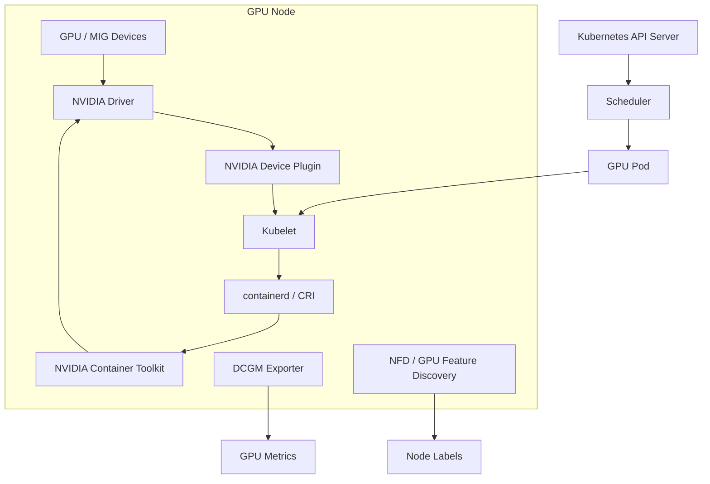

# 第19b章：GPU 调度、设备插件与拓扑感知

> GPU 在 Kubernetes 里不是“更贵的 CPU”。本章从 GPU Device Plugin、GPU Operator、MIG、Node Feature Discovery、节点标签、taint/toleration、亲和、拓扑分布、NUMA、NVLink 和 RDMA locality 出发，解释为什么 AI 任务经常“有卡但 Pending”，或者“能调度但跑不快”。

---

## 19b.1 第一性原理拆解 + 学习大纲

### 拆：不可化简的问题

GPU 调度的不可化简问题是：

**AI 任务需要的不是任意 N 张 GPU，而是一组满足型号、显存、切分方式、驱动、拓扑、网络和租户策略约束的设备集合。**

一个小模型推理副本可能只需要任意 1 张 L4。一个 70B 推理服务可能需要同机 8 张 H100，并且最好在同一个 NVSwitch domain。一个 64 卡训练任务不仅需要 8 台各有 8 张空闲卡的节点，还需要 RDMA fabric、NCCL 可达、机架分布、CPU/GPU/NIC locality 和一致的软件版本。

Kubernetes 默认调度器擅长处理 CPU、内存和扩展资源数量。GPU 通过 device plugin 暴露为 `nvidia.com/gpu` 或 MIG profile 资源后，调度器能知道“节点还有几个设备可分配”。但这个数量不自动表达：

- GPU 型号和显存大小。
- MIG profile 与整卡的区别。
- GPU 之间是否有 NVLink / NVSwitch。
- GPU、CPU、NIC 是否在同一个 NUMA locality。
- 跨节点是否有 RDMA，NCCL 是否会走正确网卡。
- 节点驱动、container toolkit、CUDA 镜像是否兼容。
- 这个租户是否允许使用该卡型和节点池。

所以 GPU 调度是信号工程和策略工程：把硬件事实、软件基线、网络拓扑和组织策略变成调度器、准入系统和用户都能理解的约束。

### 推：从问题推导机制

从“GPU 要被 kubelet 和调度器看见”推出 GPU Device Plugin。

从“驱动、容器工具链、device plugin、监控组件要一致”推出 GPU Operator。

从“一张物理卡要被切成多个硬件隔离实例”推出 MIG。

从“节点硬件事实要进入调度语言”推出 Node Feature Discovery 和节点标签。

从“GPU 节点不能被普通 CPU Pod 占满”推出 taint/toleration。

从“任务要落在特定卡型、节点池、机架或网络域”推出 nodeSelector、node affinity、pod affinity、pod anti-affinity 和 topology spread constraints。

从“数量正确不等于性能正确”推出 NUMA、NVLink、RDMA locality 的建模和排障。

### 学习大纲

读完本章，你应该能回答：

1. Device Plugin 在 Kubernetes GPU 链路中负责什么，不负责什么。
2. GPU Operator 管理哪些组件，为什么它不等于调度策略。
3. MIG 适合什么场景，为什么会产生资源碎片。
4. NFD、节点标签、taint/toleration、affinity 各自解决什么问题。
5. NUMA、NVLink、RDMA locality 为什么会影响训练和推理性能。
6. 如何设计一个 GPU 节点池和调度约束方案。
7. 如何按证据链排查 Pending、GPU 不可见、NCCL timeout 和吞吐异常。

---

## 19b.2 概念先说清楚

### GPU Device Plugin 是什么，不是什么

GPU Device Plugin 是 kubelet 的设备插件。它把节点上的 GPU 注册为 Kubernetes extended resource，例如：

```yaml
resources:
  limits:
    nvidia.com/gpu: 1
```

它负责向 kubelet 汇报设备列表和健康状态，并在容器启动时返回需要注入的设备信息。随后 NVIDIA container toolkit 和容器运行时把 `/dev/nvidia*`、driver library、环境变量等注入容器。

Device Plugin 不负责训练框架调优，不负责 NCCL 拓扑选择，也不保证申请到的多张 GPU 具备理想互联。默认调度器看到的主要是资源名和数量。

### GPU Operator 是什么，不是什么

GPU Operator 是节点 GPU 软件栈的运维控制面。典型组件包括：

- NVIDIA driver 或 driver manager。
- NVIDIA container toolkit。
- NVIDIA device plugin。
- DCGM exporter。
- MIG manager。
- GPU feature discovery 或与 NFD 集成的标签组件。
- validator 和节点健康检查组件。

GPU Operator 解决“节点基线一致”和“组件持续管理”。它不是容量规划器，不替代队列系统，也不会自动把一个 64 卡训练任务放到最优拓扑上。

### MIG 是什么，不是什么

MIG（Multi-Instance GPU）把支持的 NVIDIA GPU 切成多个硬件隔离实例。Kubernetes 中这些实例通常暴露为不同扩展资源，例如 `nvidia.com/mig-1g.10gb`。

MIG 不是显存超卖，也不是任意比例切片。它只能使用硬件支持的 profile，并会带来碎片治理问题。MIG 适合小模型推理、Notebook、开发环境和强隔离多租户；不适合需要整卡显存、大规模 GPU-GPU 通信或频繁改变切分形状的任务。

### NFD、标签、污点、亲和的边界

| 机制 | 解决什么 | 不解决什么 |
|------|----------|------------|
| NFD | 自动发现 CPU、PCI、内核、设备等特征并打标签 | 判断业务是否该用这些节点 |
| 节点标签 | 把硬件、拓扑、节点池、运维状态表达给调度策略 | 自动保证标签永远正确 |
| taint/toleration | 控制哪些 Pod 可以进入节点 | 选择最优节点或最优 GPU |
| node affinity | 选择具备某些节点特征的节点 | 表达单节点内部具体哪张 GPU |
| pod affinity | 让 Pod 靠近某些已有 Pod | 保证 GPU/NIC locality |
| pod anti-affinity | 让 Pod 远离某些已有 Pod | 保证资源性能不互相干扰 |
| topology spread | 控制副本跨 zone、rack、node 分布 | 表达 GPU-GPU/NIC 细粒度拓扑 |

---

## 19b.3 架构：设备注册、调度与容器启动路径

### 关键组件



### 控制路径

1. GPU Operator 或运维系统安装 driver、toolkit、device plugin、DCGM、NFD。
2. Device Plugin 通过 kubelet device plugin API 注册 `nvidia.com/gpu` 或 MIG 资源。
3. kubelet 把节点 `capacity` 和 `allocatable` 上报给 API Server。
4. NFD / GPU feature discovery 给节点打上卡型、显存、MIG、PCI、CPU、网络等标签。
5. 用户提交带 GPU request/limit、toleration、affinity 的 Pod。
6. scheduler 根据资源数量、标签、污点、亲和、拓扑分布和队列策略选节点。
7. kubelet 调用 device plugin 分配设备，并通过 runtime/toolkit 注入容器。
8. 应用在容器内通过 CUDA、NCCL、框架 runtime 使用 GPU。

### 数据路径

GPU 任务的数据路径通常包括：

- CPU 内存到 GPU 显存的拷贝。
- GPU 之间通过 PCIe、NVLink 或 NVSwitch 通信。
- GPU 与 NIC 之间通过 PCIe/NUMA 路径进行 RDMA 或普通网络通信。
- 数据集、checkpoint、模型权重通过本地 NVMe、PVC、并行文件系统或对象存储读写。

调度只选节点不等于选中了正确数据路径。多卡训练和大模型推理经常在“数量满足、路径不优”时出现吞吐下降。

### 责任边界

| 层次 | 负责什么 | 不负责什么 |
|------|----------|------------|
| Device Plugin | 暴露设备、健康状态、设备分配信息 | 容量规划、队列公平、NCCL 调优 |
| GPU Operator | 安装和管理节点 GPU 软件栈 | 业务调度策略和模型性能目标 |
| NFD / 标签系统 | 把硬件事实变成标签 | 保证策略设计正确 |
| Scheduler | 根据资源和约束选节点 | 理解所有 AI 性能语义 |
| Kubelet / Runtime | 启动容器、注入设备 | 判断训练是否收敛 |
| AI 平台 | 队列、配额、准入、拓扑策略、用户解释 | 替代底层设备插件 |

---

## 19b.4 原理：底层机制如何工作

### Extended Resource 为什么必须用 limits

GPU 通常以 extended resource 暴露。Kubernetes 对这类资源不支持像 CPU 一样的超卖语义，调度时按离散整数分配。实际 YAML 通常只写 `limits`：

```yaml
resources:
  limits:
    nvidia.com/gpu: 4
```

对 GPU 来说，“申请 4 张卡”意味着容器需要独占或按插件语义获得 4 个设备。调度器会在节点 allocatable 中扣减对应数量，但它不知道这 4 张卡在节点内部的 PCIe/NVLink 位置，除非使用额外插件或策略。

### Device Plugin 的核心接口

Device Plugin 的逻辑可以简化为：

```text
ListAndWatch: 持续告诉 kubelet 节点有哪些设备、哪些健康
Allocate: 当 Pod 被分配设备时，返回设备节点、挂载、环境变量等注入信息
GetPreferredAllocation: 可选，给 kubelet 推荐更合适的设备组合
```

`GetPreferredAllocation` 可以帮助节点内设备选择，但它不等价于全局拓扑调度。跨节点、跨机架、跨 RDMA fabric 的选择仍然需要调度层和平台层协作。

### GPU Operator 为什么存在

没有 Operator 时，节点 GPU 栈常出现漂移：

- 有的节点 driver 版本不同。
- 有的节点 container toolkit 缺失。
- device plugin DaemonSet 没运行或版本不一致。
- MIG 配置变更后资源名没有正确刷新。
- DCGM 指标缺失，导致观测断层。

GPU Operator 把这些组件作为 Kubernetes 资源持续管理，减少人工 SSH 运维。但它仍然需要版本矩阵、变更窗口和回滚策略。

### MIG 的资源形状

MIG 把一张物理 GPU 切成固定 profile。调度器看到的是 profile 资源数量，不是“显存总和”。例如一个节点暴露：

```text
nvidia.com/mig-1g.10gb: 4
nvidia.com/mig-3g.40gb: 1
```

一个需要 `nvidia.com/mig-7g.80gb: 1` 的 Pod 不能用四个 `1g.10gb` 拼出来。MIG 碎片就是资源形状不匹配，而不是简单容量不足。

### Scheduling Framework：kube-scheduler 的扩展点

章节前面提到 "scheduler 选节点"，但 kube-scheduler 1.19+ 的实际架构是 **Scheduling Framework**——一个有 11 个扩展点的 plugin 系统。所有自定义 GPU 调度器（Volcano、scheduler-plugins、Yunikorn）都基于这套机制。理解这套，"Volcano 是替换 default scheduler 还是扩展它" 这种问题才有答案。

11 个扩展点（按一个 Pod 调度的时序）：

```text
[QueueSort]      -> 决定 pending pod 队列顺序（FIFO 或自定义优先级）
[PreFilter]      -> 预处理 pod，缓存信息供 Filter 用（如算 PodAffinity 需求）
[Filter]         -> 对每个候选节点判断"能不能放下"（资源、taint、affinity）
[PostFilter]     -> Filter 全部失败时跑（默认抢占 plugin 在这里）
[PreScore]       -> 预处理用于打分
[Score]          -> 对通过 Filter 的节点打 0-100 分
[NormalizeScore] -> 各 plugin 分数归一化
[Reserve]        -> 选定节点后预留资源（Pod 状态尚未持久化）
[Permit]         -> 最后审批（gang scheduling 在这里等其他 Pod）
[PreBind]        -> 实际 bind 前的最后准备（如 PV provisioning）
[Bind]           -> 写 Pod.spec.nodeName 到 API server
[PostBind]       -> bind 完成后的副作用（metrics、event）
```

每个 plugin 可以注册到一个或多个扩展点。例如 NodeResourcesFit plugin 同时在 PreFilter / Filter / Score 三处出现：PreFilter 算 Pod 资源需求并缓存，Filter 判断节点是否有足够可分配资源，Score 给"剩余资源越多越好"或"打包越紧越好"的节点更高分。

**Volcano vs scheduler-plugins vs default scheduler 的关系**：

| 形态 | 实现方式 | 部署 | 影响范围 |
|---|---|---|---|
| **default scheduler** | kube-scheduler binary 内置 | K8s 控制平面默认 | 集群所有 `schedulerName: default-scheduler` 的 Pod |
| **scheduler-plugins**（kubernetes-sigs） | 在 default scheduler 框架上加 plugin（CapacityScheduling、CoScheduling、NodeResourceTopology 等），重编译一个新 scheduler binary | 替换或并行 default scheduler | 取决于配置 |
| **Volcano** | 完整独立 scheduler binary，自己的 plugin 系统（gang、drf、proportion、binpack、preempt），不基于 framework | 独立 Deployment，Pod 用 `schedulerName: volcano` 切到 | 仅 schedulerName 匹配的 Pod |
| **多 scheduler 共存** | 同集群跑多个 scheduler binary，按 schedulerName 分流 | 各自独立 | 必须保证不会同时 schedule 同一个 Pod |

工程含义：

- 一个集群可以同时跑 default scheduler 和 Volcano，AI 训练 Pod 用 `schedulerName: volcano`，普通服务保留 default scheduler。
- scheduler-plugins 的 CoScheduling 和 Volcano 的 gang plugin 解决同一问题（gang scheduling），实现完全不同——前者通过 Permit phase 等待，后者在自己的 Allocate 流程里整体调度。
- 自研 GPU 拓扑调度器（如把同 NVLink domain 的 GPU 优先分给同一 Pod）通常实现为 scheduler-plugins 的 Filter+Score plugin，而不是改 default scheduler。

### Topology Manager + Hint Provider：NUMA-aware 调度的实际机制

章节前面提了"开启 Topology Manager"，但它怎么工作没讲。这是 K8s NUMA-aware scheduling 的**唯一**机制。

**问题**：一台节点有 2 个 CPU socket（每 socket 一个 NUMA node），GPU 0-3 挂在 socket 0、GPU 4-7 挂在 socket 1，NIC 0 在 socket 0、NIC 1 在 socket 1。Pod 申请 1 GPU + 8 CPU + 32GB memory + 1 NIC，应该让这 4 类资源都在**同一个 NUMA**——否则跨 socket QPI/UPI 访问会让性能掉 10-30%。default scheduler 不解决这个，它只看节点级 allocatable。

**Topology Manager 的解法**：把"决策每个资源放哪个 NUMA"的责任推给 kubelet（在 admission 阶段），由 4 个 **Hint Provider** 协作：

```text
kubelet admission 收到 Pod after schedule:
  ├── CPU Manager: GetTopologyHints(pod, container)
  │       → "我倾向给这容器分配 socket=0 的 8 个 CPU"
  │       → returns [{NUMANodeAffinity: 0001, Preferred: true}]
  ├── Memory Manager: GetTopologyHints(pod, container)
  │       → "32GB memory 我可以从 socket 0 或 socket 1 分配"
  │       → returns [{0001, true}, {0010, true}]
  ├── Device Manager (NVIDIA Device Plugin GetPreferredAllocation):
  │       → "你要 1 GPU，按 NUMA 偏好我推荐 GPU-0（在 socket 0）"
  │       → returns [{0001, true}]
  └── Hugepages Manager (如果有): ...
  
Topology Manager 把 4 个 Hint Provider 的偏好做 mask 交集:
  socket 0 = 0001
  socket 0 or 1 = 0011
  socket 0 = 0001
  → 交集 = 0001 (socket 0)
  
Policy 决定怎么处理这个交集:
  - none:            完全不调用 Topology Manager (默认!)
  - best-effort:     有交集就用，没有也允许调度
  - restricted:      没有交集就 admission reject (Pod 永远 Pending)
  - single-numa-node: 必须是单 NUMA 内可满足
  
最终告诉每个 Manager:
  CPU Manager: "请从 socket 0 分配 CPU"
  Memory Manager: "请从 socket 0 分配 memory"  
  Device Manager: "请用 GPU-0"
```

**Topology Manager Scope**：

- `container`（默认）：每个容器独立算 hint。多容器 Pod 内不同容器可能分到不同 NUMA。
- `pod`：整个 Pod 当一个单元算，所有容器在同一 NUMA。多 GPU 训练通常用这个。

**Device Plugin 的 GetPreferredAllocation**：

NVIDIA Device Plugin 通过 NVML 拿到每个 GPU 的 NUMA node（`nvidia-smi topo -m` 看到的 `affinity`），在 `GetPreferredAllocation(available_devices, must_include, size)` 里返回**对该 NUMA 偏好最强**的 device 子集。Topology Manager 把这个 hint 与 CPU/Memory hint 求交集。

**生产开启**：

```yaml
# kubelet config
topologyManagerPolicy: single-numa-node
topologyManagerScope: pod
cpuManagerPolicy: static                # CPU Manager 必须是 static 才能 NUMA-aware
memoryManagerPolicy: Static             # 同上
reservedSystemCPUs: "0,1"               # 保留给系统
```

要点：

- CPU Manager 必须是 `static`，default 不分 NUMA。
- 节点必须用 `Guaranteed` QoS 的 Pod（CPU/memory request == limit、整数 CPU）才会被 NUMA-aware 处理——`Burstable` Pod 走简单路径。
- Topology Manager **不是 scheduler**！它在 kubelet admission 阶段工作，决策已经晚了——节点已经被 default scheduler 选好。如果该节点 NUMA 已被占满、当前 Pod 算出的 hint 是 0011（要跨 NUMA），`single-numa-node` policy 会拒绝该 Pod，Pod 重新进入调度循环可能再次落到同一节点又被拒。
- 解决"调度循环"问题需要 scheduler 端就感知 NUMA：scheduler-plugins 的 **NodeResourceTopology** plugin 让 scheduler 在 Filter 阶段就考虑 NUMA，避免 admission 反复拒。这是生产 NUMA-aware 调度的完整方案。

### PodGroup / Gang scheduling 在 scheduler 内部的实现

章节前面说"使用 gang scheduling"，但调度器**怎么知道一组 Pod 属于同一个 gang、什么时候不调度单个 Pod** 没讲。两种主流实现：

**方案 1：Volcano PodGroup**（独立 scheduler 路径）

```yaml
apiVersion: scheduling.volcano.sh/v1beta1
kind: PodGroup
metadata:
  name: train-job-pg
spec:
  minMember: 8                # 必须 8 个 Pod 都能 schedule 才整体 admit
  minResources:
    nvidia.com/gpu: 64        # 8 worker × 8 GPU
  queue: train-prod
```

```yaml
# Pod 通过 annotation 关联到 PodGroup
metadata:
  annotations:
    scheduling.volcano.sh/group-name: train-job-pg
```

Volcano scheduler 的 gang plugin 工作流程：

```text
1. Pod 来了不立即考虑调度，先 group 到 PodGroup
2. PodGroup 进入 Pending 状态，scheduler 看 minResources 是否在集群可获得
3. 资源够 → PodGroup 进入 Inqueue
4. scheduler Allocate 阶段：尝试给 PodGroup 内所有 Pod 找节点
   - 如果能找到 minMember 个可放置的位置 → batch bind 所有 Pod
   - 找不到 → 回滚已分配的临时 reservation，PodGroup 回到 Pending
5. 资源被部分释放后，PodGroup 重新尝试
```

关键点：**scheduler 不会先 bind 一部分 Pod、等其他 Pod 资源够了再 bind**——要么全部 bind，要么都不 bind。这就避免了"5 个 worker 跑起来占着卡，等剩下 3 个永远等不到"。

**方案 2：scheduler-plugins CoScheduling**（default scheduler + plugin）

不需要独立 scheduler binary，在 default scheduler 框架上加 CoScheduling plugin：

```yaml
metadata:
  labels:
    pod-group.scheduling.sigs.k8s.io/name: train-job-pg
    pod-group.scheduling.sigs.k8s.io/min-available: "8"
```

工作机制利用 Scheduling Framework 的 **Permit phase**：

```text
Pod 1 完成 Filter+Score → Reserve（占节点资源）→ Permit
  CoScheduling plugin 在 Permit: "我属于 train-job-pg，目前只有 1/8 到 Permit，wait 60s"
  → Pod 1 状态: Waiting in Permit (节点资源已 reserve 但 Pod 没 bind)

Pod 2 → 同样到 Permit → wait

...

Pod 8 → Permit: "我是第 8 个，gang 满足！"
  → CoScheduling 调用 framework.Allow 给所有 8 个 wait 中的 Pod
  → 所有 Pod 一起进入 PreBind/Bind，原子地写 nodeName

如果 60s 内 Pod 8 没到（比如资源不够无法 Filter 通过），
所有 wait 中的 Pod 触发 Reject，释放 reserve，重新进入 PendingQueue。
```

**两种方案的取舍**：

| 维度 | Volcano | scheduler-plugins CoScheduling |
|---|---|---|
| 实现 | 独立 scheduler binary | default scheduler + plugin |
| Permit timeout | scheduler 内部协调 | Permit phase 等待（默认 60s）|
| 资源占用风险 | scheduler 自己管 reservation 状态 | Reserve phase 已经占节点资源，等待期间其他 Pod 看不到 |
| 抢占语义 | 完整自定义抢占 | 复用 default scheduler 抢占 + gang 感知 |
| 适合场景 | 大规模批训练、HPC 风格 | K8s 原生场景中加 gang 能力 |
| 部署复杂度 | 需要 PodGroup CRD + Volcano controllers | 替换 scheduler image + 配置 plugin |

工程经验：

- 不要混用——同集群同时让 Volcano 和 default+CoScheduling 处理同一批 Pod 会出竞争。
- Permit phase 的 wait 不是"无限等"，超时后 Pod 会被 reject，需要重新进入调度——这意味着大 gang（>32 Pod）+ 资源紧张时，CoScheduling 会反复 reject-retry，吞吐很差。Volcano 的 PodGroup-level reservation 机制更适合大 gang。
- gang 的 `minMember` 不一定等于总 worker 数：弹性训练（PyTorch Elastic、DeepSpeed）允许 minMember < total，先用 minMember 个起步，后续 worker 加进来时弹性扩。这种场景必须用支持 elastic 的 gang 实现。

### NFD 和 GPU Feature Discovery 怎么工作

章节前面提了"NFD 自动打标签"，但 NFD 本身的架构和更新机制对调试"标签陈旧"事故很重要。

NFD 由 **master + worker** 组成：

```text
NFD-master (Deployment, 集群级):
  - 接收 worker 上报的 features
  - 决定哪些 feature 转换成 node label
  - 通过 NodeFeatureRule CRD 让用户自定义 feature → label 映射

NFD-worker (DaemonSet, 每节点一个):
  - 周期性扫描节点（默认 60s）:
    - CPU: cpuid 寄存器、特性
    - PCI: lspci，识别 NVIDIA GPU、Mellanox NIC
    - Kernel: 版本、内核模块
    - 文件系统: 检测特定路径存在
    - 自定义 source: 用户 hook
  - 上报给 master 或直接 patch node label

GPU Feature Discovery (GFD):
  - 是 NFD 之上的 GPU 专用扩展
  - 调 NVML 获取每张卡的型号、显存、CUDA capability、MIG 状态、driver 版本
  - 把这些信息打成标签:
      nvidia.com/gpu.product=NVIDIA-H100-80GB-HBM3
      nvidia.com/gpu.memory=81920
      nvidia.com/gpu.count=8
      nvidia.com/cuda.driver.major=535
      nvidia.com/mig.strategy=single
```

关键工程点：

- **更新延迟**：NFD-worker 默认 60s 扫一次，硬件变化（如 driver 升级、MIG profile 重切）后标签可能 1-2 分钟才更新。在窗口期内调度可能用旧标签。
- **静态 fact vs 动态状态**：NFD/GFD 暴露的是节点静态特性，**不是健康状态**。GPU XID 错误、ECC failure、MIG 错配这些"健康事实"必须通过 DCGM Exporter + 节点健康 controller 单独治理。把 ECC 错误的卡 cordon 是另一条机制（Node Problem Detector + custom controller）。
- **标签漂移**：手动 `kubectl label node` 加的自定义标签，如果和 NFD/GFD 标签命名冲突，重启 worker 时会被 NFD 覆盖。生产建议给所有人工标签用专属 prefix（如 `ai.local/`），与 NFD 的 `feature.node.kubernetes.io/`、GFD 的 `nvidia.com/` 区分。
- **审计**：定期对比 `kubectl get node -o yaml` 中的 NFD 标签 vs `nvidia-smi` 实际输出，发现不一致就重启对应 worker。这一步如果没做，"调度看到 H100 节点但容器跑起来发现是 A100" 是可能发生的（虽然罕见）。

### Locality 为什么决定性能

GPU 性能错配常来自 locality：

- NUMA：CPU 线程、内存、GPU、NIC 跨 socket 访问，数据路径变远。
- NVLink/NVSwitch：GPU-GPU 通信不在高速互联域内，allreduce 或 tensor parallel 变慢。
- RDMA：跨节点通信没走 IB/RoCE、走错网卡、rail 不对齐或 GPUDirect RDMA 未生效。
- 存储 locality：模型加载和 checkpoint 写入经过慢盘或拥塞网络。

在 Kubernetes YAML 中，`nvidia.com/gpu: 8` 只能表达数量，不能表达这些路径。平台要把 locality 转成标签、节点池、准入规则、调度插件或提交前校验。

---

## 19b.5 工程化：节点池、标签、版本、发布、观测、治理

### 节点池设计

GPU 集群不要只按“有 GPU”建一个大池。常见拆法：

| 节点池 | 适合 | 标签示例 | taint 示例 |
|--------|------|----------|------------|
| `gpu-h100-sxm-train` | 大训练、70B+ 推理 | `gpu.model=H100`、`gpu.fabric=nvswitch`、`rdma=true` | `ai.local/gpu=true:NoSchedule` |
| `gpu-l40s-serving` | 中小模型推理 | `gpu.model=L40S`、`workload=serving` | `ai.local/gpu=true:NoSchedule` |
| `gpu-a100-mig-dev` | Notebook、小模型、多租户 | `gpu.mig=enabled` | `ai.local/mig=true:NoSchedule` |
| `gpu-h100-maintenance` | 维护、烧机、隔离 | `maintenance=true` | `maintenance=true:NoSchedule` |

节点池边界越清楚，调度约束越容易解释。把所有型号、MIG、整卡、训练、推理混在一个池里，会让排障和容量治理变复杂。

### 标签规范

标签要稳定、可审计、可自动生成。示例：

```text
gpu.nvidia.com/model=H100
gpu.nvidia.com/memory=80gb
gpu.nvidia.com/product=NVIDIA-H100-80GB-HBM3
gpu.nvidia.com/mig.strategy=none
ai.local/gpu-pool=h100-sxm-train
ai.local/nvlink-domain=hgx-12
ai.local/rdma=true
ai.local/rdma-rail=dual
ai.local/local-nvme=true
topology.kubernetes.io/zone=az-a
topology.kubernetes.io/rack=rack-03
```

原则：

- 硬件事实尽量由 NFD/GPU feature discovery 自动生成。
- 平台策略标签由控制面生成，例如节点池、租户池、维护状态。
- 标签值要可枚举，避免自由文本。
- 定期校验标签和真实硬件是否一致。

### taint/toleration

GPU 节点通常要加 taint，防止普通 CPU Pod 占用 CPU、内存、临时盘或网络：

```text
ai.local/gpu=true:NoSchedule
```

GPU Pod 必须显式 toleration：

```yaml
tolerations:
  - key: ai.local/gpu
    operator: Equal
    value: "true"
    effect: NoSchedule
```

toleration 只表示“允许进入”，不表示“应该进入”。真正的放置还需要资源请求和 affinity。

### node affinity 与拓扑分布

硬约束用 `requiredDuringSchedulingIgnoredDuringExecution`，性能偏好用 `preferredDuringSchedulingIgnoredDuringExecution`：

```yaml
affinity:
  nodeAffinity:
    requiredDuringSchedulingIgnoredDuringExecution:
      nodeSelectorTerms:
        - matchExpressions:
            - key: ai.local/gpu-pool
              operator: In
              values: ["h100-sxm-train"]
            - key: ai.local/rdma
              operator: In
              values: ["true"]
    preferredDuringSchedulingIgnoredDuringExecution:
      - weight: 80
        preference:
          matchExpressions:
            - key: ai.local/local-nvme
              operator: In
              values: ["true"]
topologySpreadConstraints:
  - maxSkew: 1
    topologyKey: topology.kubernetes.io/rack
    whenUnsatisfiable: ScheduleAnyway
    labelSelector:
      matchLabels:
        app: llm-serving
```

把所有偏好都写成 required，会让 Pod 在资源紧张时长期 Pending。生产中要区分“没有就不能跑”和“没有就跑慢”。

### pod affinity / anti-affinity

推理副本通常希望分散，避免一个节点或机架故障影响全部副本：

```yaml
affinity:
  podAntiAffinity:
    preferredDuringSchedulingIgnoredDuringExecution:
      - weight: 100
        podAffinityTerm:
          labelSelector:
            matchLabels:
              app: reranker-serving
          topologyKey: kubernetes.io/hostname
```

训练作业的多角色 Pod 有时希望靠近同一机架，以降低网络延迟；有时希望跨故障域分散，以提高容错。选择取决于任务规模和容错策略。

### 版本矩阵

GPU 集群必须维护版本矩阵：

| 维度 | 示例 | 风险 |
|------|------|------|
| Kubernetes | 1.28 / 1.29 / 1.30 | Device plugin API、调度特性、RuntimeClass |
| NVIDIA driver | 535 / 550 / 560 | CUDA 兼容、MIG、GDS、NCCL |
| CUDA 用户态 | 12.2 / 12.4 / 12.5 | PyTorch / TensorRT / vLLM ABI |
| NVIDIA container toolkit | 1.14+ | 设备和库注入失败 |
| GPU Operator | 24.x / 25.x | 组件版本打包、CRD 行为 |
| Device Plugin | 与 Operator 匹配 | MIG resource 暴露策略 |
| NCCL | 2.18+ / 2.20+ | RDMA、NVLink、拓扑识别 |
| OFED / RDMA driver | 云厂商或发行版版本 | IB/RoCE、GPUDirect RDMA |

升级顺序通常是测试池验证，再灰度节点池，再扩大范围。不要在大训练窗口中滚动升级 driver 或 MIG 配置。

### 观测

最小观测面：

- 节点：GPU allocatable、device plugin Ready、driver 版本、MIG 状态、节点标签。
- Pod：Pending events、分配节点、容器内 `nvidia-smi`、环境变量、runtimeClass。
- GPU：利用率、显存、功耗、温度、ECC、XID、PCIe replay、NVLink counters。
- 训练：step time、samples/s、allreduce time、NCCL logs、重试次数。
- 网络：IB/RoCE link、GID、MTU、PFC/ECN、丢包、NCCL transport。
- 存储：模型加载时间、checkpoint 写入时间、吞吐和延迟。

### 治理

GPU 治理要覆盖：

- namespace / 队列级 GPU 配额。
- 卡型和节点池权限。
- 整卡池与 MIG 池比例。
- 优先级、抢占、gang scheduling 或队列准入。
- 维护 taint、节点 drain、烧机验证。
- 成本归因：租户、项目、作业、模型版本。
- 空闲检测：分配了 GPU 但利用率长期为 0 的任务要告警或回收。

---

## 19b.6 方案设计：GPU 调度决策表与 YAML

### 决策表

| 需求 | 推荐机制 | 原因 | 风险 |
|------|----------|------|------|
| 只需要任意 1 张 GPU | `limits.nvidia.com/gpu: 1` + GPU toleration | 简单直接 | 可能落到不合适卡型 |
| 需要指定卡型 | node affinity / nodeSelector | 用节点标签表达型号 | 标签漂移会误调度 |
| 需要小规格隔离 | MIG resource | 硬件隔离，提升利用率 | profile 碎片 |
| 需要同机 8 卡高速互联 | 整节点节点池 + `nvidia.com/gpu: 8` + 标签 | 避免跨弱拓扑 | 节点碎片导致 Pending |
| 需要 RDMA 训练 | RDMA 标签 + 队列准入 + NCCL 校验 | 数量和网络都要满足 | 标签正确但 fabric 异常 |
| 推理副本要高可用 | pod anti-affinity + topology spread | 分散故障域 | 过度分散影响缓存复用 |
| 普通 Pod 不能进 GPU 节点 | taint/toleration | 节点准入控制 | toleration 滥用 |

### 单卡推理 YAML

```yaml
apiVersion: apps/v1
kind: Deployment
metadata:
  name: embedding-serving
spec:
  replicas: 4
  selector:
    matchLabels:
      app: embedding-serving
  template:
    metadata:
      labels:
        app: embedding-serving
    spec:
      tolerations:
        - key: ai.local/gpu
          operator: Equal
          value: "true"
          effect: NoSchedule
      affinity:
        nodeAffinity:
          requiredDuringSchedulingIgnoredDuringExecution:
            nodeSelectorTerms:
              - matchExpressions:
                  - key: gpu.nvidia.com/model
                    operator: In
                    values: ["L40S", "L4"]
          preferredDuringSchedulingIgnoredDuringExecution:
            - weight: 50
              preference:
                matchExpressions:
                  - key: ai.local/local-nvme
                    operator: In
                    values: ["true"]
        podAntiAffinity:
          preferredDuringSchedulingIgnoredDuringExecution:
            - weight: 100
              podAffinityTerm:
                labelSelector:
                  matchLabels:
                    app: embedding-serving
                topologyKey: kubernetes.io/hostname
      containers:
        - name: server
          image: registry.local/ai/embedding-serving:cuda12.4
          resources:
            requests:
              cpu: "4"
              memory: 32Gi
            limits:
              cpu: "4"
              memory: 32Gi
              nvidia.com/gpu: 1
```

### 8 卡训练 worker YAML 片段

多节点训练通常由 TorchJob、MPIJob、RayJob 或 JobSet 生成 Pod。底层 worker template 应表达资源和拓扑硬约束：

```yaml
spec:
  tolerations:
    - key: ai.local/gpu
      operator: Equal
      value: "true"
      effect: NoSchedule
  affinity:
    nodeAffinity:
      requiredDuringSchedulingIgnoredDuringExecution:
        nodeSelectorTerms:
          - matchExpressions:
              - key: ai.local/gpu-pool
                operator: In
                values: ["h100-sxm-train"]
              - key: ai.local/rdma
                operator: In
                values: ["true"]
              - key: gpu.nvidia.com/mig.strategy
                operator: In
                values: ["none"]
  containers:
    - name: trainer
      image: registry.local/ai/train:cuda12.4-nccl2.20
      env:
        - name: NCCL_DEBUG
          value: INFO
        - name: NCCL_IB_HCA
          value: "mlx5_0,mlx5_1"
      resources:
        requests:
          cpu: "64"
          memory: 512Gi
          ephemeral-storage: 1Ti
        limits:
          cpu: "64"
          memory: 512Gi
          ephemeral-storage: 1Ti
          nvidia.com/gpu: 8
```

这只解决单个 worker 的节点选择。完整 64 卡训练还需要队列或 gang scheduling 确保 8 个 worker 同时拿到满足条件的节点，避免先启动的 worker 占卡等待，后续 worker 永远调不上。

---

## 19b.7 NUMA、NVLink、RDMA Locality 深入

### NUMA locality

NUMA 描述 CPU socket、内存和 PCIe 设备之间的距离。GPU、NIC、本地 NVMe 往往挂在某个 PCIe root complex 下，离某个 CPU socket 更近。

性能影响：

- dataloader 线程在远端 NUMA 分配内存，CPU 到 GPU 拷贝变慢。
- GPU 和 RDMA NIC 跨 NUMA，GPUDirect RDMA 路径变差。
- CPU offload 或参数卸载跨 socket，尾延迟变高。

证据：

```bash
lscpu
numactl --hardware
nvidia-smi topo -m
```

工程动作：

- 开启 CPU Manager static policy 和 Topology Manager。
- 为大训练预留整节点，减少混部干扰。
- 将 CPU、内存、GPU、NIC 亲和策略纳入节点画像。

### NVLink / NVSwitch locality

NVLink 和 NVSwitch 决定 GPU-GPU 带宽。Tensor parallel、pipeline parallel、FSDP、allreduce 都可能受影响。

典型错配：

- 同样申请 8 张 GPU，有的节点是 HGX NVSwitch，有的只是 PCIe GPU。
- 两个 4 卡推理 Pod 分别占用互联不理想的 GPU 组合。
- 节点被碎片化后，大任务拿不到完整 NVLink domain。

证据：

```bash
nvidia-smi topo -m
NCCL_DEBUG=INFO nccl-tests
```

工程动作：

- 把 HGX/NVSwitch 节点单独成池。
- 大模型推理和训练使用整节点调度。
- 通过准入系统拒绝不满足 topology profile 的提交。

### RDMA locality

跨节点训练依赖 RDMA fabric。Kubernetes Pod 网络能通，不代表 NCCL 走了正确 RDMA 路径。

常见问题：

- NCCL 退化到 TCP。
- 选错 HCA 或 GID。
- MTU 不一致。
- RoCE PFC/ECN 配置不正确。
- 多 rail 没有对齐。
- GPUDirect RDMA 未生效。

证据：

```bash
NCCL_DEBUG=INFO
NCCL_DEBUG_SUBSYS=INIT,NET
ibstat
ibv_devinfo
rdma link
```

工程动作：

- 用节点标签表达 `rdma=true`、rail、rack、fabric。
- 在训练镜像里固化 NCCL 和 RDMA 诊断工具。
- 提交前做准入校验，运行前做短 nccl-tests。
- 对网络变更建立独立变更窗口和回滚方案。

---

## 19b.8 故障排除：症状、证据、根因、动作

| 症状 | 证据 | 常见根因 | 处理动作 |
|------|------|----------|----------|
| Pod Pending: insufficient `nvidia.com/gpu` | `kubectl describe pod` events、node allocatable | GPU 数量不足、device plugin 未注册、节点被占满 | 查看 device plugin DaemonSet；核对 allocatable；释放或扩容 |
| 有空卡但调不上 | scheduler events、node labels、taints | toleration 缺失、affinity 太严、节点池标签不匹配 | 修正 toleration；把偏好改为 preferred；修复标签 |
| MIG Pod Pending | resource name、node allocatable | 请求的 MIG profile 不存在或碎片化 | 调整 profile；维护窗口重配 MIG；规划 MIG 池 |
| 容器内看不到 GPU | `nvidia-smi` 失败、容器 env | runtimeClass、toolkit、driver、device plugin 注入失败 | 检查 GPU Operator、container runtime、驱动和 Pod spec |
| `nvidia-smi` 正常但框架报 CUDA 错 | 应用日志、driver/CUDA 版本 | 镜像 CUDA、PyTorch、driver ABI 不兼容 | 对齐版本矩阵；替换镜像或升级 driver |
| 训练能跑但吞吐低 | step time、NCCL logs、DCGM | 跨 NUMA、NVLink 不匹配、未走 RDMA、存储慢 | 检查 `nvidia-smi topo -m`、NCCL transport、存储指标 |
| NCCL timeout | NCCL logs、网络指标 | RDMA 配置、MTU、GID、HCA 选择、节点间防火墙 | 固定 NCCL env；验证 ib link；跑 nccl-tests |
| GPU 利用率长期为 0 | DCGM、应用日志 | 数据加载卡住、挂载慢、进程等待 rank、死锁 | 看 dataloader、存储、rendezvous、rank 日志 |
| XID / ECC 错误 | DCGM、dmesg、GPU Operator validator | 硬件或驱动异常 | cordon/drain 节点；隔离 GPU；跑硬件诊断 |
| 推理延迟异常高 | TTFT/TPOT、GPU 利用率、拓扑 | 被调到弱卡、MIG profile 太小、CPU/NUMA 错配 | 固定卡型；调整 profile；优化 CPU/GPU 亲和 |

排查顺序：

1. 节点是否暴露预期 extended resource。
2. Pod 请求的资源名是否正确，尤其是 MIG profile。
3. taint/toleration、nodeSelector、affinity、topology spread 是否匹配。
4. Pod 是否真的被分配到符合卡型和节点池的节点。
5. 容器内 `nvidia-smi`、CUDA、框架是否正常。
6. NCCL、RDMA、NVLink、NUMA、存储路径是否符合性能预期。
7. 队列、配额、gang 条件和维护 taint 是否影响调度。

---

## 19b.9 反模式与 Checklist

### 反模式

| 反模式 | 后果 | 修正 |
|--------|------|------|
| 只按 GPU 数调度 | 能跑但吞吐不稳定 | 把卡型、显存、MIG、NVLink、RDMA 纳入调度信号 |
| 所有 GPU 节点不加 taint | CPU Pod 占用 GPU 节点资源 | GPU 节点统一 taint，GPU Pod 显式 toleration |
| 把所有偏好写成 required affinity | 资源紧张时大量 Pending | required 只放硬约束，preferred 放性能偏好 |
| 手工维护硬件标签且不审计 | 标签漂移导致误调度 | NFD/GFD 自动发现 + 定期校验 |
| 所有卡都切 MIG | 大训练和大模型推理无整卡池 | 独立规划整卡池、MIG 池和维护窗口 |
| 只看集群总空闲 GPU 数 | 忽略完整节点、卡型和拓扑形状 | 统计“满足任务 profile 的可用节点组” |
| 忽略 RDMA/NCCL 诊断 | 任务能跑但通信退化到 TCP | 标准化 NCCL env、nccl-tests 和网络指标 |
| GPU Operator 当成调度器 | 节点软件栈正常但策略仍然错误 | 单独建设队列、准入和拓扑调度策略 |
| 推理副本全部集中到一个节点 | 节点故障影响全部服务 | pod anti-affinity 和 topology spread |
| 不治理空闲 GPU | 成本失控，队列拥塞 | 利用率告警、空闲回收、成本归因 |

### Checklist

- device plugin DaemonSet 是否 Ready？
- 节点 `capacity/allocatable` 是否包含预期 GPU 或 MIG resource？
- GPU Operator 管理的 driver、toolkit、device plugin、DCGM 是否版本一致？
- GPU 节点是否加 taint，GPU Pod 是否有对应 toleration？
- 任务是否请求了正确卡型、MIG profile、节点池和 RDMA 标签？
- required affinity 是否只表达硬约束？
- 多卡任务是否需要整节点、NVLink domain、同机 8 卡或 gang scheduling？
- 训练任务是否需要 RDMA rail、rack、zone 等拓扑信号？
- 推理副本是否通过 anti-affinity 或 topology spread 分散故障域？
- NCCL 日志是否显示使用预期 NIC、transport 和 GPU 拓扑？
- GPU 利用率、显存、XID、ECC、温度是否纳入告警？
- MIG 池和整卡池比例是否有容量规划和 defrag 机制？

---

## 19b.10 Worked Example：64 卡 H100 训练为什么 Pending 又跑不快

团队提交一个 64 卡训练任务，期望 8 个 worker，每个 worker 申请 8 张 H100：

```yaml
resources:
  limits:
    nvidia.com/gpu: 8
nodeSelector:
  gpu.nvidia.com/model: H100
```

集群看起来还有 80 张 H100 空闲，但任务 Pending。排查发现：

1. 只有 5 台节点完整空闲 8 张卡，其余节点每台只剩 2 到 4 张。
2. 作业每个 worker 需要单节点 8 卡，不能把一个 worker 的 8 张卡拆到多台节点。
3. 其中 2 台完整节点缺少 `ai.local/rdma=true` 标签，平台准入不允许进入分布式训练队列。
4. 另有 1 台节点带 `maintenance=true:NoSchedule` taint，Pod 没有 toleration。

这说明“集群总空闲 GPU 数”没有意义。调度需要的是“8 个满足 H100、整节点、RDMA、非维护状态的节点”。

修复后任务能调度，但吞吐只有预期的 55%。继续排查：

- `NCCL_DEBUG=INFO` 显示部分连接使用 socket，而不是 IB。
- `nvidia-smi topo -m` 显示某些节点 GPU/NIC 跨 NUMA。
- 其中一个机架 MTU 配置和其他机架不一致。
- 训练镜像中的 NCCL 版本比基线镜像旧。

最终处理动作：

1. 队列准入改为按 topology profile 统计可用完整节点，而不是按 GPU 总数。
2. 修正 RDMA 标签来源，标签由自动发现和网络验证共同生成。
3. 将 H100 训练池设置为整节点调度，减少碎片。
4. 标准化 NCCL 版本和 `NCCL_IB_HCA` 配置。
5. 在作业启动前运行短 nccl-tests，失败则不进入长训练。

这个例子体现了 19b 的核心：Pending 问题看调度证据，性能问题看 topology 和通信证据。数量只是第一层。

---

## 本章小结

GPU 调度的核心不是让 Pod 写上 `nvidia.com/gpu`，而是把设备数量、型号、显存、MIG、节点基线、NUMA、NVLink、RDMA、租户权限和运维状态变成可调度、可观测、可解释的信号。Device Plugin 解决“看见 GPU”，GPU Operator 解决“节点 GPU 栈一致”，NFD/标签/污点/亲和/拓扑策略解决“放到正确的位置”。AI 平台要对用户解释的不是“还有多少张卡”，而是“还有多少组满足任务形状的可用资源”。

## 练习题

1. 为什么 `nvidia.com/gpu: 8` 不能保证 8 张 GPU 在同一个 NVLink domain？你会补充哪些标签或准入规则？
2. 一个 Pod Pending，事件显示 node had untolerated taint。请解释 taint/toleration 的语义，并给出修复思路。
3. 设计一个包含 H100 整卡训练池、L40S 推理池、A100 MIG 开发池的标签和 taint 方案。
4. 一个训练任务容器内 `nvidia-smi` 正常，但 NCCL 日志显示走 TCP。请列出排查证据和处理动作。
5. MIG 为什么会产生碎片？如果集群同时服务 Notebook 和大模型推理，你会如何规划整卡池与 MIG 池？
6. 推理副本应该什么时候用 pod anti-affinity，什么时候用 topology spread constraints？请结合故障域说明。
