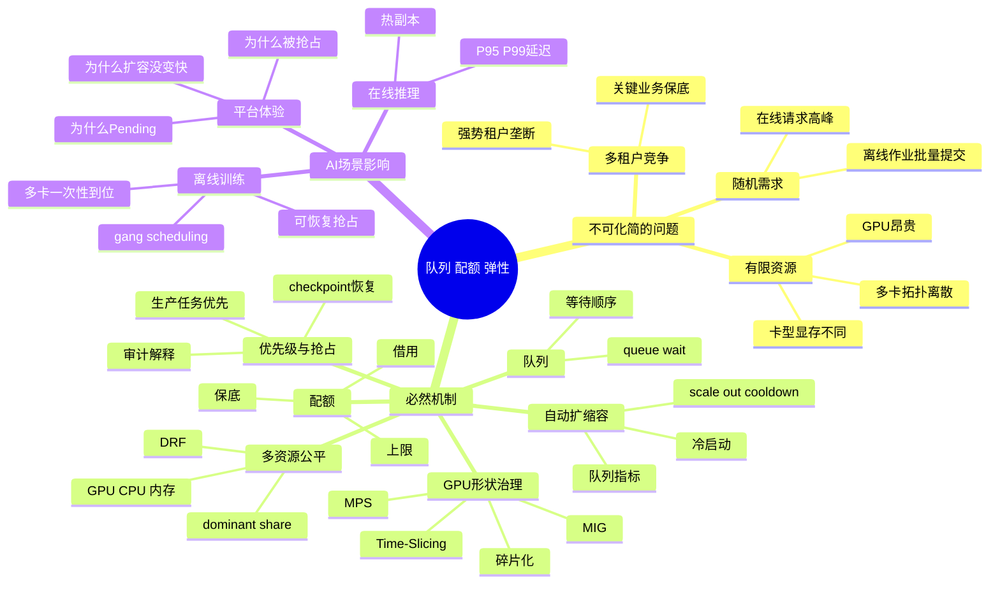

# 第20章：队列、配额与自动扩缩容

> 当资源稀缺时，真正决定平台体验的往往不是模型本身，而是排队规则、抢占策略和扩容反应速度。

> **关联章节**：本章里的队列和配额，是 [第17章](../part5-serving-infra/17-multitenancy-and-cost.md) 多租户与成本治理的执行层。第17章回答“为什么要管”，本章回答“平台具体怎么管”。

## 1. 第一性原理拆解 + 学习大纲

### 拆 — 不可化简的问题

剥离 Kubernetes、Volcano、Kueue、HPA、MIG、MPS 这些工具名之后，本章要解决的不可化简问题只有一个：**有限、离散、异构、启动慢的计算资源，如何在多租户同时竞争时，被持续分配给正确的工作负载，并且让用户知道为什么是这个结果。** AI 平台里的 GPU 不是普通 CPU core。它昂贵、数量有限、卡型不同、显存不同、拓扑不同；训练任务常常需要 4 卡或 8 卡一起到位，推理服务又常常需要副本常驻、权重预热和稳定延迟。资源不是一桶可以随便舀的水，而是一组带形状的零件：一张 H100 80GB、一个 `3g.40gb` MIG slice、一台 8 卡 NVLink 节点、一个已加载 70B 权重的热副本，它们在调度器眼里并不等价。

这就带来三个硬约束。第一，**需求到达是随机的，资源释放是离散的**。平均 GPU utilization 为 60% 不代表用户马上能拿到 8 张相邻 GPU。第二，**公平不是自然发生的**。没有配额，强势团队会长期占住稀缺资源；配额过硬，资源又会被锁在暂时不用的队列里。第三，**弹性不是瞬时发生的**。在线推理扩一个副本，可能要经历调度、镜像拉取、权重加载、KV cache 预热和 readiness；离线训练扩容更麻烦，因为一个正在跑的 64 卡作业通常不能随便插入 8 张新卡。队列、配额、抢占、GPU 切分和 autoscaling，本质上都是在这些硬约束之间做可解释的取舍。

### 推 — 从这个问题如何推导出每个机制

既然资源稀缺且请求会同时到达，平台首先需要**队列（Queue）**：把“谁先等待、等待多久、按什么规则进入候选集”显式化。先来先服务会让大租户或长作业占住集群，所以必须引入**配额（Quota）**：给团队、业务线或环境一个可审计的上限和保底。配额解决“谁最多能占多少”，但生产推理和实验训练不能完全同权，于是出现**优先级（Priority）**。如果低优先级任务已经占满资源，高优先级任务仍然只能等待，所以还需要**抢占（Preemption）**。抢占不是按钮，而是一份恢复契约：只有任务能 checkpoint、能重入队、能解释损失，抢占才是工程机制。

再往下推，GPU 资源不是单一维度。一个任务可能吃 8 GPU + 256 vCPU + 1TB 内存，另一个任务只吃 1 GPU 但占 80GB 显存。只按 GPU 数或作业数谈公平会失真，所以需要 **DRF（Dominant Resource Fairness）** 这类多资源公平思想：看每个队列在自己最紧张资源上的占比。资源的离散形状又会推导出**碎片化治理**：调度器不仅要算剩余数量，还要保留整节点、同卡型、同 MIG profile、同拓扑的可运行形状。为了提高小模型和开发任务的可获得性，平台会进一步引入整卡、MIG、MPS、Time-Slicing 等共享方式。最后，当排队指标或在线延迟持续恶化时，平台才会触发**自动扩缩容（Autoscaling）**，但扩容只能补未来容量，不能立即消除冷启动、配额僵硬、拓扑碎片和模型加载这些现实成本。

### 绘 — 因果链路



### 导 — 读完本章你应该能回答

1. 为什么 AI 平台不能只用“谁先提交谁先跑”的 FIFO 队列？
2. 当配额、优先级和抢占同时存在时，平台应该按什么顺序解释一次调度决策？
3. 为什么平均 GPU utilization 不足以判断集群是否真的有可调度容量？
4. MIG、MPS、Time-Slicing 分别把共享问题放在硬件层、驱动层还是调度层，它们各自牺牲了什么？
5. 给定 GPU、CPU、内存三类资源占用，如何用 DRF 判断哪个队列更“占便宜”？
6. 为什么在线推理 autoscaling 常看 queue wait、active sequences 和 token throughput，而不是只看 CPU 使用率？

## 2. 正文内容

### 20.1 为什么 AI 平台比普通服务更依赖队列

普通 Web 服务里，很多请求只占用 CPU 和少量内存，请求结束就释放。
而 AI 平台里的许多任务具有不同特征：

- 占用 GPU 这类离散而昂贵的资源
- 任务持续时间可能很长
- 多卡任务必须一次性拿到完整资源形状
- 任务之间优先级差异很大

因此，AI 平台不能只依赖“谁先来谁先跑”，而必须明确：

- 谁可以排队等待
- 谁必须保底
- 谁可以被抢占
- 谁在高峰期应该被限流

换句话说，队列不是附属功能，而是平台公平性和效率的核心机制。

### 20.2 四个容易混淆的概念

#### 20.2.1 队列

队列回答的是：任务按照什么顺序等待和被调度。

#### 20.2.2 配额

配额回答的是：某个团队或租户最多能占多少资源。

#### 20.2.3 优先级

优先级回答的是：资源紧张时谁先执行。

#### 20.2.4 抢占

抢占回答的是：高优先级任务来了，是否可以中断低优先级任务。

这四件事经常一起出现，但逻辑上不同。
没有配额的高优先级系统会被强势租户垄断；没有抢占的优先级系统在高峰期往往形同虚设。

### 20.3 一个简单的排队视角

如果系统单位时间到达任务数为 $\lambda$，单位时间服务能力为 $\mu$，那么：

- 当 $\lambda < \mu$ 时，队列通常可控
- 当 $\lambda$ 接近 $\mu$ 时，等待时间会急剧增加
- 当 $\lambda > \mu$ 时，系统必然积压

这就是为什么平台不能只看平均利用率。
即使平均利用率看起来正常，短时间高峰也可能造成严重排队。

对在线推理而言，这会表现为：

- queue wait time 上升
- P95 / P99 延迟恶化

对离线训练而言，这会表现为：

- 作业长时间 Pending
- 用户抱怨“平台有卡但我任务跑不起来”

### 20.4 配额的真正价值

很多人把配额理解成“限制使用”。更准确地说，配额在做三件事：

1. 防止强势租户垄断资源
2. 给关键业务保底
3. 为预算和容量规划提供边界

例如：

```yaml
queues:
  prod-online:
    gpu_quota: 64
    priority: 100
  research-train:
    gpu_quota: 128
    priority: 50
  batch-lowprio:
    gpu_quota: 32
    priority: 10
    preemptible: true
```

配额设计不好，平台会在两种极端之间摇摆：

- 太松：资源被吃光
- 太死：资源闲着也借不出来

因此很多成熟平台还会加入“保底 + 可借用”的策略。

#### 20.4.1 公平调度算法：为什么很多平台会提 DRF

为什么“只看优先级”不够？因为 AI 平台不是单资源系统。一个队列可能主要吃 GPU，另一个队列可能主要吃 CPU / 内存。只按优先级或作业数排序，很容易把某一类资源长期挤爆。

DRF（Dominant Resource Fairness）关注的是：**谁占用了自己最稀缺的那类资源最多。** 这样定义公平，比“谁先来”或“谁权重大”更适合多资源集群。

| 机制 | 更适合解决什么 | 主要短板 |
|------|----------------|----------|
| 简单优先级 | 明确保核心业务先跑 | 难处理多资源公平 |
| 纯配额上限 | 防止单租户吃光资源 | 闲置资源借用不灵活 |
| DRF | 同时考虑 GPU、CPU、内存等多资源公平 | 实现和解释成本更高 |

DRF 的计算方法并不神秘。假设一个资源池有 100 张 GPU、1000 vCPU、2000GB 内存，三个队列当前占用如下：

| 队列 | GPU 占用 | CPU 占用 | 内存占用 | GPU share | CPU share | 内存 share | Dominant share |
|------|----------|----------|----------|-----------|-----------|------------|----------------|
| A：在线推理 | 20 | 120 | 300GB | 20% | 12% | 15% | 20% |
| B：训练实验 | 35 | 180 | 400GB | 35% | 18% | 20% | 35% |
| C：数据处理 | 5 | 420 | 600GB | 5% | 42% | 30% | 42% |

如果下一个可运行任务来自 A 和 C，简单 GPU 公平会认为 C 只用了 5 张 GPU，应该优先给 C；但 DRF 会看到 C 的 dominant share 是 CPU 的 42%，已经最高。此时更公平的选择可能是先给 A 或 B，而不是继续让 C 扩大 CPU 占用。这个例子说明：AI 平台里的“不公平”不一定表现为 GPU 被吃光，也可能表现为 CPU、内存、NIC、PVC 或本地 SSD 被某类任务先吃光。

带权重的 DRF 会再除以队列权重。例如生产队列权重为 2，可以比较 `dominant_share / weight`；A 的 20% 会变成 10%。这不是说生产队列永远优先，而是把业务保底显式合入公平计算。

DRF 不知道模型冷启动要 4 分钟，也不知道 8 卡作业需要同节点 NVLink。因此工程上常见的是 **PriorityClass 先过滤关键任务，Queue quota 再限制租户边界，DRF 在可借用资源里做排序，Gang scheduling 最后检查资源形状是否完整**。

**工程边界**：DRF 的前提是资源可计量且需求可信。GPU、CPU、内存容易计量，网络带宽、本地 SSD IOPS、KV cache 峰值很难准确声明；一旦用户低报 request，DRF 会奖励“写小 request、实际 burst”的负载。成熟平台通常用历史用量、LimitRange、准入检查和 chargeback 修正声明值。

### 20.5 抢占不是万能按钮

抢占可以显著改善高优先级任务的响应，但它必须与任务特性绑定。

### 对在线服务

推理服务通常不适合粗暴抢占，因为中断服务实例会直接影响用户请求。
更常见的是：

- 限流
- 重新路由
- 优先保障核心租户

### 对离线训练

训练任务更有可能被抢占，但前提是：

- 有可恢复 checkpoint
- 平台知道如何重新入队
- 用户清楚任务被抢占的规则

没有恢复机制的抢占，只是在制造重复成本。

### 20.6 自动扩缩容的边界

#### 20.6.1 在线推理

自动扩缩容适合：

- 流量波动明显
- 模型副本可快速启动
- 有清晰的延迟或队列指标

但它的难点在于：

- 模型很大，冷启动慢
- 显存预热成本高
- token 长度变化剧烈

因此，在线推理的 autoscaling 通常不能只看 CPU 使用率，而要看：

- queue length
- queue wait time
- active sequences
- GPU / 显存水位
- token throughput

#### 20.6.2 离线训练

训练任务的 autoscaling 更受限制，因为：

- 一个作业可能要求固定卡数
- 多卡任务对拓扑敏感
- 扩出来的新节点可能来不及参与当前作业

所以训练场景更常见的是“集群层扩容”，而不是服务式的细粒度 HPA。

#### 20.6.3 GPU 资源碎片化

什么叫碎片化？平台工程里更准确的说法是：**账面有容量，不等于调度器手里有可用形状。**

最典型的情况是：集群看起来还有很多空闲 GPU，但这些资源被切散到不同节点、不同卡型、不同显存规格、不同 MIG slice，或者被各个队列的硬配额锁住，结果需要 8 卡训练、80GB 显存推理、固定 MIG profile 的任务都拿不到真正可运行的资源。

看一个具体例子：集群有 4 台 8xH100 80GB 节点，总计 32 张 GPU。当前空闲 10 张，账面空闲率 31.25%。但节点分布是：

| 节点 | 空闲 GPU | 已占用形状 | 对 8 卡训练是否可用 |
|------|----------|------------|---------------------|
| node-a | 3 | 5 张被在线推理副本长期占用 | 不可用，缺 5 张同节点 GPU |
| node-b | 2 | 6 张被低优先级训练占用 | 不可用，缺 6 张同节点 GPU |
| node-c | 4 | 4 张被切成 MIG `1g.10gb` | 不可用，profile 和整卡语义不匹配 |
| node-d | 1 | 7 张被实验任务占用 | 不可用，缺 7 张同节点 GPU |

一个需要 `8 x H100 80GB + NVLink` 的训练作业会 Pending，虽然监控面板显示还有 10 张 GPU 空着。调度器不是不会数数，而是这些 GPU 无法拼成作业要求的形状。另一个 70B 推理服务也可能失败：它只需要 2 张 GPU，但必须是 80GB 整卡，不能接受 `1g.10gb` MIG slice，也不能跨慢速 PCIe 节点放置。

| 碎片来源 | 平台上会看到什么现象 | 为什么会浪费可用资源 |
|------|----------------|----------------|
| 不同 GPU 型号混部 | A100、H100、L40S 都有空闲，但作业仍 Pending | 作业镜像、算子、吞吐预期往往绑定卡型，不能把“任意 GPU”当成同一种 SKU |
| 显存大小不一致 | 40GB 卡空着，80GB 需求作业排队 | 约束首先是显存，不是 GPU 数量；小显存卡对大上下文/大 batch 没意义 |
| MIG slice 粒度固定 | 还剩很多 `1g.10gb`，但 `3g.40gb` 服务扩不起来 | MIG 能提升利用率，但也把整卡变成多个固定形状，错误切片会制造二次碎片 |
| 长短任务混排 | 短推理作业频繁插队，长训练作业一直等完整拓扑 | 长作业需要连续且稳定的资源窗口，零散空闲无法拼成 gang |
| 在线副本长期驻留 | 训练任务总拿不到同节点 8 卡 | 常驻推理副本把优质拓扑切碎，导致 NVLink / 同机箱资源难以成组分配 |
| 队列 quota 过硬 | 某队列空着 GPU，另一队列排爆 | 配额保护了公平性，但也可能把资源锁在暂时不用的租户或业务线里 |

因此，GPU 碎片化本质上不是“资源不够”，而是“资源形状不对”。平台侧通常要同时回答三个问题：

1. 哪些资源必须按卡型、显存、拓扑、MIG profile 拆成不同 SKU
2. 哪些工作负载必须紧凑摆放，避免把大块资源切成小块
3. 哪些配额应该允许借用，避免容量被静态边界锁死

常见治理手段是：给多卡训练队列保留完整 8 卡节点池；把在线推理副本约束在专用池；对小模型推理明确只允许申请固定 MIG profile；对低优先级开发任务启用 Time-Slicing，但不允许它们占用高端整卡池。更进一步的平台会做 defragmentation：低峰期迁移可恢复任务、回收借用 quota、把短作业 compact 到少数节点。

**工程边界**：碎片化不可能被完全消除。过度 compact 会造成热点；过度预留会降低利用率；频繁迁移会放大 checkpoint、镜像拉取和缓存失效成本。平台要优化的是“关键形状的可获得性”，例如 8 卡节点可用数、`3g.40gb` MIG profile 可用数、H100 80GB 热副本可用数，而不是只追求总 GPU 空闲数。

只看集群平均 GPU utilization，很容易误判。很多平台的真实痛点是：利用率不低，但高价值任务的 `pending time` 和 `queue wait` 仍然持续恶化。

#### 20.6.4 GPU 虚拟化：整卡、MIG、MPS 与 Time-Slicing

当平台开始面对“小模型很多、租户很多、整卡经常浪费”的局面，就会讨论 GPU 切分。但切分提高的是利用率，不一定提高稳定性，因此要和 [第18章](./18-containers-and-runtime.md) 的运行时暴露、[第19章](./19-kubernetes-for-ai.md) 的调度资源一起看。

四种常见方式的差别，不在于“能不能共享”，而在于**共享发生在硬件层、驱动层、还是调度层**：

| 方式 | 工作方式 | 隔离程度 | 更适合什么场景 | 不适合什么场景 |
|------|----------|----------|----------------|----------------|
| 整卡调度 | 一个工作负载独占整张卡 | 最强 | 多卡训练、大上下文推理、强 SLA 在线服务 | 小模型常驻导致整卡长期低利用 |
| MIG | 硬件级切分 GPU，显存和部分计算资源按 profile 固定分配 | 强 | 多租户小模型推理、需要保底的共享集群 | 动态负载变化很大、需要灵活伸缩显存形状 |
| MPS | 多进程共享同一 GPU 上下文，提升并发提交效率 | 弱 | 同团队轻量推理、实验型多进程任务 | 跨租户隔离、强故障域隔离、严格性能承诺 |
| Time-Slicing / Sharing | 调度器或 device plugin 以时间片方式让多个 workload 轮流使用 GPU | 很弱 | 开发环境、教学环境、低优先级批处理 | 延迟敏感服务、长时间高负载训练 |

从平台工程师视角看，可以把它理解成四个问题：

1. **是否要保留整卡语义？**
   只要任务依赖稳定吞吐、显存峰值高、collective 通信密集，整卡通常还是默认选项。
2. **是否要把单卡变成多个固定 SKU？**
   MIG 的价值在于可计量、可配额、可隔离，但前提是你的业务真的能消费这些固定 profile。
3. **是否只是想提升同卡并发？**
   MPS 更像驱动级共享，不是严格资源切片。它适合“同一信任域里的多个轻量进程”，不适合强多租户。
4. **是否只是让更多人先跑起来？**
   Time-Slicing / Sharing 主要解决可获得性，不解决性能确定性。

| 判断条件 | 更适合的方式 |
|----------|----------------|
| 任务需要稳定吞吐、显存峰值高、故障不能互相影响 | 整卡或 MIG |
| 希望把一张高端卡分给多个固定小服务，并且要配额化管理 | MIG |
| 同一团队的多个轻量进程想共享同一张卡，提高提交并发 | MPS |
| 只是为了让更多人先启动任务，容忍明显性能抖动 | Time-Slicing / Sharing |

在 Kubernetes 里，MIG 通常由 NVIDIA device plugin 或 GPU Operator 统一暴露资源类型，再让配额和队列把它当成独立 SKU 管理：

```yaml
version: v1
flags:
  migStrategy: mixed
```

平台侧真正要做的不是“把卡切开”这么简单，而是继续回答三个问题：切分后的资源名怎么计费、哪些队列可以申请、回收和抢占时是否还保留隔离语义。否则 MIG 只是把整卡碎片化问题换了个名字。

#### 20.6.5 调度与配额策略：公平性和利用率的拉扯

当 GPU 已经被拆成多个 SKU，调度策略就决定了平台是在追求“更满”，还是追求“更公平”，还是在尽量保护关键业务。实践里通常不是单一算法取胜，而是组合拳。

| 策略 | 平台收益 | 代价 | 失败条件 |
|------|----------|------|----------|
| Bin packing / compact scheduling | 尽量把小任务塞进少量节点，保留完整拓扑给 4 卡 / 8 卡大任务，降低碎片化 | 局部热点更明显，单节点故障影响更集中 | 不区分卡型、显存和拓扑，只做“数量打包”时，仍会留下不可用碎片 |
| Gang scheduling | 保证多卡训练一次性拿齐资源，避免半启动半等待 | 等待时间可能更长，调度器更复杂 | 如果没有提前预留或紧凑摆放，大作业会长期饥饿 |
| Priority + preemption | 关键在线服务或紧急训练可以快速拿到资源 | 被抢占任务需要 checkpoint / 重试能力，用户体验更复杂 | 没有恢复机制时，抢占只会放大浪费和抱怨 |
| Borrowing quota | 闲时把保底配额借给别的队列，提高总体利用率 | 回收时要处理驱逐、延迟上升和“借了不想还” | 缺少回收规则或冷却时间时，关键业务一来就拿不回资源 |
| DRF 倾向的公平调度 | 在 GPU、CPU、内存并存时，比“只看优先级”更公平 | 可解释性差，实现更重，业务方不一定容易接受 | 如果业务优先级远比资源公平更重要，DRF 会显得过于机械 |

这些策略之间没有免费的午餐：

- 更高利用率，通常意味着更高的调度复杂度和更弱的性能确定性
- 更强公平性，通常意味着资源借用和抢占空间更小
- 更强业务优先级，通常意味着低优先级队列更容易长期饥饿

一个常见的平台工程做法是：

1. 用 **bin packing** 和按卡型 / MIG profile 拆池来压低碎片
2. 用 **gang scheduling** 保护多卡训练的最小可运行形状
3. 用 **priority / preemption** 给关键业务开快车道，但只对可恢复任务生效
4. 用 **保底 + 可借用 quota** 平衡公平性和利用率
5. 用 [20.4.1 节](#2041-公平调度算法为什么很多平台会提-drf) 的 DRF 思路做多资源公平校正，而不是单独依赖它

所以，平台工程师真正要优化的不是“GPU 利用率”这一个数字，而是三个指标的组合：

- 关键队列的等待时间是否可控
- 大任务是否仍然能拿到连续资源形状
- 闲置容量是否能在不破坏公平性的前提下被借用

### 20.7 一个 autoscaling 触发框架

```yaml
scale_out_if:
  queue_wait_p95_ms: "> 200"
  gpu_utilization: "> 75%"
  pending_requests: "> 100"
scale_in_if:
  queue_wait_p95_ms: "< 20"
  gpu_utilization: "< 35%"
  cooldown_minutes: 10
```

这类规则的重点不是语法，而是：

- 扩容触发不应只依赖单个指标
- 缩容要有冷却时间
- 长短请求混杂时需要更细的分层策略

> **参考数量级（仅供建立直觉，实际值因模型大小、镜像体积和集群基线差异较大）**
>
> | 场景 | 典型值 | 说明 |
> |------|--------|------|
> | 已有热副本的在线扩容反应时间 | 10-30 秒 | 主要消耗在调度和 readiness，而不是权重加载 |
> | 大模型冷启动后新副本真正可接流量 | 1-5 分钟 | 常包含镜像拉取、权重加载、显存预热和 engine 初始化 |
> | 交互式推理队列等待告警阈值 | P95 50-200 ms | 超过后用户通常已明显感知排队 |
> | 离线训练队列等待 SLO | 5-30 分钟 | 取决于队列等级和业务优先级，而不是统一常数 |

### 20.8 常见故障模式

### 模式一：平台整体利用率不低，但关键任务一直排队

说明问题可能在：

- 配额分配僵硬
- 大量资源被低优先级长任务占住
- 多卡拓扑碎片化

### 模式二：自动扩容触发了，但用户体验没改善

说明可能是：

- 冷启动太慢
- 扩出的节点拿不到模型和热 cache
- 真正瓶颈不在副本数，而在检索或上游依赖

### 模式三：平台解释不清为什么某任务被抢占

说明：

- 调度规则不透明
- 审计日志不足
- 配额与优先级设计没有产品化表达

## 本章涉及的常见工具

| 概念 | 常见工具 / 命令 | 备注 |
|------|-----------------|------|
| 队列与公平调度 | Volcano、Kueue | 常用于批任务排队、配额和 gang scheduling |
| GPU 切分与资源暴露 | NVIDIA GPU Operator、k8s-device-plugin | 常用于暴露 MIG 资源、配置 time-slicing 策略 |
| 在线自动扩缩容 | Kubernetes HPA、KEDA | 适合接 CPU、队列或自定义指标触发 |
| 指标驱动扩缩容 | Prometheus Adapter、Metrics Server | 把 queue wait、GPU 水位等指标喂给扩缩容策略 |
| 资源可视化 | Grafana、调度事件日志 | 用于解释“为什么这个任务还在排队” |

---

## 本章小结

| 机制 | 目标 | 典型风险 |
|------|------|----------|
| 队列 | 有序分配稀缺资源 | 排队规则不透明引发体验问题 |
| 配额 | 防止垄断，支撑容量规划 | 过硬导致闲置，过松导致抢占失控 |
| 优先级 / 抢占 | 保障核心任务 | 没有恢复机制时会制造浪费 |
| 自动扩缩容 | 在成本与弹性之间平衡 | 冷启动和错误指标会让策略失效 |

## 练习题

1. 为什么 AI 任务比普通 Web 服务更依赖队列治理？
2. 如果推理服务冷启动很慢，自动扩容策略应如何调整？
3. 配额和优先级冲突时，平台应该如何解释决策？
4. 为什么训练场景下的 autoscaling 往往不如推理场景直接？
