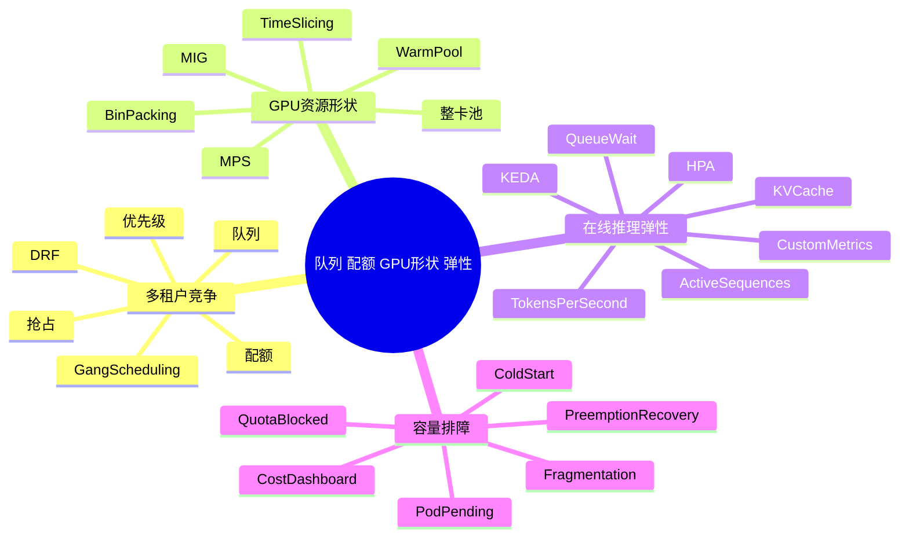

# 第20章：队列、配额与弹性治理导览

> 当资源稀缺时，真正决定平台体验的往往不是模型本身，而是排队规则、配额边界、GPU 形状和扩容反应速度。

> **关联章节**：第17章解释多租户与成本治理为什么重要；第18章解释容器和 GPU 运行时如何暴露资源；第19章解释 Kubernetes 如何调度 AI 工作负载。本章把这三条线接起来，作为 20a-20d 的阅读入口。

## 1. 第一性原理拆解 + 学习大纲

### 拆 — 不可化简的问题

剥离 Kubernetes、Volcano、Kueue、HPA、KEDA、MIG、MPS 这些工具名之后，本组章节要解决的不可化简问题是：**有限、离散、异构、启动慢的 GPU 资源，如何在多租户同时竞争时，被持续分配给正确的工作负载，并且让用户知道为什么是这个结果。**

AI 平台里的资源不是一桶连续的水，而是一组带形状的零件：一张 H100 80GB、一个 `3g.40gb` MIG slice、一台 8 卡 NVLink 节点、一个已经加载 70B 权重的热副本、一个能在 2 分钟内恢复的 checkpoint。平均 GPU utilization 为 60% 不代表用户马上能拿到 8 张同节点 GPU；集群里还有空闲卡也不代表某个推理服务能扩出可接流量的新副本。

### 推 — 为什么要拆成 20a-20d

原来的第20章把队列、公平、GPU 切分、autoscaling 和排障都放在一个章节里，容易把四类不同问题混在一起：

| 问题 | 真正在问什么 | 深挖章节 |
|------|--------------|----------|
| 谁先跑、谁保底、谁能被抢占 | 多租户资源治理和作业准入 | [20a](./20a-queues-quotas-priority-and-fairness.md) |
| 一张 GPU 到底能不能被拆开给多人用 | GPU 资源形状、隔离和碎片化 | [20b](./20b-gpu-partitioning-and-sharing.md) |
| 在线推理什么时候扩容、缩容和降级 | 指标驱动弹性与冷启动边界 | [20c](./20c-inference-autoscaling.md) |
| 为什么看起来有资源却跑不起来 | 容量解释、Pending 排障和运营 SOP | [20d](./20d-capacity-and-troubleshooting-sop.md) |

拆分后的目标不是增加工具清单，而是把责任边界说清楚。队列层决定“是否应该开始消耗资源”；资源层决定“有没有正确形状的 GPU”；弹性层决定“是否应该改变副本或节点规模”；SOP 层决定“当用户投诉时如何定位和解释”。

### 绘 — 因果链路

### 导 — 阅读路径

如果你正在设计平台控制面，先读 20a，再读 20d。你需要先把“谁有资格跑”说清楚，再把“为什么没跑起来”解释清楚。

如果你正在治理 GPU 利用率，先读 20b，再回到 20a。很多所谓公平问题，根因其实是 GPU 被切成了错误的形状；很多所谓碎片问题，根因又是队列借用和抢占策略太粗。

如果你负责在线推理稳定性，先读 20c，再补 20b。推理扩缩容不只是副本数问题，还受 KV cache、水位、热副本、显存形状和模型权重加载路径影响。

如果你正在值班排障，直接读 20d。它把“有空闲 GPU 但扩不起来”“Pod Pending”“quota blocked”“image / weight cold start”“抢占恢复慢”这些现象整理成 SOP。

## 2. 概念先说清楚：四层责任边界

| 层 | 负责回答 | 常见对象 | 不应该负责 |
|----|----------|----------|------------|
| 队列 / 配额层 | 哪个租户、作业或服务有资格进入候选集 | Queue、ClusterQueue、PriorityClass、PodGroup、Workload | 具体 GPU 拓扑性能优化 |
| GPU 资源层 | 资源是否有正确形状和隔离语义 | 整卡、MIG profile、MPS、time-slicing、ResourceFlavor | 业务优先级和预算归因 |
| 弹性层 | 什么时候扩副本、扩节点、缩容或降级 | HPA、KEDA、custom metrics、warm pool、canary | 让冷启动瞬间消失 |
| 运营 SOP 层 | 出问题时怎样解释、定位和恢复 | Pending reason、quota event、fragmentation dashboard、runbook | 替代前面三层的设计 |

一个成熟平台要让这四层各自可观察。否则用户看到的只有一个模糊状态：Pending、排队、扩容中、被抢占。平台工程的价值，恰恰是把这些状态拆成可审计、可解释、可行动的原因。

## 3. 快速自测

1. 为什么 FIFO 队列在 AI 平台里通常不够？
2. 配额、优先级和抢占分别回答什么问题？它们的执行顺序应该如何向用户解释？
3. 为什么“集群还有 10 张空闲 GPU”不等于“一个 8 卡训练作业可以启动”？
4. MIG、MPS、time-slicing 分别牺牲了什么，换来了什么？
5. 在线推理 autoscaling 为什么不能只看 CPU 或 GPU utilization？
6. 当 HPA 已经扩容但 P99 仍然很差时，你会先看 queue wait、冷启动、KV cache，还是下游依赖？为什么？
7. 一个任务被抢占后能否自动恢复，应该由调度器、训练框架还是平台控制面负责哪几部分？

## 4. 本章小结

| 主题 | 关键判断 |
|------|----------|
| 队列和配额 | 解决多租户公平、保底、借用和准入，不是简单排队列表 |
| GPU 切分 | 提高可获得性和利用率，但会引入隔离、性能抖动和碎片化代价 |
| 推理弹性 | 指标要贴近用户体验和运行时状态，冷启动必须进入容量模型 |
| 排障 SOP | 平台必须解释“为什么现在不能跑”，否则调度策略再复杂也很难被信任 |

---

## 练习题

### 基础题

1. 用自己的话解释队列层、资源层、弹性层的区别。
2. 为什么平均 GPU 利用率不是容量健康的充分指标？
3. 什么情况下应该优先读 20b，而不是直接调整 autoscaling 参数？

### 进阶题

4. 设计一个三租户 AI 平台的资源治理方案，至少包含保底、借用、优先级和抢占恢复说明。
5. 你负责的推理服务 P99 TTFT 突然升高，但副本数已经扩上去了。列出至少 6 个可能原因，并标注它们分别属于 20a-20d 哪个章节。
