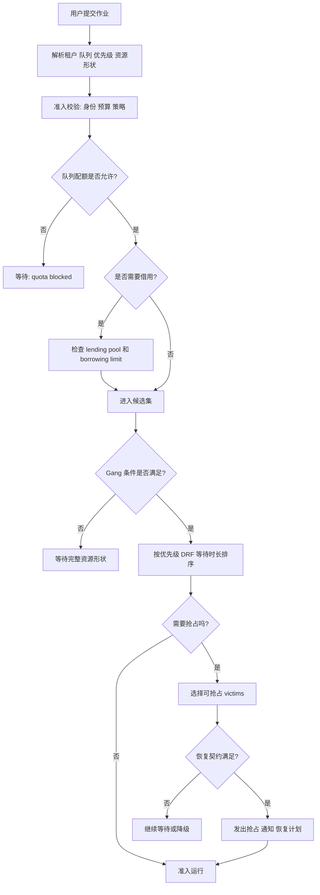
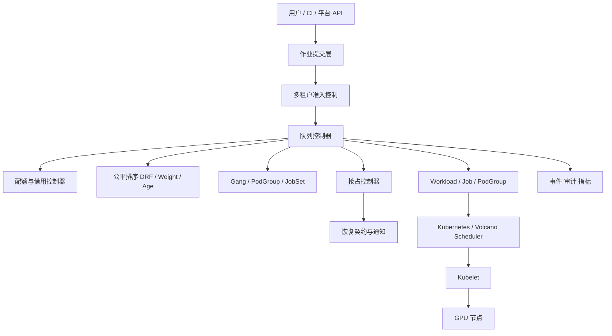

# 第20a章：队列、配额、优先级与公平调度

> 队列不是“把任务排成一排”，而是把稀缺资源的分配规则产品化、可审计化、可恢复化。

本章讨论 AI 平台控制面里最容易被低估的一层：队列、配额、优先级、抢占与公平调度。它位于用户提交作业和 Kubernetes 真正创建 Pod 之间，负责回答一个很直接但很难答好的问题：**谁现在有资格消耗资源，谁应该等待，谁可以借用，谁必须让路，以及让路之后如何恢复。**

---

## 20a.1 第一性原理拆解 + 学习大纲

### 拆：不可化简的问题

AI 集群的资源分配不是一个单纯的“有空闲 GPU 就启动”的问题。真实平台同时面对这些约束：

- 资源稀缺：GPU、CPU、内存、本地盘、网络带宽都可能成为瓶颈。
- 资源离散：一个 32 GPU 作业通常不能用分散在 32 台机器上的单卡拼出来。
- 租户竞争：线上、研究、评测、数据生成、教学和 notebook 都想占用同一批卡。
- 作业整体性：分布式训练如果只启动一半 worker，通常没有有效训练进度。
- 业务差异：线上紧急修复和低优先级实验不能同权。
- 恢复成本：抢占一个没有 checkpoint 的训练任务，可能浪费几百 GPU-hour。
- 组织治理：平台需要解释为什么某个团队可以用、为什么另一个团队要等。

所以队列层的不可化简问题是：

**在多租户、多资源、多优先级、可抢占和不可抢占作业并存时，平台如何把资源分配决策变成可预测、可审计、可恢复的准入过程。**

### 推：从问题推导机制

从“提交到达是随机的”推出队列。

从“强势租户会自然挤占弱势租户”推出配额。

从“生产服务、紧急修复和普通实验不能同权”推出优先级。

从“资源已经满载时，高优先级不能只停留在标签上”推出抢占。

从“只按 GPU 数公平会忽略 CPU、内存、本地盘和网络”推出 DRF。

从“分布式训练要么整体启动，要么不要占卡空等”推出 gang scheduling。

从“保底不能让空闲资源浪费”推出 borrow / lend。

从“被抢占后要能继续工作”推出作业准入和恢复契约。

### 绘：队列层因果链路



### 学习大纲

读完本章，你应该能回答：

1. 队列、配额、优先级和抢占分别解决什么问题。
2. 为什么优先级不能替代配额，配额也不能替代优先级。
3. DRF 为什么比“按 GPU 数公平”更适合 AI 平台。
4. borrow / lend 如何在保底和利用率之间折中。
5. gang scheduling 为什么是训练、Ray、MPI、批推理的基本语义。
6. Volcano 和 Kueue 分别把调度责任放在哪里。
7. 多租户平台如何定义作业准入和恢复契约。
8. 如何从 event、队列状态和审计日志解释一次 Pending 或抢占。

---

## 20a.2 概念先说清楚

### 队列是什么，不是什么

队列是作业进入运行态之前的治理边界。它记录等待中的工作负载，并按租户、优先级、配额、资源形状、等待时间、可恢复性和策略约束决定谁先被准入。

队列不是简单 FIFO。FIFO 只能表达“谁先来”，不能表达“谁有保底”“谁是紧急生产修复”“谁能被抢占”“谁需要同节点 8 卡”“谁已经借用了别人容量”。

### 配额是什么，不是什么

配额是平台给租户或队列定义的资源权利边界。它至少应表达三类语义：

- 保底：资源紧张时，租户应该至少能获得多少。
- 上限：无论优先级多高，租户最多不能超过多少。
- 借用：别人不用时，是否能临时使用更多资源。

配额不是单纯限制。一个只有限制、不能借用的配额系统会让集群在 A 团队空闲时仍然拒绝 B 团队作业，利用率和体验都会很差。

### 优先级是什么，不是什么

优先级表达业务重要性。它回答“资源冲突时谁更重要”。优先级常用于线上修复、故障恢复、重要实验窗口、发布验证和普通探索之间的排序。

优先级不是无限通行证。高优先级仍应受 hard cap、预算、租户策略、资源形状和恢复契约约束。否则一个高优先级队列会吃掉整个集群，让平台失去多租户公平。

### 抢占是什么，不是什么

抢占是在资源已被占用时，为更高价值工作负载回收资源的机制。抢占通常会终止、驱逐或暂停低优先级任务，让高优先级任务获得可运行资源。

抢占不是免费操作。它会带来 checkpoint 恢复、数据重读、缓存丢失、训练重算、用户通知、成本归因和 SLA 解释。没有恢复契约的抢占，经常只是把 GPU 利用率问题转化成训练浪费问题。

### DRF 是什么，不是什么

DRF（Dominant Resource Fairness）是一种多资源公平方法。它比较每个租户在“占比最高的那类资源”上的使用份额，而不是只看某一种资源。

DRF 不是业务优先级系统。它解决公平计算，不解决业务价值排序。生产队列可以有更高权重，但权重必须显式、可审计，并且不能掩盖 request 造假或资源画像错误。

### Gang scheduling 是什么，不是什么

Gang scheduling 表达“一组 Pod 必须作为一个整体被准入”。如果一个 8 worker 分布式训练作业只启动了 5 个 worker，已经启动的 5 个 worker 可能只是在 rendezvous 阶段空等。

Gang scheduling 不是加速器。它经常会让作业等更久，但能避免半启动造成的资源浪费和错误状态。

### 相邻概念边界

| 概念 | 回答的问题 | 不负责的问题 |
|------|------------|--------------|
| Queue | 谁在等待，按什么规则进入候选集 | 单张 GPU 如何切分 |
| Quota | 租户的保底、上限、借用边界 | 某个模型是否值得训练 |
| Priority | 冲突时谁更重要 | 是否具备正确 GPU 形状 |
| Preemption | 是否可以回收低价值占用 | 应用如何写 checkpoint |
| DRF | 多资源占用是否公平 | 业务是否重要 |
| Gang scheduling | 一组 Pod 是否整体启动 | 节点内拓扑是否最快 |
| Autoscaling | 是否改变副本或节点规模 | 已有资源如何公平分配 |

---

## 20a.3 架构：关键组件、路径与责任边界

### 关键组件



### 控制路径

1. 用户通过平台、CLI、CI 或 API 提交作业。
2. 准入层解析租户、项目、预算、镜像、资源 request、优先级和作业类型。
3. 队列层把作业放入 LocalQueue、Queue 或等价对象。
4. 配额层检查 nominal quota、hard cap、borrow limit 和当前使用量。
5. 公平层根据优先级、DRF、权重、等待时间和作业大小排序。
6. Gang 层检查 `minAvailable`、PodGroup、JobSet 或训练框架 worker 数是否能整体满足。
7. 若资源不足，抢占层选择可抢占对象，并检查 checkpoint、PDB、grace period 和恢复策略。
8. 作业被准入后，控制器创建或放行 Pod，进入 Kubernetes 或 Volcano 调度路径。
9. 所有决策写入 event、metrics、audit log 和用户可见状态。

### 数据路径

队列层通常不直接处理训练数据，但它会影响数据路径：

- 抢占会导致 checkpoint 写入和读取。
- 等待过久会让缓存、预热镜像和临时数据失效。
- 作业重启可能改变节点位置，影响数据本地性、NCCL 和远端存储压力。
- gang 准入会决定所有 worker 是否同时进入 rendezvous。

因此队列层不能只看资源数量，还要理解作业恢复、缓存、数据读写和训练阶段。

### 责任边界

| 层 | 负责什么 | 不负责什么 |
|----|----------|------------|
| 平台提交层 | 身份、租户、项目、预算、作业模板 | 实际设备分配 |
| 队列层 | 等待、准入、公平、配额、借用 | CUDA 性能调优 |
| 抢占层 | victim 选择、通知、恢复契约 | 应用内部 checkpoint 实现 |
| 调度器 | 节点选择、Pod 调度、插件策略 | 组织预算和业务价值判断 |
| 训练框架 | rendezvous、checkpoint、容错 | 租户公平 |
| 观测系统 | 原因解释、审计、趋势分析 | 自动替代治理决策 |

---

## 20a.4 原理：这些机制为什么存在

### FIFO 为什么不够

FIFO 对低成本任务有吸引力，因为它简单。但 AI 平台中 FIFO 会迅速失效：

- 一个 256 GPU 长作业可能堵住后面大量 1 GPU 短作业。
- 先提交的大租户会自然占据资源，小租户只能等待。
- 线上修复可能排在普通实验后面。
- 半启动的 gang 作业会占着卡不产生进度。
- 只按提交时间排序无法表达借用和回收。

因此成熟队列通常是多因素排序：`priority + quota + fairness + age + size + preemptibility + resource shape`。

### 配额为什么要分保底、上限和借用

只设置保底会浪费资源。只设置上限会让租户缺少确定性。只设置借用会让资源紧张时争议很大。生产可用的配额模型通常需要三件事同时存在：

| 字段 | 含义 | 作用 |
|------|------|------|
| nominal quota | 名义配额或保底 | 定义正常情况下的资源权利 |
| hard cap | 绝对上限 | 防止一个租户无限扩张 |
| borrowing limit | 可借用上限 | 提高闲时利用率 |

borrow / lend 的核心规则是：**借来的资源必须能被收回，并且收回时要有明确顺序、通知和恢复语义。**

### DRF 如何工作

假设集群有 100 GPU、1000 vCPU、2000GB 内存：

| 队列 | GPU | CPU | 内存 | GPU share | CPU share | 内存 share | Dominant share |
|------|-----|-----|------|-----------|-----------|------------|----------------|
| online | 20 | 120 | 300GB | 20% | 12% | 15% | 20% |
| research | 35 | 180 | 400GB | 35% | 18% | 20% | 35% |
| data | 5 | 420 | 600GB | 5% | 42% | 30% | 42% |

只看 GPU，`data` 看起来很节省；但它已经占用了 42% CPU。DRF 会把 `data` 的 dominant share 视为 42%，提醒平台继续给它 CPU-heavy 作业会加剧不公平。

带权重 DRF 常用公式是：

```text
effective_share = dominant_share / weight
```

生产队列权重为 2 时，20% dominant share 会变成 10% effective share。这样生产更容易获得资源，但仍然是显式策略，不是无上限插队。

DRF 的工程前提是 request 可信。用户低报 CPU、内存、临时盘或显存需求，会让公平计算失真。平台需要通过历史画像、LimitRange、ResourceQuota、运行时采样和 chargeback 修正。

### 抢占为什么必须绑定恢复契约

抢占的价值来自“释放资源给更重要的任务”。但如果低优先级训练完全不能恢复，抢占会造成巨大浪费。一个合格的抢占决策至少需要这些输入：

- 作业是否声明 `preemptible: true`。
- 最近 checkpoint 时间和 checkpoint 可读性。
- 预计恢复耗时。
- 已运行时间和已消耗 GPU-hour。
- 是否处于不可中断阶段，例如评测、保存、通信初始化。
- PodDisruptionBudget、terminationGracePeriod 和框架信号处理能力。
- 被抢占后的重入队优先级和补偿策略。

抢占不是"杀掉低优先级 Pod"，而是"执行一份可解释的资源回收协议"。

#### 抢占在 kube-scheduler 内部的实际算法

章节前面给了"victim 选择规则"的概念，但 default scheduler 的抢占机制（PostFilter phase 的 DefaultPreemption plugin）实际怎么工作没讲。理解这个，"为什么我的高优 Pod 已经触发抢占但还要等 30 秒"、"PDB 能不能阻止抢占"、"NominatedNodeName 是什么"才有答案。

**触发时机**：当 Pod 在 Filter phase 没找到任何可调度节点（资源不够），调度器进入 **PostFilter** phase，DefaultPreemption plugin 启动：

```text
PostFilter (DefaultPreemption.PreemptIfNeeded):
  1. 对每个候选节点 N，模拟"如果我抢占 N 上的某些低优 Pod，能不能让当前 Pod fit"
     - 列出 N 上所有 priority < pod.priority 的 Pod 作为 candidates
     - 试着 evict 不同 candidates 子集，跑 Filter 看是否能让 pod fit
  
  2. 找到能 fit 的最小 victim 子集（minimal victim set algorithm）:
     - 从 lowest priority 开始 evict
     - 一次 evict 一个，直到 pod 能 fit
     - 这是 greedy，不是全局最优，但避免组合爆炸
  
  3. 在所有可行方案中按以下规则排序选最优:
     a. 选 PDB 违反次数最少的方案 (好心 - 但不强制)
     b. 选 victim 中最高 priority 最低的方案
     c. 选 victim 总优先级和最小的方案
     d. 选 victim 数最少的方案
     e. 选最近创建的 victim (运行时间短，损失少)
     f. 选 victim 总运行时间最短的方案
  
  4. 选定方案后:
     a. API Server.delete(victim) with gracePeriod (默认 30s)
        → kubelet 收到 SIGTERM，给容器 graceful shutdown
     b. 给当前 pod 设 .status.nominatedNodeName = N
        → 告诉其他 scheduler 决策"这个节点已经为我留着，别人别抢"
     c. 当前 pod 重新进入 PendingQueue 等待
     d. victim 终止后，当前 pod 在下一轮调度循环用 nominatedNodeName 优先尝试
```

**关键点 1：抢占不是同步的**

高优 pod 触发抢占后**不会立即跑起来**——它进入等待，等 victim graceful shutdown（默认 30s）结束、节点资源真正释放后，下一轮调度才把它 bind 上去。整个流程典型 30-60 秒。这就是为什么"紧急扩容"靠抢占救不了——抢占只能腾出未来的资源，不能瞬时。

**关键点 2：PodDisruptionBudget 不能阻止抢占**

这是常见误解。PDB（`disruptionsAllowed: 0`）只能阻止 **voluntary disruption**（kubectl drain、cluster autoscaler 缩容），**不能阻止 involuntary disruption**——抢占属于后者。这是因为 K8s 哲学：抢占是为了高优工作负载，PDB 是 SLO 工具，两者冲突时高优先级赢。

实际行为：抢占算法在选 victim 时**会优先选不违反 PDB 的方案**（步骤 3a），但如果所有方案都违反 PDB，仍然会执行抢占，只是这条 PDB 被 "burned"（计数）。

**关键点 3：NominatedNodeName 协议**

```yaml
# 高优 Pod 触发抢占后
status:
  nominatedNodeName: "node-h100-3"
```

这个字段告诉所有 scheduler："这个 Pod 已经为 node-h100-3 留着，victim 终止后我就上去"。其他 Pod 在调度时看到 node-h100-3 上有 nominated pod 时会**预留资源**，避免别的 Pod 抢先占走。

但这只是"善意提醒"，不是强保证。如果 victim 终止过程中又有更高优先级的 Pod 来抢同一节点，nominatedNodeName 会被覆盖。

**关键点 4：PreemptionPolicy: Never（PriorityClass 1.24+）**

```yaml
apiVersion: scheduling.k8s.io/v1
kind: PriorityClass
metadata:
  name: high-priority-no-preempt
value: 100000
preemptionPolicy: Never   # 关键
```

设置后，这个高优 Pod **不会触发抢占**——只在有空闲资源时调度，资源不足就一直 Pending。适合"重要但不紧急"的训练任务（深夜跑、周末跑），不希望它把生产服务踢下来。

**完整的 priority + preemption 矩阵**：

| PriorityClass priority | preemptionPolicy | 行为 |
|---|---|---|
| 100000 | PreemptLowerPriority（默认）| 抢占任何 priority < 100000 的 pod |
| 100000 | Never | 不抢占；资源不足时 Pending |
| 1000 | PreemptLowerPriority | 抢占 priority < 1000 的 pod |
| -1000 | PreemptLowerPriority | 比默认 priority (0) 还低；几乎不会抢占别人，反而最容易被抢占 |

**生产建议**：

- 给所有 PriorityClass 显式声明 preemptionPolicy，不要依赖默认。
- "保护类"高优（如基础监控、网关）用 Never + 容量预留，避免它去抢生产推理。
- 训练任务的可抢占性靠 PriorityClass 区分（research-batch < research-experiment < research-priority），让队列有抢占链路可走。
- **不要给 system-critical 之外的 pod 用 1000000+ 的 priority**。1B+ 数字是 K8s 内部 system pod 的范围，业务 pod 用 100-100000 区间。

#### Kueue admission cycle 实际怎么工作

章节前面给了 LocalQueue / ClusterQueue / ResourceFlavor / Workload 的概念，但 Kueue 怎么从 Job 提交到 Pod 启动**实际怎么协调**没讲。这是"为什么 PyTorchJob 提交后 Pod 不立刻创建"的根本机制。

**关键设计：Kueue 通过 `suspend` 字段控制 Job 是否启动**

Kueue 不是 scheduler，它是**准入控制器**。它的核心 trick 是用 Job 类型自带的 `spec.suspend: true` 字段暂停 Pod 创建：

```yaml
# 用户提交一个 PyTorchJob
apiVersion: kubeflow.org/v1
kind: PyTorchJob
metadata:
  name: train-reranker
spec:
  suspend: true   # Kueue 加上的，用户不需要手写
  pytorchReplicaSpecs:
    Worker:
      replicas: 8
      ...
```

`suspend: true` 时，PyTorchJob controller **不创建 Pod**——Kueue 在它准入通过前不让任何 GPU 被占用。

**完整 admission cycle**：

```text
1. 用户提交 PyTorchJob（不带 suspend，或 suspend=false）
   
2. Kueue webhook 拦截 (mutating admission webhook):
   - 自动给 spec.suspend = true
   - 创建对应的 Workload 对象 (Kueue 自定义 CRD):
       Workload {
         podSets: [{ name: "Worker", count: 8, template: {gpu:8, ...} }]
         queueName: "train-prod"
         priorityClassName: "research-experiment"
       }
   - 写 ownerReference 让 Workload 跟随 Job 删除

3. PyTorchJob controller 看到 suspend=true，什么都不做（不创建 Pod）

4. Kueue admission controller (单独 reconciler) 持续 evaluate Workloads:
   for each pending Workload:
     - 找到对应 LocalQueue → ClusterQueue
     - 算 quota: nominal + borrow available?
     - 如果 cohort 启用 borrowing，遍历 cohort 内其他 ClusterQueue 看能借多少
     - 检查 ResourceFlavor 匹配（H100 vs A100 不同 flavor）
     - 如果通过 → admit Workload，patch Job spec.suspend = false

5. Job spec.suspend = false 后:
   - PyTorchJob controller 看到，开始创建 Master/Worker Pods
   - Kubelet 启动容器
   - Workload.status.admission = Accepted

6. 训练完成或失败:
   - PyTorchJob 状态变 Succeeded/Failed
   - Kueue 减去对应 quota usage
   - 释放给其他 Workload 使用
```

**为什么这个设计很巧妙**：

- 不用替换 scheduler——Kueue 跟 Volcano 不同，它**不参与调度**，只决定 Pod 是否被创建。Pod 一旦创建，default scheduler 接管。
- 兼容所有 Job 类型——Kueue 只要求 Job 类型支持 `suspend`，PyTorchJob/RayJob/MPIJob/JobSet/原生 Job 都支持。
- Quota 与调度解耦——Kueue 算配额时不看节点细节，只看 Pod 资源声明的总和；scheduler 负责实际放置。

**关键失败模式**：

| 现象 | 根因 | 排查 |
|---|---|---|
| Job suspend=true 但 Workload 一直 Pending | Quota 不够、Flavor 不匹配、cohort 借用受限 | `kubectl describe workload <name>` 看 conditions |
| Workload Admitted 但 Pod 没创建 | Job controller 没看到 suspend 变化，或 watch 抖动 | 重启 Job controller、看 events |
| Pod 创建后 scheduler Pending | Kueue 算 quota 时按声明，但实际节点 NUMA/拓扑不匹配 | 调度问题不是 Kueue 范畴，看 scheduler events |
| 抢占发生在 Workload 层 | Kueue **可以抢占** Workload（撤销 admission，suspend=true，Pod 被删） | 看 Workload preemption events |

**Kueue 与 default scheduler 的协调**：

Kueue 不是 scheduler，但它的抢占会影响 scheduler 看到的资源：

```text
场景: cohort 内 borrow 关系
  - ClusterQueue A: nominal 32 GPU, used 32, borrowed 8 from B
  - ClusterQueue B: nominal 16 GPU, used 8, lent 8 to A
  - B 收到一个高优 Workload 需要 8 GPU
  
Kueue 决策:
  1. B 的 nominal 还没用完 (8 < 16)，但当前 free = 0（因为借给 A 了）
  2. 触发"reclaim borrowed"——回收借出的 8 GPU
  3. 选 A 的某个 Workload（按 priority 低、运行时间短）撤销 admission
  4. 该 Workload 的 Pod 被驱逐（spec.suspend=true 触发 Job controller 删 Pod）
  5. B 的高优 Workload admit
  
Default scheduler 视角:
  - 完全不参与 Kueue 决策，只看到一批 Pod 被删了、新一批 Pod 出现
  - 按节点资源选放置位置
```

这就是为什么 Kueue 的抢占叫 "borrowing reclaim"，不是 "Pod preemption"——它操作的是 Workload，scheduler 操作的是 Pod。

**生产建议**：

- 不要同时用 Kueue 和 Volcano gang scheduling 处理同一批 Job——两个准入控制器会抢决策权。
- Kueue 的 ResourceFlavor 必须和节点标签 + taint 一一对应，否则 Workload admit 后 Pod 永远 Pending（Kueue 以为有资源但 scheduler 找不到匹配节点）。
- Workload 的 priority 影响 Kueue 内部抢占顺序，但**和 K8s PriorityClass 不直接挂钩**——这是两个独立的优先级体系。
- 多团队场景用 cohort 启用 borrowing，比硬性 quota 切分更灵活。

### Gang scheduling 的底层语义

Gang scheduling 需要调度器或队列控制器先判断整组 Pod 是否满足最小可用条件，再允许它们运行。常见表达包括：

- Volcano PodGroup 的 `minMember` / `minResources`。
- Kueue Workload 对 Job、JobSet、RayJob 等工作负载的准入。
- Kubernetes JobSet / Indexed Job 提供稳定 worker 身份。
- MPI、Ray、PyTorch Elastic 等框架的 rendezvous 和 worker 数约束。

Gang 的本质是把“Pod 级可运行”提升为“作业级可运行”。这对分布式训练特别重要。

---

## 20a.5 Volcano、Kueue 与原生 Kubernetes 的边界

### 原生 Kubernetes

原生 Kubernetes 有 PriorityClass、ResourceQuota、PodDisruptionBudget、scheduler framework、Job、Indexed Job 等能力，但它默认的资源视角仍以 Pod 为中心。它不天然提供完整的多租户队列、borrow / lend、作业级配额准入和 batch gang 语义。

### Volcano

Volcano 更像一个批调度器。它直接参与 Pod 调度，适合 HPC、AI 训练、MPI、Spark、Ray 等需要 gang、preempt、backfill、binpack 的批任务。

常见对象和能力：

- Queue：队列和资源权重。
- PodGroup：一组 Pod 的整体调度语义。
- VolcanoJob：批任务抽象。
- Scheduler plugins：gang、priority、drf、proportion、binpack、preempt 等。

Volcano 的优势是调度动作直接，适合需要强 gang 语义的训练平台。代价是它会成为调度路径中的关键组件，需要明确与 kube-scheduler、平台 API 和作业控制器的责任边界。

### Kueue

Kueue 更像一个批任务准入控制器。它不替代所有调度动作，而是在 Workload 创建或运行前决定是否准入，并为其分配 ResourceFlavor 和 quota。

常见对象和能力：

- LocalQueue：命名空间内用户提交入口。
- ClusterQueue：跨命名空间资源池和配额边界。
- ResourceFlavor：不同资源形状，例如 H100、A100、spot、MIG profile。
- Workload：被准入或等待的作业抽象。
- cohort：多个 ClusterQueue 之间共享和借用资源。

Kueue 的优势是适合 Kubernetes 原生 batch、多团队 quota、borrow / lend 和准入治理。它不负责训练框架的 checkpoint，也不替平台决定业务价值。

### 选择建议

| 场景 | 更倾向 | 原因 |
|------|--------|------|
| 强 gang 训练、MPI、HPC 风格批调度 | Volcano | 调度器直接表达 gang 和 batch 插件 |
| 多团队 Kubernetes batch 准入、quota、ResourceFlavor | Kueue | 准入边界清晰，适合平台治理 |
| 简单单租户 GPU Job | 原生 Kubernetes | 复杂队列可能不是第一优先级 |
| 需要 borrow / lend 和跨队列公平 | Kueue 或 Volcano + 平台层 | 原生 ResourceQuota 不够表达借用 |
| 训练平台同时需要强 gang 与组织配额 | 组合设计 | 用一个系统做准入，另一个系统做调度时要避免双重决策冲突 |

---

## 20a.6 工程化：生产落地、配置、发布与治理

### 多租户准入字段

平台提交作业时，至少应该生成或校验这些字段：

| 字段 | 用途 |
|------|------|
| tenant / project | 成本归因、配额、审计 |
| queue | 进入哪个等待和准入域 |
| priorityClass | 冲突时排序 |
| resource request | GPU、CPU、内存、本地盘、网络需求 |
| resource flavor | H100、A100、L40S、MIG profile、spot 等 |
| gang size | `minAvailable`、worker 数、rank 数 |
| preemptible | 是否可抢占 |
| checkpoint policy | checkpoint 频率、路径、最近成功时间 |
| max runtime | 防止借用作业无限占用 |
| retry policy | 被抢占、失败、节点故障后的恢复方式 |

### 配置示例：抽象队列策略

下面示例是平台策略的抽象表达，不绑定某个具体 API 版本：

```yaml
queues:
  online:
    nominalQuota:
      h100-80gb: 32
    hardCap:
      h100-80gb: 48
    priorityWeight: 2.0
    borrowingLimit:
      h100-80gb: 8
    preemption:
      canBePreempted: false
      canPreempt: ["batch", "research-borrowed"]

  research:
    nominalQuota:
      h100-80gb: 64
      cpu: 800
      memory: 2Ti
    hardCap:
      h100-80gb: 96
    borrowingLimit:
      h100-80gb: 32
    gang:
      requiredForGpuCountAtLeast: 4
    preemption:
      canBePreempted: true
      requireCheckpointYoungerThan: 30m

  batch:
    nominalQuota:
      l40s: 64
    borrowingLimit:
      h100-80gb: 16
    maxRuntime: 12h
    preemption:
      canBePreempted: true
      gracePeriod: 120s
```

### 版本矩阵与兼容性

队列系统会触碰 Kubernetes API、CRD、调度器和作业控制器，升级前要维护版本矩阵：

| 组件 | 需要确认 |
|------|----------|
| Kubernetes | scheduler framework、PriorityClass、PDB、JobSet、CRD 版本 |
| Volcano | scheduler 插件、PodGroup API、Queue API、与 kube-scheduler 共存方式 |
| Kueue | Workload、ClusterQueue、ResourceFlavor、cohort、支持的 Job 类型 |
| Kubeflow / Ray / Spark / MPI | 是否能被 Kueue/Volcano 正确识别和准入 |
| GPU Operator / device plugin | 资源名是否与 ResourceFlavor、quota 一致 |
| 训练框架 | checkpoint、elastic、signal handling、rank 稳定性 |

### 发布路径

队列策略不能一次性全量切换。推荐发布顺序：

1. 只观察：接入事件和指标，不改变准入结果。
2. 影子计算：并行计算新策略决策，与旧策略对比。
3. 小队列试点：选择一个低风险 batch 队列启用。
4. 只限新作业：不迁移已运行作业。
5. 启用借用：先允许借用，再启用回收。
6. 启用抢占：先抢占明确 preemptible 且 checkpoint 新鲜的任务。
7. 扩展到生产：建立回滚开关和人工 override。

### 观测指标

| 指标 | 含义 |
|------|------|
| queue wait time p50/p95/p99 | 用户等待体验 |
| admitted workloads | 准入吞吐 |
| quota used / nominal / borrowed | 保底和借用状态 |
| dominant share by queue | 多资源公平状态 |
| preemption count and reason | 抢占频率和原因 |
| checkpoint age at preemption | 抢占是否安全 |
| gang pending reason | 是否缺完整形状 |
| rejected workload count | 准入策略拒绝情况 |
| time to recovery after preemption | 被抢占后的恢复质量 |

### 治理规则

生产平台应把这些规则写成制度，而不是只放在代码里：

- 谁可以创建高优先级作业。
- 谁可以修改 hard cap 和 borrowing limit。
- 抢占是否需要业务审批。
- 借用资源的最大运行时间。
- 被抢占任务是否有补偿优先级。
- 资源账单按 nominal、borrowed 还是 actual usage 计费。
- 异常情况下谁有权执行 emergency override。

---

## 20a.7 方案设计：三层准入决策表

一个可执行的队列设计可以分成三层：准入、排序、回收。

| 层 | 决策问题 | 输入 | 输出 |
|----|----------|------|------|
| 准入 | 这个作业是否允许进入队列 | 身份、预算、镜像、资源 request、queue | accepted / rejected |
| 排序 | 等待作业中谁应该先跑 | priority、DRF、age、gang size、quota | candidate list |
| 回收 | 为候选作业释放哪些资源 | preemptible、checkpoint、borrowed usage、PDB | victim list / no action |

### 设计方案：多租户训练集群

假设有 128 张 H100 80GB，三个队列：

| 队列 | 工作负载 | nominal | hard cap | 借用 | 抢占规则 |
|------|----------|---------|----------|------|----------|
| online | 在线推理、紧急修复 | 32 | 48 | 8 | 不被抢占，可抢占 batch |
| research | 8/16/32 卡训练 | 64 | 96 | 32 | 可被抢占借用部分，要求 30 分钟内 checkpoint |
| batch | 评测、数据生成、低优先级任务 | 16 | 64 | 48 | 总是可抢占，最大运行 12 小时 |

决策规则：

1. 4 GPU 及以上训练必须声明 gang size。
2. `online` 高优先级但受 hard cap 限制。
3. `research` 可借用 `batch` 空闲容量，但借用部分优先被回收。
4. `batch` 可填充碎片资源，但必须声明可抢占和最大运行时间。
5. 抢占顺序：`batch borrowed -> batch nominal -> research borrowed -> research nominal`。
6. 不抢占没有成功 checkpoint 的 research 作业，除非进入人工 emergency 模式。
7. 被抢占作业恢复后保留原提交时间，并增加一次 aging boost，避免反复饥饿。

### 准入伪代码

```text
for workload in pending_workloads:
  validate_identity_budget_policy(workload)
  queue = resolve_queue(workload)
  flavor = resolve_resource_flavor(workload)

  if exceeds_hard_cap(queue, workload, flavor):
    mark(workload, "blocked: hard cap")
    continue

  if within_nominal_quota(queue, workload, flavor):
    add_candidate(workload)
    continue

  if can_borrow(queue, workload, flavor):
    add_candidate(workload, borrowed=true)
    continue

  mark(workload, "blocked: quota")

sort candidates by priority, weighted_drf, age, fit_score

for candidate in candidates:
  if gang_not_satisfied(candidate):
    mark(candidate, "blocked: gang resources unavailable")
    continue
  if resources_available(candidate):
    admit(candidate)
  else:
    victims = find_preemptible_victims(candidate)
    if recovery_contract_ok(victims):
      preempt(victims)
      admit(candidate)
```

---

## 20a.8 作业准入和恢复契约

### 为什么要有契约

队列系统最容易引发争议的地方不是等待，而是不透明等待和不可恢复抢占。平台应在作业进入队列时明确契约，让用户知道：

- 这个作业可能等多久。
- 等待原因是什么。
- 是否可能被抢占。
- 被抢占前是否会收到信号。
- 需要怎样的 checkpoint 才能获得更高准入优先级。
- 恢复失败时由谁负责。

### 契约字段

| 字段 | 示例 | 说明 |
|------|------|------|
| `preemptible` | `true` | 是否允许平台回收 |
| `checkpoint.path` | `s3://ckpt/job-123/` | 恢复位置 |
| `checkpoint.interval` | `15m` | 期望保存周期 |
| `checkpoint.maxAge` | `30m` | 超过后视为不可安全抢占 |
| `terminationGracePeriod` | `120s` | 收到信号后的保存窗口 |
| `resumePolicy` | `same-rank` / `elastic` | 恢复是否要求稳定 rank |
| `maxRetries` | `5` | 抢占或失败后的重试上限 |
| `requeuePolicy` | `keep-age` | 恢复时是否保留等待年龄 |

### 恢复失败的责任边界

| 问题 | 平台负责 | 应用负责 |
|------|----------|----------|
| 没有发送终止信号 | 是 | 否 |
| checkpoint 路径不可写 | 准入校验和权限提示 | 正确配置路径 |
| checkpoint 文件损坏 | 存储和审计证据 | 写入一致性 |
| rank 变化导致恢复失败 | 提供稳定身份能力 | 支持 elastic 或声明限制 |
| 被反复抢占 | 调整抢占和 aging 策略 | 声明不可抢占或提高 checkpoint 频率 |

---

## 20a.9 故障排除：症状、证据、根因、动作

排障顺序建议：先判断是否被队列准入卡住，再判断是否缺资源形状，最后才看单个 Pod 调度事件。

| 症状 | 证据 | 常见根因 | 处理动作 |
|------|------|----------|----------|
| 作业长时间 `quota blocked` | ClusterQueue 使用量、nominal/hard cap、borrowed | 队列达到上限，或 borrowing 被禁用 | 调整借用、扩容配额、提示等待 ETA |
| 高优先级作业仍 Pending | priority、可抢占对象、PDB、checkpoint age | 没有可安全抢占对象，或资源形状不匹配 | 放宽 victim 范围、等待 checkpoint、转查 20b |
| 低优先级队列长期饥饿 | DRF share、admission history、preemption history | 高优先级持续借用，缺少 aging 或保底 | 设置最小保底、aging boost、借用冷却 |
| Gang 作业不启动 | PodGroup/Workload 状态、`minAvailable`、节点空闲形状 | 总量够但完整形状不够 | compact 小作业、调整池、降低规模 |
| 作业被抢占后没恢复 | event、训练日志、checkpoint 列表、重试状态 | checkpoint 缺失、rank 变化、权限错误 | 修复恢复契约，重新入队，限制抢占 |
| 用户质疑公平性 | 审计日志、dominant share、quota 使用曲线 | 规则不可见或 request 不可信 | 展示解释页面，修正画像和 chargeback |
| 队列吞吐突然下降 | 控制器日志、API latency、CRD reconcile 指标 | 队列控制器故障或 API 压力 | 降级到只准入模式，扩控制器，限流 |

### 排障命令思路

实际命令取决于使用 Volcano、Kueue 还是自研控制器，但证据类型类似：

```bash
kubectl describe workload <name> -n <ns>
kubectl describe clusterqueue <name>
kubectl describe localqueue <name> -n <ns>
kubectl get podgroup -A
kubectl get events -n <ns> --sort-by=.lastTimestamp
kubectl top pods -n <ns>
```

关键不是记住命令，而是把状态拆成四类：`rejected`、`quota blocked`、`shape blocked`、`admitted but unscheduled`。

---

## 20a.10 反模式 + Checklist

### 常见反模式

| 反模式 | 现象 | 修复方向 |
|--------|------|----------|
| 只有 FIFO | 长作业堵住短作业，生产修复排队 | 加入配额、优先级、backfill |
| 高优先级无上限 | 一个队列吃光全池 | 优先级受 hard cap 和预算约束 |
| 抢占无 checkpoint | 训练反复重跑，GPU-hour 浪费 | 抢占前校验恢复契约 |
| 配额不能借用 | A 队列空闲，B 队列排爆 | nominal + borrowing + 回收规则 |
| 只按 GPU 公平 | CPU、内存或本地盘先被吃光 | 引入 DRF 和资源画像 |
| gang 作业拆成普通 Pod | worker 占卡空等 rendezvous | 使用 PodGroup、JobSet 或 Workload 准入 |
| 规则只在代码里 | 用户不知道为什么 Pending | 暴露事件、原因、审计和解释页 |
| 所有抢占同等处理 | 大作业反复被杀，小作业填满 | victim 选择考虑成本、年龄和恢复 |

### Checklist

- [ ] 每个作业都有 tenant、queue、priority、resource flavor。
- [ ] 配额同时包含 nominal、hard cap、borrowing limit。
- [ ] 4 GPU 及以上训练声明 gang size。
- [ ] 高优先级队列仍受 hard cap 控制。
- [ ] 可抢占作业声明 checkpoint 路径和恢复策略。
- [ ] 抢占事件对用户可见，并包含 victim、原因和恢复计划。
- [ ] DRF 至少覆盖 GPU、CPU、内存，必要时覆盖本地盘和网络。
- [ ] 队列等待、借用、抢占、恢复都有指标和审计。
- [ ] 发布新策略前做影子计算和小队列试点。
- [ ] 有 emergency override，但有审批和审计。

---

## 20a.11 Worked Example：一次高峰中的准入、借用和抢占

### 背景

某平台有 128 张 H100，当前状态：

| 队列 | nominal | 当前使用 | 其中借用 | 待运行作业 |
|------|---------|----------|----------|------------|
| online | 32 | 28 | 0 | 需要扩到 44 |
| research | 64 | 76 | 12 | 一个 16 GPU 训练，一个 8 GPU 训练 |
| batch | 16 | 24 | 8 | 多个评测任务 |

集群总使用已经接近满载。此时线上服务因流量上涨，需要从 28 GPU 扩到 44 GPU。

### 决策过程

1. `online` 目标 44 GPU 小于 hard cap 48，允许进入候选集。
2. 当前空闲不足，需要回收 16 GPU。
3. 系统先查 borrowed usage：`batch` 借用 8 GPU，`research` 借用 12 GPU。
4. 抢占顺序为 `batch borrowed -> batch nominal -> research borrowed`。
5. 平台选择 8 个 batch GPU 任务作为第一批 victims，因为它们可抢占且无 checkpoint 要求。
6. 仍缺 8 GPU，于是选择 research 中两个 4 GPU 借用作业，但要求 checkpoint age 小于 30 分钟。
7. 一个 research 作业 checkpoint age 为 12 分钟，另一个为 52 分钟。系统只抢占 12 分钟的作业。
8. 剩余 4 GPU 通过等待一个 batch 任务自然结束获得，避免抢占不可安全恢复的训练。

### 用户看到的解释

```text
online/service-scaleout-2026-05-04 admitted
reason: priority + within hardCap + production scaleout
resources: h100-80gb x16
reclaimed:
  - batch/eval-881: borrowed resource, preemptible
  - research/train-204: borrowed resource, checkpoint age 12m
not reclaimed:
  - research/train-198: checkpoint age 52m exceeds policy 30m
```

### 结果

这个例子体现了三条原则：

- 高优先级可以触发回收，但不能突破 hard cap。
- 借用资源优先被回收。
- 抢占训练任务前必须看恢复契约，而不是只看优先级。

---

## 20a.12 本章小结

| 主题 | 关键点 |
|------|--------|
| 队列 | 把等待和准入规则显式化 |
| 配额 | 同时表达保底、上限和借用 |
| 优先级 | 表达业务重要性，但不能替代配额 |
| 抢占 | 必须绑定 checkpoint、通知和恢复 |
| DRF | 多资源公平比单 GPU 计数更诚实 |
| Gang scheduling | 防止分布式作业半启动半浪费 |
| Volcano / Kueue | 一个偏批调度器，一个偏准入控制器 |
| 工程治理 | 指标、审计、发布和权限边界与算法同等重要 |

---

## 练习题

### 基础题

1. 为什么优先级不能替代配额？
2. DRF 的 dominant share 是什么？请用 GPU、CPU、内存举例说明。
3. Gang scheduling 和普通 Pod 调度最大的差别是什么？
4. borrow / lend 为什么必须绑定回收规则？

### 进阶题

5. 为一个包含线上推理、训练实验、低优先级批处理的集群设计 quota、priority 和 preemption 策略。
6. 一个 32 GPU 作业一直 Pending，但集群总空闲 GPU 有 40 张。列出队列层、资源形状层和调度器层各自可能的原因。
7. 设计一份抢占恢复契约，至少包含 checkpoint、通知、grace period、重试和重入队策略。
8. 如果某团队长期通过低报 CPU request 获得 DRF 优势，你会如何在平台侧发现和治理？
