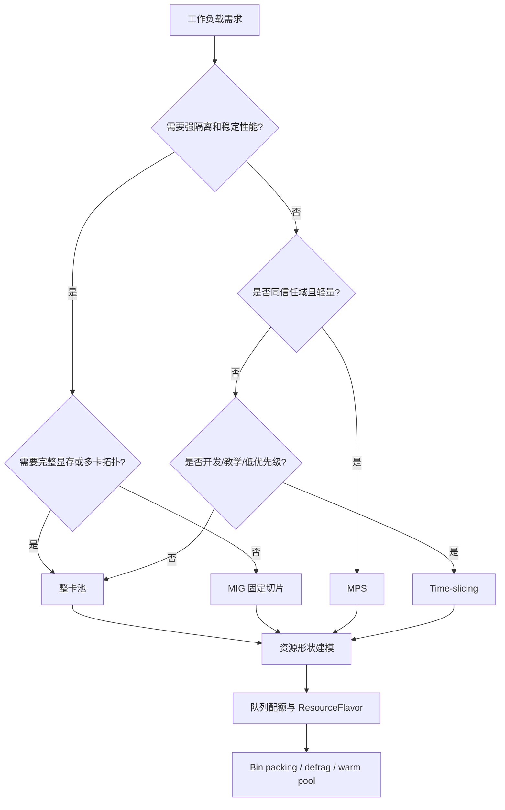
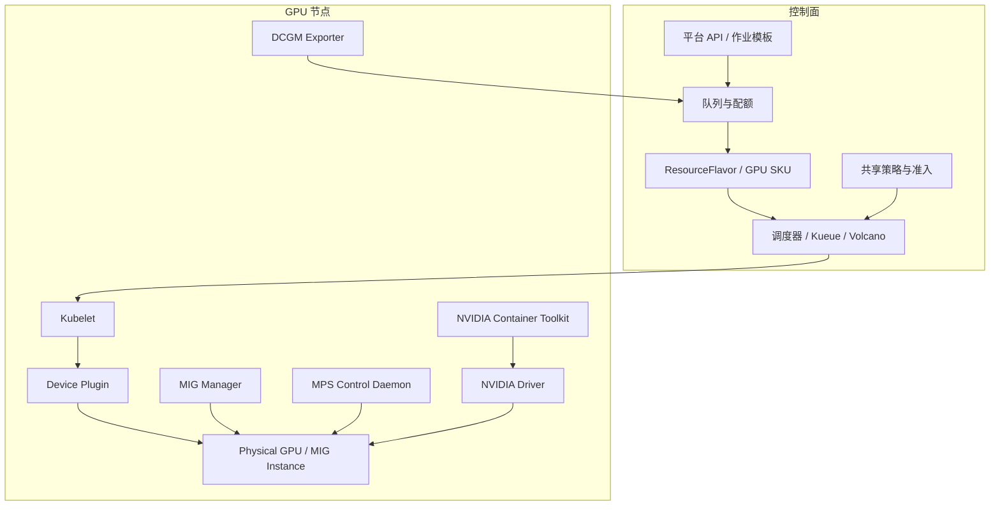

# 第20b章：GPU 资源切分与共享

> GPU 共享不是把一张卡“变多”，而是在隔离、性能确定性、碎片化和利用率之间重新签合同。

本章讨论 AI 平台的 GPU 资源层：整卡池、MIG、MPS、time-slicing、warm pool、资源形状、bin packing 和碎片化治理。它接在第19b章 GPU 调度与拓扑之后，也为第20a章队列配额提供资源形状基础。

---

## 20b.1 第一性原理拆解 + 学习大纲

### 拆：不可化简的问题

GPU 资源层要解决的问题是：

**一组离散、异构、昂贵且带拓扑约束的设备，如何被表达成平台可调度、可配额、可计费、可观测、可解释的资源形状。**

CPU 可以相对连续地按 core 和 memory 分配。GPU 不行。影响 GPU 可用性的因素很多：

- 型号：H100、A100、L40S、L4 的性能和能力完全不同。
- 显存：40GB、80GB、94GB 不是同一种资源。
- 拓扑：同机 8 卡、跨机 8 卡、NVLink、NVSwitch、PCIe 路径差异很大。
- 切分方式：整卡、MIG、MPS、time-slicing 的隔离语义不同。
- 软件栈：驱动、CUDA、container toolkit、device plugin、NCCL、推理引擎版本影响能否运行。
- 状态：是否已经拉好镜像、加载权重、构建 engine、预热 KV cache。
- 租户边界：跨租户共享和同团队共享的风险不同。

所以平台不能只暴露 `nvidia.com/gpu: 1`。它必须回答“这 1 个 GPU 到底是什么形状、什么隔离、什么性能承诺、什么故障边界”。

### 推：从问题推导机制

从“大训练和大模型需要完整显存、拓扑和性能确定性”推出整卡池。

从“小模型长期独占整卡会浪费”推出 MIG。

从“同信任域轻量进程想共享 CUDA 上下文”推出 MPS。

从“开发、教学和低优先级任务只需要先跑起来”推出 time-slicing。

从“模型冷启动慢，权重加载和 engine 构建昂贵”推出 warm pool。

从“资源形状越来越多，账面空闲和可调度空闲分裂”推出 bin packing 和碎片化治理。

从“共享会带来互扰”推出隔离等级、性能确定性和准入策略。

### 绘：GPU 形状决策链路



### 学习大纲

读完本章，你应该能回答：

1. 整卡、MIG、MPS、time-slicing 的隔离边界分别在哪里。
2. 为什么 MIG 能提高利用率，也可能制造新的碎片。
3. MPS 和 time-slicing 为什么不适合强 SLA 跨租户生产服务。
4. warm pool 解决的是启动路径问题，不是总容量问题。
5. 资源形状应该如何进入队列、配额、计费和观测。
6. bin packing 为什么不能只按 GPU 数量做。
7. 如何排查“有空闲 GPU 但作业起不来”。

---

## 20b.2 概念先说清楚

### 整卡池是什么，不是什么

整卡池把物理 GPU 作为最小分配单元。一个 Pod 获得一张或多张完整 GPU，通常通过 `nvidia.com/gpu` 或平台定义的 ResourceFlavor 表达。

整卡池不是低利用率的同义词。对于多卡训练、大模型推理、强 SLA 在线服务、长上下文、RDMA/NVLink 敏感任务，整卡池是保护性能确定性和拓扑完整性的必要手段。

### MIG 是什么，不是什么

MIG（Multi-Instance GPU）是 NVIDIA 部分数据中心 GPU 支持的硬件切分能力。它把一张物理卡切成若干固定 profile，每个实例拥有相对隔离的显存、计算资源和故障边界。

MIG 不是显存超卖，也不是任意比例切片。它只能使用硬件支持的 profile。切分形状如果与业务需求不匹配，会产生比整卡更难解释的碎片。

### MPS 是什么，不是什么

MPS（Multi-Process Service）让多个 CUDA 进程共享同一 GPU 上下文，降低上下文切换和提交开销，改善轻量 kernel 并发。

MPS 不是强隔离多租户。它更适合同团队、同信任域、可容忍互扰的任务。跨租户使用 MPS 时，一个进程的显存峰值、异常 kernel 或错误可能影响同卡其他进程。

### Time-slicing 是什么，不是什么

Time-slicing 通过时间片让多个工作负载轮流使用同一张 GPU。它通常由 device plugin 或平台调度策略表达。

Time-slicing 不是性能承诺。它适合 notebook、教学、开发、demo 和低优先级实验，不适合 P99 延迟、吞吐和抖动有明确 SLA 的生产推理。

### Warm pool 是什么，不是什么

Warm pool 是预热容量或预热状态：热节点、热镜像、热权重、热 engine、热副本、热 KV cache。它缩短从“需要扩容”到“可以接流量”的路径。

Warm pool 不是 GPU 切分方式，也不增加总容量。它用长期占用成本换启动速度。

### 相邻概念边界

| 概念 | 解决什么 | 不解决什么 |
|------|----------|------------|
| 整卡 | 显存、拓扑、性能确定性 | 小模型成本浪费 |
| MIG | 固定小规格强隔离 | 任意比例弹性切片 |
| MPS | 同信任域多进程并发 | 跨租户强隔离 |
| Time-slicing | 提高开发可获得性 | 稳定延迟和吞吐 |
| Warm pool | 冷启动路径 | 总容量不足 |
| Bin packing | 保留关键资源形状 | 业务优先级治理 |
| 队列配额 | 谁能使用资源 | 一张卡如何切分 |

---

## 20b.3 架构：关键组件、控制路径和数据路径

### 关键组件



### 控制路径

1. 运维系统把节点划入不同 GPU 池，例如 `h100-full`、`h100-mig-small`、`l40s-dev-shared`。
2. GPU Operator、device plugin、MIG manager、MPS 组件在节点上安装并暴露资源。
3. NFD 或 GPU feature discovery 给节点打上型号、显存、MIG、拓扑和软件版本标签。
4. 平台把用户请求转换成 ResourceFlavor，例如 `h100-80gb-full`、`a100-40gb-mig-1g.5gb`。
5. 队列和配额层决定租户是否有资格使用该 flavor。
6. 调度器根据资源数量、节点标签、污点、亲和、拓扑和 gang 条件选择节点。
7. kubelet 调用 device plugin 分配设备，runtime 注入 `/dev/nvidia*` 和驱动库。
8. 观测系统采集 GPU util、显存、错误、XID、MIG 使用、共享倍率和 throttling。

### 数据路径

GPU 任务的数据路径包括：

- 模型权重从对象存储、PVC、本地 NVMe 或镜像层进入内存和显存。
- 输入数据从网络、存储或消息队列进入 CPU，再进入 GPU。
- 多卡训练通过 PCIe、NVLink、NVSwitch、RDMA 交换梯度或激活。
- 推理服务在 GPU 显存中维护权重、KV cache、workspace 和临时 buffer。
- checkpoint 从 GPU/CPU 状态落到本地盘、共享文件系统或对象存储。

共享方式会改变数据路径的风险。MIG 隔离显存空间；MPS 和 time-slicing 下同卡任务更容易在显存、cache、kernel 执行和错误传播上互相影响。

### 责任边界

| 层 | 负责什么 | 不负责什么 |
|----|----------|------------|
| GPU Operator | 驱动、toolkit、device plugin、MIG 管理 | 租户公平和业务优先级 |
| Device Plugin | 暴露和分配 GPU / MIG 资源 | 推理 P99 和训练收敛 |
| 平台资源层 | GPU 池、flavor、共享策略、碎片治理 | 应用内部显存优化 |
| 队列配额层 | 哪个租户可用哪个 flavor | 单节点内部性能调优 |
| 调度器 | 节点选择和资源绑定 | 模型权重预热 |
| 应用框架 | CUDA、NCCL、推理 engine、checkpoint | 集群级资源治理 |

---

## 20b.4 原理：切分与共享如何工作

### 整卡：保护完整性

整卡调度的核心价值是完整性：

- 完整显存：大模型权重、KV cache 和训练 activation 不被硬切。
- 完整计算资源：SM、Tensor Core、带宽不被固定切片。
- 完整拓扑：多卡作业可以获得同机、同 NVLink/NVSwitch 域的 GPU。
- 完整故障边界：同卡没有其他租户任务互扰。

整卡的代价是小模型可能低利用率。治理方向不是简单共享所有卡，而是识别哪些负载需要整卡，哪些负载可以进入 MIG 或共享池。

### MIG：固定 profile 的硬件隔离

MIG 把一张支持的 GPU 切成多个 GPU instance / compute instance。Kubernetes 中通常暴露为不同资源名，例如：

```yaml
resources:
  limits:
    nvidia.com/mig-1g.10gb: 1
```

MIG 的优点：

- 显存和计算资源隔离比 MPS、time-slicing 更强。
- 小模型推理、固定规格 notebook、轻量服务可以配额化和计费。
- 一个租户的显存占用不应直接吞掉另一个 MIG 实例的显存。

MIG 的风险：

- profile 固定，不能任意拆分。
- 重切 profile 往往需要驱逐已有负载。
- profile 和业务需求错配会形成碎片。
- MIG 资源名会让 quota、监控和计费更复杂。

设计 MIG 时先问“业务稳定需要哪些 profile”，而不是“硬件最多能切几份”。

### MPS：共享 CUDA 执行通道

MPS 通过一个控制 daemon 协调多个 CUDA 进程共享 GPU。它适合小 kernel、低占用、多进程并发提交场景。

MPS 的关键限制：

- 隔离弱于 MIG。
- 显存超用和异常行为可能影响同卡其他进程。
- 性能互扰依赖 workload 行为，很难向用户承诺稳定 P99。
- 运维上需要限制同卡进程数、租户边界和资源 request。

MPS 更适合作为“同团队共享优化”，不应作为跨租户强隔离的默认方案。

### Time-slicing：提高可获得性

Time-slicing 让多个 Pod 或容器以时间片方式共享 GPU。用户会看到自己获得了一个 GPU 资源，但实际执行时间被多个任务分摊。

它的价值是降低门槛：开发、教学和 notebook 可以快速启动。它的代价是性能不确定：同卡任务数、kernel 类型、显存水位和上下文切换都会影响体验。

一个实用规则是：time-slicing 可以承诺“能跑”，不要承诺“跑得稳”。

### Warm pool：热的是路径，不是容量

推理扩容慢常常不是没有 GPU，而是启动路径长：

```text
节点加入 -> 镜像拉取 -> 权重下载 -> engine 构建 -> 显存分配 -> 预热 -> readiness
```

Warm pool 可以在不同层次截断这条路径：

| Warm pool 对象 | 缩短什么 | 成本 |
|----------------|----------|------|
| 热节点 | 节点 provisioning | 空闲节点费用 |
| 热镜像 | image pull | 镜像缓存和更新治理 |
| 热权重 | weight download | 磁盘、网络、版本一致性 |
| 热 engine | TensorRT / vLLM 初始化 | 版本和硬件绑定 |
| 热副本 | readiness 到接流量 | GPU 常驻成本 |
| 热 KV / 预热请求 | 首批请求抖动 | 预热流量和状态管理 |

Warm pool 必须按模型、卡型、MIG profile 和版本管理。一个 H100 整卡热副本不能替代 `3g.40gb` MIG 热副本。

---

## 20b.5 资源形状：从硬件到平台 SKU

资源形状是平台对 GPU 可用性的产品化表达。它不只是数量，还包括：

- GPU 型号和显存。
- 是否整卡、MIG、MPS、time-slicing。
- 单节点 GPU 数量和拓扑。
- 驱动、CUDA、NCCL、推理 engine 版本。
- 是否允许跨租户共享。
- 是否可抢占、是否 spot、是否 warm。
- 计费倍率和配额归属。

### ResourceFlavor 设计示例

| Flavor | 资源 | 适合负载 | 隔离 | SLA |
|--------|------|----------|------|-----|
| `h100-80gb-full-nvlink` | H100 80GB 整卡，同 NVLink 域 | 8 卡训练、70B 推理 | 强 | 强 |
| `h100-80gb-full-single` | H100 80GB 单整卡 | 中大模型推理、单卡训练 | 强 | 强 |
| `h100-mig-1g.10gb` | MIG 小切片 | 7B 小模型、embedding、notebook | 强 | 中 |
| `a100-mig-3g.40gb` | MIG 中切片 | 中等模型推理 | 强 | 中 |
| `l40s-mps-team` | MPS 同团队共享 | 轻量实验、低风险批处理 | 中弱 | 弱 |
| `l4-timeslice-dev` | time-slicing | 开发、教学、demo | 弱 | 无强承诺 |
| `h100-warm-70b` | 热权重 / 热副本 | 70B 在线扩容 | 强 | 强 |

### 配额和计费

资源形状必须进入配额和计费，否则平台会出现“账面公平、实际不公平”。例如：

- 1 个 H100 整卡不能与 1 个 L4 time-slice 等价。
- 1 个 `3g.40gb` MIG 不能与 1 个 `1g.10gb` MIG 等价。
- 热副本消耗 GPU 即使没有流量，也应计入容量成本。
- MPS/time-slicing 的计费需要表达共享倍率和性能承诺缺失。

---

## 20b.6 工程化：生产落地、配置、发布与治理

### 池化策略

GPU 池不要只按卡型拆，也要按使用契约拆：

| 池 | 用途 | 典型策略 |
|----|------|----------|
| full-train | 多卡训练 | 保留 8 卡整节点，强 gang，少放碎片任务 |
| full-online | 强 SLA 推理 | 整卡、反亲和、warm pool |
| mig-small | 小模型推理 | 固定 profile，独立 quota |
| mig-notebook | notebook / 开发 | 较低优先级，可重切 |
| shared-dev | MPS / time-slicing | 同团队或低优先级，限制共享倍率 |
| warm-online | 热副本 | 版本绑定，严格变更 |

### 配置示例：抽象 GPU 池策略

```yaml
gpuPools:
  h100-full-train:
    nodeSelector:
      accelerator: h100-80gb
      topology: nvlink-8
    sharing: none
    preserveShape:
      minFreeFullNodes: 2
    allowedQueues: ["research", "priority-train"]

  h100-mig-small:
    nodeSelector:
      accelerator: h100-80gb
    mig:
      profiles:
        "1g.10gb": 4
        "2g.20gb": 1
      reconfigureWindow: "Sun 02:00-04:00"
    allowedQueues: ["online-small", "notebook"]

  l40s-dev-shared:
    nodeSelector:
      accelerator: l40s
    sharing:
      mode: time-slicing
      replicasPerGpu: 4
      maxMemoryFraction: 0.25
    allowedQueues: ["dev", "teaching"]
    sla: best-effort

  h100-warm-70b:
    nodeSelector:
      accelerator: h100-80gb
    warm:
      image: true
      weights: "llm-70b@2026-05-04"
      engine: true
      minReadyReplicas: 2
    allowedQueues: ["online"]
```

### 版本矩阵

GPU 共享方案对版本非常敏感。生产环境至少维护：

| 组件 | 关注点 |
|------|--------|
| NVIDIA Driver | CUDA runtime 兼容、MIG/MPS 支持、XID 修复 |
| CUDA | 应用镜像、框架 wheel、推理 engine 兼容 |
| NVIDIA Container Toolkit | 设备和驱动库注入 |
| NVIDIA Device Plugin | MIG strategy、time-slicing 配置、资源名 |
| GPU Operator | driver、toolkit、DCGM、MIG manager 生命周期 |
| DCGM Exporter | 指标维度、MIG 指标、错误事件 |
| Kubernetes | device plugin API、scheduler、topology manager |
| NCCL / UCX | 多卡训练和 RDMA 性能 |
| vLLM / TensorRT-LLM / Triton | 显存、engine、batching、KV cache 行为 |

### 发布路径

1. 盘点现有 workload 的显存峰值、GPU util、吞吐和延迟。
2. 先拆出整卡保护池，避免 MIG 或共享策略破坏关键大作业。
3. 选择单一低风险池试点 MIG 或 time-slicing。
4. 用 ResourceFlavor 和 quota 显式暴露新资源形状。
5. 接入 DCGM、应用指标和队列指标，观察性能互扰。
6. 配置回滚：MIG 重切窗口、节点 cordon/drain、迁移计划。
7. 再扩大到生产推理或多租户场景。

### 观测指标

| 指标 | 用途 |
|------|------|
| allocatable by flavor | 每种资源形状可用量 |
| free full nodes | 完整 8 卡节点数量 |
| GPU util / memory used | 粗粒度利用率 |
| SM occupancy / memory bandwidth | 性能瓶颈判断 |
| MIG profile allocation | profile 碎片 |
| time-slicing replicas per GPU | 共享倍率 |
| MPS active clients | 同卡进程数 |
| XID errors | 设备故障和驱动错误 |
| ECC / retired pages | 硬件健康 |
| cold start breakdown | 镜像、权重、engine、readiness 耗时 |
| pending by flavor | 需求和供给是否错配 |

### 治理规则

- 跨租户默认使用整卡或 MIG，不默认使用 MPS。
- 强 SLA 推理禁止 time-slicing。
- 多卡训练池保留完整节点，不允许小任务随意填满。
- MIG profile 变更必须有维护窗口和驱逐计划。
- warm pool 必须有版本归属、容量预算和过期策略。
- 所有 flavor 都进入配额、计费和审计。
- 共享池必须标注 best-effort 或明确 SLA 降级。

---

## 20b.7 Bin packing 与碎片化治理

### 碎片化定义

碎片化不是“GPU 利用率不高”，而是：

**账面上有空闲容量，但没有某个工作负载所需的完整资源形状。**

例子：4 台 8xH100 节点，总空闲 10 张 GPU。

| 节点 | 空闲 GPU | 当前占用 | 对 8 卡训练是否可用 |
|------|----------|----------|---------------------|
| node-a | 3 | 5 张被推理副本占用 | 不可用 |
| node-b | 2 | 6 张被实验任务占用 | 不可用 |
| node-c | 4 | 已切 MIG profile | 不可用 |
| node-d | 1 | 7 张被训练占用 | 不可用 |

用户说“还有 10 张空闲卡”，平台说“没有 1 台完整 8 卡节点”，两者都对。差异在资源形状。

### Bin packing 目标

Bin packing 不是把每张卡都塞满，而是保留关键形状：

- 对 8 卡训练，保留完整 8 卡节点。
- 对 70B 推理，保留成对或成组整卡。
- 对小模型推理，把相近 profile 放到 MIG 池。
- 对开发任务，优先填共享池，不污染整卡训练池。
- 对可抢占任务，优先填将来可回收的位置。

### 策略对照

| 策略 | 适合 | 风险 |
|------|------|------|
| compact 小任务 | 保留完整节点 | 单节点热点和故障影响集中 |
| spread 在线副本 | 降低故障域风险 | 破坏整卡训练形状 |
| 按卡型拆池 | 避免性能误配 | 池过细降低利用率 |
| 按 MIG profile 拆池 | profile 可审计 | 需求变化时难借用 |
| 低峰 defrag | 回收碎片，恢复大形状 | 需要 checkpoint 和维护窗口 |
| reserved full nodes | 保护大训练窗口 | 闲时看起来利用率低 |

### 碎片治理动作

1. 建立 `pending by flavor` 和 `available shape` 看板。
2. 定义关键形状，例如 `8xh100-full-node`、`2xh100-80gb`、`mig-3g.40gb`。
3. 小任务默认 compact 到非关键节点。
4. 借用任务必须可抢占，方便 defrag。
5. 定期复盘 MIG profile 分布，避免长期错配。
6. 对训练高峰前做预整理，释放完整节点。
7. 把碎片成本纳入队列策略，而不是只看 GPU util。

---

## 20b.8 方案设计：资源形状决策表

### 决策表

| 工作负载 | 显存需求 | SLA | 租户边界 | 推荐形状 | 说明 |
|----------|----------|-----|----------|----------|------|
| 70B 在线推理 | 高 | 强 | 跨租户 | 整卡 + warm pool | 保护显存、拓扑和冷启动 |
| 8 卡训练 | 高 | 中 | 单租户 | 整卡同节点 + gang | 保护 NVLink 和整体准入 |
| 7B 小模型推理 | 中低 | 中 | 跨租户 | MIG | 固定 profile，较强隔离 |
| embedding 服务 | 中 | 中 | 跨租户 | MIG 或整卡 | 看显存峰值和批大小 |
| notebook | 低 | 弱 | 多租户 | MIG 或 time-slicing | 不能承诺稳定性能 |
| 教学实验 | 低 | 弱 | 多租户 | time-slicing | 目标是可获得性 |
| 同团队轻量批处理 | 低 | 弱 | 同信任域 | MPS | 限制同卡进程和显存 |

### 可执行方案：64 张 H100 平台改造

现状：

- 20 个 7B 小模型各占一张整卡，GPU util 10%-20%。
- 4 个 70B 服务各需要 2 张 H100 整卡。
- 研究团队每天提交 8 卡训练，经常因碎片 Pending。
- 开发 notebook 经常抢占整卡。

目标：

- 降低小模型成本。
- 保留 8 卡训练形状。
- 降低 70B 扩容冷启动。
- 让开发任务能跑，但不污染关键池。

设计：

| 池 | 容量 | 策略 |
|----|------|------|
| `h100-full-train` | 24 GPU | 3 台完整 8 卡节点，只放 8 卡训练和少量可抢占大训练 |
| `h100-full-online` | 16 GPU | 70B 整卡推理，反亲和，强 SLA |
| `h100-mig-small` | 16 GPU | 切 `1g.10gb` / `2g.20gb`，承载 7B 小模型 |
| `h100-warm-online` | 4 GPU | 70B 热权重和热副本 |
| `h100-dev-shared` | 4 GPU | time-slicing，开发和 notebook，best-effort |

准入规则：

1. 70B 服务只能使用 `full-online` 或 `warm-online`。
2. 8 卡训练只能使用 `full-train`，必须 gang scheduling。
3. 7B 小模型默认使用 `mig-small`，除非显存画像超过 MIG profile。
4. notebook 进入 `dev-shared`，不得申请整卡生产池。
5. `dev-shared` 可被全部抢占，用于 emergency defrag。
6. MIG profile 每周复盘，变更只在维护窗口执行。

成功指标：

- 8 卡训练 Pending p95 下降。
- 7B 小模型单请求成本下降。
- 70B 扩容 readiness 时间下降。
- `available full nodes` 不低于阈值。
- MIG profile pending 与 idle 同时出现的时间减少。

---

## 20b.9 故障排除：症状、证据、根因、动作

| 症状 | 证据 | 常见根因 | 处理动作 |
|------|------|----------|----------|
| 有空闲 GPU 但 8 卡作业 Pending | 节点级空闲、Pod event、ResourceFlavor | 空闲卡分散，没有完整 8 卡节点 | compact 小任务、等待窗口、迁移可抢占任务 |
| MIG 服务扩不起来 | MIG profile allocatable、pending flavor | 只有 `1g.10gb`，没有 `3g.40gb` | 重切 profile、拆池、调整模型规格 |
| time-slicing Running 但很慢 | 同卡 replicas、GPU util、kernel 时间 | 共享倍率过高或邻居任务重 | 限制 replicas、迁到 MIG/整卡 |
| MPS 下 P99 抖动 | MPS clients、显存峰值、应用日志 | 同卡进程互扰 | 限同团队、限显存、关键服务禁用 MPS |
| warm pool 有节点但扩容仍慢 | cold start breakdown | 热的是节点，不是权重/engine/readiness | 预热镜像、权重、engine 和探针 |
| GPU 不可见 | `nvidia-smi`、device plugin 日志、node allocatable | driver/toolkit/device plugin 异常 | 重启组件、隔离节点、检查版本 |
| 容器 OOM 或 CUDA OOM | 应用日志、显存曲线、MIG profile | profile 太小或 batch/KV cache 超预期 | 调整 profile、限制 batch、改整卡 |
| XID 错误频繁 | DCGM、内核日志、节点事件 | 硬件、驱动或压力问题 | cordon 节点、迁移负载、升级或报修 |
| NCCL 性能异常 | NCCL logs、拓扑、网卡 locality | 跨 NUMA、跨慢链路、混卡 | 加 topology constraint，拆池，固定节点 |

### 排障顺序

1. 看作业请求的是哪个 flavor，而不是只看 GPU 数。
2. 看该 flavor 的 allocatable、allocated、pending。
3. 看节点级完整形状，例如完整 8 卡节点数。
4. 看共享方式：MIG、MPS、time-slicing 是否符合 SLA。
5. 看设备健康和版本：driver、device plugin、DCGM、XID。
6. 看应用层：显存峰值、batch、KV cache、NCCL、checkpoint。

### 常用证据

```bash
kubectl describe node <gpu-node>
kubectl get pods -A -o wide
kubectl describe pod <pod> -n <ns>
kubectl get events -n <ns> --sort-by=.lastTimestamp
nvidia-smi
nvidia-smi topo -m
```

如果使用 MIG、Kueue 或 Volcano，还要查看对应 CRD 状态、ResourceFlavor、ClusterQueue、PodGroup 和 device plugin 配置。

---

## 20b.10 反模式 + Checklist

### 常见反模式

| 反模式 | 现象 | 修复方向 |
|--------|------|----------|
| 把所有 GPU 当一种 SKU | 作业性能差异巨大，调度解释困难 | 按型号、显存、拓扑、共享方式建 flavor |
| 为利用率全开 MIG | 大模型和 8 卡训练长期无卡 | 保留整卡池和重切窗口 |
| 跨租户默认 MPS | 一个租户影响另一个租户 | 跨租户优先 MIG 或整卡 |
| time-slicing 跑生产推理 | P99 抖动，用户投诉 | 只用于开发和低优先级 |
| 只看总空闲 GPU | “有卡但 Pending”反复发生 | 看关键形状可用数 |
| warm pool 只热节点 | 扩容仍慢在权重和 engine | 热到 readiness 层 |
| 小任务随意 spread | 破坏完整 8 卡节点 | 小任务 compact 到专用池 |
| MIG profile 长期不复盘 | idle 和 pending 同时存在 | 根据需求重切和拆池 |

### Checklist

- [ ] GPU flavor 覆盖型号、显存、整卡/MIG/MPS/time-slicing、拓扑和 SLA。
- [ ] 多卡训练池保留完整节点，并与小任务隔离。
- [ ] MIG profile 来自真实显存画像，不是硬件最大切分能力。
- [ ] MPS 限定同信任域，并限制同卡进程数和显存。
- [ ] Time-slicing 标注 best-effort，不承诺强 SLA。
- [ ] Warm pool 明确热到节点、镜像、权重、engine 还是副本。
- [ ] 每个 flavor 都进入配额、计费、审计和看板。
- [ ] 看板展示 `pending by flavor` 和关键形状可用数。
- [ ] 有 MIG 重切、节点 drain、defrag 的维护窗口。
- [ ] XID、ECC、显存、共享倍率和 cold start 都可观测。

---

## 20b.11 Worked Example：从整卡浪费到资源形状治理

### 初始状态

一个团队有 64 张 H100：

- 20 个 7B 小模型各占 1 张整卡，平均 GPU util 15%。
- 4 个 70B 服务各占 2 张整卡，扩容冷启动 8 分钟。
- 研究团队每天提交 8 卡训练，p95 等待超过 2 小时。
- notebook 用户经常申请整卡，运行 10 分钟后空闲。

### 诊断

平台看板显示：

| 指标 | 状态 | 解释 |
|------|------|------|
| 平均 GPU util | 45% | 不算高，但不能说明容量健康 |
| 总空闲 GPU | 12 | 看起来有空闲 |
| 完整 8 卡节点 | 0 | 训练 Pending 的直接原因 |
| 7B 显存峰值 | 13GB | 不需要 H100 整卡 |
| 70B cold start | 权重 4m + engine 3m + readiness 1m | warm pool 应热到 engine |
| notebook 使用 | 峰值短、空闲长 | 适合共享池 |

### 改造

1. 把 3 台 8 卡节点划入 `h100-full-train`，小任务不得进入。
2. 把 2 台节点划入 `h100-full-online`，承载 70B 服务。
3. 把 2 台节点划入 `h100-mig-small`，按 `1g.10gb` 和 `2g.20gb` 承载 7B。
4. 用 4 张 GPU 做 `h100-warm-70b`，预加载权重和 engine。
5. 剩余 4 张 GPU 做 `h100-dev-shared`，time-slicing 给 notebook。
6. 队列侧把 `dev-shared` 标记为 best-effort 和可抢占。

### 结果

- 7B 模型从整卡迁到 MIG，单位成本下降。
- 8 卡训练至少能看到保留的完整节点。
- 70B 扩容从 8 分钟下降到 1 分钟以内。
- notebook 可获得性提升，但明确没有强 SLA。

真正的收益不是“平均 GPU util 变高”这一项，而是资源形状变得可解释：谁需要整卡、谁适合 MIG、谁只能 best-effort、谁需要 warm pool，都有明确边界。

---

## 20b.12 本章小结

| 主题 | 关键点 |
|------|--------|
| 整卡 | 保护显存、拓扑、隔离和性能确定性 |
| MIG | 硬件固定切分，适合稳定小规格强隔离场景 |
| MPS | 同信任域多进程共享，不适合默认跨租户 |
| Time-slicing | 提高开发可获得性，不提供强性能承诺 |
| Warm pool | 缩短冷启动路径，不增加总容量 |
| 资源形状 | GPU 平台应调度、配额、计费 flavor，而不是抽象 GPU 数 |
| Bin packing | 目标是保留关键形状，不是盲目塞满 |
| 碎片治理 | 需要指标、维护窗口、抢占和池化策略共同完成 |

---

## 练习题

### 基础题

1. MIG 和 MPS 的隔离边界有什么不同？
2. 为什么 time-slicing 不适合强 SLA 在线推理？
3. warm pool 为什么不能简单理解为“更多 GPU”？
4. 为什么“总空闲 GPU 数”不是容量健康的充分指标？

### 进阶题

5. 给一个同时有 7B、70B、8 卡训练和 notebook 的集群设计 GPU 池和 ResourceFlavor。
6. 一个服务需要 `3g.40gb`，集群剩很多 `1g.10gb`。解释为什么扩不起来，并给出治理动作。
7. 某 8 卡训练作业 Pending，但集群有 12 张空闲 H100。请设计排障证据链。
8. 你准备把小模型推理从整卡迁到 MIG。列出发布步骤、观测指标和回滚策略。
