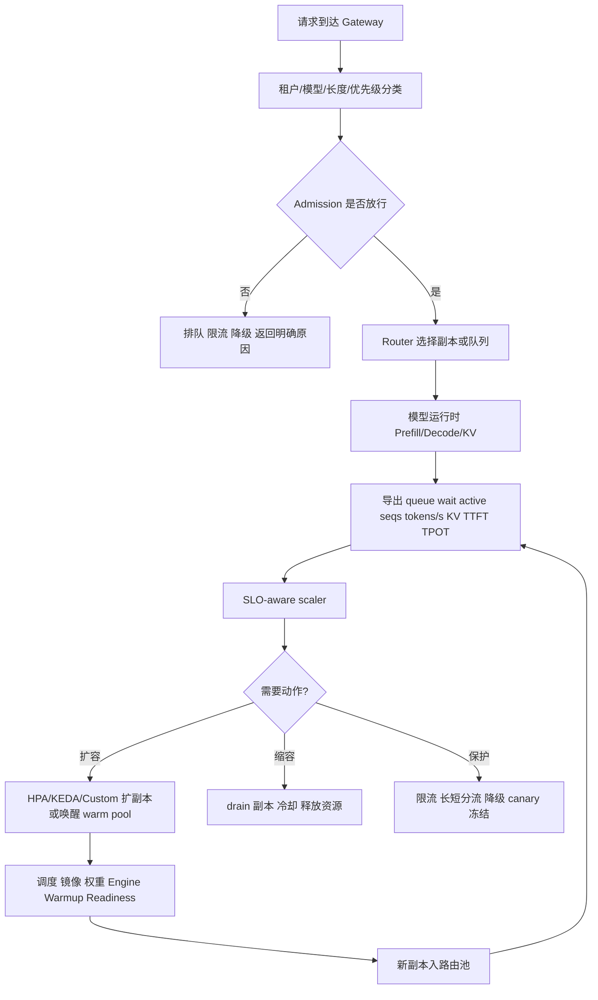

# 第20c章：推理 Autoscaling

> 推理扩缩容不是“指标超过阈值就加 Pod”，而是把用户等待、token 工作量、KV cache、冷启动、路由和降级策略放进同一个容量控制回路。

## 20c.1 第一性原理拆解 + 学习大纲

### 拆 — 不可化简的问题

在线推理 autoscaling 要解决的不可化简问题是：**在请求到达随机、请求成本高度不均、模型副本启动慢、GPU 资源形状离散、运行时状态不断变化的条件下，平台如何让可交付容量持续贴近业务 SLO，同时避免 GPU 成本失控。**

普通 Web 服务常见的扩容逻辑是 CPU 高了加副本、QPS 低了缩副本。LLM 推理不能这样处理，原因至少有六个：

| 差异 | Web 服务常见假设 | LLM 推理现实 |
|------|------------------|--------------|
| 请求成本 | 单请求成本相对稳定 | 10 token prompt 和 32K prompt 成本相差几个数量级 |
| 执行阶段 | 请求一次性执行 | prefill 和 decode 的瓶颈不同 |
| 并发模型 | 线程 / 连接数可粗略代表压力 | active sequences、batch、KV block 才接近真实状态 |
| 资源瓶颈 | CPU / 内存经常能解释延迟 | GPU compute、HBM、KV cache、调度器、下游依赖都会卡 |
| 扩容生效 | 新 Pod Ready 后基本可用 | 镜像、权重、engine、CUDA graph、warmup 都可能还没完成 |
| 用户体验 | 请求整体延迟 | TTFT、TPOT、超时、截断、goodput 要分开看 |

因此，本章关注的不是 HPA、KEDA 或某个 scaler 的语法，而是如何构造一个 SLO-aware 的推理容量控制系统。

### 推 — 从问题推导机制

先从用户体验推导指标。用户首先感知的是排队，所以要看 `queue_wait`。请求进入运行时后，能否继续接请求取决于活跃序列和 KV cache，所以要看 `active_sequences`、`KV block utilization` 和 preemption。推理计算量不是 QPS，而是输入 token 和输出 token，所以要看 `prefill_tokens/s` 与 `decode_tokens/s`。用户体验要拆成首 token 和后续 token，所以要看 TTFT 与 TPOT。副本扩出来不等于可接流量，所以冷启动和 readiness 必须进入扩容模型。

再从控制动作推导组件。HPA 适合按 Kubernetes metrics 调 Deployment 副本；KEDA 适合从队列、消息系统或外部事件源触发；custom scaler 适合把运行时指标、路由队列、KV cache 和 SLO 组合成业务特定的决策。扩不动或扩了也救不了时，还需要 admission、限流、降级、canary 冻结和 warm pool。

### 绘 — 控制回路



### 导 — 读完本章你应该能回答

1. HPA、KEDA、custom scaler 分别适合控制什么，不适合控制什么？
2. 为什么 queue wait、active sequences、tokens/s、KV cache 比 CPU 更接近推理瓶颈？
3. TTFT 和 TPOT 分别反映哪段链路的问题？
4. KV cache 为什么既是显存问题，也是 admission 和 autoscaling 问题？
5. 冷启动为什么必须拆成 image、weight、engine、warmup 和 readiness？
6. warm pool、scale-to-zero、canary、降级如何和扩缩容配合？
7. 怎样设计一个 SLO-aware 的扩缩容策略，而不是只追求高 GPU utilization？

## 20c.2 概念先说清楚：Autoscaling 是什么，不是什么

推理 autoscaling 是一个闭环控制系统：它观察流量、队列、运行时和 SLO，决定副本数、热容量、准入策略和降级动作，使服务在成本边界内满足目标体验。

它不是下面这些东西：

| 不是 | 为什么不够 |
|------|------------|
| 不是 CPU HPA | CPU 可能很低，但 KV cache 已满、queue wait 已经爆掉 |
| 不是 GPU utilization 阈值 | GPU 忙不等于用户有效吞吐高，GPU 不忙也可能在排队或受 KV 限制 |
| 不是只调 `replicas` | 新副本可能还在拉镜像、加载权重、编译 engine，不能立即接流量 |
| 不是只看 QPS | 同样 10 QPS，短问答和 32K 长上下文成本完全不同 |
| 不是替代限流 | 资源不足、依赖异常或坏版本放量时，只扩容会扩大故障面 |

### 与相邻概念的边界

| 概念 | 负责回答 | 与 autoscaling 的边界 |
|------|----------|------------------------|
| Queue / quota | 哪个租户和请求有资格消耗资源 | autoscaling 不应绕过配额和优先级 |
| GPU 资源切分 | 是否有正确卡型、MIG profile、拓扑和隔离 | autoscaling 只能请求容量，不能凭空改变资源形状 |
| Load balancing | 现有副本之间如何分流 | autoscaling 决定容量规模，router 决定请求落点 |
| Admission control | 这个请求现在能不能进系统 | autoscaling 给 admission 提供容量信号，admission 保护 SLO |
| Canary / release | 新版本是否继续放量 | canary 指标异常时应冻结扩容放量或回滚 |
| Cluster autoscaler | 节点池是否扩容 | 推理 scaler 触发 Pod，节点 scaler 负责底层节点容量 |

### 扩的到底是哪种容量

| 容量 | 含义 | 代表指标 | 常见误判 |
|------|------|----------|----------|
| 调度容量 | 集群能否放下新 Pod | Pending、ResourceFlavor、quota、node allocatable | Pod 创建成功就代表扩容成功 |
| 启动容量 | 新副本多久变成可服务 | image pull、weight load、engine init、warmup | 容器 Running 就能接请求 |
| 执行容量 | 单位时间能处理多少 token | prefill tokens/s、decode tokens/s、batch efficiency | QPS 可以直接代表负载 |
| KV 容量 | 能容纳多少上下文和活跃序列 | KV utilization、block free、preemption、OOM | 显存空闲就一定还能接更多请求 |
| SLO 容量 | 按目标体验完成的有效吞吐 | TTFT、TPOT、timeout、goodput | GPU util 高就是容量健康 |

本章后面所有设计都围绕一个判断：**autoscaling 的目标不是副本数更多，而是按 SLO 可交付的 token 容量更接近需求。**

## 20c.3 架构：组件、数据路径、控制路径与责任边界

一个生产可用的推理 autoscaling 架构通常至少包含七类组件。

| 组件 | 责任 | 关键输出 |
|------|------|----------|
| API Gateway | 鉴权、租户识别、全局限流、请求标签化 | tenant、model、priority、prompt length |
| Admission Controller | 判断请求是否立即进入、排队、降级或拒绝 | admitted / queued / downgraded / rejected |
| Router | 选择模型版本、副本、长度池、canary 比例 | routing decision、per-replica queue |
| Serving Runtime | 执行 prefill / decode、管理 batch 和 KV cache | active sequences、tokens/s、KV metrics |
| Metrics Pipeline | 聚合 Prometheus / OpenTelemetry / runtime metrics | 窗口化指标、分桶指标、SLO burn |
| Scaler | 根据策略改变副本、热池或降级开关 | scale event、cooldown、reason |
| Orchestrator | 创建 Pod、调度 GPU、拉镜像、加载权重、readiness | Pod state、node state、endpoint state |

### 数据路径

请求数据路径强调“用户请求如何变成 token 输出”：

```text
Client
  -> Gateway
  -> Admission
  -> Router
  -> Model replica local queue
  -> Prefill
  -> Decode loop
  -> Streaming response
```

这个路径上的延迟可以拆成：

| 延迟 | 说明 | 常见指标 |
|------|------|----------|
| gateway latency | 网关鉴权、限流、序列化开销 | gateway p95 |
| admission wait | 全局队列或租户队列等待 | queue_wait |
| router wait | 找不到合适副本或本地队列满 | pending_requests |
| prefill latency | 输入 token 首次处理 | prefill time、input_tokens |
| decode latency | 输出 token 逐步生成 | TPOT、output_tokens |
| stream overhead | 网络和客户端消费速度 | stream flush、client abort |

### 控制路径

控制路径强调“指标如何变成动作”：

```text
Runtime/Gateway metrics
  -> Metrics pipeline
  -> Policy evaluation
  -> HPA/KEDA/custom scaler
  -> Deployment/CRD/Endpoint update
  -> Pod scheduling and warmup
  -> Router endpoint discovery
```

控制路径的核心风险是滞后。假设指标窗口 60 秒、HPA 同步 15 秒、调度 60 秒、镜像和权重 180 秒、warmup 30 秒，那么一次扩容可能 4 到 6 分钟后才真正增加可服务容量。高峰只持续 2 分钟时，盲目扩容会在流量过去后才产生额外成本。

### 责任边界

| 决策 | 建议归属 | 原因 |
|------|----------|------|
| 是否接收某个请求 | Admission | 它知道租户、优先级、SLO 和当前容量 |
| 请求落到哪个副本 | Router | 它掌握本地队列、版本、长度池和健康状态 |
| 副本数目标 | Scaler | 它聚合窗口化指标并执行冷却策略 |
| Pod 能否被调度 | Kubernetes / queue layer | 它掌握 quota、ResourceFlavor、节点和拓扑 |
| 副本是否 Ready | Serving runtime + readiness probe | 只有运行时知道权重、engine、KV 和 warmup 是否完成 |
| 是否降级 | Policy controller | 需要结合业务优先级、SLO burn 和风险开关 |

不要把这些责任混在一个脚本里。脚本可以做 PoC，生产系统需要每个动作都有指标、事件、审计和回滚路径。

## 20c.4 原理：为什么 CPU/QPS 不够，Token 和 KV 才关键

LLM 推理通常分为 prefill 和 decode。

Prefill 阶段处理输入 prompt，特点是一次性读入大量 token，矩阵计算密集，输入长度越长越贵。Decode 阶段逐 token 生成输出，特点是每一步都依赖前一步，batch 和 KV cache 状态决定吞吐与延迟。

| 阶段 | 主要工作 | 主要瓶颈 | 用户感知 |
|------|----------|----------|----------|
| Prefill | 处理输入 tokens，建立 KV cache | compute、HBM、长上下文 batch | TTFT 变差 |
| Decode | 逐 token 生成输出 | KV 读取、调度步进、active sequences | TPOT 变差 |
| Scheduling | 组织请求进入 batch | 队列、长度混合、优先级 | queue wait 和尾延迟 |
| Streaming | 输出给客户端 | 网络、客户端速度、取消请求处理 | 断流、超时、无效工作 |

### Queue wait

`queue_wait` 是请求被 admission 放行后，到真正进入模型运行时之前的等待时间。它是最接近用户痛感的容量信号。

| 现象 | 含义 |
|------|------|
| queue wait 上升，active sequences 接近上限 | 副本执行槽不足，应考虑扩容或分流 |
| queue wait 上升，KV utilization 接近满 | 继续塞请求会引发 preemption 或 OOM |
| queue wait 上升，GPU util 不高 | 可能是长请求阻塞、KV 受限、router 错配或下游依赖 |
| queue wait 低但 TPOT 差 | 请求进得去，但 decode 阶段过载 |

### Active sequences

`active_sequences` 表示运行时正在处理的序列数量。它不是越高越好。太低可能浪费 GPU，太高可能让 decode 步进变慢、KV cache 被挤满、尾延迟恶化。

一个实用判断是看 `active_sequences / max_num_seqs`，但不能单独使用。`max_num_seqs` 设置过大时，表面并发提高，实际 TPOT 和 P99 可能更差。

### Tokens/s

QPS 没有区分输入和输出成本。推理容量应该至少拆成：

| 指标 | 用途 |
|------|------|
| `input_tokens/s` | 判断 prompt 压力和 prefill 成本 |
| `output_tokens/s` | 判断 decode 压力和持续生成成本 |
| `prefill_tokens/s` | 判断 prefill 计算吞吐 |
| `decode_tokens/s` | 判断 decode 生成吞吐 |
| `tokens_per_gpu_second` | 做容量规划和成本归因 |
| `good_tokens/s` | 只统计按 SLO 完成、未超时、未取消的有效 token |

如果流量从“短问答”变成“长文档总结”，QPS 可能不变，但 input tokens/s 暴涨，TTFT 会先坏。如果用户把 `max_tokens` 从 512 调到 4096，QPS 也可能不变，但 decode 占用时间变长，TPOT 和队列都会受影响。

### KV cache

KV cache 存储 attention 需要的 key/value 状态。它的规模大致受模型层数、hidden size、batch、上下文长度和精度影响。KV cache 是推理 autoscaling 的关键，因为它决定一个副本能同时容纳多少活跃上下文。

| KV 状态 | 可能后果 | 扩缩容含义 |
|---------|----------|------------|
| 利用率低，queue wait 高 | 可能是 compute 或路由问题 | 不要只因 queue wait 扩容，先查瓶颈 |
| 利用率中等，active sequences 高 | 正常高负载 | 可通过扩容或优化 batch 改善 |
| 利用率接近上限 | 新请求难以进入，可能 preempt | 需要扩容、长短分流或收紧 admission |
| preemption 增加 | KV 不够导致换出或重算 | goodput 下降，扩容和限流都可能需要 |
| OOM | admission 或参数失控 | 立即保护，降低 `max_num_seqs` 或上下文上限 |

GPU 显存指标经常显示“还有空闲”，但运行时的 KV block 已经不可用。autoscaling 应该优先信任运行时暴露的 KV block 指标，而不是只看节点层显存。

## 20c.5 TTFT、TPOT、Goodput 与 SLO-aware Scaling

### 指标定义

| 指标 | 含义 | 主要解释 |
|------|------|----------|
| TTFT | Time To First Token，从请求进入到首 token 返回 | 排队、路由、prefill、冷启动 |
| TPOT | Time Per Output Token，后续 token 平均间隔 | decode 压力、active sequences、KV 读取 |
| E2E latency | 整个请求完成时间 | prompt + output 长度共同决定 |
| Timeout rate | 超时比例 | 容量不足、依赖异常或客户端限制 |
| Goodput | 按 SLO 成功完成的有效吞吐 | 真正可交付容量 |
| SLO burn rate | 错误预算消耗速度 | 是否触发保护动作 |

仅看平均 TPOT 或平均 TTFT 会掩盖租户、模型版本、prompt 长度和输出长度差异。生产系统至少要按以下维度分桶：`model`、`version`、`tenant`、`priority`、`prompt_length_bucket`、`output_length_bucket`、`replica`、`gpu_sku`。

### SLO-aware scaling 的基本思路

SLO-aware scaling 不把指标阈值当成唯一真相，而是问三个问题：

1. 当前 SLO 是否正在被消耗？
2. 扩容在冷启动时间之后是否仍然来得及？
3. 如果扩容来不及，是否应该限流、降级或切池？

示例策略：

```yaml
slo:
  ttft_p95_ms: 1000
  tpot_p95_ms: 80
  timeout_rate: "< 0.5%"

scale_out:
  all:
    - queue_wait_p95_ms: "> 200"
    - pending_requests: "> 2 * ready_replicas"
  any:
    - active_sequences_per_replica: "> 0.80 * max_num_seqs"
    - prefill_tokens_per_gpu_second: "> 0.75 * profiled_prefill_capacity"
    - decode_tokens_per_gpu_second: "> 0.75 * profiled_decode_capacity"
  guardrails:
    - kv_cache_utilization_p95: "< 0.92"
    - last_scale_out_seconds: "> 60"

protect:
  any:
    - kv_cache_utilization_p95: ">= 0.92"
    - preemption_rate: "> 0"
    - slo_burn_rate_5m: "> 4"
  actions:
    - route_long_context_to_dedicated_pool
    - tighten_max_tokens_for_low_priority
    - freeze_canary
    - enable_tenant_burst_limit

scale_in:
  all:
    - queue_wait_p95_ms: "< 30 for 20m"
    - active_sequences_per_replica: "< 0.35 * max_num_seqs for 20m"
    - slo_burn_rate_30m: "< 1"
    - no_recent_cold_start_errors: true
```

这里的重点是 `guardrails`。KV 已经接近满时，把更多请求塞进现有副本不是扩容，而是制造尾延迟和重算。此时更合理的动作可能是扩新副本、长短分流、限制长上下文或拒绝低优先级 burst。

## 20c.6 HPA、KEDA 与 Custom Metrics

### HPA

HPA 是 Kubernetes 原生的副本控制器。它适合用 CPU、内存、Prometheus Adapter 暴露的 custom metrics 调整 Deployment 或类似对象。

| 优点 | 局限 |
|------|------|
| 原生、稳定、容易接入 Deployment | 对 LLM 运行时语义无感 |
| 支持 scale behavior、stabilization window | 指标窗口和冷启动容易滞后 |
| 适合中小模型和简单服务 | 难表达 KV、token、warm pool、降级动作 |

HPA 可以作为执行器，但不要把 CPU HPA 当成推理 autoscaling 的完整方案。

### KEDA

KEDA 更适合事件驱动扩缩容，例如 Kafka、SQS、Redis Stream、Prometheus、外部队列等。它的优势是能根据队列积压或外部事件唤醒服务，甚至支持 scale-to-zero。

| 适合 | 不适合 |
|------|--------|
| 异步推理、批推理、embedding 队列、低频服务唤醒 | 强实时聊天主链路只靠队列长度扩容 |
| 消息积压和副本数关系相对清楚的服务 | 请求 token 成本差异巨大的服务 |
| 需要 scale-to-zero 的内部模型 | 冷启动不可接受的高 SLO 服务 |

队列长度必须转成工作量。100 个短 embedding 请求和 100 个 32K 长上下文请求不应触发同样的扩容动作。

### Custom scaler

Custom scaler 适合在成熟平台中使用。它从 gateway、router、runtime、Prometheus 和业务 SLO 聚合指标，输出副本数、warm pool 规模、admission 开关和降级策略。

| 能力 | 工程要求 |
|------|----------|
| 组合 queue wait、active seqs、tokens/s、KV、TTFT、TPOT | 指标命名稳定、窗口一致、缺失值策略明确 |
| 区分模型、租户、长度和版本 | 分桶不能爆炸，需要保留核心维度 |
| 结合冷启动时间预测容量 | 需要记录每阶段启动耗时 |
| 输出降级和 canary 冻结动作 | 需要审计、回滚和人工 override |

一个原则：先用 HPA/KEDA 建立闭环，再把确实需要业务语义的部分沉淀到 custom scaler。不要一开始就写一个无法解释的大型控制器。

## 20c.7 工程化落地：配置、版本矩阵、发布、观测与治理

### 配置分层

推理 autoscaling 的配置至少分五层：

| 层 | 示例 | 变更频率 |
|----|------|----------|
| 模型容量画像 | 每 GPU prefill/decode tokens/s、最大上下文、KV block | 模型或 runtime 变更时 |
| 服务 SLO | TTFT、TPOT、timeout、可降级策略 | 产品或租户合同变更时 |
| scaler 策略 | scale-out/in 阈值、cooldown、min/max replicas | 容量调优时 |
| 路由策略 | 长短池、canary、租户权重、warm pool 入池规则 | 发布或高峰前 |
| 保护策略 | 限流、max_tokens、模型降级、拒绝低优先级 | 事故或演练时 |

### 版本矩阵

推理 autoscaling 的行为受多个版本影响。生产发布前建议维护一张矩阵：

| 维度 | 需要记录 | 为什么重要 |
|------|----------|------------|
| GPU / driver | H100/A100/L40S、driver、CUDA | 性能和兼容性不同 |
| Runtime | vLLM / TensorRT-LLM / TGI / Triton 版本 | 指标语义、KV 管理、batch 行为不同 |
| Model artifact | 权重版本、量化方式、context length | tokens/s 和显存占用不同 |
| Container image | 镜像 digest、依赖、启动脚本 | image pull 和初始化可复现 |
| Scaler policy | 阈值、窗口、cooldown、min/max | 影响副本行为和事故复盘 |
| Router policy | 长短分流、canary、健康检查 | 影响流量和 SLO |

不要只记录模型版本。一次 TPOT 退化可能来自 runtime 升级、量化方式改变、driver 变化、CUDA graph capture 失败或 scaler 窗口被调整。

### 发布策略

推理服务发布要同时发布“模型、runtime、路由和 scaler”。建议顺序：

1. 离线 profile：测 prefill/decode tokens/s、KV 容量、最大并发、冷启动耗时。
2. Shadow：复制真实请求但不返回用户，验证错误率、tokens/s 和资源曲线。
3. Canary：1% 到 5% 流量，单独看 TTFT、TPOT、queue wait、OOM、preemption。
4. Scaler dry-run：新策略只记录建议副本数，不实际执行。
5. 小步放量：逐步提高 canary 和 scaler 生效范围。
6. Freeze gate：任一核心 SLO 或运行时错误异常，冻结 canary 和 scale-in。

### 观测与审计

最小观测集合：

| 类别 | 必备指标 |
|------|----------|
| 流量 | QPS、input/output tokens/s、prompt/output length bucket |
| 队列 | queue wait P50/P95/P99、pending requests、admission decision |
| 运行时 | active sequences、batch size、prefill/decode tokens/s、KV utilization、preemption |
| SLO | TTFT、TPOT、timeout、client cancel、goodput |
| 冷启动 | schedule time、image pull、weight load、engine init、warmup、readiness |
| 扩缩容 | desired/ready replicas、scale event reason、cooldown、HPA/KEDA status |
| 发布 | model version、runtime version、canary percentage、traffic split |

每次 scale event 都应该能回答：为什么扩、扩到多少、预计何时生效、是否成功入池、SLO 是否改善。

## 20c.8 方案设计：SLO-aware 推理扩缩容方案

假设要设计一个 70B chat 服务，目标是 P95 TTFT < 1s、P95 TPOT < 80ms/token，支持普通聊天和长文档总结。

### 决策表

| 决策点 | 推荐方案 | 理由 |
|--------|----------|------|
| 基础扩缩容 | custom metrics HPA 或自研 scaler 输出 Deployment replicas | 副本控制仍交给 K8s，指标用 LLM 语义 |
| 扩容主信号 | queue_wait_p95 + active_sequences + tokens/s | 同时覆盖用户等待、并发槽和真实工作量 |
| 保护信号 | KV utilization + preemption + SLO burn | 防止把过载误判为可继续加压 |
| 冷启动处理 | min replicas + warm pool + readiness warmup | 70B 首请求冷启动不可接受 |
| 长上下文处理 | 单独长上下文池，独立 quota 和队列 | 避免 32K 请求拖慢短问答 |
| scale-to-zero | 禁用于主链路，允许低频租户专属模型 | 主链路 SLO 不接受分钟级启动 |
| canary | 版本级独立指标门禁，异常冻结 | 防止坏版本被 autoscaling 放大 |
| 降级 | 低优先级收紧 max_tokens，必要时切小模型 | 扩容滞后时保护核心 SLO |

### 可执行配置草案

```yaml
service: chat-70b
resources:
  gpu_flavor: h100-80gb-full
  tensor_parallel: 2
  min_replicas: 4
  max_replicas: 18
  warm_pool_replicas: 2

slo:
  ttft_p95_ms: 1000
  tpot_p95_ms: 80
  timeout_rate_max: 0.005

routing:
  pools:
    short_context:
      prompt_tokens_max: 8192
      priority: default
    long_context:
      prompt_tokens_min: 8193
      priority: controlled
  canary:
    max_percent_without_approval: 5
    freeze_on:
      - ttft_p95_regression: "> 20%"
      - tpot_p95_regression: "> 15%"
      - runtime_error_rate: "> 1%"

scaling:
  scale_out:
    window: 2m
    step: 2
    cooldown: 90s
    when:
      - queue_wait_p95_ms: "> 200"
      - active_sequences_ratio: "> 0.80"
    or:
      - prefill_tokens_per_gpu_second_ratio: "> 0.75"
      - decode_tokens_per_gpu_second_ratio: "> 0.75"
  scale_in:
    window: 20m
    step: 1
    cooldown: 10m
    when:
      - queue_wait_p95_ms: "< 30"
      - active_sequences_ratio: "< 0.35"
      - slo_burn_rate: "< 1"
  protect:
    when:
      - kv_cache_utilization_p95: "> 0.92"
      - preemption_rate: "> 0"
      - slo_burn_rate_5m: "> 4"
    actions:
      - move_long_context_to_long_pool
      - limit_low_priority_max_tokens
      - freeze_canary
      - reject_burst_above_tenant_limit
```

### 为什么这个方案可执行

这个设计把动作拆开了：正常压力用扩容处理，KV 风险用保护动作处理，长上下文用路由隔离处理，版本风险用 canary 门禁处理，冷启动用 warm pool 和 readiness 处理。它不假设一个指标能解释全部问题。

## 20c.9 冷启动、Warm Pool 与 Scale-to-Zero

大模型副本从 0 到可接流量，通常经历以下阶段：

| 阶段 | 常见耗时来源 | 可优化动作 |
|------|--------------|------------|
| Pod 准入和调度 | quota、ResourceFlavor、节点容量 | 保留热节点、合理 min replicas |
| 镜像拉取 | 镜像过大、registry 跨区、节点无缓存 | 镜像瘦身、预拉、就近 registry |
| 权重加载 | 对象存储带宽、权重大小、本地盘缓存 | 权重缓存、分层加载、P2P 分发 |
| Engine 初始化 | 编译、CUDA graph capture、kernel autotune | 预构建 engine、固定 shape bucket |
| KV / 显存预分配 | 显存碎片、参数过大 | 固定配置、启动自检 |
| Warmup | 首批请求触发慢路径 | readiness 前执行代表性 warmup |
| 入路由池 | endpoint 更新、健康检查、traffic split | readiness gate、渐进接流量 |

### Warm pool

Warm pool 有不同深度：

| 深度 | 已经准备好什么 | 适合场景 |
|------|----------------|----------|
| 热节点 | 节点 Ready、driver 和 device plugin 正常 | 云节点启动慢 |
| 热镜像 | 镜像已缓存 | 镜像大、registry 慢 |
| 热权重 | 权重已在本地盘或内存缓存 | 大模型权重加载慢 |
| 热 engine | runtime 初始化和编译完成 | TensorRT-LLM、CUDA graph 明显耗时 |
| 热副本 | 完成 warmup，随时入池 | 强 SLO 在线服务 |

越热越贵。warm pool 的设计不是越多越好，而是让冷启动时间小于业务能接受的扩容反应时间。

### Scale-to-zero

| 场景 | 是否适合 | 原因 |
|------|----------|------|
| 低频内部工具模型 | 适合 | 首请求等待可接受，节省成本明显 |
| 异步 embedding / rerank 队列 | 视积压和 SLO 而定 | 可用 KEDA 唤醒，但要估算积压清空时间 |
| 70B 在线聊天主链路 | 通常不适合 | 权重和 engine 启动太慢 |
| 租户专属低频模型 | 可选 warm-to-zero | 可提前唤醒或保留工作时段热副本 |
| 夜间批推理 endpoint | 适合 | 用户不等待同步响应 |

Scale-to-zero 是产品和 SLO 决策，不是平台成熟度的证明。只要首请求不能接受几十秒到几分钟等待，就应保留最小热容量。

## 20c.10 Canary、限流与降级

Autoscaling 只能增加容量，不能保证所有请求都值得被服务，也不能修复坏版本。生产系统必须把扩缩容和保护动作放在一起。

| 动作 | 触发信号 | 目的 | 注意事项 |
|------|----------|------|----------|
| Canary 冻结 | 新版本 TTFT/TPOT/错误率劣化 | 防止坏版本继续放量 | canary 指标要独立于全量指标 |
| 租户限流 | 单租户 burst 导致全局 queue wait 上升 | 保护多租户公平 | 返回明确 reason 和 retry-after |
| 长短分流 | 长 prompt 占比升高 | 保护短请求 TTFT | 长池要有独立 SLO 和 quota |
| 收紧 max_tokens | decode 压力过高 | 降低长尾输出成本 | 只对低优先级或可降级场景 |
| 模型降级 | 主模型容量不足或错误率高 | 保持核心功能可用 | 需要产品认可质量差异 |
| RAG 降级 | 检索、rerank、向量库 P99 异常 | 避免下游拖垮推理 | 记录回答质量风险 |
| 拒绝低优先级 | SLO burn 过快、KV 接近满 | 避免系统雪崩 | 明确错误码和恢复条件 |

只扩容不 admission，长请求仍会拖垮短请求。只限流不扩容，用户会看到稳定的 429。成熟策略应该同时考虑容量动作和体验保护动作。

## 20c.11 故障排除：症状、证据、根因、处理动作

| 症状 | 关键证据 | 典型根因 | 处理动作 |
|------|----------|----------|----------|
| HPA 已扩容但 P99 没改善 | desired replicas 增加但 ready replicas 不增 | Pod Pending、镜像或权重冷启动 | 拆启动时间线，启用 warm pool 或预拉 |
| Ready 副本增加但流量没分过去 | router endpoint、traffic split、health check | 新副本未入路由池或权重版本不匹配 | 修 readiness gate 和 endpoint discovery |
| queue wait 高但 GPU util 不高 | active seqs、KV、length bucket、router queue | 长请求阻塞、KV 满、路由倾斜 | 长短分流、调 batch、扩正确池 |
| TTFT 差，TPOT 正常 | prefill tokens/s、input length、cold start | 长 prompt 高峰或 prefill 池不足 | chunked prefill、长上下文池、增加 prefill 容量 |
| TPOT 差，TTFT 正常 | decode tokens/s、active seqs、output length | decode 并发过高或 max_tokens 太大 | 降 `max_num_seqs`、扩 decode 容量、收紧低优先级输出 |
| KV utilization 高且 preemption 增加 | KV block、preemption count、OOM | 上下文过长、并发过高、参数错误 | 限制上下文、分流长请求、扩副本 |
| scale-in 后马上 scale-out | replica timeline、cooldown、traffic pattern | 缩容窗口太短，丢失热容量 | 增大 stabilization window，保留 min replicas |
| scale-to-zero 首请求超时 | cold start span、client timeout | 权重和 engine 启动超过用户等待 | 禁用主链路 scale-to-zero 或异步唤醒 |
| canary 放量后全局排队 | per-version metrics | 新版本吞吐下降，被 autoscaler 误扩 | 冻结 canary，回滚或隔离版本池 |
| GPU 利用率高但 goodput 低 | timeout、client cancel、good tokens/s | 超时后仍生成、重算、无效输出 | 强化取消传播、保护策略、减少 preemption |

排障顺序建议：

1. 先看请求分桶：租户、模型版本、prompt 长度、output 长度是否变化。
2. 再看 queue wait、TTFT、TPOT，把问题定位到排队、prefill、decode 或 streaming。
3. 再看运行时：active sequences、tokens/s、KV utilization、preemption、OOM。
4. 再看扩缩容时间线：desired、scheduled、ready、warmed、in-router。
5. 最后才看 kernel profiler、算子和底层性能。

线上扩缩容事故大多不是算子问题，而是指标、冷启动、路由、admission 和资源形状没有对齐。

## 20c.12 反模式 + Checklist

### 反模式

| 反模式 | 现象 | 修复方向 |
|--------|------|----------|
| 只用 CPU HPA | GPU 服务排队严重，CPU 仍不高 | 接入 queue wait、tokens/s、active sequences |
| 只看 QPS | 长上下文高峰被低估 | 按 input/output tokens 分桶 |
| readiness 过早 | 新副本刚接流量就 P99 spike | readiness 包含权重、engine、warmup |
| 无 scale-in 冷却 | 副本反复抖动，热容量被释放 | scale-out 和 scale-in 分开窗口 |
| 所有请求同池 | 长 prompt 拖慢短问答 | 长短分流，按 SLO 和长度建池 |
| KV 满了还继续 admission | preemption、OOM、尾延迟飙升 | KV 进入保护信号 |
| canary 和 autoscaling 混看 | 坏版本吞吐下降被全局扩容掩盖 | 版本级独立指标和冻结门禁 |
| 盲目 scale-to-zero | 首请求超时，用户体验不可接受 | 按业务 SLO 保留最小热副本 |

### Checklist

| 检查项 | 完成标准 |
|--------|----------|
| 指标 | queue wait、TTFT、TPOT、tokens/s、active sequences、KV、goodput 都可按模型和版本分桶 |
| 冷启动 | schedule、image、weight、engine、warmup、入路由池都有 span |
| 策略 | scale-out、scale-in、protect、canary freeze 分开配置 |
| Readiness | 只有权重加载、engine 初始化、warmup 成功后才入池 |
| Warm pool | 明确热到哪一层，成本归属清楚 |
| 降级 | 每个降级动作有触发条件、影响范围和恢复条件 |
| 审计 | 每次扩缩容都有 reason、前后指标和操作者 / 控制器记录 |
| 演练 | 至少演练长 prompt 高峰、冷启动变慢、KV 满、坏 canary 四类场景 |

## 20c.13 Worked Example：70B Chat 服务的 SLO-aware 扩缩容

### 背景

某平台提供 70B chat 服务，部署在 H100 80GB 整卡池，tensor parallel 为 2。业务目标：

| 指标 | 目标 |
|------|------|
| P95 TTFT | < 1s |
| P95 TPOT | < 80ms/token |
| Timeout rate | < 0.5% |
| 工作时段 | 09:00-23:00 |
| 峰值 | 250 QPS |

初始设计：

| 项 | 设置 |
|----|------|
| min replicas | 4 |
| max replicas | 18 |
| warm pool | 2 个热副本，权重和 engine 已 ready，不接普通流量 |
| scale-out | queue wait P95 > 200ms 且 active seqs > 80%，每次 +2 |
| scale-in | queue wait P95 < 30ms 且 active seqs < 35%，持续 20 分钟，每次 -1 |
| 长上下文 | >8K prompt 进入 long-context pool |
| canary | 新版本最多 5%，独立 TTFT/TPOT 门禁 |
| 降级 | 低优先级 max_tokens 可从 4096 收紧到 1024 |

### 事故

上午 10:12，告警显示：

| 指标 | 变化 |
|------|------|
| TTFT P99 | 从 1.8s 升到 6.2s |
| TPOT P95 | 基本正常 |
| queue wait P95 | 从 80ms 升到 850ms |
| desired replicas | 从 6 增到 10 |
| ready replicas | 只从 6 增到 7 |
| long prompt 占比 | 从 3% 升到 18% |

### 排查

1. TTFT 坏、TPOT 正常，优先怀疑排队、prefill 或冷启动。
2. desired replicas 增加但 ready replicas 增长慢，查看 cold start span。
3. 第 8 到第 10 个 Pod Running 但 not Ready，日志显示权重正在从对象存储加载。
4. 第 7 个副本虽然 Ready，但 warmup 未完成，router 已经放入普通流量。
5. 长 prompt 占比异常升高，来自一个企业租户的文档总结任务。

### 根因

这不是单纯副本不够，而是三个问题叠加：

| 问题 | 影响 |
|------|------|
| readiness 过早 | 冷副本接流量，首批请求 TTFT spike |
| 长 prompt 未及时分流 | prefill 队列被长上下文占用 |
| 扩容依赖远端权重加载 | 扩容触发后 4 分钟才有真实容量 |

### 处理

1. 立即从路由池摘除未完成 warmup 的副本。
2. 将 >8K prompt 强制切入 long-context pool，并对该租户启用 burst limit。
3. 从 warm pool 提升 2 个热副本进入普通池。
4. 冻结 canary，避免发布变量干扰容量事故。
5. readiness 改为必须完成代表性 warmup 请求后才入池。
6. scale-out 策略加入 `input_tokens_p95` 与 `weight_load_seconds`，用于高峰前预热。

### 复盘结论

扩容动作本身没有错，但扩出来的副本不是立即可用容量。autoscaling 的有效性取决于三个边界：高成本请求是否被准入和分流，新副本何时真正 ready，冷启动是否小于 SLO 允许的反应时间。

## 20c.14 本章小结

| 主题 | 关键点 |
|------|--------|
| 指标 | queue wait、active sequences、tokens/s、KV cache 比 CPU/QPS 更贴近瓶颈 |
| SLO | TTFT 定位排队和 prefill，TPOT 定位 decode，goodput 衡量有效容量 |
| 控制 | HPA/KEDA 可以做执行器，复杂推理需要 custom metrics 和保护动作 |
| 冷启动 | image、weight、engine、warmup、readiness 必须进入容量模型 |
| Warm pool | 用成本换启动速度，要明确热到哪一层 |
| 降级 | autoscaling 要和 admission、限流、canary、长短分流配套 |

---

## 练习题

### 基础题

1. 为什么 LLM 推理 autoscaling 不应该只看 CPU 或 QPS？
2. queue wait、active sequences、tokens/s 分别说明什么？
3. TTFT 和 TPOT 分别对应推理链路中的哪些阶段？
4. KV cache 利用率接近上限时，为什么不能只靠继续 admission 解决？
5. scale-to-zero 适合哪些推理服务，不适合哪些服务？

### 进阶题

6. 为一个同时提供 7B、70B 和 embedding 服务的平台设计扩缩容指标组合。
7. HPA desired replicas 已经增加，但 P99 没有改善。列出至少 8 个排查点，并说明证据来源。
8. 设计一个长上下文流量突增时的保护策略，至少包含 admission、routing、scaling 和降级动作。
9. 如何判断一个扩容策略是在提高 goodput，而不是只提高 GPU utilization？
10. 你会如何为一个租户专属低频 13B 模型设计 scale-to-zero 与 warm pool 策略？
