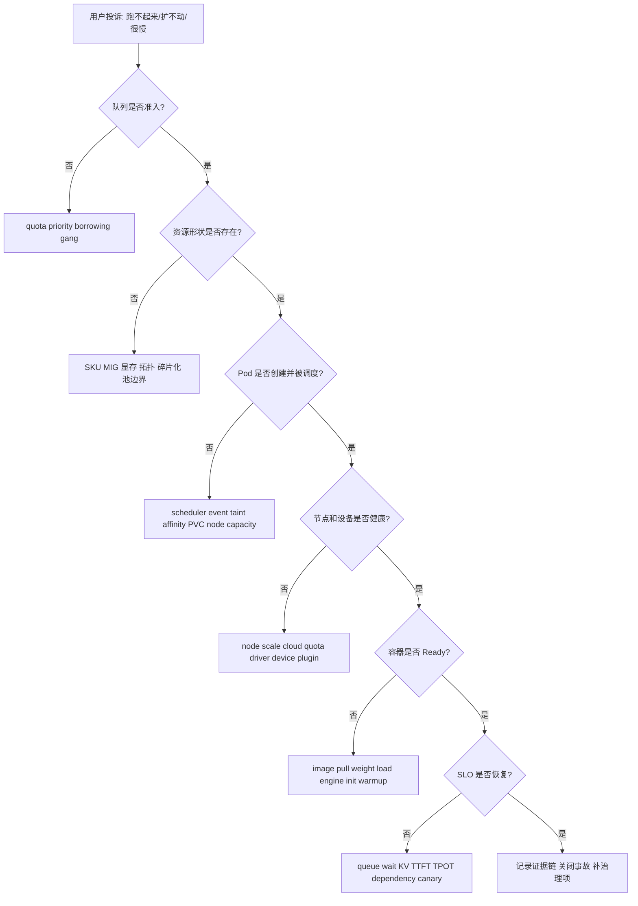

# 第20d章：容量与排障 SOP

> 容量排障的核心不是问“还有多少 GPU”，而是问“是否存在满足队列、配额、形状、调度、启动和运行时约束的可用容量，并且证据链是否能解释给用户”。

## 20d.1 第一性原理拆解 + 学习大纲

### 拆 — 不可化简的问题

容量与排障 SOP 要解决的不可化简问题是：**当用户说“明明有 GPU，为什么我的作业跑不起来 / 服务扩不起来”时，平台如何在有限时间内把现象分解成可验证的层次，找到阻塞点，给出恢复动作，并留下可审计的证据链。**

AI 平台里最容易误导人的数字是总空闲 GPU。它隐藏了至少七类事实：

| 被隐藏的事实 | 为什么重要 |
|--------------|------------|
| GPU 型号 | H100、A100、L40S 不能随意替代 |
| 显存和切分形状 | 80GB 整卡、40GB 卡、MIG profile 是不同资源 |
| 拓扑 | 8 卡同节点、NVLink、RDMA、zone 会决定能否启动 |
| 队列和配额 | 资源可能空闲，但不属于该队列或不可借用 |
| 调度约束 | taint、affinity、PVC zone、runtime class 都可能阻塞 |
| 冷启动 | Pod Running 不代表镜像、权重、engine 和 warmup 完成 |
| 运行时容量 | Ready 不代表 TTFT、TPOT、KV 和 goodput 健康 |

因此，SOP 的价值不是把命令列成清单，而是固定一种排障顺序：先判断卡在哪一层，再收集对应证据，最后选择最小有效动作。

### 推 — 从问题推导 SOP

用户看到 Pending，可能是队列尚未准入，可能是 quota blocked，可能是 gang 条件不满足，也可能是 kube-scheduler 找不到节点。用户看到“扩容慢”，可能是 scaler 没触发，可能是节点扩容被云配额挡住，可能是 GPU device plugin 没上报资源，也可能是权重冷启动占了 5 分钟。用户看到“有空闲 GPU”，可能只是账面总数有空闲，目标所需的 H100 80GB 整卡同节点形状并不存在。

于是 SOP 必须按层次组织：

1. 队列层：是否允许这个工作负载开始竞争资源？
2. 配额层：是否触达 nominal quota、borrowing limit 或 hard cap？
3. 资源形状层：是否存在正确 SKU、MIG profile、显存、拓扑和池？
4. 调度层：Pod 是否创建，scheduler 为什么不放置？
5. 节点层：节点是否扩出、Ready、暴露 GPU？
6. 启动层：镜像、权重、engine、readiness 卡在哪一步？
7. 运行时层：服务 Ready 后是否真的恢复 SLO？
8. 运营层：用户解释、审计、成本和后续治理是否闭环？

### 绘 — 排障总流程



### 导 — 读完本章你应该能回答

1. 为什么“空闲 GPU 数”不是容量承诺？
2. 有空闲 GPU 但扩不起来时，应该先查队列、形状还是 Pod？
3. Pod Pending 如何区分 quota blocked、资源碎片化和调度约束？
4. image cold start、weight cold start、engine cold start 的证据分别是什么？
5. 抢占恢复慢时，应该检查哪些契约？
6. 扩容慢如何拆成 scaler、准入、节点、设备、容器、模型和路由时间线？
7. 成本 / 利用率看板怎样避免“GPU 很忙但用户很慢”的误导？
8. 一条合格的证据链应该包含哪些字段？

## 20d.2 概念先说清楚：容量是什么，不是什么

容量不是一个总数，而是一组带约束的可交付能力。对 AI 平台来说，容量至少有六种：

| 容量类型 | 含义 | 常见证据 | 错误动作 |
|----------|------|----------|----------|
| 账面容量 | 集群总 GPU、CPU、内存 | inventory、allocatable | 用总数承诺具体作业能启动 |
| 可准入容量 | 队列和配额允许使用的容量 | Kueue/Volcano event、quota usage | 被 quota 挡住时盲目加节点 |
| 可调度容量 | 满足 Pod request、affinity、taint、拓扑的容量 | scheduler event、node labels | 把 Pending 都归因给 GPU 不够 |
| 可启动容量 | Pod 能拉镜像、挂盘、加载权重并 Ready | kubelet event、container log、startup span | Running 就认为可服务 |
| 可运行容量 | 运行时能处理有效 token 或训练 step | queue wait、TTFT、TPOT、step time | GPU util 高就认为健康 |
| 可恢复容量 | 被抢占或失败后能从 checkpoint 恢复 | checkpoint age、requeue state | 抢占后让用户从头重跑 |

### 与相邻概念的边界

| 概念 | 关注点 | 边界 |
|------|--------|------|
| Capacity planning | 未来要买多少资源、如何分池 | SOP 关注当前事故如何定位和恢复 |
| Scheduling | 单个 Pod / 作业如何放到节点 | SOP 要把队列、配额、冷启动也纳入排查 |
| Autoscaling | 何时改变副本或节点数量 | SOP 要验证扩容是否真正变成 Ready 和 goodput |
| Observability | 指标、日志、trace 的采集 | SOP 规定排障时如何使用这些证据 |
| Cost governance | GPU-hour、预算和利用率 | SOP 关注成本信号是否解释真实有效工作 |

### 五种“没容量”

| 类型 | 表面现象 | 本质 | 第一证据 |
|------|----------|------|----------|
| 队列没容量 | Workload 不被放行 | 配额、优先级、借用或 gang 不满足 | queue controller event |
| 形状没容量 | 有 GPU 但拼不出需求 | SKU、显存、MIG、拓扑、池边界不匹配 | ResourceFlavor、节点空闲分布 |
| 调度没容量 | Pod Pending | scheduler 找不到满足约束的节点 | `kubectl describe pod` events |
| 启动没容量 | Pod Running 但 not Ready | image、weight、engine、readiness 慢或失败 | kubelet event、container log |
| 运行时没容量 | Ready 但 P99 差 | queue、KV、batch、依赖、canary 异常 | runtime metrics、trace |

分类是排障的第一步。没有分类，就会出现 quota blocked 去扩节点、MIG profile 错配去调 HPA、权重加载慢去改 scheduler 的错误动作。

## 20d.3 架构：容量证据链、数据路径与控制路径

### 容量证据链

一条完整证据链应该能回答：请求或作业从提交到运行，在哪个关口被挡住，挡住它的规则是什么，谁能改变规则，改变规则的成本和风险是什么。

| 层 | 关键对象 | 关键证据 |
|----|----------|----------|
| 用户 / 租户 | tenant、project、priority、budget | 租户、队列、优先级、SLO |
| 队列 | LocalQueue、ClusterQueue、PodGroup、Workload | admitted、quota usage、borrowing、preemption |
| 资源形状 | ResourceFlavor、node pool、MIG profile、GPU SKU | 可用整卡数、profile 数、拓扑窗口 |
| Kubernetes 调度 | Pod、Node、PVC、PriorityClass、RuntimeClass | Pending reason、taint、affinity、volume event |
| 节点 / 设备 | Node、GPU Operator、device plugin、driver | node Ready、GPU allocatable、plugin log |
| 容器 / 模型 | image、init container、model artifact、readiness | pull time、weight load、engine init、warmup |
| 运行时 | serving runtime、training job、router | TTFT、TPOT、KV、step time、checkpoint |
| 运营 | incident、change、release、cost record | 时间线、处理动作、用户解释、复盘项 |

### 数据路径

训练作业的数据路径通常是：

```text
Submit Job
  -> Queue admission
  -> Workload / PodGroup
  -> Pod scheduling
  -> Node / GPU allocation
  -> Image pull and init
  -> Dataset / checkpoint access
  -> Training loop
  -> Checkpoint / metrics
```

推理扩容的数据路径通常是：

```text
Scaler decision
  -> Replica desired count
  -> Pod scheduling
  -> Image pull
  -> Weight load
  -> Engine warmup
  -> Readiness
  -> Router endpoint
  -> User traffic
```

### 控制路径

| 控制器 | 负责动作 | 常见问题 |
|--------|----------|----------|
| Queue controller | 准入、借用、抢占 | 规则不可见、quota event 不清楚 |
| Scheduler | Pod 放置 | 只看到 Pod 约束，不知道业务意图 |
| Cluster autoscaler | 节点扩容 | 云配额、节点组标签、启动慢 |
| GPU operator / device plugin | 暴露 GPU 资源 | driver、MIG、device plugin 异常 |
| Workload controller | JobSet、Ray、Deployment、ReplicaSet | 状态机卡住或重试策略错误 |
| Serving router | 副本入池、版本分流 | Ready 过早、endpoint stale |
| Cost / governance | chargeback、利用率、审计 | 忙碌资源和有效资源混淆 |

SOP 的核心工程要求是：这些控制器的事件必须能按时间线关联。如果只能看到 Pod Pending，却看不到它上游的 queue event 和 quota decision，就无法给用户可信解释。

## 20d.4 原理：为什么有空闲 GPU 仍然跑不起来

### 资源是离散形状，不是连续水池

假设集群显示空闲 12 张 GPU。一个作业需要 8 张同节点 H100 80GB 整卡。下面四种情况都叫“有空闲 GPU”，但都不能启动该作业：

| 空闲分布 | 为什么不能启动 |
|----------|----------------|
| 12 张分散在 6 台节点 | 没有 8 张同节点 |
| 8 张是 A100，4 张是 H100 | SKU 不匹配 |
| 8 张 H100 被切成 MIG `1g.10gb` | 不是 80GB 整卡 |
| 8 张在另一个不可借用队列 | 队列和配额边界不允许 |

这就是碎片化的本质：总量够，形状不够。

### 队列和配额先于调度

Kubernetes scheduler 只处理已经创建出来、进入调度流程的 Pod。很多平台会在更上游用 Kueue、Volcano 或自研队列先做准入。此时用户看到“作业没跑”，但 Pod 可能还不存在，或者存在但被 gang 条件卡住。直接 `describe pod` 可能查不到真正原因。

### Running 不等于 Ready，Ready 不等于恢复

对于大模型推理，Pod 状态可能这样变化：

```text
Pending
  -> ContainerCreating
  -> Running
  -> loading weights
  -> building engine
  -> warming up
  -> Ready
  -> in router
  -> receiving traffic
  -> SLO recovered
```

如果监控只看到 Running，就会把“权重还在加载”误判成“服务已经扩出来”。如果只看到 Ready，又可能漏掉 router 没有入池、canary 流量没切、首批请求触发慢路径的问题。

## 20d.5 工程化：生产落地、配置、版本矩阵、发布、观测、治理

### 配置要可解释

| 配置 | 应包含内容 | 排障用途 |
|------|------------|----------|
| Queue 配置 | nominal quota、hard cap、borrowing、priority | 判断 quota blocked 是否合理 |
| ResourceFlavor | GPU SKU、显存、MIG profile、拓扑标签 | 判断资源形状是否满足 |
| Node pool | 实例类型、zone、taint、label、autoscaler 范围 | 判断能否扩出正确节点 |
| Workload spec | request、limit、affinity、toleration、PodGroup | 判断 Pending 原因 |
| Image / artifact | image digest、model version、checkpoint path | 判断冷启动和版本一致性 |
| Readiness | image、weight、engine、warmup、router 入池条件 | 判断 Running 到 Ready 的边界 |
| Preemption policy | 可抢占范围、checkpoint 要求、恢复保护窗口 | 判断抢占是否可运营 |

### 版本矩阵

容量事故经常来自版本组合变化。建议为每个关键服务或队列记录：

| 维度 | 记录字段 |
|------|----------|
| 平台 | Kubernetes、scheduler、Kueue/Volcano、cluster autoscaler |
| GPU 栈 | driver、CUDA、NCCL、GPU operator、device plugin |
| 节点 | instance type、AMI / OS image、kernel、container runtime |
| 资源形状 | ResourceFlavor、MIG config、node labels、taints |
| 工作负载 | image digest、entrypoint、runtime、model artifact、checkpoint format |
| 存储网络 | CSI、对象存储 endpoint、registry、RDMA / CNI |
| 策略 | quota、priority、borrowing、preemption、autoscaling policy |

一次“昨天能跑，今天不能跑”的事故，可能不是用户作业变了，而是节点镜像、device plugin、MIG profile、quota 或模型权重路径变了。

### 发布和变更治理

| 变更 | 风险 | 发布要求 |
|------|------|----------|
| 调整 quota / borrowing | 租户公平和抢占行为变化 | dry-run、影响队列列表、审批记录 |
| 调整 ResourceFlavor | 作业可调度性变化 | 兼容性检查、历史 workload replay |
| 重切 MIG | 驱逐和形状变化 | drain 窗口、回滚 profile、用户通知 |
| 升级 GPU driver / device plugin | GPU 不上报或性能变化 | 金丝雀节点池、节点级回滚 |
| 改 readiness | 扩容入池时机变化 | 冷启动压测、router 验证 |
| 改 autoscaling | 成本和 SLO 波动 | scaler dry-run、阶梯放量 |

### 观测最小集合

| 类别 | 指标 / 事件 |
|------|-------------|
| 队列 | admitted、pending workload、quota usage、borrowing、preemption event |
| 资源形状 | idle by SKU、idle by MIG profile、free full-node windows、topology availability |
| 调度 | Pod Pending reason、scheduler attempts、taint / affinity mismatch |
| 节点 | node scale-up time、node Ready、GPU allocatable、device plugin health |
| 启动 | image pull seconds、init seconds、weight load seconds、engine init seconds、readiness seconds |
| 推理 | queue wait、TTFT、TPOT、KV utilization、active sequences、goodput |
| 训练 | pending time、step time、checkpoint age、restarts、preemption recovery time |
| 成本 | allocated GPU-hour、idle GPU-hour、useful token/GPU-hour、wasted preempted GPU-hour |

### 治理原则

1. 所有 Pending 都必须有用户可读 reason。
2. 所有抢占都必须有审计记录、恢复路径和损失估计。
3. 所有扩容事件都必须能拆出时间线。
4. 所有容量看板都必须按 SKU、形状、队列和租户分桶。
5. 所有“临时绕过 quota”的动作都必须有审批和过期时间。

## 20d.6 方案设计：容量排障证据链与决策表

### 统一证据链模板

```yaml
incident:
  id: inc-2026-05-04-001
  symptom: "70B service scale-out stuck"
  tenant: "enterprise-a"
  workload: "chat-70b"
  start_time: "2026-05-04T10:12:00+08:00"

timeline:
  - t: "10:12"
    event: "queue_wait_p95 > 800ms"
    source: "prometheus/router"
  - t: "10:13"
    event: "desired replicas 6 -> 10"
    source: "custom-scaler"
  - t: "10:14"
    event: "3 pods pending: insufficient h100-80gb-full"
    source: "scheduler"
  - t: "10:15"
    event: "1 pod running, weight loading"
    source: "container log"

classification:
  queue: "admitted"
  quota: "not blocked"
  shape: "blocked: only 2 h100-80gb-full available"
  scheduling: "partial pending"
  startup: "weight cold start"
  runtime: "TTFT degraded, TPOT normal"

actions:
  - "move warm replica into serving pool"
  - "preempt 2 low-priority full-card batch jobs"
  - "disable new small-model placement on h100-full pool"

user_explanation: >
  The cluster has idle GPUs, but the service requires H100 80GB full-card
  replicas. Idle GPUs are currently split across A100 and H100 MIG profiles.
  One admitted replica is also still loading weights and is not ready for traffic.
```

### 决策表

| 第一症状 | 第一判断 | 证据 | 首要动作 |
|----------|----------|------|----------|
| Workload 没有 Pod | 队列未准入 | queue event、quota usage | 查 quota、borrowing、gang |
| Pod Pending 且 insufficient GPU | 形状或总量不足 | scheduler event、node idle map | 查 SKU、MIG、拓扑、节点扩容 |
| Pod Pending 且 affinity mismatch | 约束过窄 | affinity、node labels | 修标签或放宽约束 |
| Pod Running not Ready | 启动慢或失败 | kubelet event、container log | 拆 image、weight、engine、warmup |
| Ready 副本不接流量 | 路由或健康检查 | endpoint、router log | 修 readiness gate 或 traffic split |
| GPU util 高但用户慢 | 有效吞吐低 | goodput、timeout、KV、queue | 查长尾、preemption、取消传播 |
| 抢占后没恢复 | 恢复契约失败 | checkpoint age、controller state | 修 checkpoint、requeue、保护窗口 |
| 扩容慢 | 时间线未知 | scaler 到 SLO recovery spans | 拆阶段，定位最长耗时 |

这个决策表是值班入口，不是替代具体排查。它的目标是在前 5 分钟内把事故分到正确分支。

## 20d.7 SOP 1：有空闲 GPU 但扩不起来

### 排查顺序

| 步骤 | 检查 | 证据 | 结论 |
|------|------|------|------|
| 1 | 工作负载是否被队列准入 | Workload admitted、queue event | 未准入先查 quota / priority |
| 2 | 目标资源形状是什么 | request、ResourceFlavor、nodeSelector | 明确 SKU、显存、MIG、拓扑 |
| 3 | 该形状是否存在空闲 | idle by SKU/profile/node | 判断是不是碎片化 |
| 4 | 空闲资源是否属于可用队列 | cohort、borrowing、hard cap | 判断是否被边界锁住 |
| 5 | 是否需要 gang / 同节点 | PodGroup、minAvailable、topology | 判断是否缺完整窗口 |
| 6 | 是否可通过抢占或 compact 释放 | preemptible workloads、checkpoint age | 判断恢复成本 |
| 7 | 节点池能否扩出正确形状 | node group、cloud quota、zone | 判断是否走集群扩容 |

### 用户解释模板

```text
集群当前总空闲 GPU 为 12 张，但目标服务需要 2 张 H100 80GB 整卡作为一个副本。
当前空闲资源中，6 张是 A100，4 张是 H100 MIG 1g.10gb，只有 2 张 H100 80GB 整卡。
因此最多只能再启动 1 个副本。剩余副本 Pending 的原因是资源形状不足，不是 quota blocked。
下一步动作：释放 h100-full 池中的低优先级任务，或等待节点池扩出新的 H100 80GB 节点。
```

### 处理动作

按侵入性从低到高：

1. 等待短作业自然完成，给出 ETA。
2. 暂停新小任务进入关键整卡池。
3. 将可迁移任务 compact 到少数节点，腾出完整节点。
4. 抢占低优先级且 checkpoint 新鲜的借用任务。
5. 启动正确 node pool 扩容。
6. 重切 MIG profile，但必须评估驱逐和回滚。
7. 调整长期池划分和 quota。

## 20d.8 SOP 2：Pod Pending

Pod Pending 是结果，不是根因。排查要先分清 Pod 是被队列创建后 Pending，还是工作负载根本没被准入。

| Pending 原因 | 关键证据 | 根因 | 处理动作 |
|--------------|----------|------|----------|
| `quota blocked` | ClusterQueue usage、hard cap | 队列没有可准入额度 | 等待、开放 borrowing、审批临时额度 |
| `gang not satisfied` | PodGroup minAvailable、created pods | 完整资源窗口不足 | 等待、降规模、抢占、backfill |
| `insufficient nvidia.com/gpu` | scheduler event、node allocatable | GPU 总量或形状不足 | 查碎片、node pool、device plugin |
| `node affinity mismatch` | nodeSelector、node labels | 约束和节点标签不匹配 | 修标签、放宽 affinity |
| `taint not tolerated` | node taints、pod tolerations | 队列没有进入该池的权限 | 添加 toleration 或修队列绑定 |
| `volume node affinity conflict` | PVC / PV zone | 存储 zone 和节点 zone 不一致 | 调整 storageClass 或调度 zone |
| `image pull backoff` | kubelet event、registry log | 镜像不可达、认证失败或过大 | 修 registry、凭证、预拉镜像 |
| `runtime class` 错误 | RuntimeClass、container runtime log | GPU runtime 配置错误 | 修 runtimeClass 和节点运行时 |

排查顺序：

1. 先看队列控制器 event：是否 admitted。
2. 再看 PodGroup / Workload：是否 gang 满足。
3. 再看 scheduler event：为什么找不到节点。
4. 再看 kubelet event：节点上创建容器时发生了什么。

只看最后一个 Pod event，容易错过上游准入原因。

## 20d.9 SOP 3：Quota Blocked

quota blocked 的关键是区分“确实超过合同边界”和“有空闲但策略不允许借用”。

| 检查项 | 要回答的问题 |
|--------|--------------|
| nominal quota | 当前队列是否用完名义额度 |
| hard cap | 是否触达绝对上限 |
| borrowing | 是否允许借用，借用额度是否用完 |
| cohort | 同共享组内是否有其他队列空闲 |
| flavor quota | 是所有 GPU 满，还是某个 H100 / MIG flavor 满 |
| preemption | 是否有可回收的低优先级借用资源 |
| priority | 当前工作负载优先级是否足以触发回收 |
| admission history | 最近是否有策略变更导致准入行为变化 |

### 处理原则

| 场景 | 动作 |
|------|------|
| 触达 hard cap | 不直接绕过，除非有审批、过期时间和成本归属 |
| nominal quota 满但 cohort 空闲 | 考虑开放 borrowing 或提高 borrowing limit |
| 低优先级占用借用资源 | 按抢占契约回收，检查 checkpoint |
| 仅某个 flavor 满 | 转到资源形状排查，不要只加总 quota |
| 长期 quota blocked | 进入容量规划，调整保底、池划分或预算 |

### 解释模板

```text
该作业被 quota blocked，不是 Kubernetes 调度失败。
research 队列 H100 80GB nominal quota 为 64，目前已使用 64。
同 cohort 中 online 队列还有空闲，但 hard cap 策略禁止 research 借用 online 保留容量。
可选动作：等待当前 8 卡作业结束，或由资源 owner 审批 24 小时临时 borrowing。
```

## 20d.10 SOP 4：Fragmentation

碎片化排障要从“总数”切到“形状”。建议建立一张关键形状表，而不是只看 GPU idle。

| 形状维度 | 必看问题 |
|----------|----------|
| 卡型 | H100、A100、L40S 是否混合展示 |
| 显存 | 40GB 和 80GB 是否被错误等价 |
| MIG | profile 是否匹配请求，是否需要重切 |
| 单节点 | 是否有完整 8 卡 / 4 卡窗口 |
| 拓扑 | NVLink、PCIe、RDMA、rack、zone 是否满足 |
| 队列边界 | 空闲资源是否可被当前队列借用 |
| 常驻副本 | 推理副本是否切碎训练节点 |
| 时间窗口 | 短作业多久释放，是否可以 backfill |

### 碎片化例子

| 节点 | 空闲 | 当前占用 | 对 8 卡训练 |
|------|------|----------|-------------|
| node-a | 3 H100 full | 5 张被在线推理占用 | 不可用 |
| node-b | 2 H100 full | 6 张被低优先级训练占用 | 不可用 |
| node-c | 4 H100 MIG | 已切 `1g.10gb` | 不可用 |
| node-d | 3 A100 full | 卡型不匹配 | 不可用 |

总空闲 12 张，但没有一个 8 卡 H100 full 节点窗口。

### 治理动作

| 动作 | 适用 | 风险 |
|------|------|------|
| compact 小任务 | 释放完整节点 | 单节点热点、迁移成本 |
| 禁止新任务进入关键池 | 防止碎片恶化 | 低优先级等待变长 |
| 抢占可恢复任务 | 快速释放形状 | checkpoint 和用户影响 |
| 重切 MIG profile | profile 错配严重 | 驱逐、重启、变更窗口 |
| 推理训练分池 | 保护在线和训练形状 | 利用率峰谷互补下降 |
| 调整 quota / borrowing | 长期形状错配 | 需要治理审批 |

## 20d.11 SOP 5：Image / Weight / Engine Cold Start

冷启动必须分段，否则会把所有启动慢都误归因给“扩容慢”。

| 类型 | 证据 | 典型根因 | 处理动作 |
|------|------|----------|----------|
| Image cold start | `Pulling image` 时间长、registry 5xx、节点无缓存 | 镜像过大、跨区拉取、认证慢 | 镜像瘦身、预拉、就近 registry、digest 固定 |
| Init cold start | init container 长时间运行 | 环境检查、依赖下载、权限等待 | 减少 init 工作、缓存依赖、并行化 |
| Weight cold start | 容器 Running，日志显示加载权重 | 权重大、对象存储慢、本地缓存 miss | 权重缓存、分层下载、P2P 分发、热副本 |
| Engine cold start | build engine、compile、CUDA graph capture 慢 | runtime 编译、shape bucket 太多 | 预构建 engine、固定 bucket、预热 |
| Readiness 过早 | Ready 后首批请求 TTFT spike | probe 未覆盖 warmup | readiness 包含代表性 warmup |
| Router 入池慢 | Ready 后无流量 | endpoint 更新、health check、traffic split | 修 router 发现和健康检查 |

### 冷启动时间线

```text
scale decision
  -> pod created
  -> scheduled
  -> image pulled
  -> container started
  -> weights loaded
  -> engine initialized
  -> warmup completed
  -> readiness true
  -> router in pool
  -> first successful request
```

每一段都要有 span。如果只有总启动时间，事故复盘只能猜。

## 20d.12 SOP 6：抢占恢复

抢占不是“杀掉低优先级任务”这么简单。没有恢复契约的抢占，会把平台利用率问题转化为用户信任问题。

### 四个契约

| 契约 | 必须回答 |
|------|----------|
| Checkpoint 契约 | 最近 checkpoint 在哪里，多久前，是否完整可读 |
| Requeue 契约 | 被抢占后是否自动回队列，保留哪些参数和优先级 |
| Protection 契约 | 恢复后是否有保护窗口，避免刚恢复又被抢占 |
| Explanation 契约 | 用户能否看到被谁抢占、为什么、损失多少、预计何时恢复 |

### 故障表

| 症状 | 证据 | 根因 | 动作 |
|------|------|------|------|
| 抢占后从头训练 | checkpoint age 很大或不可读 | checkpoint 频率不足、路径错误、权限错误 | 缩短 checkpoint 间隔，启动前校验 |
| 作业没有重入队 | controller state 卡住 | requeue 状态机缺陷 | 修控制器，补偿性重新提交 |
| 恢复后又被抢占 | preemption event 连续出现 | 缺恢复保护窗口 | 增加 grace period 和优先级提升 |
| 抢占释放不了资源 | Pod termination 卡住 | finalizer、PVC、进程不响应 | 强化优雅退出和超时清理 |
| 用户无法接受 | 没有通知和 ETA | 解释链断裂 | 暴露 event、checkpoint、恢复 ETA |

### 抢占前检查

1. 被抢占对象是否标记 preemptible。
2. checkpoint age 是否小于策略阈值。
3. 释放的资源形状是否真的满足高优先级需求。
4. 是否存在更低成本的 compact 或等待动作。
5. 抢占后是否会触发级联 Pending。

## 20d.13 SOP 7：扩容慢

扩容慢不是一个根因，而是一条时间线。必须把“决定扩容”到“SLO 恢复”拆开。

| 阶段 | 证据 | 典型瓶颈 | 动作 |
|------|------|----------|------|
| 指标触发 | metric value、scaler log | 指标窗口太长、指标缺失 | 调窗口、修指标、dry-run 校验 |
| 副本决策 | desired replicas、cooldown | 阈值过高、冷却过长 | 调策略、分开 scale-out/in |
| 队列准入 | Workload event、quota usage | quota blocked、gang 不满足 | 调 borrowing、释放形状 |
| Pod 调度 | scheduler event | 资源形状不足、affinity、taint | 查碎片、标签、节点池 |
| 节点扩容 | node group event、cloud quota | 云配额、实例无货、启动慢 | 预留、热节点、多 zone |
| GPU 可分配 | device plugin、driver log | 节点 Ready 但 GPU 不上报 | 修 driver、plugin、MIG |
| 容器启动 | image pull、init log | 镜像大、registry 慢 | 预拉、瘦身、缓存 |
| 模型启动 | weight / engine span | 权重加载、编译 | 热权重、预构建 engine |
| 入路由池 | endpoint、router log | readiness 或 discovery 问题 | 修健康检查、渐进接流量 |
| SLO 恢复 | TTFT、TPOT、goodput | 新容量不足或瓶颈不在副本 | 回到运行时排查 |

### 判断扩容是否真的有效

扩容有效不等于 desired replicas 增加。至少要看到：

1. scheduled replicas 增加。
2. ready replicas 增加。
3. router in-pool replicas 增加。
4. queue wait 下降。
5. TTFT / TPOT 回到目标。
6. goodput 上升。

缺任何一步，都要回到对应层定位。

## 20d.14 成本 / 利用率看板：避免错误激励

成本看板最常见的错误是只展示平均 GPU utilization。这个指标会把很多不同状态混在一起：有效训练、超时后仍在生成、被抢占后的重算、排队等待、低优先级填缝、不可服务的热副本。

### 最小看板集合

| 视图 | 指标 |
|------|------|
| 库存 | total / allocatable / allocated / idle by SKU、显存、MIG profile |
| 形状 | 可用 8 卡节点数、可用 4 卡节点数、可用 H100 full、可用 MIG profile |
| 队列 | pending workloads、queue wait、quota blocked、borrowing usage、preemption |
| 调度 | Pending reason 分布、affinity mismatch、taint mismatch、gang wait |
| 启动 | image pull P95、weight load P95、engine init P95、readiness P95 |
| 推理 | TTFT、TPOT、queue wait、KV utilization、active sequences、goodput |
| 训练 | step time、checkpoint age、restart count、preemption recovery time |
| 成本 | GPU-hour、idle GPU-hour、useful token/GPU-hour、wasted preempted GPU-hour |
| 治理 | 按租户 / 队列 / 模型 / SKU 的成本和 SLO |

### Busy 与 useful

| 状态 | GPU 是否忙 | 是否有用 | 说明 |
|------|------------|----------|------|
| 正常训练 step | 忙 | 有用 | 产生有效进度 |
| 推理按 SLO 返回 token | 忙 | 有用 | goodput 增加 |
| 客户端取消后仍生成 | 忙 | 无用 | 需要取消传播 |
| KV preemption 重算 | 忙 | 部分无用 | 容量过载导致 goodput 下降 |
| 被抢占后从头训练 | 忙 | 大量浪费 | checkpoint 契约失败 |
| 热副本等待流量 | 不一定忙 | 业务上有用但成本高 | 应归入 warm capacity |
| Pod Pending | 不忙 | 无用 | 可能占用队列额度或用户时间 |

成本治理应该优化 useful capacity，而不是简单追求 utilization 越高越好。

## 20d.15 故障排除总表：症状、证据、根因、动作

| 症状 | 第一证据 | 可能根因 | 首要动作 |
|------|----------|----------|----------|
| 有 GPU 但作业不启动 | idle by shape、queue event | 形状碎片、quota 边界、gang 不满足 | 查 SKU/MIG/拓扑和准入 |
| Workload 长期未 admitted | ClusterQueue event | quota blocked、borrowing 关闭、hard cap | 查配额和 cohort |
| Pod Pending insufficient GPU | scheduler event、node allocatable | GPU 不足、device plugin 未上报、MIG 错配 | 查节点和资源形状 |
| Pod Pending affinity mismatch | pod spec、node labels | 标签错误或约束过窄 | 修标签或放宽约束 |
| Pod Running not Ready | container log、readiness condition | image/weight/engine/warmup 慢 | 拆冷启动时间线 |
| 扩容触发但 P99 不降 | ready/in-router replicas、queue wait | 新副本未接流量、瓶颈不在副本 | 查路由和运行时 |
| 抢占后损失大 | checkpoint age、restart log | checkpoint 不可用或间隔过长 | 修 checkpoint 契约 |
| 扩节点失败 | cluster autoscaler、cloud event | 云配额、实例无货、zone 限制 | 预留、多 zone、调整 node group |
| GPU 节点 Ready 但无 GPU | device plugin log、allocatable | driver/MIG/plugin 异常 | 重启 plugin、修驱动和节点镜像 |
| 利用率高但用户慢 | goodput、timeout、KV、queue | 无效工作、长尾、KV 过载 | 限流、取消传播、长短分流 |

## 20d.16 反模式 + Checklist

### 反模式

| 反模式 | 现象 | 修复方向 |
|--------|------|----------|
| 用总空闲 GPU 做承诺 | 用户经常看到“有卡不能用” | 展示关键形状可用数 |
| 只给用户显示 Pending | 用户无法判断是配额还是调度 | 展示 queue、quota、shape、scheduler 分层原因 |
| 扩容慢就加节点 | 成本增加但 SLO 不改善 | 拆 image、weight、engine、router 时间线 |
| 抢占不检查 checkpoint | GPU-hour 被重算浪费 | 抢占前校验 checkpoint age |
| MIG profile 长期不复盘 | 小切片很多，大模型没整卡 | 定期按需求重切和分池 |
| readiness 只看进程存活 | Ready 后首批请求 spike | readiness 覆盖模型可服务状态 |
| 看板只看平均利用率 | 高利用率掩盖用户慢和浪费 | 引入 goodput、shape、队列、成本分桶 |
| 临时绕过 quota 无过期 | 公平性和预算失控 | 审批、TTL、审计和回滚 |

### Checklist

| 检查项 | 完成标准 |
|--------|----------|
| 用户可见 reason | 每个 Pending / blocked 状态都有分层原因 |
| 形状看板 | 按 SKU、显存、MIG、拓扑、队列展示可用容量 |
| 事件关联 | queue、scheduler、kubelet、runtime event 可串成时间线 |
| 冷启动 span | image、weight、engine、warmup、router 入池都有耗时 |
| 抢占契约 | checkpoint、requeue、保护窗口、用户通知已实现 |
| 扩容验证 | desired、scheduled、ready、in-router、SLO recovery 全链路可见 |
| 成本归因 | busy、useful、wasted、warm capacity 分开统计 |
| 变更治理 | quota、MIG、driver、readiness、autoscaling 变更有 dry-run 或 canary |
| 演练 | 定期演练 quota blocked、碎片化、冷启动慢、抢占恢复、节点扩容失败 |

## 20d.17 Worked Example：一次“有卡但扩不起来”的完整排障

### 背景

企业租户的 70B 推理服务需要从 4 个副本扩到 8 个副本。每个副本需要 2 张 H100 80GB 整卡。10:00 开始 TTFT 告警，用户看到控制台显示“集群空闲 12 张 GPU”，但 20 分钟后只有 5 个副本 Ready。

### 初始现象

| 指标 | 状态 |
|------|------|
| desired replicas | 4 -> 8 |
| ready replicas | 4 -> 5 |
| queue wait P95 | 900ms |
| TTFT P99 | 7s |
| TPOT P95 | 正常 |
| 集群总空闲 GPU | 12 |

### 排查过程

1. 队列层：Workload 已 admitted，没有 quota blocked。
2. 配额层：企业租户未触达 hard cap，borrowing 未使用。
3. 形状层：目标需要 H100 80GB full。12 张空闲里，6 张是 A100，4 张是 H100 MIG `1g.10gb`，只有 2 张 H100 full。
4. 调度层：第 6 到第 8 个副本 Pending，event 为 `insufficient h100-80gb-full`。
5. 启动层：第 5 个副本 Running but not Ready，日志显示正在从对象存储加载 140GB 权重。
6. 路由层：router 曾短暂把流量打到第 5 个副本，导致 warmup 请求和真实请求混在一起。
7. 运行时层：TTFT 差、TPOT 正常，说明主要是排队和 prefill / 冷启动，不是 decode。

### 根因

| 根因 | 证据 |
|------|------|
| 资源形状不足 | 只有 2 张 H100 full，无法启动 3 个新副本 |
| 权重冷启动慢 | 第 5 副本 140GB 权重加载耗时超过 5 分钟 |
| readiness / router 边界不清 | warmup 未完成时进入流量池 |
| 看板误导 | 控制台只展示总空闲 GPU，没有展示 H100 full 可用数 |

### 处理动作

1. 立即将第 5 个副本从普通流量池摘除，完成 warmup 后再入池。
2. 抢占 batch 队列中 2 个 checkpoint 新鲜的 H100 full 任务，释放 4 张整卡。
3. 暂停小模型继续落入 H100 full 池，避免碎片扩大。
4. 启用本地权重缓存，并为该服务保留 1 个热副本。
5. 修改 readiness：必须完成权重加载、engine 初始化和代表性 warmup 后才 Ready。
6. 控制台新增 `h100-80gb-full available` 和 `ready/in-router replicas`。

### 用户解释

```text
本次不是集群完全没有 GPU，而是目标服务需要 H100 80GB 整卡形状。
事故时总空闲 GPU 为 12 张，但只有 2 张满足 H100 80GB 整卡要求，其余为空闲 A100 或 H100 MIG 小切片。
同时一个新副本处于权重冷启动阶段，尚不能稳定接流量。
平台已释放 4 张 H100 整卡、修正 readiness 入池规则，并增加该服务的热副本。
```

### 长期治理

| 治理项 | 目标 |
|--------|------|
| 形状看板 | 不再用总 GPU idle 承诺容量 |
| H100 full 池保护 | 防止小模型切碎大模型池 |
| 权重缓存 | 降低扩容冷启动 |
| 抢占恢复演练 | 确保 batch 被抢占后可恢复 |
| Router readiness gate | 消除冷副本接真实流量 |

## 20d.18 本章小结

| 主题 | 关键点 |
|------|--------|
| 容量定义 | 容量是带队列、形状、调度、启动和 SLO 约束的可交付能力 |
| 排障顺序 | 先准入和配额，再资源形状，再调度，再启动，再运行时 |
| Pending | Pending 是结果，必须结合 queue event、scheduler event、kubelet event |
| 碎片化 | 总空闲数不等于关键形状可用数 |
| 冷启动 | image、weight、engine、readiness 和 router 入池要分段观测 |
| 抢占 | 没有 checkpoint、requeue 和解释契约，抢占不可运营 |
| 看板 | 优化 useful capacity，不是盲目追求 GPU utilization |
| 证据链 | 每个结论都要能落到事件、指标、日志或配置 |

---

## 练习题

### 基础题

1. 为什么“集群空闲 10 张 GPU”不能直接承诺一个 8 卡训练作业可以启动？
2. Pod Pending 时，为什么要先看队列 event，再看 scheduler event？
3. quota blocked 和资源碎片化有什么区别？
4. image cold start、weight cold start、engine cold start 的证据分别是什么？
5. 抢占恢复至少需要哪四个契约？

### 进阶题

6. 设计一个容量看板，要求能解释 H100 full、MIG profile、队列 quota 和推理 goodput。
7. 一个 32 GPU 训练作业 Pending 30 分钟，但集群显示空闲 40 GPU。写出你的排查顺序和每一步证据。
8. 一个推理服务 desired replicas 已经增加，但 TTFT 没恢复。请拆出从 scaler 到 SLO recovery 的完整时间线。
9. 你会如何设计抢占前检查，避免释放了资源但高优先级作业仍然启动不了？
10. 发现 GPU utilization 长期 90%，但用户投诉变慢。列出可能根因，并说明如何区分 busy 和 useful。
