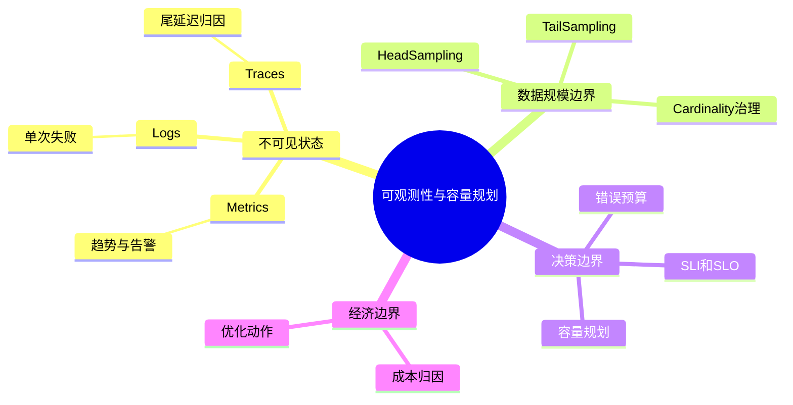

# 第21章：可观测性与容量规划

> 看不见的系统，迟早会变成靠运气维护的系统；而看得见但解释不了的系统，依然不算真正可观测。

> **关联章节**：本章提供灰度、回滚和事故响应所依赖的证据面。如果没有这些信号，[第22章](./22-evaluation-release-and-incident.md) 的发布门禁和事故决策就会失去依据。

## 1. 第一性原理拆解 + 学习大纲

### 拆 — 不可化简的问题

把 Prometheus、Grafana、OpenTelemetry、Jaeger、DCGM、SLO 这些工具名拿掉，本章的不可化简问题只有一个：AI 系统把昂贵资源、随机负载和不完全可预测的模型行为压缩成用户看到的一次响应，工程师必须在响应变坏之前知道哪里偏离、为什么偏离、会烧掉多少可靠性和成本余量。训练会被一个慢 worker 拖住整组 GPU，推理会被少量超长 prompt 撑满 KV Cache，RAG 会因为检索抖动让 LLM 看起来“变慢”，灰度会因为质量退化但延迟正常而误判成功。它们的共同点不是“缺监控面板”，而是系统内部状态不能被单个指标直接观察。

可观测性不是把所有事件全量存下来。全量存储会撞上三个硬边界：tokens/s、requests/s、训练 step 事件和 GPU 指标形成吞吐压力；tenant、model_version、adapter_id、trace_id、job_id 等维度组合制造 cardinality 爆炸；日志、trace、指标的存储和查询本身也会消耗预算。容量规划也不是简单问“需要几张 GPU”，而是把流量分布、token 长度、SLO、错误预算、发布窗口、故障冗余和成本归因放进同一张账本。看不见的系统会变成靠运气维护的系统；看得见但不能解释成本和风险的系统，也不算真正可观测。

### 推 — 从这个问题如何推导出每个机制

如果系统状态不能直接观察，第一步必然是选择信号。Metrics 用低成本聚合回答“趋势是否异常”，Logs 用结构化字段回答“这次请求发生了什么”，Traces 用跨服务上下文回答“时间花在链路哪一段”。三类信号要靠 request_id、trace_id、tenant_id、model_version、job_id 关联，否则只有 GPU utilization，看不出 queue wait；只有错误日志，看不出 SLO burn；只有 trace，看不出容量趋势。

信号一旦被采集，就会推导出采样和 cardinality 治理。全量 trace 最有解释力，但成本不可控；head-based sampling 成本稳定，却可能错过慢请求；tail-based sampling 能保留错误和尾延迟，却要求 Collector 缓冲完整链路。维度越细，定位越快，但把 user_id、prompt_hash、trace_id 放进 metrics label 会让时间序列按请求级爆炸。因此必须提前定义哪些字段允许做 metrics label，哪些只能进入日志或 trace attribute，哪些必须 hash、截断或脱敏。

当信号可以解释当前状态后，下一步是把状态变成决策边界。SLI/SLO 把“好请求”的定义写清楚，错误预算把可靠性余量量化，burn-down 暴露预算消耗速度。AI 服务还必须同时看质量和成本：99.99% 可用、P95 达标，但 grounded rate 下降或 cost_per_1k_tokens 翻倍，业务仍然失败。容量规划把边界反推成资源需求；成本归因把总账拆回 tenant、model、region、endpoint、job。

### 绘 — 因果链路



### 导 — 读完本章你应该能回答

1. P99 延迟升高且 GPU utilization 很高时，如何区分“模型计算慢”“队列排队长”和“上游链路慢”？
2. 为什么 metrics label 不能随意加入 `user_id`、`prompt_hash`、`trace_id`？
3. head-based sampling 和 tail-based sampling 分别会错过什么证据？
4. 一个 AI 服务的 SLO 为什么不能只有 availability 和 latency，还要包含质量与成本指标？
5. 错误预算 burn-down 如何影响发布、扩容、回滚和限流决策？
6. 如何用 QPS、平均 token、单 GPU tokens/s 和目标利用率做第一版 GPU 容量估算？
7. 成本归因为什么必须绑定 tenant、model_version、endpoint、region 等维度？

## 2. 正文内容

### 21.1 可观测性不只是监控面板

一个成熟的可观测系统至少能回答三类问题：

1. **发生了什么**：哪个指标、哪个租户、哪个模型异常
2. **为什么发生**：是上游流量变化、资源饱和、调度问题还是模型版本变更
3. **接下来怎么办**：扩容、回滚、限流、降级还是继续观察

因此，可观测性不是“把指标都采上来”，而是让系统证据足够支持诊断。

### 21.2 三种主要观测信号

#### 21.2.1 Metrics

适合回答：

- 当前系统是否在偏离正常范围
- 趋势是上升还是下降
- 是否应该触发告警或扩容

典型指标包括：

- GPU 利用率
- 显存占用
- queue wait time
- tokens/s
- P95 / P99 latency
- 请求错误率

#### 21.2.2 Logs

适合回答：

- 这次失败到底是哪一步出错
- 哪个模型版本在服务这个请求
- 某次作业为什么退出

日志的关键不是多，而是可关联：

- request_id
- trace_id
- model_version
- tenant_id
- job_id

#### 21.2.3 Traces

在 AI 系统中，trace 特别适合多段链路：

```text
网关 -> 鉴权 -> embedding -> 向量检索 -> rerank -> LLM -> 安全过滤
```

如果没有 trace，很多尾延迟问题会被粗暴归到“模型太慢”，而真正慢的可能是检索或上游回源。

> 延伸阅读：本章更关注 AI 系统里的可观测性职责与容量规划。如果你想系统理解 traces、metrics、logs、Collector、上下文传播以及生产治理，可继续阅读 [OpenTelemetry 教程](../../opentelemetry-tutorial/README.md)，尤其是 [三种信号与 OTel 架构](../../opentelemetry-tutorial/part1-foundations/02-signals-and-architecture.md)、[Logs 与跨信号关联](../../opentelemetry-tutorial/part3-metrics-logs-and-semantics/08-logs-and-cross-signal-correlation.md) 和 [Cardinality、成本与性能](../../opentelemetry-tutorial/part6-production-operations/16-cardinality-cost-and-performance.md)。

#### 21.2.4 日志与 Trace 采样策略

AI 链路常常又长、又贵、又高基数。一次 RAG 请求可能经过 gateway、auth、embedding、vector search、rerank、LLM prefill、decode、安全过滤和计费。全量留痕最理想，但在高吞吐线上系统里通常不可持续。

| 策略 | 决策时机 | 适合场景 | 代价 / 风险 |
|------|------------|----------|-------------|
| Head-based sampling | 请求入口处决定 | 高吞吐稳定路径、成本敏感服务 | 成本可预测，但可能漏掉慢请求和偶发错误 |
| Tail-based sampling | 链路结束或超时后决定 | 错误请求、P99 慢请求、关键发布窗口 | 诊断价值高，但 Collector 内存、CPU 和网络成本更高 |
| Adaptive sampling | 按租户、endpoint、错误率动态调整 | 流量峰谷明显或多租户平台 | 规则复杂，统计口径会变化 |
| Log sampling / 分级 | 按事件级别和字段保留 | 高频 INFO、低频 WARN/ERROR、审计日志 | 缺少 `trace_id` 时仍难关联 |

平台实践里更常见的是：入口默认 1%-5% head-based trace；`5xx`、超时、P99 以上请求和新模型灰度流量进入 tail-based 保留；审计、安全、计费日志不采样但做字段裁剪。

**工程边界**：采样不能作为财务、审计和安全证据的唯一来源；采样 trace 不能直接计算真实错误率或延迟分位数，真实 SLI 应来自请求计数器和 latency histogram。tail-based Collector 必须有内存、队列和降级上限。

#### 21.2.5 Cardinality 治理：维度不是越细越好

Cardinality 指标签或字段可能出现多少不同取值。常见错误是把“定位时有用的字段”全部放进 metrics label。Metrics 通常按标签组合生成时间序列，序列数近似等于各维度取值数量的乘积。

| 指标设计 | 维度取值示例 | 风险 |
|----------|--------------|------|
| `llm_request_latency{tenant,model,endpoint}` | 200 × 20 × 30 = 120,000 序列 | 需要容量评估 |
| 再加入 `status_code,region` | × 6 × 5 = 3,600,000 序列 | 存储和查询压力明显上升 |
| 再加入 `user_id` | × 1,000,000 users | 请求级爆炸 |
| 再加入 `trace_id` | 每请求近似唯一 | metrics 退化成昂贵日志系统 |

治理原则是分层：低基数字段放在 metrics label，如 `tenant_tier`、`model_family`、`endpoint`、`region`、`status_class`；中高基数字段放在 logs/traces attribute，如 `tenant_id`、`model_version`、`adapter_id`、`job_id`；请求唯一字段如 `request_id`、`trace_id` 只用于关联。

**工程边界**：告警和容量面板应基于低基数、稳定口径的指标；事故排查再通过 exemplars、trace_id 和日志下钻。新增 metrics label 应评审取值数、增长和保留周期。

### 21.3 AI 系统应该看哪些指标

#### 21.3.1 资源面

- GPU utilization
- GPU memory used
- CPU / memory
- network tx/rx
- disk / object storage throughput

#### 21.3.2 任务面

- step time
- dataloader time
- all-reduce time
- queue length
- pending jobs
- checkpoint duration

#### 21.3.3 服务面

- requests/s
- tokens/s
- active sequences
- prefill latency
- decode throughput
- cache hit ratio

#### 21.3.4 业务 / 质量面

- 离线评测指标
- 线上反馈分数
- 召回 / 重排质量
- 人工审核通过率
- 成本 / 请求

这最后一层很关键。AI 服务即使资源和延迟都正常，也可能因为模型行为退化而业务失败。

#### 21.3.5 GPU 监控指标详解

GPU 监控最容易被误用的地方，是把“GPU 忙”直接等同于“系统健康”。不同指标回答的是不同问题。

| 指标 | 它回答什么 | 常见误读 | 更适合从哪里拿 |
|------|------------|----------|----------------|
| GPU Utilization | SM 是否在忙、设备是否有持续计算 | 高利用率就一定代表吞吐高 | `nvidia-smi` 快速排障，DCGM Exporter 长期采集 |
| GPU Memory Utilization | 显存是否接近容量上限 | 显存高就一定表示计算充分 | `nvidia-smi`、DCGM |
| SM Occupancy | 单个 kernel 对 SM 资源的填充效率 | 低 occupancy 就一定是坏事 | Profiler、Nsight，更适合性能分析 |

`nvidia-smi` 适合登录节点后快速判断“设备现在发生了什么”；DCGM Exporter 更适合把 GPU 指标长期送进 Prometheus / Grafana，让第22章的灰度和回滚规则有稳定证据源（详见 [第22章](./22-evaluation-release-and-incident.md) §22.3）。

### 21.4 一个最小 SLI / SLO 框架

例如，一个问答服务可以定义：

```yaml
slis:
  availability_ratio: successful_requests / total_requests
  p95_latency_ms: observed end-to-end p95 latency
  answer_grounded_rate: grounded_answers / sampled_answers
  cost_per_1k_tokens_usd: total_cost_usd / (processed_tokens / 1000)
slo:
  availability_ratio: ">= 99.9%"
  p95_latency_ms: "<= 2500"
  answer_grounded_rate: ">= 0.90"
  cost_per_1k_tokens_usd: "<= 0.35"
```

这个例子体现出 AI 系统和普通服务的差异：

- 不仅有可用性和延迟
- 还有质量与成本目标

如果只有系统 SLO 没有质量 SLO，平台很容易把“快速返回错误答案”误当成成功。

### 21.4.1 错误预算 burn-down

SLO 的价值不在于写出 “99.9%”，而在于把可靠性余量变成可执行规则。30 天 availability SLO 为 99.9% 时，错误预算是 0.1%，约 43.2 分钟不可用时间。如果 6 小时内因新模型版本不可用 12 分钟，就烧掉 27.8% 月预算。

| 信号 | 含义 | 典型动作 |
|------|------|----------|
| 30 天预算剩余 < 25% | 本月余量不足 | 冻结非必要发布 |
| 6 小时 burn rate > 2x | 预算消耗过快 | 降低灰度比例 |
| 1 小时 burn rate > 10x | 快速事故 | 回滚、限流或降级 |
| 质量 SLO burn-down | grounded rate 等下降 | 暂停模型/Prompt 发布 |
| 成本 SLO burn-down | cost_per_1k_tokens 超预算 | 收紧上下文、启用缓存或配额 |

AI 服务还要把预算扩展到质量与成本：灰度可能没有 `5xx`，但 grounded rate 从 0.92 降到 0.84；agent 发布可能成功率不变，但工具调用次数翻倍。

**工程边界**：错误预算不能替代事故判断。低流量服务需要最小样本数门槛；质量 SLO 依赖采样评测；成本 burn-down 受账单延迟影响。预算规则要和 [第22章](./22-evaluation-release-and-incident.md) 的灰度、回滚和事故流程绑定。

### 21.5 容量规划：把流量和资源联系起来

容量规划的核心问题是：

> 给定目标流量、目标延迟和模型特性，需要多少资源以及多少余量？

### 一个常见近似方法

假设某模型单 GPU 的稳定吞吐约为 $R$ tokens/s，请求平均 token 总量为 $T_{avg}$，目标 QPS 为 $Q$，则所需 GPU 数量近似为：

$$
\text{gpus required} \approx \frac{Q \times T_{avg}}{R \times \text{target utilization}}
$$

这个近似只适合先做数量级判断。对 LLM serving，尤其是长 prompt、RAG、多峰长度分布和 agent 场景，更稳妥的做法是把 prefill 与 decode 分开建模，因为两者受算力、显存和并发约束的方式并不相同。

例如：

- 平均每请求 1200 token
- 目标 20 QPS
- 单 GPU 稳定输出 12000 tokens/s
- 目标利用率不超过 70%

则：

$$
\frac{20 \times 1200}{12000 \times 0.7} \approx 2.86
$$

即至少需要 3 张 GPU，而且这还没算冗余和峰值抖动。

### 为什么要留余量

如果你把容量设计到刚好够平均流量，一旦出现：

- 上下文长度上升
- 冷门大请求集中到来
- 某个副本故障
- 上游检索抖动造成排队

P95 / P99 很快就会失控。

> **参考数量级（仅供建立直觉，实际值因模型、SLA 和流量分布差异较大）**
>
> | 场景 | 典型值 | 说明 |
> |------|--------|------|
> | 交互式 LLM 服务稳态 GPU 利用率目标 | 55%-75% | 留出尾延迟和突发余量，避免把系统压到极限 |
> | 交互式服务稳态显存水位 | 70%-85% | 过高会让长上下文或 batch 波动更容易触发 OOM |
> | 默认 Trace 采样比例 | 1%-10% | 常见于高吞吐线上路径，事故期通常临时拉高 |
> | 关键发布窗口额外容量余量 | 20%-30% | 给灰度、单节点故障和临时回滚留空间 |

### 21.6 常见可观测性误区

**误区一：GPU 利用率高就说明系统健康。**  
不对。可能队列很长，用户已经在排队等待。

**误区二：指标很多就说明可观测。**  
不对。没有 request_id / tenant_id / model_version 关联，很多指标没有解释力。

**误区三：容量规划只看平均流量。**  
不对。AI 业务对长度分布、峰值突发、故障余量都很敏感。

### 21.7 建议的最小 dashboard

一个 LLM / RAG 服务最小可用面板至少可以包含：

1. 请求量与 token 量
2. P50 / P95 / P99 延迟
3. queue wait time
4. GPU 利用率与显存占用
5. active sequences / batch tokens
6. cache hit ratio
7. 成本 / 请求或成本 / 1k tokens
8. 关键质量指标

如果这 8 类数据能按 tenant、model_version、region 维度切开，诊断效率会高很多。

### 21.8 成本归因：把平台总账拆回工程动作

容量规划最后必须落到成本归因，否则团队只知道“GPU 很贵”，不知道该优化谁、限制谁、迁移谁。AI 平台成本至少应拆成 GPU 计算、CPU/内存控制面、网络、存储与对象请求、观测数据自身成本。推理服务还应按 prompt tokens、output tokens、KV cache、batch 等待、空闲副本拆分。

| 归因维度 | 适合回答的问题 | 注意事项 |
|----------|----------------|----------|
| `tenant_id` / `team` | 哪个团队消耗最多预算 | 避免进入高频 metrics label |
| `model_family` / `model_version` | 哪个模型版本成本异常 | 高基数版本放离线明细 |
| `endpoint` / `workflow` | 哪条业务链路最贵 | RAG、agent、chat 分开看 |
| `region` / `cluster` | 是否受地域和碎片影响 | 结合 GPU 型号和折扣 |
| `request_shape` | 长 prompt、长输出是否失控 | 用 bucket，不用原始输入 |

成本指标可以从 `gpu_seconds * gpu_price_per_second`、`prompt_tokens * input_price + output_tokens * output_price` 推导出 `cost_per_1k_tokens` 和 `idle_gpu_cost`。成本归因要连接工程动作：某 tenant 的长上下文请求占 60% 成本，就设置 context bucket 配额；某模型版本 cost_per_1k_tokens 上升 35%，就检查 speculative decoding、prefix cache、batch 参数和输出长度。

**工程边界**：在线成本通常是估算，不等于云账单或财务结算；归因维度必须和 cardinality 治理一致，高基数字段进入离线明细或账单流水，不进入 Prometheus 热路径；共享成本需要明确分摊规则。

## 本章涉及的常见工具

| 概念 | 常见工具 / 命令 | 备注 |
|------|-----------------|------|
| GPU 指标采集 | DCGM Exporter、`nvidia-smi` | 前者适合长期监控，后者适合现场排障 |
| 统一埋点与 Trace | OpenTelemetry、OTel Collector | 适合把 metrics / logs / traces 串成统一上下文 |
| 面板与告警 | Prometheus、Grafana、Alertmanager | 用于 SLI / SLO、容量和灰度告警 |
| 链路追踪 | Jaeger、Tempo | 适合定位多段链路尾延迟 |

---

## 本章小结

| 主题 | 关键点 |
|------|--------|
| 可观测性 | 不只是“看到异常”，还要能解释与决策 |
| 指标体系 | 要覆盖资源、任务、服务、质量、成本五层 |
| SLO | AI 服务不能只有延迟和可用性，还应包含质量目标 |
| 容量规划 | 必须把流量、token 分布、GPU 吞吐和冗余一起考虑 |

## 练习题

1. 为什么 GPU 利用率高不一定代表用户体验好？
2. 设计一个推理服务的最小指标面板。
3. 容量规划时为什么要考虑故障冗余？
4. 如果平均流量稳定，但 P99 延迟突然恶化，你会优先看哪些指标关联？
