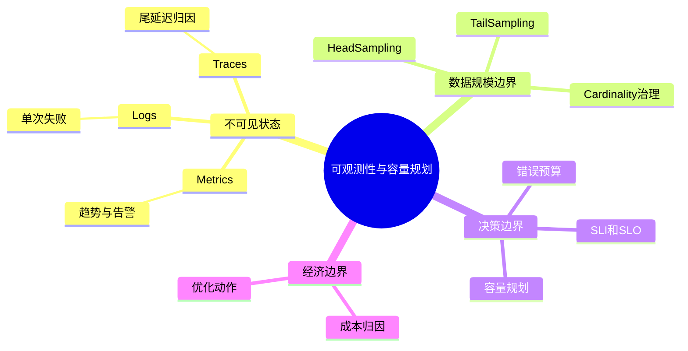
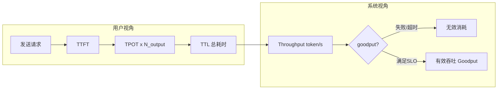
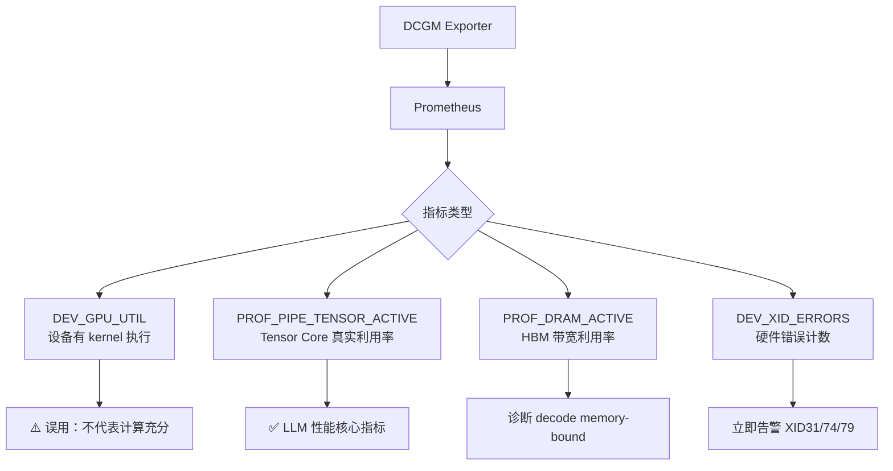
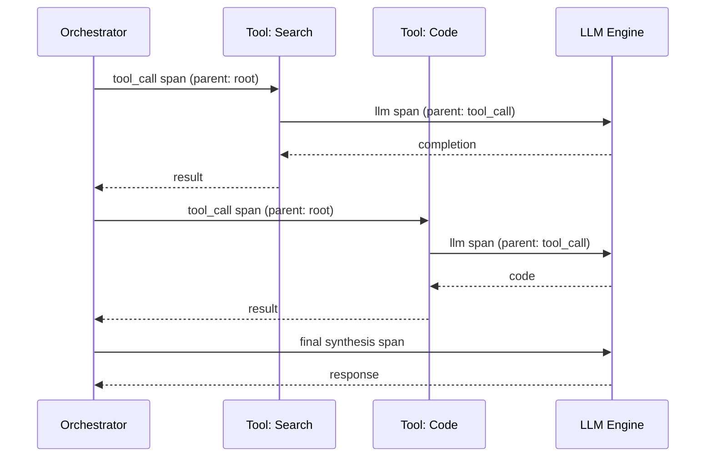
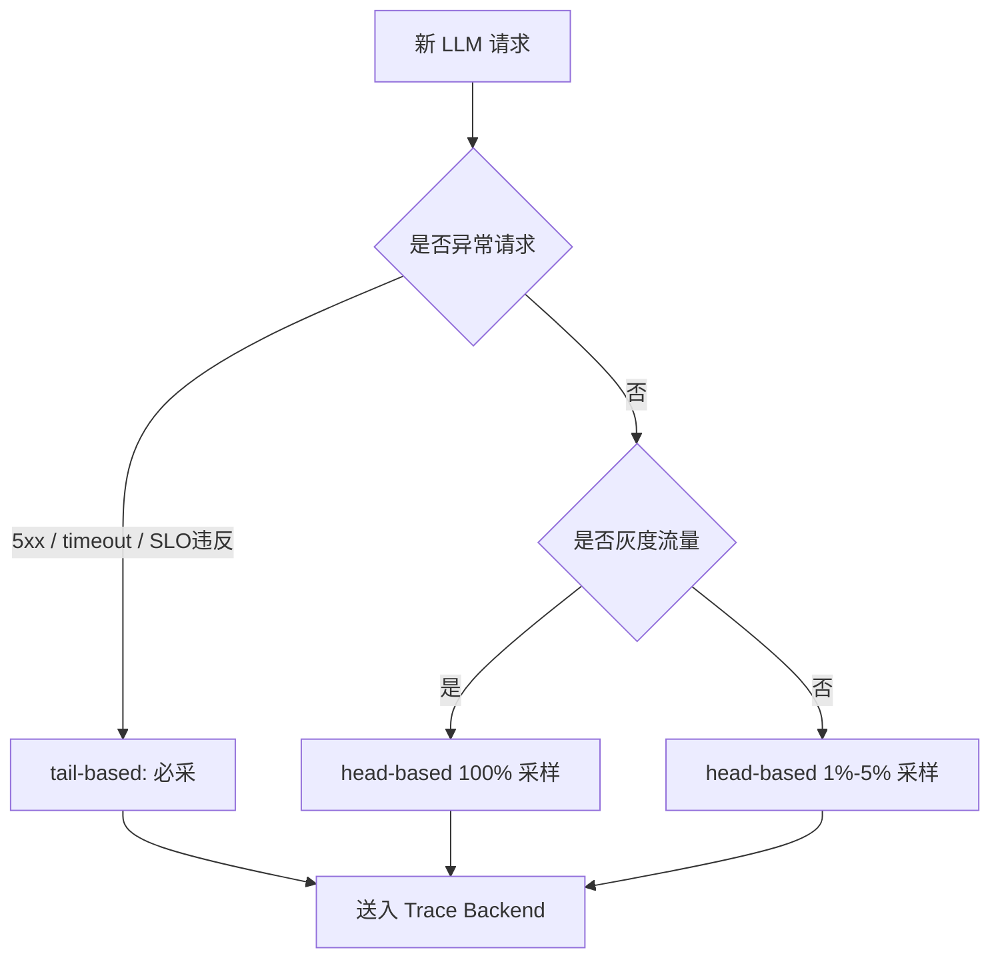
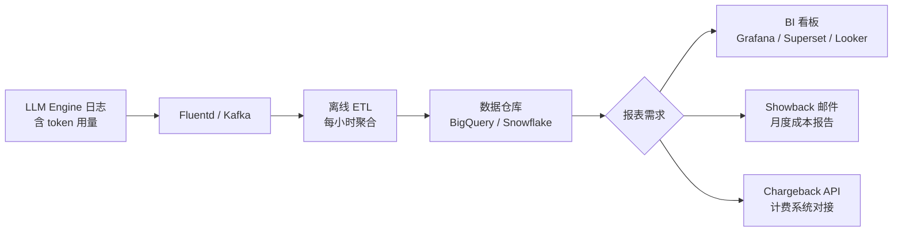
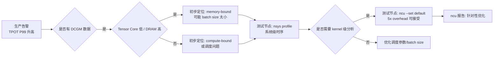
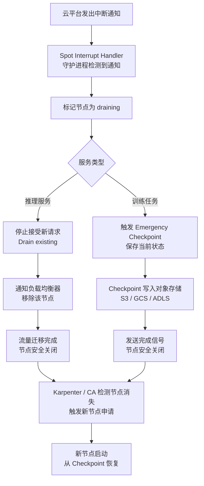
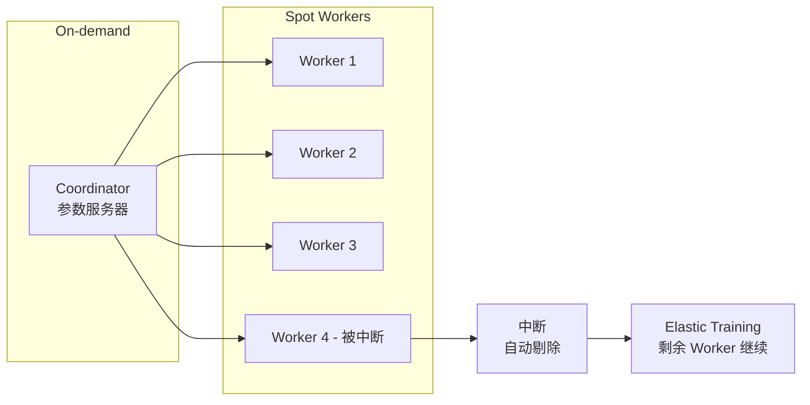

# 第21章：可观测性与容量规划

> 看不见的系统，迟早会变成靠运气维护的系统；而看得见但解释不了的系统，依然不算真正可观测。

> **关联章节**：本章提供灰度、回滚和事故响应所依赖的证据面。如果没有这些信号，[第22章](./22-evaluation-release-and-incident.md) 的发布门禁和事故决策就会失去依据。

## 1. 第一性原理拆解 + 学习大纲

### 拆 — 不可化简的问题

把 Prometheus、Grafana、OpenTelemetry、Jaeger、DCGM、SLO 这些工具名拿掉，本章的不可化简问题只有一个：AI 系统把昂贵资源、随机负载和不完全可预测的模型行为压缩成用户看到的一次响应，工程师必须在响应变坏之前知道哪里偏离、为什么偏离、会烧掉多少可靠性和成本余量。训练会被一个慢 worker 拖住整组 GPU，推理会被少量超长 prompt 撑满 KV Cache，RAG 会因为检索抖动让 LLM 看起来“变慢”，灰度会因为质量退化但延迟正常而误判成功。它们的共同点不是“缺监控面板”，而是系统内部状态不能被单个指标直接观察。

可观测性不是把所有事件全量存下来。全量存储会撞上三个硬边界：tokens/s、requests/s、训练 step 事件和 GPU 指标形成吞吐压力；tenant、model_version、adapter_id、trace_id、job_id 等维度组合制造 cardinality 爆炸；日志、trace、指标的存储和查询本身也会消耗预算。容量规划也不是简单问“需要几张 GPU”，而是把流量分布、token 长度、SLO、错误预算、发布窗口、故障冗余和成本归因放进同一张账本。看不见的系统会变成靠运气维护的系统；看得见但不能解释成本和风险的系统，也不算真正可观测。

### 推 — 从这个问题如何推导出每个机制

如果系统状态不能直接观察，第一步必然是选择信号。Metrics 用低成本聚合回答“趋势是否异常”，Logs 用结构化字段回答“这次请求发生了什么”，Traces 用跨服务上下文回答“时间花在链路哪一段”。三类信号要靠 request_id、trace_id、tenant_id、model_version、job_id 关联，否则只有 GPU utilization，看不出 queue wait；只有错误日志，看不出 SLO burn；只有 trace，看不出容量趋势。

信号一旦被采集，就会推导出采样和 cardinality 治理。全量 trace 最有解释力，但成本不可控；head-based sampling 成本稳定，却可能错过慢请求；tail-based sampling 能保留错误和尾延迟，却要求 Collector 缓冲完整链路。维度越细，定位越快，但把 user_id、prompt_hash、trace_id 放进 metrics label 会让时间序列按请求级爆炸。因此必须提前定义哪些字段允许做 metrics label，哪些只能进入日志或 trace attribute，哪些必须 hash、截断或脱敏。

当信号可以解释当前状态后，下一步是把状态变成决策边界。SLI/SLO 把“好请求”的定义写清楚，错误预算把可靠性余量量化，burn-down 暴露预算消耗速度。AI 服务还必须同时看质量和成本：99.99% 可用、P95 达标，但 grounded rate 下降或 cost_per_1k_tokens 翻倍，业务仍然失败。容量规划把边界反推成资源需求；成本归因把总账拆回 tenant、model、region、endpoint、job。

### 绘 — 因果链路



### 导 — 读完本章你应该能回答

1. P99 延迟升高且 GPU utilization 很高时，如何区分“模型计算慢”“队列排队长”和“上游链路慢”？
2. 为什么 metrics label 不能随意加入 `user_id`、`prompt_hash`、`trace_id`？
3. head-based sampling 和 tail-based sampling 分别会错过什么证据？
4. 一个 AI 服务的 SLO 为什么不能只有 availability 和 latency，还要包含质量与成本指标？
5. 错误预算 burn-down 如何影响发布、扩容、回滚和限流决策？
6. 如何用 QPS、平均 token、单 GPU tokens/s 和目标利用率做第一版 GPU 容量估算？
7. 成本归因为什么必须绑定 tenant、model_version、endpoint、region 等维度？

## 2. 正文内容

### 21.1 可观测性不只是监控面板

一个成熟的可观测系统至少能回答三类问题：

1. **发生了什么**：哪个指标、哪个租户、哪个模型异常
2. **为什么发生**：是上游流量变化、资源饱和、调度问题还是模型版本变更
3. **接下来怎么办**：扩容、回滚、限流、降级还是继续观察

因此，可观测性不是“把指标都采上来”，而是让系统证据足够支持诊断。

### 21.2 三种主要观测信号

#### 21.2.1 Metrics

适合回答：

- 当前系统是否在偏离正常范围
- 趋势是上升还是下降
- 是否应该触发告警或扩容

典型指标包括：

- GPU 利用率
- 显存占用
- queue wait time
- tokens/s
- P95 / P99 latency
- 请求错误率

#### 21.2.2 Logs

适合回答：

- 这次失败到底是哪一步出错
- 哪个模型版本在服务这个请求
- 某次作业为什么退出

日志的关键不是多，而是可关联：

- request_id
- trace_id
- model_version
- tenant_id
- job_id

#### 21.2.3 Traces

在 AI 系统中，trace 特别适合多段链路：

```text
网关 -> 鉴权 -> embedding -> 向量检索 -> rerank -> LLM -> 安全过滤
```

如果没有 trace，很多尾延迟问题会被粗暴归到“模型太慢”，而真正慢的可能是检索或上游回源。

> 延伸阅读：本章更关注 AI 系统里的可观测性职责与容量规划。如果你想系统理解 traces、metrics、logs、Collector、上下文传播以及生产治理，可继续阅读 [OpenTelemetry 教程](../../opentelemetry-tutorial/README.md)，尤其是 [三种信号与 OTel 架构](../../opentelemetry-tutorial/part1-foundations/02-signals-and-architecture.md)、[Logs 与跨信号关联](../../opentelemetry-tutorial/part3-metrics-logs-and-semantics/08-logs-and-cross-signal-correlation.md) 和 [Cardinality、成本与性能](../../opentelemetry-tutorial/part6-production-operations/16-cardinality-cost-and-performance.md)。

#### 21.2.4 日志与 Trace 采样策略

AI 链路常常又长、又贵、又高基数。一次 RAG 请求可能经过 gateway、auth、embedding、vector search、rerank、LLM prefill、decode、安全过滤和计费。全量留痕最理想，但在高吞吐线上系统里通常不可持续。

| 策略 | 决策时机 | 适合场景 | 代价 / 风险 |
|------|------------|----------|-------------|
| Head-based sampling | 请求入口处决定 | 高吞吐稳定路径、成本敏感服务 | 成本可预测，但可能漏掉慢请求和偶发错误 |
| Tail-based sampling | 链路结束或超时后决定 | 错误请求、P99 慢请求、关键发布窗口 | 诊断价值高，但 Collector 内存、CPU 和网络成本更高 |
| Adaptive sampling | 按租户、endpoint、错误率动态调整 | 流量峰谷明显或多租户平台 | 规则复杂，统计口径会变化 |
| Log sampling / 分级 | 按事件级别和字段保留 | 高频 INFO、低频 WARN/ERROR、审计日志 | 缺少 `trace_id` 时仍难关联 |

平台实践里更常见的是：入口默认 1%-5% head-based trace；`5xx`、超时、P99 以上请求和新模型灰度流量进入 tail-based 保留；审计、安全、计费日志不采样但做字段裁剪。

**工程边界**：采样不能作为财务、审计和安全证据的唯一来源；采样 trace 不能直接计算真实错误率或延迟分位数，真实 SLI 应来自请求计数器和 latency histogram。tail-based Collector 必须有内存、队列和降级上限。

#### 21.2.5 Cardinality 治理：维度不是越细越好

Cardinality 指标签或字段可能出现多少不同取值。常见错误是把“定位时有用的字段”全部放进 metrics label。Metrics 通常按标签组合生成时间序列，序列数近似等于各维度取值数量的乘积。

| 指标设计 | 维度取值示例 | 风险 |
|----------|--------------|------|
| `llm_request_latency{tenant,model,endpoint}` | 200 × 20 × 30 = 120,000 序列 | 需要容量评估 |
| 再加入 `status_code,region` | × 6 × 5 = 3,600,000 序列 | 存储和查询压力明显上升 |
| 再加入 `user_id` | × 1,000,000 users | 请求级爆炸 |
| 再加入 `trace_id` | 每请求近似唯一 | metrics 退化成昂贵日志系统 |

治理原则是分层：低基数字段放在 metrics label，如 `tenant_tier`、`model_family`、`endpoint`、`region`、`status_class`；中高基数字段放在 logs/traces attribute，如 `tenant_id`、`model_version`、`adapter_id`、`job_id`；请求唯一字段如 `request_id`、`trace_id` 只用于关联。

**工程边界**：告警和容量面板应基于低基数、稳定口径的指标；事故排查再通过 exemplars、trace_id 和日志下钻。新增 metrics label 应评审取值数、增长和保留周期。

#### 21.2.6 Prometheus TSDB 与 cardinality 的实际成本

章节强调 cardinality 治理，但**Prometheus 内部为什么对 cardinality 敏感**没讲清。理解 TSDB 工作机制，才能解释 "10 万 series 还行、100 万 series 卡死" 的边界。

**Prometheus 数据模型**：每个唯一 `(metric_name, label_set)` 组合是一条 **time series**。TSDB 给每条 series 分配独立的 in-memory chunk（active chunk，2 小时一切）+ 落盘 block 索引。

```text
http_request_duration_seconds_bucket{method="POST", path="/v1/chat", status="200", le="0.1"} 1234
                                    └────────────── label set ──────────────────────┘
                                       这一组是一条 series

如果 path 取值有 1000 种、status 6 种、method 4 种、le 10 种:
  series 总数 = 1 (metric) × 1000 × 6 × 4 × 10 = 240,000 条
```

**每条 series 的成本**：

- **Active memory**：~1-2 KB（最近 chunk + 索引）。100 万 series ≈ 1-2 GB 内存。
- **Disk**：每 2 小时 flush 一个 block（含索引 + chunks）；series 多 = block 索引大 = compaction 耗时长。
- **Query cost**：PromQL 查询要扫所有匹配 series 的 chunks。`rate(metric{}[5m])` 对 240K series 比 24K series 慢 ~10x。

**Pull-based scrape 模型**：

```text
Prometheus 每 15s（默认 scrape_interval）主动拉每个 target 的 /metrics
  ↓
HTTP GET http://target:9090/metrics
  ↓
解析 exposition format（每行一条样本）
  ↓
更新 in-memory series store
  ↓
每 2h flush 到 disk block
```

**为什么 pull 而不是 push**：

- Prometheus 主动控制采集速率，target 慢不会拖垮 Prometheus。
- Target 健康可由 `up{}` metric 判断（pull 失败时 up=0）。
- target 不需要知道 Prometheus 在哪——靠 service discovery（K8s SD、DNS、Consul、static config）。

**例外**：短生命周期 batch job 来不及被 scrape，用 **Pushgateway** 推一次。但 Pushgateway 是反模式不能滥用——长期运行的服务一律 pull。

**Prometheus 单机的实际限制**：

| 维度 | 健康范围 | 危险阈值 |
|---|---|---|
| Active series | < 5M | > 10M（OOM 风险）|
| Ingestion rate | < 500K samples/s | > 1M samples/s |
| Query latency P99 | < 5s | > 30s（用户感知卡）|
| Retention | 15-30 天 | > 90 天（block 过多影响 compaction）|
| 内存 | 2-32 GB | > 64 GB（GC 抖动）|

**HA 与长期存储**：

单机 Prometheus 是 SPOF（数据 + 查询）。生产用 **Thanos** / **Cortex** / **Mimir**：

- **Thanos sidecar 模式**：每个 Prometheus 旁边跑 sidecar，把 2h 落盘的 block 上传到 S3/GCS；查询通过 Thanos Querier 跨多个 Prometheus + 对象存储；compactor 在对象存储上做 downsampling（5min/1h 粒度）。Prometheus 仍保留本地 retention（15d）；长期数据在对象存储。
- **Cortex / Mimir**：horizontally scalable Prometheus-compatible TSDB；ingester（接收 + 内存）/ store-gateway（查询 + 对象存储）/ compactor / querier 各自独立扩。比 Thanos 复杂但 cardinality 上限高。
- **VictoriaMetrics**：另一种实现，单二进制，按 cluster mode 横向扩；通常资源消耗比 Cortex 低。

**Cardinality 诊断**：

```promql
# 找出 cardinality 最高的 metric
topk(20, count by(__name__)({__name__=~".+"}))

# 某 metric 内 cardinality 最高的 label
topk(20, count by(<label>)({__name__="<metric>"}))

# 看 Prometheus 自己的状态
prometheus_tsdb_head_series           # 当前 active series
prometheus_tsdb_head_chunks            # active chunks
prometheus_tsdb_symbol_table_size_bytes  # symbol table 内存
rate(prometheus_tsdb_head_samples_appended_total[5m])  # 摄入速率
```

**Prometheus 与 OpenTelemetry Metrics 的关系**：

- Prometheus 原生用 exposition format（pull）。
- OTel 用 OTLP 协议（push）。
- **Prometheus Remote Write**：让 OTel SDK 把 metrics push 到 Prometheus（需 Prometheus enable `--web.enable-remote-write-receiver`）。
- **OTel Collector + Prometheus exporter**：让 OTel 数据通过 Collector 暴露成 Prometheus 格式，Prometheus 来 pull。

#### 21.2.7 Histogram 与 histogram_quantile() 的实际机制

章节用了大量 P99 latency 但**histogram_quantile 怎么算、bucket 怎么选**没讲。这是 senior 必须懂的——bucket 选错时 P99 误差可达 5-10x。

**Classic histogram 在 Prometheus 中的存储**：

```text
http_duration_seconds_bucket{le="0.005"}  100      # ≤ 5ms 累积
http_duration_seconds_bucket{le="0.01"}   120      # ≤ 10ms（含上面 100）
http_duration_seconds_bucket{le="0.05"}   150
http_duration_seconds_bucket{le="0.1"}    165
http_duration_seconds_bucket{le="0.5"}    180
http_duration_seconds_bucket{le="+Inf"}   200      # 所有样本
http_duration_seconds_sum                 12.5
http_duration_seconds_count               200

注意：每个 bucket 是一条独立 series（cumulative count）。
N 个 bucket 边界 = N+1 条 series（含 +Inf）。
```

**`histogram_quantile(0.99, rate(http_duration_seconds_bucket[5m]))` 算法**：

```text
1. 算每个 bucket 的 rate（5min 窗口内每秒增量）
2. 找 cumulative_count >= 0.99 × total_count 的最小 bucket
3. 在该 bucket 内做线性插值：
   - 假设 bucket 内样本均匀分布
   - bucket [l, u] 内有 m 个样本，目标位置在第 k 个
   - 返回 l + (u-l) × k/m
```

**关键陷阱：bucket 选错时误差巨大**

假设真实 P99 = 80ms，但 bucket 边界是 `[0.005, 0.01, 0.05, 0.5]`：

```text
total = 200, 99th = 198
cumulative: 100, 120, 150, 180, 200
198 落在 [0.5, +Inf] bucket
→ 必须返回 +Inf 或回退到 0.5

如果 bucket 加密到 [0.005, 0.01, 0.05, 0.1, 0.2, 0.5]:
假设 cumulative: 100, 120, 150, 165, 195, 200
198 落在 [0.2, 0.5] 内，线性插值：0.2 + (0.5-0.2) × 3/5 = 0.38s
→ P99 估算 380ms（远偏离真实 80ms！）

如果 bucket 在 80ms 附近密集 [0.05, 0.075, 0.1, 0.125, 0.15]:
更准确，误差 < 20%
```

**bucket 选择规则**：

- **必须围绕 SLO 目标密集**：守 100ms P99 SLO，bucket 必须有 80/100/125/160ms。
- **跨数量级用对数尺度**：`[0.005, 0.01, 0.025, 0.05, 0.1, 0.25, 0.5, 1, 2.5, 5, 10]` 是 Prometheus 默认。
- **覆盖最大值**：`+Inf` 是最后一个 bucket；如果 +Inf 装了 1% 以上数据，P99 不可估（直接返回前一 bucket 上界）。
- **bucket 数量取舍**：每个 bucket 是一条 series，10 个 bucket = 10× cardinality。控制在 8-15 个。

**精度盲区**：

- **样本量 < 1000**：P99 不可信（< 100 是噪声）。
- **`+Inf` bucket 装 1% 以上**：P99 一定不准。
- **bucket 边界粒度粗于真实分布**：插值假设均匀但真实是双峰时错。

**Native histograms（Prometheus 2.40+ 实验性）**：

- 自适应 bucket（指数 schema），不需要预定义 le。
- bucket 数动态，精度自适应（典型 ε < 1%）。
- 单个 series 存所有 bucket 信息（不再每 bucket 一条 series），cardinality 大幅下降。
- 兼容性问题：旧 Grafana / Prometheus 不支持，生产采用前要全栈升级。

**生产建议**：

- 业务关键 SLO metric 必须自定义 bucket，不要用客户端库默认值。
- Prometheus 2.40+ 集群可以新 metric 用 native histogram，旧 metric 维持 classic。
- Grafana 面板的 P99 panel 要看 bucket 是否合理——常见错误是用默认 bucket 监控 sub-millisecond latency。

#### 21.2.8 OpenTelemetry Collector 内部架构

章节用 tail-based sampling 但**Collector 怎么实现**没讲。这是部署 Collector 时绕不开的问题。

**Collector pipeline**：

```text
[Receivers]            [Processors]                    [Exporters]
  ↓                       ↓                               ↑
otlp/grpc:4317     →   memory_limiter (必须 first)   →  otlphttp
otlp/http:4318     →   batch                          →  prometheus
prometheus (scrape)→   attributes (改/删 attribute)   →  loki
zipkin             →   filter (drop 不要的 spans)     →  elasticsearch
jaeger             →   tail_sampling                  →  splunk
                       groupbytrace
                       resourcedetection
```

**Receivers**：监听协议，把进来的数据转成 Collector 内部 **pdata**（protobuf-based）格式。

**Processors（按声明顺序处理）**：

| Processor | 作用 | 何时用 |
|---|---|---|
| `memory_limiter` | 监测进程内存，超阈值时 drop 数据防 OOM | **必须第一个**，所有 pipeline 都要 |
| `batch` | 把 spans/metrics 攒成 batch 再发给 exporter | 通常最后一个，提升 export 效率 |
| `attributes` | 增删改 attribute（如 PII redact） | 早期阶段做数据清洗 |
| `filter` | 按规则 drop spans/metrics | 减少下游成本 |
| `groupbytrace` | 按 trace_id 缓冲所有 spans | tail sampling 必备 |
| `tail_sampling` | 按规则保留 trace（按 status、latency、attribute） | tail sampling 决策 |
| `resourcedetection` | 自动加 cloud/host metadata | K8s/EC2 环境必备 |

**`groupbytrace` 处理器内部**：

```text
配置：
  wait_duration: 10s        # 一个 trace 等多久才认为完整
  num_traces: 50000         # 内存中最多缓冲多少 trace
  num_workers: 4

工作流：
  收到 span:
    insert into trace_id → spans map
    set timer for trace_id (wait_duration 后触发)
  
  timer 触发或 trace_id 达到完整信号:
    pop spans from map
    pass to next processor (typically tail_sampling)

内存代价：
  50000 traces × avg 20 spans/trace × 1KB/span = 1 GB
  实际生产 Collector 配 4-8 GB 内存
```

**`tail_sampling` 决策（拿到完整 trace 后）**：

```yaml
processors:
  tail_sampling:
    decision_wait: 10s
    num_traces: 50000
    expected_new_traces_per_sec: 100
    policies:
      - name: errors
        type: status_code
        status_code: {status_codes: [ERROR]}        # 全采错误
      - name: slow
        type: latency
        latency: {threshold_ms: 1000}                # 全采 > 1s
      - name: probabilistic
        type: probabilistic
        probabilistic: {sampling_percentage: 1}      # 1% 普通采样
      - name: tenant-vip
        type: string_attribute
        string_attribute:
          key: tenant.tier
          values: [premium]                          # VIP 全采
```

policies 是 **OR** 关系——任一命中就保留 trace。

**Collector 横向扩容的关键问题**：

tail sampling 要求**同一 trace_id 的所有 spans 必须路由到同一个 Collector 实例**——否则 groupbytrace 看不到完整 trace。

```text
方案：load-balancing exporter（Collector 自带）

Tier 1: Receiver Collector（多实例，前置 LB）
   ↓
   loadbalancing exporter（按 trace_id 一致性哈希）
   ↓
Tier 2: Sampling Collector（多实例，每实例固定一组 trace_id）
   ↓
   exporter (otlp/jaeger/...)
   ↓
后端
```

Tier 1 Collector 不做 sampling，只是接收 + 一致性哈希分发。Tier 2 Collector 做 groupbytrace + tail sampling。

**生产失败模式**：

| 事故 | 原因 | 防御 |
|---|---|---|
| Collector OOM | groupbytrace 内存满 | memory_limiter + 减小 num_traces |
| 下游慢导致 backpressure | exporter 阻塞 | exporter sending_queue + retry 配 |
| trace 不完整 | wait_duration 短于真实 trace 时长 | 调大 wait_duration（典型 10-30s）|
| 部分 span 丢失 | 多 Tier 1 Collector 不一致哈希 | 用 loadbalancing exporter 保证一致性 |

#### 21.2.9 W3C Trace Context：跨进程的 trace 怎么传

章节用了 trace 但**context 怎么跨服务传**没讲。这是 trace 在分布式系统能 work 的根本机制。

**W3C Trace Context 标准**（HTTP header）：

```text
traceparent: 00-{trace_id}-{parent_span_id}-{flags}
            └─version─┘└──32 hex──┘└──16 hex──┘└─2 hex─┘

例：
traceparent: 00-4bf92f3577b34da6a3ce929d0e0e4736-00f067aa0ba902b7-01
              version=00 (current)
              trace_id=4bf92f...4736 (128-bit)
              parent_span_id=00f067...02b7 (64-bit, 当前服务收到的 span id)
              flags=01 (sampled)

tracestate: vendor1=value1,vendor2=value2  ← vendor 自定义
```

**baggage**（用户业务字段，跨进程传递）：

```text
baggage: tenant_id=acme,environment=prod,user.tier=premium
```

baggage 与 attributes 的差异：
- **attribute** 只附在创建该 attribute 的 span 上。
- **baggage** 自动随 trace context 传播，附到所有下游 span。
- **危险**：baggage 值会被附到所有后续 span，**cardinality 风险高**——把 user_id 放 baggage 会让所有 span 的 metrics 爆炸。

**跨协议的传递**：

| 协议 | 怎么传 |
|---|---|
| HTTP/1.1 / HTTP/2 | 加 `traceparent` header |
| gRPC | 加 metadata（与 HTTP/2 header 类似）|
| Kafka | 加 message header（key=`traceparent`）|
| RabbitMQ | 加 message property |
| 数据库 | SQL comment（`/* traceparent='...' */`），Postgres 14+ 自动捕获 |

**自动 instrumentation**：

- 现代 OTel SDK（Java/Python/Go/.NET）的 auto-instrumentation 自动处理 HTTP/gRPC client/server 的 traceparent；业务代码不用改。
- 异步任务（Celery、消息队列）需要手动注入 baggage——一个常见 bug 源是消息处理时 trace context 丢失。

**生产 checklist**：

- 所有 ingress/egress 库（HTTP client、gRPC、Kafka client）必须 instrumented。
- Async task 要显式传 trace context。
- 跨语言服务边界要测 trace context propagation——Java OTel 的 traceparent 必须能被 Python OTel 解析（理论上 W3C 标准互通，但 vendor extension 经常出错）。
- baggage 用得节制——只传 tenant_id、environment 这种低 cardinality 的字段。

### 21.3 AI 系统应该看哪些指标

#### 21.3.1 资源面

- GPU utilization
- GPU memory used
- CPU / memory
- network tx/rx
- disk / object storage throughput

#### 21.3.2 任务面

- step time
- dataloader time
- all-reduce time
- queue length
- pending jobs
- checkpoint duration

#### 21.3.3 服务面

- requests/s
- tokens/s
- active sequences
- prefill latency
- decode throughput
- cache hit ratio

#### 21.3.4 业务 / 质量面

- 离线评测指标
- 线上反馈分数
- 召回 / 重排质量
- 人工审核通过率
- 成本 / 请求

这最后一层很关键。AI 服务即使资源和延迟都正常，也可能因为模型行为退化而业务失败。

#### 21.3.5 GPU 监控指标详解

GPU 监控最容易被误用的地方，是把“GPU 忙”直接等同于“系统健康”。不同指标回答的是不同问题。

| 指标 | 它回答什么 | 常见误读 | 更适合从哪里拿 |
|------|------------|----------|----------------|
| GPU Utilization | SM 是否在忙、设备是否有持续计算 | 高利用率就一定代表吞吐高 | `nvidia-smi` 快速排障，DCGM Exporter 长期采集 |
| GPU Memory Utilization | 显存是否接近容量上限 | 显存高就一定表示计算充分 | `nvidia-smi`、DCGM |
| SM Occupancy | 单个 kernel 对 SM 资源的填充效率 | 低 occupancy 就一定是坏事 | Profiler、Nsight，更适合性能分析 |

`nvidia-smi` 适合登录节点后快速判断“设备现在发生了什么”；DCGM Exporter 更适合把 GPU 指标长期送进 Prometheus / Grafana，让第22章的灰度和回滚规则有稳定证据源（详见 [第22章](./22-evaluation-release-and-incident.md) §22.3）。

### 21.4 一个最小 SLI / SLO 框架

例如，一个问答服务可以定义：

```yaml
slis:
  availability_ratio: successful_requests / total_requests
  p95_latency_ms: observed end-to-end p95 latency
  answer_grounded_rate: grounded_answers / sampled_answers
  cost_per_1k_tokens_usd: total_cost_usd / (processed_tokens / 1000)
slo:
  availability_ratio: ">= 99.9%"
  p95_latency_ms: "<= 2500"
  answer_grounded_rate: ">= 0.90"
  cost_per_1k_tokens_usd: "<= 0.35"
```

这个例子体现出 AI 系统和普通服务的差异：

- 不仅有可用性和延迟
- 还有质量与成本目标

如果只有系统 SLO 没有质量 SLO，平台很容易把“快速返回错误答案”误当成成功。

### 21.4.1 错误预算 burn-down

SLO 的价值不在于写出 “99.9%”，而在于把可靠性余量变成可执行规则。30 天 availability SLO 为 99.9% 时，错误预算是 0.1%，约 43.2 分钟不可用时间。如果 6 小时内因新模型版本不可用 12 分钟，就烧掉 27.8% 月预算。

| 信号 | 含义 | 典型动作 |
|------|------|----------|
| 30 天预算剩余 < 25% | 本月余量不足 | 冻结非必要发布 |
| 6 小时 burn rate > 2x | 预算消耗过快 | 降低灰度比例 |
| 1 小时 burn rate > 10x | 快速事故 | 回滚、限流或降级 |
| 质量 SLO burn-down | grounded rate 等下降 | 暂停模型/Prompt 发布 |
| 成本 SLO burn-down | cost_per_1k_tokens 超预算 | 收紧上下文、启用缓存或配额 |

AI 服务还要把预算扩展到质量与成本：灰度可能没有 `5xx`，但 grounded rate 从 0.92 降到 0.84；agent 发布可能成功率不变，但工具调用次数翻倍。

**工程边界**：错误预算不能替代事故判断。低流量服务需要最小样本数门槛；质量 SLO 依赖采样评测；成本 burn-down 受账单延迟影响。预算规则要和 [第22章](./22-evaluation-release-and-incident.md) 的灰度、回滚和事故流程绑定。

### 21.5 容量规划：把流量和资源联系起来

容量规划的核心问题是：

> 给定目标流量、目标延迟和模型特性，需要多少资源以及多少余量？

### 一个常见近似方法

假设某模型单 GPU 的稳定吞吐约为 $R$ tokens/s，请求平均 token 总量为 $T_{avg}$，目标 QPS 为 $Q$，则所需 GPU 数量近似为：

$$
\text{gpus required} \approx \frac{Q \times T_{avg}}{R \times \text{target utilization}}
$$

这个近似只适合先做数量级判断。对 LLM serving，尤其是长 prompt、RAG、多峰长度分布和 agent 场景，更稳妥的做法是把 prefill 与 decode 分开建模，因为两者受算力、显存和并发约束的方式并不相同。

例如：

- 平均每请求 1200 token
- 目标 20 QPS
- 单 GPU 稳定输出 12000 tokens/s
- 目标利用率不超过 70%

则：

$$
\frac{20 \times 1200}{12000 \times 0.7} \approx 2.86
$$

即至少需要 3 张 GPU，而且这还没算冗余和峰值抖动。

#### 21.5.1 prefill / decode 分离建模（LLM serving 必做）

> [!DANGER]
> **上面的单 R 公式在 LLM serving 上经常严重失真**：prefill 和 decode 的 GPU 时间消耗特性完全不同。prefill 是 compute-bound（全 prompt 一次性吃 GEMM 算力），decode 是 memory-bandwidth-bound（每 token 把权重 + KV 全扫一遍）。同一张 H100 上，prefill 可以达到 30K-50K tokens/s，decode 在 batch=1 时只有 50-100 tokens/s（差距 300-1000×）。如果用平均 R 算容量，长 prompt + 长输出场景会严重低估，短 prompt + 短输出会严重高估。

**正确做法**：拆成 `prefill_gpu_seconds` + `decode_gpu_seconds` 两条独立账本，再求和：

$$
\text{prefill\_gpu\_seconds\_per\_req} = \frac{T_{\text{prompt}}}{R_{\text{prefill}}}
$$

$$
\text{decode\_gpu\_seconds\_per\_req} = \frac{T_{\text{output}}}{R_{\text{decode}}}
$$

$$
\text{gpus required} \approx \frac{Q \times (\text{prefill\_gpu\_seconds\_per\_req} + \text{decode\_gpu\_seconds\_per\_req})}{\text{target utilization}}
$$

其中：
- $R_{\text{prefill}}$：prefill 阶段单 GPU tokens/s（compute-bound，受 batch 影响小，可由 vLLM/SGLang benchmark 给出，典型 H100 BF16 dense LLaMA-70B 约 25K-50K tokens/s）
- $R_{\text{decode}}$：decode 阶段单 GPU tokens/s（memory-bandwidth-bound，强依赖 continuous batching 的并发数；同样 LLaMA-70B 在 batch=1 约 80-120 tokens/s，batch=32 约 1500-3000 tokens/s）

#### 21.5.2 完整算例：vs 单 R 公式的差异

| 场景 | $T_{\text{prompt}}$ | $T_{\text{output}}$ | $Q$ | 单 R 公式估算 | prefill/decode 分离估算 | 误差 |
|---|---:|---:|---:|---:|---:|---|
| 短问答（chatbot） | 200 | 100 | 50 QPS | 1.8 GPU | 1.6 GPU | 单 R 略高估 13% |
| **长 RAG（典型）** | 8000 | 500 | 10 QPS | 10.1 GPU | **5.6 GPU** | **单 R 高估 80%**（prefill 强大批化吸收了 8K 长 prompt 成本） |
| **长输出（reasoning）** | 500 | 8000 | 5 QPS | 5.1 GPU | **18.2 GPU** | **单 R 严重低估 72%**（decode 8K 是真实瓶颈） |
| Agent 多轮 | 2000 + 工具 | 800 / 步 × 5 步 | 2 QPS | 1.4 GPU | 4.8 GPU | 单 R 低估 71%（多步累积 decode） |

> [!WARNING]
> **真实 LLM 业务的 prompt / output 长度分布几乎都是双峰甚至多峰**：90% 的请求 short-prompt + short-output，5-10% long-context（RAG / 文档总结）。容量规划必须**按桶分别建模**——把总流量切成 4-6 个 (prompt_len, output_len) 桶，每桶单独算 prefill/decode，再求和。否则少数 long-context 请求会把 P99 拉到 SLO 之外。

> [!NOTE]
> **vLLM / SGLang / TRT-LLM 提供 benchmark 工具**直接给出 $R_{\text{prefill}}$ 和 $R_{\text{decode}}$（vLLM `benchmark_serving.py`、SGLang `bench_serving.py`、TRT-LLM `gptManagerBenchmark`）。在自己环境里跑一次 benchmark 比从论文抄数字更准。Benchmark 必须用真实 prompt 长度分布，不要用 fixed length 否则严重失真。

> [!TIP]
> **Disaggregated Prefill-Decode 架构**（DistServe / Mooncake / Splitwise）让 prefill 和 decode 跑在不同 GPU 池，可以分别按 $R_{\text{prefill}}$ 和 $R_{\text{decode}}$ 独立调容量。详见 §15.6 + Ch 16a §16a.6。如果你的业务 prompt/output 比例极不均衡（如 RAG 8000:500 或 reasoning 500:8000），disaggregated 比 collocated 容量利用率更高。

### 为什么要留余量

如果你把容量设计到刚好够平均流量，一旦出现：

- 上下文长度上升
- 冷门大请求集中到来
- 某个副本故障
- 上游检索抖动造成排队

P95 / P99 很快就会失控。

> **参考数量级（仅供建立直觉，实际值因模型、SLA 和流量分布差异较大）**
>
> | 场景 | 典型值 | 说明 |
> |------|--------|------|
> | 交互式 LLM 服务稳态 GPU 利用率目标 | 55%-75% | 留出尾延迟和突发余量，避免把系统压到极限 |
> | 交互式服务稳态显存水位 | 70%-85% | 过高会让长上下文或 batch 波动更容易触发 OOM |
> | 默认 Trace 采样比例 | 1%-10% | 常见于高吞吐线上路径，事故期通常临时拉高 |
> | 关键发布窗口额外容量余量 | 20%-30% | 给灰度、单节点故障和临时回滚留空间 |

### 21.6 常见可观测性误区

**误区一：GPU 利用率高就说明系统健康。**  
不对。可能队列很长，用户已经在排队等待。

**误区二：指标很多就说明可观测。**  
不对。没有 request_id / tenant_id / model_version 关联，很多指标没有解释力。

**误区三：容量规划只看平均流量。**  
不对。AI 业务对长度分布、峰值突发、故障余量都很敏感。

### 21.7 建议的最小 dashboard

一个 LLM / RAG 服务最小可用面板至少可以包含：

1. 请求量与 token 量
2. P50 / P95 / P99 延迟
3. queue wait time
4. GPU 利用率与显存占用
5. active sequences / batch tokens
6. cache hit ratio
7. 成本 / 请求或成本 / 1k tokens
8. 关键质量指标

如果这 8 类数据能按 tenant、model_version、region 维度切开，诊断效率会高很多。

### 21.8 成本归因：把平台总账拆回工程动作

容量规划最后必须落到成本归因，否则团队只知道“GPU 很贵”，不知道该优化谁、限制谁、迁移谁。AI 平台成本至少应拆成 GPU 计算、CPU/内存控制面、网络、存储与对象请求、观测数据自身成本。推理服务还应按 prompt tokens、output tokens、KV cache、batch 等待、空闲副本拆分。

| 归因维度 | 适合回答的问题 | 注意事项 |
|----------|----------------|----------|
| `tenant_id` / `team` | 哪个团队消耗最多预算 | 避免进入高频 metrics label |
| `model_family` / `model_version` | 哪个模型版本成本异常 | 高基数版本放离线明细 |
| `endpoint` / `workflow` | 哪条业务链路最贵 | RAG、agent、chat 分开看 |
| `region` / `cluster` | 是否受地域和碎片影响 | 结合 GPU 型号和折扣 |
| `request_shape` | 长 prompt、长输出是否失控 | 用 bucket，不用原始输入 |

成本指标可以从 `gpu_seconds * gpu_price_per_second`、`prompt_tokens * input_price + output_tokens * output_price` 推导出 `cost_per_1k_tokens` 和 `idle_gpu_cost`。成本归因要连接工程动作：某 tenant 的长上下文请求占 60% 成本，就设置 context bucket 配额；某模型版本 cost_per_1k_tokens 上升 35%，就检查 speculative decoding、prefix cache、batch 参数和输出长度。

**工程边界**：在线成本通常是估算，不等于云账单或财务结算；归因维度必须和 cardinality 治理一致，高基数字段进入离线明细或账单流水，不进入 Prometheus 热路径；共享成本需要明确分摊规则。

## 本章涉及的常见工具

| 概念 | 常见工具 / 命令 | 备注 |
|------|-----------------|------|
| GPU 指标采集 | DCGM Exporter、`nvidia-smi` | 前者适合长期监控，后者适合现场排障 |
| 统一埋点与 Trace | OpenTelemetry、OTel Collector | 适合把 metrics / logs / traces 串成统一上下文 |
| 面板与告警 | Prometheus、Grafana、Alertmanager | 用于 SLI / SLO、容量和灰度告警 |
| 链路追踪 | Jaeger、Tempo | 适合定位多段链路尾延迟 |

---

## 本章小结

| 主题 | 关键点 |
|------|--------|
| 可观测性 | 不只是”看到异常”，还要能解释与决策 |
| 指标体系 | 要覆盖资源、任务、服务、质量、成本五层 |
| SLO | AI 服务不能只有延迟和可用性，还应包含质量目标 |
| 容量规划 | 必须把流量、token 分布、GPU 吞吐和冗余一起考虑 |
| LLM 指标 | TTFT / TPOT / Goodput 是 LLM 专属核心 SLI，缺一不可 |
| DCGM | `GPU_UTIL` 有误导性，应以 `PIPE_TENSOR_ACTIVE` 为核心 LLM 效率指标 |
| OTel LLM | gen_ai.* 规范统一 LLM trace；`gen_ai.prompt` 默认不采集（PII 风险） |
| 成本可观测性 | Reasoning token 隐性成本、Showback/Chargeback 需独立基础设施 |
| Profiler | torch.profiler schedule 控制 overhead；ncu `--set full` 禁用于生产 |
| Spot 中断 | 通知提前量极短（GCP 30s），必须预置检测守护进程和紧急 checkpoint |

## 练习题

1. 为什么 GPU 利用率高不一定代表用户体验好？
2. 设计一个推理服务的最小指标面板。
3. 容量规划时为什么要考虑故障冗余？
4. 如果平均流量稳定，但 P99 延迟突然恶化，你会优先看哪些指标关联？
5. TTFT P99 突然从 800ms 升至 3s，应该按什么顺序排查（queue wait、prefill GPU、网络、prefix cache 命中率）？
6. 为什么 `DCGM_FI_DEV_GPU_UTIL` 不能作为 LLM 推理效率的主要判断依据？应该用哪个指标替代？
7. Reasoning model 的 thinking tokens 为什么会造成成本盲区？如何在可观测性系统中正确捕捉？
8. 在 Spot GPU 集群上运行 LLM 推理，GCP 30 秒中断通知意味着什么？如何设计容错架构？

---

## §21.6 LLM 特有指标体系

> LLM 推理服务的失败模式和传统微服务不同：HTTP 200 返回了，但用户已经等了 4 秒才看到第一个字；tokens/s 的吞吐看起来很高，却有 15% 的请求因超时被放弃；GPU 利用率 85%，但实际上一半时间在排队。必须用 LLM 专属指标体系才能准确刻画这些失败模式。

### 21.6.1 TTFT：Time To First Token

**定义**：从请求进入系统到用户看到第一个生成 token 的端到端耗时，单位通常为毫秒。TTFT 覆盖三段延迟之和：网络 + 排队等待（admission queue wait）+ prefill 计算。

$$\text{TTFT} = T_{\text{network-in}} + T_{\text{queue}} + T_{\text{prefill}}$$

**典型 SLO**：

| 场景 | P50 目标 | P99 目标 | 说明 |
|------|----------|----------|------|
| 交互式对话（chat） | < 300 ms | < 2 s | 超过 2 s 用户感知明显等待 |
| Copilot / IDE 补全 | < 200 ms | < 800 ms | 键入停顿后补全必须足够快 |
| 后台批量处理 | < 5 s | < 30 s | 非交互，侧重吞吐而非延迟 |
| RAG 问答 | < 500 ms | < 3 s | 含检索耗时，P99 更难控制 |

**影响因素**：

- **Prefill GPU 算力**：prompt 越长，prefill FLOP 越多，TTFT 越高；A100 vs H100 的 BF16 吞吐差距在此场景直接体现
- **Admission queue 等待**：当并发请求数超过 KV Cache 容量时，新请求需等待槽位释放；`queue_wait_time` 指标是 TTFT 升高的最直接先行信号
- **网络往返**：客户端到负载均衡器到 engine 的 TCP/gRPC 建连时间，在多 AZ、跨国部署场景不可忽略
- **Prefix cache 命中率**：system prompt 命中 prefix cache 时，prefill 阶段被大幅跳过，TTFT 可从秒级降至百毫秒级

> **告警规则示例（PromQL）**：
> ```promql
> histogram_quantile(0.99, 
>   sum(rate(llm_ttft_seconds_bucket[5m])) by (le, model, endpoint)
> ) > 2.0
> ```

> **注意**：TTFT 的 P99 对长尾请求极其敏感。单个超长 prompt 在 prefill 阶段会阻塞同一 worker 的其他请求的 TTFT。Chunked prefill 和 P/D 解耦（见[第 15 章](../part5-serving-infra/15-batching-scheduling-and-kv-cache.md)）是减少 TTFT 长尾的主要手段。

### 21.6.2 TPOT：Time Per Output Token（Inter-Token Latency）

**定义**：每生成一个 output token 的平均耗时，即相邻两个 token 之间的时间间隔，等同于 ITL（Inter-Token Latency）。单位为毫秒/token。

$$\text{TPOT} = \frac{T_{\text{decode-total}}}{N_{\text{output-tokens}}}$$

**物理含义**：Decode 阶段是 memory-bandwidth-bound，TPOT 的下界由以下决定：

$$\text{TPOT}_{\min} \approx \frac{2 \times P_{\text{params}} \times \text{bytes\_per\_param}}{B_{\text{HBM}} \times N_{\text{GPU}}}$$

其中 $P_{\text{params}}$ 是模型参数量，$B_{\text{HBM}}$ 是 HBM 带宽（如 H100 SXM 为 3.35 TB/s）。70B 模型在单 H100 上理论最低 TPOT 约为 40ms/token。

**典型 SLO**：

| 场景 | P99 目标 | 说明 |
|------|----------|------|
| 交互式流式输出 | < 50 ms/token | 约 20 token/s，接近人类阅读速度 |
| 代码生成 | < 30 ms/token | 用户关注代码完整性，流速要快 |
| 高并发推理 | < 100 ms/token | 并发越高，batch 越大，TPOT 受 HBM 带宽限制上升 |

> **告警规则示例**：
> ```promql
> histogram_quantile(0.99,
>   sum(rate(llm_tpot_ms_bucket[5m])) by (le, model)
> ) > 50
> ```

> **TPOT vs ITL 的术语澄清**：在大多数工程实践中，TPOT 和 ITL（Inter-Token Latency）指同一物理量（相邻 token 间隔）。部分文献中"ITL"另有定义，表示请求的 inter-arrival time（请求到达间隔），与吞吐分析有关。本章以 **TPOT = 每 output token 耗时**，**inter-arrival time = 请求到达间隔** 区分。

### 21.6.3 Goodput vs Throughput：区分有效吞吐

**Throughput**（原始吞吐）：系统单位时间内完成的 tokens 数量（包括超时、失败或违反 SLO 的请求）。

**Goodput**（有效吞吐）：仅统计成功完成且满足 SLO 的请求所产生的 tokens：

$$\text{goodput} = \text{throughput} \times \text{success\_rate} \times \text{slo\_compliance\_rate}$$

> **为什么区分很重要**：一个系统在高负载时，原始 throughput 看起来很高，但如果 30% 的请求因为 TTFT 超时被客户端放弃、或者被 admission control 拒绝，这些 tokens 消耗了 GPU 算力但没有产生业务价值。Goodput 才是应该用来做容量规划和成本核算的分母。

> **告警示例**：如果 `goodput / throughput < 0.85`，说明至少 15% 算力在无效工作上，需要检查超时策略、admission control 和 SLO 设置。

### 21.6.4 其他 LLM 专属指标

| 指标 | 物理含义 | 典型 SLO / 参考值 | 采集方式 |
|------|----------|-------------------|----------|
| **TTL（Total Time per request）** | 端到端完整耗时：从请求发出到最后一个 token 返回。`TTL = TTFT + TPOT × N_output` | P99 < 30s（对话）；P99 < 120s（长文档） | client-side / gateway histogram |
| **TPS（tokens per second）** | 系统级吞吐，包含 prefill + decode token 总量 / 时间 | 取决于模型和 GPU 配置，用于容量规划 | engine metrics |
| **TPM（tokens per minute）** | TPS × 60；常用于 API 限速和计费 | 按 tenant/model 配额设置 | 聚合计数器 |
| **TPOT P99 / P999** | 用于捕捉 decode stutter（卡顿），区别于均值 | P999 < 200 ms/token（交互式） | histogram |
| **Queue depth** | 等待进入 engine 的请求数 | 持续 > 50 需告警 | engine / proxy metrics |
| **KV Cache utilization** | 已用 KV block / 总 KV block | 持续 > 90% 需扩容或限流 | engine metrics |
| **Prefix cache hit rate** | 命中 prefix cache 的 token 比例 | 对话/RAG 场景目标 > 40% | engine metrics |
| **Preemption count** | 因显存不足被抢占（暂停）的请求数 | 持续 > 0 需关注 KV 容量 | engine metrics |



> **SLO 设计建议**：对话服务至少定义 TTFT P99 和 TPOT P99 两个 SLI；高并发批量推理重点看 TPS 和 Goodput；成本核算永远用 TPM 而非 TPS（TPM 和账单对齐）。

---

## §21.7 DCGM Exporter 详细指标映射

DCGM（Data Center GPU Manager）是 NVIDIA 官方的 GPU 监控和管理框架，比 `nvidia-smi` 提供更高频、更细粒度的流式指标，适合送入 Prometheus 做长期监控和告警。

> **DCGM vs nvidia-smi 的本质差异**：`nvidia-smi` 是采样式读取（默认 1s 粒度），可能错过毫秒级的 kernel 活动；DCGM 以 100ms-1s 可配置频率流式采集，并支持 Profiling API（需要 CUDA Profiling Overhead）。在生产集群中，DCGM Exporter 是 GPU 监控的标准选择。

### 21.7.1 核心指标含义与误用风险

| DCGM 指标 | 物理含义 | 典型用途 | 常见误用 |
|-----------|----------|----------|----------|
| `DCGM_FI_DEV_GPU_UTIL` | SM 在采样窗口内"有 kernel 在执行"的时间占比 | 判断设备是否被使用 | 误用为"GPU 算力被充分利用" |
| `DCGM_FI_DEV_FB_USED` | 已使用显存（MB） | 显存容量规划、OOM 预警 | — |
| `DCGM_FI_DEV_FB_FREE` | 剩余可用显存（MB） | 触发 admission 限流 | — |
| `DCGM_FI_PROF_DRAM_ACTIVE` | HBM 总线活跃周期占比（0-1） | 真实内存带宽利用率 | 与 GPU_UTIL 混淆 |
| `DCGM_FI_PROF_PIPE_TENSOR_ACTIVE` | Tensor Core 执行周期占比（0-1） | 矩阵乘法实际利用率 | 被忽视，是 LLM 性能的核心指标 |
| `DCGM_FI_DEV_NVLINK_BANDWIDTH_TOTAL` | NVLink 总带宽（MB/s） | 多 GPU 通信瓶颈排查 | — |
| `DCGM_FI_DEV_XID_ERRORS` | 硬件 XID 错误计数 | 硬件故障检测 | 只在任务失败后才看 |
| `DCGM_FI_PROF_SM_ACTIVE` | 至少有 1 个 warp 活跃的 SM 周期占比 | 并行度分析 | — |
| `DCGM_FI_PROF_SM_OCCUPANCY` | 活跃 warp 数 / SM 最大支持 warp 数 | Kernel 填充效率 | — |

> **DANGER — `DCGM_FI_DEV_GPU_UTIL` 的严重误用**：`GPU_UTIL` 的定义是"该采样窗口内，是否有至少一个 kernel 在执行"，并不区分 SM 中活跃 warp 的数量。一张 GPU 上只有 1% 的 SM 在跑 1 个 warp，`GPU_UTIL` 也会报告 100%。LLM decode 阶段（batch=1 时）常出现 GPU_UTIL 接近 100% 但 Tensor Core 利用率不足 30% 的情况。**以 GPU_UTIL 作为性能瓶颈的唯一判断依据，会导致错误的扩容和优化决策。**

> **推荐用 `DCGM_FI_PROF_PIPE_TENSOR_ACTIVE` 作为 LLM 计算效率的核心指标。** 该值 < 30% 说明矩阵乘法严重不足，通常意味着 batch size 太小（decode memory-bound）或调度器效率低下。

### 21.7.2 XID 错误：危险信号分类

| XID 错误码 | 含义 | 危险级别 | 处理建议 |
|-----------|------|----------|----------|
| XID 31 | GPU 内存错误（ECC multi-bit） | 高危 | 立即将 GPU 踢出集群，联系厂商 |
| XID 74 | NVLINK 错误 | 高危 | 检查 NVLink 连接，隔离节点 |
| XID 79 | GPU 内存页面退休（行退休） | 中危 | 监控频率，超过阈值下线节点 |
| XID 92 | 高带宽内存崩溃 | 高危 | 立即停止使用，RMA |
| XID 48 | DBE（双位 ECC 错误） | 高危 | 同 XID 31 |
| XID 13 | 图形引擎异常 | 中危 | 重启 GPU 进程，持续则下线 |

### 21.7.3 完整 PromQL 示例

**跨集群 GPU Tensor Core 利用率看板**：

```promql
# Tensor Core 利用率（按 GPU 节点）
avg by (instance, gpu) (
  DCGM_FI_PROF_PIPE_TENSOR_ACTIVE
)

# 显存使用率（已用 / 总量）
DCGM_FI_DEV_FB_USED / (DCGM_FI_DEV_FB_USED + DCGM_FI_DEV_FB_FREE)

# HBM 带宽利用率
avg by (cluster, instance) (
  DCGM_FI_PROF_DRAM_ACTIVE
)
```

**XID 异常告警规则**（Alertmanager 格式）：

```yaml
groups:
  - name: gpu-hardware-alerts
    rules:
      - alert: GpuXidCritical
        expr: |
          increase(DCGM_FI_DEV_XID_ERRORS{xid=~"31|74|79|92|48"}[5m]) > 0
        for: 0m
        labels:
          severity: critical
        annotations:
          summary: "GPU XID 严重错误: {{ $labels.instance }} GPU {{ $labels.gpu }}"
          description: "XID {{ $labels.xid }} 错误发生，节点可能需要下线。"

      - alert: GpuTensorCoreUnderutilized
        expr: |
          avg by (instance, gpu) (DCGM_FI_PROF_PIPE_TENSOR_ACTIVE) < 0.20
          AND avg by (instance, gpu) (DCGM_FI_DEV_GPU_UTIL) > 0.70
        for: 10m
        labels:
          severity: warning
        annotations:
          summary: "GPU 计算利用率异常：GPU_UTIL 高但 Tensor Core 低"
          description: "GPU_UTIL 可能有误导性，实际 Tensor Core 利用率仅 {{ $value | humanizePercentage }}。"
```



> **nvidia-smi 的定位**：在节点上快速判断"现在发生了什么"，适合临时排障。DCGM Exporter 是集群级长期监控的标准，两者不冲突但各有边界：nvidia-smi 是采样快照，DCGM 是流式连续数据。

---

## §21.8 OpenTelemetry LLM Trace 规范

OpenTelemetry 社区在 2024 年开始为生成式 AI 场景制定 `gen_ai.*` 语义约定（semantic convention），目标是让不同 LLM 框架（vLLM、LangChain、LlamaIndex、Bedrock SDK 等）产生结构一致、可互操作的 trace 数据。

### 21.8.1 gen_ai.* 语义约定核心字段

| Attribute | 类型 | 含义 | 是否敏感 |
|-----------|------|------|----------|
| `gen_ai.system` | string | LLM 提供商（openai / anthropic / vllm / ...） | 否 |
| `gen_ai.request.model` | string | 请求的模型 ID | 否 |
| `gen_ai.request.max_tokens` | int | 请求的最大 token 数 | 否 |
| `gen_ai.request.temperature` | float | 采样温度 | 否 |
| `gen_ai.usage.prompt_tokens` | int | 实际消耗的 prompt token 数 | 否 |
| `gen_ai.usage.completion_tokens` | int | 实际生成的 completion token 数 | 否 |
| `gen_ai.response.finish_reason` | string | stop / length / content_filter / tool_calls | 否 |
| `gen_ai.response.id` | string | 模型返回的响应 ID | 否 |
| `gen_ai.prompt` | string | **完整 prompt 内容** | **高度敏感** |
| `gen_ai.completion` | string | **完整 completion 内容** | **高度敏感** |

> **关于 `gen_ai.prompt` 和 `gen_ai.completion`**：这两个字段在规范中标记为 opt-in，**默认不采集**。生产环境中强烈建议不启用，或仅在严格的 PII 脱敏流水线后存储。

### 21.8.2 Span 父子关系与多 Agent 嵌套

一个完整 LLM 请求的 span 层次示例：

```text
[root] POST /v1/chat/completions (gateway span)
  ├── [auth] token validation
  ├── [router] model selection + load balance
  │     └── [engine] LLM inference (vllm span)
  │           ├── [prefill] prompt processing
  │           └── [decode] token generation
  └── [safety] output filtering
```

Multi-agent 场景（与第 25 章联动）的 span 嵌套：

```text
[root] agent orchestrator
  ├── [tool_call] web_search
  │     └── [llm] query reformulation
  ├── [tool_call] code_interpreter
  │     └── [llm] code generation
  └── [llm] final synthesis
        ├── [retrieval] RAG context fetch
        └── [llm_engine] inference
```



### 21.8.3 PII 脱敏策略

> **必须脱敏的字段**：`gen_ai.prompt` 和 `gen_ai.completion` 中可能包含用户输入的任意文本，常见 PII 风险包括：手机号码、电子邮件地址、身份证号、银行卡号、姓名 + 地址组合、医疗信息。

| 脱敏方法 | 适用场景 | 代价 |
|----------|----------|------|
| Regex 匹配替换 | 结构化 PII（手机、邮箱、身份证） | 低延迟，漏报率较高 |
| NER 模型脱敏 | 非结构化文本中的姓名、地址、组织 | 精度更高，需要额外推理资源 |
| 字段 Hash | 用于去重或关联，不需要明文 | 不可逆，无法调试原始内容 |
| 截断保留 | 只保留前 N 个字符（如前 50 字） | 保留调试可见性，降低 PII 风险 |
| 字段置空 | 最严格，不存储任何 prompt/completion | 零 PII 风险，丧失调试能力 |

实践建议：生产链路中，`gen_ai.prompt` 和 `gen_ai.completion` 默认不写入 trace（置空）；Debug 模式下可开启截断保留；审计需求使用独立加密存储，与 trace 系统分离。

### 21.8.4 采样策略与 Cardinality 治理

**采样策略选择**：



**Cardinality 治理原则**：`user_id`、`session_id`、`request_id` 这类高基数字段应放在 span attribute，**绝对不能**放入 metrics label。正确做法：

```python
# ✅ 正确：高基数字段放 span attribute
span.set_attribute("gen_ai.request.model", model_id)  # 低基数
span.set_attribute("user.id", user_id)                # 高基数，仅在 span
span.set_attribute("gen_ai.usage.prompt_tokens", 1024)

# ❌ 错误：user_id 作为 metrics label
counter.add(1, {"model": model_id, "user_id": user_id})  # Cardinality 爆炸
```

> **Tail-based sampling 的核心价值**：异常请求（超时、错误、P99 以上慢请求）无法被 head-based 采样可靠捕捉。Tail-based Collector 在请求完成后根据 latency、status_code、SLO 违反情况决定是否保留完整链路，适合 LLM 服务的尾延迟排查。

---

## §21.9 成本可观测性（Cost Observability）

传统 SRE 体系很少把成本列为核心可观测维度，但 LLM 服务中，成本是和延迟、可用性同等重要的第一公民：一次 agent 工具循环失控可以消耗数百美元；reasoning model 的隐藏 token 成本可以让账单翻 3-5 倍；某个 tenant 的上下文长度从 2K 涨到 64K 会让该 tenant 的成本暴增 10 倍以上。

### 21.9.1 单位成本模型

LLM 服务成本应从三个层次分析：

| 成本层次 | 计算公式 | 用途 |
|----------|----------|------|
| **per-GPU-hour** | `gpu_count × hours × gpu_price/hr` | 基础设施成本规划 |
| **per-request** | `cost_per_1k_prompt × prompt_tokens/1000 + cost_per_1k_completion × completion_tokens/1000` | 请求级成本归因 |
| **per-token（分 prompt/completion）** | prompt: ~$0.5-3/M tokens；completion: ~$1.5-15/M tokens | API 计费和内部 chargeback |

> **Prompt token 和 Completion token 的成本差异**：Completion（output）token 的成本通常是 Prompt（input）token 的 3-5 倍，因为 output 需要逐 token decode 而 input 可以批量 prefill。内部成本归因必须分开统计，否则长 prompt + 短输出的请求会被高估，短 prompt + 长输出的请求会被低估。

### 21.9.2 Reasoning Model 成本陷阱

> **DANGER — Reasoning Token 的隐性成本**：Claude 3.7 Sonnet thinking、OpenAI o1/o3、DeepSeek-R1 等 reasoning model 会在生成最终答案前，先内部产生大量"思考 token"（thinking/reasoning tokens）。这些 token 通常在 API 响应中不可见（或折叠显示），但会计入实际计算成本和 token 消耗。

典型风险场景：
- 用 reasoning model 处理简单问题：thinking tokens 可能是最终答案的 10 倍，但用户只看到简短回答
- 不限制 `max_thinking_tokens` 导致单请求成本失控
- 监控只看 `completion_tokens` 而忽略 `thinking_tokens`，成本归因严重低估

**必须采集的 reasoning model 指标**：

```python
span.set_attribute("gen_ai.usage.prompt_tokens", prompt_tokens)
span.set_attribute("gen_ai.usage.completion_tokens", completion_tokens)
span.set_attribute("gen_ai.usage.thinking_tokens", thinking_tokens)  # 新增！
span.set_attribute("gen_ai.cost.total_usd", 
    prompt_tokens/1e6 * PROMPT_PRICE + 
    (completion_tokens + thinking_tokens)/1e6 * OUTPUT_PRICE)
```

### 21.9.3 归因维度与 Showback vs Chargeback

**成本归因维度**：

| 维度 | 示例 | 适合回答 |
|------|------|----------|
| `tenant_id` / `team` | team-search, team-content | 哪个团队烧钱最多 |
| `model_id` | gpt-4o, claude-3-5-sonnet | 哪个模型成本异常 |
| `adapter_id` | lora-v2-finance | LoRA adapter 的增量成本 |
| `endpoint` / `workflow` | /chat, /summarize, /agent | 哪条业务链路最贵 |
| `request_shape_bucket` | short/medium/long/xl | 长请求对成本的贡献比例 |

**Showback vs Chargeback**：

| 模式 | 定义 | 适用场景 |
|------|------|----------|
| **Showback** | 展示各团队/租户的成本消耗，但不实际扣费 | 成本意识建设阶段，平台内部团队 |
| **Chargeback** | 按实际用量向团队/BU 实际扣费或转移 | 成熟的多租户平台，有明确的 cost center |

**实现架构**：



### 21.9.4 成本异常告警

```promql
# cost_per_1k_tokens 同比涨幅超过 20%
(
  sum(rate(llm_cost_total_usd[1h])) by (model, endpoint)
  / sum(rate(llm_tokens_total[1h])) by (model, endpoint) * 1000
) 
/ (
  sum(rate(llm_cost_total_usd[1h] offset 7d)) by (model, endpoint)
  / sum(rate(llm_tokens_total[1h] offset 7d)) by (model, endpoint) * 1000
) > 1.20

# 单 tenant 单天成本突增（绝对值告警）
sum(increase(llm_cost_total_usd{tenant_tier="standard"}[1d])) by (tenant_id) > 500
```

**推荐工具**：

| 工具 | 定位 | 适合场景 |
|------|------|----------|
| Helicone | LLM 可观测性 SaaS，含成本追踪 | 快速接入，外部 API 场景 |
| Vantage | 云成本管理，支持 GPU 归因 | 多云、混合云成本优化 |
| CloudHealth | 企业云治理平台 | 大型组织 FinOps 流程 |
| 自建（Kafka + DWH + Grafana） | 完全控制，成本归因最细 | 有工程能力的内部平台 |

---

## §21.10 PyTorch Profiler 与 Nsight 工程集成

GPU 级性能问题（如 Tensor Core 利用率低、HBM 带宽瓶颈、kernel 调度延迟）无法靠 DCGM 指标完全定位，需要 profiler 提供 kernel 级别的详细时序信息。

### 21.10.1 PyTorch Profiler 完整可运行示例

```python
import torch
import torch.profiler

# 生产环境推荐的 profiler 配置
def profile_llm_inference(model, inputs, output_dir="./profiler_traces"):
    with torch.profiler.profile(
        activities=[
            torch.profiler.ProfilerActivity.CPU,
            torch.profiler.ProfilerActivity.CUDA,
        ],
        schedule=torch.profiler.schedule(
            wait=10,      # 前 10 step 不采集（等系统稳定）
            warmup=5,     # 第 11-15 step 采集但不记录（warmup profiler 本身）
            active=20,    # 第 16-35 step 正式采集
            repeat=1,     # 只做一轮
        ),
        on_trace_ready=torch.profiler.tensorboard_trace_handler(output_dir),
        record_shapes=True,   # 记录张量形状（有一定 overhead）
        with_stack=False,     # 生产环境关闭调用栈（显著降低 overhead）
        with_flops=True,      # 估算 FLOP 数
        profile_memory=False, # 显存分析有较大 overhead，按需开启
    ) as prof:
        for step, batch in enumerate(dataloader):
            outputs = model(**batch)
            loss = outputs.loss
            loss.backward()
            optimizer.step()
            optimizer.zero_grad()
            prof.step()  # 必须调用，驱动 schedule 状态机

    # 打印 top-k kernel 热点
    print(prof.key_averages().table(
        sort_by="cuda_time_total",
        row_limit=20
    ))

    # 导出 Chrome trace（可用 chrome://tracing 或 Perfetto UI 查看）
    prof.export_chrome_trace(f"{output_dir}/trace.json")
```

**schedule 物理含义**：

| 参数 | 值 | 含义 |
|------|-----|------|
| `wait=10` | 10 步 | profiler 存在但不记录，让系统进入稳态（JIT 编译完成、CUDA graph 预热） |
| `warmup=5` | 5 步 | profiler 开始追踪但丢弃数据，减少 profiler 自身启动 overhead 对数据的污染 |
| `active=20` | 20 步 | 正式记录的 step 数，需覆盖足够多的批次以捕获统计规律 |
| `repeat=1` | 1 轮 | 完成一个 wait+warmup+active 周期后停止 |

> **生产 overhead 控制原则**：
> - `with_stack=False`：关闭 Python 调用栈采集（开启时 overhead 可达 2-5x）
> - `profile_memory=False`：显存 profiling 会显著增加采集频率，仅在排查 OOM 时开启
> - `record_shapes=True` 的 overhead 较小（< 10%），通常可接受
> - 使用 `schedule` 而不是全程开启 profiler：只采集稳态的 20-50 个 step 即可

> **Tail sampling 接入**：在生产中，可以通过监控 TPOT P999 或 XID 错误，在触发告警时动态开启短时 profiling，避免常态化的 overhead。

### 21.10.2 Nsight Systems 和 Nsight Compute

**nsys（Nsight Systems）**：系统级时序视图，适合看 CPU/GPU 协同、kernel 调度、NVLink 通信。

```bash
# 基本 inference profiling（30 秒采集窗口）
nsys profile \
  --trace cuda,nvtx,osrt \
  --sample cpu \
  --output /tmp/llm-inference \
  --duration 30 \
  python inference_server.py

# 多 GPU 训练（含 NCCL 通信 trace）
nsys profile \
  --trace cuda,nvtx,nccl,ucx \
  --output /tmp/train-profile \
  --capture-range cudaProfilerApi \
  torchrun --nproc_per_node=8 train.py
```

**ncu（Nsight Compute）**：kernel 级深度分析，适合优化单个 kernel 的 Tensor Core 利用率、DRAM 效率、warp 级瓶颈。

```bash
# 快速扫描（overhead ~2-5x，适合非生产环境）
ncu --set default \
  --target-processes all \
  --output /tmp/kernel-profile \
  python run_single_inference.py

# 全量分析（overhead 5-50x，仅用于离线分析）
ncu --set full \
  --kernel-name "attention_kernel" \
  --output /tmp/attention-full \
  python run_single_inference.py
```

> **DANGER — ncu `--set full` 的 overhead 警告**：`--set full` 会采集所有可用的硬件计数器，需要多次重放 kernel，overhead 通常为 **5-50 倍**正常运行时间。**绝对不能在生产服务上使用 `--set full`**。正确的工作流：在隔离的测试节点上，用相同模型和代表性输入运行单次推理脚本，再用 ncu 分析。



---

## §21.11 Spot / Preemptible GPU 中断处理

Spot / Preemptible GPU 实例通常比按需（on-demand）实例便宜 60-90%，但随时可能被云平台回收。对于训练任务，中断意味着当前 checkpoint 以来的计算全部丢失；对于推理服务，中断意味着服务下线。可观测性系统必须能感知中断事件并触发自动响应。

### 21.11.1 云厂商中断通知机制

| 云厂商 | 实例类型 | 通知方式 | 通知提前量 | 注意事项 |
|--------|----------|----------|------------|----------|
| AWS | Spot Instance | EC2 Instance Metadata（IMDS）`/latest/meta-data/spot/termination-time` + CloudWatch Events | **2 分钟** | 轮询 IMDS 每 5 秒一次；也可订阅 EventBridge |
| GCP | Preemptible VM | ACPI G2 soft-off 信号 + metadata server | **30 秒** | 通过 `shutdown-script` 捕捉；极短，必须预先 checkpoint |
| Azure | Spot VM | Scheduled Events API：`/metadata/scheduledevents` | **30 秒**（驱逐）/ **5 分钟**（维护） | 轮询 metadata 每 10 秒；类型为 `Preempt` 时触发 |

> **GCP 30 秒的严峻挑战**：30 秒内完成 checkpoint 对大模型几乎不可能（70B 模型 checkpoint 通常需要数分钟）。GCP 场景下，必须使用更频繁的异步 checkpoint 策略（如每 10-15 分钟一次），并接受最多 15 分钟的计算损失。

### 21.11.2 中断响应链



**中断检测守护进程示例（Python）**：

```python
import time
import requests
import subprocess

IMDS_SPOT_URL = "http://169.254.169.254/latest/meta-data/spot/termination-time"
POLL_INTERVAL = 5  # 秒

def check_spot_interruption():
    """AWS Spot 2 分钟通知检测"""
    try:
        resp = requests.get(IMDS_SPOT_URL, timeout=1)
        if resp.status_code == 200:
            return True  # 收到中断通知
    except requests.exceptions.RequestException:
        pass
    return False

def handle_interruption():
    """中断响应：drain + checkpoint"""
    # 1. 通知负载均衡器停止发送新请求
    subprocess.run(["kubectl", "label", "node", "$NODE_NAME", 
                    "spot-interruption=true"])
    # 2. 触发紧急 checkpoint
    subprocess.run(["kill", "-USR1", str(get_training_pid())])
    # 3. 等待 checkpoint 完成（最多 90 秒）
    time.sleep(90)

if __name__ == "__main__":
    while True:
        if check_spot_interruption():
            handle_interruption()
            break
        time.sleep(POLL_INTERVAL)
```

### 21.11.3 与 Karpenter / Cluster Autoscaler 协同

| 工具 | Spot 中断处理机制 | 配置要点 |
|------|-------------------|----------|
| **Karpenter** | 通过 AWS Node Termination Handler 或原生 Spot 事件感知；自动将被中断节点标记为 draining，触发 pod 迁移 | `consolidationPolicy: WhenEmpty`；配置多个 Instance Family 提高 Spot 可用性 |
| **Cluster Autoscaler** | 监测节点进入 NotReady；结合 Node Termination Handler 提前 drain | 设置 `--balance-similar-node-groups=true`；Spot 节点组独立配置 |
| **Node Termination Handler** | 专门处理 Spot 中断事件的 DaemonSet；订阅 IMDS / EventBridge / Metadata | 生产必备，配合任意 CA 使用 |

### 21.11.4 训练任务的 Spot 容错策略

与[第 10 章](../part4-training-systems/10-elastic-training-and-fault-tolerance.md)的 Elastic Training 机制配合：

- **Checkpoint 频率**：Spot 环境建议每 10-15 分钟 checkpoint 一次，比普通环境（30-60 分钟）更频繁
- **异步 checkpoint**：训练继续进行的同时，后台线程将 checkpoint 写入对象存储，避免 checkpoint 期间的算力停顿
- **多节点冗余**：使用 `N+2` 节点（允许 2 个节点同时被中断而不中断训练）
- **Spot + On-demand 混合**：关键 coordinator 节点使用 on-demand，计算 worker 使用 Spot



### 21.11.5 推理服务的 Spot 策略

| 策略 | 实现方式 | 保护效果 |
|------|----------|----------|
| **Multi-AZ 副本部署** | 在 3 个 AZ 各部署至少 1 个副本，使用 `topologySpreadConstraints` | 单 AZ Spot 批量回收不影响服务 |
| **流量自动迁移** | ALB / Envoy 配合健康检查；Spot 节点 drain 时自动摘除 | 中断期间对用户无感知（需要 2 分钟通知 > 连接耗尽时间） |
| **Spot + On-demand 混合** | Spot 承担 70% 流量，on-demand 保底 30%；Spot 全部被回收时 on-demand 顶上 | 成本降低，有兜底 |
| **流式响应中断处理** | 检测到 Spot 中断时，标记进行中的流式响应为"不完整"，返回 partial response | 避免用户收到截断但无报错的响应 |

> **推理服务 Spot 成本收益**：对于无状态的推理服务（不依赖本地 KV Cache 持久化），Spot 策略收益最大。前缀缓存（Prefix Cache）场景需要注意：节点被中断时缓存丢失，会导致短时间内 TTFT 上升（cache cold start），需要在告警中区分。
