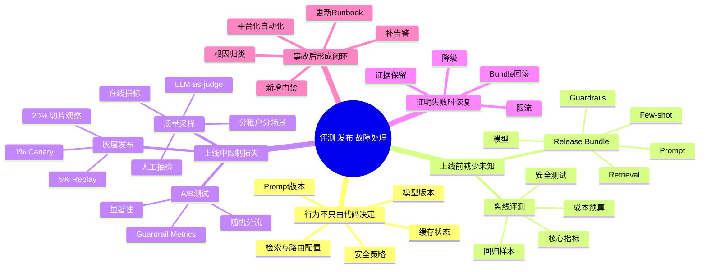
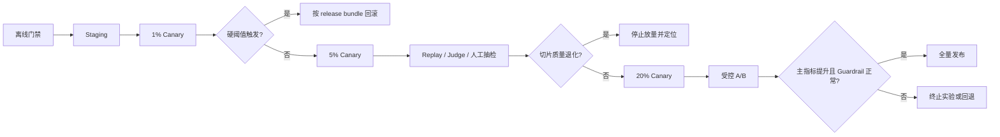

# 第22章：评测、发布与故障处理

> 在 AI 系统里，“把新版本推上去”从来不是发布的全部；真正困难的是：你如何证明它该上线、出了问题如何回滚、事故后如何避免再次发生。

> **关联章节**：本章的灰度、回滚和事故响应依赖 [第21章](./21-observability-and-capacity.md) 的观测信号。没有可解释的 metrics、logs、traces，发布决策就无法证据化。

## 1. 第一性原理拆解 + 学习大纲

### 拆 — 不可化简的问题

剥离模型名、评测框架、A/B 平台、灰度工具和事故流程之后，本章真正处理的是一个不可化简的问题：**一个会被数据、prompt、配置、检索、路由和负载共同改变行为的系统，如何在不确定性中被证明“值得上线”，并且在证明失败时把影响面限制住**。普通软件发布的最小问题通常是“新代码是否按预期执行”；AI 系统发布的最小问题更复杂，因为同一段服务代码在不同模型权重、system prompt、few-shot、retrieval top-k、安全策略、缓存状态和用户输入分布下，会表现为不同产品。它可能不报 500，却回答错；可能 p95 延迟正常，却在高价值租户的长尾场景里幻觉率上升；可能离线评测过线，却在线上因为请求分布变化、缓存污染或工具调用失败而退化。

因此，“把新版本推上去”从来不是发布的全部；真正困难的是：你如何证明它该上线、出了问题如何回滚、事故后如何避免再次发生。证明上线需要证据链，包括离线评测、回归样本、安全测试、成本预算、线上灰度观测和实验结论。限制影响面需要控制链，包括版本登记、流量切分、放量阈值、自动告警、降级策略和可执行回滚。避免再次发生需要学习链，包括事故证据保留、影响范围定位、根因归类、门禁补强和平台能力沉淀。评测、发布与故障处理不是三个孤立动作，而是同一个闭环：上线前减少未知，上线中限制损失，上线后把损失转化为下一次发布的约束。

### 推 — 从这个问题如何推导出每个机制

从“行为不可完全由代码决定”出发，首先必然推导出**离线评测**。如果模型、prompt、检索和安全策略都可能改变输出，那么发布前必须把核心任务、回归样本、高风险样本和成本约束固定成可重复的门禁。门禁的意义不是证明系统完美，而是挡住已知坏版本，避免团队靠主观印象上线。接着会推导出**release bundle**：AI 发布单元不能只包含镜像 tag 或模型文件，还要绑定模型版本、prompt 版本、few-shot 集、retrieval 配置、安全策略、路由规则和缓存维度；否则事故发生时无法回答“线上到底是什么组合”。

从“离线数据不能完全代表线上流量”出发，必然需要**灰度发布（canary rollout）**。灰度不是仪式，而是在 1%、5%、20% 这些有限流量窗口里验证真实请求、真实租户、真实负载和真实成本是否稳定。因为 AI 退化常常不是硬错误，所以灰度期间还必须有**质量采样**：在线 metrics 负责发现延迟、错误率、OOM、单位 token 成本等硬信号；真实请求 replay、LLM-as-judge 和人工抽检负责发现幻觉、引用错误、越权输出和长尾退化。质量采样必须按租户、场景、prompt / 配置版本、风险等级切片，否则平均值会掩盖受损人群。

从“想知道哪个版本更好”和“想控制上线风险”是两类问题出发，必然要区分**A/B 测试**和**灰度发布**。灰度回答“这个版本能否安全扩大影响面”，A/B 回答“两个方案哪个在统计上更优”。两者可以串联，但不能混用：先用灰度证明不会把系统搞坏，再用 A/B 在稳定分流和 guardrail metrics 下比较效果。最后，从“任何证明都可能失败”出发，必然推导出**回滚和事故响应**。回滚必须先于发布存在，并且按 bundle 整体回退；事故响应不能只看 500，还要覆盖质量、成本、安全和租户影响。复盘也不是写报告，而是把事故反向转化为新的评测集、告警规则、灰度阈值、runbook 和平台自动化。

### 绘 — 因果链路



### 导 — 读完本章你应该能回答

1. 为什么 AI 发布不能只用“接口兼容、错误率正常、服务可启动”来判断是否可以上线？
2. 一个最小可用的 release bundle 应该包含哪些对象，为什么 prompt、检索配置和安全策略不能被排除在发布单元之外？
3. 离线评测、灰度发布和 A/B 测试分别回答什么问题，为什么它们不能互相替代？
4. 在 1% 和 5% 灰度阶段，应该如何设计质量采样，才能发现幻觉、越权、长尾退化和成本异常？
5. 当灰度出现质量退化但系统指标正常时，如何判断应该回滚、停止放量、降级，还是继续实验？
6. 为什么 AI 系统回滚必须先于发布存在，并且经常需要按模型、prompt、索引、路由和安全策略整体回退？
7. 一次 incident 复盘如何反向沉淀成新的评测集、告警、发布门禁和平台能力？

## 2. 学习目标

完成本章学习后，你将能够：

1. 理解离线评测、灰度发布、在线观察和回滚之间的关系
2. 设计模型上线前的最小质量门禁
3. 识别 AI 系统发布与普通服务发布的关键区别
4. 为模型故障设计事故响应流程
5. 把评测和 incident 复盘纳入平台化流程

---

## 3. 正文内容

### 22.1 AI 发布为什么比普通代码发布更难

普通服务发布主要关注：

- 功能正确
- 接口兼容
- 系统稳定

AI 发布还额外关心：

- 模型质量是否退化
- 成本是否上升
- 输出是否出现安全问题
- 离线效果是否能迁移到线上

也就是说，AI 发布同时是一次：

- 系统发布
- 模型发布
- 质量实验

### 22.2 离线评测是第一道门

上线前至少应回答：

- 核心指标是否不低于基线
- 回归样本是否通过
- 关键安全测试是否通过
- 延迟与成本是否仍在预算内

一个简单门禁配置可以像这样：

```yaml
gates:
  offline_eval:
    ndcg_at_10: ">= 0.72"
    regression_failures: "== 0"
  serving_eval:
    p95_latency_ms: "<= 120"
    gpu_mem_gb: "<= 36"
```

没有门禁时，团队很容易退化为“看起来不错就上线”。

### 22.3 灰度发布的真正目标

灰度不是为了“显得专业”，而是为了在有限风险下验证：

- 真实流量表现
- 质量是否稳定
- 长尾请求是否异常
- 成本是否明显变化

典型流程：

```text
staging -> 1% canary -> 5% -> 20% -> full rollout
```

每一步都应有明确观察窗口和退出条件。

灰度阶段真正看的不是“新版本有没有起起来”，而是第21章里那组跨层信号：延迟、错误率、成本、质量、租户影响面是否同时稳定（详见 [第21章](./21-observability-and-capacity.md) §21.3 与 §21.4）。

一个发布流程可以拆成两条并行证据链：自动化指标负责快速阻断明显坏版本，质量采样负责发现不会表现为 HTTP 错误的退化。



#### 22.3.1 A/B 测试 vs 灰度发布

这两个词常被混用，但目的不同。平台如果分不清两者，很容易把实验问题和稳定性问题搅在一起。

| 维度 | 灰度发布 | A/B 测试 |
|------|----------|----------|
| 核心目标 | 控风险，验证稳定性和可回滚性 | 比较效果，验证哪个版本更优 |
| 流量切法 | 通常按 1% -> 5% -> 20% 逐步放量，按版本逐级放量 | 对实验单元做随机分流，避免把时间段、租户或场景偏差误认为模型效果 |
| 主要看什么 | 系统指标、质量底线、成本异常、是否能快速回滚 | 效果提升、统计显著性、业务指标变化 |
| 什么时候先做 | 每次上线都应先做 | 只有需要比较方案优劣时才做 |
| 放量决策 | 到达观察窗口且未触发回滚阈值才继续放量 | 样本量足够、差异达到统计显著且 guardrail metrics 未变坏才扩实验 |

平台工程视角里，灰度是发布流程的一部分；A/B 更像产品实验方法。常见顺序是：先用 canary 证明“不会把系统搞坏”，再用 A/B 证明“确实更好”。

A/B 里最容易被忽略的是实验纪律：

- 随机分流应固定在用户、租户或会话级，避免同一任务在实验期间来回切版本。
- 要提前定义主指标、最小可检测差异（MDE）和显著性标准，否则很容易“看到一点上涨就宣布获胜”。
- 不论主指标是否提升，都要盯住 guardrail metrics，例如 p95 延迟、错误率、token 成本、幻觉率、安全拦截率。
- 只要 guardrail metrics 越过回滚阈值，就应立即停止实验或把实验流量缩回，不必等统计结论。

#### 22.3.2 灰度期间的质量采样

为什么 1%-5% 灰度还需要专门做质量采样？因为很多 AI 退化不会直接变成 500，而是慢慢体现在错误回答、引用错乱、越权内容或成本异常上。

| 灰度阶段 | 质量采样动作 | 重点判断 | 常见放行条件 |
|------|--------------|----------|--------------|
| 1% | 在线指标全量监控；高风险请求全留样；人工抽检最新输出 | 是否出现明显安全、幻觉、越权、格式崩坏问题 | 没有触发硬回滚阈值，且人工抽检未发现严重错误 |
| 5% | 在线指标持续看；抽样做离线 replay；LLM-as-judge 批量对比新旧输出 | 是否存在持续性质量退化，是否只在某些租户 / 场景恶化 | 系统指标稳定，切片后的质量指标未明显变差 |
| 20% | 扩大抽样面；补长尾任务与大客户样本；保留黄金请求的新旧输出对照 | 长尾任务、分租户、分场景、分 prompt 模板是否都可接受 | 异常都能解释且有处置方案，回滚路径仍然畅通 |

实践里常见做法不是押注单一信号，而是把四种采样并起来：

1. 在线指标：看成功率、超时率、p95/p99 延迟、平均 token、单位请求成本、用户投诉率等，先判断系统有没有立刻变坏。
2. 离线评测：把灰度窗口里保留下来的真实请求回放到新旧版本，对 golden dataset 和真实流量样本同时做 replay，防止线上噪声掩盖退化。
3. 人工抽检：优先抽高价值租户、高风险场景、失败重试请求、含工具调用或敏感问答的样本，重点看“是否危险”，不只是看“是否流畅”。
4. LLM-as-judge：让独立 judge prompt 对新旧回答打分，评估相关性、完整性、引用准确率、拒答是否合规，但不要把 judge 当唯一真相，应定期用人工样本校准。

采样时最好天然带切片：

- 分租户：防止某个大客户的数据分布与整体平均值相互抵消。
- 分场景：例如 FAQ、复杂推理、工具调用、RAG 引用、多轮对话应分别看。
- 分 prompt / 配置版本：同模型下，prompt、few-shot、retrieval 参数变化也可能单独引入退化。
- 分风险等级：安全敏感任务和普通任务不能按同一阈值放行。

采样量没有固定万能值，它取决于效果差异大小和置信度要求。工程上更实用的原则是：1%-5% 阶段先用较密采样寻找明显坏信号，而不是追求漂亮的统计结论；如果连这点流量都已经出现错误率飙升、延迟翻倍、OOM、安全违规或人工抽检连续失败，就应立即回滚，不必继续“再观察一下”。

另一个容易漏掉的动作是留证据。灰度窗口应保存一份可重放样本集，至少包含请求元数据、命中的 release bundle、旧版本输出、新版本输出、judge 结果和人工结论。事故发生后，团队才能快速回答“是模型变了，还是 prompt / 检索 / 安全策略变了”。

#### 22.3.3 AI 系统实验的特殊风险

AI 实验比普通 Web A/B 更容易被数据分布和系统行为污染，至少要额外注意四类风险：

| 风险 | 为什么麻烦 | 控制手段 |
|------|------------|----------|
| Prompt 分布漂移 | 新 prompt、few-shot 或工具说明会改变任务分布，导致今天的实验结果无法代表明天 | prompt / 配置版本必须和模型一样登记，实验报告里明确绑定版本 |
| 长尾任务占比低 | 平均指标可能很好看，但复杂推理、冷门知识、边界租户已经明显退化 | 对长尾场景单独分层抽样，不要只看总平均 |
| 幻觉 / 安全问题低频高损 | 这类问题出现频率不高，但一次就可能造成合规事故 | 单独设置高风险 guardrail 和硬回滚阈值，不能被平均值稀释 |
| 缓存污染实验 | 响应缓存、检索缓存、embedding 缓存会让 A/B 两组共享结果，破坏随机性 | 实验期隔离 cache key，把模型 / prompt / 检索版本纳入缓存维度 |

所以 AI 系统里的“实验成功”不能只理解成主指标上涨。更严格的定义应是：主指标改善、guardrail 未恶化、切片后没有明显受损群体、缓存和路由没有污染实验。

工程边界：A/B 平台只负责稳定分流、样本计数和指标归因，不应绕过发布系统直接切换未登记版本；灰度系统只负责控制影响面和回滚，不应替代统计实验。对于日请求量低于几千、长尾占比高或高风险合规场景，平台应优先采用人工审核、离线 replay 和小流量长期观察，而不是强行追求显著性结论。

#### 22.3.4 发布检查表

下面这张表可以直接变成 canary / A/B 的发布 runbook：

| 阶段 | 检查项 | 通过标准 | 失败动作 |
|------|--------|----------|----------|
| 发布前 | 离线评测、回归集、安全测试、成本预算都过线 | 指标达到基线，release bundle 已登记 | 不发布，回到评测或修复 |
| 1% canary | 系统指标稳定；人工抽检首批高风险样本；无严重投诉 | 错误率、延迟、OOM、单位成本未越过阈值；无 P0 质量事故 | 立即回滚到上一个稳定 bundle |
| 5% canary | 做 replay、LLM-as-judge、分租户 / 分场景切片 | 在线与离线结果一致，没有明显退化切片 | 停止放量，定位是模型、prompt、检索还是缓存问题 |
| 受控 A/B | 随机分流稳定；样本量达到设计值；guardrail 未恶化 | 主指标达到显著性要求，guardrail metrics 全部在阈值内 | 终止实验或缩回实验流量 |
| 全量前 | 回滚链路演练过；告警、值班、事故联系人就绪 | 可在几分钟内切回稳定版本 | 延后发布，先补 runbook 和自动化 |

如果更习惯流程图，也可以用下面的最小决策流：

```text
离线门禁通过
  -> 1% canary 看系统硬指标和人工抽检
  -> 任一硬阈值触发? 是 -> 立即回滚
  -> 否 -> 5% canary 做 replay / judge / 切片分析
  -> 发现退化切片或高风险样本? 是 -> 停止放量并定位
  -> 否 -> 进入受控 A/B 验证效果
  -> 主指标显著提升且 guardrail 正常? 是 -> 全量发布
  -> 否 -> 终止实验或回退
```

### 22.4 回滚必须先于发布存在

很多团队的回滚方案，其实是在事故发生后才临时想。正确顺序应该是：

1. 先有稳定上一个版本
2. 先有路由切回机制
3. 先明确索引 / 配置 / prompt 是否也要一起回退
4. 再发布新版本

这在 RAG 或 LLM 系统里尤为重要，因为问题不只可能来自模型，也可能来自：

- 向量索引
- prompt 模板
- reranker
- 安全规则

#### 22.4.1 Prompt 与配置也属于发布单元

在生产 LLM 服务里，prompt 不是“运营文案”，而是影响行为边界的配置代码。它和模型、索引一样，都应该进入版本登记、灰度发布和一键回滚流程；如果 guard rail 或工具白名单配错，影响面往往和模型回归一样大，相关安全边界可继续参考 [第23章](./23-security-isolation-and-governance.md)。

| 对象 | 为什么要版本化 | 灰度 / 回滚要求 |
|------|----------------|-----------------|
| system prompt | 直接决定角色、约束和输出风格 | 不允许控制台热改，和模型版本一起灰度 |
| few-shot 示例集 | 示例变化会改变回答偏好和格式 | 需要记录样本来源、更新时间和责任人 |
| guard rails / safety filters | 决定输入输出过滤、越权拦截、工具白名单 | 小流量验证误杀和漏拦截，再全量 |
| 检索 / 路由配置 | top-k、reranker、fallback 直接影响质量与成本 | 和索引、模型一起打包发布 |

```yaml
release_bundle:
  model: "llm-prod@2026-04-18"
  system_prompt: "assistant-prod@v12"
  few_shot_set: "citation-rag@v4"
  safety_policy: "guardrails@v7"
  retrieval_config: "search-prod@v9"
```

平台上更稳妥的做法，是把这类对象当成同一个 release bundle：先过离线门禁，再走 `staging -> canary -> full rollout`，出问题时按 bundle 整体回退，而不是只回退模型文件。

工程边界：prompt registry 和配置中心可以提供编辑、审核、diff、签名和查询，但生产请求只应引用不可变版本 ID；Feature Flag 可以选择已登记 bundle 的流量比例，不能直接承载任意 prompt 文本热更新。紧急修复也应生成新 bundle 并留下审批、操作者、影响租户和回滚目标，否则下一次事故很难复现线上状态。

### 22.5 AI 事故不只有 500 错误

AI 事故常见表现包括：

- 延迟突增
- 成本突增
- 回答质量明显下降
- 幻觉率上升
- 权限泄漏或安全策略失效

因此 incident 触发条件不能只看系统错误率，还应包含质量告警和成本异常。

### 22.6 一个事故响应流程

```text
发现异常
  -> 确认影响范围
  -> 决定降级 / 限流 / 回滚
  -> 保留证据（日志、trace、版本信息）
  -> 恢复服务
  -> 复盘并加门禁
```

重点不是流程本身，而是：

- 是否知道当前线上到底是什么版本
- 是否知道哪些租户受影响
- 是否能在几分钟内执行回滚

### 22.7 从事故反推平台能力

每次事故都应倒逼平台补能力。例如：

- 如果回滚慢，说明版本注册或路由切换能力不足
- 如果质量下降但告警没发现，说明质量观测面不够
- 如果定位困难，说明 trace / 日志 / 元数据没打通

一个成熟平台，不是“没有事故”，而是“事故会沉淀成平台能力”。

### 22.8 常见误区

### 误区一：离线评测通过就等于可以全量上线

不对。离线数据不一定代表真实流量。

### 误区二：灰度只看系统指标

不对。AI 发布还必须看质量指标和成本变化。

### 误区三：回滚只是切模型版本

不对。很多系统还要同时回滚配置、索引、prompt 和路由规则。

### 22.7.1 Argo Rollouts / Flagger 实际工作机制

章节推荐"用 Argo Rollouts 做灰度"，但**它怎么实现 traffic split、怎么自动判断 metric、怎么 promote/rollback** 没讲。理解这些机制，灰度才能从"运行就行"变成"可解释、可调试"。

**Argo Rollouts 基本结构**：用 `Rollout` CRD 替代 Deployment，引入 `strategy.canary` 声明式描述灰度阶段：

```yaml
apiVersion: argoproj.io/v1alpha1
kind: Rollout
metadata:
  name: llm-router
spec:
  replicas: 10
  strategy:
    canary:
      canaryService: llm-router-canary
      stableService: llm-router-stable
      trafficRouting:
        istio:
          virtualService:
            name: llm-router-vs
      steps:
        - setWeight: 1                  # 1% 流量到 canary
        - pause: {duration: 10m}
        - analysis:                     # 跑指标分析
            templates:
              - templateName: success-rate
              - templateName: ttft-p95
        - setWeight: 5
        - pause: {duration: 30m}
        - analysis:
            templates:
              - templateName: success-rate
              - templateName: ttft-p95
              - templateName: ttft-p99
        - setWeight: 25
        - pause: {duration: 1h}
        - setWeight: 100
```

**traffic split 实现机制**：

| TrafficRouting 后端 | 怎么改流量比例 |
|---|---|
| **Istio** | controller patch `VirtualService.spec.http[].route[].weight`，Istio Pilot 推送给 Envoy sidecar |
| **SMI TrafficSplit** | controller 改 `TrafficSplit.spec.backends[].weight`，Linkerd/其他 mesh 实现 |
| **nginx-ingress** | controller 改 Ingress annotation `nginx.ingress.kubernetes.io/canary-weight: "5"` |
| **ALB Ingress** | controller 改 ALB target group weight |
| **Service mesh agnostic** | 通过 Service `selector` 调整 stable/canary Pod 数量比例（粒度粗，不推荐生产）|

**Analysis Template（自动判断 metric）**：

```yaml
apiVersion: argoproj.io/v1alpha1
kind: AnalysisTemplate
metadata:
  name: ttft-p95
spec:
  metrics:
    - name: ttft-p95
      interval: 1m
      successCondition: result[0] < 1500          # P95 < 1500ms
      failureLimit: 3                              # 连续 3 次失败就 fail
      provider:
        prometheus:
          address: http://prometheus:9090
          query: |
            histogram_quantile(0.95,
              sum(rate(llm_ttft_seconds_bucket{
                service="llm-router",
                version="canary"
              }[2m])) by (le)
            ) * 1000
```

**自动 promote / rollback 逻辑**：

```text
controller 主循环:
  每 10s reconcile:
    检查当前 step:
      - setWeight: patch trafficRouting，进入下一步
      - pause: 等 duration 或人工 promote
      - analysis: 启动 AnalysisRun
    
  AnalysisRun 内部:
    每 metric.interval:
      跑 Prometheus query → result
      检查 successCondition / failureCondition
      累计 inconclusive / successful / failed 次数
    
    达到 failureLimit → 标记 Failed → 触发 abort
    达到 successfulRunHistoryLimit → 标记 Successful → 进入下一步
  
  Failed 时:
    自动 setWeight: 0 (canary 摘流量)
    回退到 stable 版本（pod 已经存在，立即生效）
    标记 Rollout status: Aborted
```

**Flagger 的差异**：

- Flagger 是 **service mesh native**（Istio/Linkerd/AppMesh/Contour），不支持 ingress controller。
- Flagger 自己创建 primary 和 canary Deployment（不像 Rollouts 用一个 Rollout 资源管所有 Pod）。
- Flagger 内置 load test webhook（在分析期间主动打流量到 canary，让 metric 有足够样本）。
- Flagger 的 metric provider 选择更多：Prometheus、Datadog、New Relic、CloudWatch。

**生产实战要点**：

- **AnalysisTemplate 的 query 必须按 version label 区分**：`{version="canary"}` vs `{version="stable"}`——Pod 必须打这个 label，否则全局 metric 看不出 canary 退化。
- **failureLimit 不能太低**：Prometheus rate window + scrape lag 可能让单点测量噪声大。建议 `interval: 1m` + `failureLimit: 3-5`，给 3-5 分钟才决策 abort。
- **`pause` 阶段必备**：让流量进入新副本后稳态再 analyze，不能立刻 setWeight 然后立刻 query。
- **多 metric AND 还是 OR**：默认 AND（所有 metric 都要 success）。要 OR 必须用 Argo Rollouts 的 `metricsTemplates` 嵌套或写一个 composite metric。
- **流量分桶 vs sticky session**：mesh weight 是 per-request 随机，每个用户每次请求可能落到不同版本——对话场景这会导致用户体验不一致。需要 mesh + header-based routing（如 `consistent-hash` on `user_id`）。

**与 LLM serving 的特殊配合**：

- LLM 推理副本冷启动慢（权重加载 1-3min）。`pause` duration 要包含冷启动时间。
- LLM canary 副本数太少（如 2 个）时 Prometheus rate 噪声大，建议 canary 至少 3-5 个副本才做 analysis。
- LLM 推理 metric 通常需要更长 window（5-10min）才稳定，`interval: 1m` 偏短。

### 22.7.2 LLM-as-judge 的偏差与校准

章节推荐"用 LLM-as-judge 做质量评测"，但**LLM-as-judge 自己有哪些已知偏差、怎么校准**没讲。直接用 GPT-4 当 judge 不做校准是常见错误，结论可能偏向系统性。

**主要偏差**：

| 偏差 | 表现 | 严重程度 |
|---|---|---|
| **Position bias** | 让 judge 比较 (A, B) 时偏好第一个或最后一个，不论实际质量 | 严重——很多 judge 偏好第一个 60-70% |
| **Verbosity bias** | 偏好更长的回答，即使内容差 | 中——简单 prompt 缓解 |
| **Self-preference bias** | 用 GPT-4 当 judge 评 GPT-4 输出，得分系统性高于其他 model | 严重——同 family 模型不能互评 |
| **Authority bias** | 偏好声明权威的回答（"作为专家..."）| 中 |
| **Sycophancy** | judge 可能配合 prompt 暗示而非客观评判 | 严重——不能把"哪个更好"暗示放 prompt |
| **Refusal asymmetry** | judge 可能偏好不拒答的版本，即使拒答更安全 | 严重——安全场景必须人工校准 |

**Position bias 的校准方法**：

```python
# 错误方式：单方向比较
score_A_vs_B = judge.compare(question, response_A, response_B)
# response_A 在 prompt 里出现在 response_B 之前
# → judge 系统性偏好 response_A

# 正确方式：双向比较
def fair_compare(question, A, B):
    s_AB = judge.compare(question, A, B)  # A 在前
    s_BA = judge.compare(question, B, A)  # B 在前
    
    if s_AB == "A wins" and s_BA == "B wins":
        return "tie"  # judge 仅按位置选——结果不可信
    if s_AB == "A wins" and s_BA == "A wins":
        return "A wins"  # 两次方向都选 A，可信
    ...
```

实测：双向比较后 30-40% 的"获胜"会变成 tie，说明这部分判断完全是 position bias。生产中 judge benchmark 的 win-rate 数字必须用双向校准过的。

**Verbosity bias 校准**：

```python
# Prompt 中显式约束
JUDGE_PROMPT = """
评估以下两个回答。注意：**不要**因为某个回答更长就偏好它。
更长不等于更好——评估应基于 correctness、relevance 和 conciseness。

Question: {question}
Response A: {A}
Response B: {B}

哪个更好？回答 A、B 或 tie。
"""
```

或用 length-controlled judge：把两个回答 truncate 到相近长度再比较。

**Self-preference bias 防范**：

- **judge 模型与生产模型不同 family**：用 Claude 评 GPT-4 输出、用 GPT-4 评 Claude 输出。
- **多 judge ensemble**：用 3 个不同 family 的 judge，多数投票。
- **避免自我评价**：不要让模型评自己的输出（即使临时跑实验）。

**Calibration（校准 judge 与人工标注一致性）**：

```text
1. 抽 500 条业务真实样本（覆盖各场景）
2. 人工标注：response_A vs response_B 哪个更好
3. 用 judge 跑同样的样本对
4. 算 agreement rate：
   - human-judge agreement: 人工和 judge 一致的比例
   - cohen's kappa: 排除偶然一致后的一致性系数
5. 阈值：
   - kappa > 0.6: judge 可用作初筛
   - kappa > 0.8: judge 可用作主判断（仍要抽样 5% 人工复核）
   - kappa < 0.4: judge 不可信，找别的判断方法
```

**校准频率**：每月跑一次 calibration 样本（覆盖新业务变化），kappa 下降 > 0.1 时重新设计 judge prompt 或换 judge 模型。

**生产 judge 设计 checklist**：

- judge prompt 使用最新 best practices（chain-of-thought、给 judge 足够 reasoning 空间、明确 rubric）。
- Position 双向校准是默认行为，不是可选项。
- judge 模型与生产模型不同 family。
- 定期用人工标注校准（kappa > 0.6 才 ship）。
- judge 结果只作为 P50 quality 信号，不作为 P99 安全信号——后者必须人工。
- safety / refusal 类判断不能完全靠 judge——judge 自己的 refusal asymmetry 会偏差。

**与灰度结合**：

```yaml
# Argo Rollouts AnalysisTemplate
- name: judge-quality
  interval: 30m                   # judge 调用贵，跑得疏
  successCondition: result[0] >= 0.55   # judge win rate >= 55%（接近 tie 通过）
  failureCondition: result[0] < 0.45    # < 45% 视为退化
  provider:
    web:
      url: http://judge-service/canary-vs-stable
      method: POST
      jsonBody: '{"window": "30m", "samples": 100}'
      jsonPath: "{$.win_rate}"
```

注意 successCondition 不应该是 "> 0.5"——judge 噪声 + position bias 残留让 50/50 是合理 baseline，要求"显著优于 stable"才通过会过严。

## 本章涉及的常见工具

| 概念 | 常见工具 / 命令 | 备注 |
|------|-----------------|------|
| 离线评测与制品状态 | MLflow、Weights & Biases | 常用于记录评测结果和模型状态流转 |
| 灰度与放量控制 | Argo Rollouts、Flagger | 适合把 canary / blue-green 做成声明式流程 |
| Prompt / 配置版本管理 | GitOps 仓库、自建 prompt registry、Feature Flag 平台 | Feature Flag 只应用于选择已登记的不可变 bundle / 版本 ID，不应直接热改 prompt 文本 |
| 观测与告警 | Prometheus、Grafana、Alertmanager | 灰度期间要同时看系统、成本和质量信号 |
| 事故协同 | PagerDuty、On-call Runbook | 用于把事故响应流程标准化 |

---

## 本章小结

| 阶段 | 核心问题 |
|------|----------|
| 离线评测 | 是否达到最小上线门槛 |
| 灰度观察 | 真实流量下系统、质量、成本是否稳定 |
| 回滚 | 是否能快速恢复到已知稳定状态 |
| 复盘 | 是否把事故沉淀为平台能力 |

---

## 练习题

1. 为什么 AI 发布不能只看“接口没报错”？
2. 请为一个 RAG 服务设计最小灰度发布流程。
3. 为什么 AI 系统的回滚往往不只是回滚模型文件？
4. 举一个事故复盘最终应沉淀成平台能力的例子。
