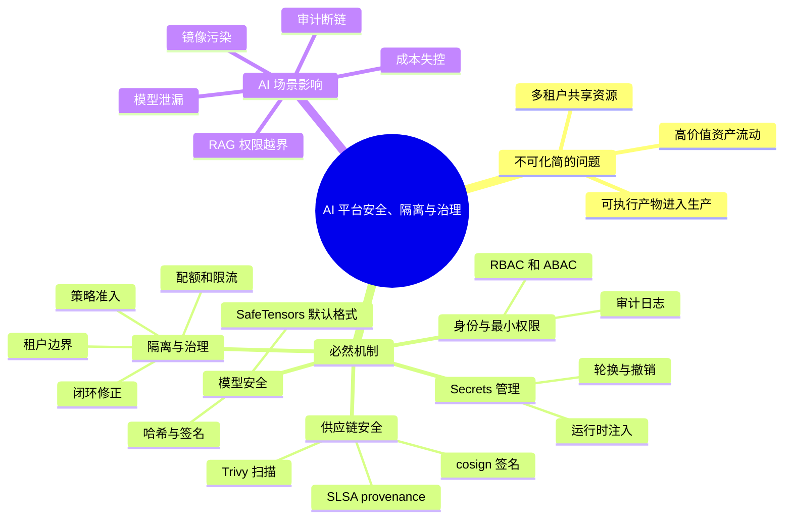
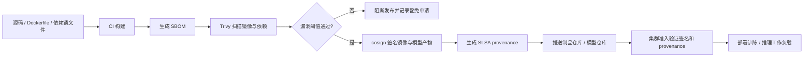

# 第23章：安全、隔离与治理

> AI 平台的风险从来不只在“服务会不会挂”，还在“数据、模型、权限、成本和审计是否会一起失控”。

> **关联章节**：本章和 [第13章](../part4-data-and-storage/13-feature-vector-and-cache.md) 的向量索引、缓存和 RAG 权限边界直接相关。缓存命中如果绕过权限检查，系统会在“看似正常返回”里发生越权。

## 1. 第一性原理拆解 + 学习大纲

### 拆 — 不可化简的问题

剥掉 Kubernetes、Vault、cosign、Trivy、OPA、SafeTensors 这些工具名以后，本章真正要解决的不可化简问题是：**AI 平台把高价值资产、可执行产物、外部输入和多租户资源放进同一条自动化流水线里，任何一个边界被绕过，损失都可能从一次请求扩大成数据泄漏、模型泄漏、算力滥用或供应链污染。** 传统 Web 服务的安全边界通常围绕 API、数据库和用户会话展开；AI 平台多出训练数据、RAG 语料、embedding 索引、模型权重、checkpoint、prompt 模板、Notebook 环境、训练镜像、推理镜像和日志样本。它们既是“数据”，又常常驱动“执行”：模型文件会被加载，Notebook 会拉取密钥，RAG 检索结果会影响工具调用，缓存结果可能跨租户复用，镜像层和 Python 依赖会在生产 Pod 里运行。因此本章开头的判断是：AI 平台的风险从来不只在“服务会不会挂”，还在“数据、模型、权限、成本和审计是否会一起失控”。安全回答“什么不能被未授权访问或篡改”；隔离回答“故障和越权能否停在边界内”；治理回答“规则能否被平台自动执行、度量、追溯和修正”。

### 推 — 从这个问题如何推导出每个机制

从“资产流动必须可控”出发，首先必然推出**身份与最小权限**。训练任务、在线服务、评测流水线、数据处理 Job 和 Notebook 不能共享一个万能账号，因为共享账号让审计失效，也让单点泄露变成全平台泄露。于是需要服务身份、租户身份、短生命周期凭证、RBAC / ABAC、按数据集和模型仓库粒度授权。继续往下推，凭证本身变成高价值资产，所以需要 **Secrets 管理**：Secret 不能进代码、不能进镜像、不能进长期明文环境变量；它应按身份、租户、用途和 TTL 在运行时注入。

从“模型和 checkpoint 既是资产也是可执行输入”出发，必然推出**模型安全**。如果平台允许任何人把外部 `.pt`、`.bin`、`.ckpt` 权重直接 `torch.load` 到共享训练或推理环境，边界就已经被突破，因为 Python `pickle` 的目标是恢复对象，不是验证安全数据格式。于是需要模型准入、格式约束、哈希校验、签名、隔离转换、SafeTensors 默认化，以及加载阶段的低权限沙箱。RAG 和 Agent 又把外部文本接入模型决策，因此权限检查必须进入检索、上下文拼装、缓存 key、工具调用和日志脱敏链路。

从“生产运行的是构建产物而不是源码意图”出发，必然推出**供应链安全**。镜像、Python 依赖、CUDA 库、模型权重和评测数据都可能被篡改或漂移；如果部署系统只认 tag，不验证签名和 provenance，就无法区分官方构建、开发者本地构建和恶意上传。于是需要依赖锁定、SBOM、Trivy 扫描、cosign 签名、SLSA provenance、准入控制和例外流程。最后，从“多租户共享昂贵资源”出发，必然推出**资源与故障隔离**：GPU 配额、队列优先级、限流、预算、租户标签、日志隔离、索引隔离和故障域划分，都是为了让单个团队的实验、错误配置或滥用行为不拖垮公共平台。治理闭环则把这些机制串起来：规则定义、平台执行、指标与审计、异常发现、策略调整。没有闭环，安全规则会逐渐变成不可验证的口头约定。

### 绘 — 因果链路



### 导 — 读完本章你应该能回答

1. 为什么 AI 平台不能只用“API 鉴权 + 数据库权限”来定义安全边界？
2. 一个 Secret 从创建、注入、使用、轮换到撤销，平台至少要记录和限制哪些东西？
3. 为什么未知来源的 `pickle` / PyTorch 原生权重不能直接进入共享训练或生产推理环境？
4. SafeTensors 解决的是哪一类安全问题，它不能替你解决哪些模型安全问题？
5. cosign、Trivy 和 SLSA provenance 分别控制供应链里的哪一个风险点？
6. RAG 缓存、向量索引和工具调用为什么必须带租户、权限和版本边界？
7. 如何判断一条治理规则已经进入平台闭环，而不是只停留在流程文档里？

## 学习目标

完成本章学习后，你将能够：

1. 识别 AI 平台中的主要安全边界
2. 理解数据、模型、镜像、密钥和租户隔离的不同风险
3. 设计最小权限、审计和治理规则
4. 理解为什么治理必须进入平台，而不是停留在文档
5. 用平台视角看待权限、合规和成本控制

---

## 正文内容

### 23.1 AI 平台的攻击面比普通服务更宽

一个普通在线服务的关键安全面通常集中在：

- API 接口
- 数据库
- 用户认证

AI 平台则往往还包括：

- 训练数据
- 模型权重
- checkpoint
- 镜像和依赖供应链
- 向量索引
- prompt 模板
- 日志中的用户输入与模型输出

这意味着：哪怕服务本身没有宕机，平台也可能在数据泄漏、权限越界或供应链污染上出问题。

### 23.2 数据与模型都是敏感资产

### 数据风险

- 训练集可能包含隐私或内部知识
- 日志可能意外记录原始用户内容
- RAG 文档可能包含权限边界明显的内部资料

### 模型风险

- 权重本身可能是核心知识资产
- 某些模型输出受 prompt 或检索内容影响，可能间接泄漏敏感信息

因此权限设计不能只盯“谁能访问 API”，还要管：

- 谁能读训练数据
- 谁能下载模型
- 谁能构建索引
- 谁能看到完整日志

#### 23.2.1 模型安全威胁

平台不只是在保护“服务接口”，还在保护模型文件、训练数据和推理链路本身。下面这些威胁在 AI 平台里很常见，而且很多都发生在“加载模型”或“接入外部内容”这种容易被忽视的环节。

| 威胁 | 典型方式 | 平台侧防护思路 | 检查项 | 失败条件 |
|------|----------|----------------|--------|----------|
| `pickle` 反序列化攻击 | 直接对未知来源权重执行 `torch.load`，加载 `.pt`、`.bin`、`.ckpt` 时触发任意代码执行 | 默认禁用不受信任的 pickle 权重；优先使用 SafeTensors；把权重转换放到无网络、低权限的隔离环境 | 模型仓库是否允许未审核的 pickle 文件进入生产；是否存在独立的格式转换沙箱 | 生产或共享训练环境可以直接 `torch.load` 外部下载的权重 |
| 模型中毒（data poisoning） | 恶意样本混入训练集、增量反馈集或 RAG 语料 | 数据源分级、训练集审计、关键任务回归评测、标注链路留痕 | 训练前是否有数据来源标签和抽样复核；上线前是否有安全回归集 | 训练数据来源不明，或语料变更后没有回归评测就上线 |
| 模型提取（model extraction） | 通过 API 批量探测和蒸馏输出行为 | 强鉴权、按租户限流、异常调用检测、输出策略限制、水印或蜜罐样本 | 是否对高频、系统化 probing 做告警；是否区分内部与外部配额 | 单个调用方可长期高频采样而不触发限流或审计 |
| Prompt 注入 | 用户输入或检索文档诱导模型泄露系统提示词、越权调用工具 | 输入分层、检索内容净化、工具调用白名单、输出审查、上下文隔离 | 工具调用是否经过平台授权层；检索片段是否带来源和信任级别 | 模型可直接按外部文档指令调用高权限工具，或泄露系统提示词 |

对于平台来说，重点不是“承诺彻底消灭风险”，而是把这些高风险路径做成默认拒绝、默认隔离、默认审计。

##### 23.2.1.1 为什么 `torch.load` 风险高，SafeTensors 为什么更适合默认化

`torch.load` 底层依赖 Python `pickle`。`pickle` 的设计目标是恢复 Python 对象，不是安全传输格式，所以加载未知来源文件时，本质上是在执行对方提供的反序列化逻辑。

| 格式 | 典型加载方式 | 安全特征 | 平台建议 |
|------|--------------|----------|----------|
| Pickle / PyTorch 原生权重 | `torch.load(...)` | 可在反序列化时执行任意代码，不适合作为不受信任输入 | 仅允许来自受信任构建链路；默认不直接进入生产推理 |
| SafeTensors | safetensors loader | 只描述张量数据，不执行 Python 对象反序列化逻辑 | 作为平台默认权重交换格式，更适合签名、校验和复现 |

一个实用原则是：**外部来源权重先验不可信，先转换、再扫描、再准入，而不是先加载再说。**

**工程边界**：

- SafeTensors 只收窄“加载权重时执行任意 Python 代码”的风险，不保证模型没有后门、没有训练数据泄漏，也不保证输出安全。
- 内部 checkpoint 可以保留 PyTorch 原生格式用于恢复训练，但必须限制读取范围，并把恢复环境和外部模型导入环境分开。
- 外部模型进入平台时，最小准入链路应包括来源登记、哈希记录、格式检查、隔离转换、基础评测和责任人确认；不应允许 notebook 直接把任意权重挂进生产模型仓库。

#### 23.2.2 Secrets 管理

AI 平台里的 secrets 往往比普通服务更多，因为训练、评测、拉取模型、访问数据库、调用外部大模型和对象存储都可能需要凭据，而且很多作业还是短生命周期 Pod。这里的默认原则应该写得非常硬：

> **Secrets 不入镜像、不入代码、不入环境变量明文。**

环境变量在很多团队里“看起来方便”，但它经常通过 `kubectl describe`、错误栈、调试页面、进程转储和日志系统扩散出去。更稳妥的做法是运行时按任务注入，尽量走文件挂载、sidecar 渲染或短时凭证。

| Secret 类型 | AI 场景举例 | 推荐注入方式 | 检查项 | 失败条件 |
|------|-------------|--------------|--------|----------|
| 模型下载 Token | HuggingFace Token、私有模型仓库凭证 | Vault 动态注入、云 Secret Manager 临时读取、按 Pod 挂载文件 | 任务结束后是否自动回收；是否限制到特定仓库/模型 | Token 被写入基础镜像、公共 notebook 模板或共享环境变量 |
| 外部 API Key | OpenAI / Anthropic / 第三方 OCR 或检索 API Key | Vault、云 Secret Manager、K8s Secret + External Secrets Operator 同步到运行时 | 是否按租户/应用隔离；是否支持轮换和审计 | 多个团队共享一个长期 API Key，或 Key 出现在日志与报错里 |
| 数据库 / 向量库凭证 | Postgres、MySQL、Milvus、pgvector、Redis | Vault 动态账号、短时密码、最小权限 DB 账户 | 是否区分读写权限；是否和租户边界一致 | 所有服务共享 root 账号，或凭证写死在 Helm values / notebook |

下面是常见注入路径的取舍：

| 注入方式 | 适合场景 | 优点 | 使用时的注意点 |
|------|----------|------|----------------|
| Vault | 高价值凭据、需要动态账号或短时令牌的任务 | 支持轮换、审计、动态凭证，适合数据库和高敏 API Key | 需要把租户、角色和 TTL 设计清楚，避免“接了 Vault 但还是发长期 token” |
| K8s Secret + External Secrets Operator | 已有云 Secret Manager，希望同步到 Pod 运行时 | 易于和 Kubernetes 工作负载集成，便于统一声明式管理 | 只解决同步，不自动等于“最小权限”；仍要限制谁能读 Secret |
| 云 Secret Manager | 使用云上托管数据库、对象存储和推理服务 | 和 IAM 集成好，适合按服务身份拉取 | 不要因为“云上托管”就把 Secret 明文写进环境变量 |

Secrets 管理最常见的事故不是“加密算法失效”，而是流程太松。下面这些属于高频踩坑：

| 常见事故 | 发生方式 | 平台侧预防 | 失败条件 |
|------|----------|------------|----------|
| Secret 泄露到日志 | 应用启动打印环境变量、异常栈回显请求头、调试日志输出连接串 | 日志脱敏、启动脚本禁止 `env` 输出、敏感字段统一 redact | 日志系统或 APM 中可直接搜索到 API Key / Token / DSN |
| Secret 硬编码到 notebook 后推到 git | 为了图快把 Key 写进 `.ipynb`、`.py` 或示例配置 | 预提交扫描、仓库 secret scanning、最小示例不带真实凭据 | 代码仓库中存在真实 Token，或历史提交可恢复出密钥 |
| Secret 打进镜像 | 在 Dockerfile `ARG` / `ENV`、构建缓存或基础镜像中固化凭据 | 构建阶段禁用真实 Secret，改为运行时注入；镜像扫描检查敏感字串 | 镜像层或构建缓存里能提取出凭据 |

如果一个平台需要一个“能否过线”的最小检查表，可以直接用下面这张表：

| 检查项 | 合格标准 | 失败条件 |
|--------|----------|----------|
| Secret 来源 | 所有生产凭据来自 Vault、External Secrets Operator 背后的 Secret Manager，或云 Secret Manager | 任何生产凭据来自代码仓库、镜像、Helm values 明文或 notebook |
| Secret 生命周期 | 高价值凭据有轮换周期，短作业优先使用短时凭证 | 凭据长期有效且无轮换记录 |
| Secret 暴露面 | Secret 不以明文环境变量在共享运行时长期暴露 | 多个 Pod、多人共享 shell、调试页面可直接看到明文 |
| Secret 审计 | 能追踪谁在什么时间读取了哪个 Secret | 无法定位读取行为，泄露后无法回溯 |

**工程边界**：

- K8s Secret 是 Kubernetes 对 Secret 的存储与分发机制，不等于完整 Secret 管理系统；如果 etcd 加密、RBAC、审计和轮换缺失，它只是在集群内换了一个存放位置。
- 环境变量不是绝对禁止，但不适合作为高价值长期凭据的默认通道。短生命周期、低权限、单 Pod 使用的 token 可以临时用环境变量承载，但必须配合日志脱敏和 TTL。
- 训练 Job 只应拿到访问当前数据集、当前模型仓库和当前对象前缀的最小权限；跨租户聚合、账单、审计由平台服务代办。

### 23.3 供应链安全不能忽略

AI 平台往往依赖大量镜像、Python 包和系统库。常见问题包括：

- 使用来源不明的基础镜像
- 依赖版本漂移
- 镜像里带有明文密钥
- 开发环境镜像直接进入生产

这些问题很少在功能测试阶段暴露，但会在生产期持续增加风险。

#### 23.3.1 供应链安全加固

供应链加固的目标不是“把流程变重”，而是让关键产物能被追溯、验证和复现。对 AI 平台来说，供应链不只包括镜像和 Python 包，也包括模型权重、checkpoint、基础数据处理镜像和 notebook 依赖。

| 控制点 | 最小做法 | 检查项 | 失败条件 |
|------|----------|--------|----------|
| 镜像签名验证 | 使用 `cosign` 对基础镜像和业务镜像签名，并在部署前校验签名 | 集群准入或 CI 是否阻止未签名镜像进入生产 | 任意来源的镜像只要 tag 对得上就能部署 |
| 依赖锁定 | 使用 `requirements.lock`、`poetry.lock`、`uv.lock`、constraints 文件等锁定解析结果 | 构建是否严格按锁文件安装；升级是否走审阅流程 | `pip install -r requirements.txt` 每次解析结果可能不同 |
| 漏洞扫描 | 在 CI 和镜像入库阶段运行 Trivy，对基础镜像和依赖做扫描 | 是否对 Critical/High 漏洞设置阻断阈值 | 漏洞扫描只出报告不阻断，或扫描结果无人处理 |
| 构建 provenance | 采用 SLSA 思路记录构建来源、构建器、输入和产物 provenance | 是否能回答“这个镜像/权重由谁、用什么源码、在什么流水线构建” | 产物来源不明，无法区分官方构建与手工上传 |
| 模型与权重准入 | 把模型文件也纳入签名、哈希校验、来源登记 | 下载的 checkpoint 是否记录来源和摘要；是否默认偏向 SafeTensors | 权重来源不明，或外部模型可绕过准入直接进入训练/推理集群 |

下面这张表可以直接作为交付门槛：

| 交付门槛 | 通过条件 | 不通过条件 |
|----------|----------|------------|
| 镜像来源 | 基础镜像来自批准仓库，业务镜像有 `cosign` 签名且验证通过 | 镜像无签名、签名无效，或基础镜像来源不明 |
| 依赖可复现 | 依赖由锁文件固定，构建脚本不会在线自由解析新版本 | 构建时允许自动漂移到未经审阅的新依赖 |
| 漏洞基线 | Trivy 扫描结果在允许阈值内，例外项有明确豁免记录 | 存在未豁免的 Critical 漏洞仍继续发布 |
| 构建可追溯 | 产物带有 provenance，能映射到源码提交和 CI 任务 | 线上产物无法映射到具体构建记录 |

SLSA 可以把它理解成“供应链成熟度框架”：它不替你做签名或扫描，但要求你把产物来源、构建过程和防篡改能力逐步标准化。很多团队一开始不需要追求高等级，但至少要做到“来源可追溯、构建可证明、产物可验证”。

一个常被忽视的点是：模型权重文件本身也是供应链的一部分。如果权重或 checkpoint 仍然依赖 `pickle` 反序列化，就可能在加载阶段执行恶意代码；这也是为什么越来越多平台偏向 SafeTensors 这类更窄、更可验证的格式（也可对照 [第10章](../part3-training-infra/10-memory-checkpointing-and-recovery.md) 的 checkpoint 格式讨论）。

一个推荐的最小供应链流程如下：



这条链路里每个工具负责的边界不同：Trivy 暴露已知漏洞和配置风险；cosign 让产物在部署前可验证“确实由可信身份签过”；SLSA provenance 描述“由哪个源码、哪个构建器、哪个流水线输入生成”。三者不能互相替代：有签名但没扫描的镜像可能带着 Critical 漏洞；扫描通过但没有签名的镜像可能被替换；签名和扫描都有但没有 provenance 的产物，事后仍很难解释它来自哪个提交。

**工程边界**：

- 第一阶段目标不是追求最高 SLSA 等级，而是做到生产产物“不可手工绕过、可验证、可追溯”。先把未签名镜像、未登记模型和无锁文件依赖挡在生产外。
- 扫描工具只能发现已知漏洞和一部分配置问题，不能证明依赖没有恶意逻辑；高风险依赖仍需要来源限制、版本 pin、代码审阅或内部镜像仓库缓存。
- `latest` tag、临时 notebook 镜像、本地手工 build 和外部模型直传都应视为绕行路径；紧急例外必须有 TTL、责任人、审计记录和事后补签/补扫描。

### 23.4 隔离不是只有“命名空间隔离”

AI 平台里的隔离至少有四层：

1. **身份隔离**：谁能提交任务、访问模型、调用服务
2. **资源隔离**：谁最多能占多少 GPU、显存和队列容量
3. **数据隔离**：谁能访问哪些数据集、索引、日志
4. **故障隔离**：一个租户或模型故障不会拖垮全平台

很多平台只做了第一层，后面三层依然靠约定维持，这通常是不够的。

### 23.5 一个最小治理清单

```yaml
governance:
  identity:
    least_privilege: true
    short_lived_credentials: true
  artifacts:
    model_download_audit: true
    image_scan_required: true
  serving:
    tenant_rate_limit: true
    prompt_log_redaction: true
  cost:
    team_label_required: true
    monthly_budget_alert: true
```

注意这里的重点：治理要变成平台默认规则，而不是“大家记得遵守”。

### 23.6 RAG 和多租户场景的特别风险

RAG 特别容易出的问题包括：

- 用户检索到了本不该访问的文档
- 缓存复用了不该共享的结果
- 向量索引版本和权限规则不同步

这些问题和 [第13章](../part4-data-and-storage/13-feature-vector-and-cache.md) 的向量索引、缓存设计直接相连：检索快不代表权限就对，cache hit 更不能绕过租户和文档级别授权。

多租户平台的常见问题包括：

- 一个租户刷爆推理资源
- 低优先级实验拖慢高优先级服务
- 成本无法归因，治理无从下手

### 23.7 治理必须形成闭环

治理不是加几条审批流就结束，它需要闭环：

```text
规则定义 -> 平台执行 -> 指标与审计 -> 异常发现 -> 策略调整
```

如果缺少“平台执行”和“审计证据”，治理最终仍会变成人工流程。

### 23.8 常见误区

### 误区一：内网系统就不需要细粒度权限

不对。内网平台同样会面临误操作、过度权限和供应链问题。

### 误区二：安全会伤害效率，所以应尽量后置

不对。后置安全通常意味着以后要用更高成本返工。

### 误区三：治理等于审批

不对。审批只是治理的一部分，真正关键的是规则是否能被执行和审计。

### 23.9 工程建议

- 默认最小权限，而不是默认放开
- 默认记录关键动作审计信息
- 对模型、索引、镜像、prompt 模板都建立版本和责任归属
- 把成本标签、权限标签、租户标签纳入平台元数据

### 本章涉及的常见工具

| 概念 | 常见工具 / 命令 | 备注 |
|------|-----------------|------|
| Secret 注入 | Vault、External Secrets Operator | 适合把外部 Secret Manager 接到运行时 |
| 镜像与依赖扫描 | Trivy、pip-audit | 用于提前暴露基础镜像和 Python 依赖风险 |
| 签名与 provenance | cosign、SLSA provenance | 用于校验产物来源和构建责任 |
| 策略执行 | OPA Gatekeeper、Kyverno | 适合把“非 root、必须签名、必须带标签”等规则做成默认策略 |

---

## 本章小结

| 主题 | 核心结论 |
|------|----------|
| 安全边界 | AI 平台的攻击面覆盖数据、模型、镜像、服务、日志 |
| 隔离 | 需要同时考虑身份、资源、数据和故障四层 |
| 治理 | 必须进入平台默认机制，而不是只写在文档里 |

---

## 练习题

1. 为什么 AI 平台的安全面比普通在线服务更宽？
2. RAG 系统为什么特别容易出现权限越界问题？
3. 请写出一个最小治理配置中必须包含的 4 类规则。
4. 举一个“治理停留在文档里”最终会失败的场景。
5. 如果模型权重文件使用 `pickle` 序列化，存在什么安全风险？SafeTensors 为什么更适合进入平台默认格式？
