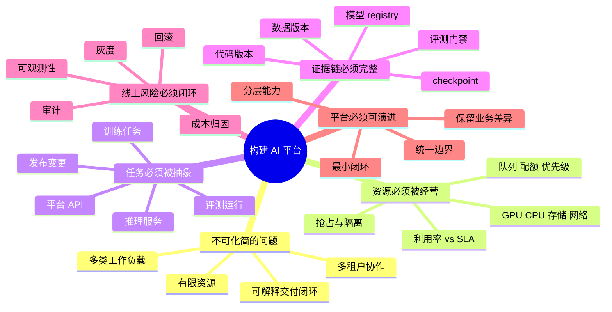

# 第24章：构建一个 AI 平台

> 真正理解 AI Infra 的标志，不是你记住了多少组件名，而是你能把前面学到的资源、训练、推理、治理重新组装成一个可解释、可落地、可演进的系统。

> **关联章节**：本章不是新知识点堆叠，而是把 [第18章](../part6-platform-and-orchestration/18-containers-and-runtime.md) 到 [第23章](../part7-reliability-security/23-security-isolation-and-governance.md) 收束成一个平台蓝图。

## 1. 第一性原理拆解 + 学习大纲

### 拆 — 不可化简的问题

剥离 Kubernetes、model registry、feature store、gateway、queue、observability 这些名字以后，AI 平台要解决的不可化简问题只有一个：组织里有多种 AI 工作负载、多类用户和有限资源，它们都在持续变化，但业务仍然要求模型从数据到训练、评测、发布、观测、回滚形成可解释、可重复、可治理的交付闭环。所谓平台，不是把工具堆在一起，也不是给每个团队发一个统一入口页，而是把“人、代码、数据、模型、资源、请求、风险”放进同一套因果链路里，让每一次训练为什么排队、每一个模型为什么能上线、每一次故障为什么能回滚、每一笔 GPU 成本为什么属于某个租户，都有证据可查。

这也是本章和前面章节的关系：前面每章都在解决一个局部瓶颈，例如 GPU 显存、通信拓扑、checkpoint 恢复、推理 batching、租户隔离、可观测性和安全治理；本章要做的是把这些局部机制重新组合成平台级判断。平台工程师面对的不是“该不该用某个组件”，而是“在当前组织规模、模型类型、资源预算和风险边界下，哪些约束必须被产品化，哪些灵活性应该留给用户”。如果这个问题没有先拆清楚，平台很容易变成两种失败形态：要么只是 UI 包装，底层数据版本、模型版本、评测结果和发布记录互相断裂；要么过早大一统，把研究、微调、RAG、在线推理这些差异很大的工作负载强行塞进同一种流程，最后既不敏捷，也不可治理。

### 推 — 从这个问题如何推导出每个机制

从“有限资源上的可治理交付闭环”出发，平台机制会自然出现。首先，资源是有限的，所以必须有资源池、队列、配额、优先级和抢占规则，否则训练任务、批处理任务和在线服务会彼此挤占，SLA 只能靠人工协调。其次，用户真正想提交的不是 Pod，而是训练、评测、发布、推理服务这类任务，所以平台需要任务级 API，把底层容器、镜像、节点选择、存储挂载、网络策略翻译成可审计的工作流。再次，模型输出能不能被信任，取决于输入证据链是否完整，因此需要数据版本、代码版本、实验追踪、checkpoint、模型 registry 和评测门禁，把“这个模型从哪里来”回答清楚。

继续往后推，模型上线之后风险会从“能不能训练出来”转成“能不能稳定服务业务”。因此平台必须包含推理网关、灰度、回滚、SLO、日志、指标、trace、质量采样和成本归因；没有这些，训练平台再强，也无法解释线上延迟上升、命中率下降或成本突增。再往组织层面推，多团队共享平台必然带来差异：研究团队要灵活，业务团队要稳定，平台团队要可维护，安全团队要审计。于是平台边界不能只靠统一组件，而要靠统一证据、统一控制点和分层抽象：资源层保证可调度，运行层保证可执行，工作流层保证可追踪，运营层保证可治理。工程边界也由此确定：中型团队的第一版平台不应追求全自动、全场景、全自研，而应先把一条端到端链路打通，例如训练 Job -> checkpoint -> registry -> 评测 -> staging -> 灰度 -> 回滚 -> 反馈，再围绕这条链路逐步扩展。

### 绘 — 因果链路



### 导 — 读完本章你应该能回答

1. 如果不提任何具体工具名，一个 AI 平台最小要保证哪条端到端闭环成立？
2. 为什么平台 API 应该面向训练、评测、发布和推理任务，而不是直接暴露底层 Pod、PVC 和节点选择？
3. 在中型团队里，哪些边界必须统一，哪些细节应该允许业务或研究团队保留差异？
4. 当 GPU 利用率、在线 SLA、研发交付速度和合规审计发生冲突时，平台应该按什么顺序显式取舍？
5. 一个模型从训练到上线需要留下哪些证据，才能支持复现、回滚、审计和成本归因？
6. 为什么“只做 UI”或“只重训练”都不能构成真正的平台能力？
7. 如果只能建设第一版平台，你会选择哪一个最小闭环作为起点，如何判断它已经可用？

## 学习目标

完成本章学习后，你将能够：

1. 把训练、数据、推理、平台、治理串成完整蓝图
2. 学会围绕目标业务、团队规模与资源约束做系统设计
3. 识别平台设计中最关键的取舍：统一性 vs 灵活性、利用率 vs SLA、建设速度 vs 长期治理
4. 形成从需求 -> 架构 -> 运行规则 -> 风险控制的表达能力
5. 设计一个适合中型团队的 AI 平台最小闭环

---

## 正文内容

### 24.1 先定义“平台要解决什么”

平台设计最容易犯的错误，是一开始就讨论组件：

- 要不要上 Kubernetes
- 要不要自建 model registry
- 要不要接向量数据库
- 要不要做统一网关

这些问题都重要，但它们是第二层问题。第一层问题应该是：

1. 平台主要服务训练、推理，还是两者兼有？
2. 主要租户是谁：算法团队、业务团队、平台团队，还是外部客户？
3. 最敏感的是延迟、成本、交付速度还是合规性？
4. 团队现在最痛的点到底是什么：排队、部署、回滚、观测，还是账单？

如果没有这些约束，平台设计很容易变成名词堆砌。

### 24.2 一个中型团队的最小 AI 平台蓝图

你可以把一个中型团队的 AI 平台抽象为如下模块：

```text
开发者入口
  -> 数据与特征管理
  -> 训练任务提交
  -> 实验追踪与制品管理
  -> 评测与发布门禁
  -> 在线推理网关
  -> 可观测性 / 审计 / 成本面板
```

背后的基础设施包括：

- GPU / CPU / 存储 / 网络资源池
- 容器与运行时
- 队列、配额、优先级与抢占规则
- 对象存储、模型仓库、索引存储
- 推理引擎与服务路由
- 监控、日志、trace、质量评测与审计系统

关键在于：这些不是平铺组件，而是一条端到端交付链路。

#### 24.2.1 平台 API 设计原则

平台 API 为什么值得单独讲？因为很多平台一开始把底层资源对象直接暴露给用户，结果用户学会的是“怎么申请 GPU Pod”，而不是“怎么提交训练、评测、发布任务”。

| 更好的 API 入口 | 不够好的 API 入口 | 背后的平台原则 |
|------|------------------|----------------|
| 提交训练任务 | 直接申请一组裸 Pod | 用户面向任务，平台面向资源翻译 |
| 创建评测运行 | 让用户自己拼 Job、PVC、环境变量 | 把标准工作流做成产品接口 |
| 发布模型版本 | 让用户手工改 Deployment 和路由 | 隐藏调度细节，保留治理钩子 |

对平台团队来说，一个健康的 API 应尽量屏蔽节点选择、调度插件、Pod 模板这些底层细节，同时保留可审计、可回滚、可配额的控制点。否则控制面会被资源细节反噬。

### 24.3 把前面章节映射到平台组件

如果把本教程前面的能力映射到平台蓝图，可以得到：

| 能力来源 | 平台组件含义 |
|----------|--------------|
| 第1-3章 | 资源与链路边界：知道系统到底在解决什么 |
| 第4-6章 | 硬件与运行时底座：知道算力、互联、内存为什么会成为上限 |
| 第7-10c章 | 训练、后训练与微调基础设施：知道训练任务、同步、恢复、对齐与 adapter 服务如何设计 |
| 第11-13章 | 数据与制品：知道数据、模型、embedding、cache 如何管理 |
| 第14-17章 | 推理服务与多租户：知道延迟、吞吐、显存、成本如何平衡 |
| 第18-20章 | 平台编排：知道容器、K8s、队列、配额、autoscaling 如何协同 |
| 第21-23章 | 治理与可靠性：知道观测、发布、审计、安全和 incident 如何闭环 |

这个映射很重要，因为它说明：

> AI 平台不是一个新工具，而是把多个系统能力收束成统一交付面。

### 24.4 设计顺序：不要从最难的地方开始

一个实用设计顺序可以是：

1. **业务目标**：要支持哪些模型和工作流
2. **核心链路**：数据怎么流、请求怎么流
3. **最稀缺资源**：GPU、网络、存储、工程人力哪个最紧张
4. **任务调度规则**：谁优先、谁保底、谁可抢占
5. **发布与回滚**：模型如何上、如何下、如何止损
6. **观测与账单**：谁看得到、谁解释得清

这个顺序背后的原则是：先保证平台能形成闭环，再追求高级自动化。

### 24.5 一个最小闭环的端到端流程

```text
1. 用户提交训练 Job
2. 平台做资源准入与队列排队
3. 训练任务读取数据版本并运行
4. checkpoint、日志、指标写入统一系统
5. 模型进入 registry
6. 评测任务运行并给出门禁结果
7. 通过门禁的模型进入 staging
8. 小流量灰度并观测系统 / 质量 / 成本
9. 放量或回滚
10. 线上反馈进入下一轮数据与训练
```

如果这个闭环可追踪、可恢复、可审计，平台就已经具备了真正的基础设施价值。

### 24.6 平台设计中的关键取舍

#### 24.6.1 统一性 vs 灵活性

统一镜像、统一 job 模板、统一 registry 能提升治理，但也可能限制研究灵活性。  
早期平台应尽量统一关键边界，而不是统一所有细节。

#### 24.6.2 利用率 vs SLA

把所有 GPU 都压满，可以降低单位成本；但在线服务需要余量，训练任务需要可预测排队。  
因此平台不应只追求“利用率最高”，而应按工作负载类型分层经营。

#### 24.6.3 建设速度 vs 长期复杂度

过早做大一统平台会带来高维护成本；完全不做规范则会让组织后期陷入混乱。  
更现实的策略是：围绕最痛问题建设“最小闭环”，再逐步平台化。

### 24.7 一个简单的能力分层

你可以把平台能力分成四层：

### 第 0 层：资源层

- GPU / CPU / 存储 / 网络
- 节点池、拓扑、镜像基线

### 第 1 层：运行层

- 容器运行时
- 训练任务抽象
- 推理服务模板
- 队列与配额

### 第 2 层：工作流层

- 数据版本
- 实验追踪
- 模型 registry
- 评测门禁
- 发布与回滚

### 第 3 层：运营层

- 可观测性
- 审计
- 成本归因
- SLA / SLO
- incident response

这个分层的好处是：你可以清楚判断一个需求到底是在补“资源问题”、还是在补“工作流问题”。

### 24.8 平台最容易失败的地方

### 失败一：只做 UI，不做底层证据链

界面很漂亮，但模型版本、数据版本、评测结果、回滚路径都不连通。  
这种平台很快就会沦为“另一个入口页”。

### 失败二：只重训练，不重发布和观测

很多团队训练能力很强，但上线和运营能力很弱。结果是：

- 模型很多
- 真正稳定跑在线上的很少
- 每次发布都像人工冒险

### 失败三：只追求统一，不尊重业务差异

推荐、RAG、分类、生成服务对延迟、批处理、缓存、隔离的要求差异很大。  
平台应统一边界和治理规则，而不是强迫所有工作负载使用同一套最优解。

### 24.9 一个演进路线图

### 阶段一：规范化

- 统一训练 Job 入口
- 统一镜像基线
- 统一模型与数据命名

### 阶段二：闭环化

- 实验追踪
- registry
- 发布门禁
- 监控与回滚

### 阶段三：平台化

- 队列、配额、租户隔离
- 服务模板
- 成本归因
- incident 流程

### 阶段四：高阶化

- 多地域
- RAG / 向量基础设施
- 智能调度
- 自动容量与质量优化

这条路线的核心不是“越快越好”，而是每一阶段都能解决真实问题。

#### 24.9.1 多区域 / 多集群平台

当平台规模继续扩大，单集群设计会逐步碰到边界：不同区域的时延、数据主权、容量池差异和故障域都会开始主导架构。

| 挑战 | 为什么会出现 | 平台侧常见处理 |
|------|--------------|----------------|
| 统一调度视图 | 资源分散在多个集群，单集群队列不再够用 | 做上层全局控制面，底层按集群执行 |
| 数据就近与合规 | 数据、模型和索引跨区复制成本高，还可能受合规约束 | 按区域放置数据和模型副本，尽量本地训练 / 本地服务 |
| Checkpoint / 制品跨区同步 | 大模型 checkpoint 太大，跨区同步慢且贵 | 区分热恢复副本与冷备副本，减少全量同步频率 |

这类平台通常不追求“所有集群像一个集群一样透明”，而是追求：**统一入口、局部自治、跨区故障可解释。**

### 24.10 结课后的两种能力

学完本教程后，你应该形成两种核心能力。

### 第一种：诊断能力

看到训练或推理问题时，你能快速判断：

- 是算力问题、存储问题、网络问题还是调度问题
- 是资源不足、资源浪费，还是规则设计出了问题

### 第二种：架构能力

面对一个 AI 业务需求时，你能从以下维度组织方案：

- 资源
- 链路
- 平台
- 治理
- 风险

而不是只会堆组件名。

---

## 本章小结

| 维度 | 关键问题 |
|------|----------|
| 目标 | 平台到底服务谁、解决什么痛点 |
| 资源 | 稀缺资源是什么，如何组织 |
| 工作流 | 从数据到训练到发布到推理是否闭环 |
| 治理 | 是否可观测、可回滚、可审计、可归因 |
| 演进 | 是不是围绕真实瓶颈逐步建设 |

## 练习题

1. 为一个 3 个团队共享 GPU 的平台画出高层架构图。
2. 如果你的业务以在线推理为主，平台设计的优先级应如何调整？
3. 试用本教程的框架分析一个你熟悉的 AI 系统。
4. 请为一个中型团队写出 AI 平台的三阶段建设路线图。
