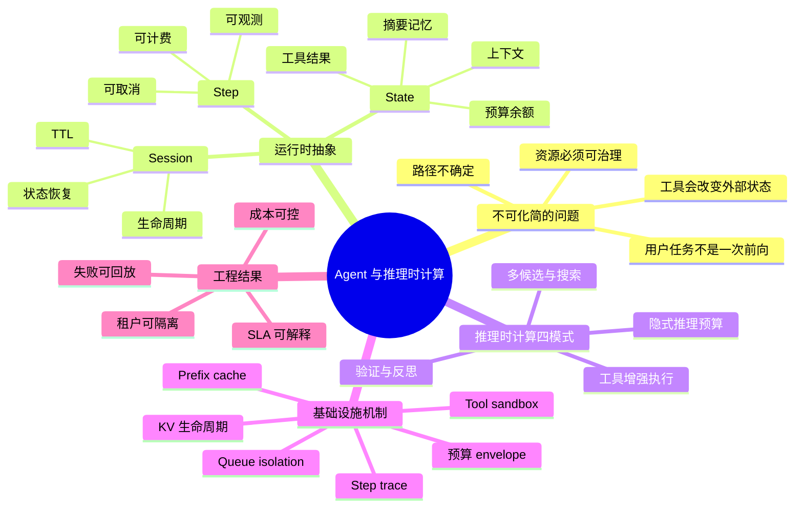

# 第25章：AI Agent 与推理时计算基础设施

> 模型进入 agent 阶段后，平台要管理的就不只是“一次推理”，而是一段带预算、带工具、带回退条件的计算过程。

> **关联章节**：本章把 [第13章](../part4-data-and-storage/13-feature-vector-and-cache.md) 的检索与缓存、[第14章](../part5-serving-infra/14-online-inference-architecture.md) 的在线链路、[第17章](../part5-serving-infra/17-multitenancy-and-cost.md) 的成本治理收束到同一个问题上：什么时候值得在推理时多花算力。

## 1. 第一性原理拆解 + 学习大纲

### 拆 — 不可化简的问题

把 Agent、tool use、thinking model、inference-time compute 这些名字都拿掉，本章只剩一个不可化简的问题：**一次用户任务不再等于一次模型前向，而是一段会持续消耗资源、改变外部状态、并在不确定路径上寻找可接受结果的计算过程；平台怎样让这段过程可调度、可计费、可隔离、可观测、可停止？**

传统在线推理的基础抽象是 request。request 有输入 token、输出 token、队列等待、prefill、decode、streaming、结束。它的容量估算可以粗略落在 `QPS x latency` 或 `concurrency x tokens/s` 上，成本也可以近似按 input/output token 计价。但 agent 任务的真实单位更接近 session：用户提出一个目标，系统先规划，再调用检索、工具或代码执行环境，拿到观察结果后继续推理，必要时生成多个候选、做验证、重试、压缩上下文，最后才给出答案。这个过程可能只用 2 次模型调用，也可能走到 8 步、20 次工具请求、几十秒 wall-clock 时间。基础设施的难点不是“模型能不能调用工具”，而是每一步都可能占用 GPU、KV Cache、工具池、网络连接、credential、trace 存储和租户预算。

因此，本章的第一性问题不是“如何写一个 agent prompt”，而是“如何把开放式计算过程重新变成工程系统能治理的对象”。如果没有预算，agent 会把一次难题扩展成无上限搜索；如果没有停止条件，失败会表现成循环、超时或账单失控；如果没有信任边界，工具调用会把提示注入、越权访问和副作用带进生产链路；如果没有 step trace，平台只能看到最后失败，却无法知道预算花在 planning、retrieval、verifier 还是重试上。Agent 基础设施的核心，是把“多想几步”翻译成明确的资源合同：最多多少 reasoning tokens、多少 GPU-second、多少模型调用、多少工具 wall time、哪些工具可用、何时降级、如何结算。

### 推 — 从这个问题如何推导出每个机制

从“开放式计算必须可治理”出发，几个机制几乎是被迫出现的。首先，request 抽象不够用，所以要引入 session、step 和 state。session 表示一次用户目标的生命周期，step 表示可计费、可观测、可取消的最小运行单元，state 表示上下文、工具结果、摘要、KV 复用线索和预算余额。没有这三层，平台无法回答“这次任务现在卡在哪里”“还能不能继续”“继续会花多少钱”。

其次，推理时计算不能只理解为 thinking tokens。额外算力可能花在模型内部的隐式推理，也可能花在多候选采样、树搜索、verifier 复核、retrieval、代码解释器、浏览器和外部 API。它们共同目标都是用更多 inference-time compute 换更高任务成功率，但资源形态不同：token 型压力主要放大 decode；分支型压力放大并发与峰值 GPU；工具型压力放大 wall-clock、恢复 prefill 和外部依赖；验证型压力则引入额外队列和反压。所以平台必须把推理时计算泛化成 4 类工程模式，而不是只暴露一个 `max_thinking_tokens`。

第三，成本模型从 token 计费扩展到预算 envelope。一次 agent session 进入运行时前，控制面要根据租户、任务类型、SLA、风险等级生成预算：总 token、reasoning token、GPU-second、模型调用次数、工具调用次数、工具 wall time、session TTL、最大步骤数。每一步开始前做 reservation，执行中流式扣减，结束后 settle，失败时记录原因。预算耗尽也不能随机断流，而要按“停止扩展分支 -> 降低候选数 -> 截断隐式推理 -> 压缩上下文或切小模型 -> 返回 partial result / 人工接管”的顺序降级。

第四，Agent runtime 和推理服务必须分工。vLLM、TRT-LLM、SGLang 这类 serving engine 负责单次模型调用的 batching、prefill、decode、KV block、prefix cache；Agent runtime 负责任务拆分、工具执行、状态管理、预算扣减、安全边界和 step trace。把整个 session 塞进一个超长请求会破坏调度效率，也会让工具等待期间 GPU 无法高效复用。更合理的映射是：长 session 被拆成多次短模型调用，中间由 runtime 挂起、恢复、压缩、回注观察结果，并把可复用前缀交给推理服务命中 cache。

第五，工具调用要求先定义信任边界，再谈优化。检索、浏览器、代码执行、数据库、工单系统和写操作 API 都不只是“模型能力增强”，它们会把外部世界接入推理循环。平台必须明确工具白名单、参数 schema、沙箱、scoped credentials、egress 限制、审批门、幂等 retry key 和审计日志。否则，一个预算控制完美但权限全开的 agent，仍然不可运营。

### 绘 — 因果链路



### 导 — 读完本章你应该能回答

1. 为什么 agent 的容量规划不能只用 `QPS x request latency`，而要转向 session、step、模型调用次数和工具等待时间？
2. `thinking tokens`、多候选采样、verifier、tool use 都属于 inference-time compute，但它们分别把压力施加到哪些资源上？
3. 一个生产级 agent runtime 至少需要哪些预算字段？这些预算应该在 prompt、网关、scheduler 还是 billing/quota 服务里执行？
4. 为什么长 session 不应该直接映射成 serving engine 里的一个超长请求？Agent runtime 与 vLLM / TRT-LLM / SGLang 的边界应如何划分？
5. 工具调用型 agent 的 trust boundary 应该先定义哪些内容？为什么 scoped credential、sandbox 和 approval gate 比 prompt 约束更可靠？
6. 当预算耗尽或 verifier 连续失败时，怎样设计有序降级，而不是让用户看到随机超时、断流或无限循环？
7. 如何判断一个任务是否值得多花 2-5 倍推理时计算：看 token 成本、GPU-second、人工返工率、成功率还是 SLA？

## 2. 学习目标

完成本章学习后，你将能够：

1. 区分 agent、tool use 和 inference-time compute 的边界
2. 理解为什么“多想几步”会直接改变 serving 架构与成本模型
3. 设计一个最小可运营的 agent loop
4. 为 agent 系统设置预算、停止条件和回退策略
5. 判断什么时候值得把更多算力放到推理时，而不是训练时

---

## 3. 正文内容

### 25.1 从基础设施视角看 Agent 和 Thinking Model

如果你已经理解了 Ch 14-17 的推理系统设计，那么 Agent 和 Thinking Model 会从三个方向打破你的假设：会话持续时间、token 消耗可预测性、并发模型。

| 被打破的假设 | 传统在线推理的近似 | Agent / Thinking Model 下的新现实 | 基础设施含义 |
|--------------|--------------------|-----------------------------------|--------------|
| 会话持续时间 | 请求通常在一次生成内结束 | 一个任务可能持续数十秒到数分钟，中间多次挂起、恢复、调用工具 | 需要 session state、step trace、显式关闭和空闲回收 |
| token 消耗可预测性 | 输出长度大致可由 `max_tokens` 控制 | 隐式推理、候选采样、验证和上下文回注会让 token 与 GPU 时间同时波动 | 需要预算 envelope、动态降级和按步骤记账 |
| 并发模型 | 容量主要看 QPS、batch size、单请求延迟 | 容量取决于并发 session、每个 session 的模型调用次数和工具等待时间 | 调度器要同时管理 GPU 队列、工具池和长上下文缓存 |

因此，本章不重复介绍 Agent 的概念，而是关注它进入服务化系统后带来的运行时治理问题：怎样把一段多步、不确定、会调用外部环境的计算过程，映射回可以调度、计费、隔离和观测的基础设施对象。

### 25.2 从 QPS 到 Session 的并发模型

传统推理系统常把压力近似成：

```text
QPS x request latency
```

但 agent 更接近：

```text
concurrent sessions x session duration x model calls per session
```

因为一个用户任务可能持续数十秒到数分钟，并在中途多次挂起、恢复、调用工具和继续思考。平台如果还只按短请求 QPS 估容量，就会低估会话态、KV 生命周期和工具执行池的占用。

一个更贴近容量规划的拆法是：

```text
active_gpu_work = concurrent_sessions
                x avg_model_calls_per_session
                x avg_gpu_seconds_per_call
                / avg_session_wall_time

tool_pool_concurrency = concurrent_sessions
                      x avg_tool_calls_per_session
                      x avg_tool_wall_time
                      / avg_session_wall_time
```

这个公式故意把 GPU 工作和工具工作拆开。工具等待期间 GPU 不应被 session 独占；但 state、预算、trace 和权限 token 仍然存在。因此 runtime 必须支持挂起和恢复。

**工程边界**：session 并发不是 GPU 并发。一个 10,000 并发 session 的系统，如果每个 session 平均只有 15% 时间在模型 decode，其 GPU 活跃并发可能远低于 10,000；但 metadata store、trace pipeline、tool worker 和 KV/prefix cache 的压力可能先到瓶颈。

### 25.3 推理时计算的 4 种工程模式

训练时算力是为了把能力写进参数；推理时算力是为了在具体问题上多做搜索、采样、验证、复核或外部动作。`thinking tokens` 只是其中一种表现形式。更通用的定义是：任何在推理阶段为了提高任务成功率而主动消耗额外计算的技术。

一个粗略表达可以写成：

$$
t_{\text{answer}} \approx \sum_{i=1}^{N_{\text{steps}}} \left(t_{\text{model}, i} + t_{\text{search}, i} + t_{\text{tool}, i} + t_{\text{verify}, i}\right)
$$

agent 的单位成本通常不再与“一次生成多少 token”线性对应，而与“走了多少步、扩展多少候选、调用多少工具、复核几次”一起决定。工程上可归为 4 种模式：

| 模式 | 典型技术 | 主要收益 | 主要成本 | 调度影响 | 预算控制 |
|------|----------|----------|----------|----------|----------|
| 隐式推理预算 | Chain-of-Thought、thinking tokens、deliberation | 难题上提高单路径质量 | reasoning tokens、decode 时间、长尾输出 | 单请求 decode 变长，batch 内尾部拖慢 | `max_reasoning_tokens`、按 token 流式扣减、接近阈值触发 finalizer |
| 多候选与搜索 | Best-of-N、self-consistency、beam/tree search | 用多路径提高命中率，适合数学、代码、规划 | 候选数近似 `N` 倍，树搜索可能随深度膨胀 | 并行分支制造 GPU burst，串行分支制造尾延迟 | `max_candidates`、`max_branch_depth`、分支优先级、早停 |
| 验证与反思 | verifier-guided generation、critic、rerank、unit test | 把“生成答案”改成“生成 + 判断” | verifier 模型调用、测试执行、失败重试 | 生成队列和验证队列互相反压 | `max_verify_rounds`、独立 verifier 队列、失败阈值 |
| 工具增强执行 | Retrieval、browser、code interpreter、DB/API call | 接入外部事实、执行动作、降低模型记忆压力 | tool wall time、回注 token、权限与审计成本 | GPU 工作被工具等待打断，恢复时可能重新 prefill | `max_tool_calls`、`max_tool_wall_time`、工具白名单、结果大小上限 |

4 种模式可以组合。例如代码修复 agent 可能先规划，再采样 3 个 patch，运行测试作为 verifier，最后调用版本控制工具。但组合越多，成本乘法越明显。平台应把每种额外计算的预算独立化。

**工程边界**：thinking tokens 可由模型或 API 暴露，也可能是隐藏计费项；Best-of-N 能并行加速但会抬高瞬时 GPU 峰值；verifier 如果和主模型共用队列，可能在高失败率时反压所有请求；工具增强执行的最大风险往往不是 token，而是权限、超时和不可幂等副作用。

### 25.4 推理预算工程实现

agent 成本模型不能只看平均 tokens，通常要同时支持三类计费口径：

| 计费模型 | 适用场景 | 优点 | 风险 |
|----------|----------|------|------|
| input + output + reasoning token | API 型模型服务、简单 chat、thinking model | 易理解，和传统 serving 兼容 | 难表达工具等待、搜索分支和 GPU 空转 |
| GPU-second | 自建推理集群、高成本 search / verifier 任务 | 贴近真实资源消耗，适合容量治理 | 需要准确归因到 request、tenant 和 session |
| session / task | 长任务 agent、企业套餐、异步工作流 | 对用户更稳定，方便设置任务级 SLA | 如果内部预算缺失，平台可能承担长尾成本 |

工程上应把预算管理放在控制面，而不是只写在 prompt 里。一次请求进入 agent runtime 时，控制面先生成预算 envelope，并在每一步扣减：

```text
1. classify: 识别 tenant、任务类型、风险等级、SLA tier
2. quote: 生成预算 envelope，返回预估成本和可用策略
3. reserve: 每个 step 开始前预占 token / GPU-second / tool quota
4. execute: runtime 调用模型或工具，流式上报消耗
5. settle: step 结束后按真实消耗结算，多退少补
6. decide: 根据剩余预算、verifier 结果和 stop condition 决定继续或结束
7. degrade: 预算不足时按策略降级，记录可解释原因
```

| 预算字段 | 执行位置 | 工程实现 | 超预算时的降级策略 |
|----------|----------|----------|--------------------|
| `max_reasoning_tokens` | 模型网关 / decoder | hidden 或 visible reasoning token 流式计数，接近阈值触发 stop sequence 或 finalizer | 截断隐式推理，要求基于当前中间状态给出最短可用答案 |
| `max_output_tokens` | 模型网关 | 与传统 serving 一致，限制最终可见输出 | 改用摘要式输出，附上“不完整”状态 |
| `per_step_gpu_second_budget` | scheduler | 记录 prefill、decode、verifier、rerank 的 GPU 时间，按 step 归因 | 停止扩展新分支，切小模型 summarizer |
| `max_model_calls_per_session` | agent runtime | 对 planner、executor、verifier、finalizer 调用做 step counter | 跳过下一轮反思，直接 final answer 或人工接管 |
| `max_tool_wall_time` | tool runner | 每次调用设置 timeout、取消令牌和幂等 retry key | 返回工具不可用的可解释失败，禁止无限重试 |
| `max_context_tokens` | agent runtime / gateway | 控制历史、工具结果、摘要和检索片段总量 | 触发 summarization、state extraction 或丢弃低价值观察 |
| `tenant_budget_remaining` | billing / quota 服务 | 每步前 reservation，完成后 settle，失败要释放未用额度 | 降级到低预算策略、切小模型、拒绝非关键工具调用 |

预算耗尽不应表现成随机断流。推荐降级顺序是：停止新增搜索分支 -> 降低候选数和 verifier 轮数 -> 截断隐式推理 -> 压缩上下文或切小模型 -> partial result / 人工接管。

**工程边界**：预算系统不能依赖模型“自觉遵守”。prompt 可以提示模型节省步骤，但真正的上限必须由 gateway、scheduler、tool runner 和 quota 服务强制执行。跨服务 reservation 要处理并发扣减和失败释放，否则高并发 agent 会把租户预算打成负数或制造虚假拒绝。

### 25.5 Agent / 推理服务集成

Agent session 不是 vLLM / TRT-LLM / SGLang 里的一个超长请求。更常见的映射是：

```text
agent session
  -> model call 1: plan
  -> tool call / retrieval
  -> model call 2: observe + continue
  -> verifier call
  -> model call 3: final answer
```

也就是说，长 session = 多次推理调用 + context 管理。推理服务仍然处理一批批 prefill / decode 请求，但 agent runtime 要负责把 session state、工具结果、摘要记忆和预算状态拼回下一次模型调用。

| 集成点 | Agent runtime 负责 | 推理服务负责 | 关键风险 |
|--------|--------------------|--------------|----------|
| 请求拆分 | 把一次任务拆成 planner / executor / verifier / finalizer 多次调用 | 对每次调用做 batching、prefill、decode、streaming | 拆分过细会增加 prefill 成本和调度开销 |
| Context 管理 | 决定保留原文、摘要、工具结果还是结构化状态 | 承载本次请求的 prompt 和 KV | 回注过多会让上下文线性膨胀 |
| Prefix caching | 标记可复用的 system prompt、工具说明、策略前缀 | 复用相同前缀的 KV / prefix cache | 前缀失配会让 cache 命中率下降 |
| KV Cache 生命周期 | 按 session close、idle timeout、priority 管理缓存保留意图 | 分配、驱逐和复用 KV block | 长 session 占住 KV 会挤压短请求吞吐 |
| Queue isolation | 给 planner、finalizer、verifier、summarizer 标注优先级 | 在不同队列或优先级中调度 decode | verifier 风暴可能拖慢高优用户请求 |
| Tool calling 执行环境 | 在沙箱中执行工具，设置超时、权限、网络和文件边界，并把结果回注给下一轮模型 | 不直接执行工具，只接收回注后的 prompt | 工具结果未过滤会扩大提示注入和数据泄露风险 |

这也是它与 [第15章](../part5-serving-infra/15-batching-scheduling-kv-cache.md) KV Cache 的直接关系：长 context 不只是 prompt 变长，还会让 KV Cache 变成 session 级资源。平台需要 prefix caching 降低重复 prefill，需要 KV 生命周期管理避免长会话挤占共享池，还需要在工具结果回注前做大小限制和安全过滤。

**工程边界**：不要让推理服务理解所有业务工具，也不要让 agent runtime 绕过推理服务直接占 GPU。前者会让 serving engine 被业务语义污染，后者会绕开 batching、KV 管理和配额。清晰边界是：runtime 管流程和状态，serving engine 管模型执行，quota/billing 管预算，tool runner 管外部动作。

### 25.6 长会话状态、上下文压缩与流式中间结果

agent 系统里，context window 不再只是“一段越来越长的聊天记录”，而是一份要持续被治理的运行时状态。

| 问题 | 平台要回答什么 | 常见做法 |
|------|----------------|----------|
| 会话状态保留多久 | KV / memory 是秒级、分钟级还是任务级 | 分层 TTL、显式 session close、空闲回收 |
| 上下文何时截断 | 哪些历史必须保留，哪些可以丢弃 | 基于窗口上限做 truncation |
| 上下文何时压缩 | 历史太长时是否转摘要或结构化记忆 | summarize / distill / state extraction |
| 中间结果如何返回 | 是只回最终答案，还是流式返回步骤进度 | streaming token + step event + final bundle |

如果没有这层治理，agent 很容易同时出现三类问题：上下文无限变长、KV 生命周期失控、前端和监控只能看到最后一句答案却看不到中间失败。

**工程边界**：摘要不是无损压缩。审计、复现、计费依赖原始 step trace；下一轮模型调用可以只用摘要或结构化状态。

### 25.7 一个最小 agent loop

一个最小但可运营的 agent loop，通常至少包含：

```text
user request
  -> planner
  -> tool / retrieval / executor
  -> verifier
  -> stop or continue
  -> final answer
```

每一步都要可解释：

| 环节 | 主要职责 | 平台关注点 |
|------|----------|------------|
| Planner | 决定先做什么 | 是否有最大步数与任务边界 |
| Executor | 调工具、跑检索、写中间结果 | 超时、权限、幂等性 |
| Verifier | 判断结果是否可接受 | 是否会无限循环、是否能给出失败理由 |
| Finalizer | 组织最终输出 | 是否保留审计轨迹与引用来源 |

### 25.8 Planner、Executor、Verifier 为什么要分开

把三者混在一个 prompt 里当然可以跑，但平台很难治理。

| 角色 | 如果职责不清会怎样 | 分开后的平台收益 |
|------|--------------------|------------------|
| Planner | 一边规划一边执行，步骤不可审计 | 易限制最大步数与工具白名单 |
| Executor | 工具调用和答案生成混在一起 | 易做超时、重试、幂等与权限控制 |
| Verifier | 失败时继续盲试 | 易设置 stop condition 与人工接管 |

这不意味着一定要三模型三服务。重点是运行时语义上要能区分三类动作。

### 25.9 Tool use 与 retrieval 会怎样改写 serving

一旦引入工具和检索，在线推理链路会从“单模型调用”变成“多跳依赖图”。

| 新增对象 | 平台含义 | 对应章节 |
|----------|----------|----------|
| Retrieval | 召回、缓存、权限过滤进入主链路 | [第13章](../part4-data-and-storage/13-feature-vector-and-cache.md) |
| Tool API | 外部服务变成推理步骤的一部分 | [第14章](../part5-serving-infra/14-online-inference-architecture.md) |
| Budget policy | 预算和租户规则直接影响能走几步 | [第17章](../part5-serving-infra/17-multitenancy-and-cost.md) |
| Trace / audit | 需要记录每一步用了什么信息和工具 | [第21章](../part7-reliability-security/21-observability-and-capacity.md) |

所以 agent 不是给模型多接几个 API，而是把“工作流执行”放进了推理面。

### 25.10 Tool use 的信任边界必须先于优化存在

很多团队做 agent 时，先补预算、trace 和 retry，却把真正危险的边界留到最后。这个顺序是反的。对工具调用型 agent 来说，最低限度的控制至少包括：

| 控制项 | 平台要回答什么 | 失效后会怎样 |
|--------|----------------|--------------|
| 工具白名单 | 哪类任务可调用哪些工具 | 模型可能调用高风险或无关工具 |
| 隔离执行环境 | 代码、命令、浏览器是否跑在沙箱内 | 单次任务故障会污染宿主或其他会话 |
| Scoped credentials | 每步拿到的 token 是否只够当前动作使用 | 工具泄露会扩大成租户级事故 |
| Egress 限制 | 能访问哪些网络、文件、设备 | 过度联网或读写会绕过业务边界 |
| Approval gate | 改状态动作是否需要显式批准 | 模型可能在无确认下执行破坏性操作 |

所以更稳妥的设计顺序应是：先定义 trust boundary，再谈多步推理优化。

**工程边界**：只读工具和写工具必须分级。所有有副作用的工具都应该具备审批、幂等 key、回滚方案和审计事件。

### 25.11 预算、停止条件与回退策略

agent 系统最容易失控的地方，不是模型不会思考，而是它会一直思考。

| 控制项 | 常见上限 | 为什么重要 |
|--------|----------|------------|
| 最大步骤数 | 例如 4-8 步 | 防止无限循环和尾延迟失控 |
| 最大工具调用数 | 例如 2-5 次 | 防止外部依赖账单失控 |
| 最大 token 预算 | 输入 + reasoning + 输出合并计 | 防止长上下文任务吞掉共享池 |
| 最大 wall-clock 时间 | 例如 5-20 秒 | 防止单请求拖垮高优流量 |
| 回退路径 | 超预算后切单次回答或人工接管 | 把失败做成可预期行为 |

这些上限应由控制面执行；reservation、settlement 与降级流程见 §25.4。

### 25.12 什么时候 inference-time compute 真值得

不是所有任务都值得把更多算力放在推理时。

| 任务类型 | 更可能值得 | 原因 |
|----------|------------|------|
| 数学、代码、规划 | 是 | 额外搜索和验证能显著提升成功率 |
| 实时问答 / 检索增强 | 视情况 | tool use 通常有收益，但步数不宜太多 |
| 低价值、高 QPS 文本生成 | 否 | 成本放大快于质量收益 |
| 强 SLA 在线客服 | 通常谨慎 | 多步链路容易放大尾延迟 |

实用判断：如果多花 2-3 倍推理成本，不能带来明显更高成功率或更少人工返工，就不值得。

### 25.13 成本与 SLA 怎样一起治理

agent 系统的治理重点不是“平均成本”，而是把高价值请求和低价值请求区分开。

| 治理动作 | 目标 | 常见做法 |
|----------|------|----------|
| 分级服务 | 把高价值任务允许更多步骤 | 关键租户走高预算策略，普通租户走快路径 |
| 两段式回答 | 先给快速草答，再决定是否继续搜索 | 先满足交互感知，再异步补强 |
| Step-level timeout | 控制单步卡死风险 | 每次工具调用与 verifier 都有独立超时 |
| Budget-aware routing | 把复杂任务送到更贵但更强的策略 | 结合租户、任务类型、剩余预算决定 |

这和传统 serving 的差别在于：治理对象从“请求”扩展成了“请求中的一串步骤”。

**工程边界**：SLA 不应只写最终延迟。agent 还需要定义 first token latency、step event 间隔、最终完成时间和异步补偿时间。

### 25.14 工程建议

- 先定义任务成功率，再决定是否引入更多 inference-time compute
- Agent loop 必须有最大步数、最大预算和明确回退路径
- Tool use、retrieval 和 verifier 都要进入 trace，不要只记录最终答案
- 有副作用的工具必须放在白名单、沙箱、scoped credential 和审批门之后
- 对高价值任务和高 QPS 任务使用不同策略，不要让所有请求都走最重路径
- 把 agent 成本拆成模型 cost、工具 cost、人工接管 cost 三部分，才能真正做经营决策

---

## 本章小结

| 主题 | 关键点 |
|------|--------|
| Agent 本质 | 一段带规划、执行、验证和停止条件的推理流程 |
| Inference-time compute | 用更多推理时算力换更高任务成功率，工程上可拆为隐式推理、多候选搜索、验证反思、工具增强执行 4 种模式 |
| 平台难点 | 多步状态、预算控制、工具依赖、成本放大、权限边界 |
| 是否值得 | 取决于任务价值、成功率提升、人工返工减少和 SLA 约束 |
| 治理重点 | 把预算、回退、trace、tool policy 和 quota 做成控制面能力 |

---

## 练习题

1. 从基础设施视角看，Agent 和 Thinking Model 分别会怎样改变会话持续时间、token 消耗可预测性和并发模型？
2. 给定 1,000 个并发 agent session、平均每个 session 6 次模型调用、每次调用平均 1.5 秒 GPU 时间，估算总 GPU-second 需求，并说明还缺哪些容量假设。
3. 为什么 agent 容量规划不能只用 `QPS x request latency`？请和传统在线推理调度做对比。
4. 隐式推理预算、多候选与搜索、验证与反思、工具增强执行 4 种 inference-time compute 模式分别会把成本放大到哪里？
5. 如果一个请求允许 `max_reasoning_tokens=8,000`，但租户剩余预算只够 4,000 个 reasoning tokens，你会如何设计截断和降级策略？
6. 请为一个“数学求解 agent”设计最大步数、最大工具调用数、`per_request_gpu_second_budget` 和回退策略。
7. 为什么 verifier-guided generation 需要把生成队列和验证队列分开限流？
8. Agent session 如何映射到 vLLM / TRT-LLM / SGLang 请求？为什么长 session 不应该直接等同于一个超长推理请求？
9. Tool calling 沙箱至少应该限制哪些资源？请说明超时、权限、网络和文件边界各自防止什么风险。
10. 多 Agent 并发运行时，怎样做租户级资源隔离，避免一个高预算 session 挤占其他短请求？
11. 长 context 与 Ch 15 的 KV Cache 有什么关系？prefix caching 和 KV 生命周期管理分别解决什么问题？
12. 如果一个 agent 系统成功率更高，但单位成本翻了 4 倍，你会如何判断它是否应该上线？
13. 设计一个 Agent 成本预测面板，至少包含 token、GPU-second、工具调用、session 时长和失败重试成本。
14. Agent 执行失败后，哪些步骤适合自动重试，哪些步骤应该直接返回 partial result 或转人工？为什么？
15. 新增：为一个代码修复 agent 设计预算 envelope，至少包含 `max_candidates`、`max_verify_rounds`、`max_tool_wall_time`、`max_context_tokens` 和 `tenant_budget_remaining`。
16. 新增：如果 Best-of-N 从 1 提高到 8，平均成功率从 62% 提高到 78%，但 P95 延迟从 3 秒变成 11 秒，你会怎样决定是否对所有租户开启？
17. 新增：请画出一个 agent runtime 与模型网关、serving engine、quota 服务、tool runner、trace pipeline 的调用链，并标注每一步的预算扣减点。
18. 新增：某 agent 每次失败都会重新调用同一个写操作工具，导致重复创建工单。请设计幂等 key、审批门和 retry 策略。
19. 新增：当 verifier 队列积压导致主模型 GPU 利用率下降时，你会先调整队列隔离、模型路由、验证轮数还是候选数？说明顺序。
20. 新增：给定一个 30 分钟异步研究 agent，哪些状态应该保存到 durable store，哪些只应保留在短 TTL cache 或 KV cache？
21. 新增：请设计一组 dashboard 指标，区分“模型推理成本上涨”“工具依赖变慢”“预算策略过宽”和“上下文压缩失败”四类问题。
