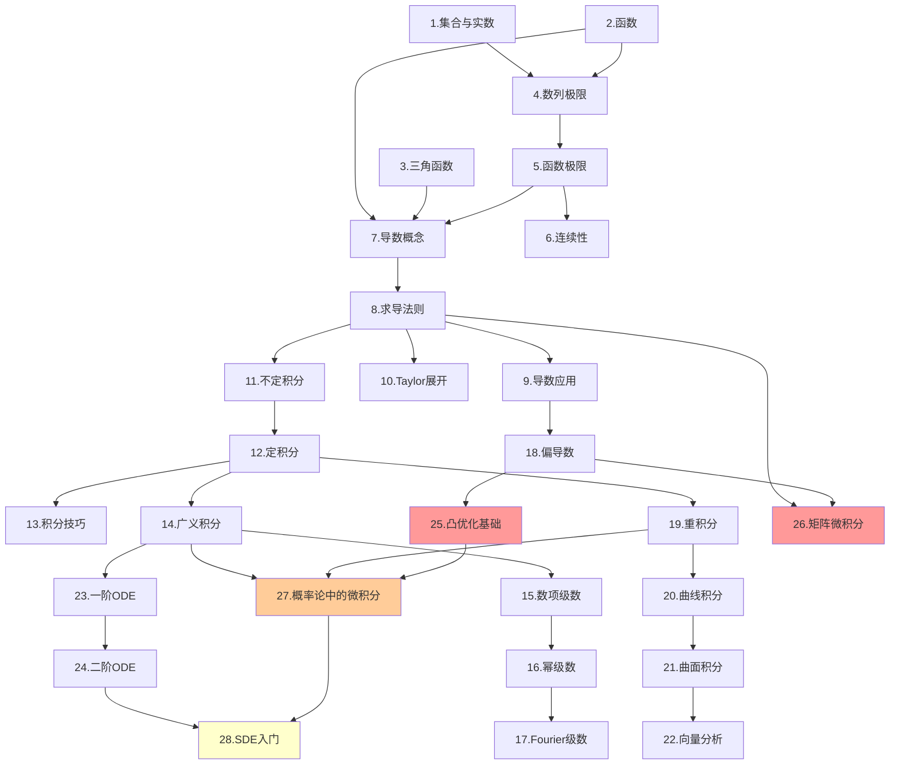

# 从零到 AI 工程的微积分教程

## 项目简介

本教程旨在为学习者提供一套系统、完整、可检索的微积分学习资源：从最基础的集合与实数概念出发，循序渐进地覆盖极限、微分学、积分学、级数、多元微积分与常微分方程，并进一步延伸到 **凸优化、矩阵微积分、概率论中的微积分、随机微分方程** 等 AI 工程核心数学主题。

教程强调三件事：

- **直觉与严格并重**：每个核心概念同时给出几何直观与公式推导
- **练习驱动学习**：全书 28 章、224 道练习，均配详细答案
- **面向 AI 场景**：在 Taylor 展开、Fourier、Hessian、ODE、SDE、KL 散度、自动微分等主题中加入机器学习应用连接

它既可以作为系统学习教程，也可以作为遇到具体 ML 数学问题时的查阅手册。

---

## 目标受众

- 高中生及大学新生，首次系统学习微积分
- 理工科、经济学、计算机科学等专业的在校大学生
- 备考研究生入学考试（考研数学）的学习者
- 希望回顾或巩固微积分基础知识的自学者
- 有编程经验、希望系统补齐 ML 数学基础的 AI 工程师

---

## 章节导航目录

### 开始之前

- [前言：如何使用本教程](./00-preface.md)

### 第一部分：预备知识

| 章节 | 标题 | 主要内容 |
|------|------|----------|
| 第1章 | [集合与实数](./part1-foundations/01-sets-and-numbers.md) | 集合运算、实数系统、区间与邻域、确界原理 |
| 第2章 | [函数](./part1-foundations/02-functions.md) | 函数定义、基本初等函数、函数性质、复合与反函数 |
| 第3章 | [三角函数](./part1-foundations/03-trigonometry.md) | 单位圆定义、三角恒等式、反三角函数 |

### 第二部分：极限与连续

| 章节 | 标题 | 主要内容 |
|------|------|----------|
| 第4章 | [数列极限](./part2-limits/04-sequence-limits.md) | 数列概念、$\varepsilon$-$N$ 定义、极限性质、单调有界定理 |
| 第5章 | [函数极限](./part2-limits/05-function-limits.md) | $\varepsilon$-$\delta$ 定义、极限运算、两个重要极限、无穷小 |
| 第6章 | [连续性](./part2-limits/06-continuity.md) | 连续定义、间断点分类、连续函数性质、一致连续 |

### 第三部分：微分学

| 章节 | 标题 | 主要内容 |
|------|------|----------|
| 第7章 | [导数概念](./part3-differentiation/07-derivative-concept.md) | 导数定义、几何与物理意义、基本导数公式 |
| 第8章 | [求导法则](./part3-differentiation/08-differentiation-rules.md) | 四则运算、链式法则、隐函数、参数方程、高阶导数 |
| 第9章 | [导数的应用](./part3-differentiation/09-applications-derivative.md) | 中值定理、洛必达法则、单调性与极值、凹凸性 |
| 第10章 | [Taylor 展开](./part3-differentiation/10-taylor-series.md) | Taylor 公式、Maclaurin 公式、多元 Taylor、余项估计 |

### 第四部分：积分学

| 章节 | 标题 | 主要内容 |
|------|------|----------|
| 第11章 | [不定积分](./part4-integration/11-indefinite-integral.md) | 原函数、基本积分公式、换元法、分部积分 |
| 第12章 | [定积分](./part4-integration/12-definite-integral.md) | Riemann 积分、微积分基本定理、定积分计算与应用、数值积分 |
| 第13章 | [积分技巧](./part4-integration/13-integration-techniques.md) | 有理函数、三角函数、无理函数积分、特殊技巧 |
| 第14章 | [广义积分](./part4-integration/14-improper-integrals.md) | 无穷积分、瑕积分、收敛判别、Gamma/Beta 函数、参数积分 |

### 第五部分：无穷级数

| 章节 | 标题 | 主要内容 |
|------|------|----------|
| 第15章 | [数项级数](./part5-series/15-number-series.md) | 级数概念、正项级数判别法、交错级数、绝对收敛 |
| 第16章 | [幂级数](./part5-series/16-power-series.md) | 收敛半径、幂级数运算、函数展开、幂级数应用 |
| 第17章 | [Fourier 级数](./part5-series/17-fourier-series.md) | 三角级数、Fourier 系数、收敛定理、Fourier 变换与 FFT |

### 第六部分：多元微积分

| 章节 | 标题 | 主要内容 |
|------|------|----------|
| 第18章 | [偏导数](./part6-multivariable/18-partial-derivatives.md) | 多元函数、偏导数、全微分、方向导数、梯度、Hessian |
| 第19章 | [重积分](./part6-multivariable/19-multiple-integrals.md) | 二重积分、三重积分、换元法、积分应用 |
| 第20章 | [曲线积分](./part6-multivariable/20-line-integrals.md) | 第一类/第二类曲线积分、Green 公式、路径无关 |
| 第21章 | [曲面积分](./part6-multivariable/21-surface-integrals.md) | 第一类/第二类曲面积分、Gauss 公式、Stokes 公式 |
| 第22章 | [向量分析](./part6-multivariable/22-vector-calculus.md) | 场论基础、梯度散度旋度、三大积分定理统一、微分形式入门 |

### 第七部分：常微分方程

| 章节 | 标题 | 主要内容 |
|------|------|----------|
| 第23章 | [一阶微分方程](./part7-ode/23-first-order-ode.md) | 可分离变量、一阶线性、Bernoulli 方程、全微分方程、ODE 系统 |
| 第24章 | [二阶线性微分方程](./part7-ode/24-second-order-ode.md) | 解的结构、特征方程法、待定系数法、振动模型、DDIM-as-ODE |

### 第八部分：AI 微积分扩展

| 章节 | 标题 | 主要内容 |
|------|------|----------|
| 第25章 | [凸优化基础](./part8-ai-calculus/25-convex-optimization.md) | 凸集与凸函数、Jensen 不等式、对偶理论、KKT、SVM 与正则化 |
| 第26章 | [矩阵微积分](./part8-ai-calculus/26-matrix-calculus.md) | Jacobian、迹技巧、矩阵链式法则、反向传播、自动微分 |
| 第27章 | [概率论中的微积分](./part8-ai-calculus/27-calculus-in-probability.md) | PDF/CDF、期望方差、高斯积分、熵、KL 散度、ELBO |
| 第28章 | [随机微分方程入门](./part8-ai-calculus/28-stochastic-differential-equations.md) | Brownian 运动、Itô 积分、Fokker-Planck、扩散模型 |

### 附录

| 附录 | 标题 | 内容说明 |
|------|------|----------|
| 附录A | [公式速查表](./appendix/formula-sheet.md) | 导数、积分、级数、向量分析、矩阵微积分、概率积分公式 |
| 附录B | [符号说明](./appendix/notation-guide.md) | 全书使用的数学符号与 AI 常用记号 |
| 附录C | [练习答案汇总](./appendix/answers.md) | 28 章练习题完整解答、快速索引与统计 |

---

## 学习路径建议

### 路径一：快速入门（约 4-6 周）

适合有一定高中数学基础、希望快速掌握微积分核心内容的学习者：

1. 快速浏览第一部分（预备知识），查漏补缺
2. 重点学习第 4-6 章（极限与连续）和第 7-8 章（导数）
3. 学习第 11-12 章（积分基础）
4. 暂时跳过级数和多元微积分

### 路径二：系统学习（约 3-4 个月）

适合大学一年级新生或备考研究生的学习者：

1. 按章节顺序从头到尾完整学习（第 1-28 章）
2. 每章学完后完成配套练习题
3. 重点强化第 9 章（中值定理与应用）和第 15-17 章（级数）

### 路径三：深度进阶（约 6 个月以上）

适合希望深入理解数学分析、向理论数学进阶的学习者：

1. 完整学习全部章节，包括扩展部分
2. 尝试自行证明各主要定理
3. 结合附录公式表进行系统复习

### 路径四：AI 工程师路径（约 2-3 个月）

适合有编程经验、希望系统补齐 ML 数学基础的 AI 工程师：

**核心路径**（必修，约 6 周）：

1. 第 1-2 章快速浏览（预备知识查漏补缺）
2. 第 4-5 章精读（极限理论，理解梯度的数学定义）
3. 第 7-9 章精读（微分学核心，梯度下降与反向传播的基础）
4. 第 10 章精读（Taylor 展开，理解二阶优化方法）
5. 第 11-12 章精读（积分学，概率密度与期望的数学基础）
6. 第 18 章精读（多元微积分，梯度、Hessian、Lagrange 乘子）
7. 第 25 章精读（凸优化基础，SVM、正则化、ELBO 的框架）
8. 第 26 章精读（矩阵微积分，反向传播与自动微分）

**进阶路径**（选修，约 4 周）：

9. 第 27 章（概率论中的微积分，KL 散度、信息论、变分推断）
10. 第 15-16 章（级数，理解近似与收敛性）
11. 第 23 章与第 23.6 节（ODE 与 Neural ODE）
12. 第 28 章（SDE 与扩散模型）

**专题路径**（按需选修）：

- Fourier 方向：第 3 章 + 第 17 章（含 17.6-17.7） -> 频域分析
- 向量分析方向：第 19-22 章 -> 场论、流与几何直觉
- 方程方向：第 23-24 章 + 第 28 章 -> 动力系统与生成模型

---

## 章节依赖图

---

## 前置要求

学习本教程建议具备以下基础：

- **代数基础**：多项式运算、因式分解、不等式、方程组
- **函数概念**：定义域、值域、图像、奇偶性、单调性
- **三角函数**：六种三角函数定义、基本恒等式、常用值
- **指数与对数**：指数运算规则、对数定义及换底公式

如果上述基础知识有所欠缺，建议先学习 **第一部分：预备知识**。

---

## 如何使用本教程

1. 根据自身目标选择学习路径，而不是机械地从头读到尾。
2. 每节先理解概念与定理，再跟随例题完成推导。
3. 遇到证明、计算与代码片段时，先自己尝试，再对照讲解。
4. 每章完成 8 道练习后，再查看对应答案。
5. 需要查公式、符号、概率积分或矩阵求导时，直接使用附录。

---

## 教程特色

- **28 章完整内容**：从集合与实数一直覆盖到 SDE、凸优化与矩阵微积分
- **224 道练习题**：每章统一为 8 题，均配详细解答
- **AI 导向增强**：新增 4 个 AI 数学章节，并在多个传统章节补入 ML 应用
- **常见陷阱提示**：在极限、链式法则、Taylor、Fourier、Hessian 等处标出易错点
- **LaTeX 公式统一**：所有数学公式使用标准 LaTeX 语法
- **中文编写**：术语统一，适合中文学习者系统学习与快速检索

---

## 许可证

本项目采用 MIT 许可证开源。你可以自由地使用、复制、修改和分发本教程的内容。

---

如有建议或发现错误，欢迎提交 Issue 或 Pull Request。
