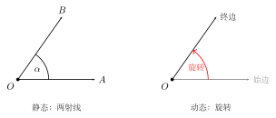
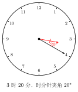

# 角

## 一、图形特征

从一点引出的**两条射线**所构成的图形叫做**角**。这个公共端点称为角的**顶点**，两条射线称为角的**边**。

直观上，角刻画的是"两条射线之间张开的程度"。它既不是线段（没有长度的度量），也不是区域（没有面积），而是一种"方向之差"。正因为如此，角的大小与边画得多长无关，只与两条边的相对方向有关。这一点是初学者最容易忽视的：把角的边画长一些，角并没有变大。

从图形特征看，一个角把平面分成三部分：角的内部、角的外部、以及角本身（两条射线上的点）。这种"内/外"的划分，是后续讨论"角平分线在角的内部"、"两角互补"等问题的几何基础。

## 二、定义与度量

**角的两种定义**：

- **静态定义**：具有公共端点的两条射线组成的图形叫做角。
- **动态定义**：一条射线绕它的端点从一个位置**旋转**到另一个位置所形成的图形叫做角。起始位置的射线叫**始边**，终止位置的射线叫**终边**。

静态定义直观、适合初学；动态定义则为后续学习"周角""负角""任意角"（高中三角函数中要用）打下基础。

**表示法**（三种常用记法）：

1. $\angle ABC$ 或 $\angle CBA$：用三个大写字母，**顶点字母必须写在中间**。
2. $\angle B$：当以 $B$ 为顶点的角只有一个，不会产生歧义时，可以只写顶点字母。
3. $\angle 1, \angle 2, \angle \alpha$：在图中用数字或希腊字母标号，简洁明了。

**度量单位**：

角的度量采用 **60 进制**的度、分、秒：

$$
\text{周角} = 360°, \qquad 1° = 60', \qquad 1' = 60''.
$$

即 $1° = 60' = 3600''$。

**分类**（按角的大小）：

| 名称 | 范围 |
| :--- | :--- |
| 锐角 | $0° < \angle < 90°$ |
| 直角 | $\angle = 90°$ |
| 钝角 | $90° < \angle < 180°$ |
| 平角 | $\angle = 180°$ |
| 周角 | $\angle = 360°$ |

## 三、为什么这么分

为什么偏偏以 $90°$（直角）和 $180°$（平角）作为分界？这并非随意约定，而是出于后续几何讨论的需要：

- **直角**是"垂直"的几何刻画。两条直线相交所成四个角中若有一个是直角，另外三个也都是直角。垂直关系是后续讨论垂线段最短、勾股定理、矩形、圆的切线等内容的核心。
- **平角**意味着两条边构成一条直线，正好对应"邻补角"的概念，与"两直线相交"密切相关。
- **互余**（两角之和为 $90°$）与**互补**（两角之和为 $180°$）这两个最基本的关系，正是建立在直角与平角之上的。

所以这种分类不是"为分而分"，而是为了让我们能够用统一的语言去描述垂直、平行、三角形内角和、相交线等几何关系。

## 四、典型应用

**例 1**（度分秒化为度）：将 $32°25'48''$ 化为以度为单位的小数。

【思路】度分秒之间是 60 进制，应当**从最小单位往大单位逐级换算**：先把秒化为分，再把分加在一起化为度。注意是除以 60，不是除以 100。

$$
48'' = \frac{48}{60}{}' = 0.8',
$$
$$
25' + 0.8' = 25.8' = \frac{25.8}{60}{}° = 0.43°,
$$
$$
32°25'48'' \approx 32.43°.
$$

**例 2**（度分秒加法）：计算 $48°36'27'' + 25°48'45''$。

【思路】同单位对齐相加；**满 60 进位**，不是满 100 进位。从秒开始算起。

秒：$27'' + 45'' = 72'' = 1'12''$，写 $12''$，向分进 $1'$。

分：$36' + 48' + 1' = 85' = 1°25'$，写 $25'$，向度进 $1°$。

度：$48° + 25° + 1° = 74°$。

所以
$$
48°36'27'' + 25°48'45'' = 74°25'12''.
$$

**例 3**（钟面问题）：求 3 点 20 分时，时针与分针的夹角。

【思路】关键是认清两根针**都在动**。分针走 1 分钟扫过 $6°$（因为 $360°/60 = 6°$）；时针走 1 分钟扫过 $0.5°$（因为 $30°/60 = 0.5°$）。3 点整时分针指 12、时针指 3，夹角 $90°$。20 分钟后：

- 分针从 12 出发，走了 $20 \times 6° = 120°$，正好指在 4 的位置。
- 时针从 3 出发，又**额外**走了 $20 \times 0.5° = 10°$。

此时分针在 4 的位置（对应 $120°$，从 12 顺时针量），时针在 3 的位置再过 $10°$（对应 $90° + 10° = 100°$）。两者之差：

$$
120° - 100° = 20°.
$$

所以夹角为 $20°$。

## 五、易错点

1. **进制错误**：度分秒是 **60 进制**，不是 100 进制。化简、加减时千万不要按"小数点"的方式处理。
2. **顶点位置**：用三个字母表示角时，$\angle ABC$ 的**顶点必须是中间那个字母** $B$，写成 $\angle BAC$ 就变成以 $A$ 为顶点的角了。
3. **钟面问题忽略时针移动**：3 点 20 分时，时针**不再**精确指向 3，它已经向 4 偏移了 $10°$。忘记这一点会算出错误的 $30°$。
4. **角的大小与边长无关**：把边画长不会让角变大。
5. **平角与直线的区别**：平角是一个角（$180°$），它有顶点；直线没有顶点。两者图形相似但概念不同。

## 六、思路自测题

1. 将 $0.45°$ 化为度分秒形式。
   💡 提示：$0.45°$ 乘以 60 得到分，分的小数部分再乘以 60 得到秒。

2. 计算 $90° - 36°42'18''$。
   💡 提示：被减数 $90°$ 可以借位写成 $89°59'60''$，再逐位相减。

3. 钟面上 9 点整时，时针与分针的夹角是多少？是锐角、直角、钝角，还是其他？
   💡 提示：分针指 12，时针指 9，从 12 到 9 跨了几个大格？每个大格 $30°$。

4. 已知 $\angle 1$ 与 $\angle 2$ 互余，$\angle 2$ 与 $\angle 3$ 互补，且 $\angle 1 = 35°$，求 $\angle 3$。
   💡 提示：先由互余求 $\angle 2$，再由互补求 $\angle 3$。注意"互余"是和为 $90°$，"互补"是和为 $180°$。

5. 钟面上 4 点 40 分时，时针与分针的夹角是多少度？
   💡 提示：先算 4 点整的夹角（时针在 4，分针在 12，$120°$）；再算 40 分钟里分针走过 $40 \times 6° = 240°$、时针多走 $40 \times 0.5° = 20°$，然后看两针目前各在哪个角位置上，再求差。也可用公式 $|30H - 5.5M|$ 验证。
