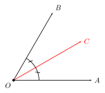
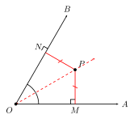
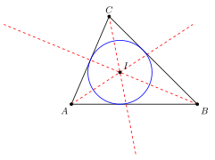

# 角平分线

## 一、图形特征

角平分线是从角的顶点引出的、把角分成两个相等部分的**射线**。

要点：
- **起点**是角的顶点（不能从别处出发）。
- 它是一条**射线**（有起点、无终点），而不是直线，也不是线段。
- 它必须落在角的**内部**，否则无法把角分成两个相等的部分。

形象地说，角平分线像一把"对折"角的折痕——把角沿着平分线翻折，两条边会完全重合。

## 二、定义与性质

**定义**：在 $\angle AOB$ 的内部有一条射线 $OC$，若 $\angle AOC = \angle COB$，则称射线 $OC$ 是 $\angle AOB$ 的平分线。

**等价表达**：
$$\angle AOC = \angle COB = \frac{1}{2}\angle AOB$$

或者反过来：
$$\angle AOB = 2\angle AOC = 2\angle COB$$

**核心性质**：角平分线上任意一点到角两边的距离相等。

用符号表述：若 $OC$ 平分 $\angle AOB$，$P$ 是 $OC$ 上任一点，$PM \perp OA$ 于 $M$，$PN \perp OB$ 于 $N$，则
$$PM = PN.$$

**逆定理**：在角的内部，到角两边距离相等的点一定在这个角的平分线上。

正定理与逆定理合起来，给出了一个"位置 $\Leftrightarrow$ 距离"的等价刻画：

$$P \text{ 在 } \angle AOB \text{ 的平分线上} \iff P \text{ 到 } OA, OB \text{ 的距离相等}.$$

这一等价关系是后续证明三角形内心存在的关键。

## 三、性质证明（完整推导）

**已知**：$OC$ 平分 $\angle AOB$，$P$ 是 $OC$ 上任一点，$PM \perp OA$ 于 $M$，$PN \perp OB$ 于 $N$。

**求证**：$PM = PN$。

**证明**：

考察 $\triangle OPM$ 与 $\triangle OPN$：

1. 因为 $OC$ 平分 $\angle AOB$，所以
$$\angle MOP = \angle NOP.$$

2. 因为 $PM \perp OA$、$PN \perp OB$，所以
$$\angle PMO = \angle PNO = 90°.$$

3. $OP$ 是两个三角形的公共边，即
$$OP = OP.$$

由 (1)(2)(3)，根据 AAS（两角及其中一角的对边对应相等），得
$$\triangle OPM \cong \triangle OPN.$$

由全等三角形对应边相等，
$$PM = PN. \qquad \blacksquare$$

**逆定理证明（简述）**：若 $P$ 在 $\angle AOB$ 内部，且 $PM = PN$，由 $\angle PMO = \angle PNO = 90°$、$OP$ 公共，用 HL 判定 $\mathrm{Rt}\triangle OPM \cong \mathrm{Rt}\triangle OPN$，从而 $\angle MOP = \angle NOP$，即 $P$ 在角平分线上。

## 四、典型应用

**例 1**：已知 $OC$ 平分 $\angle AOB$，$\angle AOB = 70°$，求 $\angle AOC$。

【解】由角平分线的定义，
$$\angle AOC = \frac{1}{2}\angle AOB = \frac{1}{2}\times 70° = 35°.$$

**例 2**：如图，在 $\triangle ABC$ 中，$AD$ 是 $\angle BAC$ 的平分线，过 $D$ 作 $DE \perp AB$ 于 $E$、$DF \perp AC$ 于 $F$。求证：$DE = DF$。

【思路】点 $D$ 在 $\angle BAC$ 的平分线 $AD$ 上，$DE$、$DF$ 分别是 $D$ 到角两边 $AB$、$AC$ 的距离（垂线段长度），直接套核心性质即得 $DE = DF$。

【证明】因为 $AD$ 平分 $\angle BAC$，$D$ 在 $AD$ 上，$DE \perp AB$、$DF \perp AC$，由角平分线的核心性质，
$$DE = DF. \qquad \blacksquare$$

**例 3（经典）**：三角形的三条内角平分线交于一点，这一点到三边的距离相等。这一点称为三角形的**内心**。

【思路】用"两条平分线先交于一点，再说明这点也在第三条平分线上"的策略：

设 $\triangle ABC$ 中 $\angle A$ 的平分线与 $\angle B$ 的平分线交于点 $I$。

- $I$ 在 $\angle A$ 的平分线上 $\Rightarrow$ $I$ 到 $AB$、$AC$ 的距离相等，记为 $d_{AB} = d_{AC}$。
- $I$ 在 $\angle B$ 的平分线上 $\Rightarrow$ $I$ 到 $AB$、$BC$ 的距离相等，即 $d_{AB} = d_{BC}$。

把两式连起来，得
$$d_{AB} = d_{AC} = d_{BC}.$$

特别地 $d_{AC} = d_{BC}$，由角平分线**逆定理**，$I$ 在 $\angle C$ 的平分线上。故三条角平分线交于同一点 $I$，且 $I$ 到三边距离相等。 $\blacksquare$

## 五、易错点

1. **角平分线是"射线"，不是"直线"也不是"线段"**：它从顶点出发向角内部延伸一端，另一端是开放的。说"角平分线 $OC$ 的长度"是没有意义的。
2. **性质里的"距离"指垂线段长度，不是到顶点 $O$ 的距离**：$P$ 到 $OA$ 的距离是过 $P$ 向 $OA$ 作垂线得到的垂线段 $PM$，绝不是 $OP$ 或 $OM$。
3. **平分线只在角的内部**：不要把它画到角的外部，也不要与"角的外角平分线"混淆。
4. **逆定理需要"在角的内部"这一前提**：到两条射线（所在直线）距离相等的点其实还可能落在外角平分线上，做题时要先确认点位于角内部。
5. **不要把"角平分线"与"线段的垂直平分线"搞混**：前者把角分成两半，后者把线段分成两半且垂直于线段；性质也完全不同（一个是"到两边距离相等"，一个是"到两端点距离相等"）。

## 六、思路自测题

**自测 1**：$OC$ 平分 $\angle AOB$，$\angle AOC = 28°$，求 $\angle AOB$。

> 💡 提示：由定义 $\angle AOB = 2\angle AOC$。

**自测 2**：$\angle AOB = 120°$，$OC$ 平分 $\angle AOB$，$OD$ 平分 $\angle AOC$，求 $\angle BOD$。

> 💡 提示：先算出 $\angle AOC = 60°$，再算出 $\angle AOD = 30°$，最后用 $\angle BOD = \angle AOB - \angle AOD$。

**自测 3**：点 $P$ 在 $\angle AOB$ 内部，且 $P$ 到 $OA$、$OB$ 的距离都等于 $3$。判断 $P$ 是否一定在 $\angle AOB$ 的平分线上，并说明理由。

> 💡 提示：套用角平分线**逆定理**——在角的内部，到两边距离相等的点必在该角的平分线上。

**自测 4**：如图，$P$ 在 $\angle AOB$ 的平分线上，$M$ 是 $OA$ 上一点，$N$ 是 $OB$ 上一点，且 $OM = ON$。求证：$PM = PN$。

> 💡 提示：本题需要**辅助线**——过 $P$ 分别向 $OA$、$OB$ 作垂线，垂足分别为 $E$、$F$。由 $P$ 在角平分线上得 $PE = PF$；再结合 $OM = ON$ 推出 $ME = NF$（注意 $E$、$F$ 分别是 $OE = OF$ 的垂足），最后在 $\mathrm{Rt}\triangle PEM$ 与 $\mathrm{Rt}\triangle PFN$ 中用勾股定理或直接全等（SAS：$PE=PF$、$\angle PEM=\angle PFN=90°$、$ME=NF$）得 $PM = PN$。
