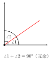
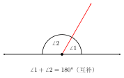
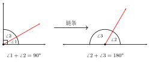

# 余角与补角

## 一、图形特征

观察两个角的度数之和，可以将角与角之间的关系分为两种最常见的"特殊和"：

- 若两个角的度数之和恰好等于 $90°$，则称这两个角**互为余角**（简称"互余"）。
- 若两个角的度数之和恰好等于 $180°$，则称这两个角**互为补角**（简称"互补"）。

图形上，互余的两个角可以拼成一个**直角**，互补的两个角可以拼成一个**平角**。需要特别强调的是：互余、互补是**两个角之间的相互关系**，不能孤立地说"某个角是余角"或"某个角是补角"，必须说"$\angle 1$ 是 $\angle 2$ 的余角"或"$\angle 1$ 与 $\angle 2$ 互余"。

## 二、定义与性质

**定义：**

- 互余：$\angle 1 + \angle 2 = 90°$，则 $\angle 1$ 与 $\angle 2$ 互为余角。
- 互补：$\angle 1 + \angle 2 = 180°$，则 $\angle 1$ 与 $\angle 2$ 互为补角。

**关键性质 1（同角或等角的余角相等）：** 如果两个角都是同一个角（或两个相等的角）的余角，那么这两个角相等。

**关键性质 2（同角或等角的补角相等）：** 如果两个角都是同一个角（或两个相等的角）的补角，那么这两个角相等。

这两条性质是初中几何里第一次出现的"由代数等式推出几何等量关系"的典型命题，也是后续证明两角相等时最常用的工具之一。

## 三、性质证明

下面以"同角的余角相等"为例给出严格证明，"等角"与"补角"情形类似，只需作相应替换。

**已知：** $\angle 1 + \angle 3 = 90°$，$\angle 2 + \angle 3 = 90°$。

**求证：** $\angle 1 = \angle 2$。

**证明：**

$$
\angle 1 = 90° - \angle 3, \qquad \angle 2 = 90° - \angle 3.
$$

由"等量代换"（两个量都等于 $90° - \angle 3$，则这两个量相等），得

$$
\angle 1 = \angle 2. \qquad \blacksquare
$$

对于"等角"的情形：若 $\angle 1 + \angle 3 = 90°$，$\angle 2 + \angle 4 = 90°$，且 $\angle 3 = \angle 4$，同样可由 $\angle 1 = 90° - \angle 3 = 90° - \angle 4 = \angle 2$ 得证。

这一证明虽然简短，但它充分体现了"等量代换"这一公理的应用：把几何关系（角的大小相等）转化为代数等式，再通过代数运算回到几何结论。

## 四、典型应用

**例 1.** 已知 $\angle A = 35°$，求 $\angle A$ 的余角和补角。

**解：** 余角为 $90° - 35° = 55°$，补角为 $180° - 35° = 145°$。

**例 2.** 一个角的补角比它的余角大多少？

**解：** 设这个角为 $\alpha$，则其补角为 $180° - \alpha$，余角为 $90° - \alpha$。

$$
(180° - \alpha) - (90° - \alpha) = 90°.
$$

结论：**任何一个角的补角都比它的余角大 $90°$**，与该角具体度数无关。这是一道经典的"消元"题，体会"与 $\alpha$ 无关"的代数特征。

**例 3.** 在 $\triangle ABC$ 中，$\angle C = 90°$，求证：$\angle A$ 与 $\angle B$ 互为余角。

**证明：** 由三角形内角和定理，$\angle A + \angle B + \angle C = 180°$。代入 $\angle C = 90°$，得

$$
\angle A + \angle B = 180° - 90° = 90°,
$$

故 $\angle A$ 与 $\angle B$ 互为余角。$\blacksquare$

这就是"直角三角形两锐角互余"的性质，它将在 part3 的三角形章节中反复使用，是解直角三角形的基础。

**例 4.** 已知 $\angle 1$ 与 $\angle 2$ 互为余角，$\angle 2$ 与 $\angle 3$ 互为补角，$\angle 1 = 30°$，求 $\angle 3$。

**【思路】** 顺着已知条件"链式"推进：先由互余求 $\angle 2$，再由互补求 $\angle 3$。

**解：** 由 $\angle 1 + \angle 2 = 90°$，得 $\angle 2 = 90° - 30° = 60°$；
再由 $\angle 2 + \angle 3 = 180°$，得 $\angle 3 = 180° - 60° = 120°$。

## 五、易错点

1. **只看度数，不看位置。** 互余、互补只与两角度数之和有关，与它们是否相邻、是否共顶点、是否对称都无关。课本中常画相邻的图形只是为了直观，并非定义要求。

2. **互余必为两锐角。** 因为若有一个角 $\geq 90°$，则两角之和必 $> 90°$，不可能互余。所以**钝角、直角都没有余角**（在初中范围内不引入负角）。

3. **互补的两角可能形态多样。** 可以是一锐角加一钝角（如 $30° + 150°$），也可以是两个直角（$90° + 90°$），但不可能是两锐角或两钝角。

4. **"同角的余角相等"是常用桥梁。** 当题目里出现两个角分别与同一个角构成余角（或补角）时，立即可断定这两个角相等，无须再列方程求解。这是后续证明两角相等、构造全等三角形时最常调用的"隐藏"工具。

5. **互余、互补只研究两个角。** 不要把 $\angle 1 + \angle 2 + \angle 3 = 90°$ 说成"三个角互余"，互余/互补的关系限定在**两个角之间**。

## 六、思路自测题

1. 若 $\angle \alpha = 72°$，求 $\angle \alpha$ 的余角与补角，并验证"补角比余角大 $90°$"。

2. 一个角的余角是这个角的 $2$ 倍，求这个角。
   **【提示】** 设这个角为 $x$，则 $90° - x = 2x$。

3. 已知 $\angle A$ 与 $\angle B$ 互补，$\angle B$ 与 $\angle C$ 互补，能否断定 $\angle A = \angle C$？说明理由。
   **【提示】** 利用"同角的补角相等"。

4. 如图，$\angle AOB = 90°$，$\angle COD = 90°$，且射线 $OC$ 在 $\angle AOB$ 内部。
   求证：$\angle AOC = \angle BOD$。
   **【提示】** 注意 $\angle AOC$ 与 $\angle BOC$ 互余，$\angle BOD$ 与 $\angle BOC$ 也互余，再用"同角的余角相等"。
