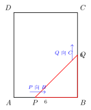
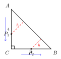
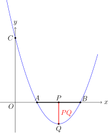

# 线上动点问题

## 一图速记

```
        A───────────P────────────B           (P 在线段/射线/直线上运动)
        │           │
        │           │ PQ ⊥ AB  或  PQ 与某定线交于 Q
        │           ▼
        └───────────Q   ← Q 随 P 联动

   核心：设 AP = t (参数化) → 把所有目标量写成 t 的函数 → 几何条件化为方程/不等式
```

一句话口诀：**「设参 → 表达 → 列式 → 求范围」**。线上动点的本质是一元参数化——把"动"翻译成一个变量 t，再把图形里所有变化的长度、坐标、面积都改写为 t 的代数式。

## 引入

中考压轴题最常见的一类背景，是在某条已知直线（线段、射线、坐标轴、矩形的边、三角形的边）上放一个会动的点 P，再让 P 牵动另一个点 Q，最后问"何时三角形是等腰三角形"、"何时四边形是平行四边形"、"线段之和何时取最小"。考生看到"动点"两个字往往就慌——其实它远比"二次函数综合"温柔，因为约束只有一个维度：P 只能沿一条线滑动。

我们要做的，就是把这一个自由度抓住，用一个参数 t 把它锁死，然后所有"动"的量都会自动变成 t 的函数，剩下的工作就是中学最熟悉的——解方程、配方、求最值。

## 思维路径还原

> **第 1 步：找参数的"家"。** P 在哪条线上？这条线是水平的、竖直的、还是斜的？它的端点坐标是什么？我能不能用 P 到某个端点的距离 t 唯一确定 P 的位置？
>
> **第 2 步：写 P 的坐标或长度。** 若 P 在线段 AB 上，设 AP = t，则 PB = AB - t；若 P 在坐标系里的某条直线 y = kx + b 上，设 P 的横坐标为 t，则 P = (t, kt + b)。一句话：P 的位置必须能用 t 显式写出来。
>
> **第 3 步：让 Q 跟着 P 走。** 题目里一般还会有第二个动点 Q，它由 P 通过"作垂线"、"延长"、"翻折"、"以 PQ 为边作正方形"等方式生成。把 Q 的坐标也写成 t 的函数。
>
> **第 4 步：把"问题"翻译成"方程"。** 题目问"等腰"，就写 PA = PB 或 PA = AB 或 PB = AB 三种情形；问"直角"，就写两边斜率乘积为 -1 或勾股定理；问"最小值"，就把目标量写成 t 的二次函数，再配方。
>
> **第 5 步：解方程并验范围。** 解出 t 之后，**必须**回头检查 t 是否落在 P 的活动范围内（比如 0 ≤ t ≤ AB），否则要舍去。这一步是中考压轴丢分的重灾区。
>
> **第 6 步：把 t 翻译回几何答案。** 题目问的是"AP 的长"、"运动时间 t 秒"还是"点 P 的坐标"？最后一定要回到题目要求的语言。

## 抽象成题型

> **线上动点问题的通用模板**：
>
> 1. **载体**：一条已知的线（线段 / 射线 / 直线 / 坐标轴 / 多边形的边）。
> 2. **主动点 P**：在载体上以匀速运动，或者任意位置取值。
> 3. **从动点 Q**：由 P 通过一种几何构造（垂线、延长、翻折、绕定点旋转、作相似三角形等）唯一确定。
> 4. **目标条件**：图形 PQR…满足某种性质（等腰、直角、相似、平行四边形、面积取定值或最值）。
> 5. **求解对象**：满足条件时的 t 值（或对应的 AP、运动时间、点的坐标）。

把这五要素填进表格，几乎所有"线上动点"题都能套上这个壳。

## 模型变形

**变形 1：线段上的双动点。** P、Q 同时从两端出发，速度不同。此时设运动时间为 t，P、Q 的位置分别用 t 表示，本质仍是一个参数。

**变形 2：折线上的动点。** P 先沿 AB 走到 B，再沿 BC 走。要**分段讨论**：t ∈ [0, AB] 时 P 在 AB 上，t ∈ [AB, AB+BC] 时 P 在 BC 上，两段分别建立函数表达式。

**变形 3：坐标轴上的动点。** P 在 x 轴上，设 P = (t, 0)。常与二次函数图象、一次函数图象联动，往往要解"抛物线上是否存在点使 △ABP 为等腰直角三角形"这类问题。

**变形 4：动点 + 翻折。** 把三角形沿过 P 的线翻折，使某个顶点落到另一条边上。翻折的本质是**轴对称**，对应边相等，可直接列方程。

**变形 5：动点 + 旋转。** Q 是 P 绕定点 O 旋转 90° 得到的像。则 |OQ| = |OP|，且 OQ ⊥ OP，用旋转坐标公式 (x, y) → (-y, x) 即可。

## 思考路标

遇到一道"线上动点"压轴题，按下面的清单走，能避免 90% 的卡壳：

- **路标 ①**：圈出"动点在哪条线上"，画出运动范围（一定是闭区间或半开区间）。
- **路标 ②**：选一个最方便的参数（通常选到端点的距离，或横/纵坐标，或运动时间 t）。
- **路标 ③**：把所有要用到的点的坐标 / 线段长度都写成 t 的式子，写在草稿纸的最显眼处。
- **路标 ④**：把题目条件**逐字**翻译——"等腰" → 写三种情况；"平行四边形" → 写对角线互相平分或一组对边平行且相等；"最小" → 写二次函数后配方。
- **路标 ⑤**：解出 t 后，**对照路标 ①** 的范围，逐个验证、舍去不合理的解。
- **路标 ⑥**：回答题目原本问的量（不一定是 t 本身）。

## 应用例题

### 例 1（等腰三角形分类讨论）

在矩形 ABCD 中，AB = 6，BC = 8。点 P 从 A 出发沿 AB 向 B 匀速运动，速度为 1 单位/秒；同时点 Q 从 B 出发沿 BC 向 C 匀速运动，速度为 2 单位/秒。设运动时间为 t 秒（0 < t < 4），问 t 为何值时 △BPQ 为等腰三角形？



**思路**：BP = AB − AP = 6 − t，BQ = 2t。因为 ∠B = 90°，△BPQ 是直角三角形，它能成为等腰三角形只有一种可能——两条直角边相等，即 BP = BQ。

**解**：令 6 − t = 2t，得 t = 2。验证：0 < 2 < 4，成立。
答：当 t = 2 秒时 △BPQ 为等腰（直角）三角形。

### 例 2（折线上的动点 + 面积函数）

如图，在等腰直角 △ABC 中，∠C = 90°，AC = BC = 4。点 P 从 A 出发，沿 A → C → B 的折线以 1 单位/秒的速度运动。设 P 到 AB 的距离为 h，运动时间为 t。求 h 关于 t 的函数表达式。



**思路**：分两段。t ∈ [0, 4]：P 在 AC 上，AP = t；t ∈ [4, 8]：P 在 CB 上，CP = t − 4。AB 上的高就是 P 到 AB 的距离，可用等腰直角三角形的性质（AB 边上的高线为对称轴）算。

**解**：AB = 4√2，AB 上的高 CH = 2√2。
- 当 0 ≤ t ≤ 4：P 在 AC 上，过 P 作 PH' ⊥ AB，则 △APH' 为等腰直角三角形，h = AP·sin 45° = t·(√2/2) = (√2/2) t。
- 当 4 ≤ t ≤ 8：P 在 CB 上，CP = t − 4，同理 h = BP·sin 45° = (8 − t)·(√2/2)。

合起来：h(t) = (√2/2)·t（0 ≤ t ≤ 4），h(t) = (√2/2)·(8 − t)（4 ≤ t ≤ 8）。

### 例 3（坐标轴上的动点 + 二次函数最值）

抛物线 y = x² − 4x + 3 与 x 轴交于 A、B 两点（A 在 B 左），与 y 轴交于 C。点 P 是线段 AB 上的动点，过 P 作 x 轴的垂线，交抛物线于 Q。求线段 PQ 的最大值。



**思路**：A = (1, 0)，B = (3, 0)，C = (0, 3)。设 P = (t, 0)，1 ≤ t ≤ 3，则 Q = (t, t² − 4t + 3)。由于 Q 在 x 轴下方（抛物线在 [1, 3] 上 y ≤ 0），PQ = 0 − (t² − 4t + 3) = −t² + 4t − 3。

**解**：PQ = −t² + 4t − 3 = −(t − 2)² + 1。当 t = 2 ∈ [1, 3] 时 PQ 取最大值 1。
答：PQ 的最大值为 1，此时 P = (2, 0)。

## 思路自测题

1. **（等腰）** 在 △ABC 中，AB = AC = 5，BC = 6，AD 是 BC 边上的高。点 P 在 AD 上从 A 向 D 运动，速度为 1 单位/秒。问 t 为何值时 △BPC 为等边三角形？是否存在？若不存在，问 t 为何值时 △BPC 为等腰直角三角形？

2. **（平行四边形）** 在平面直角坐标系中，A(0, 4)，B(6, 0)。点 P 在线段 AB 上，过 P 作 x 轴、y 轴的垂线，垂足分别为 M、N。问 P 在何位置时四边形 OMPN 为正方形？

3. **（折线 + 直角）** 矩形 ABCD 中 AB = 3，BC = 4。点 P 从 A 出发沿 A → B → C 以 1 单位/秒运动。是否存在 t 使 △APD 为直角三角形？若存在，求出所有 t；若不存在，说明理由。

4. **（坐标 + 最小值）** 直线 y = −x + 4 与 x 轴、y 轴分别交于 B、A。点 P 在线段 AB 上运动，从 P 分别向 x 轴、y 轴作垂线，垂足为 E、F。求矩形 OEPF 的周长的取值范围及面积的最大值。

> **自测提示**：每题先按"思考路标"6 步走一遍，特别注意第 5 步——验证 t 是否落在活动范围内。题 1 的"等边"无解（因为 BD = 3，BC = 6，△BPC 等边要求 BP = 6，而 BP 最小值是 BD = 3，最大值在 P = A 处取得 = 5，达不到 6）；题 2 要求 P 的横纵坐标相等；题 3 要分 P 在 AB、BC 两段讨论；题 4 设 P = (t, 4 − t)，0 ≤ t ≤ 4，周长 = 2·(t + 4 − t) = 8（恒等！），面积 = t(4 − t) 在 t = 2 时取最大值 4。
