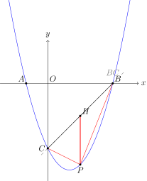
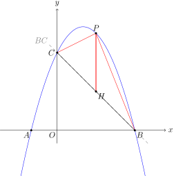
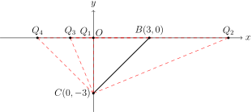
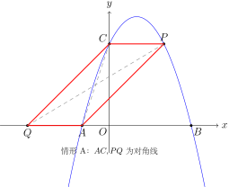
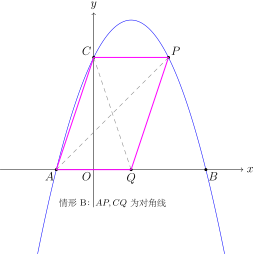
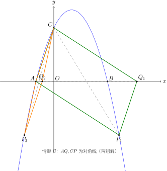

# 抛物线 / 坐标系动点问题

## 一图速记

```
              y
              │            ● P(x, ax²+bx+c)   ← 动点在抛物线上
              │           ╱│
              │          ╱ │ 竖直距离 = y_P − y_{直线}
              │      ───╱──┼─────  直线 BC
              │ C●  ╱      │
              │   ╱        │
       ───────┼─●──────────●────── x
              │ A          B
              │
   核心：设 P = (x, f(x)) → 几何条件全部翻译成 x 的代数式 → 配方 / 解方程
```

一句话口诀：**「设点 → 代式 → 翻译 → 配方/分类」**。坐标系动点的本质是：**把抛物线方程作为 P 纵坐标的"自动生成器"**，于是 P 只剩一个自由度 x，所有距离、面积、角度都化为 x 的函数。这是 toolkit/04"形→数"转化的极致应用。

## 引入

抛物线综合题是中考压轴的"标配"。题目通常先给一条抛物线 $y = ax^2 + bx + c$，让你求出与 $x$ 轴、$y$ 轴的交点 $A, B, C$，然后第 (2)、(3) 问开始放"动点"：在抛物线上找一点 $P$，使 $\triangle PBC$ 面积最大、使 $\triangle PAB$ 为等腰、使四边形 $PABC$ 为平行四边形……

很多同学的卡点在于："$P$ 是动的，我连它的坐标都写不出来，怎么做？"——这正是抛物线动点的精髓：**$P$ 在抛物线上，意味着 $P$ 的纵坐标必须满足抛物线方程**。所以只要设 $P$ 的横坐标为 $x$，纵坐标立刻是 $ax^2 + bx + c$，于是 $P = (x, ax^2 + bx + c)$ 完全由一个参数 $x$ 决定。这一步看似平凡，却是所有后续解题的起点。

我们来看一道典型题，把整个思考过程慢动作回放一遍。

**引入题**：抛物线 $y = x^2 - 2x - 3$ 与 $x$ 轴交于 $A, B$（$A$ 在左），与 $y$ 轴交于 $C$。设 $P$ 是抛物线上在直线 $BC$ 下方的一动点，问 $P$ 在何处时 $\triangle PBC$ 的面积最大？最大面积是多少？



## 思维路径还原

> **第 1 步：基础三点先求出来。** 令 $y = 0$：$x^2 - 2x - 3 = 0$，得 $x = -1$ 或 $3$，故 $A(-1, 0)$，$B(3, 0)$；令 $x = 0$，得 $C(0, -3)$。这三个点是后面所有计算的"地基"，必须先稳稳写在草稿纸上。
>
> **第 2 步：把动点 $P$ 设出来。** $P$ 在抛物线上，横坐标设为 $x$，那么 $P = (x, x^2 - 2x - 3)$。题目限制 $P$ 在直线 $BC$ 下方——这是后面要验证 $x$ 范围的依据。
>
> **第 3 步：写直线 $BC$ 的方程。** $B(3, 0)$、$C(0, -3)$，斜率 $\frac{0 - (-3)}{3 - 0} = 1$，截距 $-3$，故 $BC: y = x - 3$。
>
> **第 4 步：怎么算 $\triangle PBC$ 面积？** 用"点到直线距离"再乘 $\frac{1}{2}|BC|$ 当然可以，但更聪明的做法是**竖直分割法**：过 $P$ 作 $x$ 轴的垂线，交 $BC$ 于 $H$，则 $|PH|$ 是"竖直距离"，且
> $$ S_{\triangle PBC} = \frac{1}{2} \cdot |PH| \cdot |x_B - x_C| $$
> 因为 $|x_B - x_C|$ 是 $BC$ 在 $x$ 轴上的"水平跨度"，而过 $P$ 作竖直线把 $\triangle PBC$ 切成两个共用"底 $PH$"的三角形，它们的高之和恰好是 $|x_B - x_C|$。
>
> **第 5 步：算 $PH$。** $H$ 与 $P$ 同 $x$，故 $H = (x, x - 3)$。因为 $P$ 在 $BC$ 下方，$y_P < y_H$，所以
> $$ |PH| = (x - 3) - (x^2 - 2x - 3) = -x^2 + 3x. $$
>
> **第 6 步：代入面积公式，配方。** $|x_B - x_C| = 3$，故
> $$ S = \frac{1}{2} \cdot (-x^2 + 3x) \cdot 3 = \frac{3}{2}\left(-x^2 + 3x\right) = -\frac{3}{2}\left(x - \frac{3}{2}\right)^2 + \frac{27}{8}. $$
> 当 $x = \frac{3}{2}$ 时 $S$ 最大 $= \frac{27}{8}$。
>
> **第 7 步：验范围 + 回答。** $x = \frac{3}{2} \in (0, 3)$，确实在 $B, C$ 之间且在 $BC$ 下方。此时 $P = \left(\frac{3}{2}, -\frac{15}{4}\right)$，面积最大值 $\frac{27}{8}$。

## 抽象成题型

> **抛物线动点问题的通用模板**：
>
> 1. **载体**：一条已知抛物线 $y = ax^2 + bx + c$，配套若干定点（与 $x$ 轴、$y$ 轴的交点，顶点等）。
> 2. **动点 $P$**：在抛物线上，设 $P = (x, ax^2 + bx + c)$，参数为 $x$。
> 3. **辅助构造**：可能伴随过 $P$ 的竖直线、对称轴、与定点连成的三角形 / 四边形。
> 4. **目标条件**：面积最值、距离最值、特殊形状（等腰、直角、平行四边形）的存在性。
> 5. **求解对象**：满足条件的 $x$（或 $P$ 坐标）。

不论题目花样多么繁复，"设 $P = (x, f(x))$"这一步永远是第一动作。

## 模型变形

**变形 1：动点在直线上。** $P$ 在一次函数 $y = kx + b$ 上，设 $P = (x, kx + b)$。本质同抛物线情形，只是 $P$ 的纵坐标公式更简单。

**变形 2：双动点联动。** $P$ 在抛物线上、$Q$ 在 $x$ 轴上，且 $PQ \perp x$ 轴。则 $Q = (x, 0)$，$|PQ| = |x^2 - 2x - 3|$，一个参数 $x$ 同时锁定两点。

**变形 3：动点 + 平移 / 旋转。** $P'$ 由 $P$ 沿向量 $(h, k)$ 平移得到，则 $P' = (x + h, f(x) + k)$；$P$ 绕原点旋转 $90°$ 得到 $P' = (-f(x), x)$。

**变形 4：抛物线 + 直线交点的"动直线"。** 直线 $y = mx + n$ 与抛物线交于 $P, Q$ 两点，$m$ 或 $n$ 是参数。这时用韦达定理：$x_P + x_Q$、$x_P x_Q$ 直接用 $m, n$ 表示。

**变形 5：动点在抛物线的某段弧上。** 题目限定 $P$ 在 $A, B$ 之间或在对称轴左/右，这就给 $x$ 加了范围约束，配方后要验证顶点是否在该区间内——若不在，最值在端点取得。

## 思考路标

遇到一道"坐标系动点 + 抛物线"的压轴题，按下面的清单走：

- **路标 ①**：先把所有"定点"算出来——抛物线与坐标轴的交点、顶点、对称轴。这些是后续公式的输入。
- **路标 ②**：动点必须设成 $P = (x, f(x))$，把 $f(x)$ 的表达式写在显眼处。
- **路标 ③**：题目里出现的所有"距离 / 长度 / 面积 / 斜率"，逐一翻译成 $x$ 的代数式。
- **路标 ④**：识别题型——
  - **求面积最值** → 用竖直分割法 $S = \frac{1}{2}|PH| \cdot |x_B - x_C|$，列成二次函数，配方。
  - **求距离最值** → 距离平方 $d^2$ 是 $x$ 的多项式，对 $d^2$ 配方更省力。
  - **特殊形状存在性**（等腰 / 直角 / 平行四边形） → **分类讨论 + 列方程**（每种情形一个方程）。
- **路标 ⑤**：解方程后**验证 $x$ 范围**（是否在题目要求的弧段上，是否会让三点共线等退化）。
- **路标 ⑥**：把 $x$ 翻译回题目要求的答案——是 $P$ 的坐标？是 $AP$ 长？是 $t$？

## 应用例题

### 例 1（面积最值——竖直分割法）

抛物线 $y = -x^2 + 2x + 3$ 与 $x$ 轴交于 $A, B$（$A$ 在左），与 $y$ 轴交于 $C$。$P$ 是抛物线在第一象限内的动点。求 $\triangle PBC$ 面积的最大值。



**思路**：先求 $A(-1, 0)$，$B(3, 0)$，$C(0, 3)$。$P$ 在第一象限即 $0 < x < 3$，$P = (x, -x^2 + 2x + 3)$。直线 $BC$：由 $B(3, 0)$、$C(0, 3)$ 得 $y = -x + 3$。

**解**：过 $P$ 作 $x$ 轴垂线，交 $BC$ 于 $H = (x, -x + 3)$。$P$ 在 $BC$ 上方（因为 $f(x) - (-x+3) = -x^2 + 3x = -x(x - 3) > 0$ 当 $0 < x < 3$），故
$$ |PH| = (-x^2 + 2x + 3) - (-x + 3) = -x^2 + 3x. $$
$|x_B - x_C| = 3$，故
$$ S = \frac{1}{2} \cdot 3 \cdot (-x^2 + 3x) = -\frac{3}{2}\left(x - \frac{3}{2}\right)^2 + \frac{27}{8}. $$
当 $x = \frac{3}{2}$ 时 $S$ 最大 $= \frac{27}{8}$，此时 $P = \left(\frac{3}{2}, \frac{15}{4}\right)$。

### 例 2（等腰三角形存在性——分类讨论）

抛物线 $y = x^2 - 2x - 3$ 同引入题。在 $x$ 轴上是否存在点 $Q$，使 $\triangle BCQ$ 为等腰三角形？若存在，求出所有 $Q$；若不存在，说明理由。



**思路**：$B(3, 0)$、$C(0, -3)$，$|BC| = 3\sqrt{2}$。设 $Q = (t, 0)$ 在 $x$ 轴上。等腰有三种情形：① $QB = QC$；② $QB = BC$；③ $QC = BC$。

**解**：
- **情形 ①**（$QB = QC$）：$|t - 3| = \sqrt{t^2 + 9}$，平方：$(t - 3)^2 = t^2 + 9$，化简 $-6t = 0$，得 $t = 0$。$Q_1 = (0, 0)$ 即原点。检查：$Q_1$ 不与 $B, C$ 重合，合法。
- **情形 ②**（$QB = BC = 3\sqrt{2}$）：$|t - 3| = 3\sqrt{2}$，故 $t = 3 \pm 3\sqrt{2}$。$Q_2 = (3 + 3\sqrt{2}, 0)$，$Q_3 = (3 - 3\sqrt{2}, 0)$。
- **情形 ③**（$QC = BC = 3\sqrt{2}$）：$\sqrt{t^2 + 9} = 3\sqrt{2}$，$t^2 = 9$，$t = \pm 3$。$t = 3$ 时 $Q$ 与 $B$ 重合（$\triangle$ 退化），舍。故 $Q_4 = (-3, 0)$。

答：共四个点 $Q_1(0, 0)$、$Q_2(3 + 3\sqrt{2}, 0)$、$Q_3(3 - 3\sqrt{2}, 0)$、$Q_4(-3, 0)$。

### 例 3（平行四边形存在性——三种配对）

抛物线 $y = -x^2 + 2x + 3$ 与 $x$ 轴交于 $A(-1, 0)$、$B(3, 0)$，与 $y$ 轴交于 $C(0, 3)$。是否存在抛物线上的点 $P$ 和 $x$ 轴上的点 $Q$，使以 $A, C, P, Q$ 为顶点的四边形是平行四边形？

**思路**：四个点构成平行四边形，关键看**哪两点是对角线**。三种配对：
- 配对甲（情形 A）：$AC$ 与 $PQ$ 是对角线 → $AC$ 中点 = $PQ$ 中点。
- 配对乙（情形 B）：$AP$ 与 $CQ$ 是对角线 → $AP$ 中点 = $CQ$ 中点。
- 配对丙（情形 C）：$AQ$ 与 $CP$ 是对角线 → $AQ$ 中点 = $CP$ 中点。







设 $P = (x, -x^2 + 2x + 3)$，$Q = (t, 0)$。

**解**：$AC$ 中点 $M = \left(-\frac{1}{2}, \frac{3}{2}\right)$。

- **配对甲**：$PQ$ 中点 $= \left(\frac{x + t}{2}, \frac{-x^2 + 2x + 3}{2}\right) = M$。由 $y$ 坐标：$-x^2 + 2x + 3 = 3$，$x(2 - x) = 0$，$x = 0$ 或 $x = 2$。$x = 0$ 时 $P = (0, 3) = C$，退化舍去；$x = 2$ 时 $P = (2, 3)$，$t = -1 - 2 = -3$，$Q = (-3, 0)$。
- **配对乙**：$AP$ 中点 $\left(\frac{-1 + x}{2}, \frac{-x^2 + 2x + 3}{2}\right) = CQ$ 中点 $\left(\frac{t}{2}, \frac{3}{2}\right)$。由 $y$：$-x^2 + 2x + 3 = 3$，同上 $x = 0$（退化）或 $x = 2$。$x = 2$：$t = -1 + 2 = 1$，$Q = (1, 0)$，$P = (2, 3)$。
- **配对丙**：$AQ$ 中点 $\left(\frac{-1 + t}{2}, 0\right) = CP$ 中点 $\left(\frac{x}{2}, \frac{-x^2 + 2x + 3 + 3}{2}\right)$。由 $y$：$-x^2 + 2x + 6 = 0$，$x^2 - 2x - 6 = 0$，$x = 1 \pm \sqrt{7}$。由 $x$ 坐标：$t = x + 1$。代回抛物线 $y = -x^2 + 2x + 3$，当 $x = 1 \pm \sqrt{7}$ 时 $y = -3$。故 $P = (1 + \sqrt{7}, -3)$、$Q = (2 + \sqrt{7}, 0)$ 或 $P = (1 - \sqrt{7}, -3)$、$Q = (2 - \sqrt{7}, 0)$。

答：共四组解 (配对甲 1 组、配对乙 1 组、配对丙 2 组)。

## 思路自测题

1. **（面积最值）** 抛物线 $y = x^2 - 4x + 3$ 与 $x$ 轴交于 $A, B$（$A$ 在左），与 $y$ 轴交于 $C$。$P$ 是抛物线在 $x$ 轴下方部分的动点。求 $\triangle PAB$ 面积的最大值。

2. **（距离最值）** 抛物线 $y = x^2$ 上有一动点 $P$，定点 $M(3, 0)$。求 $|PM|$ 的最小值。（提示：$|PM|^2 = (x - 3)^2 + x^4$，对 $x^4 + (x-3)^2$ 求导或用代数变形。中考可设 $x$ 为整数附近试算最优。）

3. **（直角三角形存在性）** 抛物线 $y = -x^2 + 2x + 3$ 与 $x$ 轴交于 $A(-1, 0)$、$B(3, 0)$，与 $y$ 轴交于 $C(0, 3)$。在抛物线对称轴上是否存在点 $P$ 使 $\triangle PBC$ 为直角三角形？若存在，求所有 $P$。

4. **（一次函数 + 抛物线联动）** 直线 $y = x + 1$ 与抛物线 $y = x^2 - 2x + 1$ 交于 $M, N$。$P$ 是抛物线上 $M, N$ 之间的动点。求 $\triangle PMN$ 面积的最大值。

> **自测提示**：每题先按"思考路标"6 步走。题 1：$A(1,0)$、$B(3,0)$、$|AB| = 2$，$P = (x, x^2 - 4x + 3)$ 在 $x$ 轴下方意味 $1 < x < 3$，高 $= -(x^2 - 4x + 3) = -(x-2)^2 + 1$，$x = 2$ 时高最大 $1$，面积最大 $= \frac{1}{2} \cdot 2 \cdot 1 = 1$。题 2：直接配 $|PM|^2 = x^4 + x^2 - 6x + 9$，可在 $x = 1$ 附近取得最小值 $5$（即 $|PM|_{\min} = \sqrt{5}$，验证：$P = (1, 1)$ 时距 $M(3,0)$ 为 $\sqrt{4 + 1} = \sqrt{5}$）。题 3：对称轴 $x = 1$，设 $P = (1, m)$，分别讨论 $\angle PBC = 90°$、$\angle PCB = 90°$、$\angle BPC = 90°$ 三种情形列方程。题 4：解联立 $x + 1 = x^2 - 2x + 1$ 得 $M(0, 1)$、$N(3, 4)$，$|MN| = 3\sqrt{2}$，过 $P = (x, x^2 - 2x + 1)$ 作竖直线交 $MN$ 于 $H = (x, x + 1)$，$|PH| = (x+1) - (x^2 - 2x + 1) = -x^2 + 3x$，$S = \frac{1}{2} \cdot 3 \cdot (-x^2 + 3x)$，$x = \frac{3}{2}$ 时最大 $= \frac{27}{8}$。
