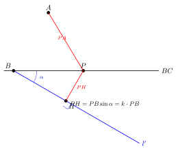
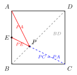
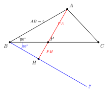
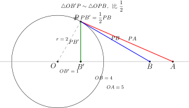

# 几何最值：将军饮马、胡不归、阿氏圆

> **一图速记**：求**距离之和**或**带系数距离之和**的最小值时，用对称、构造等手段把"分散的两段或带系数的距离"转化为"一条直线"。三大经典模型：将军饮马（$PA+PB$）、胡不归（$PA + k\cdot PB$，$0<k<1$）、阿氏圆（$k\cdot PA + PB$，$P$ 在圆上）。

---

## 一、引入

> **将军饮马原型题**：已知直线 $l$ 及位于 $l$ 同侧的两定点 $A, B$。在 $l$ 上找一点 $P$，使 $PA + PB$ 最小。求 $P$ 的位置，并指出 $PA + PB$ 的最小值。

这是一道流传两千年的"将军饮马"题：将军骑马从军营 $A$ 出发到河边 $l$ 饮马后再到军营 $B$，怎样走总路程最短？看似复杂，背后却是**两点之间线段最短**这一最基本公理。

---

## 二、思维路径还原

> 看到"两段距离 $PA + PB$ 最小" → 我第一反应就是**"共线最短"**：两点之间线段最短。
>
> 如果 $A, B$ 在 $l$ **异侧**，直接连 $AB$ 与 $l$ 交于一点，就是答案——这不用想。
>
> 但题目说 $A, B$ 在 $l$ **同侧**，直接连 $AB$ 与 $l$ 不一定相交（且即便相交也不是"过 $l$ 上的点"的两段），路径走不通。
>
> 卡住了。再读题：$P$ 必须在 $l$ 上。$PA$ 这一段我换不掉，但是……能不能用**对称**把 $A$ "搬"到 $l$ 的另一侧？
>
> 作 $A$ 关于 $l$ 的对称点 $A'$。根据对称性，对 $l$ 上**任意**一点 $P$ 都有 $PA = PA'$。
>
> 于是 $PA + PB = PA' + PB$。问题翻译成：在 $l$ 上找 $P$ 使 $PA' + PB$ 最小。
>
> 而 $A', B$ 已经在 $l$ 异侧了！连 $A'B$ 交 $l$ 于一点，就是最优 $P$，最小值 $= |A'B|$。
>
> 核心动作只有一个：**对称换段**——把"动点到定点"的一段换成"动点到对称点"的一段，使两段变共线。

---

## 三、抽象成题型：三大模型对比

三大几何最值模型可一表概括：

| 模型 | 形式 | $P$ 在哪 | 关键技巧 | 转化为 |
|---|---|---|---|---|
| 将军饮马 | $PA + PB$ 最小 | 直线 / 折线上 | 作 $A$（或 $B$）关于直线的**对称** | 线段 $A'B$ |
| 胡不归 | $PA + k\cdot PB$，$0<k<1$ | 直线上 | 作角 $\angle$ 使 $\sin\alpha = k$，把 $k\cdot PB$ 化为**点到斜线距离** | 折线 $A\to P\to$ 斜线的垂线段 |
| 阿氏圆 | $PA + k\cdot PB$ | **圆**上 | 用**相似**把 $k\cdot PB$ 化为 $PB'$（$B'$ 为内部定点） | 线段 $AB'$ |

**将军饮马**：仅靠"轴对称 + 两点之间线段最短"，最朴素也最常考。

**胡不归详解**（取名自传说：胡不归赶路过河滩与硬路两种地形，比例不同）：

- 形式：在直线 $l$ 上找 $P$ 使 $PA + k\cdot PB$ 最小，$0 < k < 1$。
- 难点：$k\cdot PB$ 这个**带系数**的距离不能直接和 $PA$ 看作"两段距离之和"。
- 关键：在 $B$ 处作一条与 $l$ 成定角 $\alpha$ 的射线 $l'$，使 $\sin\alpha = k$。过 $P$ 向 $l'$ 作垂线 $PH$，则在 $\mathrm{Rt}\triangle PBH$ 中 $PH = PB\sin\alpha = k\cdot PB$。
- 于是 $PA + k\cdot PB = PA + PH$ —— 这是"$A$ 到 $P$ 再到 $l'$"的折线，最短即 $A$ 直接向 $l'$ 作垂线时取到，最小值 $= $ 点 $A$ 到 $l'$ 的距离。

**阿氏圆详解**：

- 阿波罗尼斯轨迹：到两定点 $A, B$ 距离之比为定值 $k\;(k\neq 1)$ 的点的轨迹是**一个圆**（阿氏圆）。
- 反过来：若 $P$ 已经在一个**圆** $\odot O$ 上，要求 $PA + k\cdot PB$ 的最小值（$B$ 在圆内、$A$ 在圆外），就在 $OB$ 方向上找一点 $B'$ 使得 $\triangle OPB \sim \triangle OB'P$（即 $OB'\cdot OB = OP^2 = r^2$，$B'$ 是 $B$ 关于 $\odot O$ 的"反演点"），则相似比恰好给出 $PB' = k\cdot PB$。
- 于是 $k\cdot PB + PA = PB' + PA \geq AB'$，最小值 $= |AB'|$，当 $A, P, B'$ 共线时取到。

---

## 四、模型变形

**将军饮马的常见变形**：

1. **两条直线 + 一定点**（造桥型）：$P$ 在 $l_1$、$Q$ 在 $l_2$，求 $AP + PQ + QB$ 最小——分别对两条直线作对称。
2. **折线最短型**：$P, Q$ 分别在两边上，求 $AP + PQ + QB$；要点：先固定一个，再对另一个作对称。
3. **三角形周长最小**：$\triangle PMN$ 中 $M, N$ 分别在两边上，转化为对 $P$ 作两次对称。
4. **平移 + 对称**（线段长度固定时）：先用平移把一段固定线段移走，再用对称。

**胡不归的变形**：系数 $k$ 不一定写成 $k$，常以"$\sin 30°$、$\sin 45°$、$\sin 60°$"等具体角度藏在题干里——见到 $\frac{1}{2}PB, \frac{\sqrt{2}}{2}PB, \frac{\sqrt{3}}{2}PB$ 就警觉。

**阿氏圆的变形**：圆可能没有现成画出，要先由"$\frac{PA}{PB} = k$"反推出 $P$ 的轨迹是圆；或反过来，$P$ 在圆上，要把题目里的目标拆出 $\frac{1}{2}PB$ 等形式后用反演化简。

---

## 五、思考路标

- "两段距离和最小" + "$P$ 在直线上" → **将军饮马**（对称）。
- "$PA + k\cdot PB$ 最小" + $0<k<1$ + "$P$ 在直线上" → **胡不归**（作角 $\sin\alpha = k$）。
- "$P$ 在圆上" + "$PA + k\cdot PB$ 或 $\frac{PA}{PB}$ 为常数" → **阿氏圆**（反演 / 相似）。
- 看到题里出现 $\frac{1}{2}PB, \frac{\sqrt{3}}{2}PB$ 等**带具体系数的距离**——先想胡不归 / 阿氏圆。
- 通用口诀：**对称换段、相似换段、共线最短**。
- **检查**：转化后的"共线"端点要算清坐标 / 长度，最小值才能落地为数值。

---

## 六、应用例题

### 例 1（将军饮马 — 经典对称）

正方形 $ABCD$ 的边长为 $4$，$E$ 是 $AB$ 的中点，$P$ 是对角线 $BD$ 上一动点，求 $PA + PE$ 的最小值。

**解**：在正方形中，$A$ 关于 $BD$ 的对称点恰好是 $C$（$BD$ 是 $AC$ 的中垂线）。因此 $PA = PC$，$PA + PE = PC + PE \geq CE$，当 $P, C, E$ 共线时取等号。

在 $\mathrm{Rt}\triangle CBE$ 中 $CB = 4, BE = 2$，故 $CE = \sqrt{16 + 4} = 2\sqrt{5}$。

**最小值 $= 2\sqrt{5}$。**

### 例 2（胡不归 — 系数为 $\sin 30°$）

如图，$\triangle ABC$ 中 $\angle B = 30°, AB = 6$，$P$ 是 $BC$ 边上的动点。求 $PA + \dfrac{1}{2}PB$ 的最小值。

**解**：系数 $\dfrac{1}{2} = \sin 30°$，于是在 $B$ 处沿 $BA$ 方向（注意：要在 $BC$ 同侧）作射线，使其与 $BC$ 成 $30°$ 角——这条射线**恰好就是 $BA$ 本身**。过 $P$ 向 $BA$ 作垂线 $PH$，则 $PH = PB\sin 30° = \dfrac{1}{2}PB$。

于是 $PA + \dfrac{1}{2}PB = PA + PH \geq AH'$，其中 $AH'$ 是 $A$ 到射线 $BA$ 的垂足……但 $A$ 在 $BA$ 上，距离为 $0$，矛盾。

修正：作射线应在 $BC$ **另一侧**（远离 $A$ 一侧）与 $BC$ 成 $30°$。设这条射线为 $l'$。过 $A$ 向 $l'$ 作垂线，垂足为 $H_0$，则 $PA + \dfrac{1}{2}PB \geq AH_0$。

$AH_0 = $ 点 $A$ 到 $l'$ 的距离 $= AB\sin(\angle ABl') = 6\sin 60° = 3\sqrt{3}$。

**最小值 $= 3\sqrt{3}$。**

### 例 3（阿氏圆 — 反演化简）

$\odot O$ 半径 $r = 2$。定点 $A$、$B$ 在 $O$ 的同一条射线上，$OA = 5$，$OB = 4$（$A, B$ 均在圆外，$B$ 更近圆心）。$P$ 是 $\odot O$ 上动点，求 $PA + \dfrac{1}{2}PB$ 的最小值。

**解**：在射线 $OB$ 上取一点 $B'$，使 $OB' = \dfrac{r^2}{OB} = \dfrac{4}{4} = 1$（$B'$ 在圆内）。

**关键相似**：对任意 $P \in \odot O$，由 $OP^2 = r^2 = OB \cdot OB' = 4 \cdot 1$，得 $\dfrac{OB'}{OP} = \dfrac{OP}{OB}$。又 $\angle B'OP = \angle POB$ 是同一个角，故 $\triangle OB'P \sim \triangle OPB$（两边夹角相等），相似比 $\dfrac{OB'}{OP} = \dfrac{1}{2}$，由此 $\dfrac{PB'}{PB} = \dfrac{1}{2}$，即 $PB' = \dfrac{1}{2} PB$。

代入原式：
$$PA + \dfrac{1}{2} PB = PA + PB' \geq AB'.$$

而 $A$、$B'$ 都在过 $O$ 的同一条射线上，$AB' = OA - OB' = 5 - 1 = 4$。等号在 $P$ 落于线段 $AB'$ 与 $\odot O$ 的交点时取得（线段 $AB'$ 从外点 $A$ 到内点 $B'$ 必交圆于一点，即 $P_0 = (2, 0)$）。

**答**：最小值 $= 4$。**关键思想**：当 $P$ 在圆上、目标为 $PA + k \cdot PB$ 且 $k = \dfrac{r}{OB}$（或 $\dfrac{OB}{r}$，视 $B$ 在圆外/内）时，取反演点 $B'$ 使 $OB \cdot OB' = r^2$，可把 $k \cdot PB$ 化为 $PB'$，从而退化为两点间线段问题。

---

## 七、思路自测题

> 💡 提示：先判断模型类型（将军饮马 / 胡不归 / 阿氏圆），再用对应技巧。

1. 等边 $\triangle ABC$ 边长为 $6$，$D$ 是 $AB$ 中点，$P$ 是 $BC$ 上动点。求 $PA + PD$ 的最小值。
   > 💡 提示：$A, D$ 在 $BC$ 同侧——经典将军饮马，作 $A$（或 $D$）关于 $BC$ 的对称点，转化为对称点到另一点的距离。

2. $\triangle ABC$ 中 $\angle ACB = 90°, \angle B = 30°, BC = 6$，$P$ 在 $BC$ 上动。求 $PA + \dfrac{1}{2}PC$ 的最小值。
   > 💡 提示：系数 $\dfrac{1}{2} = \sin 30°$——胡不归。在 $C$ 处作射线 $l'$ 与 $BC$ 成 $30°$ 角（远离 $A$ 一侧），过 $A$ 作 $l'$ 的垂线。

3. $\odot O$ 半径为 $3$，$A$ 是圆外定点 $OA = 5$，$B$ 在线段 $OA$ 上 $OB = 1$。$P$ 在 $\odot O$ 上动。求 $PA + 3PB$ 的最小值。
   > 💡 提示：$P$ 在圆上 + 带系数——阿氏圆模型。注意系数 $k = 3 > 1$，把 $3PB$ 化为 $PB''$（构造 $\triangle OPB'' \sim \triangle OBP$ 使相似比为 $3$），$OB'' = 9$。

4. 正方形 $ABCD$ 边长 $4$，$M$ 在 $BC$ 上 $BM = 1$，$N$ 在 $CD$ 上动。求 $AN + MN$ 的最小值。
   > 💡 提示：$A, M$ 关于直线 $CD$ ——作 $A$ 关于 $CD$ 的对称点 $A'$，$A'N + MN \geq A'M$，再用勾股算 $A'M$。

5. $\triangle ABC$ 中 $AB = AC = 5, BC = 6$，$P$ 是 $BC$ 上动点。求 $PA + \dfrac{3}{5}PB$ 的最小值。
   > 💡 提示：$\dfrac{3}{5} = \sin\alpha$（$\alpha = \arcsin\dfrac{3}{5}$，对应 $3$-$4$-$5$ 直角三角形）——胡不归。在 $B$ 处作射线 $l'$ 与 $BC$ 成此角，过 $A$ 向 $l'$ 作垂线即最小值。
