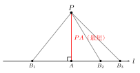
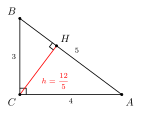
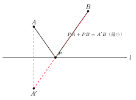

# 垂线、点到直线的距离

## 一、图形特征

两条直线相交时，如果其中一个角是直角，那么这两条直线就互相垂直。从图形上看：两线相交，四角皆为直角（一个直角立即推出其余三个也是直角，因为对顶角相等、邻补角互补）。垂直是相交的"特殊形态"——位置关系上它仍属于相交，只是角度被锁定为 $90°$。

## 二、定义与性质

- **垂直的定义**：两条直线相交所成的四个角中，如果有一个角是直角，就称这两条直线互相垂直，记作 $l_1 \perp l_2$（读作"$l_1$ 垂直于 $l_2$"）。
- **垂足**：两条互相垂直的直线的交点称为垂足。
- **垂线公理**：在同一平面内，过一点（无论这点在直线上还是在直线外）有且只有一条直线与已知直线垂直。"有且只有"意味着既保证存在，又保证唯一。
- **垂线段最短**：从直线外一点到这条直线上各点所连的线段中，垂线段最短。
- **点到直线的距离**：直线外一点到这条直线的垂线段的长度，叫做点到直线的距离。注意——"距离"是一个**长度**（数值），垂线段是一条**线段**（图形），两者概念不同但数值上一致。

## 三、为什么垂线段最短

设 $P$ 是直线 $l$ 外一点，$PA \perp l$ 于 $A$，$B$ 是 $l$ 上任意一个不同于 $A$ 的点。

连结 $PA$、$PB$，得 $\triangle PAB$。由 $PA \perp l$ 知 $\angle PAB = 90°$，因此 $\triangle PAB$ 是直角三角形，其中 $PA$、$AB$ 是两条直角边，$PB$ 是斜边。

由"直角三角形中斜边大于任一直角边"（这是勾股定理 $PB^2 = PA^2 + AB^2$ 的直接推论：因为 $AB > 0$，所以 $PB^2 > PA^2$，从而 $PB > PA$），即得

$$PB > PA.$$

由于 $B$ 是 $l$ 上任取的（异于 $A$ 的）点，所以从 $P$ 出发到 $l$ 上各点的所有连线中，垂线段 $PA$ 最短。这就解释了"点到直线的距离"为什么要用垂线段来定义。

## 四、典型应用

**例 1（尺规作图：过直线外一点作直线的垂线）**

已知：直线 $l$ 与直线外一点 $P$。求作：过 $P$ 且垂直于 $l$ 的直线。

【思路】利用"到两点距离相等的点在线段的垂直平分线上"以及圆的对称性。

【步骤】
1. 以 $P$ 为圆心，适当长为半径画弧，交直线 $l$ 于 $M$、$N$ 两点；
2. 分别以 $M$、$N$ 为圆心，**大于 $\tfrac{1}{2}MN$ 的同一长度**为半径画弧，两弧在 $l$ 的另一侧（或同侧均可）交于点 $Q$；
3. 作直线 $PQ$，则 $PQ \perp l$，垂足即 $PQ$ 与 $l$ 的交点。

依据：$P$、$Q$ 都到 $M$、$N$ 等距，因此 $PQ$ 是 $MN$ 的垂直平分线，自然 $PQ \perp l$。

**例 2（面积法求点到直线的距离）**

在 $\triangle ABC$ 中 $\angle C = 90°$，$AC = 3$，$BC = 4$。求点 $C$ 到 $AB$ 的距离。

【思路】点 $C$ 到 $AB$ 的距离就是从 $C$ 向 $AB$ 作垂线段的长度，记为 $h$。直接求 $h$ 不易，但 $\triangle ABC$ 的面积可以用两种方式表达——以 $AC$、$BC$ 为直角边算一次，以 $AB$ 为底、$h$ 为高再算一次——两式相等即可解出 $h$。

【解】由勾股定理 $AB = \sqrt{AC^2 + BC^2} = \sqrt{9 + 16} = 5$。

由面积相等：

$$\frac{1}{2} \cdot AC \cdot BC = \frac{1}{2} \cdot AB \cdot h,$$

即 $\tfrac{1}{2} \cdot 3 \cdot 4 = \tfrac{1}{2} \cdot 5 \cdot h$，解得 $h = \dfrac{12}{5}$。

所以点 $C$ 到 $AB$ 的距离为 $\dfrac{12}{5}$。**面积法**是求"点到直线距离"的常用利器，尤其在直角三角形或已知面积的图形中。

**例 3（最短路径的萌芽：将军饮马）**

公路 $l$ 的同侧有两个村庄 $A$、$B$，欲在 $l$ 上选一点 $P$ 建供电站，使 $PA + PB$ 最小。

【思路】"同侧两点 + 直线上一点连线之和最小"是经典模型。直接在 $l$ 上挪动 $P$ 难以判断最值，于是借助轴对称把"折线"拉直：作 $A$ 关于 $l$ 的对称点 $A'$，则对 $l$ 上任意点 $P$ 都有 $PA = PA'$，于是 $PA + PB = PA' + PB \ge A'B$，等号当且仅当 $A'$、$P$、$B$ 共线时取得。所以连结 $A'B$，与 $l$ 的交点即为所求的 $P$。

这就是后续要专门讲的"将军饮马"模型的原型，可与 toolkit/03 的"模型 11"对照学习。注意此处垂直的作用：作对称点要先作"过 $A$ 垂直于 $l$"的垂线。

## 五、易错点

1. **"距离"≠任意连线**："点到直线的距离"特指垂线段的长度，而不是从该点向直线上某点随手画的连线长度。题目中说"求点 $C$ 到 $AB$ 的距离"时，必须先（在心里或纸上）确定那条垂线段。
2. **垂线公理的"有且只有"**：既要"存在"（一定能作出来），又要"唯一"（只有一条）。在证明题中如果出现两条直线都垂直于同一直线、且都过同一点，那它们必然重合。
3. **面积法是核心工具**：当一个三角形的面积容易用两种底-高组合算出时，求"点到对边的距离"几乎都用面积法，比硬作垂线、用相似或勾股要快得多。
4. **垂线段 vs 垂线**：垂线是一条直线（或射线），垂线段是其中夹在"点"与"垂足"之间的那一段，二者不能混用。

## 六、思路自测题

1. 在同一平面内，过直线 $l$ 上一点 $A$ 作 $l$ 的垂线，能作几条？过 $l$ 外一点 $B$ 呢？依据是什么？
2. 直线 $l$ 外一点 $P$ 到 $l$ 上三点 $A$、$B$、$C$ 的距离分别为 $5$、$4$、$6$，问 $P$ 到 $l$ 的距离 $d$ 满足什么范围？（提示：垂线段最短 → $d \le 4$；并思考 $d$ 是否可能等于 $4$。）
3. 在 $\triangle ABC$ 中，$AB = 13$，$AC = 15$，$BC = 14$，已知其面积为 $84$。求点 $A$ 到 $BC$ 的距离。（提示：面积法，$\tfrac{1}{2} \cdot BC \cdot h = 84$。）
4. 公路 $l$ 同侧有 $A$、$B$ 两村，$A$ 到 $l$ 距离为 $3$ km，$B$ 到 $l$ 距离为 $5$ km，$A$、$B$ 在 $l$ 上的垂足相距 $8$ km。求在 $l$ 上建供电站使 $PA + PB$ 最小的最小值。（提示：作 $A$ 关于 $l$ 的对称点 $A'$，则 $A'$ 到 $l$ 距离也是 $3$ km 但在另一侧，$PA + PB$ 的最小值为 $A'B = \sqrt{8^2 + (3+5)^2} = \sqrt{128} = 8\sqrt{2}$ km。）
