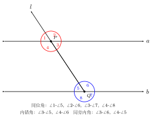
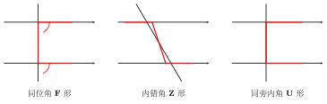

# 三线八角

> **本节定位**：三线八角只讲**位置关系**，不涉及任何**数量关系**（相等、互补）。相等/互补要等到第 04 节"平行线的判定"与第 05 节"平行线的性质"中，**两直线平行**这一前提出现之后才成立。本节的目标只有一个：看到一张图，能快速、准确地说出"哪两个角是同位角/内错角/同旁内角"。

## 一、图形特征

设有两条直线 $a, b$，再有第三条直线 $l$ 同时与 $a, b$ 相交（$l$ 不与 $a, b$ 重合，也不同时经过 $a, b$ 的同一交点）。这种"一条直线截另两条直线"的图形叫做**三线**结构，其中：

- $a, b$ 称为**被截直线**；
- $l$ 称为**截线**。

$l$ 与 $a$ 相交于点 $P$，在 $P$ 处产生 $4$ 个角；$l$ 与 $b$ 相交于点 $Q$，在 $Q$ 处又产生 $4$ 个角。两处共计 $4+4=8$ 个角，这就是"**三线八角**"名称的由来。

约定如下编号（标准图）：

- 在 $P$ 处，绕 $P$ 沿逆时针方向依次记为 $\angle 1, \angle 2, \angle 3, \angle 4$（其中 $\angle 1$ 在 $a$ 上方、$l$ 左侧；$\angle 2$ 在 $a$ 上方、$l$ 右侧；$\angle 3$ 在 $a$ 下方、$l$ 右侧；$\angle 4$ 在 $a$ 下方、$l$ 左侧）；
- 在 $Q$ 处同样规则记为 $\angle 5, \angle 6, \angle 7, \angle 8$。

这样 $\angle 1$ 与 $\angle 5$ 处于"截线 $l$ 同一侧（左侧）、被截直线同一方向（上方）"的位置上。



## 二、三类角的定义

**1. 同位角（"F 形"）**

两个角分别在 $P, Q$ 处，若同时满足：

- 在**截线 $l$ 的同一侧**；
- 在**被截直线 $a, b$ 的同一方向**（同为上方或同为下方）。

则称这两个角为**同位角**。

按上述编号，共有 $4$ 对同位角：

$$
\angle 1\text{ 与 }\angle 5,\quad \angle 2\text{ 与 }\angle 6,\quad \angle 3\text{ 与 }\angle 7,\quad \angle 4\text{ 与 }\angle 8.
$$

**2. 内错角（"Z 形"）**

两个角分别在 $P, Q$ 处，若同时满足：

- 在**截线 $l$ 的两侧**（一个在左、一个在右）；
- 都在**被截直线 $a, b$ 的内侧**（即夹在 $a$ 与 $b$ 之间的区域）。

则称这两个角为**内错角**。共有 $2$ 对：

$$
\angle 3\text{ 与 }\angle 5,\quad \angle 4\text{ 与 }\angle 6.
$$

**3. 同旁内角（"U 形"或"C 形"）**

两个角分别在 $P, Q$ 处，若同时满足：

- 在**截线 $l$ 的同一侧**；
- 都在**被截直线 $a, b$ 的内侧**。

则称这两个角为**同旁内角**。共有 $2$ 对：

$$
\angle 3\text{ 与 }\angle 6,\quad \angle 4\text{ 与 }\angle 5.
$$

注：八个角中处于 $a, b$ **外侧**的还可以两两配对为"外错角"和"同旁外角"，但初中阶段不作重点要求，本节不展开。

## 三、识别口诀

```
同位 F，内错 Z，同旁内 U（或 C）
```

字母形象记忆：

- **同位角 → F**：截线**同侧** + 被截直线**同方向**，把两个角的开口顺着字母 F 的两横描一遍，即可重合。
- **内错角 → Z**：截线**两侧** + 被截直线**内侧**，两个角恰好嵌在字母 Z 的两个拐弯处。
- **同旁内角 → U**：截线**同侧** + 被截直线**内侧**，两个角组成字母 U（或 C）的两个内角。



实战识别三步法：

1. **先认截线**——读题或观察图形，先找出"哪一条线穿过了另两条线"，那条就是 $l$。
2. **再认被截直线的内侧**——画一条横向参考线就能看清 $a, b$ 之间的"内侧"区域。
3. **最后判定位置**——对照口诀 F / Z / U 一一对应。

## 四、典型应用

**例 1（标准三线八角的全部配对）**

如上文约定：$a, b$ 被 $l$ 所截，$l$ 与 $a$ 交于 $P$ 形成 $\angle 1, \angle 2, \angle 3, \angle 4$；$l$ 与 $b$ 交于 $Q$ 形成 $\angle 5, \angle 6, \angle 7, \angle 8$，且 $\angle 1$ 与 $\angle 5$ 为同位角。试列出所有同位角对、内错角对、同旁内角对。

**思路**：直接套用编号约定与口诀，对号入座即可。

**解**：

- 同位角（共 $4$ 对）：$\angle 1\text{-}\angle 5$，$\angle 2\text{-}\angle 6$，$\angle 3\text{-}\angle 7$，$\angle 4\text{-}\angle 8$。
- 内错角（共 $2$ 对）：$\angle 3\text{-}\angle 5$，$\angle 4\text{-}\angle 6$。
- 同旁内角（共 $2$ 对）：$\angle 3\text{-}\angle 6$，$\angle 4\text{-}\angle 5$。

**例 2（复杂图中"截线身份"的辨别）**

在 $\triangle ABC$ 中，$D$ 是 $AB$ 上一点，$E$ 是 $AC$ 上一点，连接 $DE$。问：$\angle ADE$ 与 $\angle ABC$ 是什么关系的角？$\angle ADE$ 与 $\angle DEC$ 又是什么关系的角？

**思路**：图中线段 $AB$、$DE$、$BC$、$AC$ 互相交错，每条线段都可能既是"被截直线"又是"截线"。**先固定被截直线、再固定截线，位置关系才有意义**。

**解**：

1. 看 $\angle ADE$ 与 $\angle ABC$：这两个角分别在 $D$ 和 $B$ 处。$D, B$ 都在直线 $AB$ 上，因此 $AB$ 是**截线**；而 $DE$ 与 $BC$ 是**被截直线**。两角都在截线 $AB$ 的同一侧（$E, C$ 那一侧），且都在 $DE, BC$ 的同一方向（$A$ 那一方向），故为**同位角**。
2. 看 $\angle ADE$ 与 $\angle DEC$：这两个角分别在 $D$ 和 $E$ 处。$D, E$ 都在直线 $DE$ 上，因此 $DE$ 是**截线**；$AB$ 与 $AC$ 是**被截直线**。两角分居 $DE$ 两侧，又都在 $AB, AC$ 的内侧（夹在两被截直线之间），故为**内错角**。

**例 3（易错澄清：位置关系 ≠ 数量关系）**

已知 $\angle 1, \angle 2$ 是某三线八角图中的内错角，且 $\angle 1 = 50°$。能否断定 $\angle 2 = 50°$？

**思路**：本节定义的"内错角"只规定了**两角所处的位置**，并未对它们的度数作任何要求。"内错角相等"这一**数量结论**需要额外条件——**两条被截直线平行**。

**解**：不能。三线八角是**位置关系**，与角的大小无关。只有当被截的两条直线 $a \parallel b$ 时，才会有"内错角相等"的结论（这是下一节"平行线的判定/性质"的内容）。本题中没有给出 $a \parallel b$，所以 $\angle 2$ 可以是任意度数，无法仅凭"内错角"确定。

## 五、易错点

1. **位置 vs 数量**：三线八角只描述**位置关系**，**不蕴含任何数量关系**。一看到"同位角""内错角""同旁内角"就写"相等"或"互补"，是初学最常见的错误。
2. **先找截线**：识别时必须先弄清楚**哪一条是截线、哪两条是被截直线**。换一条线作截线，同一对角的"身份"会完全改变。
3. **身份会变**：在复杂图（如三角形 + 中位线、平行四边形 + 对角线）中，同一对角，**名称随你选哪条做截线而变化**——上一秒是同位角，换个视角可能就成了内错角。所以必须**说清楚"以哪条为截线"**。
4. **内侧 / 外侧**：内错角与同旁内角都要求"在被截直线**内侧**"，即夹在 $a, b$ 之间。若两个角都跑到 $a, b$ 外侧，那不是本节讨论的三类角。
5. **必须是不同交点处**：同位角、内错角、同旁内角的两个角分别在 $P, Q$ **两个不同的交点处**，不可能同处一点。

## 六、思路自测题

> 本节重点是**识别**，不是角度计算。下列题目均只要求写出位置关系，不计算度数。

**自测 1**　如图，直线 $AB, CD$ 被直线 $EF$ 所截，$EF$ 与 $AB$ 交于 $M$，与 $CD$ 交于 $N$。在 $M$ 处的四个角中，记 $\angle BMN$；在 $N$ 处的四个角中，记 $\angle MND$。问 $\angle BMN$ 与 $\angle MND$ 是什么关系的角？

**思路**：截线为 $EF$，被截直线为 $AB, CD$。$\angle BMN$ 与 $\angle MND$ 都在 $EF$ 的**同一侧**（$B, D$ 那一侧），都在 $AB, CD$ 的**内侧**。→ **同旁内角（U 形）**。

**自测 2**　在 $\triangle ABC$ 中，$\angle A$ 与 $\angle ABC$ 都"出现"在直线 $AB$ 上。若以 $AC$ 为截线，则 $\angle A$ 与图中哪个角构成同位角？

**思路**：以 $AC$ 为截线，被截直线必须是经过 $A$ 与 $C$ 之外另两点的直线。在 $\triangle ABC$ 中，经过 $A$ 的另一条边是 $AB$，经过 $C$ 的另一条边是 $CB$。于是 $\angle A$（位于 $A$ 处、$AC$ 一侧）与位于 $C$ 处、$AC$ **同侧同方向**的角即 $\angle BCA$ 的外角（延长 $CB$ 那一侧），即 $\angle BCA$ 的同方向同位角。→ 关键在于学会"先定截线，再找对应位置"。

**自测 3**　两条直线 $a \parallel b$，被截线 $l$ 所截，产生的 $\angle 3$ 与 $\angle 5$ 是内错角且 $\angle 3 = 60°$。能否断定 $\angle 5 = 60°$？

**思路**：本节单独看，仅凭"内错角"**不能**断定。但题目额外给了 $a \parallel b$，这一前提将在下一节告诉我们："两直线平行，内错角相等"。所以答案是**可以**——但理由来自下一节的性质定理，不是本节的定义。本题用来强调："位置定义"与"平行性质"的区别。

**自测 4**　如图，直线 $l_1, l_2, l_3$ 两两相交，构成一个三角形。问图中是否存在"三线八角"结构？若存在，请指出一组截线与对应的同位角；若不存在，请说明理由。

**思路**：三线八角要求**一条直线同时截另两条直线、且与它们交于两个不同点**。$l_1, l_2, l_3$ 两两相交——任取其中一条（如 $l_3$）作为截线，它与 $l_1, l_2$ 分别相交于两个不同点（三角形的两个顶点），符合定义。故**存在**三线八角结构。以 $l_3$ 为截线时，$l_3$ 与 $l_1$ 交点处和 $l_3$ 与 $l_2$ 交点处，处于"$l_3$ 同侧、$l_1$ 与 $l_2$ 同方向"的两个角即为一组同位角。注意：换 $l_1$ 或 $l_2$ 作截线，又会得到新一组三线八角。
