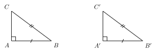
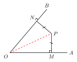

# 直角三角形全等：HL

## 一、图形特征

本节讨论一种**专属于直角三角形**的全等判定。它的图形特征非常清楚：

- 两个三角形都是**直角三角形**（各有一个 $90^\circ$ 角）；
- 它们的**斜边**（直角所对的那条边）对应相等；
- 它们的**某一条直角边**也对应相等。

在普通三角形中，"两边及其中一边的对角相等"（即 SSA）一般不足以判定全等（参见上一节）。但当那个已知角恰好是 $90^\circ$ 时，情况发生了根本变化：歧义消失了，全等被唯一锁定。这正是 HL 判定要刻画的现象。

## 二、判定 HL

**HL 定理（斜边-直角边判定）**：在两个直角三角形中，如果**斜边和一条直角边**对应相等，那么这两个直角三角形全等。

记号 **HL** 来自英文 **Hypotenuse-Leg**：

- **H**（Hypotenuse，斜边）：直角所对的那条边；
- **L**（Leg，直角边）：构成直角的两条边之一。

形式化写法：在 $\triangle ABC$ 与 $\triangle DEF$ 中，若
$$\angle C = \angle F = 90^\circ,\quad AB = DE\ (\text{斜边}),\quad AC = DF\ (\text{一条直角边}),$$
则 $\triangle ABC \cong \triangle DEF$（**HL**）。

需要特别强调：

1. HL 只适用于**直角三角形**——必须先确认或证明两个三角形都有直角；
2. 相等的那对边里，必须**恰有一条是斜边**（两个三角形的斜边对应），另一条是直角边对应；
3. HL 与前一节的 SSS、SAS、ASA、AAS 并列，是直角三角形特有的"第五个判定"。

## 三、HL 为何成立

HL 看上去像是一条"新公理"，但它其实**不是独立的**——它可以由前一节的判定推出。理解这一点对避免误用 HL 非常重要。

**(1) HL 是 SSA 的特例。** "斜边-直角边"在形式上是"两边及其中一边的对角"：已知两条边相等，再加上一个等于 $90^\circ$ 的角，而该角恰好是其中一条边（斜边）的对角。换句话说：

$$\text{HL} = \text{SSA},\quad \text{其中那个角} = 90^\circ.$$

我们在上一节指出 SSA 一般不成立，原因是"从一点作给定长度的线段去交一条射线，可能有两个交点"——这就是 SSA 的两解歧义。但当这个角是直角时，**歧义消失了**：

- 几何上看，从直角顶点作另一直角边时方向被锁死（必须垂直），因此第三个顶点的位置由斜边长度唯一决定；
- 圆周角的视角：以斜边为直径的圆上，直角顶点的位置在固定圆上，配合一条直角边的长度，只剩唯一解。

**(2) 由勾股定理可化归为 SSS。** 这是最直接、最算术化的证法。设两个直角三角形分别为 $\triangle ABC$（$\angle C = 90^\circ$，直角边 $a = BC, b = AC$，斜边 $c = AB$）与 $\triangle DEF$（$\angle F = 90^\circ$，直角边 $d = EF, e = DF$，斜边 $f = DE$）。已知 $c = f$（斜边对应相等）、$b = e$（一条直角边对应相等）。由勾股定理：
$$a^2 = c^2 - b^2,\qquad d^2 = f^2 - e^2.$$
代入 $c = f$、$b = e$，得 $a^2 = d^2$，因此 $a = d$（边长为正）。

这样，两个三角形的**三条边**全部对应相等。由 **SSS** 即得全等。

**(3) 结论。** HL 本质上是 SSS 在"已知一组对应边为斜边，另一组对应边为直角边"这种特殊情形下的简便记法。把它单列出来，是因为在直角三角形相关的题目里，往往**直接看到斜边和直角边**，不必再调用勾股定理算第三条边——直接套 HL 一步到位，省时省力。

## 四、典型应用

### 例 1：基础——HL 的直接套用

题目：如图，$\triangle ABC$ 与 $\triangle DEF$ 满足 $\angle C = \angle F = 90^\circ$，$AB = DE$，$AC = DF$。求证：$\triangle ABC \cong \triangle DEF$。

【思路】先逐项核对 HL 的三项要求：
- 两三角形都是直角三角形？$\angle C = \angle F = 90^\circ$，✓；
- 斜边对应相等？$AB$ 是 $\angle C$ 的对边、$DE$ 是 $\angle F$ 的对边，都是斜边，且 $AB = DE$，✓；
- 一条直角边对应相等？$AC, DF$ 都是直角边，且 $AC = DF$，✓。

三项齐全，直接套 **HL**，得 $\triangle ABC \cong \triangle DEF$。

**附注**：由全等可进一步得到 $BC = EF$（另一条直角边）以及 $\angle A = \angle D,\ \angle B = \angle E$。这一步常被用作后续推理的"中间结论"。

### 例 2：角平分线性质的逆定理

（呼应 part1/03 中关于角平分线的内容。）

题目：设 $P$ 是 $\angle AOB$ 内部一点，过 $P$ 分别向 $OA$、$OB$ 作垂线，垂足为 $M, N$。若 $PM = PN$，求证：$OP$ 平分 $\angle AOB$。

【思路】关键是构造出两个直角三角形并对它们用 HL。

观察 $\triangle OPM$ 与 $\triangle OPN$：

- 由作图，$PM \perp OA$、$PN \perp OB$，所以 $\angle OMP = \angle ONP = 90^\circ$。两个三角形都是**直角三角形**；
- $OP$ 是这两个直角三角形的**公共斜边**（直角所对的边），故 $OP = OP$；
- 题设 $PM = PN$，这是两条直角边对应相等。

斜边对应相等 + 一条直角边对应相等 + 都是直角三角形 → 由 **HL** 得
$$\triangle OPM \cong \triangle OPN.$$

由全等对应角相等，$\angle MOP = \angle NOP$，即 $OP$ 平分 $\angle AOB$。$\blacksquare$

**意义**：这正是角平分线**性质定理的逆**——"到角两边距离相等的点必在角平分线上"。HL 在此处提供了最简洁的证法；若不使用 HL，就要先用勾股定理算 $OM$、$ON$ 才能凑出 SSS，过程繁琐得多。

## 五、易错点

1. **HL 仅限直角三角形！** 这是最重要也最易被忽视的限制。如果两个三角形不是直角三角形，**绝对不能**用 HL；强行使用就退化成普通的 SSA——而我们已经知道 SSA 一般不成立。许多错误证明的根源就在于"先用了 HL，再回头补直角条件"，而那个直角根本没有保证。

2. **斜边与直角边的"对应"要看清。** HL 要求**斜边对斜边、直角边对直角边**。如果一对相等的边里一条是斜边、另一条是直角边（异位），那也不是 HL，而是错误使用。

3. **不要遗漏"直角"这一条件。** 写证明时务必先指出 $\angle C = \angle F = 90^\circ$（或由垂直、勾股逆定理等推出直角），再写斜边相等、直角边相等，最后写"由 HL 得全等"。三项缺一不可。

4. **HL 不能反推非直角三角形的结论。** 即使把题目改一改、去掉直角条件，HL 的结论也不再成立。要养成"先验直角，再用 HL"的习惯。

5. **能用 SAS/ASA/AAS 时优先考虑，不必死守 HL。** 直角三角形中，若已知一条直角边和一锐角，往往用 ASA/AAS 更直接；HL 的独特价值在于"只知道两条边（且其中一条是斜边）"的情形。

## 六、思路自测题

1. 在 Rt$\triangle ABC$（$\angle C = 90^\circ$）与 Rt$\triangle DEF$（$\angle F = 90^\circ$）中，$AB = DE = 5$，$BC = EF = 3$。能否判定两三角形全等？用哪条判定？另一条直角边的长度是多少？

2. 两个三角形 $\triangle ABC$ 与 $\triangle DEF$ 中，$AB = DE$，$AC = DF$，$\angle B = \angle E$。能否用 HL 判定全等？为什么？（提示：先问"是直角三角形吗？"再问"相等的是斜边和直角边吗？"）

3. 如图，$AD$ 是 $\triangle ABC$ 中 $BC$ 边上的高（即 $AD \perp BC$，$D$ 在 $BC$ 上），又已知 $AB = AC$。求证：$BD = DC$。（提示：考虑 $\triangle ABD$ 与 $\triangle ACD$，它们都是以 $AD$ 为公共直角边的直角三角形。可以用 HL 完成，本题也是"等腰三角形三线合一"的一种证法。）
