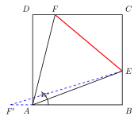
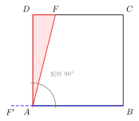
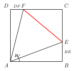
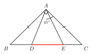

# 半角模型

> **一图速记**：正方形（或等腰直角三角形）+ 顶点处一个等于"半顶角"的角，把分散在两段上的条件**通过旋转**折合为一段。

## 一、引入

来看一道经典的正方形题目：

> 正方形 $ABCD$ 中，$E$ 在 $BC$ 上，$F$ 在 $CD$ 上，且 $\angle EAF = 45°$。求证：$EF = BE + DF$。

这道题让无数同学卡壳。卡点非常具体：$EF$ 是一段线段，$BE + DF$ 是两段线段分别长在不同的边上。你死盯着图看，怎么也想不出它们之间有什么显然的等量关系。用相似？算不出来。用面积？凑不齐。用勾股？$\angle EAF = 45°$ 又不是直角。

问题的本质是：**两段在不同位置上的线段，怎么"合"成一段？**

这就是"半角模型"要解决的核心矛盾。它给出的答案只有两个字：**旋转**。

## 二、思维路径还原

我们模拟一个完整的思考过程，看看一位"已经会做"的同学是如何一步步把这道题想通的：

> "$\angle EAF = 45°$，而正方形的 $\angle BAD = 90°$。$45°$ 恰好是 $90°$ 的一半——这是个明显的信号，**半角**这个名字就是这么来的。
>
> 我要把 $BE$ 和 $DF$ 拼成 $EF$。它们分别在 $BC$、$CD$ 上——能不能把 $\triangle ADF$ 转到 $\triangle ABF'$ 那里去，让 $DF$ 跑到 $BC$ 的延长线上？这样 $BE$ 和"搬过来的 $DF$"就会首尾相接，变成 $BC$ 延长线上的一整段。
>
> 为什么敢这么转？因为正方形有 $AB = AD$，这两条边长度相等——这正是旋转所需要的"两腰相等"基础。
>
> 我把 $\triangle ADF$ 绕 $A$ 顺时针旋转 $90°$：$D$ 落到 $B$（因为 $\angle DAB = 90°$ 且 $AD = AB$），$F$ 落到 $BC$ 延长线上某点 $F'$。
>
> 旋转后立刻得到：$AF = AF'$、$DF = BF'$、$\angle DAF = \angle BAF'$。
>
> 现在我想证 $\triangle AEF \cong \triangle AEF'$：
>   - $AE$ 是公共边，✓
>   - $AF = AF'$（旋转得来），✓
>   - 还差一个夹角。$\angle EAF = 45°$ 是已知。$\angle EAF'$ 等于多少？
>   - $\angle F'AE = \angle F'AB + \angle BAE = \angle DAF + \angle BAE$
>   - 而 $\angle DAF + \angle BAE = \angle BAD - \angle EAF = 90° - 45° = 45°$
>   - 所以 $\angle EAF' = 45° = \angle EAF$，✓
>
> SAS 凑齐！$\triangle AEF \cong \triangle AEF'$。
>
> 全等就给出 $EF = EF'$。而 $EF' = BF' + BE = DF + BE$。
>
> 所以 $EF = BE + DF$。证毕！"

整个推理的关键转折点只有一个：**意识到 $45°$ 是 $90°$ 的一半，意识到 $AB = AD$ 提供了旋转基础**。其余都是顺理成章。

## 三、抽象成模型

剥掉具体题目，把骨架抽出来：

**图形特征**：正方形 $ABCD$（或等腰直角三角形）+ 顶点 $A$ 处一个等于半顶角（即 $45°$）的角 $\angle EAF$，其中 $E, F$ 分别在两邻边 $BC, CD$ 上。

**核心结论**：$EF = BE + DF$（"两短段之和 $=$ 一长段"）。

**标准证法**：把 $\triangle ADF$ 绕 $A$ 旋转 $90°$ 至 $\triangle ABF'$，利用 $AB = AD$，凑出 $\triangle AEF \cong \triangle AEF'$（SAS），得 $EF = EF'$，进而 $EF = BE + DF$。

记住这三步：**识别半角 → 旋转拼合 → SAS 全等**。

## 四、模型变形

半角模型不是只有"正方形 $+ 45°$"这一副面孔。它的本质是更普遍的：

- **等腰直角三角形版**：直角顶点处一个 $22.5°$ 的角（半顶角），结论形式相同。
- **顶点处角 $=$ 半顶角的一般等腰版**：设等腰三角形顶角为 $2\alpha$，顶点处再画一个 $\alpha$（半角），两边交底边（或其延长线）于两点。结论仍然 $EF = BE + DF$（在合适配置下）。
- **半角在外部**：如 $E$ 在 $BC$ 延长线上 $\to$ 结论变为 $EF = DF - BE$。等式变了，但思路（旋转）不变。
- **本质**：通过旋转把两段折合，依赖"等腰两腰相等"提供旋转基础。**没有等腰，就没有半角**。

## 五、思考路标

把它内化成几条触发信号：

- 看到**正方形 $+$ 顶点处 $45°$ 角** $\to$ **半角模型**，立刻想到旋转。
- 看到**等腰三角形 $+$ 顶点处等于半顶角的角** $\to$ 半角模型推广版。
- 出现"**两短段之和 $=$ 一长段**"等式 $\to$ 旋转构造全等 $=$ 半角最常用思路。
- 旋转的角度 $=$ 等腰的顶角（正方形版本中是 $90°$，一般等腰版本中是 $2\alpha$）。
- 旋转哪个三角形？把"被旋走的边"的对边作为依据——正方形里 $AB = AD$ 是关键，旋转 $\triangle ADF$ 是因为 $AD$ 能落到 $AB$ 上去。

特别提醒：**$45°$ 角永远是半角模型的最强信号**。中考几何看到正方形里冒出 $45°$，先按半角思路试一遍。

## 六、应用例题

**例 1**：正方形 $ABCD$ 边长 $1$，$E$ 在 $BC$ 上，$F$ 在 $CD$ 上，$\angle EAF = 45°$。求 $\triangle CEF$ 的周长。

> "先看图：典型半角配置。先按模型证 $EF = BE + DF$（旋转 $\triangle ADF$ 绕 $A$ 顺时针 $90°$，全等论证同引入题，略）。
>
> 然后算周长 $L = CE + CF + EF$。把 $EF$ 拆掉：
> $L = CE + CF + BE + DF = (CE + BE) + (CF + DF) = BC + CD = 1 + 1 = 2$。
>
> 漂亮！周长恒等于正方形周长的一半，与 $E, F$ 的具体位置无关。"

**例 2**：等腰直角 $\triangle ABC$ 中，$\angle BAC = 90°$，$AB = AC$，$D, E$ 分别在 $BC$ 上（$D$ 靠近 $B$，$E$ 靠近 $C$），$\angle DAE = 45°$。求证：$DE^2 = BD^2 + EC^2$。

> "$\angle BAC = 90°$，$\angle DAE = 45°$，又是 $90°$ 的一半——半角模型在等腰直角三角形里登场。
>
> 还是旋转。把 $\triangle ABD$ 绕 $A$ 逆时针旋转 $90°$：$B \to C$（因为 $AB = AC$ 且 $\angle BAC = 90°$），$D \to D'$。
>
> 旋转后：$AD = AD'$，$BD = CD'$，$\angle BAD = \angle CAD'$。$D'$ 落在哪里？$\angle ACD' = \angle ABD = 45°$（等腰直角的底角），而 $\angle ACB = 45°$，所以 $\angle D'CE = \angle ACD' + \angle ACE = 45° + 45° = 90°$。
>
> 接下来证 $\triangle ADE \cong \triangle AD'E$：
>   - $AE$ 公共
>   - $AD = AD'$
>   - $\angle D'AE = \angle D'AC + \angle CAE = \angle DAB + \angle CAE = 90° - 45° = 45° = \angle DAE$
>   - SAS $\Rightarrow$ 全等 $\Rightarrow$ $DE = D'E$。
>
> 最后在 $Rt\triangle D'CE$ 中（$\angle D'CE = 90°$）用勾股：
> $D'E^2 = D'C^2 + CE^2$，即 $DE^2 = BD^2 + EC^2$。证毕。"

## 七、思路自测题

四道题，先想思路再翻提示。

**自测 1**：正方形 $ABCD$ 中，$E, F$ 分别在 $BC, CD$ 上，$\angle EAF = 45°$。若 $BE = 3$，$DF = 2$，求 $EF$。

💡 提示：直接套半角模型结论 $EF = BE + DF$，所以 $EF = 5$。无需重新证明（除非题目要求）。

**自测 2**：正方形 $ABCD$ 中，$E$ 在 $BC$ 延长线上（即 $C$ 在 $B, E$ 之间），$F$ 在 $CD$ 上，$\angle EAF = 45°$。猜想并证明 $EF, BE, DF$ 三者之间的关系。

💡 提示：半角"外部版"。结论改为 $EF = BE - DF$。证法：把 $\triangle ADF$ 绕 $A$ 旋转 $90°$，让 $D$ 落到 $B$，再凑全等——这次 $F'$ 落在 $BE$ 内部，所以 $EF' = BE - BF' = BE - DF$。

**自测 3**：正方形 $ABCD$ 边长 $6$，$E$ 在 $BC$ 上，$F$ 在 $CD$ 上，$\angle EAF = 45°$，$BE = 2$。求 $DF$。

💡 提示：设 $DF = x$。由半角 $EF = 2 + x$。又 $CE = 6 - 2 = 4$，$CF = 6 - x$。在 $Rt\triangle CEF$ 中勾股：$(6 - x)^2 + 16 = (2 + x)^2$，解得 $x = 3$。所以 $DF = 3$。

**自测 4**：等腰 $\triangle ABC$ 中 $AB = AC$，$\angle BAC = 120°$，$D, E$ 在 $BC$ 上，$\angle DAE = 60°$。猜想 $BD, DE, EC$ 的关系并简述思路。

💡 提示：顶角 $120°$，半角 $60°$。但 $\triangle ABC$ 不是直角，底角为 $30°$。旋转 $\triangle ABD$ 绕 $A$ 旋转 $120°$ 至 $\triangle ACD'$，则 $\angle D'CE = \angle ACD' + \angle ACE = 30° + 30° = 60°$，并非 $90°$，不能直接用勾股。但仍可证 $\triangle ADE \cong \triangle AD'E$（SAS，$\angle D'AE = 60°$），得 $DE = D'E$。此时 $BD = CD'$，三段之间满足三角形关系：$D', C, E$ 构成 $\angle D'CE = 60°$ 的三角形，用余弦定理得 $DE^2 = BD^2 + EC^2 + BD \cdot EC$。这就是半角模型在非直角等腰上的推广形式。
