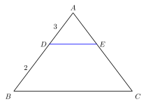
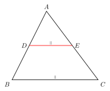
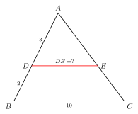
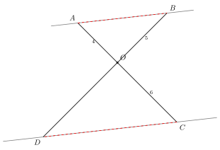
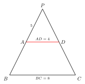

# A 字、X 字、8 字相似模型

> **一图速记**：两条平行线被两条直线（共顶点）所截，形成两个相似三角形——共顶点在两平行线**同侧**时是 **A 字**；共顶点在两平行线**之间**时是 **X 字（或 8 字）**。

## 一、引入：一道最朴素的"平行线 + 三角形"题

> **题目**：$\triangle ABC$ 中，$DE \parallel BC$，$D \in AB$、$E \in AC$。求证：$\triangle ADE \sim \triangle ABC$，并求 $\dfrac{AD}{AB} = \dfrac{AE}{AC} = \dfrac{DE}{BC}$。

请你先合上书自己想一分钟。这道题"看上去太简单"，但它正是整章相似三角形的**起点**——把它彻底吃透，后面所有"比例线段""分点比""中位线""平行线分线段成比例"全都是它的影子。

大多数人写不出来，**不是因为不会**，而是因为没意识到：
- "平行线"这个条件**唯一能用的方式**就是去拿"相等的同位角 / 内错角"；
- "证比例 $\dfrac{AD}{AB} = \dfrac{DE}{BC}$"这一类目标，**唯一的源头**就是相似三角形的对应边。

把这两件事拧在一起，结论就是天经地义的。

## 二、思维路径还原（解题者的内心独白）

> "$DE \parallel BC$ —— 平行线第一反应：性质（part2/05）告诉我能得到一对相等的同位角 / 内错角。**平行线本身不给长度、不给角，唯一给的就是这一对角，必须把它用出来**。
>
> $DE \parallel BC$ + 截线 $AB$ → 同位角 $\angle ADE = \angle ABC$。
>
> $DE \parallel BC$ + 截线 $AC$ → 同位角 $\angle AED = \angle ACB$。
>
> 还有公共顶角 $\angle A = \angle A$。
>
> 三组角都相等，其实**两组就够**——**AA → 相似**。
>
> 对应关系按字母顺序读：$\triangle ADE \sim \triangle ABC$，相似比 $\dfrac{AD}{AB}$（顶点对顶点，$A\leftrightarrow A,D\leftrightarrow B,E\leftrightarrow C$）。
>
> 由相似的性质：对应边成比例 → $\dfrac{AD}{AB} = \dfrac{AE}{AC} = \dfrac{DE}{BC}$。证毕。
>
> 等等，把图盯紧一点：这是经典的 **A 字模型**——整个图形像字母 A，**共顶点 $A$ 在上**，$DE$ 是 A 中间那一横，$BC$ 是 A 底下那一横。两条横杠平行，两条斜边交于顶点。
>
> 那如果 $DE$ 跑到 $A$ 的反向延长线那一侧呢（$D, E$ 分别在直线 $AB, AC$ 反向延长线上）？共顶点 $A$ 就跑到了两平行线**之间**——这时一组对应角靠**对顶角**得到（$\angle DAE = \angle BAC$ 自动相等），另一组靠**内错角**（$\angle ADE = \angle ABC$，因为 $DE \parallel BC$ 被截线截出内错角）。结论仍然是 $\triangle ADE \sim \triangle ABC$，但图形形如字母 **X**（或者像数字 **8**：两个三角形头对头、尖儿冲尖儿）。"

把这段独白读三遍，你会发现：
1. **A 字和 X 字本质是同一件事**——都是"两条平行线被两条共顶点的直线所截"。区别仅仅是共顶点站在平行线**外侧**还是**之间**；
2. 凑 AA 时，**A 字用同位角 + 公共角**，**X 字用内错角 + 对顶角**——是平行线性质 + 顶点位置共同决定的。

## 三、抽象成模型

**A 字模型**：

- **图形特征**：两平行线 $l_1 \parallel l_2$，被两条共顶点的直线所截，共顶点 $P$ 在两平行线**同侧**（即 $l_1, l_2$ 都在 $P$ 的一边）。
- **凑相似的方式**：$l_1 \parallel l_2$ → 同位角相等；再加公共顶角 → AA。
- **核心结论**：截出的两个三角形相似，对应边成比例。

**X 字 / 8 字模型**：

- **图形特征**：两平行线 $l_1 \parallel l_2$，被两条共顶点的直线所截，共顶点 $P$ 在两平行线**之间**。
- **凑相似的方式**：$l_1 \parallel l_2$ → 内错角相等；再加对顶角 → AA。
- **核心结论**：同样是两个相似三角形，对应边成比例。这两个三角形头对头、像字母 X 或数字 8。

**共同结论（这才是真正要记住的）**：

- 只要看见"**两平行线 + 共顶点的两截线**"，就有**两个相似三角形**；
- 相似就给**比例线段**：$\dfrac{\text{大三角形的对应边}}{\text{小三角形的对应边}} = \text{相似比}$。

**为什么叫 A / X / 8**：把图形里的辅助元素抹掉，只看两个三角形的轮廓——A 字三角形是顶点朝上、两条平行底边一上一下夹一个尖；X 字 / 8 字是两个三角形屁股贴屁股共一个顶点。形状像字母，名字就这么来。

## 四、模型变形

A / X 字相似一旦理解，立刻能延伸出初中阶段所有"比例线段"工具：

- **变形 1（平行线分线段成比例定理）**：三条（或多条）互相平行的直线截两条直线，所截出的**对应线段**成比例。本质就是若干个 A 字 / X 字嵌套——每两条平行线 + 两条截线 = 一个 A 字。
- **变形 2（推论：三角形一边平行线截另两边）**：$\triangle ABC$ 中 $DE \parallel BC$ 截 $AB, AC$ 于 $D, E$，则 $\dfrac{AD}{DB} = \dfrac{AE}{EC}$。把整段 $AB$ 拆成 $AD + DB$、$AC$ 拆成 $AE + EC$，由 $\dfrac{AD}{AB} = \dfrac{AE}{AC}$ 反推即得。**这条结论平时用得比"$\dfrac{AD}{AB} = \dfrac{DE}{BC}$"还多**。
- **变形 3（梯形里找 A 字）**：梯形 $ABCD$（$AD \parallel BC$）延长两腰交于 $P$ → $\triangle PAD$ 与 $\triangle PBC$ 构成天然 A 字相似。**所有"延长梯形两腰"的辅助线，骨子里都是这一条**。
- **变形 4（多层嵌套）**：图中有多组平行线 → 多组 A 字 / X 字 → 多组比例可以**串起来**（比例的传递）。比如 $\dfrac{a}{b} = \dfrac{c}{d}$、$\dfrac{c}{d} = \dfrac{e}{f}$ → $\dfrac{a}{b} = \dfrac{e}{f}$。
- **退化情形**：$DE$ 落到一条边上（$D = A$ 或 $E = A$）三角形退化，但比例式 $\dfrac{AD}{AB} = \dfrac{AE}{AC}$ 仍恒成立（两边都是 $0$ 或都是 $1$）。
- **本质**：A 字 / X 字 = "**平行线 + 共顶点 → AA 相似**"。无论它穿上多少花衣裳（梯形、网格、坐标系、动点），脱下来都是这一句话。

## 五、思考路标（看到 X → 想到 Y）

- 看到**三角形中有一条与某边平行的线段** → **A 字相似**，立刻写 $\dfrac{\text{上段}}{\text{全段}} = \dfrac{\text{上段}}{\text{全段}} = \dfrac{\text{平行截线}}{\text{底边}}$；
- 看到**两直线交于一点 + 过此点的两条平行线**（或被两平行线所截）→ **X 字 / 8 字相似**，对顶角 + 内错角凑 AA；
- 题目要求**比例线段**（任何形如 $\dfrac{AB}{CD}$ 的等式）→ **找平行线**；若图中没有现成的，就**自己作**一条（toolkit/02 常用辅助线）；
- 看到**梯形**（一组对边平行）→ 第一反应是延长两腰交于一点，构造 A 字相似；
- 看到**多组平行线** → 多组 A 字 → 多组比例可以**乘除串联**；
- 看到题目里出现"$\dfrac{AD}{AB} =$ 某值"——**下意识找 A 字**；找到了就找它在外面的对应边、对应比；
- 看到**中点 + 平行**（典型如三角形中位线）→ 也是 A 字相似 + 相似比 $\dfrac{1}{2}$ 的特殊情形。

## 六、应用例题

下面三例都不写完整证明，只演示"**路标识别 + 模型套用**"，剩下的请你自己补完。

**例 1（基础 A 字）**：$\triangle ABC$ 中 $DE \parallel BC$，$D \in AB$、$E \in AC$，$AD = 3, DB = 2, BC = 10$。求 $DE$。

> **路标触发**："三角形 + 一边平行线" → A 字相似。**思路**：$AB = AD + DB = 5$；A 字相似得 $\dfrac{AD}{AB} = \dfrac{DE}{BC}$，即 $\dfrac{3}{5} = \dfrac{DE}{10}$，所以 $DE = 6$。

**例 2（X 字）**：两直线相交于 $O$，分别交两条平行线 $l_1 \parallel l_2$ 于 $l_1$ 上的 $A, B$ 与 $l_2$ 上的 $C, D$（$A, C$ 在一条截线上，$B, D$ 在另一条截线上）。已知 $OA = 4, OC = 6, OB = 5$，求 $OD$。

> **路标触发**："两直线交于一点 + 过此点的两平行线截出两个三角形" → X 字相似。**思路**：$\triangle OAB \sim \triangle OCD$（对顶角 + 内错角，AA），对应边 $\dfrac{OA}{OC} = \dfrac{OB}{OD}$ → $\dfrac{4}{6} = \dfrac{5}{OD}$ → $OD = \dfrac{15}{2}$。X 字相似比从来都是"**共顶点到 $l_1$ 的距离** : **共顶点到 $l_2$ 的距离**"。

**例 3（梯形找 A 字）**：梯形 $ABCD$ 中 $AD \parallel BC$，延长 $BA$、$CD$ 交于 $P$。已知 $AD = 4, BC = 8, PA = 5$。求 $AB$。

> **路标触发**："梯形 + 延长两腰" → A 字相似（$\triangle PAD \sim \triangle PBC$）。**思路**：A 字得 $\dfrac{PA}{PB} = \dfrac{AD}{BC} = \dfrac{4}{8} = \dfrac{1}{2}$ → $PB = 2 PA = 10$ → $AB = PB - PA = 10 - 5 = 5$。**记住**：梯形里的"上底 : 下底"就是 A 字的相似比，这条等式背下来。

## 七、思路自测题

做下面四题，做之前先在脑中默念一遍第五节的路标。

**自测 1**：$\triangle ABC$ 中 $DE \parallel BC$，$D \in AB$、$E \in AC$，$\dfrac{AD}{DB} = \dfrac{2}{3}$，$DE = 4$。求 $BC$。

> 💡 提示：先把 $\dfrac{AD}{DB} = \dfrac{2}{3}$ 翻译成 $\dfrac{AD}{AB} = \dfrac{2}{5}$（这是 A 字相似比真正要用的形式），再套 $\dfrac{DE}{BC} = \dfrac{AD}{AB}$ 得 $BC = 10$。

**自测 2（X 字）**：两条平行线 $l_1 \parallel l_2$ 之间夹着一点 $O$，过 $O$ 的两条直线分别交 $l_1$ 于 $A, B$、交 $l_2$ 于 $A', B'$（$A, A'$ 同一截线上，$B, B'$ 同一截线上）。已知 $\dfrac{OA}{OA'} = \dfrac{3}{4}$，$AB = 6$。求 $A'B'$。

> 💡 提示：X 字相似得 $\triangle OAB \sim \triangle OA'B'$，相似比 $\dfrac{3}{4}$（注意对应方向：$A \leftrightarrow A', B \leftrightarrow B'$ 由对顶角自动配好）。所以 $\dfrac{AB}{A'B'} = \dfrac{3}{4}$ → $A'B' = 8$。

**自测 3（隐藏的 A 字）**：$\triangle ABC$ 中 $D$ 在 $AB$ 上，$E$ 在 $AC$ 上，$\dfrac{AD}{AB} = \dfrac{AE}{AC} = \dfrac{1}{3}$。求证：$DE \parallel BC$ 且 $DE = \dfrac{1}{3} BC$。

> 💡 提示：这是 A 字模型的**逆向**——已知两对应边成比例 + 公共顶角，能不能反推平行？能。$\dfrac{AD}{AB} = \dfrac{AE}{AC}$ 加公共角 $\angle A$，用 SAS 相似判定（不是 AA！）得 $\triangle ADE \sim \triangle ABC$ → $\angle ADE = \angle ABC$（同位角相等）→ $DE \parallel BC$。再由相似比即得 $DE = \dfrac{1}{3} BC$。**结论**：A 字模型不仅是"平行 ⇒ 相似 ⇒ 比例"，反过来"比例 + 公共顶角 ⇒ 相似 ⇒ 平行"也成立——这条逆用经常在压轴题里救命。

**自测 4（多层嵌套 + 梯形）**：梯形 $ABCD$ 中 $AD \parallel BC$，$AD = 3, BC = 9$。$E$ 是 $AB$ 上一点，过 $E$ 作 $EF \parallel BC$ 交 $CD$ 于 $F$，且 $\dfrac{AE}{EB} = \dfrac{1}{2}$。求 $EF$。

> 💡 提示：图中有三条平行线 $AD, EF, BC$ → **平行线分线段成比例**或**两次 A 字**。一条常用辅助线：过 $A$ 作 $AG \parallel CD$ 交 $EF$、$BC$ 于 $H, G$——把梯形拆成平行四边形 $AGCD$ + 三角形 $\triangle ABG$。$AG \parallel HF \parallel DC$ 且 $AD = HF$ 之类的关系一旦看出，剩下就是在 $\triangle ABG$ 里做 A 字：$\dfrac{AE}{AB} = \dfrac{EH}{BG}$，$BG = BC - AD = 6$，$\dfrac{AE}{AB} = \dfrac{1}{3}$ → $EH = 2$ → $EF = EH + HF = 2 + 3 = 5$。**这一类"梯形里的中间平行线"在中考几乎每年出现**，记住套路：补成三角形 + A 字。

---

**回头看一眼"一图速记"**：

> 两条平行线被两条共顶点的直线所截 → 两个相似三角形。共顶点在两平行线同侧 → A 字（同位角 + 公共角）；共顶点在两平行线之间 → X 字 / 8 字（内错角 + 对顶角）。

如果现在你脑中能秒回这一句话，并且看到"三角形 + 一边平行线"立刻在心里把 A 字画出来——那么 A / X / 8 字相似模型，你拿下了。后面所有"比例线段"题目，本质上都是它的变奏。
