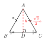

# 等边三角形

等边三角形是初中几何中"对称性最强"的三角形：它既是等腰三角形的特殊情形，又把 30-60-90 直角三角形（见 rt/03）"对折"在一起，因此关于它的所有计算都可以归结为两个关键常数 $\frac{\sqrt{3}}{2}$ 和 $\frac{\sqrt{3}}{4}$。掌握这两个常数，并理解"等腰 + 一个 $60°$ 角 = 等边"这一极易被忽视的判定，是这一节的核心。

---

## 一、图形特征

**等边三角形**：三边都相等的三角形，也称为**正三角形**。

记号上，若 $\triangle ABC$ 满足 $AB = BC = CA = a$，则称它为边长为 $a$ 的等边三角形。

由"三边相等"立刻可知三个内角也相等，再结合内角和 $180°$，每个内角恰好是 $60°$。这就是等边三角形最常用的"信号"——只要题目里出现 $60°$，就要联想是否能凑出等边。

---

## 二、性质与判定

### 1. 性质

设 $\triangle ABC$ 是边长为 $a$ 的等边三角形：

1. **三个内角都是 $60°$**：$\angle A = \angle B = \angle C = 60°$。
2. **是等腰三角形的特殊情形**：等腰三角形的所有性质（两底角相等、三线合一、轴对称等）在等边三角形中**全部继承**。
3. **三条高、中线、角平分线、中垂线全部重合**：
   - 等腰三角形只有"顶角"对应的那条三线合一；
   - 等边三角形则**每一个顶点**都是"顶角"，所以每个顶点引出的高、中线、角平分线，以及对边的中垂线，**四线合一**。
4. **轴对称图形，有 $3$ 条对称轴**：每条对称轴都是上面提到的"四线合一"的那条直线。
5. **重心、内心、外心、垂心四心合一**：四心都重合于同一点（即"中心"），到三个顶点距离相等，到三边距离也相等。

### 2. 判定

判定一个三角形是等边三角形，有以下三条独立的途径：

- **判定 1（定义）**：三边相等 $\Rightarrow$ 等边三角形。
- **判定 2（三角）**：三个内角都是 $60°$ $\Rightarrow$ 等边三角形。
- **判定 3（最常用）**：**等腰三角形 + 一个 $60°$ 角 $\Rightarrow$ 等边三角形**。
  - 这里的 $60°$ **不论是顶角还是底角都可以**：
    - 若 $60°$ 是顶角，则两底角各 $(180°-60°)\div 2 = 60°$，三角都 $60°$；
    - 若 $60°$ 是底角，则另一底角也是 $60°$，顶角 $180°-60°-60°=60°$，三角都 $60°$。

判定 3 是考试中"最爱出错"的判定，务必牢记**两种情况都成立**。

---

## 三、关键计算（公式必记）

设等边三角形的边长为 $a$，下面两个公式必须背到"条件反射"。

### 1. 高 $h$

过任一顶点作对边的高（同时也是中线），把等边三角形切成两个全等的 30-60-90 直角三角形（呼应 rt/03 中"含 $30°$ 角的直角三角形"那一节）。

在 30-60-90 直角三角形中，三边比为 $1 : \sqrt{3} : 2$，斜边为 $a$，则：

- 短直角边（对应 $30°$ 角）$= \dfrac{a}{2}$；
- 长直角边（对应 $60°$ 角，即等边三角形的高）$= \dfrac{\sqrt{3}}{2}a$。

$$
\boxed{\,h = \frac{\sqrt{3}}{2}\,a\,}
$$

### 2. 面积 $S$

$$
S = \frac{1}{2}\cdot a\cdot h = \frac{1}{2}\cdot a\cdot \frac{\sqrt{3}}{2}a
= \boxed{\,\frac{\sqrt{3}}{4}\,a^{2}\,}
$$

### 3. 外接圆半径 $R$ 与内切圆半径 $r$

由于等边三角形"四心合一"，设中心为 $O$，重心把每条中线（即高）分成 $2:1$，靠近顶点的部分是 $R$，靠近底边的部分是 $r$：

$$
R = \frac{2}{3}h = \frac{2}{3}\cdot \frac{\sqrt{3}}{2}a = \frac{\sqrt{3}}{3}\,a,\qquad
r = \frac{1}{3}h = \frac{1}{3}\cdot \frac{\sqrt{3}}{2}a = \frac{\sqrt{3}}{6}\,a.
$$

显然 $R = 2r$。

把四个量画在同一张"思维地图"上：

$$
a \;\xrightarrow{\;\times \frac{\sqrt{3}}{2}\;}\; h
\;\xrightarrow{\;\times \frac{2}{3}\;}\; R \;=\; 2r.
$$

---

## 四、典型应用

### 例 1（直接套公式）

已知等边三角形 $\triangle ABC$ 的边长为 $4$，求它的高 $h$ 和面积 $S$。

**【思路】** 直接代入公式 $h = \tfrac{\sqrt{3}}{2}a$ 与 $S = \tfrac{\sqrt{3}}{4}a^2$ 即可，无须再画图分解。

**解：**

$$
h = \frac{\sqrt{3}}{2}\times 4 = 2\sqrt{3},\qquad
S = \frac{\sqrt{3}}{4}\times 4^{2} = 4\sqrt{3}.
$$

### 例 2（手拉手模型，呼应 cong/03）

如图，$\triangle ABC$ 与 $\triangle ADE$ 都是等边三角形，且共顶点 $A$。求证：$BD = CE$。

**【思路】** "两等边共顶点" 是手拉手模型最经典的触发条件。把 $\triangle ABD$ 与 $\triangle ACE$ 抽出来，它们共用顶点 $A$，且 $AB=AC$、$AD=AE$。剩下只需说明夹角 $\angle BAD = \angle CAE$，就能用 SAS 证全等，进而得到对应边 $BD = CE$。夹角相等的关键就是"两个 $60°$ 同时加（或减）上同一个 $\angle DAC$"。

**证明：** 因为 $\triangle ABC$ 与 $\triangle ADE$ 都是等边三角形，所以

$$
AB = AC,\qquad AD = AE,\qquad \angle BAC = \angle DAE = 60°.
$$

于是

$$
\angle BAD = \angle BAC + \angle CAD = 60° + \angle CAD,
$$

$$
\angle CAE = \angle DAE + \angle CAD = 60° + \angle CAD,
$$

故 $\angle BAD = \angle CAE$。在 $\triangle ABD$ 与 $\triangle ACE$ 中：

$$
\begin{cases}
AB = AC,\\
\angle BAD = \angle CAE,\\
AD = AE,
\end{cases}
\Longrightarrow\ \triangle ABD \cong \triangle ACE\ (\text{SAS}).
$$

由全等对应边相等，$BD = CE$。$\blacksquare$

> 提示：把 $\triangle ADE$ 绕 $A$ 旋转 $60°$ 也能直接得到 $BD$ 与 $CE$ 是对应线段，旋转视角与手拉手视角是同一件事。

### 例 3（外接圆 / 内切圆）

等边三角形 $\triangle ABC$ 的边长为 $6$，求它的外接圆半径 $R$ 与内切圆半径 $r$。

**【思路】** 不必重新画圆，直接套 $R = \tfrac{\sqrt{3}}{3}a$、$r = \tfrac{\sqrt{3}}{6}a$ 即可；如果记不清系数，就退一步：先算高 $h = \tfrac{\sqrt{3}}{2}a$，再用"重心 $2:1$"把 $h$ 分成 $R = \tfrac{2}{3}h$、$r = \tfrac{1}{3}h$，这条思维链更不容易混淆。

**解：**

$$
h = \frac{\sqrt{3}}{2}\times 6 = 3\sqrt{3},
$$

$$
R = \frac{2}{3}h = 2\sqrt{3} = \frac{\sqrt{3}}{3}\times 6,\qquad
r = \frac{1}{3}h = \sqrt{3} = \frac{\sqrt{3}}{6}\times 6.
$$

---

## 五、易错点

1. **"等腰 + $60°$ = 等边" 的两种情况都要记**。
   一些同学只记得"顶角 $60°$ 时是等边"，遇到题目说"底角 $60°$"就犹豫——其实结论一样，只要等腰三角形中有任何一个 $60°$ 角，三个角必定全是 $60°$。
2. **$h$、$R$、$r$ 三个系数容易混淆**：
   - $h = \dfrac{\sqrt{3}}{2}a$（系数 $\tfrac{1}{2}$）；
   - $R = \dfrac{\sqrt{3}}{3}a$（系数 $\tfrac{1}{3}$）；
   - $r = \dfrac{\sqrt{3}}{6}a$（系数 $\tfrac{1}{6}$）。
   
   口诀："二、三、六，越往里越小"，并记住 $R = 2r$、$R + r = h$。
3. **面积公式不要写错指数**：$S = \dfrac{\sqrt{3}}{4}a^{2}$，是 $a^2$ 不是 $a$；很多同学在心算时漏掉平方。
4. **三个 $60°$ 的"出现"不等于"是等边"**：例如有人看到一个三角形中有一个 $60°$ 就以为是等边，必须再有"等腰"这条配合条件才能下结论。
5. **手拉手模型里两个等边的"方向"要看清**：两等边是否同向（都顺时针标号或都逆时针）会影响夹角是"相加"还是"相减"，但 SAS 的结论形式不变。

---

## 六、思路自测题

**题 1.** 已知等边三角形的高为 $6$，求它的边长与面积。

> **【思路提示】** 由 $h = \tfrac{\sqrt{3}}{2}a$ 反解 $a = \tfrac{2h}{\sqrt{3}} = \tfrac{2\sqrt{3}}{3}h$，再代入 $S = \tfrac{\sqrt{3}}{4}a^2$。

**题 2.** 在 $\triangle ABC$ 中，$AB = AC$，$\angle B = 60°$。判断 $\triangle ABC$ 的形状，并说明理由。

> **【思路提示】** 这是判定 3 中"底角是 $60°$"的情形。由 $AB = AC$ 得 $\angle B = \angle C = 60°$，再用内角和算出 $\angle A = 60°$，故为等边三角形。提醒自己：底角 $60°$ 同样能推出等边。

**题 3.** 如图，$\triangle ABC$ 是等边三角形，$D$ 是 $BC$ 上一点，将 $\triangle ABD$ 绕 $A$ 顺时针旋转 $60°$ 得到 $\triangle ACE$。试判断 $\triangle ADE$ 的形状。

> **【思路提示】** 旋转 $60°$ 保距 $\Rightarrow AD = AE$，且 $\angle DAE = 60°$。"等腰 + 一个 $60°$（顶角）" $\Rightarrow \triangle ADE$ 是等边三角形——正是本节判定 3 的直接应用，也呼应了例 2 的旋转视角。

**题 4.** 已知等边三角形的内切圆半径 $r = 2$，求它的外接圆半径 $R$、边长 $a$ 和面积 $S$。

> **【思路提示】** 由 $R = 2r$ 立得 $R = 4$；由 $r = \tfrac{\sqrt{3}}{6}a$ 反解 $a = \tfrac{6r}{\sqrt{3}} = 2\sqrt{3}\,r = 4\sqrt{3}$；再代入 $S = \tfrac{\sqrt{3}}{4}a^2 = \tfrac{\sqrt{3}}{4}\times 48 = 12\sqrt{3}$。验算：$h = R + r = 6 = \tfrac{\sqrt{3}}{2}\times 4\sqrt{3}$，一致。
