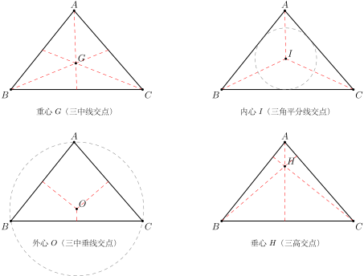

# 三角形的四心：重心、内心、外心、垂心

## 一、图形特征

三角形里有四组"三条特殊线"，它们各自都会共点（这本身就是一个不平凡的几何事实）。根据"三条什么线"的不同，得到四种心：

- 三条**中线**共点 → **重心**
- 三条**内角平分线**共点 → **内心**
- 三条**边的中垂线**共点 → **外心**
- 三条**高**（所在直线）共点 → **垂心**

每一种心都有一条标志性的距离性质，并且在三角形中的位置（内部 / 边上 / 外部）随三角形形状变化各有规律。本节把四心放在一起对照，方便记忆与速查。

## 二、定义与性质

### 1. 重心（Centroid）

**定义**：三条**中线**的交点（中线 = 顶点到对边中点的连线段）。

**关键性质**：

- **重心把每条中线分为 $2:1$**（从顶点到重心 : 从重心到对边中点 $= 2:1$），即**大段在顶点一侧**。
- 物理意义：均匀三角形薄板的**质心**就在重心处，可以用一根针顶住而保持平衡。
- 坐标公式（part9 解析几何会用到）：若三顶点为 $A(x_1,y_1), B(x_2,y_2), C(x_3,y_3)$，则重心为

$$
G\Big(\frac{x_1+x_2+x_3}{3},\ \frac{y_1+y_2+y_3}{3}\Big).
$$

重心**始终在三角形内部**。

### 2. 内心（Incenter）

**定义**：三条**内角平分线**的交点（呼应 part1/03 例 3 关于角平分线性质的讨论）。

**关键性质**：

- 内心到三边的距离**相等**，这一相等距离就是**内切圆半径** $r$。
- 内切圆与三边都相切，圆心就是内心。
- 内心**始终在三角形内部**。

### 3. 外心（Circumcenter）

**定义**：三条**边的中垂线**（垂直平分线）的交点。

**关键性质**：

- 外心到三个**顶点**的距离相等，这一距离就是**外接圆半径** $R$。
- 外接圆经过三个顶点，圆心就是外心。
- 位置随三角形形状变化：
  - **锐角三角形**：外心在三角形**内部**；
  - **直角三角形**：外心在**斜边中点**——这是"直角三角形斜边中线等于斜边一半"的几何根源；
  - **钝角三角形**：外心在三角形**外部**。

### 4. 垂心（Orthocenter）

**定义**：三条**高**（高所在直线）的交点。注意：在钝角三角形里，两条高的"脚"会落在边的延长线上，所以严格说是高所在直线的交点。

**位置特点**：

- **锐角三角形**：垂心在内部；
- **直角三角形**：垂心恰好在**直角顶点**；
- **钝角三角形**：垂心在外部。

垂心没有像"到边等距 / 到顶点等距"那样简洁的距离性质，但在更高阶的几何（如九点圆、欧拉线）中扮演核心角色。

## 三、对比速查表

| 名称 | 三线 | 关键性质 | 位置特点 |
|---|---|---|---|
| 重心 | 三条中线 | 把中线分 $2:1$（大段在顶点侧） | 始终在内部 |
| 内心 | 三条角平分线 | 到三边等距 = 内切圆 $r$ | 始终在内部 |
| 外心 | 三条边中垂线 | 到三顶点等距 = 外接圆 $R$ | 锐角内 / 直角斜边中点 / 钝角外 |
| 垂心 | 三条高 | —（距离性质不如前三种简洁） | 锐角内 / 直角顶点 / 钝角外 |

记忆口诀：**中-重、角-内、垂-外、高-垂**（"中线—重心，角平分线—内心，中垂线—外心，高—垂心"）。

## 四、典型应用

### 例 1：求重心坐标

**题目**：三角形三顶点为 $A(0,0)$, $B(6,0)$, $C(3,6)$，求重心坐标。

**【思路】** 直接套用重心坐标公式 $G\big(\frac{x_1+x_2+x_3}{3}, \frac{y_1+y_2+y_3}{3}\big)$，无需先求中线方程再解交点——这是坐标公式带来的便利。

**解**：

$$
G\Big(\frac{0+6+3}{3},\ \frac{0+0+6}{3}\Big) = G(3, 2).
$$

### 例 2：直角三角形斜边中线 = 斜边的一半

**题目**：设 $\triangle ABC$ 中 $\angle C = 90^\circ$，$M$ 为斜边 $AB$ 的中点，证明 $CM = \frac{1}{2} AB$。

**【思路】** 直接用外心的性质：直角三角形的外心就在斜边中点 $M$。外心到三个顶点等距，所以 $MA = MB = MC$；又 $MA = MB = \frac{1}{2}AB$，故 $CM = \frac{1}{2}AB$。

**证明**：

由外心的位置特点：直角三角形的外心位于**斜边中点**，即外心就是 $M$。

由外心定义：外心到三顶点距离相等，所以

$$
MA = MB = MC.
$$

而 $M$ 是 $AB$ 的中点，故 $MA = MB = \frac{1}{2}AB$。因此

$$
CM = MA = \frac{1}{2} AB. \qquad\blacksquare
$$

**注**：这条性质（直角三角形斜边中线 = 斜边一半）反过来也常被独立使用，是初中几何里非常常用的一条结论。

### 例 3：等边三角形四心重合

**题目**：证明等边三角形的重心、内心、外心、垂心是同一点。

**【思路】** 在等边三角形中，每条中线、角平分线、中垂线、高其实是**同一条直线**——这由等边三角形的对称性（关于每条"中线"对称）保证。三条中线既是角平分线又是中垂线又是高，因此四心都是这三条线的交点，自然重合。

**证明**：

设 $\triangle ABC$ 为等边三角形，取顶点 $A$ 出发的中线 $AD$（$D$ 为 $BC$ 中点）。

- 由等边三角形关于 $AD$ 对称（$AB = AC$，$DB = DC$），所以 $AD \perp BC$，故 $AD$ 既是 $A$ 出发的**中线**又是**高**。
- 又 $D$ 是 $BC$ 中点且 $AD \perp BC$，所以 $AD$ 是 $BC$ 的**中垂线**。
- 由对称性 $\angle BAD = \angle CAD$，所以 $AD$ 还是 $\angle A$ 的**角平分线**。

四种"特殊线"在顶点 $A$ 处合二为一；对 $B, C$ 顶点同理。因此**三条中线 = 三条角平分线 = 三条中垂线 = 三条高**，它们的交点同时是重心、内心、外心、垂心，四心重合于同一点——通常称为等边三角形的**中心**。$\blacksquare$

## 五、易错点

1. **四心定义易混**：要把"哪种心 ↔ 哪三条线"对应牢。建议背口诀"中-重、角-内、中垂-外、高-垂"。
2. **垂心和外心的位置随三角形形状变化**：锐角时都在内部，直角时分别落到直角顶点 / 斜边中点，钝角时都跑到外部。考试常借此设问。
3. **重心分中线是 $2:1$，不是 $1:2$**：**大段在顶点一侧**，小段在对边中点一侧。如果中线长 $9$，那么顶点到重心 $6$，重心到中点 $3$。
4. **"高"和"垂线"概念别混**：垂心是三条高的交点，不是"三条边中垂线"的交点（后者是外心）。"高"是从顶点向对边作的垂线段；"中垂线"是边的垂直平分线，跟顶点没关系。
5. **内心一定在内部，外心不一定**：很多同学想当然地以为"心都在内部"，这只对重心和内心成立。
6. **直角三角形的"巧合"**：外心 = 斜边中点，垂心 = 直角顶点——这两条经常出现在选择填空里，要熟。

## 六、思路自测题

1. 三角形三顶点为 $(1, 2), (3, 4), (5, 0)$，求重心坐标。【思路：直接套坐标公式 $\big(\frac{x_1+x_2+x_3}{3}, \frac{y_1+y_2+y_3}{3}\big)$。】

2. 已知 $\triangle ABC$ 中 $\angle B = 90^\circ$，$AC = 10$，$M$ 为 $AC$ 中点，求 $BM$ 的长。【思路：$M$ 是直角三角形外心，$BM = MA = MC = \frac{1}{2}AC = 5$。】

3. 三角形重心 $G$ 把中线 $AD$ 分为两段，若 $AD = 12$，求 $AG$ 与 $GD$。【思路：$AG:GD = 2:1$，故 $AG = 8, GD = 4$，注意大段在顶点一侧。】

4. 一个钝角三角形的外心在三角形的（内部 / 边上 / 外部）？垂心呢？【思路：钝角三角形外心和垂心都在三角形**外部**，对照表格即可。】

5. 在等边三角形中，重心到一个顶点的距离为 $a$，重心到对边中点的距离为多少？【思路：等边三角形四心重合，"重心 → 顶点 : 重心 → 对边中点 $= 2:1$"，所以答案是 $\frac{a}{2}$。】
