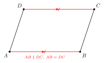
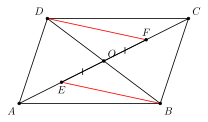

# 平行四边形

## 一、图形特征

**平行四边形**是指**两组对边分别平行**的四边形。通常用符号"▱"表示，例如"▱$ABCD$"读作"平行四边形 $ABCD$"。书写时，顶点字母按照**沿同一方向（顺时针或逆时针）依次绕一圈**的顺序排列，例如 ▱$ABCD$ 表示 $AB \parallel DC$、$AD \parallel BC$，而不是 $AB \parallel AC$。

一个 ▱$ABCD$ 具有以下直观特征：

- 有两组**对边**：$AB$ 与 $CD$、$AD$ 与 $BC$；两组**对角**：$\angle A$ 与 $\angle C$、$\angle B$ 与 $\angle D$；两条**对角线**：$AC$ 与 $BD$，它们相交于一点 $O$；
- 任一条对角线把平行四边形分成两个**全等的三角形**；
- 两条对角线把平行四边形分成四个三角形，其中**对顶位置的两个三角形全等**；
- 它是一个**中心对称图形**，对称中心就是对角线交点 $O$——绕 $O$ 旋转 $180°$ 后图形与自身重合；
- 一般情形下，平行四边形**不是轴对称图形**（除非它退化为矩形或菱形）。

平行四边形之所以在四边形理论中处于"基础地位"，是因为之后要学的矩形、菱形、正方形都是它的"特殊化版本"——它们继承了平行四边形的全部性质，再额外加上某种特殊条件（直角、邻边相等等）。

## 二、核心定理

**性质（必要条件）**：若四边形 $ABCD$ 是平行四边形，则

1. **两组对边分别平行且相等**：$AB \parallel CD,\ AB = CD$；$AD \parallel BC,\ AD = BC$；
2. **两组对角分别相等，邻角互补**：$\angle A = \angle C$，$\angle B = \angle D$；$\angle A + \angle B = 180°$；
3. **对角线互相平分**：设对角线 $AC, BD$ 相交于 $O$，则 $OA = OC$，$OB = OD$；
4. **是中心对称图形**，对称中心为对角线交点 $O$。

**判定（充分条件）**：在一个四边形 $ABCD$ 中，**只要满足下列条件之一**，它就是平行四边形：

1. 两组对边分别**平行** → ▱（这是定义）；
2. 两组对边分别**相等** → ▱；
3. **一组对边平行且相等** → ▱；
4. 两组对角分别**相等** → ▱；
5. **对角线互相平分** → ▱。

这五条判定中，第 3 条最具"省力"特征：只需对一组对边同时验证"平行 + 相等"，不必管另一组。第 5 条则在已知对角线信息（例如两条线段在某点互相平分）时直接给出 ▱，是构造平行四边形的常用入口。

## 三、定理的证明

下面只证一条最常用的性质——**对角线互相平分**，其他性质的证明思路类似（用平行线性质 + 全等）。

**命题**：▱$ABCD$ 的对角线 $AC$ 与 $BD$ 相交于点 $O$，则 $OA = OC$，$OB = OD$。

**思路**：要证两条线段被某点平分，最直接的办法是找两个全等三角形，让 $OA, OC$（或 $OB, OD$）成为它们的对应边。注意 $\triangle AOB$ 与 $\triangle COD$ 处于对顶位置，且 $AB \parallel CD$，正好可以给出"两组角相等 + 一组边相等"的 ASA 条件。

**证明**：在 ▱$ABCD$ 中，由对边平行 $AB \parallel CD$，可得**内错角**

$$\angle OAB = \angle OCD, \qquad \angle OBA = \angle ODC.$$

又由性质 1（对边相等），

$$AB = CD.$$

在 $\triangle AOB$ 与 $\triangle COD$ 中：

$$\angle OAB = \angle OCD,\quad AB = CD,\quad \angle OBA = \angle ODC.$$

由 ASA，

$$\triangle AOB \cong \triangle COD.$$

由全等三角形的对应边相等，

$$OA = OC, \qquad OB = OD. \qquad \blacksquare$$

**点评**：这条证明的关键在于"对边平行 → 内错角相等"与"对边相等 → 夹边相等"两条信息的搭配，恰好凑成 ASA。这也是后续判定 5（"对角线互相平分 → ▱"）的反向版本的逻辑基础。

## 四、典型应用

**例 1**　在 ▱$ABCD$ 中，$\angle A = 70°$，$AB = 5$，$BC = 8$。求 $\angle B$、$\angle C$、$CD$、$AD$。

【思路】平行四边形的"对角相等、邻角互补、对边相等"是最直接的代入题，逐项应用即可。

**解**：由对角相等，$\angle C = \angle A = 70°$；由邻角互补，
$$\angle B = 180° - \angle A = 180° - 70° = 110°.$$
（同理 $\angle D = 110°$，与 $\angle B$ 相等，验证对角相等。）

由对边相等，$CD = AB = 5$，$AD = BC = 8$。

故 $\angle B = 110°$，$\angle C = 70°$，$CD = 5$，$AD = 8$。

**例 2**　在 ▱$ABCD$ 中，对角线 $AC$ 与 $BD$ 相交于 $O$。点 $E, F$ 分别在 $OA, OC$ 上，且 $OE = OF$。求证：$BE = DF$ 且 $BE \parallel DF$。

【思路】要证"$BE = DF$"，自然找 $\triangle BOE$ 与 $\triangle DOF$ 全等。已有 $OE = OF$（题设），由 ▱ 性质 3 可知 $OB = OD$；夹角 $\angle BOE$ 与 $\angle DOF$ 是**对顶角**，相等。这就凑齐了 SAS。证完全等后，"$BE \parallel DF$"由对应角（内错角）相等给出。

**证明**：在 ▱$ABCD$ 中，对角线互相平分，故
$$OB = OD.$$
又由题设 $OE = OF$，且
$$\angle BOE = \angle DOF \quad (\text{对顶角}).$$

在 $\triangle BOE$ 与 $\triangle DOF$ 中：$OB = OD$，$\angle BOE = \angle DOF$，$OE = OF$。由 SAS，
$$\triangle BOE \cong \triangle DOF.$$

由全等的对应边、对应角相等：
$$BE = DF, \qquad \angle OEB = \angle OFD.$$

由 $\angle OEB = \angle OFD$，且这两个角是直线 $AC$ 截 $BE, DF$ 所成的**内错角**，故
$$BE \parallel DF.$$

故 $BE = DF$ 且 $BE \parallel DF$。 $\blacksquare$

**例 3**（思路反推题）　四边形 $ABCD$ 中，对角线 $AC, BD$ 相交于 $O$，且 $OA = OC$，$OB = OD$。求证：四边形 $ABCD$ 是平行四边形，并据此推出 $AB \parallel CD$。

【思路】看到"对角线互相平分"这个条件，**立刻反推**：这是判定 5 的标志！直接由判定 5 得到 ▱，再由 ▱ 的性质 1 得到对边平行——这是从"判定"到"性质"的标准两步法。

**证明**：在四边形 $ABCD$ 中，对角线 $AC, BD$ 相交于 $O$，且
$$OA = OC, \qquad OB = OD,$$
即对角线互相平分。由平行四边形判定 5，
$$\text{四边形 } ABCD \text{ 是平行四边形.}$$

再由平行四边形性质 1（两组对边分别平行且相等），
$$AB \parallel CD. \qquad \blacksquare$$

**点评**：解题时，**条件"对角线互相平分"≈"暗号"**——一旦出现，下一步几乎一定是用判定 5 把它升级为 ▱，然后再调用 ▱ 的全套性质（对边平行、对边相等、对角相等）展开后续推理。这种"条件 → 形态升级 → 性质群激活"的套路，是处理四边形题的核心思维。

## 五、易错点

1. **判定 3 的两个条件缺一不可**："一组对边**平行且相等**"才能判定 ▱。若仅"一组对边平行"，可能是梯形；若仅"一组对边相等"，可能是等腰梯形或其他四边形。务必同时验证两条。

2. **"两组对边相等" ≠ "两组对边平行"，但都能判定 ▱**：判定 2 与判定 1 是**两条独立**的充分条件，不要混为一谈。从"两组对边相等"推平行需借助全等三角形（用 SSS 得 $\triangle ABC \cong \triangle CDA$，再用对应角相等得内错角相等、对边平行）。

3. **"一组对边平行，另一组对边相等" ⇏ ▱**：这是经典反例！例如**等腰梯形**就满足"上下底平行、两腰相等"，但它不是平行四边形。判定时务必看清条件中的"平行与相等"是否落在**同一组**对边上。

4. **顶点字母的顺序不能乱写**：▱$ABCD$ 表示沿一个方向依次绕一圈，故 $AB$ 与 $CD$ 是对边（不是邻边）。若写成"▱$ABDC$"则 $AB$ 与 $DC$ 反向，几何含义完全改变。

5. **平行四边形一般不是轴对称图形**：它只是中心对称图形。只有当它"恰好"成为矩形（增加直角条件）或菱形（增加邻边相等条件）时，才同时成为轴对称图形。许多同学误把"对称"等同于"轴对称"，需特别区分。

6. **对角线"互相平分"≠"相等"**：平行四边形的对角线必互相平分，但**不一定相等**——只有矩形（及其特例正方形）的对角线才相等。这两条对角线性质要分清。

## 六、思路自测题

1. 在 ▱$ABCD$ 中，$\angle A : \angle B = 2 : 7$，求 $\angle A, \angle B, \angle C, \angle D$。
   💡 提示：由邻角互补 $\angle A + \angle B = 180°$，设 $\angle A = 2k, \angle B = 7k$，解出 $k = 20°$；再由对角相等填出 $\angle C, \angle D$。

2. 在 ▱$ABCD$ 中，对角线 $AC = 10$，$BD = 14$。设交点为 $O$，求 $OA, OB$ 的长。
   💡 提示：▱ 对角线互相平分 → $OA = \frac12 AC$，$OB = \frac12 BD$。

3. 在四边形 $ABCD$ 中，$AB \parallel CD$ 且 $AB = CD$。求证：$AD \parallel BC$。
   💡 提示：由"一组对边平行且相等"（判定 3）得 ▱$ABCD$；再由性质 1 得另一组对边也平行。

4. 在 ▱$ABCD$ 中，$E, F$ 分别是 $AB, CD$ 的中点。求证：四边形 $AECF$ 是平行四边形。
   💡 提示：要证 ▱$AECF$，找一组对边——$AE$ 与 $CF$。先验 $AE \parallel CF$（来源于 ▱$ABCD$ 中 $AB \parallel CD$），再验 $AE = CF$（各取一半），然后调用判定 3。

5. 四边形 $ABCD$ 中，已知 $\angle A = \angle C$，$\angle B = \angle D$。求证：四边形 $ABCD$ 是平行四边形。
   💡 提示：这是判定 4 的应用。由四边形内角和 $360°$ 及两组对角相等，得 $\angle A + \angle B = 180°$，从而 $AD \parallel BC$（同旁内角互补 → 平行）；同理 $\angle A + \angle D = 180°$ 给出 $AB \parallel CD$。两组对边平行 → ▱。
