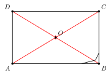
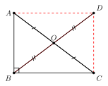
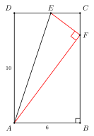

# 矩形

## 一、图形特征与定义

**矩形**是一类特殊的平行四边形——**有一个角是直角的平行四边形叫做矩形**。

这是教材中的"标准定义"，也是判定矩形最常用的入口。它强调两件事：

1. **首先是平行四边形**（已有两组对边分别平行且相等、对角线互相平分等所有性质）；
2. **再附加"有一个直角"** 这一条件。

只要这两个条件同时满足，矩形的所有其它性质（四个角都是直角、对角线相等）就会自动跟着来。

也可以使用**等价定义**：**四个角都是直角的四边形叫做矩形**。这个定义在判定时更直接（凑齐三个直角，第四个角必为直角，因此自动构成矩形），但平时书写性质时常用前一种"平行四边形 + 一直角"的口径。

通俗一点讲，矩形就是我们日常说的"长方形"：四角方方正正，两组对边平行且等长。但请记住，初中的数学语言里不用"长方形"，统一称作**矩形**。

---

## 二、核心性质

矩形既然是平行四边形，那么它**继承平行四边形的所有性质**：

- 两组对边分别平行且相等；
- 两组对角分别相等；
- 对角线互相平分；
- 是中心对称图形（对称中心为对角线交点）。

在此之上，矩形还有两条**特有性质**：

**特有性质 1：四个角都是直角**

由"有一个角是直角的平行四边形"出发：平行四边形对角相等，所以对角也是直角；又邻角互补 ($\angle A + \angle B = 180°$)，所以邻角也是直角。四个角全部是 $90°$。

**特有性质 2：对角线相等且互相平分**

记矩形 $ABCD$，对角线为 $AC$、$BD$。

- "互相平分"已由平行四边形性质给出；
- 关键是**相等**：$AC = BD$。

**证明**：在 $\triangle ABC$ 与 $\triangle DCB$ 中：

$$AB = DC \text{（矩形对边）},\quad \angle ABC = \angle DCB = 90°,\quad BC = CB \text{（公共边）}$$

由 SAS 得 $\triangle ABC \cong \triangle DCB$，因此 $AC = DB$。

此外，矩形是**轴对称图形**，对称轴为两组对边中点的连线（共 $2$ 条对称轴），同时仍保留平行四边形的中心对称性。

---

## 三、判定方法

矩形的判定共有三种"入口"：

**判定 1：有一个角是直角的平行四边形是矩形。**

（这就是定义本身——先确认是平行四边形，再确认有一个直角。）

**判定 2：对角线相等的平行四边形是矩形。**

（先确认是平行四边形，再确认 $AC = BD$。）

**判定 3：有三个角是直角的四边形是矩形。**

（不需要先证平行四边形，由内角和 $360°$ 知第四个角也为 $90°$，再由"内错角相等"推出对边平行。）

⚠️ **使用顺序很重要**：判定 1、2 都要求"**先是平行四边形**"。如果只知道"对角线相等"，并不能直接得到矩形——例如等腰梯形对角线也相等，但它不是矩形。**只有在已经判定为平行四边形的前提下，对角线相等才能升级为矩形**。

---

## 四、典型应用

### 例 1（基础：勾股求对角线）

矩形 $ABCD$ 中，$AB = 6$，$BC = 8$，求对角线 $AC$ 的长。

**解**：因 $\angle ABC = 90°$，在 $\mathrm{Rt}\triangle ABC$ 中由勾股定理：

$$AC = \sqrt{AB^2 + BC^2} = \sqrt{36 + 64} = \sqrt{100} = 10.$$

由矩形对角线相等，$BD = AC = 10$。

---

### 例 2（直角三角形斜边中线 = 斜边一半）

如图，$\mathrm{Rt}\triangle ABC$ 中 $\angle ABC = 90°$，$O$ 是斜边 $AC$ 的中点。求证：$BO = \dfrac{1}{2}AC$。

**思路**：补出矩形即可。延长 $BO$ 到 $D$，使 $OD = OB$，连 $AD$、$CD$。则 $O$ 是 $BD$ 中点也是 $AC$ 中点，所以 $ABCD$ 对角线互相平分，是平行四边形；又 $\angle ABC = 90°$，故 $ABCD$ 是矩形。由矩形对角线相等：$BD = AC$，所以

$$BO = \tfrac{1}{2}BD = \tfrac{1}{2}AC.$$

**结论**：**直角三角形斜边上的中线等于斜边的一半**。这是矩形最有用的"对外输出"，与三角形外心、$30°$ 角直角三角形等知识点紧密相关（参见 special/03 外心一节）。

---

### 例 3（折叠问题 + 勾股）

矩形 $ABCD$ 中，$AB = 6$，$AD = 10$。将矩形沿 $AE$ 折叠（$E$ 在 $CD$ 上），使点 $D$ 落在 $BC$ 边上的点 $F$ 处。求 $CE$ 的长。

**思路**：折叠的本质是**轴对称**——折叠前后对应线段、对应角相等。

- 由折叠：$AF = AD = 10$，$EF = ED$，$\angle AFE = \angle D = 90°$。
- 在 $\mathrm{Rt}\triangle ABF$ 中，$AB = 6$，$AF = 10$：

  $$BF = \sqrt{AF^2 - AB^2} = \sqrt{100 - 36} = 8.$$

- $FC = BC - BF = 10 - 8 = 2$。
- 设 $CE = x$，则 $DE = 6 - x$，$EF = ED = 6 - x$。
- 在 $\mathrm{Rt}\triangle EFC$ 中（$\angle C = 90°$）：

  $$EF^2 = FC^2 + CE^2,\quad (6 - x)^2 = 4 + x^2.$$

  解得 $36 - 12x + x^2 = 4 + x^2$，$x = \dfrac{32}{12} = \dfrac{8}{3}$。

所以 $CE = \dfrac{8}{3}$。

---

## 五、易错点提醒

- **对角线"相等且互相平分"缺一不可**。仅"对角线相等"不足以判定矩形（反例：等腰梯形对角线相等）；仅"对角线互相平分"只能得到平行四边形（菱形也满足）。**两条性质同时具备**才是矩形的对角线特征。
- **使用判定 2 时，必须先确认是平行四边形**。常见错误：题目只给"四边形对角线相等"，直接断言矩形。正确做法是先用平行四边形判定，再用对角线相等升级。
- **直角条件不能省**。"对边相等的四边形 + 对角线相等" 也未必是矩形（必须是平行四边形 + 对角线相等）。
- **斜边中线定理**用法："直角三角形斜边上的中线"才等于斜边的一半；其它边上的中线没有这种结论。
- 矩形是**轴对称**也是**中心对称**图形，但对称轴不是对角线（这是菱形的特点）。矩形的对称轴是"对边中点连线"。

---

## 六、自测题

**1.** 矩形 $ABCD$ 中，对角线 $AC$、$BD$ 交于 $O$，若 $\angle AOB = 60°$，$AB = 4$，求 $BD$ 的长。

> 💡 **提示**：$\triangle AOB$ 中 $OA = OB$（对角线相等且互相平分），加上顶角 $60°$，是等边三角形！

---

**2.** 在矩形 $ABCD$ 中，$AB = 3$，$BC = 4$。点 $P$ 在 $BC$ 上，$BP = 1$。求 $AP$ 的长。

> 💡 **提示**：直接在 $\mathrm{Rt}\triangle ABP$ 中用勾股定理（$\angle B = 90°$）。

---

**3.** $\mathrm{Rt}\triangle ABC$ 中 $\angle C = 90°$，$AB = 13$，$BC = 5$。$D$ 是 $AB$ 中点。求 $CD$ 的长。

> 💡 **提示**：直角三角形斜边上的中线等于斜边的一半，$CD = \dfrac{1}{2}AB$，与 $BC$ 是否给出无关！

---

**4.** 四边形 $ABCD$ 的对角线 $AC$、$BD$ 交于点 $O$，且 $OA = OC$，$OB = OD$，$AC = BD$。判断 $ABCD$ 的形状并说明理由。

> 💡 **提示**：先由"对角线互相平分"得平行四边形，再由"对角线相等"升级为矩形。务必分两步写。
