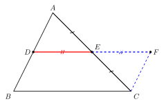
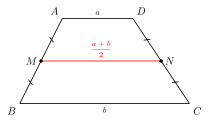
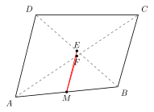
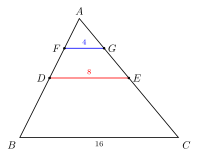

# 中位线定理

## 一、图形特征与定义

"中位线"是几何里最常出现也最有威力的小线段之一。它的特点是**两个端点都是中点**——这两个"中点条件"换来了一条平行且长度可计算的线段。中位线又分为**三角形中位线**与**梯形中位线**两种，二者形式相似、思路一脉相承。

**三角形中位线的定义**：连接三角形**两边中点**的线段，叫做三角形的中位线。

每个三角形有三条中位线（连接任意两条边的中点）。注意：三角形中"连接一个顶点和对边中点"的线段叫**中线**（median），与中位线（midsegment）是两回事，不要混淆——

- **中线**：顶点 → 对边中点（每个三角形有 3 条，相交于重心）；
- **中位线**：边的中点 → 另一条边的中点（每个三角形也有 3 条，但两端都是中点）。

**梯形中位线的定义**：连接梯形**两腰中点**的线段，叫做梯形的中位线。

特别强调："梯形中位线"连接的是**两腰（不平行的两边）的中点**，而**不是**两底（平行的两边）的中点。这是初学者最常踩的坑之一。

---

## 二、三角形中位线定理

**定理（三角形中位线定理）**：三角形的中位线**平行于第三边**，并且**等于第三边的一半**。

设 $\triangle ABC$ 中，$D, E$ 分别是 $AB, AC$ 的中点，则中位线 $DE$ 满足

$$DE \parallel BC, \qquad DE = \tfrac{1}{2} BC.$$

这条定理一次性给了**两条结论**——平行 + 半长——这也是它最值钱的地方：以后凡是看到"两个中点"，就立刻有两条性质可用。

### 证明（倍长中位线法，呼应 cong/06）

**思路**：把中位线 $DE$ 延长一倍，构造平行四边形。

**证明**：延长 $DE$ 至 $F$，使 $EF = DE$，连接 $CF$。

在 $\triangle ADE$ 与 $\triangle CFE$ 中：

- $AE = CE$（$E$ 是 $AC$ 中点）；
- $\angle AED = \angle CEF$（对顶角）；
- $DE = FE$（作图所定）。

由 SAS，$\triangle ADE \cong \triangle CFE$。故 $AD = CF$，$\angle ADE = \angle CFE$。

由 $\angle ADE = \angle CFE$（内错角相等），得 $AD \parallel CF$，即 $BD \parallel CF$。

又 $AD = CF$，而 $AD = BD$（$D$ 是 $AB$ 中点），所以 $BD = CF$ 且 $BD \parallel CF$。

由"**一组对边平行且相等**"判定，四边形 $BDFC$ 是平行四边形。故 $DF \parallel BC$ 且 $DF = BC$。

因为 $DE = \tfrac{1}{2} DF$，所以

$$DE \parallel BC, \qquad DE = \tfrac{1}{2} BC. \qquad\blacksquare$$

### 几何意义

三角形的三条中位线把原三角形分成 **4 个全等的小三角形**，且每个小三角形与原三角形相似，相似比为 $1:2$，面积比为 $1:4$。中间那个倒过来的小三角形和外面三个"角落"的小三角形完全相同。这是后续中位线嵌套类问题的几何直观来源。

---

## 三、梯形中位线定理

**定理（梯形中位线定理）**：梯形的中位线**平行于两底**，并且**等于两底之和的一半**。

设梯形 $ABCD$ 中 $AD \parallel BC$（$AD = a$ 为上底，$BC = b$ 为下底），$M, N$ 分别是腰 $AB, CD$ 的中点，则中位线 $MN$ 满足

$$MN \parallel AD \parallel BC, \qquad MN = \frac{a + b}{2}.$$

### 证明（化归为三角形中位线）

**思路**：连接 $AN$ 并延长交 $BC$ 的延长线于 $E$，把梯形中位线"折"成一条三角形中位线。

**证明**：连接 $AN$ 并延长，交 $BC$ 的延长线于 $E$。

在 $\triangle AND$ 与 $\triangle END$（应为 $\triangle AND$ 与 $\triangle ENC$）中：

- $DN = CN$（$N$ 是 $CD$ 中点）；
- $\angle AND = \angle ENC$（对顶角）；
- $\angle ADN = \angle ECN$（由 $AD \parallel BC$，内错角相等）。

由 AAS，$\triangle AND \cong \triangle ENC$。故 $AN = EN$，$AD = EC$。

这意味着在 $\triangle ABE$ 中，$M$ 是 $AB$ 中点，$N$ 是 $AE$ 中点（因 $AN = NE$），所以 $MN$ 是 $\triangle ABE$ 的中位线。由三角形中位线定理：

$$MN \parallel BE, \qquad MN = \tfrac{1}{2} BE.$$

而 $BE = BC + CE = BC + AD = a + b$，且 $BE$ 所在直线即 $BC$ 所在直线（与 $AD$ 也平行）。故

$$MN \parallel AD \parallel BC, \qquad MN = \frac{a + b}{2}. \qquad\blacksquare$$

### 与梯形面积的呼应

梯形面积公式 $S = \dfrac{(a+b)\,h}{2}$ 可以重新写成

$$S = MN \cdot h,$$

即"**梯形面积 = 中位线 × 高**"。这个形式与"矩形面积 = 长 × 宽"完全平行——梯形中位线本质上就是"代表"了上下底的"平均宽度"。这也是中位线在梯形里如此核心的原因。

---

## 四、典型应用

### 例 1（基础：求中位线长）

$\triangle ABC$ 中，$BC = 10$，$D, E$ 分别是 $AB, AC$ 的中点。求 $DE$ 的长。

**思路**：直接套三角形中位线定理。

**解**：由三角形中位线定理，$DE = \tfrac{1}{2} BC = 5$。

**评注**：这是中位线定理最直接的应用——看到"两条边的中点连线"立刻给出"半长 + 平行"两条结论。

---

### 例 2（用中位线证两段相等）

四边形 $ABCD$ 中，$E, F$ 分别是对角线 $BD, AC$ 的中点，$M$ 是 $AB$ 的中点。证明：$ME = MF$（即 $M$ 到两对角线中点的距离相等），并且这两条线段都等于另一组对应线段的一半。

**思路**：$M$ 与 $E$ 分别是 $AB$ 与 $BD$ 的中点 —— 这是 $\triangle ABD$ 的中位线；$M$ 与 $F$ 分别是 $AB$ 与 $AC$ 的中点 —— 这是 $\triangle ABC$ 的中位线。两次套用定理。

**证明**：在 $\triangle ABD$ 中，$M, E$ 分别是 $AB, BD$ 的中点，由三角形中位线定理：

$$ME \parallel AD, \qquad ME = \tfrac{1}{2} AD.$$

在 $\triangle ABC$ 中，$M, F$ 分别是 $AB, AC$ 的中点，由三角形中位线定理：

$$MF \parallel BC, \qquad MF = \tfrac{1}{2} BC.$$

特别地，如果题目额外给定 $AD = BC$（例如原四边形是等腰梯形或平行四边形或正方形），则 $ME = MF$。$\blacksquare$

**评注**：**只要见到"两个中点"，就有一条中位线在等着你**——这是这类题的核心嗅觉。本题里我们"两次嗅出"了中位线，是中点四边形模型（part4/08）的雏形。

---

### 例 3（综合：中位线嵌套）

$\triangle ABC$ 中，$BC = 16$。$D, E$ 分别是 $AB, AC$ 的中点；$F, G$ 分别是 $AD, AE$ 的中点。求 $FG$ 的长。

**思路**：连续两次套用三角形中位线定理（"中位线的中位线"）。

**解**：在 $\triangle ABC$ 中，$D, E$ 分别是 $AB, AC$ 的中点，故 $DE$ 是中位线：

$$DE = \tfrac{1}{2} BC = 8.$$

在 $\triangle ADE$ 中，$F, G$ 分别是 $AD, AE$ 的中点，故 $FG$ 是 $\triangle ADE$ 的中位线：

$$FG = \tfrac{1}{2} DE = 4.$$

**评注**：每嵌套一层中位线，长度就缩短一半。本题里 $FG = \tfrac{1}{4} BC$。更一般地，第 $n$ 层中位线长 $= \dfrac{BC}{2^n}$。中位线"等比缩小"的性质是后续讨论无穷分割（高中阶段）的雏形。

---

## 五、易错点提醒

- **"中位线"≠"中线"**：中位线连接的是两个"中点"（边中点 ↔ 边中点），中线连接的是"顶点 ↔ 对边中点"。许多学生把"$AD$ 是 $\triangle ABC$ 的中线"和"$DE$ 是 $\triangle ABC$ 的中位线"混淆，导致结论错套。
- **中位线必须连接的是"中点"，不是任意点**——只有当 $D, E$ 都恰好是中点时，才有 $DE \parallel BC$ 且 $DE = \tfrac{1}{2}BC$。若 $D, E$ 是边的一般等分点，则只能用相似（part3/sim 章节中的 A 字模型或平行截比例线段定理），不能直接套中位线定理。
- **梯形中位线连接的是"两腰中点"而非"两底中点"**——这是定义层面的根本错误来源。"两底中点的连线"在等腰梯形里确实垂直于两底（是对称轴），但长度并不等于 $\dfrac{a+b}{2}$，那是另一回事。
- **梯形中位线公式是"两底之和的一半"，不是"两底之差的一半"**——$\dfrac{a+b}{2}$ 与等腰梯形里作两高之后下底端点截出的小段长度 $\dfrac{b-a}{2}$（part4/06 方法 B）形似但含义完全不同：前者是中位线长，后者是直角三角形的水平边长。一定要分清。
- **应用中位线定理前必须验证"中点"条件**——题目里如果只说"$D$ 在 $AB$ 上"或"$E$ 是 $AC$ 上一点"而不指明是中点，就不能套用。中位线定理是"中点条件"换来的特权。
- **中位线只给两条信息（平行 + 半长），不要忘了用"平行"那一半**——很多题学生只用了"长度一半"忘了"平行"，结果遗漏关键步骤。两条结论是"打包出现"的，使用时也要记得"两条都可以拿来用"。

---

## 六、自测题

**1.** $\triangle ABC$ 中，$BC = 12$，$D, E, F$ 分别是 $AB, AC, BC$ 的中点。求 $\triangle DEF$ 的周长与 $\triangle ABC$ 周长的比。

> 💡 **提示**：$\triangle DEF$ 的三条边分别是 $\triangle ABC$ 的三条中位线，长度各为对应边的一半。故 $\triangle DEF$ 的周长 $= \tfrac{1}{2}(\triangle ABC$ 的周长$)$，比为 $1:2$。

---

**2.** 梯形 $ABCD$ 中 $AD \parallel BC$，$AD = 5$，$BC = 11$。$M, N$ 分别是腰 $AB, CD$ 的中点。求中位线 $MN$ 的长。

> 💡 **提示**：直接套梯形中位线公式：$MN = \dfrac{AD + BC}{2} = \dfrac{5 + 11}{2} = 8$。

---

**3.** 梯形 $ABCD$ 中 $AD \parallel BC$，中位线 $MN = 7$，$AD = 3$。求 $BC$ 的长。

> 💡 **提示**：由 $MN = \dfrac{AD + BC}{2}$，得 $7 = \dfrac{3 + BC}{2}$，故 $BC = 11$。

---

**4.** 在四边形 $ABCD$ 中，$E, F, G, H$ 分别是 $AB, BC, CD, DA$ 的中点。证明：$EF \parallel HG$ 且 $EF = HG$。

> 💡 **提示**：连接对角线 $AC$。在 $\triangle ABC$ 中，$E, F$ 是 $AB, BC$ 中点 → $EF \parallel AC, EF = \tfrac{1}{2}AC$。在 $\triangle ACD$ 中，$H, G$ 是 $DA, DC$ 中点 → $HG \parallel AC, HG = \tfrac{1}{2}AC$。故 $EF \parallel HG$ 且 $EF = HG$。（这正是 part4/08 中点四边形模型的核心引理：四边形 $EFGH$ 是平行四边形。）
