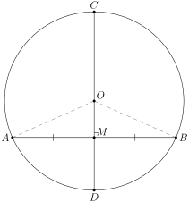
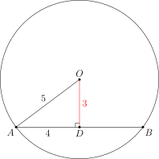
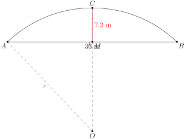

# 垂径定理

## 一、图形特征

本章关注的图形是这样一种结构：一个圆 $\odot O$，圆里有一条**不经过圆心**的弦 $AB$，再加上一条**过圆心**且**垂直于这条弦**的直径（或半径、直线均可）。这三个对象——圆、弦、过圆心的垂线——一旦同时出现，就是"垂径"结构的标志。

把这条过圆心、垂直于弦 $AB$ 的直径记作 $CD$，设 $CD$ 与 $AB$ 交于点 $M$。那么 $M$ 把弦 $AB$ 切成两段 $AM, MB$，$CD$ 也把圆周分成两条以 $A, B$ 为端点的弧——劣弧 $\overarc{AB}$（含 $D$ 一侧，记 $\overarc{ADB}$）和优弧 $\overarc{ACB}$。我们要研究的，正是 $AM$ 与 $MB$ 的关系、以及两条 $\overarc{AB}$ 被 $C, D$ 进一步分成的小弧的关系。

> 直觉上，"圆 + 过圆心的垂线"天然带着对称性：以这条直径所在直线为对称轴翻折，圆与自身重合，弦 $AB$ 也与自身重合（被翻成自己），所以 $AB$ 两端 $A, B$ 互相对应。这就预示着 $AM = MB$，且 $\overarc{AD} = \overarc{BD}$。下面把这个直觉变成定理。

## 二、垂径定理

> **垂径定理**：**垂直于弦的直径**平分**这条弦**，并且平分**这条弦所对的两条弧**。

也就是说，在图形特征里描述的结构中：

- $AM = MB$（直径 $CD$ 平分弦 $AB$）
- $\overarc{AC} = \overarc{BC}$ 且 $\overarc{AD} = \overarc{BD}$（直径 $CD$ 平分两条弧）

这里"直径"也可以换成"过圆心的线段"或"过圆心的直线"——关键是**过圆心**且**垂直于弦**。

### 证明

设 $\odot O$ 中弦 $AB$ 不过圆心，$CD$ 是过圆心 $O$ 且垂直于 $AB$ 的直径，垂足为 $M$。连接 $OA, OB$。

- $OA = OB = r$（同一个圆的半径）
- $OM = OM$（公共边）
- $\angle OMA = \angle OMB = 90°$（垂直）

由 HL（直角三角形斜边-直角边判定）得 $\triangle OMA \cong \triangle OMB$。因此：

- $AM = BM$，即 $CD$ 平分弦 $AB$；
- $\angle AOM = \angle BOM$，即 $\angle AOC = \angle BOC$ 且 $\angle AOD = \angle BOD$。

再由"同圆中相等的圆心角对应相等的弧"（part5/01 三量同变），得到 $\overarc{AC} = \overarc{BC}$，$\overarc{AD} = \overarc{BD}$。证毕。

## 三、逆定理（"知二推三"）

垂径定理的逆向使用极为常见。把刚才结构中的几个性质单独列出：

1. 直线过圆心（含直径）
2. 直线垂直于弦
3. 直线平分弦（且这条弦**不是直径**）
4. 直线平分劣弧
5. 直线平分优弧

> **关键事实**：上面五条中，**任意两条成立都能推出其余三条**（条件 3 中"弦不是直径"这个限制是为了排除退化情形）。

为什么需要"弦不是直径"这个限制？如果 $AB$ 本身就是直径，那么任何过 $AB$ 中点的直线都"平分弦 $AB$"，但显然不一定垂直于 $AB$，也不一定过圆心（它本身就过圆心，但条件 1 与 3 重复了，不再给出新信息）。所以在用条件 3 推条件 1, 2 时，要明确弦不是直径。

实际做题时最常用的逆向组合是：

- **由 1 + 3 ⇒ 2 + 4 + 5**：过圆心的直线，如果还平分了一条（非直径）弦，那它必然垂直于这条弦，并且平分两条弧。
- **由 2 + 3 ⇒ 1 + 4 + 5**：一条直线既平分弦又垂直于弦——这条直线必过圆心（这给出了"作弦的中垂线交圆心"的方法，可用于由"已知弦"反求圆心位置）。

## 四、典型应用

### 例 1（基础：弦、半径、弦心距三量关系）

> 圆 $O$ 半径 $r = 5$，弦 $AB = 8$。求圆心 $O$ 到弦 $AB$ 的距离 $OD$。

**思路**：作 $OD \perp AB$ 于 $D$。由垂径定理，$D$ 是 $AB$ 的中点，$AD = 4$。连接 $OA = 5$。在直角 $\triangle OAD$ 中用勾股：

$$OD = \sqrt{OA^2 - AD^2} = \sqrt{25 - 16} = 3.$$

**答案**：弦心距 $OD = 3$。

> 通用结构：$r^2 = d^2 + \left(\dfrac{\text{弦长}}{2}\right)^2$，其中 $d$ 是弦心距。三量"半径 $r$、弦心距 $d$、半弦长 $\dfrac{AB}{2}$"知二求一是垂径定理最朴素的用法。

### 例 2（赵州桥模型：由拱跨与拱高求圆半径）

> 赵州桥的桥拱是一段圆弧，拱跨度（弦长）为 $36$ 米，拱高（从弦中点到拱顶的距离）为 $7.2$ 米。求拱所在圆的半径。

**思路**：设拱所在圆的圆心为 $O$，半径为 $r$。把弦记作 $AB$，$AB = 36$，弦的中点记作 $M$，拱顶（弧的中点）记作 $C$。$MC = 7.2$（拱高）。

由垂径定理的逆向（"弦的中点 $M$、弧的中点 $C$、圆心 $O$ 三点共线，且 $OC \perp AB$"），$O, M, C$ 三点都在 $AB$ 的中垂线上。

$O$ 到弦的距离 $OM = OC - MC = r - 7.2$（$O$ 在 $C$ 与 $M$ 之间的反向延长，圆心在弦的下方、拱顶的对侧）。在直角 $\triangle OMA$ 中，$OA = r$，$AM = 18$，$OM = r - 7.2$：

$$r^2 = (r - 7.2)^2 + 18^2.$$

展开：$r^2 = r^2 - 14.4 r + 51.84 + 324$，即 $14.4 r = 375.84$，$r = 26.1$ 米。

**答案**：拱所在圆的半径约为 $26.1$ 米。

> 赵州桥模型是垂径定理最经典的应用场景。**记忆要点**：拱跨度的一半、拱高、半径三者构成一个直角三角形，斜边是半径，一直角边是"半径 $-$ 拱高"或者"拱高"本身——视圆心位置确定符号。

### 例 3（平行弦的距离：分类讨论同侧/异侧）

> 圆 $O$ 半径 $r = 13$。两条平行弦 $AB = 24$，$CD = 10$。求两弦之间的距离。

**思路**：作圆心 $O$ 到两弦的垂线段 $OM \perp AB$ 于 $M$，$ON \perp CD$ 于 $N$。由垂径定理，$M$ 是 $AB$ 中点（$AM = 12$），$N$ 是 $CD$ 中点（$CN = 5$）。两垂线段都过圆心，且都垂直于平行弦，所以 $O, M, N$ 三点共线。

求两段弦心距：

- $OM = \sqrt{13^2 - 12^2} = \sqrt{25} = 5$
- $ON = \sqrt{13^2 - 5^2} = \sqrt{144} = 12$

接下来**关键的分类讨论**：两条弦在圆心 $O$ 的同侧还是异侧？

- **同侧**：两弦在圆心同一侧，两弦之间距离 $= ON - OM = 12 - 5 = 7$。
- **异侧**：两弦分居圆心两侧（$O$ 在两弦之间），两弦之间距离 $= OM + ON = 5 + 12 = 17$。

**答案**：两弦之间的距离为 $7$ 或 $17$。

> 题目只给"两条平行弦"通常没有指明位置，必须**双解**。考试中漏一种是常见失分点。

## 五、易错点

1. **"过圆心"是关键前提**：垂径定理要求垂直于弦的**直径**（过圆心）才能平分弦——一般的垂线（不过圆心的）没有这个性质。逆向使用时若条件中没有"过圆心"，要么用"垂直 + 平分"推出"过圆心"，要么自己**连一条半径或作过圆心的辅助线**。
2. **"弦不是直径"是逆定理的隐含条件**：若用"平分弦"反推"过圆心"，必须强调弦不是直径，否则推不出来。
3. **弦心距是"垂线段"长度**：不是任意一条从圆心到弦的斜线段的长度。计算时一定要先作 $OD \perp AB$。
4. **半径、弦心距、半弦长是同一直角三角形的三边**：$r^2 = d^2 + (\frac{\text{弦长}}{2})^2$。三量"知二求一"几乎是垂径定理题的标准结尾。
5. **平行弦距离要分类讨论**：两条平行弦相对于圆心的位置可能同侧也可能异侧，对应距离 $|OM - ON|$ 或 $OM + ON$，必须双解。
6. **赵州桥模型的"拱高 $\ne$ 半径"**：不要把拱高直接当半径用；拱高与半径的关系是 $r^2 = (r - h)^2 + (\frac{l}{2})^2$（$h$ 是拱高，$l$ 是拱跨度）。

## 六、自测题

1. 圆 $O$ 半径 $r = 10$，弦 $AB = 16$，求圆心到弦 $AB$ 的距离。
   - 💡 提示：作 $OD \perp AB$ 于 $D$，由垂径定理 $AD = 8$；在 $\triangle OAD$ 中用勾股。

2. 圆 $O$ 中弦 $AB$ 的长为 $24$，圆心到弦 $AB$ 的距离为 $5$。求圆 $O$ 的半径。
   - 💡 提示：弦心距、半弦长、半径构成直角三角形，半径是斜边：$r = \sqrt{5^2 + 12^2}$。

3. 一座圆弧形拱桥的拱跨度为 $24$ 米，拱高为 $4$ 米。求拱所在圆的半径。
   - 💡 提示：套用赵州桥模型 $r^2 = (r - 4)^2 + 12^2$，展开解 $r$。

4. 圆 $O$ 的半径为 $5$，两条平行弦 $AB = 8$，$CD = 6$。求两弦之间的距离（两种情况都要写）。
   - 💡 提示：分别算两条弦的弦心距 $OM = 3$，$ON = 4$；同侧距离 $= |OM - ON| = 1$，异侧距离 $= OM + ON = 7$。

5. （综合）圆 $O$ 中，弦 $AB$ 的中点为 $M$，$OM$ 延长后交圆于 $C$。已知 $AB = 8$，$MC = 2$。求圆 $O$ 的半径。
   - 💡 提示：由"$M$ 是弦 $AB$ 中点"加"$O, M, C$ 共线（即 $OM$ 过圆心）"，逆推 $OM \perp AB$。设半径 $r$，则 $OM = OC - MC = r - 2$，$AM = 4$，由 $r^2 = (r - 2)^2 + 4^2$ 解得 $r = 5$。
