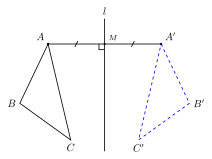
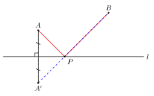

# 轴对称

## 一、图形特征

如果一个图形沿一条直线**翻折**（即"对折"），折叠后的部分能与另一部分**完全重合**，那么我们就说这个图形是**轴对称图形**，而这条直线就叫做它的**对称轴**。

这里有两个并列、但**不可混用**的概念，要从一开始就分清：

- **轴对称图形**：是说"**一个**图形自身"具有对称性——把它沿某条直线对折后，自己的左右两半能完全重合。例如等腰三角形、矩形、菱形、正方形、等腰梯形、圆都是轴对称图形。
- **两个图形成轴对称**：是说"**两个**图形之间"的关系——把其中一个图形沿某条直线翻折，能与另一个图形完全重合。这时这条直线叫做这两个图形的对称轴。

> 一句话区别：**"轴对称图形"指一个图形的内在性质；"两个图形成轴对称"指两个图形之间的位置关系。** 二者只是把同一种"翻折后重合"的关系，应用到不同的对象上。

## 二、对应元素与基本性质

不管是"一个轴对称图形"还是"两个图形成轴对称"，翻折后重合意味着对应点、对应线段、对应角之间存在严格的等量关系。

设直线 $l$ 是对称轴，点 $A$ 与点 $A'$ 是关于 $l$ 的一对**对应点**（即 $A$ 翻折后落到 $A'$，反过来 $A'$ 翻折后落到 $A$）。我们可以总结出以下核心性质：

1. **对应点连线被对称轴垂直平分**：线段 $AA'$ 被直线 $l$ 垂直平分。这是最重要的一条——它把"翻折"这一动态操作，翻译成"垂直平分"这一可以用尺规与代数处理的静态条件。
2. **对应点到对称轴的距离相等**：$A$ 到 $l$ 的距离 $=$ $A'$ 到 $l$ 的距离。这其实是性质 1 的"半句话"。
3. **对应线段相等、对应角相等**：翻折是刚性运动，不改变长度和角度，所以对应线段长度相等、对应角度数相等。
4. **对称轴本身上的点是自己的对应点**：因为它到自身的距离为 $0$，翻折后位置不变。

反过来，**判定**两个图形成轴对称也用同一句话：如果两个图形的对应点连线**都被同一条直线垂直平分**，那么这两个图形关于这条直线成轴对称。

> "垂直平分"这一关键词把"翻折"翻译成了可计算的几何条件——后续的中垂线定理、最短路径（将军饮马）问题、坐标系中的对称变换，都建立在这条性质之上。

## 三、典型应用

### 例 1（作图：作一个点关于直线的对称点）

> 已知点 $A$ 和直线 $l$（$A$ 不在 $l$ 上），用尺规作出 $A$ 关于 $l$ 的对称点 $A'$。

**思路**：根据"对应点连线被对称轴垂直平分"这一性质——$A'$ 应当满足：$AA' \perp l$ 且 $l$ 平分 $AA'$。

**作法**：
1. 过 $A$ 作直线 $l$ 的垂线，垂足为 $M$。
2. 在垂线上、$l$ 的另一侧截取 $MA' = MA$。
3. 点 $A'$ 即为 $A$ 关于 $l$ 的对称点。

完成后 $AA'$ 被 $l$ 垂直平分，$A, A'$ 关于 $l$ 对称。

### 例 2（常见图形的对称轴条数）

> 列出下列图形是否是轴对称图形，并写出对称轴的条数：等腰三角形、等边三角形、矩形、菱形、正方形、等腰梯形、平行四边形（一般）、圆。

**思路**：抓住"哪一条直线对折后两半重合"。

| 图形 | 是否轴对称 | 对称轴条数 | 对称轴位置 |
|---|---|---|---|
| 等腰三角形（非等边） | 是 | $1$ | 底边的垂直平分线（也是顶角平分线、底边上的中线、底边上的高） |
| 等边三角形 | 是 | $3$ | 三条"底边垂直平分线"（同时是三条高、三条中线、三条角平分线） |
| 矩形 | 是 | $2$ | 两组对边的垂直平分线 |
| 菱形 | 是 | $2$ | 两条对角线所在直线 |
| 正方形 | 是 | $4$ | 两组对边的垂直平分线 $+$ 两条对角线 |
| 等腰梯形 | 是 | $1$ | 上下底的公共垂直平分线 |
| 一般平行四边形 | 否 | $0$ | — |
| 圆 | 是 | $\infty$ | 经过圆心的任意一条直线 |

> 圆有无数条对称轴——这是它"对称美"最强的特征。

### 例 3（将军饮马：最短路径引入）

> 直线 $l$ 的同侧有两点 $A, B$。在直线 $l$ 上找一点 $P$，使 $PA + PB$ 取最小值。

**思路**："同侧两点和最短"是一个经典的最短路径问题，关键操作是**用轴对称把同侧变异侧**：

1. 作 $A$ 关于直线 $l$ 的对称点 $A'$。由对称性，$PA = PA'$（对应线段相等），所以 $PA + PB = PA' + PB$。
2. 现在要求的是 $PA' + PB$ 的最小值——而 $A'$ 与 $B$ 在 $l$ **异侧**，根据"两点之间线段最短"，$PA' + PB \geq A'B$，等号当且仅当 $P$ 在线段 $A'B$ 上时成立。
3. 所以连接 $A'B$ 交 $l$ 于一点，这一点就是所求的 $P$，此时 $PA + PB$ 的最小值是 $A'B$ 的长度。

**收益**：通过一次轴对称把"同侧两点的距离和"转化为"异侧两点的距离和"，再由"两点之间线段最短"直接给出最小值（呼应 thinking-toolkit/03 模型 11——最短路径之将军饮马）。

> 后面在坐标系、圆、抛物线背景下的"和最小""差最大"问题，几乎都从这一招生长出来：**遇到同侧 → 翻折一个点变异侧 → 用"线段最短"**。

## 四、易错点

1. **"轴对称图形"与"两图形成轴对称"概念不可混淆**：一个是"一个图形自己内部"对称，另一个是"两个图形之间"对称。题目用词要看清楚。
2. **对称轴可以有多条**：等边三角形有 $3$ 条、正方形有 $4$ 条、圆有无穷多条。不要看到"对称轴"就默认只有一条。
3. **对称轴必须是"那条特定直线"**：例如等腰三角形的对称轴是**底边的垂直平分线**，不是任意一条腰所在直线。判定时要给出具体的位置。
4. **轴对称图形 ≠ 中心对称图形**：等腰三角形是轴对称但**不是**中心对称；平行四边形（一般）是中心对称但**不是**轴对称。这一对比将在 part6/04 详细展开。
5. **作对称点时不要省"垂足"**：作图题里"垂直 $+$ 等距"两条都要明确标出，省略其一就丢分。

## 五、自测题

1. 下列图形中，**不是**轴对称图形的是（  ）：
   (A) 等腰三角形　(B) 矩形　(C) 平行四边形　(D) 圆
   - 💡 提示：一般平行四边形没有对称轴；矩形、菱形是它的"轴对称特例"。

2. 已知点 $A(3, 2)$ 关于直线 $x = 1$ 对称，求其对称点 $A'$ 的坐标。
   - 💡 提示：对称轴是竖直线 $x = 1$，所以 $A$ 与 $A'$ 纵坐标相同；横坐标关于 $1$ 对称——$A'$ 的横坐标 $= 2 \times 1 - 3 = -1$，故 $A'(-1, 2)$。

3. 在直线 $l$ 同侧有 $A, B$ 两点，$A$ 到 $l$ 距离为 $3$，$B$ 到 $l$ 距离为 $5$，$A, B$ 两点的水平距离（沿 $l$ 方向的距离）为 $4$。在 $l$ 上求一点 $P$，使 $PA + PB$ 最小，求这个最小值。
   - 💡 提示：作 $A$ 关于 $l$ 的对称点 $A'$（在 $l$ 另一侧，到 $l$ 距离仍为 $3$）。$PA + PB \geq A'B$。$A'$ 到 $B$ 的"竖直距离"为 $3 + 5 = 8$、水平距离为 $4$，故 $A'B = \sqrt{4^2 + 8^2} = \sqrt{80} = 4\sqrt{5}$。

4. 判断下列说法对错并简述理由：
   (a) 等边三角形有 $3$ 条对称轴。
   (b) 任何一个圆都有无数条对称轴，而且任意一条直径所在的直线都是它的对称轴。
   (c) 如果两个图形关于某直线成轴对称，那么对应点连线一定与这条直线垂直。
   (d) 一个轴对称图形最多只能有一条对称轴。
   - 💡 提示：(a) ✓——三条"边的垂直平分线"。(b) ✓——经过圆心的任何直线都是对称轴。(c) ✓——这是"对应点连线被对称轴垂直平分"的"垂直"半句话。(d) ✗——正方形 $4$ 条、圆无数条。
