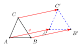
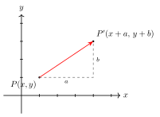
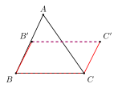
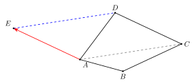

# 平移

## 一、图形特征与定义

在平面内，把一个图形沿**某一方向**移动**一定的距离**，得到的新图形与原图形位置不同但形状、大小、方向都不变——这样的图形变换叫做**平移**。

平移由两个要素**唯一确定**：

- **方向**：沿哪条射线方向移动（可以用一个有向线段或一个向量来描述）。
- **距离**：移动了多远（即所有对应点连线的长度）。

> 一句话定义：**平移 = 一个方向 + 一段距离**。换句话说，给定一个"平移向量"$\vec{v}$，整个图形里每一个点都按 $\vec{v}$ 平行地、等长地"挪一下"，得到的新图形就是原图形的平移像。

与轴对称（翻折）、旋转、中心对称这些变换并列，**平移属于"刚性运动"**——它不改变图形的形状和大小，只改变图形在平面里的位置；并且它也不改变图形的"朝向"（不像翻折那样产生镜像，也不像旋转那样转了一个角度）。

## 二、基本性质

设原图形上一点 $A$ 经过平移后落到点 $A'$，原图形上另一点 $B$ 经过平移后落到点 $B'$。由平移的定义可以总结出下面几条核心性质：

1. **平移后的图形与原图形全等**：平移是刚性运动，对应线段相等、对应角相等、对应图形全等。
2. **对应点连线平行（或共线）且相等**：连接每一对对应点 $A, A'$ 所得线段 $AA'$ 都与平移方向**平行**、长度都等于平移距离。所有的"对应点连线" $AA', BB', CC', \ldots$ **彼此平行且长度相等**（或者全部落在同一条与平移方向重合的直线上）。
3. **对应线段平行（或共线）且相等**：原图形里的线段 $AB$ 与它的像 $A'B'$ 平行（或共线），且 $AB = A'B'$。
4. **对应角相等**：原图形里的每一个角与它的像角度相等，并且角的"开口方向"也保持一致（不像翻折那样左右反向）。

> 把这几条压成一句话记忆：**"平移 = 全等 + 对应点连线平行且相等"**。其中第 2 条"对应点连线平行且相等"是平移最具识别度的"指纹"——任意挑两组对应点连线出来，它们一定平行、一定等长。

反过来，这一性质也给了我们一条**判定**：如果两个图形上有若干对对应点，它们的连线**互相平行且长度都相等**，那么这两个图形就是平移关系。

## 三、坐标系中的平移

把平移放进直角坐标系，性质就翻译成了一条"坐标加法"公式：

> 平面上一点 $P(x, y)$ 沿 $x$ 轴正方向平移 $a$ 个单位、沿 $y$ 轴正方向平移 $b$ 个单位后，得到的对应点是
> $$P'(x + a,\ y + b).$$

这里 $a, b$ 可以是正数、负数或零：

- $a > 0$ 表示向右平移；$a < 0$ 表示向左平移。
- $b > 0$ 表示向上平移；$b < 0$ 表示向下平移。

整个图形上的每一点都按同一个 $(a, b)$ 做加法，**新图形 = 旧图形所有点坐标各自 $+(a, b)$**。这条规则在函数图象的"上下、左右"平移、抛物线顶点平移里也会反复用到（part9 预告）。

## 四、典型应用

### 例 1（基础：坐标平移）

> 已知点 $A(-2, 3)$，将 $A$ 先向右平移 $5$ 个单位，再向下平移 $4$ 个单位，得到点 $A'$。求 $A'$ 的坐标。

**思路**：把"先右后下"两次平移合成一个平移向量 $(a, b) = (+5, -4)$，然后用坐标加法。

$$A'(-2 + 5,\ 3 + (-4)) = A'(3,\ -1).$$

> 多次平移可以**合成**为一次平移，向量直接相加；这一点在后面学到向量、函数平移时还会反复见到。

### 例 2（用平移构造平行四边形）

> 在 $\triangle ABC$ 中，把线段 $BC$ 沿某方向 $\vec{v}$ 平移到线段 $B'C'$。证明：四边形 $BCC'B'$（按 $B \to C \to C' \to B'$ 顺序）是平行四边形。

**思路**：用平移性质 2、3——对应点连线 $BB'$ 和 $CC'$ **平行且相等**；对应线段 $BC$ 与 $B'C'$ 也**平行且相等**。

- 由 $BB' \parallel CC'$ 且 $BB' = CC'$，四边形 $BCC'B'$ 中有一组对边 $BB' \parallel CC'$ 且 $BB' = CC'$。
- 由"一组对边平行且相等的四边形是平行四边形"（part4 平行四边形判定 3），$BCC'B'$ 是平行四边形。

> **这是平移最常用的"副产品"——用一次平移天然生出一个平行四边形**。后面"平移辅助线"的核心动机也正在于此：平移过去之后，与原线段会自然拼成一个平行四边形，从而把若干分散的条件转化到同一个图形里。

### 例 3（平移作辅助线：把分散的线段集中）

> 在四边形 $ABCD$ 中，$AB$ 与 $CD$ 不平行，且 $AB = 3,\ CD = 4$，对角线 $AC = 6$。试通过**平移**把 $AB, CD$ 平移到同一个三角形里，从而方便比较或估算 $AB + CD$ 与 $AC$ 的大小关系。

**思路**：典型的"分散 → 集中"信号——$AB$、$CD$、$AC$ 三条线段散落在不同位置，没法直接放到同一个三角形里使用三角不等式。试试**把 $CD$ 平移到从 $A$ 出发**：

1. 过 $A$ 作 $AE$ 平行且等于 $CD$（且方向与 $CD$ 一致），即把线段 $CD$ 沿 $\vec{CA}$（或任一选定方向）平移到 $AE$。这一步用到的就是平移："给一个方向 $+$ 一个距离"就能把 $CD$ 整体挪到 $AE$ 的位置，且 $AE = CD = 4$，$AE \parallel CD$。
2. 由平移生出平行四边形 $AECD$（"一组对边平行且相等" → 平行四边形），所以 $EC = AD$。
3. 现在 $AB = 3, AE = 4$ 都从 $A$ 出发——它们与从 $A$ 出发的 $AC = 6$ 同在三角形 $ABE$ 或者 $\triangle AEC$ 里，可以直接用三角不等式估算。

**收益**：通过一次平移，把原本无法直接比较的 $AB$ 和 $CD$ 集中到了从 $A$ 出发的两条边，再借助平行四边形把 $AC$、$AD$ 等长度也拉到统一的三角形结构里。这就是**平移辅助线**的核心套路（呼应 thinking-toolkit/02 D 类——"把分散的线段平移到一起"）。

> 平移辅助线的两个常见信号：① 题目里出现"两条不相邻、又不平行的线段"，需要比较和或差；② 出现梯形 / 不规则四边形而希望"造一个三角形" → 把腰平移到一起。

## 五、易错点

1. **平移不改变形状、大小、方向**：它**不是旋转**（不会转角度），**也不是翻折**（不会产生镜像）。看到题目里"方向变了"或"翻过来了"，那就不是平移。
2. **"方向 $+$ 距离"两个要素缺一不可**：只给方向不给距离、或只给距离不给方向，平移并未唯一确定。
3. **对应点连线"平行且相等"是平移的"指纹"**：判定两个图形是否平移关系，必须验证**所有**对应点连线都平行且等长；只看一对对应点是不够的。
4. **坐标平移注意正负方向**：向左、向下平移时，$a$ 或 $b$ 是**负数**；不要把"向左平移 $3$"写成 $x + 3$。
5. **平移与平行四边形的关系不要"用反"**：一次平移之后一对对应点连线一定平行且相等，所以"原线段 + 平移像 + 两端对应点连线"会拼成平行四边形；反过来，从平行四边形里抽出一对对边，也可以理解成"另一对边的平移像"——这一对偶视角在解综合题时非常有用。

## 六、自测题

1. 把点 $P(2, -3)$ 先向左平移 $4$ 个单位，再向上平移 $5$ 个单位，得到点 $P'$。求 $P'$ 的坐标。
   - 💡 提示：合成平移向量 $(a, b) = (-4, +5)$。$P'(2 + (-4),\ -3 + 5) = P'(-2, 2)$。

2. 将线段 $AB$ 沿某方向平移得到线段 $A'B'$，已知 $A(1, 1), B(3, 4), A'(5, 2)$。求 $B'$ 的坐标。
   - 💡 提示：先由 $A \to A'$ 反推平移向量 $(a, b) = (5 - 1,\ 2 - 1) = (4, 1)$；再用同一个向量平移 $B$：$B'(3 + 4,\ 4 + 1) = B'(7, 5)$。注意"线段平移"意味着每个点用**同一个**向量平移。

3. 在 $\triangle ABC$ 中，$D, E, F$ 分别在 $BC, CA, AB$ 上，且 $DE \parallel AB,\ EF \parallel BC,\ FD \parallel CA$。说明 $\triangle DEF$ 可以由 $\triangle ABC$ 经过怎样的变换（或变换组合）得到，能否仅由一次"平移"得到？
   - 💡 提示：$\triangle DEF$ 与 $\triangle ABC$ 的对应边平行但**方向相反**（中点三角形与原三角形是"中心对称 + 缩小"的关系，缩放比 $1:2$，并非单纯平移）。所以**不能**仅用一次平移得到——平移只能保证大小不变，而这里大小变了。这道题用于把"平移"与"位似 / 中心对称"区分开。

4. 在直角坐标系中，将抛物线 $y = x^2$ 沿向量 $\vec{v} = (3, -2)$ 平移，写出平移后抛物线的解析式，并写出它的顶点坐标。
   - 💡 提示：原抛物线顶点 $(0, 0)$。平移后顶点 $(3, -2)$。所以平移后解析式为 $y = (x - 3)^2 - 2$（用"左加右减、上加下减"的口诀验证：向右 $3$ → $x$ 替换为 $x - 3$；向下 $2$ → 整体 $-2$）。
