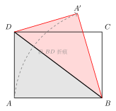
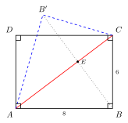
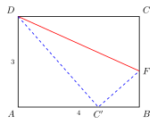
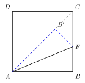

# 翻折模型

> **一图速记**：将图形沿一条直线（**折痕**）翻折后，折前与折后两部分关于折痕**轴对称**——折痕 $\perp$ 对应点连线、对应边/角相等、折前折后两部分**全等**。常见于矩形折叠、三角形折叠、正方形折叠。解题三步走：**标折痕 → 列等量 → 设未知数用勾股**。

## 一、引入：一道"看起来无从下手"的折叠题

> **题目**：矩形 $ABCD$ 中，$AB = 8$，$BC = 6$。把 $\triangle ABC$ 沿对角线 $AC$ 翻折，点 $B$ 落到 $B'$。求 $BB'$ 的长。

请先停下来，自己画图试一两分钟。

很多同学一看"折叠"就慌：折完之后图形乱成一团，$B'$ 又跑到了一个不规则的位置，到底**该写什么等量、设什么未知数**？折叠题之所以让人无从下手，是因为它把"轴对称"包装成了一个动态的过程——你必须**把折叠这个动作还原成静态的对称关系**，才能下手。

这一题，就是翻折模型存在的全部意义。

## 二、思维路径还原（解题者的内心独白）

下面这段内心独白，请逐行慢读，体会**每一步念头是怎么自然冒出来的**：

> "看到'沿对角线 $AC$ 翻折'，第一反应不是去想 $B'$ 在哪，而是**先把折痕画出来**——折痕就是 $AC$。
>
> 折叠 = 轴对称（part6/01），这是翻折题的灵魂。立刻把'折叠'这个动词翻译成对称的所有性质：$B$ 和 $B'$ 关于 $AC$ 对称 → $AC \perp BB'$，$AC$ **平分** $BB'$。
>
> 再补一句对应相等：$AB' = AB = 8$、$CB' = CB = 6$、$\angle ACB' = \angle ACB$。整个 $\triangle ACB'$ 和 $\triangle ACB$ **全等**。
>
> 现在题目要 $BB'$。$BB'$ 是对应点连线，被折痕 $AC$ **垂直平分**——设交点为 $E$，则 $BB' = 2\cdot BE$，问题转化为求 $BE$。
>
> $BE$ 怎么求？$BE$ 是 $B$ 到折痕 $AC$ 的距离，也就是 $\triangle ABC$ 里 **$AC$ 边上的高**。
>
> $\triangle ABC$ 是直角三角形（$\angle ABC = 90°$，矩形保证），$AB = 8, BC = 6$，所以 $AC = \sqrt{8^2 + 6^2} = 10$。
>
> 用面积法：$S_{\triangle ABC} = \frac{1}{2}\cdot AB\cdot BC = \frac{1}{2}\cdot 8 \cdot 6 = 24$，又等于 $\frac{1}{2}\cdot AC \cdot BE$，立刻 $BE = \frac{48}{10} = 4.8$。
>
> 所以 $BB' = 2\cdot 4.8 = 9.6$。
>
> 回头复盘：整道题真正动用的'折叠特性'只有两条——'折痕 $\perp BB'$' 和 '折痕平分 $BB'$'。剩下的全是常规的勾股 + 面积法。这就是翻折模型的本质：**把折叠翻译成对称，再用对称的等量关系列方程**。"

把这段独白读三遍。**真正难的不是计算，而是**：

1. 看到"折叠"立刻条件反射"这就是轴对称"；
2. 把 $B, B'$ 的关系准确写出"折痕 $\perp$ 对应点连线 + 平分"；
3. 把"求折后某段长"转化为"求对应点到折痕的距离"，让勾股 / 面积法上场。

## 三、抽象成模型

把上面这道题的"骨架"抽出来，就是**翻折模型**。

**图形特征**（识别条件）：

- 题目里出现"沿某直线**折叠 / 翻折**"的字样；
- 或者"将图形的某一部分**翻到**另一位置"。

**核心结构**（看到"翻折"两个字立刻有）：

折叠 = **轴对称**（part6/01），把这个等式记死。立即写出折前点 $P$ 与折后点 $P'$ 的关系：

- 折痕 $\perp$ 对应点连线 $PP'$；
- 折痕**平分**对应点连线 $PP'$；
- 折前折后**对应线段相等**：$AP = AP'$、$BP = BP'$（其中 $A, B$ 在折痕上）；
- 折前折后**对应角相等**；
- 折前折后两部分**全等**。

**解题三步走**（翻折题通用套路）：

1. **标折痕**：先把折痕画清楚，标出哪些点关于它对称；
2. **列等量**：把"折前 = 折后"的所有相等关系（边、角）一次写齐；
3. **设未知数 + 勾股**：把未知线段设为 $x$，用直角三角形的勾股定理列方程，常常还需配合"折痕 $\perp$ 对应点连线"或"对应点在某条边上"等位置条件。

## 四、模型变形

翻折模型在中考里以下面这些**变形**面孔示人：

- **变形 1（矩形折叠到对角线上）**：把矩形的一角折到对角线上 / 把一条边折到对角线上——折痕通常是某个角的角平分线（因为对称把一条边映到另一条边，折痕就是夹角平分线）。
- **变形 2（矩形折叠到对边上）**：把一个顶点折到对边上的某点。**关键等量**：折后线段 = 折前线段；折后点在指定边上 → 用直角三角形列勾股方程。
- **变形 3（三角形折叠）**：把三角形的一个顶点折到对边上 / 折到另一边上，常考折后三角形与原三角形的相似或全等。
- **变形 4（正方形折叠 + 半角）**：正方形里的折叠经常和半角模型（cong/04）结合——折叠本身就是半角模型的几何来源（把一块三角形"翻"过来拼到另一块上）。
- **变形 5（多次折叠）**：每一次折叠都是一次独立的轴对称，按顺序逐次应用对称性质即可。
- **本质**：翻折模型 = "**轴对称 + 勾股方程**"。把这两件事咬死，所有变形就是同一件事。

## 五、思考路标（看到 X → 想到 Y）

把下面每条嚼到反射弧水平：

- 看到题目**"沿……折叠 / 翻折"** → 翻折模型 = 轴对称，立刻写出对称性质；
- 看到**折痕** → 写下"折痕 $\perp$ 对应点连线 + 折痕平分对应点连线"；
- 看到**折后点落在指定边/线上** → 把"折后点 = 折前点对应长"和"折后点在某直线上"两个条件联立，多半设未知数列勾股；
- 看到**问"折后某段长"** → 看它是不是对应点到折痕的距离；如果是，用面积法 / 勾股直接出来；
- 看到**折后某段等于折前某段** → 那是模型的核心等量，直接拿来用，不需要再证；
- 看到**折叠 + 矩形 + 一角折到对边** → 设未知数，几乎一定要用勾股；
- 看到**正方形 + 折叠** → 警觉半角模型（cong/04）；
- 看到**多次折叠** → 一次一次来，每次只用一次轴对称；
- 想求**折痕长** → 折痕两端常常分别在原图的两条边上，设端点位置后用坐标 / 勾股；
- 想证**折后某三角形与原某三角形全等** → 折前折后全等是免费送的；剩下要找的多半是别的关系（比如折叠后某段恰等于矩形的某条边等）。

## 六、应用例题

下面三例只演示"**怎么用路标识别 + 怎么把模型套上去**"，请你照着把过程补完。

**例 1（基础：对角线折叠求 $BB'$）**：矩形 $ABCD$ 中，$AB = 8$，$BC = 6$。把 $\triangle ABC$ 沿对角线 $AC$ 翻折，点 $B$ 落到 $B'$。求 $BB'$。

> **路标触发**："沿 $AC$ 翻折" → 翻折模型 = 轴对称。**思路**：折痕是 $AC$，$BB' \perp AC$ 且被 $AC$ 平分，设交点 $E$。$AC = \sqrt{8^2+6^2} = 10$。由 $S_{\triangle ABC} = \frac{1}{2}\cdot 8\cdot 6 = \frac{1}{2}\cdot 10\cdot BE$，得 $BE = 4.8$，所以 $BB' = 2BE = 9.6$。

**例 2（折到对边上 → 勾股列方程）**：矩形 $ABCD$ 中，$AB = 4$，$BC = 3$。将矩形沿某条折痕翻折，使顶点 $C$ **恰好落在边 $AB$ 上**的点 $C'$ 处。求 $BC'$ 的长。

> **路标触发**："折后点落到指定边上" → 设未知 + 勾股。**思路**：设折痕交 $BC$ 于 $F$。折叠是轴对称 → $FC' = FC$。设 $BC' = x$，则 $AC' = AB - x = 4 - x$。同时折后点 $C'$ 到 $D$ 的距离应等于折前 $C$ 到 $D$ 的距离吗？——不一定，要看折痕怎么取。**更标准的做法**：另设折痕过 $D$（即把 $\triangle DCF$ 折起，$D$ 在折痕上不动），此时折叠不改变 $DC$ → $DC' = DC = 4$。在 $\text{Rt}\triangle DAC'$ 中（$\angle A = 90°$，$AD = 3$，$DC' = 4$）：$AC' = \sqrt{DC'^2 - AD^2} = \sqrt{16-9} = \sqrt{7}$，所以 $BC' = AB - AC' = 4 - \sqrt{7}$。

**例 3（正方形折叠 + 半角思想）**：正方形 $ABCD$ 边长 $1$。将 $\triangle ABF$（$F$ 在 $BC$ 上）沿 $AF$ 翻折，使 $B$ 落到正方形内的点 $B'$。若折后 $B'$ 恰好落在对角线 $AC$ 上，求 $BF$ 的长。

> **路标触发**："正方形 + 折叠 + 落到对角线" → 折叠 = 轴对称，对应角相等。**思路**：折叠不变 $AB$ 长 → $AB' = AB = 1$；折叠不变 $\angle BAF$ 的大小，且 $\angle BAF = \angle B'AF$。$B'$ 在 $AC$ 上意味着 $\angle BAB'$ 等于对角线 $AC$ 与 $AB$ 的夹角 $45°$，故 $\angle BAF = \frac{1}{2}\cdot 45° = 22.5°$。在 $\text{Rt}\triangle ABF$ 中（$\angle ABF = 90°$，$AB = 1$）：$BF = AB\cdot \tan 22.5° = \tan 22.5° = \sqrt{2} - 1$（用半角公式 / 几何推导得到）。**注意**：这里折叠把 $\angle BAC$ 一分为二，正是"半角"的几何起源。

## 七、思路自测题

做下面四题前，先在脑中默念第五节的路标。

**自测 1（最朴素的折叠）**：矩形 $ABCD$ 中，$AB = 5$，$BC = 3$。将 $\triangle ABD$ 沿对角线 $BD$ 翻折，$A$ 落到 $A'$。求 $A'$ 到 $BD$ 的距离 $h$。

> 💡 提示：折叠 = 轴对称 → $A'$ 关于 $BD$ 与 $A$ 对称 → **$A$ 到 $BD$ 的距离 = $A'$ 到 $BD$ 的距离**。问题转化为求 $A$ 到 $BD$ 的距离。$BD = \sqrt{25 + 9} = \sqrt{34}$；由面积法 $\frac{1}{2}\cdot AB\cdot AD = \frac{1}{2}\cdot BD\cdot h$，得 $h = \frac{15}{\sqrt{34}} = \frac{15\sqrt{34}}{34}$。

**自测 2（顶点折到对边）**：矩形 $ABCD$ 中，$AB = 6$，$BC = 8$。沿某折痕将顶点 $A$ 折到 $BC$ 边上的点 $A'$，且折痕过 $D$。求 $A'B$ 的长。

> 💡 提示：折痕过 $D$ → 折叠不改变 $DA$ → $DA' = DA = 8$。在 $\text{Rt}\triangle DCA'$ 中（$\angle C = 90°$，$DC = 6$，$DA' = 8$）：$CA' = \sqrt{64-36} = \sqrt{28} = 2\sqrt{7}$，所以 $A'B = BC - CA' = 8 - 2\sqrt{7}$。**通用套路**：折痕过哪个顶点，哪个顶点到折后点的距离就等于到折前点的距离，立刻有一个等量。

**自测 3（折痕长）**：在自测 2 的条件下，求**折痕长 $DE$**（其中 $E$ 在 $AB$ 上，$DE$ 即折痕）。

> 💡 提示：折痕是 $AA'$ 的垂直平分线（part6/01）。设 $AE = x$ → $A'E = x$（折前 $= $ 折后）。$E$ 在 $AB$ 上 → $BE = 6 - x$。在 $\text{Rt}\triangle BEA'$ 中：$BE^2 + BA'^2 = EA'^2$，即 $(6-x)^2 + (8 - 2\sqrt{7})^2 = x^2$，解出 $x$，再用 $\text{Rt}\triangle ADE$ 求 $DE = \sqrt{AD^2 + AE^2} = \sqrt{64 + x^2}$。**关键思想**：折痕端点要么在原图边上、要么是已知点；用"折前 = 折后"把折痕端点的位置锁死。

**自测 4（多次折叠 / 综合）**：将一张长方形纸条 $ABCD$（$AB = 1$，$AD = 4$）按下面顺序两次折叠——先沿过 $A$ 的某折痕把 $B$ 折到 $AD$ 上的点 $B'$，再沿过 $B'$ 的某折痕把折后图形的某顶点折到再下一个位置……（一道开放分析题）。请只回答第一步：第一次折叠后 $B'$ 在 $AD$ 上的位置距离 $A$ 多远？

> 💡 提示：第一步折叠 = 一次轴对称。$B$ 折到 $AD$ 上 → 折叠不改变 $AB$ 长 → $AB' = AB = 1$，所以 $B'$ 距离 $A$ 恰好 $1$。**这一题的真正用意**：让你看到"无论多复杂的折叠题，每一步都只用一次轴对称的核心等量"。多次折叠 = 多次单次折叠的叠加，**不要被'多次'吓住**。

---

**回头看一眼"一图速记"**：

> 折叠 = 轴对称，折痕 $\perp$ 对应点连线且平分之；折前 = 折后（对应边、角相等，两部分全等）。解题三步：**标折痕 → 列等量 → 设未知数勾股**。

如果你脑中现在能秒回这句话，并且看到任何折叠题都本能地先画折痕、再写"折前 = 折后"——那么翻折模型，你拿下了。
