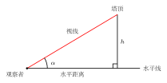
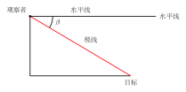
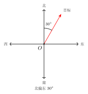
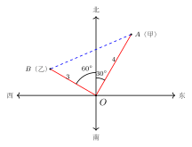

# 解直角三角形的应用

## 一、什么叫"解直角三角形"

**解直角三角形**：在直角三角形里，已知若干条元素（边或锐角），求出其余所有未知元素的过程。直角三角形一共有 6 个元素：3 条边 + 3 个角（其中一个角已知为 $90°$）。除直角外还剩 5 个元素，只要再知道**两个**（且至少有一个是边），就足以求出剩下的全部。

可用的"三件工具"：

- **锐角互余**：两锐角之和为 $90°$ —— 知道一个锐角即可立得另一个；
- **勾股定理** $a^2 + b^2 = c^2$ —— 用来在三条边之间互推；
- **三角函数** $\sin, \cos, \tan$（part7/01 与 part7/02）—— 用来在"边"和"角"之间架桥。

口诀：**有角缺边用三角函数；有边缺边用勾股；有边缺角先选合适的三角函数反查表**。

## 二、两种常见配方

设 $\triangle ABC$ 中 $\angle C = 90°$，$a, b$ 是直角边（分别为 $\angle A, \angle B$ 的对边），$c$ 是斜边。

**配方 1：已知一锐角 + 一边 → 求其余边。**

- 知道 $\angle A$ 与斜边 $c$：$a = c \sin A$，$b = c \cos A$。
- 知道 $\angle A$ 与对边 $a$：$c = \dfrac{a}{\sin A}$，$b = \dfrac{a}{\tan A}$。
- 知道 $\angle A$ 与邻边 $b$：$a = b \tan A$，$c = \dfrac{b}{\cos A}$。

**配方 2：已知两边 → 求角与第三边。**

- 用勾股算出第三边；
- 再挑一个最容易计算的三角函数（比如 $\tan A = \dfrac{a}{b}$）反查表确定 $\angle A$，最后 $\angle B = 90° - \angle A$。

## 三、实际应用的四个术语

中考"解直角三角形"应用题几乎全部来自下面四个场景的组合，必须把术语和图形对应清楚。

### 1. 仰角

**仰角** = 视线在水平线**上方**与水平线所夹的角。看高处的塔顶、楼顶、山顶时形成的就是仰角。

```
        塔顶 ·
            /|
           / |  塔高
          /  |
   视线 /    |
        /α   |
   人 ·------·   <- 水平线
        水平距离
```

图中 $\alpha$ 即仰角。若已知水平距离 $d$ 与仰角 $\alpha$，则塔高 $h = d \tan \alpha$。



### 2. 俯角

**俯角** = 视线在水平线**下方**与水平线所夹的角。从塔顶向下看地面目标时形成的就是俯角。

```
   人·------·   <- 水平线（在高处）
      \β
       \
        \   视线
         \
          · 地面目标
```

图中 $\beta$ 即俯角。注意一个关键事实：**水平线互相平行**，所以"塔顶看地面目标的俯角"与"地面目标看塔顶的仰角"是**一对内错角**，大小相等。这是把两侧条件互相转换的常用桥梁。



### 3. 方位角

**方位角**：从**正北**（或正南）方向出发，**顺时针**（或逆时针）量到目标方向的角度。读法是"北偏东 $\alpha$"或"南偏西 $\alpha$"等。约定 $0° < \alpha < 90°$，正好夹在某个象限里。

```
        北
        |
        |  α
        |  /
        | /
   西---·-------东
        |
        |
        南
```

图中表示方向是"北偏东 $\alpha$"。常见组合：

- "北偏东 $30°$" + "北偏西 $60°$" —— 两个方向夹角为 $30° + 60° = 90°$，构成直角；
- "北偏东 $30°$" + "南偏东 $60°$" —— 两个方向夹角为 $180° - 30° - 60° = 90°$，也是直角；
- 题目里出现"两条方向线垂直"几乎都是为了让你用勾股定理。



### 4. 坡度（坡比）

**坡度（坡比）** $i$ = 坡面的**铅直高度** $h$ 与**水平距离** $l$ 的比：
$$i = \dfrac{h}{l} = \tan \alpha,$$
其中 $\alpha$ 是坡面与水平面的夹角，叫**坡角**。坡度通常写成 $1:m$（如 $1:2$、$1:\sqrt{3}$）。

```
         · 坡顶
        /|
   坡面/ |  h（铅直高度）
      /  |
     /α  |
    ·----·
    l（水平距离）
```

由定义直接得 $\tan \alpha = i$。若坡度 $1:\sqrt{3}$，则 $\tan \alpha = \dfrac{1}{\sqrt{3}} = \dfrac{\sqrt{3}}{3}$，对照特殊角表立得 $\alpha = 30°$。


## 四、典型应用

**例 1（基础：已知一锐角和斜边）** 在 $\triangle ABC$ 中，$\angle C = 90°$，$\angle B = 30°$，斜边 $c = 10$。求两直角边。

【思路】$\angle B = 30°$ 的对边是 $b$，邻边是 $a$。直接用配方 1：
$$b = c \sin B = 10 \times \sin 30° = 10 \times \dfrac{1}{2} = 5,$$
$$a = c \cos B = 10 \times \cos 30° = 10 \times \dfrac{\sqrt{3}}{2} = 5\sqrt{3}.$$
验算：$5^2 + (5\sqrt{3})^2 = 25 + 75 = 100 = 10^2.\ \checkmark$ 并且 $\angle A = 90° - 30° = 60°$。

**例 2（仰角问题）** 某人站在离塔底水平距离 $50$ 米的地方，仰望塔顶的仰角是 $30°$。求塔高（设人眼离地面高度忽略不计）。


【思路】塔与地面垂直，构成直角三角形：水平距离 $50$ 是底边，塔高 $h$ 是与之垂直的边，仰角 $30°$ 在人脚处。塔高 $h$ 对的是 $30°$，水平距离 $50$ 是 $30°$ 的邻边：
$$\tan 30° = \dfrac{h}{50} \Rightarrow h = 50 \tan 30° = 50 \times \dfrac{\sqrt{3}}{3} = \dfrac{50\sqrt{3}}{3} \approx 28.87\ (\text{米}).$$

**例 3（方位角 + 勾股）** 港口 $O$ 正北方向有两条航线：甲船在港口的"北偏东 $30°$"方向 $4$ 海里处的 $A$ 点，乙船在港口的"北偏西 $60°$"方向 $3$ 海里处的 $B$ 点。求两船间距 $AB$。



【思路】两个方向同以"正北"为基准：一个偏东 $30°$、一个偏西 $60°$。两方向之间的夹角为 $30° + 60° = 90°$，即 $\angle AOB = 90°$。于是 $\triangle AOB$ 是以 $O$ 为直角顶点的直角三角形，$OA = 4$、$OB = 3$ 是两条直角边：
$$AB = \sqrt{OA^2 + OB^2} = \sqrt{16 + 9} = \sqrt{25} = 5\ (\text{海里}).$$
**关键观察**：方位角题先把所有方向画到同一张"指北图"里，标出每条方向线与正北的夹角，**两方向之间的夹角**才是要用到的内角。

**例 4（坡度问题）** 一段堤坝的横截面是梯形，坡面坡度 $i = 1:2$，坡顶到坡底的**水平距离**为 $20$ 米。


(1) 求坡角 $\alpha$ 的正切值，并据此估算坡角；

(2) 求坡的铅直高度 $h$；

(3) 求坡面（斜面）的长度。

【思路】

(1) 由定义 $\tan \alpha = i = \dfrac{1}{2} = 0.5$。这不是特殊角，但介于 $\tan 0° = 0$ 与 $\tan 45° = 1$ 之间，故 $0° < \alpha < 45°$；实际数值 $\alpha \approx 26.57°$（查表或计算器）。

(2) 由 $\tan \alpha = \dfrac{h}{l}$ 得 $h = l \tan \alpha = 20 \times \dfrac{1}{2} = 10$ 米。

(3) 坡面是斜边，由勾股：
$$\text{坡面长} = \sqrt{l^2 + h^2} = \sqrt{20^2 + 10^2} = \sqrt{500} = 10\sqrt{5}\ (\text{米}) \approx 22.36\ \text{米}.$$
**别踩坑**：坡度的分母是**水平距离**而不是斜面长度；如果题目给的是斜面长度，得先用勾股转化。

## 五、易错点

1. **仰角、俯角都是与水平线的夹角**，不是与铅垂线的夹角。如果题目说"看塔顶的角为 $30°$"含糊不清，要追问是与水平线还是铅垂线的夹角；中考默认是水平线。
2. **俯角与仰角的等量关系**：高处看低处的俯角 = 低处看高处的仰角（同一对水平线的内错角）。涉及"楼上看楼下、再从楼下看楼上"的题，这一点能省下很多步。
3. **方位角必以"北/南"为基准**，不能说"东偏北 $30°$"；正确说法是"北偏东 $60°$"。把方向画到指北图上是不出错的关键。
4. **坡度 = 高 : 水平距离**，不是"高 : 斜面长"。坡度写成 $1:m$ 时，$m$ 是水平距离对应的比例值，并且 $\tan \alpha = \dfrac{1}{m}$。
5. **三角函数选错**：求未知边时，看清未知边相对于已知角是**对边、邻边还是斜边**，再决定用 $\sin / \cos / \tan$。一般原则——含斜边用 $\sin$ 或 $\cos$；不含斜边（两条直角边之间的关系）用 $\tan$。
6. **不要忘记画图**：实际应用题先把情境抽象成一张包含直角三角形的简图，把已知量标上角度/长度，未知量用字母标好；几何模型一旦清晰，三角函数立刻"对号入座"。

## 六、自测题

1. 在 $\triangle ABC$ 中，$\angle C = 90°$，$\angle A = 60°$，$a = 6\sqrt{3}$。求 $b, c$ 与 $\angle B$。
2. 一棵大树被风折断，树顶 $A$ 落在地面 $B$ 处，与树根 $C$ 的水平距离 $BC = 4$ 米；测得 $\angle ABC = 30°$（即折断后斜立部分与地面的夹角为 $30°$）。求大树原来的高度。
3. 在港口 $O$ 的观测员发现，灯塔 $P$ 在 $O$ 的"南偏东 $45°$"方向，距离为 $8\sqrt{2}$ 海里；另一灯塔 $Q$ 在 $O$ 的"南偏西 $45°$"方向，距离为 $6\sqrt{2}$ 海里。求 $P$ 到 $Q$ 的距离。【思路】两方向夹角为 $45° + 45° = 90°$，$\triangle POQ$ 直角，$PQ = \sqrt{(8\sqrt{2})^2 + (6\sqrt{2})^2}$。
4. 一架飞机在高度 $1200$ 米的水平飞行，看到正前方地面目标的俯角是 $60°$。再过一段时间后，俯角变成 $30°$。求这段时间飞机水平飞行了多少米。【思路】用同一目标 + 两个不同位置的俯角，构造两段水平距离之差。
5. 一段斜坡的坡度为 $1:\sqrt{3}$，坡面长 $20$ 米。求坡角、坡的铅直高度和水平距离。【思路】$\tan \alpha = \dfrac{1}{\sqrt{3}} \Rightarrow \alpha = 30°$；铅直高度 = 坡面 $\times \sin 30°$，水平距离 = 坡面 $\times \cos 30°$。
