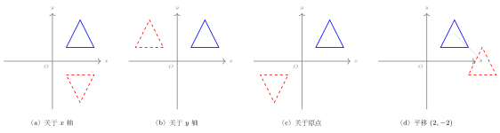
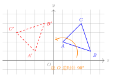

# 坐标与图形变换

## 一、平面直角坐标系基础

平面直角坐标系是把代数与几何联结起来的桥梁。它由两条互相垂直、原点重合的数轴组成：水平的一条称为 $x$ 轴（横轴），方向向右为正；竖直的一条称为 $y$ 轴（纵轴），方向向上为正；两轴交点 $O$ 称为原点。

平面上任一点 $P$ 都可以用一对有序实数 $(x, y)$ 唯一地表示：$x$ 称为**横坐标**，$y$ 称为**纵坐标**。注意"有序"二字——$(3, 2)$ 与 $(2, 3)$ 是平面上**不同**的两个点。

两条坐标轴把平面分成四个区域，按逆时针方向编号为第一、二、三、四象限。各象限内点的坐标符号有简洁的规律：

- 第一象限：$(+, +)$
- 第二象限：$(-, +)$
- 第三象限：$(-, -)$
- 第四象限：$(+, -)$

特别地，**坐标轴上的点不属于任何象限**：$x$ 轴上的点纵坐标为 $0$，记作 $(x, 0)$；$y$ 轴上的点横坐标为 $0$，记作 $(0, y)$；原点为 $(0, 0)$。

## 二、坐标变换汇总（必背表）

图形在坐标系中的"对称""平移""旋转""位似"等几何变换，都可以归结为坐标的代数变换。下表列出中考最常用的八种变换：

| 变换 | 点 $(x, y)$ 变到 |
|---|---|
| 关于 $x$ 轴对称 | $(x, -y)$ |
| 关于 $y$ 轴对称 | $(-x, y)$ |
| 关于原点对称（中心对称） | $(-x, -y)$ |
| 平移 $(a, b)$（右 $a$、上 $b$） | $(x+a, y+b)$ |
| 关于直线 $y = x$ 对称 | $(y, x)$ |
| 绕原点逆时针旋转 $90°$ | $(-y, x)$ |
| 绕原点顺时针旋转 $90°$ | $(y, -x)$ |
| 关于原点位似（比 $k$） | $(kx, ky)$ |

**记忆要点**：

- **关于哪条轴对称，哪个坐标不变**：关于 $x$ 轴对称，$x$ 不变、$y$ 反号；关于 $y$ 轴对称，$y$ 不变、$x$ 反号。
- **关于原点对称 = 关于 $x$ 轴 + 关于 $y$ 轴对称**：两个坐标都反号。
- **平移**：右正左负加在 $x$ 上，上正下负加在 $y$ 上；图形不变形不翻转。
- **关于 $y = x$ 对称**：两个坐标**交换位置**，符号不变。
- **绕原点旋转 $90°$**：两个坐标**交换位置后再让其中一个反号**。逆时针时新横坐标 $= -$ 原纵坐标；顺时针时新纵坐标 $= -$ 原横坐标。
- **位似**（以原点为位似中心、比例 $k$）：两个坐标同乘 $k$；当 $k < 0$ 时图形还会关于原点翻转。

## 三、典型应用

### 例 1（基础：轴对称）

求点 $A(3, -2)$ 关于 $x$ 轴的对称点 $A'$ 的坐标。

【思路】 关于 $x$ 轴对称，横坐标不变，纵坐标反号。

【解】 $A'(3, 2)$。

### 例 2（旋转 $90°$）

$\triangle ABC$ 的三个顶点坐标为 $A(1, 2)$、$B(4, 1)$、$C(3, 4)$。把它绕原点逆时针旋转 $90°$ 得到 $\triangle A'B'C'$，求新顶点的坐标。

【思路】 用变换表中"绕原点逆时针旋转 $90°$：$(x, y) \to (-y, x)$"，对三个顶点依次套用即可。

【解】

- $A(1, 2) \to A'(-2, 1)$
- $B(4, 1) \to B'(-1, 4)$
- $C(3, 4) \to C'(-4, 3)$

**验证**（可选）：旋转保距离，可任取一边验证。$|AB| = \sqrt{(4-1)^2 + (1-2)^2} = \sqrt{10}$；$|A'B'| = \sqrt{(-1+2)^2 + (4-1)^2} = \sqrt{10}$。

### 例 3（综合变换：复合变换的顺序）

点 $P(2, -3)$，先向左平移 $1$ 个单位、向上平移 $4$ 个单位得到 $P_1$，再把 $P_1$ 关于 $y$ 轴作对称得到 $P_2$。求 $P_2$ 的坐标。如果交换变换顺序（先关于 $y$ 轴对称，再做相同平移），结果还相同吗？

【思路】 复合变换**一般不满足交换律**，要严格按题目顺序做。一步一步算，比硬记复合公式更稳。

【解】

第一步（平移）：$P(2, -3) \to P_1(2 - 1, \, -3 + 4) = P_1(1, 1)$。

第二步（关于 $y$ 轴对称）：$P_1(1, 1) \to P_2(-1, 1)$。

**交换顺序的对比**：

- 先对称：$P(2, -3) \to (-2, -3)$。
- 再做"左 $1$、上 $4$"的平移：$(-2 - 1, \, -3 + 4) = (-3, 1)$。

与 $P_2(-1, 1)$ **不同**，说明"先平移再对称"和"先对称再平移"得到的点位置不同——**变换顺序不可随意交换**。

## 四、易错点提醒

1. **轴对称只反一个坐标，中心对称才反两个**。关于 $x$ 轴时不要把 $x$ 也写成 $-x$。
2. **旋转 $90°$ 的口诀**：交换 + 反号一个；逆时针把"新横坐标"反号，顺时针把"新纵坐标"反号。容易把方向记反，最稳妥的办法是画图验证一次（比如 $(1, 0)$ 逆时针 $90°$ 应到 $(0, 1)$）。
3. **关于直线 $y = x$ 对称**是**交换两个坐标**，不是反号。
4. **平移的方向符号**：向左平移 $a$ 个单位是 $x - a$ 而不是 $x + a$。建议把题目里的"左、下"先翻译成"$x$ 的变化量是负的、$y$ 的变化量是负的"再代入。
5. **位似变换中的比例 $k$ 有正负之分**：$k > 0$ 时新图与原图在原点同侧；$k < 0$ 时在原点的两侧（相当于位似 + 中心对称）。求图形位似变换后的坐标时，应根据题目意图取正或取负，必要时**两种都答**。
6. **复合变换不要轻易合并**。例 3 已经说明顺序敏感，初学者请逐步执行，不要试图一次到位。

## 五、自测题

1. 写出点 $(-5, 4)$ 关于原点的对称点坐标。

2. 把点 $M(3, -1)$ 向右平移 $2$ 个单位再向下平移 $3$ 个单位，求新坐标。

3. 点 $A(2, 5)$ 关于直线 $y = x$ 的对称点 $A'$ 的坐标是\_\_\_\_。

4. $\triangle ABC$ 中 $A(0, 2)$、$B(3, 0)$、$C(-1, -4)$，把它绕原点顺时针旋转 $90°$，求三顶点的新坐标。

5. 点 $P(-2, 3)$ 关于 $x$ 轴对称得 $P_1$，$P_1$ 再关于 $y$ 轴对称得 $P_2$。说明 $P_2$ 与 $P$ 之间是何种变换关系，并写出 $P_2$ 的坐标。

**参考答案**：

1. $(5, -4)$。
2. $(3 + 2, \, -1 - 3) = (5, -4)$。
3. $A'(5, 2)$。
4. 套用 $(x, y) \to (y, -x)$：$A'(2, 0)$、$B'(0, -3)$、$C'(-4, 1)$。
5. $P_1(-2, -3)$、$P_2(2, -3)$。从 $P(-2, 3)$ 到 $P_2(2, -3)$ 两个坐标都反号，故二者**关于原点中心对称**。这也印证了"关于 $x$ 轴对称 + 关于 $y$ 轴对称 = 关于原点对称"。
