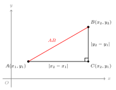
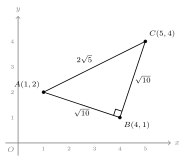

# 两点间距离公式

## 一、核心公式

设平面直角坐标系中两点 $A(x_1, y_1)$ 与 $B(x_2, y_2)$，则两点间的距离为

$$AB = \sqrt{(x_2 - x_1)^2 + (y_2 - y_1)^2}.$$

这个公式把"几何距离"翻译成了"坐标运算"，是坐标几何中最基础也最高频的工具。

---

## 二、公式来源（呼应 part3/rt/01 勾股定理）

为什么是这个形式？看一张构造图：

过 $A$ 作 $x$ 轴的平行线，过 $B$ 作 $y$ 轴的平行线，两条线交于点 $C(x_2, y_1)$。这样 $\triangle ABC$ 是以 $C$ 为直角顶点的直角三角形：

- 水平直角边 $AC$ 的长度 = $|x_2 - x_1|$（横坐标之差的绝对值）；
- 竖直直角边 $BC$ 的长度 = $|y_2 - y_1|$（纵坐标之差的绝对值）；
- 斜边 $AB$ 就是要求的距离。

由勾股定理：

$$AB^2 = |x_2 - x_1|^2 + |y_2 - y_1|^2 = (x_2 - x_1)^2 + (y_2 - y_1)^2.$$

开方即得公式。**绝对值平方等于平方本身**，所以最终式子不写绝对值。

---

## 三、特殊情形

| 情形 | 简化结果 |
|---|---|
| 横坐标相同（$x_1 = x_2$，竖直线段） | $AB = \lvert y_2 - y_1 \rvert$ |
| 纵坐标相同（$y_1 = y_2$，水平线段） | $AB = \lvert x_2 - x_1 \rvert$ |
| 点 $A(x_1, y_1)$ 到原点 $O(0,0)$ | $OA = \sqrt{x_1^2 + y_1^2}$ |

这三种情形是普通公式的"退化"——当某一对坐标相同时，对应的差为 $0$，根号下只剩另一项。

---

## 四、中点公式

$AB$ 的中点 $M$ 的坐标是 $A,B$ 坐标的**算术平均**：

$$M = \left(\frac{x_1 + x_2}{2},\ \frac{y_1 + y_2}{2}\right).$$

几何上：中点的横坐标 = 两端横坐标的平均；纵坐标同理。这与一维数轴上"中点 = 两端点均值"完全一致，只是在 $x, y$ 两个方向上各做一次。

中点公式在以下题型中频繁出现：

- 求线段中点；
- 判断**平行四边形**（对角线互相平分 ⇒ 两条对角线中点重合）；
- 求**对称点**坐标（已知中心对称的中心和一个端点，求另一端点）。

---

## 五、典型应用

### 例 1（基础）

求 $A(1, 2)$ 与 $B(4, 6)$ 间的距离。

**思路**：直接代入距离公式，把横坐标差、纵坐标差分别算出，再平方相加开方。

**解**：

$$AB = \sqrt{(4-1)^2 + (6-2)^2} = \sqrt{9 + 16} = \sqrt{25} = 5.$$

### 例 2（判断三角形形状）

已知 $A(1, 2),\ B(4, 1),\ C(5, 4)$，判断 $\triangle ABC$ 的形状。

**思路**：用距离公式分别算三边平方（**不必开方，比较平方更省事**），然后看：(1) 是否有两边相等 → 等腰；(2) 是否满足"两边平方和 = 第三边平方"→ 由**勾股定理逆定理**（part3/rt/02）判直角。

**解**：

$$AB^2 = (4-1)^2 + (1-2)^2 = 9 + 1 = 10,$$
$$BC^2 = (5-4)^2 + (4-1)^2 = 1 + 9 = 10,$$
$$AC^2 = (5-1)^2 + (4-2)^2 = 16 + 4 = 20.$$

观察：$AB^2 = BC^2 = 10$，所以 $AB = BC$（等腰）；又 $AB^2 + BC^2 = 10 + 10 = 20 = AC^2$，由勾股逆定理知 $\angle B = 90°$。

结论：$\triangle ABC$ 是以 $B$ 为直角顶点的**等腰直角三角形**。

### 例 3（动点最值——将军饮马 + 距离公式）

已知 $A(1, 3),\ B(5, 1)$，在 $x$ 轴上求一点 $P$，使 $PA + PB$ 最小，并求最小值。

**思路**：$A, B$ 在 $x$ 轴**同侧**（纵坐标都为正），符合"将军饮马"模型（part6/01）。把 $A$ 关于 $x$ 轴对称得 $A'(1, -3)$，则 $PA = PA'$，所以 $PA + PB = PA' + PB \ge A'B$，等号在 $P$ 落在线段 $A'B$ 与 $x$ 轴交点时取得。最小值即两点间距离 $A'B$，用距离公式算出。

**解**：$A$ 关于 $x$ 轴的对称点 $A'(1, -3)$。

$$A'B = \sqrt{(5-1)^2 + (1-(-3))^2} = \sqrt{16 + 16} = 4\sqrt{2}.$$

故 $PA + PB$ 的最小值为 $4\sqrt{2}$。

（求 $P$ 的具体坐标：直线 $A'B$ 的方程为 $y - (-3) = \dfrac{1-(-3)}{5-1}(x - 1)$，即 $y = x - 4$。令 $y = 0$，得 $P(4, 0)$。）

---

## 六、易错点

1. **根号下是"差的平方"，不是"差的绝对值"**。常见笔误：写成 $AB = \sqrt{|x_2-x_1| + |y_2-y_1|}$，完全错。
2. **中点公式分子是和**，不是差。求中点用 $\frac{x_1+x_2}{2}$，求向量／距离才用差。
3. 求距离时，**先算差再平方**，符号会自动消除；不要先取绝对值再平方（多此一举，且易出错）。
4. **数轴上**两点间距离是 $|x_2 - x_1|$（一维），**平面上**才需要勾股；二者别混。
5. 例 3 这类"动点最值"题：必须**先判同侧/异侧**——同侧才作对称；异侧时直接连 $AB$ 即可（甚至不需要对称变换）。

---

## 七、自测题

1. 求 $A(-2, 1)$ 与 $B(3, -4)$ 间的距离。

   💡 提示：横坐标差为 $3-(-2)$，纵坐标差为 $-4-1$；注意先算差再平方，符号自然消失。

2. 已知 $M(-1, 4),\ N(5, -2)$，求线段 $MN$ 的中点坐标与长度。

   💡 提示：中点用"两端坐标平均"；长度用距离公式。两个量分别算，别把公式混用。

3. 已知 $A(0, 0),\ B(4, 0),\ C(2, 2\sqrt{3})$，判断 $\triangle ABC$ 的形状。

   💡 提示：分别算三边的平方，看是否三边相等。提示：$2\sqrt{3}$ 的平方是 $12$。

4. 已知 $A(2, 3),\ B(6, -1)$，在 $y$ 轴上找一点 $P$ 使 $PA + PB$ 最小。

   💡 提示：判断 $A, B$ 是否在 $y$ 轴同侧——看**横坐标**符号；同侧则把其中一点关于 $y$ 轴对称（即横坐标变号），再连线求交点。
