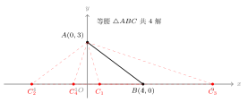
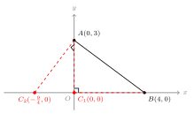
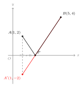
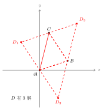

# 坐标几何中的常见模型

## 一、图形特征

一类高频压轴题的结构是这样的：**在坐标系中给出几个定点或一条直线，要求找一个动点（或第四个点），使得某个几何条件成立**（等腰、直角、最短距离、平行四边形等）。

这类问题的本质是"几何 ↔ 代数"的来回翻译（呼应 toolkit/04 转化策略 2）：

- 把"等于某长度""平行""垂直""中点""共线"等**几何条件**翻译为**坐标方程**；
- 列方程、解方程，求出动点坐标；
- **几乎都要分类讨论**——同样的几何条件，往往对应多组解。

掌握模型 = 掌握"翻译表"+"分类清单"。

---

## 二、常用工具汇总

求解坐标几何模型，反复用到下面四件套：

1. **距离公式**（part9/02）：$AB = \sqrt{(x_2-x_1)^2 + (y_2-y_1)^2}$，用来翻译"等于某长度"。
2. **中点公式**（part9/02）：$M = \left(\dfrac{x_1+x_2}{2}, \dfrac{y_1+y_2}{2}\right)$，用来翻译"中点""平分"。
3. **坐标变换表**（part9/01）：对称、平移、旋转——常用于构造对称点（如将军饮马）。
4. **过坐标轴作垂线**（呼应 toolkit/02 E 类辅助线）：把斜线段拆为水平边 + 竖直边，进入勾股定理。

辅以两个基本量化关系：

- 两直线**平行** $\Leftrightarrow$ 斜率相等（竖直线另算）；
- 两直线**垂直** $\Leftrightarrow$ 斜率乘积为 $-1$（竖直与水平线另算）。

---

## 三、关键策略

**第一步：把图形条件翻译为坐标条件。**

| 几何条件 | 坐标翻译 |
|---|---|
| $PA = PB$ | $(x-x_A)^2+(y-y_A)^2 = (x-x_B)^2+(y-y_B)^2$ |
| $M$ 为 $AB$ 中点 | $x_M = \dfrac{x_A+x_B}{2}, \ y_M = \dfrac{y_A+y_B}{2}$ |
| $\angle C = 90°$ | $CA^2 + CB^2 = AB^2$（勾股逆） |
| $AB \parallel CD$ | 斜率相等，或对应坐标差成比例 |

**第二步：动点设参，把未知坐标设成字母。**例如 $x$ 轴上的动点设 $P(t, 0)$。

**第三步：分类讨论。**等腰有 $3$ 种、直角有 $3$ 种、平行四边形有 $3$ 种——每种都列一次方程。

**第四步：解方程，检验是否退化为三点共线**（这种情况构不成三角形，要舍去）。

---

## 四、典型应用

### 例 1（等腰存在性）

已知 $A(0, 3), B(4, 0)$。在 $x$ 轴上找点 $C$，使 $\triangle ABC$ 为等腰三角形。

**思路。** 先算定边 $AB = \sqrt{16+9} = 5$。设 $C(t, 0)$，则

$$CA = \sqrt{t^2 + 9}, \quad CB = |t - 4|.$$

等腰有三种情形，分别列方程：

- **情形 1**：$CA = CB$（顶点是 $C$）。$t^2 + 9 = (t-4)^2 \Rightarrow t^2 + 9 = t^2 - 8t + 16 \Rightarrow 8t = 7 \Rightarrow t = \dfrac{7}{8}$。
- **情形 2**：$CA = AB = 5$（顶点是 $A$）。$t^2 + 9 = 25 \Rightarrow t = \pm 4$。其中 $t = 4$ 与 $B$ 重合舍去，得 $t = -4$。
- **情形 3**：$CB = AB = 5$（顶点是 $B$）。$|t - 4| = 5 \Rightarrow t = 9$ 或 $t = -1$。

共 $4$ 个解：$C_1\left(\dfrac{7}{8}, 0\right), C_2(-4, 0), C_3(9, 0), C_4(-1, 0)$。

### 例 2（直角存在性）

同上 $A(0, 3), B(4, 0)$，在 $x$ 轴上找点 $C(t, 0)$ 使 $\triangle ABC$ 为直角三角形。

**思路。** 直角顶点可能是 $A$、$B$ 或 $C$，分三种情形用**勾股逆定理**列方程：

- **情形 1**：直角在 $C$。$CA^2 + CB^2 = AB^2$，即 $(t^2 + 9) + (t-4)^2 = 25 \Rightarrow 2t^2 - 8t = 0 \Rightarrow t = 0$ 或 $t = 4$。$t = 4$ 与 $B$ 重合舍去，$t = 0$ 时 $C$ 在 $y$ 轴与 $A$ 共纵线？不，$C(0,0)$ 是原点，与 $A(0,3), B(4,0)$ 不共线，合法。
- **情形 2**：直角在 $A$。$AC^2 = AB^2 + BC^2$，即 $t^2 + 9 = 25 + (t-4)^2 \Rightarrow t^2 + 9 = 25 + t^2 - 8t + 16 \Rightarrow 8t = 32 \Rightarrow t = 4$。但 $t = 4$ 即 $C = B$，舍去。换一种翻译：直角在 $A$ 等价于 $\vec{AC} \perp \vec{AB}$。$\vec{AB} = (4, -3), \vec{AC} = (t, -3)$，点乘 $= 4t + 9 = 0 \Rightarrow t = -\dfrac{9}{4}$。
- **情形 3**：直角在 $B$。$\vec{BA} = (-4, 3), \vec{BC} = (t-4, 0)$，点乘 $= -4(t-4) = 0 \Rightarrow t = 4$。又与 $B$ 重合，舍去；故此情形无解（因为 $\vec{BC}$ 在 $x$ 轴上，要垂直 $\vec{BA}$ 需 $\vec{BC} = \vec{0}$）。

共 $2$ 个解：$C_1(0, 0), C_2\left(-\dfrac{9}{4}, 0\right)$。

> 注：用勾股逆列方程时如果出现"舍去"的根，常常说明该情形下三点共线或重合，必须换"垂直 ⇔ 点乘为零"复核。

### 例 3（动点最值：将军饮马 + 坐标）

已知 $A(1, 2), B(5, 4)$ 在 $x$ 轴**同侧**（都在上方），在 $x$ 轴上找点 $P$ 使 $PA + PB$ 最小，并求最小值。

**思路。** 这是 part6/01 + toolkit/03 模型 11 的将军饮马，但用坐标实现：

1. **作对称点**——把 $A$ 关于 $x$ 轴对称得 $A'$。由坐标变换表，$A'(1, -2)$。
2. **连 $A'B$ 交 $x$ 轴于 $P$**——此时 $PA + PB = PA' + PB = A'B$（直线最短）。
3. **用距离公式算最小值**：$A'B = \sqrt{(5-1)^2 + (4-(-2))^2} = \sqrt{16 + 36} = \sqrt{52} = 2\sqrt{13}$。
4. **求 $P$ 坐标**——直线 $A'B$ 的方程：斜率 $k = \dfrac{4-(-2)}{5-1} = \dfrac{3}{2}$，过 $A'(1,-2)$，方程 $y + 2 = \dfrac{3}{2}(x-1)$，即 $y = \dfrac{3}{2}x - \dfrac{7}{2}$。令 $y = 0$ 得 $x = \dfrac{7}{3}$，故 $P\left(\dfrac{7}{3}, 0\right)$。

最小值为 $2\sqrt{13}$。

### 例 4（平行四边形存在性）

已知 $A(0,0), B(3,1), C(1,4)$，求点 $D$ 的坐标使 $A, B, C, D$ 四点构成平行四边形。

**思路。** 平行四边形的核心性质：**对角线互相平分**。但"哪两点是对角线的端点"有 $3$ 种可能，要分类。

设 $D(x, y)$。用中点公式列方程：

- **情形 1**：$AC$ 与 $BD$ 是对角线（即 $ABCD$ 为平行四边形）。$AC$ 中点 $\left(\dfrac{1}{2}, 2\right) = BD$ 中点 $\left(\dfrac{3+x}{2}, \dfrac{1+y}{2}\right) \Rightarrow x = -2, y = 3$。$D_1(-2, 3)$。
- **情形 2**：$AB$ 与 $CD$ 是对角线（即 $ACBD$ 为平行四边形）。$AB$ 中点 $\left(\dfrac{3}{2}, \dfrac{1}{2}\right) = CD$ 中点 $\left(\dfrac{1+x}{2}, \dfrac{4+y}{2}\right) \Rightarrow x = 2, y = -3$。$D_2(2, -3)$。
- **情形 3**：$BC$ 与 $AD$ 是对角线（即 $ABDC$ 为平行四边形）。$BC$ 中点 $(2, \dfrac{5}{2}) = AD$ 中点 $\left(\dfrac{x}{2}, \dfrac{y}{2}\right) \Rightarrow x = 4, y = 5$。$D_3(4, 5)$。

共 $3$ 个解：$D_1(-2, 3), D_2(2, -3), D_3(4, 5)$。

> 一句口诀：**三定点求第四点，平行四边形必有三解**（除非有特殊退化）。

---

## 五、易错点

1. **存在性问题必须分类讨论**——等腰 $3$ 种（哪条边是底），直角 $3$ 种（哪个顶点是直角），平行四边形 $3$ 种（哪两点是对角线端点）。漏一种就丢一组解。
2. **三点共线要舍去**——解方程出根后，验证三点是否共线（共线则不构成三角形/平行四边形）。
3. **数轴距离 vs 平面距离要分清**——在 $x$ 轴上两点距离用 $|x_2 - x_1|$；只要有一点离开 $x$ 轴，就必须用距离公式。
4. **求坐标时容易漏负值**——出现 $t^2 = 16$ 这样的方程时，$t = \pm 4$ 都要写，再检验。
5. **斜率法处理垂直**——形如"直角在 $B$" 而 $\vec{BC}$ 又恰好沿坐标轴时，"$\vec{BA} \cdot \vec{BC} = 0$"比"$BA^2 + BC^2 = AC^2$"更不易漏解。

---

## 六、自测题

1. 已知 $A(-2, 0), B(2, 0)$，在 $y$ 轴上找点 $C$ 使 $\triangle ABC$ 为等边三角形，求 $C$ 的坐标。
   💡 提示：等边即三边相等；$C$ 在 $y$ 轴上，设 $C(0, t)$，$AC = AB = 4$。
2. 已知 $A(0, 4), B(3, 0)$，在直线 $y = x$ 上找点 $P$ 使 $\triangle PAB$ 为等腰三角形（$P$ 为顶点，即 $PA = PB$），求 $P$ 的坐标。
   💡 提示：设 $P(t, t)$，用距离公式列 $PA = PB$ 的方程。
3. 已知 $A(1, 3), B(5, 1)$，在 $x$ 轴上找一点 $P$ 使 $PA + PB$ 最小，求 $P$ 坐标与最小值。
   💡 提示：将军饮马；把 $A$ 关于 $x$ 轴对称，再连 $A'B$ 交 $x$ 轴。
4. 已知 $A(-1, 0), B(0, 2)$，在 $x$ 轴上找点 $C$ 使 $\triangle ABC$ 为直角三角形，求 $C$ 的所有坐标。
   💡 提示：分直角顶点在 $A$、$B$、$C$ 三种情形；用 $\vec{u} \cdot \vec{v} = 0$ 翻译垂直。
5. 已知 $A(1, 2), B(4, 3), C(2, 5)$，求点 $D$ 使 $A, B, C, D$ 构成平行四边形，求 $D$ 的所有坐标。
   💡 提示：分类讨论"哪两点为对角线端点"，对角线互相平分 ⇒ 中点公式列方程，共 $3$ 解。
