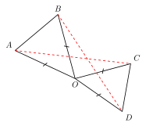
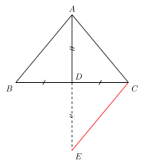
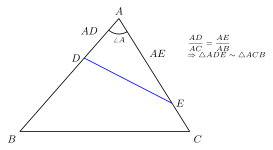
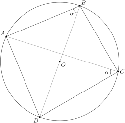
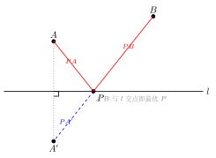
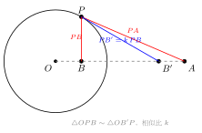
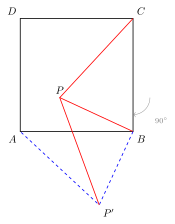

# 模型识别速查

## 一、什么是"模型"

在几何里，**模型**不是某一道题，而是**一个反复出现的图形组合 + 它的固定结论**。比如"两个共顶点的等腰三角形"这种图形一旦出现，几乎必然伴随着"两腰端点连线相等"这个结论——这就是一个模型。

**认出模型 = 把"陌生题"翻译成"我见过的图"。**

初中几何题的"难"，常常不是难在推理本身，而是难在**辨识**：原图被旋转、翻折、缩放、嵌入到更复杂的背景里，使你认不出底层结构。模型识别训练，做的就是练这一双"透视眼"——透过表面的复杂图形，看到下面熟悉的骨架。

本节只做**识别速查**：列特征、列结论、列关键词。每个模型为什么成立、如何证明，留到对应章节细讲。这里先求"看一眼就反应过来"。

## 二、必背模型清单（14 个）

按类型分组。每个模型给出三行：**特征**（图形长什么样）、**结论**（看到后能立刻写出什么）、**关键词**（题目里常见的提示语）。

### 全等类模型

#### 1. 手拉手模型
- **特征**：两个共顶点的等腰三角形（顶角相等）
- **结论**：两腰端点连线相等；旋转角 = 顶角
- **关键词**：共顶点等腰、共顶点等边、共顶点等腰直角



#### 2. 一线三等角（K 字模型）
- **特征**：一条直线上出现三个相等的角（常见为三个直角，即"K 字"）
- **结论**：直线两侧的两个三角形相似（特殊条件下全等）
- **关键词**：三个直角共线、三个 60° 共线、矩形/正方形边上的折叠


#### 3. 半角模型
- **特征**：正方形或等腰直角三角形 + 顶点处一个等于半顶角的角（如正方形里的 45° 角）
- **结论**：通过旋转，把分散的两段折合为一段；常配合手拉手
- **关键词**：正方形内 45°、等腰直角内顶角的一半、绕顶点旋转


#### 4. 倍长中线
- **特征**：题目中出现**中线**或**中点**，但条件零散
- **结论**：延长中线一倍，构造一对全等三角形，把两段分散条件平移到一起
- **关键词**：中线、中点、连接中点延长一倍



#### 5. 角平分线 + 垂线
- **特征**：角平分线上一点向角的两边作垂线（或题目暗示对称）
- **结论**：构造两个全等的直角三角形；两垂线段相等
- **关键词**：角平分线、点到两边距离、对称


### 相似类模型

#### 6. A 字 / X 字 / 8 字模型
- **特征**：两条平行线被两条直线所截，形成"A"形或"X"形（也叫"8 字"）
- **结论**：对应三角形相似，对应边成比例
- **关键词**：平行、DE ∥ BC、中位线


#### 7. 母子相似（射影定理）
- **特征**：直角三角形斜边上的高
- **结论**：三个直角三角形两两相似；$h^2 = pq$，$a^2 = pc$，$b^2 = qc$（其中 $p, q$ 为斜边被分成的两段，$c$ 为斜边）
- **关键词**：直角三角形、斜边上的高、射影


#### 8. 共角共边相似
- **特征**：两个三角形共用一个角，且夹这个角的两边对应成比例
- **结论**：两三角形相似（SAS 相似）
- **关键词**：公共角、比例线段、$\frac{AB}{AD} = \frac{AC}{AE}$



### 圆类模型

#### 9. 四点共圆
- **特征**：① 对角互补的四边形；② 直角对斜边的两个端点；③ 同侧两个等角对同一条线段
- **结论**：四点共圆 → 可使用圆周角定理（同弧所对圆周角相等、直径所对圆周角为直角等）
- **关键词**：对角互补、共斜边的直角、同侧等角



#### 10. 切割线模型
- **特征**：从圆外一点引一条切线和一条割线
- **结论**：切线长的平方 = 割线两段的乘积，$PT^2 = PA \cdot PB$
- **关键词**：切线、割线、圆外一点


### 变换类模型

#### 11. 将军饮马（最值）
- **特征**：一条定直线 + 两个定点，求到两定点距离之和最小
- **结论**：作其中一点关于直线的对称点，与另一点连线，交点即最优位置
- **关键词**：河边饮马、动点在直线上、最短路径



#### 12. 胡不归 / 阿氏圆（最值进阶）
- **特征**：带系数的距离和，如求 $PA + k \cdot PB$ 的最小值（$0 < k < 1$）
- **结论**：构造相似三角形，把系数 $k$ "转化"为一段实际线段，化归为将军饮马式的折线最短
- **关键词**：带系数的距离和、$\frac{1}{2} PB$、阿波罗尼斯圆



#### 13. 翻折模型
- **特征**：折叠题（沿某直线翻折）
- **结论**：折痕是对称轴；对应边、对应角相等；折痕 ⊥ 对应点连线，且平分该连线
- **关键词**：折叠、翻折、对折、重合


#### 14. 旋转构造模型
- **特征**：题中出现 60°、90°、120° 等特殊角，或等边、等腰直角三角形
- **结论**：绕特殊点旋转对应角度，把分散的条件集中到一个三角形里
- **关键词**：等边三角形、等腰直角、60°、90°、120°、条件分散



## 三、识别口诀

```
见中点，倍长或中位
见角平分，垂线或翻折
见等腰，三线合一
见 60°，等边来配
见直角，斜中或勾股
见圆心，半径垂径切线
见折叠，对称等量
见动点，将军或阿氏
见两等腰共顶点，手拉手转一转
见三等角一线连，K 字相似别忘看
```

把这十句背下来，遇题先在脑子里过一遍——多半能命中其中一两条。

## 四、用法说明

- **这张表是"反射弧训练用"**：刚学的时候，做每一道几何题都强制对照一遍，反复回查；熟练之后，识别会自动内化成本能，不需要查表。
- **看到一道题先问自己**：图里有没有上面 14 个模型的影子？哪怕只是局部的影子，也值得顺着它试一试。
- **一道难题往往是 2~3 个模型的复合**。例如："正方形内 45° 角" = 半角模型 + 旋转构造；"折叠后求最值" = 翻折模型 + 将军饮马。识别出多个模型并把它们串起来，是中考压轴题的常见破解路径。
- 不要追求"穷尽所有模型"。这 14 个是中考几何 90% 以上场景的核心骨架；先把这些练成肌肉记忆，再去补冷门变种，性价比最高。
