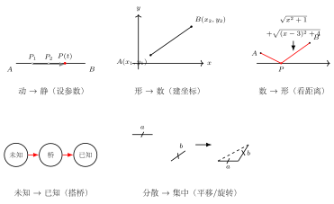
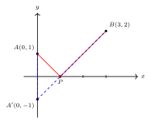

# 转化思想

## 一、为什么需要转化

题目给的条件，往往不能直接拿来用。它们可能是动态的、分散的、用代数语言写出的，或者干脆只是结论而没有桥梁——总之，"题目给的"和"我会做的"之间，常常隔着一道沟。

**解题的本质，就是不停地架桥**：把陌生的化为熟悉的，把分散的拼成集中的，把难处理的换成易处理的。这种"换一种形式来看"的能力，就是**转化思想**。

转化思想贯穿初中几何始终：辅助线是转化，坐标法是转化，相似搭桥是转化，对称变换也是转化。你可以不记任何具体技巧，但必须养成一个习惯——**卡住时，先问自己：能不能把它换种形式？**

## 二、五类核心转化



### 1. 动 → 静

- **场景**：动点题、动线题、图形运动题
- **方法**：抓住"运动的某一个瞬间"，把动点用参数（如 $t$）表示，把运动过程冻结成一个静态的代数问题；或者直接分析"运动的极端位置"（起点、终点、临界点）
- **举例**：动点 $P$ 在线段 $AB$ 上运动，求 $\triangle CPD$ 面积最大时 $P$ 的位置。设 $AP = t$，用 $t$ 表示面积 $S(t)$，再对 $S(t)$ 求最值——动点问题就变成了普通的函数最值问题

### 2. 形 → 数

- **场景**：坐标系中的几何题，或者图形关系复杂、直接推理困难的题
- **方法**：把图形条件翻译成坐标关系——距离用距离公式，垂直用斜率乘积为 $-1$，对称用中点公式，共线用斜率相等
- **举例**：求满足某种条件的三角形顶点的轨迹。设动点坐标为 $(x, y)$，把几何条件全部写成关于 $x, y$ 的方程，几何题就化为代数题

### 3. 数 → 形

- **场景**：表面是纯代数题，但代数式里藏着几何意义（特别是含根号的式子）
- **方法**：把代数式翻译成图形语言。$\sqrt{(x_1-x_2)^2+(y_1-y_2)^2}$ 看成距离，$\dfrac{y_2-y_1}{x_2-x_1}$ 看成斜率，$ax+by$ 看成线性表达式的图像截距
- **举例**：求 $\sqrt{x^2 + 4} + \sqrt{(8-x)^2 + 9}$ 的最小值。把它看成两段距离之和，用**将军饮马**模型一击解决——比硬算导数干净得多

### 4. 未知 → 已知

- **场景**：要证或要求的量，没有任何条件直接落在它身上
- **方法**：在未知和已知之间找一座"桥"——通过全等、相似、等量代换、中间线段把它们连起来
- **举例**：要证 $AB = CD$，但 $AB$ 和 $CD$ 不在同一个三角形里、也找不到直接的全等。这时找一条中间线段 $EF$，证 $AB = EF$ 且 $EF = CD$，由传递性即得结论。$EF$ 就是那座桥

### 5. 分散 → 集中

- **场景**：题目给的条件散落在图形的不同部位，互相之间没有发生关系
- **方法**：通过辅助线、旋转、平移、翻折，把分散的条件强行拼到一起，让它们处在同一个三角形、同一条直线或同一个圆里
- **举例**：两段已知线段不在同一直线上，且和差关系难以直接看出。把其中一段绕端点旋转，使两段共线，问题就化成了一段总长度——这就是常见的"旋转拼接"

## 三、转化的总思路图

```
卡住了 → 检查：我能不能把这个东西换种形式？
  ├── 是动的吗？ → 动→静
  ├── 是图形吗？  → 形→数 或 用坐标
  ├── 是代数式吗？→ 数→形
  ├── 是未知量吗？→ 未知→已知（搭桥）
  └── 是分散的吗？→ 分散→集中（辅助线/变换）
```

把这张图刻进脑子里。每次卡壳，按这五条逐一过一遍，绝大多数题目都能找到突破口。

## 四、一个完整的转化演示

**题目**：求 $\sqrt{x^2+1} + \sqrt{(x-3)^2 + 4}$ 的最小值。



**内心独白**：

- **第一反应**：这是个纯代数式。求导？初中没学；配方？两个根号配不动。卡住了
- **应用"数→形"**：仔细看这两个根号——$\sqrt{x^2+1} = \sqrt{(x-0)^2 + (0-1)^2}$，正是点 $(x, 0)$ 到 $(0, 1)$ 的距离；$\sqrt{(x-3)^2+4} = \sqrt{(x-3)^2 + (0-2)^2}$，是点 $(x, 0)$ 到 $(3, 2)$ 的距离
- **重新表述**：原式 = $x$ 轴上一动点 $P(x, 0)$ 到定点 $A(0, 1)$ 与定点 $B(3, 2)$ 的距离之和
- **识别模型**：动点在 $x$ 轴上，两定点 $A, B$ 都在 $x$ 轴上方（同侧）——这正是**将军饮马**
- **应用"将军饮马"**：作 $A(0, 1)$ 关于 $x$ 轴的对称点 $A'(0, -1)$，则 $PA + PB = PA' + PB \ge A'B$
- **算结果**：$A'B = \sqrt{(3-0)^2 + (2-(-1))^2} = \sqrt{9 + 9} = 3\sqrt{2}$

**最小值为 $3\sqrt{2}$**。

回头看，整个解题过程用了一次"数→形"（把代数式翻译成距离）和一次"未知→已知"（把求和最小问题对接到已知的将军饮马模型）。一旦完成转化，剩下的只是套模板。

## 五、练习建议

- **做完一道题，立刻复盘**：问自己——这道题我用了哪一类转化？是动→静？数→形？还是搭桥？
- **拒绝"凭直觉"**：如果你发现自己稀里糊涂做出来了，强迫自己事后用上面 5 类去归类。归不进去，说明你还没看清这道题的真正结构
- **建立"转化清单"**：每周整理一次，看自己哪一类用得多、哪一类几乎没用过——没用过的那一类，往往就是下一次卡题的原因
- **长期训练的效果**：转化会从"刻意操作"逐渐变成"本能反应"。看到根号就想到距离，看到动点就想到参数，看到分散条件就想伸手画辅助线——到这一步，几何就真正变成你的工具，而不是你的敌人
