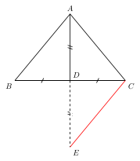

# 倍长中线模型

> **一图速记**：题目出现**中线（或中点）**时，**延长该中线一倍**构造全等三角形，把分散在"两边一中线"上的条件集中到一个三角形里。本质是中点的中心对称。

## 一、引入：一道让你卡住的题

> **题目**：在 $\triangle ABC$ 中，$D$ 是 $BC$ 的中点，$AB = 5$，$AC = 7$。求中线 $AD$ 的取值范围。

请先停下来，自己动笔试一分钟。

大多数读者会卡在这里：**"求线段的取值范围"，脑子里第一反应是用"三角形三边关系"（任意两边之和大于第三边）；但 $AD$ 既不是 $\triangle ABC$ 的边，也不是任何明摆着的三角形的边——$AB, AC, AD$ 三段"散"在不同位置，定理用不上**。

这一卡，就是倍长中线模型存在的全部意义。

## 二、思维路径还原（解题者的内心独白）

下面是一个"会做这道题的人"脑子里真正在跑的念头：

> "题目里有'$D$ 是 $BC$ 中点'——按思维工具箱 01 的信号 1：**见中点 → 试中线倍长 / 中位线 / 中点四边形**。
>
> 这里只有一个中点 $D$，图中没有别的中点能配出中位线；中点四边形要四个中点，更用不上。**剩下唯一可试的就是"倍长中线"**。
>
> 怎么倍长？延长 $AD$ 到 $E$，使 $DE = AD$，连 $CE$。
>
> 现在我得到一个新的 $\triangle ECD$。它和原来的 $\triangle ABD$ 有什么关系？逐条看：
>
> - $BD = CD$（$D$ 是 $BC$ 中点，题目给的）；
> - $\angle ADB = \angle EDC$（**对顶角**，呼应 part2/01）；
> - $AD = ED$（我构造的时候定的）。
>
> 三组条件：边-夹角-边。**SAS！$\triangle ABD \cong \triangle ECD$**。
>
> 一旦全等，对应边相等：$CE = AB = 5$。
>
> 这一步是关键——我把 $AB$ "搬"到了 $CE$ 的位置。**原来 $AB, AC, AD$ 三段散在不同位置，现在 $\triangle ACE$ 里同时拥有了 $AC = 7$、$CE = 5$、$AE = 2AD$**。三段同框！
>
> 进了同一个三角形，三边关系（part3/basics/01）就能用了：
>
> $$|AC - CE| < AE < AC + CE$$
>
> 即 $|7 - 5| < 2AD < 7 + 5$，也就是 $2 < 2AD < 12$，所以 $1 < AD < 6$。
>
> 答：$1 < AD < 6$。"

把这段内心独白读三遍。你会发现**真正难的不是写证明，而是**：

1. 看到"中点"立刻反射出"倍长"这个动作（信号 1）；
2. 知道倍长以后要去找的全等是 $\triangle ABD \cong \triangle ECD$（夹角是**对顶角**自动相等）；
3. 全等的真正用途是**把散落的边"搬"进同一个三角形**，再用三边关系。

## 三、抽象成模型

把上面这道具体题的"骨架"抽出来，就是**倍长中线模型**。

**图形特征**（识别条件）：

- 三角形里有一条**中线** $AD$（$D$ 是 $BC$ 中点）；
- 题目涉及 $AD$ 的长度 / 取值范围，或涉及"两边 + 中线"的混合关系，或要证含中线的两段相等。

**操作**：

- 延长 $AD$ 到 $E$，使 $DE = AD$；
- 连 $CE$（也可改连 $BE$，效果对称）。

**核心结论**（看到上述特征就立刻有）：

- $\triangle ABD \cong \triangle ECD$（**SAS**：$BD = CD$、对顶角 $\angle ADB = \angle EDC$、$AD = ED$）；
- 对应边：$CE = AB$；对应角：$\angle B = \angle DCE$，从而 $AB \parallel CE$（内错角相等，呼应 part2/04）；
- 等价表述：四边形 $ABEC$ 是**平行四边形**——$D$ 是其对角线交点，所以 $AE$、$BC$ 互相平分。

**为什么叫"倍长中线"**：把中线 $AD$ 翻倍延长到 $E$，$D$ 成为 $AE$ 的中点；同时 $D$ 又是 $BC$ 的中点——两条线段在 $D$ 互相平分，这正是平行四边形的定义。

**本质**：倍长中线 $=$ **以 $D$ 为中心作中心对称**。$\triangle ABD$ 绕 $D$ 旋转 $180°$ 就重合到 $\triangle ECD$ 上。中心对称当然保长度、保夹角，全等自动成立。

**证明骨架（一句话版）**：构造 $DE = AD$，由对顶角 + $BD = CD$ + $AD = ED$ 套 SAS，得 $\triangle ABD \cong \triangle ECD$，从而 $CE = AB$、$AB \parallel CE$。

## 四、模型变形

倍长中线在中考里常以下面这些**变形**面孔出现：

- **变形 1（倍长任意"中点连线"）**：题目里只要出现"$X$ 是某段中点"，不一定是中线，也可以考虑倍长 $X$ 所连的某段线段。例如 $D$ 是 $BC$ 中点，$DE$ 是某条与 $D$ 有关的连线 —— 把 $DE$ 倍长到 $F$（$DF = DE$），同样能凑出全等。
- **变形 2（连另一端）**：本节正文倍长 $AD$ 后连 $CE$；也可以连 $BE$，得到 $\triangle ACD \cong \triangle EBD$，对应边变为 $BE = AC$。两种连法选哪种？哪段已知就把哪段"搬"成对应边。
- **变形 3（与中位线定理"打包"）**：倍长中线一次后，新构造里出现的 $AE = 2AD$ 和"$D$ 同时是 $AE, BC$ 中点"——这恰好就是中位线定理"中点连线 $=$ 第三边一半"的等价表达。**两种模型本是一物**。
- **变形 4（用途归纳）**：
  1. **求中线长度范围**（如本节引入题）；
  2. **证两段线段相等**——把分散在两边的两段"搬"到同一三角形里；
  3. **集中条件**——把"两边 + 中线"的三段散乱条件集中到一个三角形里再用勾股、三边关系等定理。

- **本质**：倍长中线 $=$ **中心对称构造全等** $=$ **构造平行四边形**。三种说法等价，看到哪一种描述都应想到其余两种。

## 五、思考路标（看到 X → 想到 Y）

把下面每一条都嚼到肌肉记忆：

- 看到**中线（或中点）+ 题目要求或要证涉及该中线** → **倍长中线**；
- 看到**中点 + 三角形两边 + 一条中线**，求中线范围 → 倍长后用三边关系；
- 看到**中点 + 要证两段线段相等**，但两段**不在同一三角形** → 倍长中线制造全等，把两段"挪近"到一个三角形里；
- 看到**中点 + 已知中线长 + 求边长** → 倍长 + 全等 + 勾股 / 三边关系；
- 倍长中线 $=$ **中点的中心对称** $=$ **构造平行四边形**——三种视角随便切换；
- "倍长"不只用于严格意义的中线，**任何"中点连线"都可倍长**；
- 倍长后构造的全等的关键夹角永远是**对顶角**，自动相等，不用证；
- 倍长方向：延长该中线**经过中点**到对侧——别延长错了端点。

## 六、应用例题

下面三例只演示"**怎么用路标识别 + 怎么把模型套上去**"，请你照着把证明补完。

**例 1（求中线范围，同引入题）**：$\triangle ABC$ 中 $D$ 是 $BC$ 中点，$AB = 5$，$AC = 7$。求中线 $AD$ 的范围。

> **路标触发**："中点 + 要中线范围" → 倍长中线。**思路**：延长 $AD$ 到 $E$，$DE = AD$，连 $CE$；SAS 得 $\triangle ABD \cong \triangle ECD$，$CE = AB = 5$；在 $\triangle ACE$ 中三边关系 $|7-5| < 2AD < 7+5$，得 $1 < AD < 6$。

**例 2（证两段相等）**：$\triangle ABC$ 中 $D$ 是 $BC$ 中点，$E$ 在 $AB$ 上，过 $E$ 作 $EF \parallel AC$ 交 $CD$ 的延长线于 $F$。求证：$CE = AF$。

> **路标触发**："中点 + 要证两段线段相等，且两段不在同一三角形" → 倍长中线类的全等。**思路**：注意 $D$ 是 $BC$ 中点，且 $EF \parallel AC$，可看出 $CD$ 的延长方向 $F$ 处与 $\triangle DCA$ 形成"倍长 $CD$ 至 $F$"的结构。利用 $D$ 是 $BC$ 中点 + $EF \parallel AC$ 推 $\angle F = \angle DCA$（内错角）、$\angle BDF = \angle CDA$（对顶角），配合 $BD = CD$，AAS 得 $\triangle BDF \cong \triangle CDA$（或类似的对照），从而 $BF = CA$、$DF = DA$。再在 $\triangle BEF$ 与 $\triangle ?$ 中或用平行四边形性质（$AECF$ 或 $AEFC$ 为平行四边形）推出 $CE = AF$。**核心还是利用中点把两个不相邻的三角形拉成全等。**

**例 3（已知中线长求边）**：$\triangle ABC$ 中 $D$ 是 $BC$ 中点，$AD = 4$，$AB = 6$，且 $AD \perp AB$。求 $AC$。

> **路标触发**："中点 + 已知中线长 + 边长 + 垂直" → 倍长中线 + 全等 + 勾股。**思路**：延长 $AD$ 到 $E$，$DE = AD = 4$，连 $CE$；SAS 得 $\triangle ABD \cong \triangle ECD$，故 $CE = AB = 6$，且 $\angle E = \angle BAD = 90°$（由全等的对应角；也可由 $AB \parallel CE$ + $AD \perp AB$ 推出 $AE \perp CE$）。这时 $\triangle AEC$ 是直角三角形，$AE = 2AD = 8$，$CE = 6$，由勾股 $AC = \sqrt{AE^2 + CE^2} = \sqrt{64 + 36} = 10$。

## 七、思路自测题

做下面四题，做之前先在脑中默念一遍第五节的路标。

**自测 1（识别"中点信号"）**：$\triangle ABC$ 中，$M$ 是 $AB$ 的中点，$N$ 是 $AC$ 上一点。题目要你证"某段线段 $=$ $BN$ 的一半"。**问你不必给出完整证明，只回答**：你看到"$M$ 是 $AB$ 中点"这一信号时，应当立刻在脑中过哪三个候选动作？最该试哪一个？

> 💡 提示：信号 1 触发三个候选——**倍长中线 / 中位线 / 中点四边形**。题目只有一个中点（$M$），且没有第二个中点可与 $M$ 配中位线 → 优先试**倍长中线类构造**（倍长某条经过 $M$ 的连线，例如倍长 $MN$ 或倍长 $CM$）。这就是"识别 + 取舍"的训练。

**自测 2（求中线范围的变式）**：$\triangle ABC$ 中 $D$ 是 $BC$ 中点，$AB = 8$，$AC = 6$，$AD = x$。求 $x$ 的范围。

> 💡 提示：直接套引入题方法。倍长 $AD$ 至 $E$，$CE = AB = 8$；$\triangle ACE$ 中 $|8-6| < 2x < 8+6$，得 $1 < x < 7$。

**自测 3（证两段相等）**：$\triangle ABC$ 中 $D$ 是 $BC$ 中点，$AD$ 平分 $\angle BAC$。求证：$AB = AC$。

> 💡 提示：倍长 $AD$ 至 $E$，$\triangle ABD \cong \triangle ECD$（SAS）得 $AB = CE$、$\angle BAD = \angle CED$；而 $AD$ 平分 $\angle BAC$，故 $\angle BAD = \angle CAD$，从而 $\angle CED = \angle CAD$，$\triangle ACE$ 中两角相等推出 $CA = CE$（等角对等边）。由 $CE = AB$ 立得 $AB = AC$。

**自测 4（已知中线长 + 勾股）**：$\triangle ABC$ 中 $D$ 是 $BC$ 中点，$AB = 13$，$AC = 5$，$BC = 12$。求中线 $AD$ 的长度。

> 💡 提示：倍长 $AD$ 至 $E$，$CE = AB = 13$，$BE = AC = 5$ 或者说 $ABEC$ 是平行四边形——直接用中线长公式 $AD^2 = \frac{2AB^2 + 2AC^2 - BC^2}{4}$，亦可从倍长后的 $\triangle ACE$ 出发用余弦定理 / 勾股。本题恰好 $5^2 + 12^2 = 13^2$，$\angle ACB = 90°$。注意 $\angle ACE = \angle ACB + \angle BCE = 90° + \angle B$（由 $\triangle ABD \cong \triangle ECD$，$\angle B = \angle DCE$）。代入计算 $AD$。

---

**回头看一眼"一图速记"**：

> 题目出现中线（或中点）时，延长该中线一倍构造全等三角形，把分散在"两边一中线"上的条件集中到一个三角形里。本质是中点的中心对称。

如果现在你脑中能秒回这句话，并且能立刻在脑中画出"延长 $AD$ 到 $E$、$\triangle ABD \cong \triangle ECD$（SAS）"的三步——那么倍长中线模型，你拿下了。
