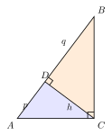

# 母子相似与射影定理

> **一图速记**：直角三角形斜边上的高，把它分成两个小直角三角形——这两个小三角形与原三角形彼此相似（母子相似），并由此得到**射影定理** $h^2 = pq$、$b^2 = pc$、$a^2 = qc$。

---

## 一、引入

直角 $\triangle ABC$，$\angle C = 90°$。$CD \perp AB$ 于 $D$。设 $AD = p$、$BD = q$、$CD = h$、$BC = a$、$CA = b$、$AB = c$。

我们要证明：
$$\triangle ACD \sim \triangle CBD \sim \triangle ABC$$

并由此推出**射影定理**：
$$h^2 = pq,\qquad b^2 = pc,\qquad a^2 = qc.$$

这是初中相似三角形里**最经典的"一图三相似"结构**，也是勾股定理的另一条证明路径，更是高中圆幂定理、解析几何中"几何平均"思想的源头。请务必把这张图刻在脑子里：**直角三角形 + 斜边上的高 = 母子相似**。

---

## 二、思维路径还原

> "原 $\triangle ABC$ 直角在 $C$，斜边上的高 $CD$ 把它分成两个小直角三角形 $\triangle ACD$、$\triangle CBD$。
>
> 先看 $\triangle ACD$ 与 $\triangle ABC$：$\angle ADC = 90° = \angle ACB$（两个都是直角），且共享锐角 $\angle A$。两组角相等 → **AA → 相似**。注意对应：$\triangle ACD \sim \triangle ABC$ 表示 $A \leftrightarrow A$、$C \leftrightarrow B$、$D \leftrightarrow C$。
>
> 同理 $\triangle CBD$ 与 $\triangle ABC$：都有直角，且共享锐角 $\angle B$。$\triangle CBD \sim \triangle ABC$，对应关系为 $C \leftrightarrow A$、$B \leftrightarrow B$、$D \leftrightarrow C$。
>
> 既然两小都与大相似 → 两小彼此也相似（相似的传递）→ $\triangle ACD \sim \triangle CBD$。
>
> 三相似 → 三组比例 → 三个等式：
>
> 由 $\triangle ACD \sim \triangle ABC$：$\frac{AC}{AB} = \frac{AD}{AC}$ → $AC^2 = AD \cdot AB$ → **$b^2 = pc$**
>
> 由 $\triangle CBD \sim \triangle ABC$：$\frac{BC}{AB} = \frac{BD}{BC}$ → $BC^2 = BD \cdot AB$ → **$a^2 = qc$**
>
> 由 $\triangle ACD \sim \triangle CBD$：$\frac{CD}{BD} = \frac{AD}{CD}$ → $CD^2 = AD \cdot BD$ → **$h^2 = pq$**
>
> 这三条等式合称**射影定理**，本质上是'直角边/斜边上的高'在直角三角形里满足的几何平均关系。"

这段内心独白的核心在于：**先识别共直角 + 共锐角 → AA 相似 → 写比例 → 交叉相乘**。整套动作环环相扣，没有任何花哨技巧，全凭对"相似"和"对应边"的稳准识别。

---

## 三、抽象成模型

- **图形特征**：直角三角形 $\triangle ABC$（$\angle C = 90°$） + 斜边 $AB$ 上的高 $CD$
- **三相似**：$\triangle ACD \sim \triangle CBD \sim \triangle ABC$
- **射影定理三式**：
  - $b^2 = pc$（一条直角边的平方 = 它在斜边上的射影 × 斜边）
  - $a^2 = qc$（同上，另一条直角边）
  - $h^2 = pq$（斜边上高的平方 = 高把斜边分成的两段之积）
- **几何平均解读**：
  - $h$ 是 $p$ 与 $q$ 的几何平均：$h = \sqrt{pq}$
  - $b$ 是 $p$ 与 $c$ 的几何平均：$b = \sqrt{pc}$
  - $a$ 是 $q$ 与 $c$ 的几何平均：$a = \sqrt{qc}$
- **推论（勾股定理的射影证明）**：
$$b^2 + a^2 = pc + qc = (p+q)c = c \cdot c = c^2.$$
  这正是**勾股定理**！射影定理给出了勾股定理的一种极其优雅的证明——只用相似，不用面积拼接。

---

## 四、模型变形

- **任意角变直角**：在一般三角形里作高，让局部出现直角三角形 → 局部立刻可用母子相似。常见于"在锐角三角形 $ABC$ 中作高 $AD$ 后求线段长度"一类题目。
- **嵌入圆中**：直径所对的圆周角是直角（part5 圆周角定理的推论）。半圆上任取一点 $C$，向直径作垂线 $CD$，立刻构成母子相似 → $CD^2 = AD \cdot DB$。这是**圆幂定理（相交弦定理）**的雏形。
- **钝角三角形中的高**：若三角形为钝角三角形，斜边上的高可能落在斜边的延长线上，"射影"取有向值时方向相反，但**平方关系仍成立**，公式形式不变。
- **解析几何里的几何平均**：圆锥曲线的某些性质（如抛物线焦半径、椭圆准线性质）都暗藏 $h^2 = pq$ 这种"几何平均"结构，本模型是后续学习的种子。

---

## 五、思考路标

- 看到**直角三角形 + 斜边上的高** → 立刻调出射影定理三公式，不必重新推导。
- 求 $h$、$p$、$q$ 中任意一个 → 用 $h^2 = pq$。
- 求直角边 $a$ 或 $b$ → 用 $a^2 = qc$ 或 $b^2 = pc$。
- 看到圆中出现 **直径 + 圆周角 + 垂线** 三件套 → 立即想到母子相似与射影定理。
- 题目中只要出现"$h = \sqrt{pq}$"或"某线段是另外两条线段的比例中项" → 几乎一定是母子相似背景。
- 找不到突破口时：**作高**（向斜边、向某一边作垂线）是制造母子相似的标准动作。

---

## 六、应用例题

### 例 1（基础代入）
已知直角 $\triangle ABC$ 中 $\angle C = 90°$，$CD \perp AB$ 于 $D$，$AD = p = 4$，$BD = q = 9$。求 $h$、$a$、$b$、$c$。

**【思路】** 直接套射影定理三式：
- $h = \sqrt{pq} = \sqrt{4 \cdot 9} = 6$
- $c = p + q = 13$
- $b = \sqrt{pc} = \sqrt{4 \cdot 13} = 2\sqrt{13}$
- $a = \sqrt{qc} = \sqrt{9 \cdot 13} = 3\sqrt{13}$

**验证**：$a^2 + b^2 = 117 + 52 = 169 = c^2$ ✓ 勾股定理成立。

### 例 2（用射影定理证明勾股定理）
设 $\angle C = 90°$，$CD \perp AB$ 于 $D$，$AD = p$、$BD = q$。证明 $a^2 + b^2 = c^2$。

**【思路】** 由母子相似得
$$b^2 = pc,\qquad a^2 = qc.$$
两式相加：
$$a^2 + b^2 = (p+q)c = c \cdot c = c^2. \qquad\blacksquare$$
整个证明只用**两次相似 + 一次加法**，是中学几何里最干净的勾股证明之一。

### 例 3（圆中应用）
圆 $O$ 的直径 $AB = 10$，$C$ 是圆上一点，$CD \perp AB$ 于 $D$，$AD = 2$。求 $CD$。

**【思路】** $\angle ACB$ 是直径 $AB$ 所对的圆周角，所以 $\angle ACB = 90°$。于是 $\triangle ACB$ 是直角三角形，$CD$ 是斜边 $AB$ 上的高，立刻构成母子相似。

由射影定理 $CD^2 = AD \cdot DB$，其中 $DB = AB - AD = 10 - 2 = 8$，故
$$CD^2 = 2 \cdot 8 = 16 \Rightarrow CD = 4.$$

这一例题已经触摸到**相交弦定理**的影子：弦 $CC'$（$C'$ 为 $C$ 关于 $AB$ 的对称点）与直径 $AB$ 在 $D$ 相交，满足 $DA \cdot DB = DC \cdot DC'$。

---

## 七、思路自测题

**自测 1**：直角 $\triangle ABC$ 中 $\angle C = 90°$，$CD \perp AB$ 于 $D$。若 $AC = 6$、$AB = 9$，求 $AD$ 与 $CD$。

> 💡 提示：用 $b^2 = pc$ 先求 $AD$，再用 $h^2 = pq$ 或勾股定理求 $CD$。

**自测 2**：直角 $\triangle ABC$ 中 $\angle C = 90°$，$CD \perp AB$ 于 $D$，$CD = 12$，$AD : BD = 9 : 16$。求 $AB$。

> 💡 提示：设 $AD = 9k$、$BD = 16k$，由 $h^2 = pq$ 列出关于 $k$ 的方程，再求 $AB = AD + BD$。

**自测 3**：在圆 $O$ 中，$AB$ 为直径，$P$ 是圆上一点，$PH \perp AB$ 于 $H$，且 $AH = 4$、$HB = 9$。求弦 $PA$、$PB$、$PH$ 的长。

> 💡 提示：$\angle APB = 90°$（直径所对圆周角），整张图就是标准的母子相似图；直接套三式。

**自测 4**：在 $\triangle ABC$ 中，$\angle BAC = 90°$，$AD \perp BC$ 于 $D$，$E$ 是 $AD$ 上一点，$BE$ 交 $AC$ 于 $F$。证明 $AB^2 = BD \cdot BC$，并由此说明 $AB$ 是 $BD$ 与 $BC$ 的几何平均。

> 💡 提示：直接对原直角三角形 $\triangle ABC$ 与斜边上的高 $AD$ 用射影定理（$AB^2 = BD \cdot BC$ 即 $a^2 = qc$ 的另一种字母版本）。
