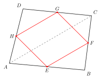
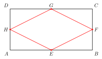

# 中点四边形模型

> **一图速记**：任意四边形四边中点依次连接，构成的"中点四边形"**必是平行四边形**。原四边形特殊（矩形/菱形/正方形/等腰梯形）→ 中点四边形也变成相应的特殊平行四边形，**形态由原四边形的对角线性质决定**。

## 一、引入：一道让你"以为很简单"的题

> **题目**：任意四边形 $ABCD$，$E, F, G, H$ 分别是 $AB, BC, CD, DA$ 的中点。
> （1）证明：$EFGH$ 是平行四边形；
> （2）如果原四边形 $ABCD$ 是矩形，$EFGH$ 是什么图形？
> （3）如果原四边形 $ABCD$ 是菱形，$EFGH$ 又是什么图形？
> （4）如果原四边形 $ABCD$ 是正方形呢？

请先停下来，自己画图试一两分钟。

很多同学一看题就懵：四个中点连成的四边形，**看上去和原四边形完全没关系**，凭什么就一定是平行四边形？更奇怪的是——原来是矩形/菱形/正方形，中点四边形竟然会"变换形态"。**到底是什么决定了它的形态？**

这一题，就是中点四边形模型存在的全部意义。

## 二、思维路径还原（解题者的内心独白）

下面这段内心独白，请逐行慢读，体会**每一步念头是怎么自然冒出来的**：

> "看到 $EFGH$ 要证平行四边形——首选判定哪条？**'一组对边平行且相等'**最省力（只要找一对就行），其他判定都要找两对。锁定这条路。
>
> 那就挑一对对边，比如 $EF$ 和 $HG$，看看它们能不能同时'平行且相等'。
>
> 先看 $EF$：$E$ 是 $AB$ 中点，$F$ 是 $BC$ 中点—— **两个中点摆在一起，本能反应是'三角形中位线'**（part4/07 中位线定理）。$E, F$ 是哪个三角形的两边中点？$\triangle ABC$！于是 $EF$ 就是 $\triangle ABC$ 的中位线，结论立刻有：$EF \parallel AC$ 且 $EF = \frac{1}{2}AC$。
>
> 再看 $HG$：$H$ 是 $DA$ 中点，$G$ 是 $DC$ 中点—— 同样是'两中点'信号。它们是 $\triangle ACD$ 两边的中点，所以 $HG$ 是 $\triangle ACD$ 的中位线：$HG \parallel AC$ 且 $HG = \frac{1}{2}AC$。
>
> 把两组结论合起来：$EF \parallel AC \parallel HG$（都和同一条 $AC$ 平行 → 互相平行），$EF = \frac{1}{2}AC = HG$（都等于 $AC$ 一半 → 互相相等）。**一组对边平行且相等 → $EFGH$ 是平行四边形！** 第（1）问搞定。
>
> 这里关键的'桥梁'是**对角线 $AC$**：它同时是 $\triangle ABC$ 和 $\triangle ACD$ 的一条边，所以两次中位线推导能"借同一条对角线"互相沟通。如果再用另一条对角线 $BD$ 走一遍，会得到 $EH \parallel BD \parallel FG$、$EH = FG = \frac{1}{2}BD$。也就是说，**中点四边形的两组对边，分别等于原四边形两条对角线的一半，分别平行于原四边形的两条对角线**。这是模型的核心结构。
>
> 那（2）问：原是**矩形**。矩形有什么特殊？**对角线相等**：$AC = BD$。于是 $EF = \frac{1}{2}AC = \frac{1}{2}BD = EH$，邻边相等——**邻边相等的平行四边形 → 菱形**！
>
> （3）问：原是**菱形**。菱形特殊在哪？**对角线互相垂直**：$AC \perp BD$。$EF \parallel AC$，$EH \parallel BD$，平行线传递夹角——$EF \perp EH$，有一个直角的平行四边形 → **矩形**！
>
> （4）问：原是**正方形**。正方形 = 矩形 $\cap$ 菱形，两条性质都有：对角线相等且垂直。所以中点四边形既是菱形又是矩形 → **正方形**。
>
> 整道题做完，回头看：（2）、（3）、（4）三问其实是同一个机理——**中点四边形的形态完全由原四边形对角线的两个属性（长度是否相等、是否垂直）决定**。和原四边形的边、角都没有直接关系。这就是模型真正的内核。"

把这段独白读三遍。**真正难的不是写出证明，而是**：
1. 看到"两个中点"立刻条件反射"中位线定理"；
2. 把"对角线"识别为打通两个中位线的"桥梁"；
3. 想明白"原四边形的特殊性是通过对角线传递到中点四边形"。

## 三、抽象成模型

把上面这道题的"骨架"抽出来，就是**中点四边形模型**。

**图形特征**（识别条件）：
- 给定任意四边形 $ABCD$；
- $E, F, G, H$ 依次为 $AB, BC, CD, DA$ **四边的中点**；
- 顺次连接 $E, F, G, H$ 得到"中点四边形" $EFGH$。

**核心结构定理**（看到上述结构就立刻有）：
- $EF \parallel AC$，$EF = \frac{1}{2}AC$（$\triangle ABC$ 中位线）；
- $HG \parallel AC$，$HG = \frac{1}{2}AC$（$\triangle ACD$ 中位线）；
- $EH \parallel BD$，$EH = \frac{1}{2}BD$（$\triangle ABD$ 中位线）；
- $FG \parallel BD$，$FG = \frac{1}{2}BD$（$\triangle BCD$ 中位线）；
- **$EFGH$ 是平行四边形**（任何情形都成立）。

**形态映射表**（由原四边形对角线性质决定）：

| 原四边形 $ABCD$ | 对角线特性 | 中点四边形 $EFGH$ |
|---|---|---|
| 任意四边形 | 无 | 平行四边形 |
| **矩形** | 对角线相等 $AC = BD$ | **菱形** |
| **菱形** | 对角线垂直 $AC \perp BD$ | **矩形** |
| **正方形** | 相等 + 垂直 | **正方形** |
| **等腰梯形** | 对角线相等 | **菱形** |
| 对角线垂直的四边形（如筝形） | 对角线垂直 | **矩形** |

**为什么形态会"反转"**：原是矩形（强调"角直"），中点四边形却变菱形（强调"边等"）——因为原矩形的"角直"是通过"对角线相等"传给中点四边形的"边等"。**性质在对角线这一层中转**。

**证明骨架（一句话版）**：用**三角形中位线定理**两次，把中点四边形的对边都"接到原四边形的同一条对角线上"，立刻得到对边平行且相等。

## 四、模型变形

中点四边形在中考里以下面这些**变形**面孔示人：

- **变形 1（反向构造）**：已知中点四边形是某种特殊形态，反推原四边形对角线满足什么条件。例如："中点四边形是正方形 → 原四边形对角线相等且垂直"。常用于设计存在性、最值题。
- **变形 2（嵌套）**：对中点四边形再求其中点四边形 → 第二层中点四边形。任意四边形的第一层是平行四边形，第二层就是平行四边形的中点四边形——而平行四边形的对角线**互相平分（但既不一定相等也不一定垂直）**——所以第二层仍然是平行四边形（不会再降级）。但若原是矩形：第一层菱形 → 第二层矩形 → 第三层菱形…… 形态在矩形/菱形之间循环交替。
- **变形 3（"中点四边形"用在非四边形上）**：如三角形三边中点连成的"中点三角形"，与原三角形相似且面积为 $\frac{1}{4}$（呼应 part4/07）；空间四边形的四边中点也构成平行四边形（高中内容，结构完全一致）。
- **变形 4（隐藏的中点四边形）**：题目不直接说"四个中点"，而是通过"角平分线 + 等边"或"对称"等条件让你**自己推出某些点是中点**，再套模型。
- **本质**：中点四边形模型 = "**对角线 + 三角形中位线定理 × 2**"。理解到这一层，所有变形就是同一件事。

## 五、思考路标（看到 X → 想到 Y）

把下面每条嚼到反射弧水平：

- 看到**四边形四边的中点依次连接** → 中点四边形模型，立刻想到"它必是平行四边形"；
- 看到**两个中点同时出现在同一个三角形的两条边上** → 三角形中位线定理（part4/07），写出"平行且半长"；
- 问中点四边形**具体是什么形状** → 看**原四边形对角线**的两个属性（是否相等、是否垂直）；
- **原对角线相等** → 中点四边形邻边相等 → **菱形**；
- **原对角线垂直** → 中点四边形邻边垂直 → **矩形**；
- **原对角线既相等又垂直** → 中点四边形是**正方形**；
- 看到题目说"中点四边形是正方形/菱形/矩形"反过来问原四边形 → 反推**对角线**条件；
- 看到**等腰梯形 + 四中点** → 等腰梯形对角线相等 → 中点四边形是菱形；
- 想证**任意四边形的中点四边形是平行四边形**而不会下手 → 默念"两次中位线 + 同一条对角线作桥梁"。

## 六、应用例题

下面三例只演示"**怎么用路标识别 + 怎么把模型套上去**"，请你照着把证明补完。

**例 1（基础证明）**：任意四边形 $ABCD$，$E, F, G, H$ 分别是 $AB, BC, CD, DA$ 的中点。求证：$EFGH$ 是平行四边形。

> **路标触发**："四边形 + 四边中点" → 中点四边形模型。**思路**：连接对角线 $AC$。由 $E, F$ 是 $\triangle ABC$ 两边中点，得 $EF \parallel AC$ 且 $EF = \frac{1}{2}AC$。由 $H, G$ 是 $\triangle ACD$ 两边中点，得 $HG \parallel AC$ 且 $HG = \frac{1}{2}AC$。故 $EF \parallel HG$ 且 $EF = HG$，**一组对边平行且相等 → 平行四边形**。证毕。

**例 2（原为矩形 → 菱形）**：矩形 $ABCD$ 中，$E, F, G, H$ 分别是 $AB, BC, CD, DA$ 的中点。求证：$EFGH$ 是菱形。

> **路标触发**："矩形 + 中点四边形" → 对角线相等 → 邻边相等 → 菱形。**思路**：连接 $AC, BD$。由中位线，$EF = \frac{1}{2}AC$，$EH = \frac{1}{2}BD$。矩形对角线相等：$AC = BD$，所以 $EF = EH$。由例 1 已知 $EFGH$ 是平行四边形，加上**邻边 $EF = EH$ 相等 → 菱形**（菱形判定：邻边相等的平行四边形）。证毕。

**例 3（反向综合）**：四边形 $ABCD$ 的中点四边形 $EFGH$ 恰好是**正方形**。问：原四边形 $ABCD$ 的两条对角线 $AC, BD$ 必须满足什么条件？

> **路标触发**："已知中点四边形形态 → 反推原对角线"。**思路**：$EFGH$ 是正方形 $\Leftrightarrow$ $EFGH$ 既是菱形又是矩形。
> - "菱形"要求邻边 $EF = EH$，即 $\frac{1}{2}AC = \frac{1}{2}BD$，故 **$AC = BD$**（对角线相等）；
> - "矩形"要求邻边 $EF \perp EH$，由 $EF \parallel AC$、$EH \parallel BD$，故 **$AC \perp BD$**（对角线垂直）。
>
> **结论：原四边形的两条对角线相等且互相垂直**——注意题目**没说原四边形是正方形**！只要对角线"相等且垂直"即可（例如某些特殊筝形也满足）。

## 七、思路自测题

做下面四题前，先在脑中默念第五节的路标。

**自测 1**：菱形 $ABCD$ 中，$E, F, G, H$ 依次是四边中点。判断 $EFGH$ 的形状，并简述理由。

> 💡 提示：菱形对角线 $AC \perp BD$（part4/04）→ 中点四边形邻边垂直 → 答案是**矩形**。注意不会是正方形（菱形对角线一般不相等）。

**自测 2**：四边形 $ABCD$ 的对角线 $AC = BD$。$E, F, G, H$ 是四边中点。求证：$EFGH$ 是菱形。

> 💡 提示：**这里不要求原四边形是矩形**！只要对角线相等就够了。等腰梯形也满足。证明骨架：用中位线得 $EF = \frac{1}{2}AC$，$EH = \frac{1}{2}BD$；由 $AC = BD$ 得 $EF = EH$ → 平行四边形 + 邻边相等 → 菱形。

**自测 3（嵌套）**：在矩形 $ABCD$ 内作其中点四边形 $E_1F_1G_1H_1$；再在 $E_1F_1G_1H_1$ 内作其中点四边形 $E_2F_2G_2H_2$。问：$E_2F_2G_2H_2$ 是什么形状？

> 💡 提示：矩形的中点四边形是菱形（例 2）；菱形的中点四边形是矩形（自测 1）。所以 $E_2F_2G_2H_2$ 是**矩形**。形态在两层间循环。

**自测 4（综合识别）**：四边形 $ABCD$ 中，$AC \perp BD$ 且 $AC = BD$。$E, F, G, H$ 依次是四边中点。求证：$EFGH$ 是正方形。

> 💡 提示：完全套例 3 的反向思路正过来用。两条对角线"相等" → $EF = EH$；"垂直" → $EF \perp EH$。平行四边形 + 邻边相等 + 邻边垂直 → 正方形。**再次强调**：原四边形不必是正方形（甚至可以是非凸的特殊筝形），只要对角线满足"相等 + 垂直"即可。

---

**回头看一眼"一图速记"**：

> 任意四边形四边中点连接，必是平行四边形；形态由**原四边形对角线**的"相等/垂直"两属性决定——相等给"菱形性"，垂直给"矩形性"，二者皆有给"正方形"。

如果你脑中现在能秒回这句话，并且能立刻在脑中画出"两次中位线 + 同一条对角线桥梁"的证明骨架——那么中点四边形模型，你拿下了。
