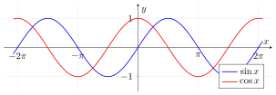

# 第3章 三角函数

> **一例速记**：
> **弧度制**：$\pi \text{ rad} = 180°$；弧长 $l = r\theta$；扇形面积 $S = \frac{1}{2}r^2\theta$（$\theta$ 必须为弧度）。
> **单位圆定义**：$(\cos\theta, \sin\theta)$ 是终边交点；$\tan\theta = \sin\theta/\cos\theta$。符号记忆：第一象限全正，其余"ASTC"（All, Sin, Tan, Cos）。
> **核心恒等式**：$\sin^2 x + \cos^2 x = 1$；倍角 $\sin 2x = 2\sin x\cos x$，$\cos 2x = 1 - 2\sin^2 x = 2\cos^2 x - 1$。
> **反三角**：$\arcsin$ 值域 $[-\pi/2,\pi/2]$（奇函数）；$\arccos$ 值域 $[0,\pi]$；$\arctan$ 值域 $(-\pi/2,\pi/2)$（奇函数）。超出主值区间必须"折回"。
> **参数变换**：$A\sin(Bx+C)+D$：振幅 $|A|$，周期 $2\pi/|B|$，相位移 $-C/B$，中心线 $y=D$。

---

## 思维路径还原（解题者的内心独白）

> "题目：求 $\sin\dfrac{5\pi}{6}$，$\cos\left(-\dfrac{2\pi}{3}\right)$，以及 $\arcsin\left(\sin\dfrac{5\pi}{6}\right)$。
>
> **第一问 $\sin\frac{5\pi}{6}$**：$\frac{5\pi}{6}$ 在 $[0, \pi]$ 里，是第二象限。参考角 $= \pi - \frac{5\pi}{6} = \frac{\pi}{6}$。第二象限 sin 为正，所以 $\sin\frac{5\pi}{6} = +\sin\frac{\pi}{6} = \frac{1}{2}$。
>
> **第二问 $\cos(-\frac{2\pi}{3})$**：余弦是偶函数，$\cos(-\frac{2\pi}{3}) = \cos\frac{2\pi}{3}$。$\frac{2\pi}{3}$ 在第二象限，参考角 $= \pi - \frac{2\pi}{3} = \frac{\pi}{3}$，cos 在第二象限为负，所以 $= -\cos\frac{\pi}{3} = -\frac{1}{2}$。
>
> **第三问 $\arcsin(\sin\frac{5\pi}{6})$**：从第一问知 $\sin\frac{5\pi}{6} = \frac{1}{2}$。于是问题变成 $\arcsin\frac{1}{2}$。反正弦的值域是 $[-\frac{\pi}{2}, \frac{\pi}{2}]$，在这个范围内 $\sin$ 值等于 $\frac{1}{2}$ 的角是 $\frac{\pi}{6}$，所以 $\arcsin(\sin\frac{5\pi}{6}) = \frac{\pi}{6}$。
>
> **关键警示**：$\arcsin(\sin\frac{5\pi}{6}) \neq \frac{5\pi}{6}$！因为 $\frac{5\pi}{6}$ 在主值区间 $[-\frac{\pi}{2}, \frac{\pi}{2}]$ 之外，必须把结果折回值域。反三角函数求值的固定模式是：先算内层 $\sin$ 值，再在主值区间内找到对应角。"

---

## 学习目标

通过本章学习，你将能够：

- 理解弧度制为什么是微积分中的自然角度单位，并熟练进行弧度、角度、弧长与扇形面积计算
- 用单位圆定义六个三角函数，掌握参考角、象限符号和任意角三角函数求值方法
- 从定义域、值域、周期性、奇偶性、单调性、有界性和图像变换角度分析三角函数
- 熟练使用三角恒等式进行化简、证明、解方程，并理解常用公式的来源
- 理解反三角函数为什么必须限制主值区间，能正确处理 $\arcsin(\sin x)$、$\arccos(\cos x)$、$\arctan(\tan x)$ 等复合表达式
- 建立三角函数与后续极限、导数、积分、Fourier 分析、位置编码和周期特征工程之间的联系

---

## 3.1 为什么微积分需要三角函数

三角函数最初来自直角三角形的边角关系，但在微积分中更重要的视角是：它们描述**圆周运动、周期变化和旋转**。只要一个量会重复振荡，或者一个二维向量会旋转，正弦和余弦就自然出现。

例如：

- 物理中的简谐振动可写为 $x(t)=A\cos(\omega t+\varphi)$；
- 信号可以分解为不同频率的正弦波，这就是 Fourier 分析的核心；
- 神经网络中的位置编码常用不同频率的 $\sin$ 和 $\cos$ 表示序列位置；
- 多元微积分中的极坐标、柱坐标、球坐标都离不开三角函数。

因此，本章不仅要记公式，更要掌握三个核心思想：

1. **弧度制把角度和弧长统一起来**；
2. **单位圆把三角函数推广为实数函数**；
3. **恒等式本质上是旋转、投影和周期性的代数表达**。

> **资料参考**：OpenStax Calculus Volume 1 强调弧度与单位圆的自然联系；OpenStax Precalculus 系统介绍单位圆、三角恒等式和反三角函数；Paul's Online Math Notes 与 Khan Academy 提供了大量求值、恒等变形和反三角函数练习。

---

## 3.2 弧度制与单位圆

### 3.2.1 弧度制

在微积分中，我们默认使用**弧度制**。如果角度没有标注单位，通常视为弧度。

**定义**：在半径为 $r$ 的圆中，圆心角 $\theta$ 所对弧长为 $l$。当

$$
\theta=\frac{l}{r}
$$

时，$\theta$ 称为该角的弧度数。特别地，在单位圆中 $r=1$，所以

$$
\theta=l.
$$

这说明：**单位圆上的弧长就是弧度数**。这正是弧度制在微积分中自然的原因。

弧度与角度的换算关系：

$$
\pi\text{ rad}=180^\circ,
\qquad
1^\circ=\frac{\pi}{180}\text{ rad},
\qquad
1\text{ rad}=\frac{180^\circ}{\pi}.
$$

常用换算：

| 角度 | $0^\circ$ | $30^\circ$ | $45^\circ$ | $60^\circ$ | $90^\circ$ | $120^\circ$ | $135^\circ$ | $150^\circ$ | $180^\circ$ | $270^\circ$ | $360^\circ$ |
|:---:|:---:|:---:|:---:|:---:|:---:|:---:|:---:|:---:|:---:|:---:|:---:|
| 弧度 | $0$ | $\frac{\pi}{6}$ | $\frac{\pi}{4}$ | $\frac{\pi}{3}$ | $\frac{\pi}{2}$ | $\frac{2\pi}{3}$ | $\frac{3\pi}{4}$ | $\frac{5\pi}{6}$ | $\pi$ | $\frac{3\pi}{2}$ | $2\pi$ |

**弧长公式**：

$$
l=r\theta.
$$

**扇形面积公式**：

$$
S=\frac12 r^2\theta=\frac12 lr.
$$

> **注意**：公式 $l=r\theta$ 和 $S=\frac12r^2\theta$ 中的 $\theta$ 必须用弧度。若题目给角度，先换成弧度。

> **例题 3.1** 半径为 $6$ 的圆中，圆心角为 $150^\circ$ 的弧长和扇形面积分别是多少？

**解**：先换成弧度：

$$
150^\circ=150\cdot\frac{\pi}{180}=\frac{5\pi}{6}.
$$

所以

$$
l=r\theta=6\cdot\frac{5\pi}{6}=5\pi,
$$

$$
S=\frac12r^2\theta=\frac12\cdot36\cdot\frac{5\pi}{6}=15\pi.
$$

---

### 3.2.2 单位圆定义

**单位圆**是以原点为圆心、半径为 $1$ 的圆：

$$
x^2+y^2=1.
$$

从 $x$ 轴正向出发，逆时针旋转角 $\theta$，终边与单位圆交于点 $P(x,y)$。定义：

$$
\sin\theta=y,
\qquad
\cos\theta=x,
\qquad
\tan\theta=\frac{y}{x}\quad(x\ne0).
$$

另外三个函数定义为倒数：

$$
\csc\theta=\frac1{\sin\theta}\quad(\sin\theta\ne0),
$$

$$
\sec\theta=\frac1{\cos\theta}\quad(\cos\theta\ne0),
$$

$$
\cot\theta=\frac1{\tan\theta}=\frac{x}{y}\quad(y\ne0).
$$

单位圆定义比直角三角形定义更强，因为它允许 $\theta$ 是任意实数：正角、负角、超过一周的角都可以处理。

### 3.2.3 终边相同的角

两个角如果相差 $2\pi$ 的整数倍，就有相同终边：

$$
\theta\quad\text{与}\quad \theta+2k\pi\quad(k\in\mathbb Z)
$$

对应同一个单位圆点。因此：

$$
\sin(\theta+2k\pi)=\sin\theta,
\qquad
\cos(\theta+2k\pi)=\cos\theta.
$$

对正切，由于 $\tan(\theta+\pi)=\tan\theta$，它的周期更短，是 $\pi$。

### 3.2.4 参考角与象限符号

求任意角三角函数值的基本流程：

1. **化同终边角**：把角化到 $[0,2\pi)$ 或 $(-\pi,\pi]$；
2. **找参考角**：终边与 $x$ 轴的锐角；
3. **查特殊角值**：用 $\pi/6,\pi/4,\pi/3$；
4. **看象限定符号**。

象限符号表：

| 象限 | $\sin$ | $\cos$ | $\tan$ |
|:---:|:---:|:---:|:---:|
| 第一象限 | $+$ | $+$ | $+$ |
| 第二象限 | $+$ | $-$ | $-$ |
| 第三象限 | $-$ | $-$ | $+$ |
| 第四象限 | $-$ | $+$ | $-$ |

特殊角值：

| $\theta$ | $0$ | $\frac{\pi}{6}$ | $\frac{\pi}{4}$ | $\frac{\pi}{3}$ | $\frac{\pi}{2}$ |
|:---:|:---:|:---:|:---:|:---:|:---:|
| $\sin\theta$ | $0$ | $\frac12$ | $\frac{\sqrt2}{2}$ | $\frac{\sqrt3}{2}$ | $1$ |
| $\cos\theta$ | $1$ | $\frac{\sqrt3}{2}$ | $\frac{\sqrt2}{2}$ | $\frac12$ | $0$ |
| $\tan\theta$ | $0$ | $\frac{\sqrt3}{3}$ | $1$ | $\sqrt3$ | 无定义 |

> **例题 3.2** 求 $\sin\frac{5\pi}{4}$、$\cos\left(-\frac{2\pi}{3}\right)$ 和 $\tan\frac{11\pi}{6}$。

**解**：

$\frac{5\pi}{4}=\pi+\frac{\pi}{4}$，在第三象限，参考角为 $\frac\pi4$，所以

$$
\sin\frac{5\pi}{4}=-\frac{\sqrt2}{2}.
$$

$-\frac{2\pi}{3}+2\pi=\frac{4\pi}{3}$，在第三象限，参考角为 $\frac\pi3$，所以

$$
\cos\left(-\frac{2\pi}{3}\right)=\cos\frac{4\pi}{3}=-\frac12.
$$

$\frac{11\pi}{6}=2\pi-\frac\pi6$，在第四象限，参考角为 $\frac\pi6$，所以

$$
\tan\frac{11\pi}{6}=-\tan\frac\pi6=-\frac{\sqrt3}{3}.
$$

---

## 3.3 三角函数的基本性质

### 3.3.1 定义域与值域

| 函数 | 定义域 | 值域 | 不存在的位置 |
|:---:|:---:|:---:|:---:|
| $\sin x$ | $\mathbb R$ | $[-1,1]$ | 无 |
| $\cos x$ | $\mathbb R$ | $[-1,1]$ | 无 |
| $\tan x$ | $\mathbb R\setminus\{\frac\pi2+k\pi\mid k\in\mathbb Z\}$ | $\mathbb R$ | $\cos x=0$ |
| $\cot x$ | $\mathbb R\setminus\{k\pi\mid k\in\mathbb Z\}$ | $\mathbb R$ | $\sin x=0$ |
| $\sec x$ | $\mathbb R\setminus\{\frac\pi2+k\pi\mid k\in\mathbb Z\}$ | $(-\infty,-1]\cup[1,\infty)$ | $\cos x=0$ |
| $\csc x$ | $\mathbb R\setminus\{k\pi\mid k\in\mathbb Z\}$ | $(-\infty,-1]\cup[1,\infty)$ | $\sin x=0$ |

### 3.3.2 周期性

若存在 $T>0$，使得对定义域内所有允许的 $x$ 都有

$$
f(x+T)=f(x),
$$

则称 $f$ 是周期函数，最小的正周期称为**最小正周期**。

| 函数 | 最小正周期 |
|:---:|:---:|
| $\sin x,\cos x,\sec x,\csc x$ | $2\pi$ |
| $\tan x,\cot x$ | $\pi$ |

更一般地，若 $b\ne0$，则

$$
\sin(bx),\ \cos(bx)\quad\text{的周期为}\quad \frac{2\pi}{|b|},
$$

$$
\tan(bx),\ \cot(bx)\quad\text{的周期为}\quad \frac{\pi}{|b|}.
$$

### 3.3.3 奇偶性

由单位圆关于坐标轴的对称性可得：

$$
\sin(-x)=-\sin x,
\qquad
\cos(-x)=\cos x,
\qquad
\tan(-x)=-\tan x.
$$

所以：

- $\sin x,\tan x,\cot x,\csc x$ 是奇函数；
- $\cos x,\sec x$ 是偶函数。

### 3.3.4 单调性

正弦函数：

- 在 $\left[-\frac\pi2+2k\pi,\frac\pi2+2k\pi\right]$ 上单调递增；
- 在 $\left[\frac\pi2+2k\pi,\frac{3\pi}{2}+2k\pi\right]$ 上单调递减。

余弦函数：

- 在 $[-\pi+2k\pi,2k\pi]$ 上单调递增；
- 在 $[2k\pi,\pi+2k\pi]$ 上单调递减。

正切函数：

- 在每个 $\left(-\frac\pi2+k\pi,\frac\pi2+k\pi\right)$ 上单调递增。

这些结论以后可以用导数快速证明：$(\sin x)'=\cos x$，$(\cos x)'=-\sin x$，$(\tan x)'=\sec^2x>0$。

### 3.3.5 图像与参数变换

函数

$$
y=A\sin(Bx+C)+D
$$

可由 $y=\sin x$ 经过以下变换得到：

| 参数 | 作用 |
|:---:|:---|
| $|A|$ | 振幅，控制上下伸缩 |
| $\frac{2\pi}{|B|}$ | 周期 |
| $-\frac{C}{B}$ | 相位平移 |
| $D$ | 竖直平移，中心线为 $y=D$ |

> **例题 3.3** 分析函数 $y=3\sin(2x-\frac\pi3)-1$ 的振幅、周期、相位平移和中心线。

**解**：写成

$$
y=3\sin\left(2\left(x-\frac\pi6\right)\right)-1.
$$

因此振幅为 $3$，周期为 $\frac{2\pi}{2}=\pi$，向右平移 $\frac\pi6$，中心线为 $y=-1$。

---

## 3.4 三角恒等式

三角恒等式不是孤立公式，而是单位圆和旋转规律的代数结果。学习时建议先掌握少数核心公式，再由核心公式推导其他公式。

> 以下恒等式可当作**查阅表**，不必逐条死记；用到时回查即可，重点掌握 §节中带例题的几条。

### 3.4.1 基本恒等式

由单位圆方程 $x^2+y^2=1$，且 $x=\cos\theta, y=\sin\theta$，得到最重要的平方关系：

$$
\sin^2x+\cos^2x=1.
$$

两边分别除以 $\cos^2x$ 或 $\sin^2x$ 得到：

$$
1+\tan^2x=\sec^2x,
\qquad
1+\cot^2x=\csc^2x.
$$

商数关系：

$$
\tan x=\frac{\sin x}{\cos x},
\qquad
\cot x=\frac{\cos x}{\sin x}.
$$

倒数关系：

$$
\csc x=\frac1{\sin x},
\qquad
\sec x=\frac1{\cos x},
\qquad
\cot x=\frac1{\tan x}.
$$

### 3.4.2 诱导公式

常用诱导公式：

$$
\sin(\pi-x)=\sin x,
\qquad
\cos(\pi-x)=-\cos x,
$$

$$
\sin(\pi+x)=-\sin x,
\qquad
\cos(\pi+x)=-\cos x,
$$

$$
\sin\left(\frac\pi2-x\right)=\cos x,
\qquad
\cos\left(\frac\pi2-x\right)=\sin x,
$$

$$
\sin\left(\frac\pi2+x\right)=\cos x,
\qquad
\cos\left(\frac\pi2+x\right)=-\sin x.
$$

记忆原则：

- 与 $\pi\pm x$ 相关时，函数名通常不变；
- 与 $\frac\pi2\pm x$ 相关时，正弦、余弦互换；
- 最后根据所在象限确定符号。

“奇变偶不变，符号看象限”中的“奇、偶”指 $\frac\pi2$ 的奇数倍或偶数倍。

### 3.4.3 和差公式

$$
\sin(\alpha\pm\beta)=\sin\alpha\cos\beta\pm\cos\alpha\sin\beta,
$$

$$
\cos(\alpha\pm\beta)=\cos\alpha\cos\beta\mp\sin\alpha\sin\beta,
$$

$$
\tan(\alpha\pm\beta)=\frac{\tan\alpha\pm\tan\beta}{1\mp\tan\alpha\tan\beta}.
$$

其中正切公式要求分母不为 $0$，且相关正切值有定义。

> **例题 3.4** 求 $\cos 75^\circ$ 的精确值。

**解**：$75^\circ=45^\circ+30^\circ$，所以

$$
\begin{aligned}
\cos75^\circ
&=\cos(45^\circ+30^\circ)\\
&=\cos45^\circ\cos30^\circ-\sin45^\circ\sin30^\circ\\
&=\frac{\sqrt2}{2}\cdot\frac{\sqrt3}{2}-\frac{\sqrt2}{2}\cdot\frac12\\
&=\frac{\sqrt6-\sqrt2}{4}.
\end{aligned}
$$

### 3.4.4 倍角与半角公式

倍角公式：

$$
\sin2\alpha=2\sin\alpha\cos\alpha,
$$

$$
\cos2\alpha=\cos^2\alpha-\sin^2\alpha=2\cos^2\alpha-1=1-2\sin^2\alpha,
$$

$$
\tan2\alpha=\frac{2\tan\alpha}{1-\tan^2\alpha}.
$$

半角公式：

$$
\sin\frac\alpha2=\pm\sqrt{\frac{1-\cos\alpha}{2}},
\qquad
\cos\frac\alpha2=\pm\sqrt{\frac{1+\cos\alpha}{2}},
$$

$$
\tan\frac\alpha2=\frac{\sin\alpha}{1+\cos\alpha}=\frac{1-\cos\alpha}{\sin\alpha},
$$

符号由 $\frac\alpha2$ 所在象限决定。

### 3.4.5 积化和差与和差化积

积化和差：

$$
\sin\alpha\cos\beta=\frac12[\sin(\alpha+\beta)+\sin(\alpha-\beta)],
$$

$$
\cos\alpha\sin\beta=\frac12[\sin(\alpha+\beta)-\sin(\alpha-\beta)],
$$

$$
\cos\alpha\cos\beta=\frac12[\cos(\alpha+\beta)+\cos(\alpha-\beta)],
$$

$$
\sin\alpha\sin\beta=\frac12[\cos(\alpha-\beta)-\cos(\alpha+\beta)].
$$

和差化积：

$$
\sin A+\sin B=2\sin\frac{A+B}{2}\cos\frac{A-B}{2},
$$

$$
\sin A-\sin B=2\cos\frac{A+B}{2}\sin\frac{A-B}{2},
$$

$$
\cos A+\cos B=2\cos\frac{A+B}{2}\cos\frac{A-B}{2},
$$

$$
\cos A-\cos B=-2\sin\frac{A+B}{2}\sin\frac{A-B}{2}.
$$

这些公式在求积分、Fourier 级数和信号处理中非常常见。例如积分 $\int\sin mx\cos nx\,dx$ 往往先积化和差。

### 3.4.6 恒等式证明策略

证明三角恒等式时，常用策略如下：

1. **从复杂一边化向简单一边**；
2. **全部化成 $\sin$ 和 $\cos$**；
3. **使用 $\sin^2x+\cos^2x=1$ 消去平方项**；
4. **遇到 $2x$ 考虑倍角，遇到 $\frac x2$ 考虑半角**；
5. **先写定义域限制**，避免在分母为零处做非法变形。

> **例题 3.5** 证明
> $$
> \frac{1-\cos2x}{\sin2x}=\tan x.
> $$

**解**：当 $\sin2x\ne0$ 且 $\cos x\ne0$ 时，

$$
\begin{aligned}
\frac{1-\cos2x}{\sin2x}
&=\frac{1-(1-2\sin^2x)}{2\sin x\cos x}\\
&=\frac{2\sin^2x}{2\sin x\cos x}\\
&=\frac{\sin x}{\cos x}\\
&=\tan x.
\end{aligned}
$$

证毕。 $\square$

---

## 3.5 三角方程与不等式入门

### 3.5.1 基本三角方程

基本方程的通解应同时表达周期性和对称性。

若 $a\in[-1,1]$，设 $\alpha=\arcsin a$，则

$$
\sin x=a
\quad\Longleftrightarrow\quad
x=\alpha+2k\pi\ \text{或}\ x=\pi-\alpha+2k\pi,
\quad k\in\mathbb Z.
$$

若 $a\in[-1,1]$，设 $\beta=\arccos a$，则

$$
\cos x=a
\quad\Longleftrightarrow\quad
x=\pm\beta+2k\pi,
\quad k\in\mathbb Z.
$$

若 $a\in\mathbb R$，设 $\gamma=\arctan a$，则

$$
\tan x=a
\quad\Longleftrightarrow\quad
x=\gamma+k\pi,
\quad k\in\mathbb Z.
$$

> **例题 3.6** 解方程 $\sin x=\frac{\sqrt3}{2}$，并写出 $[0,2\pi]$ 内全部解。

**解**：参考角为 $\frac\pi3$。正弦为正在第一、第二象限，所以

$$
x=\frac\pi3+2k\pi
\quad\text{或}\quad
x=\frac{2\pi}{3}+2k\pi,
\quad k\in\mathbb Z.
$$

在 $[0,2\pi]$ 内，解为

$$
x=\frac\pi3,\quad \frac{2\pi}{3}.
$$

### 3.5.2 三角不等式的单位圆理解

例如解

$$
\sin x\ge\frac12.
$$

在单位圆上，$y\ge\frac12$ 的弧段对应

$$
x\in\left[\frac\pi6,\frac{5\pi}{6}\right]+2k\pi,
\quad k\in\mathbb Z.
$$

三角不等式的关键是把函数值看作单位圆上的坐标，再找满足坐标条件的弧段。

---

## 3.6 反三角函数

三角函数有周期性，所以不是一一映射，不能直接在整个定义域上取反函数。为了定义反函数，需要选定一个**主值区间**，使原函数在该区间上一一对应。

### 3.6.1 反正弦函数

$y=\arcsin x$ 是 $y=\sin y$ 在主值区间 $\left[-\frac\pi2,\frac\pi2\right]$ 上的反函数。

- 定义域：$[-1,1]$；
- 值域：$\left[-\frac\pi2,\frac\pi2\right]$；
- 性质：奇函数，单调递增。

基本关系：

$$
\sin(\arcsin x)=x,
\qquad x\in[-1,1],
$$

$$
\arcsin(\sin x)=x,
\qquad x\in\left[-\frac\pi2,\frac\pi2\right].
$$

第二个式子只在主值区间内直接成立；主值区间外必须先把角折回主值区间。

### 3.6.2 反余弦函数

$y=\arccos x$ 是 $y=\cos y$ 在主值区间 $[0,\pi]$ 上的反函数。

- 定义域：$[-1,1]$；
- 值域：$[0,\pi]$；
- 性质：单调递减，非奇非偶。

基本关系：

$$
\cos(\arccos x)=x,
\qquad x\in[-1,1],
$$

$$
\arccos(\cos x)=x,
\qquad x\in[0,\pi].
$$

重要恒等式：

$$
\arcsin x+\arccos x=\frac\pi2,
\qquad x\in[-1,1].
$$

### 3.6.3 反正切函数

$y=\arctan x$ 是 $y=\tan y$ 在主值区间 $\left(-\frac\pi2,\frac\pi2\right)$ 上的反函数。

- 定义域：$\mathbb R$；
- 值域：$\left(-\frac\pi2,\frac\pi2\right)$；
- 性质：奇函数，单调递增；
- 渐近行为：$x\to+\infty$ 时 $\arctan x\to\frac\pi2$，$x\to-\infty$ 时 $\arctan x\to-\frac\pi2$。

基本关系：

$$
\tan(\arctan x)=x,
\qquad x\in\mathbb R,
$$

$$
\arctan(\tan x)=x,
\qquad x\in\left(-\frac\pi2,\frac\pi2\right).
$$

常用关系：

$$
\arctan x+\arctan\frac1x=
\begin{cases}
\frac\pi2, & x>0,\\
-\frac\pi2, & x<0.
\end{cases}
$$

> **例题 3.7** 求 $\arcsin\left(\sin\frac{5\pi}{6}\right)$、$\arccos\left(\cos\frac{5\pi}{3}\right)$ 和 $\arctan(\tan\frac{7\pi}{4})$。

**解**：

$\arcsin$ 的值域是 $\left[-\frac\pi2,\frac\pi2\right]$。由于

$$
\sin\frac{5\pi}{6}=\frac12=\sin\frac\pi6,
$$

且 $\frac\pi6$ 在主值区间内，所以

$$
\arcsin\left(\sin\frac{5\pi}{6}\right)=\frac\pi6.
$$

$\arccos$ 的值域是 $[0,\pi]$。由于

$$
\cos\frac{5\pi}{3}=\frac12=\cos\frac\pi3,
$$

且 $\frac\pi3$ 在主值区间内，所以

$$
\arccos\left(\cos\frac{5\pi}{3}\right)=\frac\pi3.
$$

$\arctan$ 的值域是 $\left(-\frac\pi2,\frac\pi2\right)$。由于 $\frac{7\pi}{4}$ 与 $-\frac\pi4$ 相差 $2\pi$，且 $-\frac\pi4$ 在主值区间内，所以

$$
\arctan\left(\tan\frac{7\pi}{4}\right)=-\frac\pi4.
$$

---

## 3.7 与微积分的连接

本章是后续微积分中许多重要结论的前置基础。

### 3.7.1 两个重要极限

后面学习极限时会证明：

$$
\lim_{x\to0}\frac{\sin x}{x}=1,
\qquad
\lim_{x\to0}\frac{1-\cos x}{x}=0.
$$

这些极限只有在 $x$ 使用弧度时才具有这种简洁形式。若用角度制，导数公式会多出常数因子。

### 3.7.2 导数与积分

三角函数的基本导数公式是：

$$
(\sin x)'=\cos x,
\qquad
(\cos x)'=-\sin x,
\qquad
(\tan x)'=\sec^2x.
$$

相应地，不定积分中会出现：

$$
\int\cos x\,dx=\sin x+C,
\qquad
\int\sin x\,dx=-\cos x+C.
$$

反三角函数也会出现在积分中，例如：

$$
\int\frac1{1+x^2}\,dx=\arctan x+C,
$$

$$
\int\frac1{\sqrt{1-x^2}}\,dx=\arcsin x+C.
$$

### 3.7.3 极坐标与旋转矩阵

单位圆点可写为

$$
(\cos\theta,\sin\theta).
$$

平面中半径为 $r$、极角为 $\theta$ 的点可写为

$$
(x,y)=(r\cos\theta,r\sin\theta).
$$

二维旋转矩阵为

$$
R_\theta=
\begin{bmatrix}
\cos\theta & -\sin\theta\\
\sin\theta & \cos\theta
\end{bmatrix}.
$$

它本质上就是和差公式的矩阵形式。

---

## 3.8 深度学习应用

三角函数在现代深度学习中有多处核心应用，以下介绍三个重要场景。

### 3.8.1 Transformer 中的位置编码

Transformer 模型处理序列时，自注意力机制本身不含位置信息，需要额外的**位置编码**（Positional Encoding）来注入序列顺序。Vaswani 等人（2017）选择正弦/余弦函数：

$$
PE_{(pos,2i)}=\sin\left(\frac{pos}{10000^{2i/d}}\right),
$$

$$
PE_{(pos,2i+1)}=\cos\left(\frac{pos}{10000^{2i/d}}\right).
$$

其中 $pos$ 是词在序列中的位置，$i$ 是维度索引，$d$ 是模型的嵌入维度。

关键优势在于：对固定偏移 $k$，$PE_{pos+k}$ 可以由 $PE_{pos}$ 通过线性变换表示。这直接来自和差公式：

$$
\sin(A+B)=\sin A\cos B+\cos A\sin B.
$$

因此模型可以通过线性运算学习相对位置关系。

### 3.8.2 Fourier 特征

神经网络常有谱偏差：更容易学习低频函数，较难学习高频细节。Fourier 特征把输入 $\mathbf x$ 映射到正弦、余弦特征空间：

$$
\gamma(\mathbf x)=\left[\cos(2\pi\mathbf B\mathbf x),\ \sin(2\pi\mathbf B\mathbf x)\right].
$$

这种映射常用于 NeRF、隐式神经表示和核方法近似中，使模型更容易表示快速变化的函数。

### 3.8.3 周期特征工程

现实数据经常具有周期性：小时、星期、月份、季节等。若周期为 $T$，可把时间 $t$ 编码为

$$
\left(\sin\frac{2\pi t}{T},\ \cos\frac{2\pi t}{T}\right).
$$

使用一对 $\sin$、$\cos$ 而不是单个函数，是为了避免歧义。单个 $\sin$ 在一个周期内不是单射，而二维向量位于单位圆上，可以唯一表示周期中的相位。

### 代码示例：Transformer 位置编码

```python
import math
import torch


def positional_encoding(seq_len, d_model):
    """Transformer 正余弦位置编码。"""
    pe = torch.zeros(seq_len, d_model)
    position = torch.arange(0, seq_len).unsqueeze(1).float()
    div_term = torch.exp(
        torch.arange(0, d_model, 2).float() * (-math.log(10000.0) / d_model)
    )

    pe[:, 0::2] = torch.sin(position * div_term)
    pe[:, 1::2] = torch.cos(position * div_term)
    return pe


pe = positional_encoding(seq_len=100, d_model=512)
print(pe.shape)  # torch.Size([100, 512])
```

`div_term` 利用指数与对数的等价形式：

$$
\frac1{10000^{2i/d}}=e^{-\frac{2i}{d}\ln10000}.
$$

---

## 本章小结

1. **弧度制**把角度与单位圆弧长统一起来，是微积分中最自然的角度单位。
2. **单位圆定义**将三角函数推广为实数函数，参考角与象限符号是任意角求值的核心。
3. **基本性质**包括定义域、值域、周期性、奇偶性、单调性、有界性和图像变换。
4. **三角恒等式**主要来自单位圆与旋转，核心公式包括平方关系、和差公式、倍角公式、半角公式、积化和差与和差化积。
5. **反三角函数**依赖主值区间。处理复合表达式时，要把结果落回对应反函数的值域。
6. **应用连接**包括极限、求导、积分、极坐标、Fourier 分析、位置编码与周期特征工程。

---

## 资料与延伸阅读

- [OpenStax Calculus Volume 1, Section 1.3: Trigonometric Functions](https://openstax.org/books/calculus-volume-1/pages/1-3-trigonometric-functions)。重点参考弧度制、单位圆、六个三角函数和基本恒等式。
- [OpenStax Precalculus 2e, Section 6.3: Inverse Trigonometric Functions](https://openstax.org/books/precalculus-2e/pages/6-3-inverse-trigonometric-functions)。重点参考反三角函数的主值区间与复合表达式。
- [OpenStax Precalculus 2e, Appendix A: Basic Functions and Identities](https://openstax.org/books/precalculus-2e/pages/a-basic-functions-and-identities)。重点参考三角图像与恒等式汇总。
- [Paul's Online Math Notes, Algebra/Trig Review](https://tutorial.math.lamar.edu/extras/algebratrigreview/TrigIntro.aspx)。重点参考三角函数求值、单位圆与反三角函数常见误区。
- [Khan Academy Trigonometry: Unit circle with radians](https://www.khanacademy.org/math/trigonometry/unit-circle-trig-func/radians_tutorial)。重点参考弧度、单位圆和交互式练习路径。

---

## 练习题

**1.** ⭐ 将下列角度化为弧度，或将弧度化为角度：
   (a) $150^\circ$　　(b) $-45^\circ$　　(c) $\frac{5\pi}{6}$　　(d) $-\frac{3\pi}{4}$

**2.** ⭐ 求下列三角函数值：
   (a) $\sin\frac{7\pi}{6}$　　(b) $\cos\left(-\frac{5\pi}{3}\right)$　　(c) $\tan\frac{3\pi}{4}$

**3.** ⭐ 已知 $\sin\alpha=\frac35$，$\alpha\in\left(\frac\pi2,\pi\right)$，求 $\cos\alpha$、$\tan\alpha$ 和 $\sin2\alpha$ 的值。

**4.** ⭐⭐ 证明恒等式：$\frac{1-\cos2x}{\sin2x}=\tan x$，并说明该等式成立时需要排除哪些 $x$。

**5.** ⭐⭐ 求 $\arcsin\left(\sin\frac{5\pi}{6}\right)$、$\arccos\left(\cos\frac{5\pi}{3}\right)$ 和 $\arctan\left(\tan\frac{7\pi}{4}\right)$ 的值。

**6.** ⭐⭐ 解方程
$$
\sin x=\frac{\sqrt3}{2},
$$
写出通解，并写出 $x\in[0,2\pi]$ 内的全部解。

**7.** ⭐⭐⭐ 已知 $y=2\cos(3x+\frac\pi2)-1$，求它的振幅、周期、相位平移和中心线，并说明其图像由 $y=\cos x$ 经过哪些变换得到。

**8.** ⭐⭐⭐ 
Transformer 的正余弦位置编码常写作 $(\sin t,\cos t)$。证明对任意位移 $\delta$，

$$
\begin{bmatrix}
\sin(t+\delta)\\
\cos(t+\delta)
\end{bmatrix} =
\begin{bmatrix}
\cos\delta & \sin\delta\\
-\sin\delta & \cos\delta
\end{bmatrix}
\begin{bmatrix}
\sin t\\
\cos t
\end{bmatrix},
$$

并说明为什么这种表示会保持向量长度不变。

---

## 练习答案

<details>
<summary>点击展开答案</summary>

**1.**
(a) $150^\circ=150\cdot\frac\pi{180}=\frac{5\pi}{6}$。

(b) $-45^\circ=-45\cdot\frac\pi{180}=-\frac\pi4$。

(c) $\frac{5\pi}{6}=\frac{5\pi}{6}\cdot\frac{180^\circ}{\pi}=150^\circ$。

(d) $-\frac{3\pi}{4}=-\frac{3\pi}{4}\cdot\frac{180^\circ}{\pi}=-135^\circ$。

---

**2.**
(a) $\frac{7\pi}{6}=\pi+\frac\pi6$，在第三象限，正弦为负，所以
$$
\sin\frac{7\pi}{6}=-\sin\frac\pi6=-\frac12.
$$

(b) $-\frac{5\pi}{3}+2\pi=\frac\pi3$，所以
$$
\cos\left(-\frac{5\pi}{3}\right)=\cos\frac\pi3=\frac12.
$$

(c) $\frac{3\pi}{4}=\pi-\frac\pi4$，在第二象限，正切为负，所以
$$
\tan\frac{3\pi}{4}=-\tan\frac\pi4=-1.
$$

---

**3.** 因为 $\alpha\in\left(\frac\pi2,\pi\right)$，所以 $\alpha$ 在第二象限，$\cos\alpha<0$。

由 $\sin^2\alpha+\cos^2\alpha=1$，
$$
\cos\alpha=-\sqrt{1-\sin^2\alpha}
=-\sqrt{1-\frac9{25}}
=-\frac45.
$$

因此
$$
\tan\alpha=\frac{\sin\alpha}{\cos\alpha}=\frac{3/5}{-4/5}=-\frac34,
$$

$$
\sin2\alpha=2\sin\alpha\cos\alpha
=2\cdot\frac35\cdot\left(-\frac45\right)
=-\frac{24}{25}.
$$

---

**4.** 当原式有意义且化简过程中不除以 $0$ 时，需要 $\sin2x\ne0$ 且 $\cos x\ne0$。由于 $\sin2x=2\sin x\cos x$，这等价于 $\sin x\ne0$ 且 $\cos x\ne0$，即
$$
x\ne\frac{k\pi}{2},\qquad k\in\mathbb Z.
$$

在这些点之外，利用倍角公式：
$$
\begin{aligned}
\frac{1-\cos2x}{\sin2x}
&=\frac{1-(1-2\sin^2x)}{2\sin x\cos x}\\
&=\frac{2\sin^2x}{2\sin x\cos x}\\
&=\frac{\sin x}{\cos x}\\
&=\tan x.
\end{aligned}
$$

证毕。 $\square$

---

**5.**

对 $\arcsin\left(\sin\frac{5\pi}{6}\right)$：
$$
\sin\frac{5\pi}{6}=\frac12=\sin\frac\pi6.
$$
由于 $\arcsin$ 的值域是 $\left[-\frac\pi2,\frac\pi2\right]$，而 $\frac\pi6$ 在该区间内，所以
$$
\arcsin\left(\sin\frac{5\pi}{6}\right)=\frac\pi6.
$$

对 $\arccos\left(\cos\frac{5\pi}{3}\right)$：
$$
\cos\frac{5\pi}{3}=\frac12=\cos\frac\pi3.
$$
由于 $\arccos$ 的值域是 $[0,\pi]$，而 $\frac\pi3$ 在该区间内，所以
$$
\arccos\left(\cos\frac{5\pi}{3}\right)=\frac\pi3.
$$

对 $\arctan\left(\tan\frac{7\pi}{4}\right)$：
$\frac{7\pi}{4}$ 与 $-\frac\pi4$ 终边相同，且 $-\frac\pi4\in\left(-\frac\pi2,\frac\pi2\right)$，所以
$$
\arctan\left(\tan\frac{7\pi}{4}\right)=-\frac\pi4.
$$

---

**6.** 在单位圆上，$\sin x=\frac{\sqrt3}{2}$ 的参考角是 $\frac\pi3$，正弦在第一、第二象限为正。

通解为
$$
x=\frac\pi3+2k\pi
\quad\text{或}\quad
x=\frac{2\pi}{3}+2k\pi,
\qquad k\in\mathbb Z.
$$

在 $[0,2\pi]$ 内，全部解为
$$
x=\frac\pi3,\qquad x=\frac{2\pi}{3}.
$$

---

**7.** 将函数改写为
$$
y=2\cos\left(3\left(x+\frac\pi6\right)\right)-1.
$$

所以：

- 振幅为 $2$；
- 周期为 $\frac{2\pi}{3}$；
- 相位平移为向左平移 $\frac\pi6$；
- 中心线为 $y=-1$。

图像可由 $y=\cos x$ 先横向压缩为原来的 $\frac13$，再向左平移 $\frac\pi6$，纵向拉伸为原来的 $2$ 倍，最后向下平移 $1$ 个单位得到。

---

**8.** 由和角公式，
$$
\sin(t+\delta)=\sin t\cos\delta+\cos t\sin\delta,
$$
$$
\cos(t+\delta)=\cos t\cos\delta-\sin t\sin\delta.
$$

写成矩阵形式就是
$$
\begin{bmatrix}
\sin(t+\delta)\\
\cos(t+\delta)
\end{bmatrix}
=
\begin{bmatrix}
\cos\delta & \sin\delta\\
-\sin\delta & \cos\delta
\end{bmatrix}
\begin{bmatrix}
\sin t\\
\cos t
\end{bmatrix}.
$$

记该矩阵为 $M$，则
$$
M^TM=
\begin{bmatrix}
\cos\delta & -\sin\delta\\
\sin\delta & \cos\delta
\end{bmatrix}
\begin{bmatrix}
\cos\delta & \sin\delta\\
-\sin\delta & \cos\delta
\end{bmatrix}
=I.
$$

因此 $M$ 是正交矩阵，会保持向量长度不变。等价地，
$$
\sin^2(t+\delta)+\cos^2(t+\delta)=1=\sin^2t+\cos^2t.
$$

这说明位置平移对应二维旋转变换，它改变相位，但不改变模长。这也是正余弦位置编码便于表达相对位移的原因。

</details>

---

## 几何示意



---

## 思考路标（条件反射）

- 看到 $\sin^2 x + \cos^2 x$ → 立即等于 $1$
- 看到 $\sin(\alpha \pm \beta)$ / $\cos(\alpha \pm \beta)$ → 和差角公式
- 看到 $\sin 2x$ → $2\sin x \cos x$；看到 $\cos 2x$ → 3 种形式选用
- 看到 $a\sin x + b\cos x$ → 辅助角 $\sqrt{a^2+b^2}\sin(x+\varphi)$
- 看到 $\arcsin / \arccos / \arctan$ → 想主值范围
- 看到 $\sin x / x$（$x \to 0$）→ 想第一重要极限 $= 1$
- 看到周期函数性质 → 找最小正周期
- 看到 Fourier 级数 → 想正弦/余弦基底的正交性

## 易错点

1. **角度 vs 弧度**：微积分一律用弧度（不然导数公式错）。
2. **$\arcsin x$ 主值范围 $[-\pi/2, \pi/2]$**，不是 $[0, \pi]$。
3. **$\sin^{-1} x \neq 1/\sin x$**：前者是反函数，后者是倒数（即 $\csc x$）。
4. **倍角公式选哪个 $\cos 2x$ 形式**：算积分通常用 $1 - 2\sin^2 x$ 或 $2\cos^2 x - 1$（便于消去某变量）。
5. **诱导公式"奇变偶不变 + 符号看象限"**：$\sin(\pi/2 + x) = \cos x$（奇变）、$\sin(\pi + x) = -\sin x$（偶不变 + 第三象限）。

---

## 抽象成方法（套路总结）

### 三角函数核心公式速查

| 类别 | 公式 | 说明 |
|---|---|---|
| 平方关系 | $\sin^2 x + \cos^2 x = 1$ | 最优先使用 |
| 商关系 | $\tan x = \sin x / \cos x$ | 消去 tan |
| 倍角（sin） | $\sin 2x = 2\sin x\cos x$ | 乘积变倍角 |
| 倍角（cos） | $\cos 2x = 2\cos^2 x - 1 = 1 - 2\sin^2 x$ | 消去平方项 |
| 和差角 | $\sin(\alpha\pm\beta) = \sin\alpha\cos\beta \pm \cos\alpha\sin\beta$ | 求特殊角精确值 |
| 反正弦 | $\arcsin x \in [-\pi/2,\pi/2]$，奇函数 | 超出要折回 |
| 反余弦 | $\arccos x \in [0,\pi]$，单调递减 | $\arcsin x + \arccos x = \pi/2$ |
| 反正切 | $\arctan x \in (-\pi/2,\pi/2)$，奇函数 | 定义域 $\mathbb{R}$ |

### 任意角求值标准四步

1. 化为 $[0,2\pi)$ 内等终边角；
2. 找参考角（与 $x$ 轴成的锐角）；
3. 查特殊角值表（$\pi/6,\pi/4,\pi/3$）；
4. 按象限确定符号（ASTC：第一全正，第二 sin，第三 tan，第四 cos）。

---

## 方法变形

### 变形 1：辅助角公式

$a\sin x + b\cos x = \sqrt{a^2+b^2}\sin(x+\varphi)$，其中 $\tan\varphi = b/a$。用于求最值或化简含两个三角函数的表达式。

### 变形 2：积化和差 + 和差化积

积分 $\int \sin mx\cos nx\,dx$ 必须先积化和差，否则无法直接积出。Fourier 级数的正交性也由积化和差推导。

### 变形 3：反三角函数的复合

$\arcsin(\sin x) = x$ 仅对 $x \in [-\pi/2,\pi/2]$ 成立；其余角必须先用对称性折回主值区间，再写结果。类似规则对 $\arccos,\arctan$ 成立。

### 变形 4：含参数 $B$ 的周期

$\sin(Bx+C)$ 的周期为 $2\pi/|B|$，不是 $2\pi$。变换 $A\sin(Bx+C)+D$ 的五量（振幅 $A$，周期 $2\pi/|B|$，相位移 $-C/B$，中心线 $D$，值域 $[D-|A|,D+|A|]$）要逐一读出。

---

## 典型应用例题

### 例 1：任意角求值

> **题目**：求 $\cos\dfrac{11\pi}{6}$ 和 $\tan\left(-\dfrac{5\pi}{4}\right)$。

【思路】化到 $[0,2\pi)$，找参考角，看象限定符号。

【解】
$\frac{11\pi}{6} = 2\pi - \frac{\pi}{6}$，在第四象限，参考角 $\frac{\pi}{6}$，cos 在第四象限正，所以

$$\cos\frac{11\pi}{6} = +\cos\frac{\pi}{6} = \frac{\sqrt{3}}{2}.$$

$-\frac{5\pi}{4}$ 加 $2\pi$ 得 $\frac{3\pi}{4}$，在第二象限，参考角 $\frac{\pi}{4}$，tan 在第二象限负，所以

$$\tan\left(-\frac{5\pi}{4}\right) = \tan\frac{3\pi}{4} = -1.$$

【答案】$\boxed{\cos\frac{11\pi}{6} = \frac{\sqrt{3}}{2},\quad \tan(-\frac{5\pi}{4}) = -1}$。

### 例 2：恒等式证明

> **题目**：化简 $\dfrac{\sin 3x - \sin x}{\cos 3x + \cos x}$。

【思路】分子和差化积，分母和差化积。

【解】

$$\text{分子} = 2\cos\frac{3x+x}{2}\sin\frac{3x-x}{2} = 2\cos 2x\sin x.$$

$$\text{分母} = 2\cos\frac{3x+x}{2}\cos\frac{3x-x}{2} = 2\cos 2x\cos x.$$

（要求 $\cos 2x \neq 0$ 且 $\cos x \neq 0$）

$$\frac{\sin 3x - \sin x}{\cos 3x + \cos x} = \frac{2\cos 2x\sin x}{2\cos 2x\cos x} = \tan x.$$

【答案】$\boxed{\tan x}$（在适当定义域上）。

### 例 3：反三角函数"折回"

> **题目**：求 $\arccos\!\left(\cos\dfrac{7\pi}{6}\right)$ 和 $\arctan\!\left(\tan\dfrac{4\pi}{3}\right)$。

【思路】先算内层三角函数值，再在主值区间内找对应角。

【解】

$\cos\dfrac{7\pi}{6} = \cos(\pi + \dfrac{\pi}{6}) = -\cos\dfrac{\pi}{6} = -\dfrac{\sqrt{3}}{2}$。

$\arccos$ 值域 $[0,\pi]$，在此区间内 $\cos$ 值为 $-\dfrac{\sqrt{3}}{2}$ 的角是 $\dfrac{5\pi}{6}$，故

$$\arccos\!\left(\cos\frac{7\pi}{6}\right) = \frac{5\pi}{6}.$$

$\tan\dfrac{4\pi}{3} = \tan(\pi + \dfrac{\pi}{3}) = \tan\dfrac{\pi}{3} = \sqrt{3}$。

$\arctan$ 值域 $(-\dfrac{\pi}{2},\dfrac{\pi}{2})$，在此区间内 $\tan$ 值为 $\sqrt{3}$ 的角是 $\dfrac{\pi}{3}$，故

$$\arctan\!\left(\tan\frac{4\pi}{3}\right) = \frac{\pi}{3}.$$

【答案】$\boxed{\dfrac{5\pi}{6};\quad \dfrac{\pi}{3}}$。注：两结果都与原角不同——折回主值区间是反三角的核心操作。

---

## 自测题

**自测 1**　求 $\sin\dfrac{7\pi}{4}$，$\cos\dfrac{5\pi}{3}$，$\tan\dfrac{2\pi}{3}$。

> 💡 提示：$\sin\frac{7\pi}{4} = -\frac{\sqrt{2}}{2}$（第四象限）；$\cos\frac{5\pi}{3} = \frac{1}{2}$（第四象限）；$\tan\frac{2\pi}{3} = -\sqrt{3}$（第二象限）。

**自测 2**　已知 $\cos\alpha = -\dfrac{3}{5}$，$\alpha \in (\pi/2, \pi)$，求 $\sin\alpha$，$\tan\alpha$，$\sin 2\alpha$。

> 💡 提示：$\sin\alpha = \frac{4}{5}$（第二象限正）；$\tan\alpha = -\frac{4}{3}$；$\sin 2\alpha = 2 \cdot \frac{4}{5} \cdot (-\frac{3}{5}) = -\frac{24}{25}$。

**自测 3**　化简 $A\sin x + A\cos x$（$A > 0$）为辅助角形式，求最大值。

> 💡 提示：$= A\sqrt{2}\sin(x + \pi/4)$，最大值 $A\sqrt{2}$（当 $x = \pi/4$ 时取到）。

**自测 4**　求 $\arcsin(\sin 2)$（$2$ 为弧度）。

> 💡 提示：$2 \notin [-\pi/2, \pi/2]$（$\pi/2 \approx 1.57$），用对称性：$\sin 2 = \sin(\pi - 2)$，且 $\pi - 2 \approx 1.14 \in [-\pi/2, \pi/2]$，所以 $\arcsin(\sin 2) = \pi - 2$。

**自测 5**　Transformer 位置编码中有 $PE_{pos,2i} = \sin(pos/10000^{2i/d})$。解释为什么用 $(\sin t, \cos t)$ 对而非只用 $\sin t$，来表示位置 $t$。

> 💡 提示：单个 $\sin t$ 在一个周期内不是单射（同一值对应多个角），无法唯一区分位置；$(\sin t, \cos t)$ 对应单位圆上的唯一点，且对任意位移 $\delta$，可用线性旋转矩阵表示 $(\sin(t+\delta), \cos(t+\delta))$，让模型通过线性运算学相对位置。

---

**回头看一眼"一例速记"**：

> 弧度 $\pi = 180°$；单位圆 $(\cos\theta, \sin\theta)$；$\sin^2+\cos^2=1$；反三角值域限制，超出必须折回。

如果现在不看笔记，能独立完成例 1 + 例 3 + 自测 2——本章，你拿下了。
